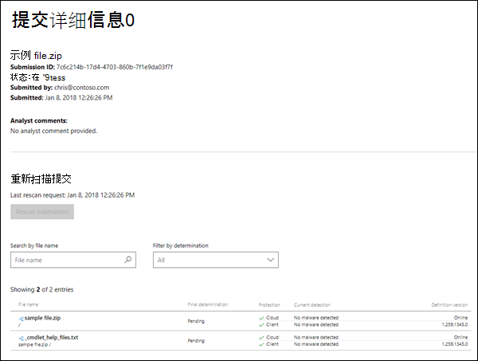

# 将恶意软件和非恶意软件提交给 Microsoft 进行分析

[!INCLUDE [Microsoft 365 Defender rebranding](../includes/microsoft-defender-for-office.md)]

**适用对象**
- [Exchange Online Protection](exchange-online-protection-overview.md)
- [Microsoft Defender for Office 365 计划 1 和计划 2](defender-for-office-365.md)
- [Microsoft 365 Defender](../defender/microsoft-365-defender.md)

> [!NOTE]
> 如果你是拥有多个邮箱Exchange Online管理员，我们建议你使用 Microsoft 365 Defender 门户中的"提交"页面。  有关详细信息，请参阅使用[管理员提交将可疑的垃圾邮件、网络钓鱼、URL 和文件提交到 Microsoft。](admin-submission.md)

在Microsoft 365没有 Exchange Online 邮箱的 Exchange Online 或独立 Exchange Online Protection (EOP) 组织中，EOP 包括自动启用的反恶意软件保护。 有关详细信息，请参阅 EOP 中的反 [恶意软件保护](anti-malware-protection.md)。

多年来，你可能已听到以下最佳做法：

- 避免打开看起来可疑的邮件。
- 永远不要打开来自你不了解的人的附件。
- 避免打开邮件中的附件，这些附件会促使你打开或单击附件。

但是，如果您收到包含可疑附件的邮件，该怎么办？ 或者，如果您怀疑计算机或设备被通过筛选器的电子邮件附件感染了，应该怎么做？ 在这些情况下，您应将恶意软件附件提交给 Microsoft。 相反，如果电子邮件中的附件被错误地标识为恶意软件，也可以提交该附件。

## 开始前，有必要了解什么？

- 附件包含脚本或其他恶意可执行文件的邮件被视为恶意软件，您可以使用本文中的过程报告它们。

- 包含恶意站点链接的邮件被视为垃圾邮件。 有关报告垃圾邮件和非垃圾邮件的信息，请参阅向 Microsoft 报告邮件 [和文件](report-junk-email-messages-to-microsoft.md)。

## 将恶意软件文件提交给 Microsoft

转到 Microsoft 安全智能 网站 <https://www.microsoft.com/wdsi/filesubmission> 以提交文件。 若要接收分析更新，请登录到网站，或输入有效的电子邮件地址。 我们建议你使用 Microsoft 工作或学校帐户。

上传一个或多个文件后，请注意为示例提交创建的提交 **ID** (例如 `7c6c214b-17d4-4703-860b-7f1e9da03f7f` ，) 。

收到示例后，我们将进行调查。 如果我们确定示例文件是恶意文件，我们将采取纠正措施来防止恶意软件被检测。

如果继续收到受感染的邮件或附件，则应该从电子邮件复制邮件头，并联系 Microsoft 客户服务和支持人员以寻求进一步的帮助。 请确保还准备好提交 **ID。**

## 向 Microsoft 提交非恶意软件文件

还可以将你认为被错误地标识为恶意软件的文件提交到网站 (仅对问题选择&quot;否&quot;，&quot;你认为此文件包含恶意软件？") 。 

收到示例后，我们将进行调查。 如果我们确定示例文件是干净的，我们将采取纠正措施以防止该文件被检测为恶意软件。
