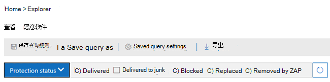
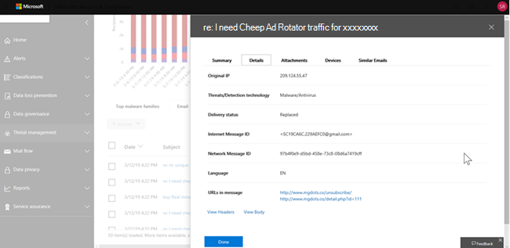
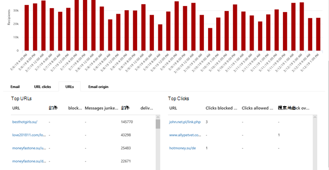
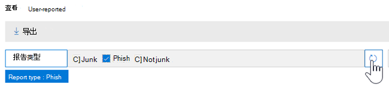
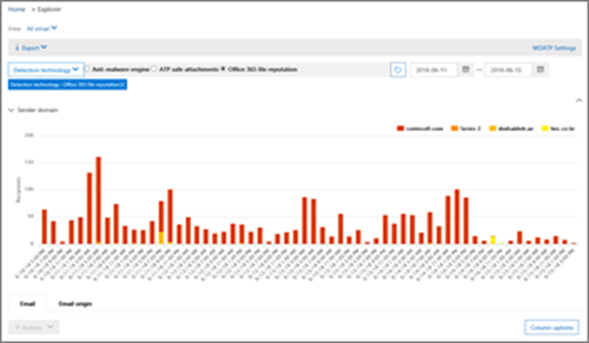
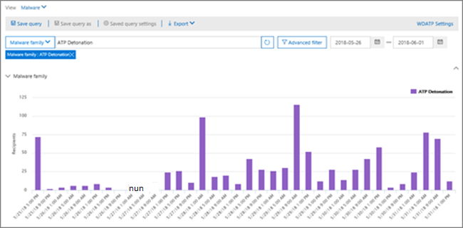
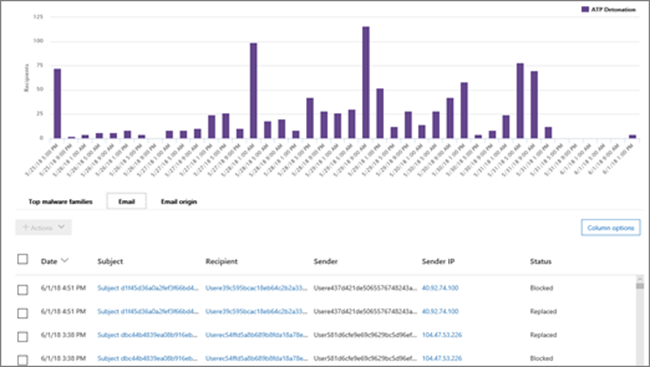

# 威胁资源管理器中的视图和实时检测

[!INCLUDE [Microsoft 365 Defender rebranding](../includes/microsoft-defender-for-office.md)]

**适用对象**
- [Microsoft Defender for Office 365 计划 1 和计划 2](defender-for-office-365.md)
- [Microsoft 365 Defender](../defender/microsoft-365-defender.md)

[威胁](threat-explorer.md) (和实时检测报告) 是一款功能强大的近实时工具，可帮助安全运营团队调查和响应 Microsoft 365 Defender 门户中的威胁。 Explorer (和实时检测报告) 显示有关 Office 365 中电子邮件和文件中可疑恶意软件和网络钓鱼的信息，以及组织面临的其他安全威胁和风险。

- 如果你有[Microsoft Defender for Office 365](defender-for-office-365.md)计划 2，则你有资源管理器。
- 如果你有 Microsoft Defender for Office 365计划 1，则你有实时检测。

首次打开 Explorer (或实时检测报告) 时，默认视图会显示过去 7 天的电子邮件恶意软件检测。 此报告还可以显示 Microsoft Defender 进行Office 365检测，如[保险箱 链接](safe-links.md)检测到的恶意 URL，以及由"附件"保险箱[恶意文件](safe-attachments.md)。 可以修改此报告以显示过去 3 (0 天内使用 Microsoft Defender Office 365 P2 付费订阅) 。 试用版订阅仅包含过去七天的数据。

****

|订阅|实用工具|数据天数|
|---|---|---|
|Microsoft Defender for Office 365 P1 试用版|实时检测|7 |
|Microsoft Defender for Office 365 P1 付费|实时检测|30|
|Microsoft Defender for Office 365 P1 付费测试 Defender Office 365 P2 试用版|威胁资源管理器|7 |
|Microsoft Defender for Office 365 P2 试用版|威胁资源管理器|7 |
|Microsoft Defender for Office 365 P2 付费|威胁资源管理器|30|
|

> [!NOTE]
> 我们即将扩展 Explorer (和实时检测，) 试用租户的数据保留和搜索限制从 7 天扩展到 30 天。 此更改作为第 70544 号路线图项的一部分进行跟踪，当前处于推出阶段。

使用 **"视图** "菜单更改显示的信息。 工具提示可帮助您确定要使用哪个视图。

选择视图后，可以应用筛选器并设置查询以执行进一步分析。 以下各节简要概述了资源管理器中提供的各种视图 (或实时检测) 。

## 电子邮件>恶意软件

若要查看此报告，在资源管理器 (或实时检测中，) **查看** \> **电子邮件** \> **恶意软件"。** 此视图显示有关被标识为包含恶意软件的电子邮件的信息。

单击 **"** 发件人"打开查看选项列表。 使用此列表按发件人、收件人、发件人域、主题、检测技术、保护状态等查看数据。

例如，若要了解对检测到的电子邮件采取的操作，请选择 **列表中的"保护** 状态"。 选择一个选项，然后单击"刷新"按钮以将筛选器应用到报表。

在图表下方，查看有关特定消息的更多详细信息。 当您在列表中选择一个项目时，将打开一个飞出窗格，您可以在其中了解有关所选项目的详细信息。

## 电子邮件>钓鱼邮件

若要查看此报告，在 Explorer (或实时检测中，) **查看** \> **电子邮件** \> **钓鱼邮件**"。 此视图显示标识为网络钓鱼尝试的电子邮件。

单击 **"** 发件人"打开查看选项列表。 使用此列表按发件人、收件人、发件人域、发件人 IP、URL 域、单击裁定等查看数据。

例如，若要了解用户单击标识为网络钓鱼尝试的 URL 时采取的操作，请选择列表中的"单击裁定"，选择一个或多个选项，然后单击"刷新"按钮。

在图表下方，查看有关特定邮件、URL 单击、URL 和电子邮件来源的更多详细信息。

当您在列表中选择一个项目（如检测到的 URL）时，将打开一个飞出窗格，您可以在其中了解有关所选项目的详细信息。

## 电子邮件>提交

若要查看此报告，在资源管理器 (或实时检测中，) **查看** \> **电子邮件** \> **提交"。** 此视图显示用户报告为垃圾邮件、非垃圾邮件或钓鱼电子邮件的电子邮件。

单击 **"** 发件人"打开查看选项列表。 使用此列表可查看发件人、收件人、报告类型 (用户确定电子邮件是垃圾邮件、非垃圾邮件或钓鱼邮件) 等。

例如，若要查看有关报告为网络钓鱼尝试的电子邮件的信息，请单击"发件人报告类型"，选择"网络钓鱼"， \> 然后单击"刷新"按钮。

在图表下方，查看有关特定电子邮件（如主题行、发件人 IP 地址、将邮件报告为垃圾邮件、非垃圾邮件或网络钓鱼的用户等）的更多详细信息。

选择列表中的某个项以查看其他详细信息。

## 电子邮件>所有电子邮件

若要查看此报告，在资源管理器中，选择 **查看** \> **电子邮件** \> **所有邮件**。 此视图显示电子邮件活动（包括由于网络钓鱼或恶意软件而标识为恶意的电子邮件）以及所有非恶意邮件 (普通电子邮件、垃圾邮件和批量邮件) 。

> [!NOTE]
> 如果收到读取要显示 **的数据** 过多的错误，请添加筛选器，如有必要，缩小正在查看的日期范围。

若要应用筛选器，请选择" **发件人**"，选择列表中的某个项目，然后单击"刷新"按钮。 在我们的示例中， **我们将检测技术** 用作筛选器 (提供了多个可用的) 。 查看发件人、发件人域、收件人、主题、附件文件名、恶意软件系列、Office 365) 中威胁防护功能和策略采取的保护状态 (操作、检测技术 (检测) 等。

在图表下方，查看有关特定电子邮件的更多详细信息，如主题行、收件人、发件人、状态等。

## 恶意软件>内容

若要查看此报告，在资源管理器 (或实时检测中，) 查看 \> **内容** \> **恶意软件"。** 此视图显示 Microsoft Defender 在 Office 365 Online、SharePoint 和 OneDrive for Business Microsoft Teams 中被 Microsoft Defender 标识[为恶意Microsoft Teams。](mdo-for-spo-odb-and-teams.md)

按恶意软件系列、检测技术 (检测恶意软件) ，以及工作负荷 (OneDrive、SharePoint或Teams) 。

在图表下方，查看有关特定文件的更多详细信息，例如附件文件名、工作负荷、文件大小、上次修改文件的人等。

## 单击筛选功能

使用资源管理器 (和实时检测) ，只需单击一下即可应用筛选器。 单击图例中的某个项目，该项目将成为报表的筛选器。 例如，假设我们正在资源管理器中查看恶意软件视图：

单击 **此图中的 ATP** 触发将产生如下所示的视图：

在此视图中，我们现在查看由附件 触发保险箱[数据](safe-attachments.md)。 在图表下方，我们可以看到有关附件由"附件"检测到的特定保险箱的详细信息。

选择一个或多个项目将激活"操作"菜单，该菜单提供了多个选项，可以从中选择所选项目 (选择) 。

通过单击进行筛选并导航到特定详细信息，可以节省调查威胁的很多时间。

## 查询和筛选器

Explorer (以及实时检测报告) 具有多个强大的筛选器和查询功能，可让你深入了解详细信息，例如首要目标用户、主要恶意软件系列、检测技术等。 每类报告都提供查看和浏览数据的各种方法。

> [!IMPORTANT]
> 请勿在 Explorer 查询栏中使用通配符（如星号或问号 (或实时检测) 。 在"主题"字段中搜索电子邮件时，Explorer (或实时检测) 将执行部分匹配并产生类似于通配符搜索的结果。
