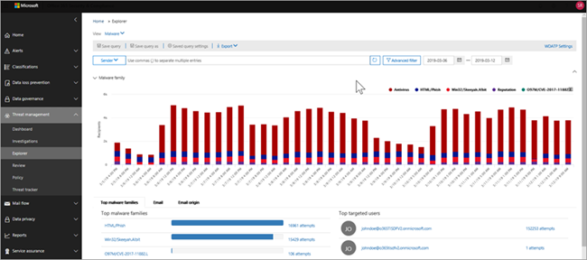

# 威胁资源管理器中的视图和实时检测Views in Threat Explorer and real-time detections

[!INCLUDE [Microsoft 365 Defender rebranding](../includes/microsoft-defender-for-office.md)]

**适用对象****Applies to**
- [Microsoft Defender for Office 365 计划 1 和计划 2Microsoft Defender for Office 365 plan 1 and plan 2](office-365-atp.md)
- [Microsoft 365 DefenderMicrosoft 365 Defender](../mtp/microsoft-threat-protection.md)

[威胁](threat-explorer.md) 资源管理器 (实时检测报告) 是一个功能强大的近实时工具，可帮助安全运营团队调查和响应安全与合规中心&威胁。[Threat Explorer](threat-explorer.md) (and the real-time detections report) is a powerful, near real-time tool to help Security Operations teams investigate and respond to threats in the Security & Compliance Center. Explorer (和实时检测报告) 显示有关 Office 365 电子邮件和文件中可疑恶意软件和网络钓鱼的信息，以及组织面临的其他安全威胁和风险。Explorer (and the real-time detections report) displays information about suspected malware and phish in email and files in Office 365, as well as other security threats and risks to your organization.

- 如果你有 [Microsoft Defender for Office 365](office-365-atp.md) 计划 2，则你有资源管理器。If you have [Microsoft Defender for Office 365](office-365-atp.md) Plan 2, then you have Explorer.
- 如果你有适用于 Office 365 计划 1 的 Microsoft Defender，则具有实时检测。If you have Microsoft Defender for Office 365 Plan 1, then you have real-time detections.

首次打开资源管理器 (或实时检测报告) ，默认视图显示过去 7 天内的电子邮件恶意软件检测。When you first open Explorer (or the real-time detections report), the default view shows email malware detections for the past 7 days. 此报告还可以显示 Microsoft Defender for Office 365 检测，如安全链接检测到的恶意 URL 和安全附件检测到的[恶意文件](atp-safe-attachments.md)。This report can also show Microsoft Defender for Office 365 detections, such as malicious URLs detected by [Safe Links](atp-safe-links.md), and malicious files detected by [Safe Attachments](atp-safe-attachments.md). 此报告可修改为显示过去 30 天的数据 (Microsoft Defender for Office 365 P2 付费订阅) 。This report can be modified to show data for the past 30 days (with a Microsoft Defender for Office 365 P2 paid subscription). 试用版订阅将仅包含过去七天的数据。Trial subscriptions will include data for the past seven days only.

****

|订阅Subscription|实用工具Utility|数据天数Days of Data|
|---|---|---|
|Microsoft Defender for Office 365 P1 试用版Microsoft Defender for Office 365 P1 trial|实时检测Real-time detections|7 7|
|Microsoft Defender for Office 365 P1 付费Microsoft Defender for Office 365 P1 paid|实时检测Real-time detections|3030|
|Microsoft Defender for Office 365 P1 付费测试 Defender for Office 365 P2 试用版Microsoft Defender for Office 365 P1 paid testing Defender for Office 365 P2 trial|威胁资源管理器Threat Explorer|7 7|
|Microsoft Defender for Office 365 P2 试用版Microsoft Defender for Office 365 P2 trial|威胁资源管理器Threat Explorer|7 7|
|Microsoft Defender for Office 365 P2 付费Microsoft Defender for Office 365 P2 paid|威胁资源管理器Threat Explorer|3030|
|

> [!NOTE]
> 我们很快就会将 Explorer (和实时检测) 试用租户的数据保留和搜索限制从 7 天扩展到 30 天。We will soon be extending the Explorer (and Real-time detections) data retention and search limit for trial tenants from 7 to 30 days. 此更改作为路线图项 no. 70544 的一部分进行跟踪，当前处于推出阶段。This change is being tracked as part of roadmap item no. 70544, and is currently in a roll-out phase.

使用 **"视图** "菜单更改显示的信息。Use the **View** menu to change what information is displayed. 工具提示可帮助你确定要使用哪个视图。Tooltips help you determine which view to use.

选择视图后，可以应用筛选器并设置查询以执行进一步分析。Once you have selected a view, you can apply filters and set up queries to conduct further analysis. 以下各节简要概述了资源管理器中提供的各种 (或实时检测) 。The following sections provide a brief overview of the various views available in Explorer (or real-time detections).

## 电子邮件>恶意软件Email > Malware

若要查看此报告，在资源管理器 (或实时检测中，) **查看** \> **电子邮件** \> **恶意软件**。To view this report, in Explorer (or real-time detections), choose **View** \> **Email** \> **Malware**. 此视图显示有关标识为包含恶意软件的电子邮件的信息。This view shows information about email messages that were identified as containing malware.

单击 **"** 发件人"打开查看选项列表。Click **Sender** to open your list of viewing options. 使用此列表按发件人、收件人、发件人域、主题、检测技术、保护状态等查看数据。Use this list to view data by sender, recipients, sender domain, subject, detection technology, protection status, and more.

例如，若要了解对检测到的电子邮件采取的操作，请选择 **列表中的"保护** 状态"。For example, to see what actions were taken on detected email messages, choose **Protection status** in the list. 选择一个选项，然后单击"刷新"按钮以将筛选器应用到报表。Select an option, and then click the Refresh button to apply that filter to your report.

在图表下方，查看有关特定消息的更多详细信息。Below the chart, view more details about specific messages. 在列表中选择某个项目时，将打开一个飞出窗格，您可以在其中了解有关所选项目的详细信息。When you select an item in the list, a fly-out pane opens, where you can learn more about the item you selected.

## 电子邮件>钓鱼邮件Email > Phish

若要查看此报告，在资源管理器 (或实时检测中，) **查看** \> **电子邮件** \> **钓鱼邮件**。To view this report, in Explorer (or real-time detections), choose **View** \> **Email** \> **Phish**. 此视图显示标识为网络钓鱼尝试的电子邮件。This view shows email messages identified as phishing attempts.

单击 **"** 发件人"打开查看选项列表。Click **Sender** to open your list of viewing options. 使用此列表按发件人、收件人、发件人域、发件人 IP、URL 域、单击裁定等查看数据。Use this list to view data by sender, recipients, sender domain, sender IP, URL domain, click verdict, and more.

例如，若要了解用户单击标识为网络钓鱼尝试的 URL 时采取的操作，请选择列表中的"单击裁定"，选择一个或多个选项，然后单击"刷新"按钮。For example, to see what actions were taken when people clicked on URLs that were identified as phishing attempts, choose **Click verdict** in the list, select one or more options, and then click the Refresh button.

在图表下方，查看有关特定邮件、URL 单击、URL 和电子邮件源的更多详细信息。Below the chart, view more details about specific messages, URL clicks, URLs, and email origin.

在列表中选择某个项目（如检测到的 URL）时，将打开一个飞出窗格，您可以在其中了解有关所选项目的详细信息。When you select an item in the list, such as a URL that was detected, a fly-out pane opens, where you can learn more about the item you selected.

## 电子邮件>提交Email > Submissions

若要查看此报告，在资源管理器 (或实时检测中，) **查看** \> **电子邮件** \> **提交**。To view this report, in Explorer (or real-time detections), choose **View** \> **Email** \> **Submissions**. 此视图显示用户报告为垃圾邮件、非垃圾邮件或网络钓鱼电子邮件的电子邮件。This view shows email that users have reported as junk, not junk, or phishing email.

单击 **"** 发件人"打开查看选项列表。Click **Sender** to open your list of viewing options. 使用此列表可以查看发件人、收件人、报告类型 (用户确定电子邮件是垃圾邮件、非垃圾邮件或钓鱼邮件) 等。Use this list to view information by sender, recipients, report type (the user's determination that the email was junk, not junk, or phish), and more.

例如，若要查看有关报告为网络钓鱼尝试的电子邮件的信息，请单击"发件人报告类型"，选择"网络钓鱼"，然后单击"刷新 \> "按钮。 For example, to view information about email messages that were reported as phishing attempts, click **Sender** \> **Report type**, select **Phish**, and then click the Refresh button.

在图表下方，查看有关特定电子邮件的更多详细信息，例如主题行、发件人的 IP 地址、将邮件报告为垃圾邮件的用户、非垃圾邮件或网络钓鱼邮件等。Below the chart, view more details about specific email messages, such as subject line, the sender's IP address, the user that reported the message as junk, not junk, or phish, and more.

选择列表中的某个项以查看其他详细信息。Select an item in the list to view additional details.

## 电子邮件>所有电子邮件Email > All email

若要查看此报告，在资源管理器中，选择 **查看** \> **电子邮件** \> **全部邮件**。To view this report, in Explorer, choose **View** \> **Email** \> **All mail**. 此视图显示电子邮件活动的全视图，包括由于网络钓鱼或恶意软件而标识为恶意的电子邮件，以及所有非恶意邮件 (普通电子邮件、垃圾邮件和批量邮件) 。This views shows an all-up view of email activity, including email identified as malicious due to phishing or malware, as well all non-malicious mail (normal email, spam, and bulk mail).

> [!NOTE]
> 如果出现错误，显示的数据过多，请添加筛选器，如有必要，缩小正在查看的日期范围。If you get an error that reads **Too much data to display**, add a filter and, if necessary, narrow the date range you're viewing.

若要应用筛选器，请选择 **"发件人**"，选择列表中的项目，然后单击"刷新"按钮。To apply a filter, choose **Sender**, select an item in the list, and then click the Refresh button. 在我们的示例中，我们使用检测 **技术** 作为筛选器 (提供了多个) 。In our example, we used **Detection technology** as a filter (there are several options available). 按发件人、发件人的域、收件人、主题、附件文件名、恶意软件系列、Office 365) 中的威胁防护功能和策略执行的保护状态 (操作、检测技术 (如何检测) 等查看信息。View information by sender, sender's domain, recipients, subject, attachment filename, malware family, protection status (actions taken by your threat protection features and policies in Office 365), detection technology (how the malware was detected), and more.

在图表下方，查看有关特定电子邮件（如主题行、收件人、发件人、状态等）的更多详细信息。Below the chart, view more details about specific email messages, such as subject line, recipient, sender, status, and so on.

## 恶意软件>内容Content > Malware

若要查看此报告，在资源管理器 (或实时检测中，) **查看** \> **内容** \> **恶意软件**。To view this report, in Explorer (or real-time detections), choose **View** \> **Content** \> **Malware**. 此视图显示 [SharePoint Online、OneDrive for Business](atp-for-spo-odb-and-teams.md)和 Microsoft Teams 中的 Microsoft Defender for Office 365 标识为恶意文件。This view shows files that were identified as malicious by [Microsoft Defender for Office 365 in SharePoint Online, OneDrive for Business, and Microsoft Teams](atp-for-spo-odb-and-teams.md).

按恶意软件系列、检测技术 (恶意软件检测方法、) 和工作负载 (OneDrive、SharePoint 或 Teams) 。View information by malware family, detection technology (how the malware was detected), and workload (OneDrive, SharePoint, or Teams).

在图表下方，查看有关特定文件的更多详细信息，例如附件文件名、工作负载、文件大小、上次修改文件的人等。Below the chart, view more details about specific files, such as attachment filename, workload, file size, who last modified the file, and more.

## 点击筛选功能Click-to-filter capabilities

使用资源管理器 (和实时检测) ，单击即可应用筛选器。With Explorer (and real-time detections), you can apply a filter in a click. 单击图例中的项目，该项目将成为报表的筛选器。Click an item in the legend, and that item becomes a filter for the report. 例如，假设我们正在资源管理器中查看恶意软件视图：For example, suppose we are looking at the Malware view in Explorer:

单击 **此图表中的 ATP** 触发将产生如下所示的视图：Clicking **ATP Detonation** in this chart results in a view like this:

在此视图中，我们现在查看由安全附件触发 [的文件的数据](atp-safe-attachments.md)。In this view, we are now looking at data for files that were detonated by [Safe Attachments](atp-safe-attachments.md). 在图表下方，我们可以看到有关具有安全附件检测到的附件的特定电子邮件的详细信息。Below the chart, we can see details about specific email messages that had attachments that were detected by Safe Attachments.

选择一个或多个项目将激活"操作"菜单，该菜单提供了多个选项，可以从中选择所选项目 () 。Selecting one or more items activates the **Actions** menu, which offers several choices from which to choose for the selected item(s).

通过单击进行筛选并导航到特定详细信息，可以节省调查威胁的很多时间。The ability to filter in a click and navigate to specific details can save you a lot of time in investigating threats.

## 查询和筛选器Queries and filters

资源管理器 (以及实时检测报告) 具有多个功能强大的筛选器和查询功能，可让你深入了解详细信息，例如首要目标用户、主要恶意软件系列、检测技术等。Explorer (as well as the real-time detections report) has several powerful filters and querying capabilities that enable you to drill into details, such as top targeted users, top malware families, detection technology and more. 每类报告都提供查看和浏览数据的各种方法。Each kind of report offers a variety of ways to view and explore data.

> [!IMPORTANT]
> 请勿在 Explorer (查询栏中使用通配符（如星号或问号）或) 。Do not use wildcard characters, such as an asterisk or a question mark, in the query bar for Explorer (or real-time detections). 在"主题"字段中搜索电子邮件时，Explorer (或实时检测) 将执行部分匹配并生成类似于通配符搜索的结果。When you search on the **Subject field** for email messages, Explorer (or real-time detections) will perform partial matching and yield results similar to a wildcard search.
