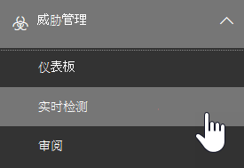
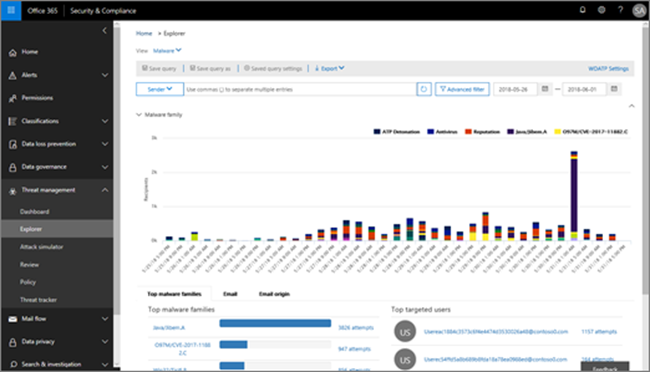
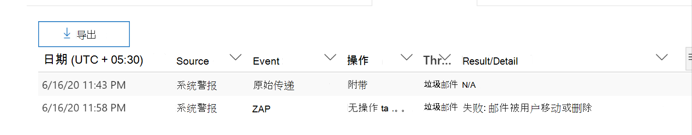
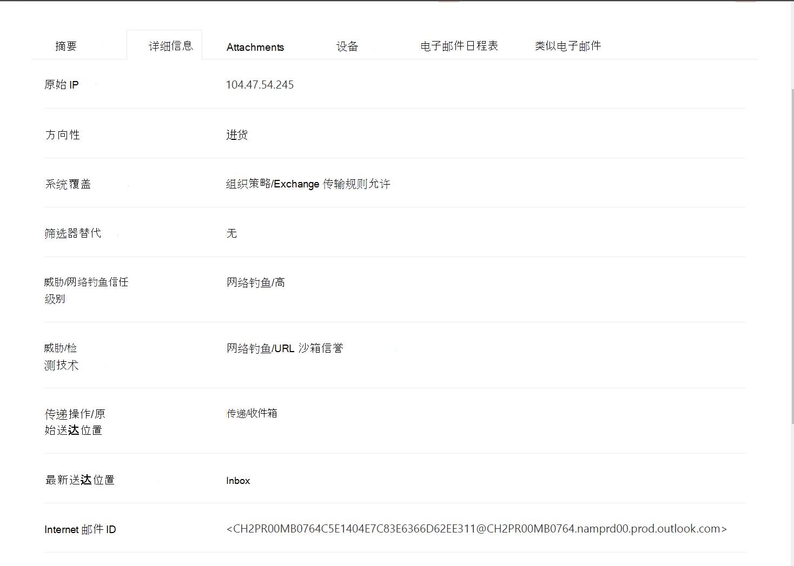
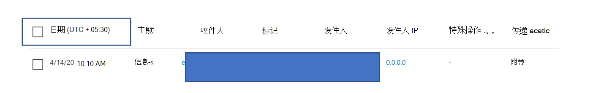
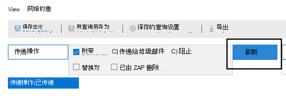
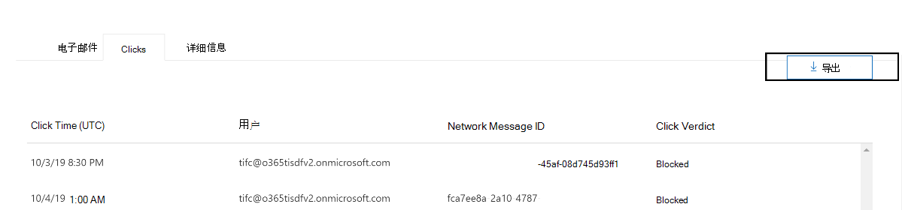
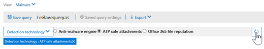
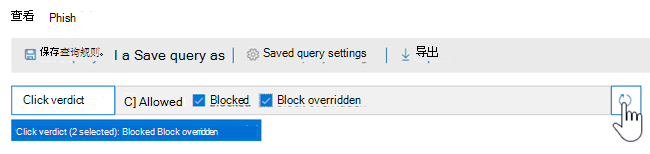
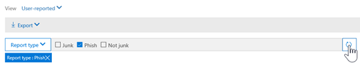

# 威胁资源管理器和实时检测

**适用对象**
- [Microsoft Defender for Office 365 计划 1 和计划 2](defender-for-office-365.md)
- [Microsoft 365 Defender](../defender/microsoft-365-defender.md)

如果你的组织拥有 [适用于 Office 365 的 Microsoft Defender](defender-for-office-365.md)，并且你拥有必要的权限，则 你拥有资源管理器或实时检测 (以前是实时 *报告-查看* 新增 [功能！)](#new-features-in-threat-explorer-and-real-time-detections)。 在安全&中心，转到"**威胁** 管理"，然后选择"**资源管理器**"或 **"实时检测"**。

|借助 Microsoft Defender for Office 365计划 2，可以看到：|借助 Microsoft Defender for Office 365 计划 1，可以看到：|
|---|---|
|||

资源管理器或实时检测可帮助安全运营团队高效地调查和响应威胁。 报告类似于下图：

通过此报告，您可以：

- [查看由安全Microsoft 365检测到的恶意软件](#see-malware-detected-in-email-by-technology)
- [查看网络钓鱼 URL 并单击裁定数据](#view-phishing-url-and-click-verdict-data)
- [从资源管理器 (](#start-automated-investigation-and-response) Defender for Office 365 计划 2 中的视图启动自动调查和响应) 
- [调查恶意电子邮件等](#more-ways-to-use-explorer-and-real-time-detections)

## 威胁搜寻体验改进

### 适用于浏览器/实时Office 365中警报的 Defender 警报 ID 简介

今天，如果你从警报导航到威胁资源管理器，它将在资源管理器中打开一个筛选视图，其中由警报策略 ID (策略 ID 筛选的视图是警报策略设置的唯一标识符) 。
我们正在通过引入警报 ID (在威胁资源管理器和实时检测中查看) 下方的警报 ID 示例，以便查看与特定警报相关的邮件以及电子邮件数量，从而使此集成更具相关性。 您还可以查看邮件是否属于警报，以及从该邮件导航到特定警报。

查看单个警报时，警报 ID 在 URL 中可用;示例为 `https://protection.office.com/viewalerts?id=372c9b5b-a6c3-5847-fa00-08d8abb04ef1`。

> [!div class="mx-imgBorder"]
> 

> [!div class="mx-imgBorder"]
> 

### 将资源管理器 (和实时检测) 试用租户的数据保留和搜索限制从 7 天扩展到 30 天

作为此更改的一部分，你将能够在威胁资源管理器/实时检测中搜索和筛选 30 天内的电子邮件数据 (这一点比针对 Office P1 和 P2 试用租户的 Defender 前 7 天) 增加。
这不会影响 P1 和 P2/E5 客户的任何生产租户，这已具有 30 天的数据保留和搜索功能。

### 更新了威胁资源管理器的记录导出限制

作为此更新的一部分，可以从威胁资源管理器导出的电子邮件记录的行数从 9990 增加到 200，000 条记录。 当前可以导出的列集将保持不变，但行数将自当前限制开始增加。

### 威胁资源管理器中的标记

> [!NOTE]
> 用户标记功能在预览 *版* 中，不可供所有人使用，并且可能会更改。 有关发布计划的信息，请查看Microsoft 365路线图。

用户标记标识 Microsoft Defender for Office 365 中的特定用户组。 有关标记（包括许可和配置）详细信息，请参阅 [用户标记](user-tags.md)。

在威胁资源管理器中，可以在以下体验中查看有关用户标记的信息。

#### 电子邮件网格视图

**电子邮件网格** 中的"标记"列包含已应用于发件人或收件人邮箱的所有标记。 默认情况下，优先显示优先帐户等系统标记。

> [!div class="mx-imgBorder"]
> 

#### 筛选

可以使用标记作为筛选器。 仅跨优先级帐户或特定用户标记方案进行智能寻线。 还可以排除具有特定标记的结果。 将此功能与其他筛选器相结合，以缩小调查范围。

> [!div class="mx-imgBorder"]
> 

#### 电子邮件详细信息飞出

若要查看发件人和收件人的单个标记，请选择主题以打开邮件详细信息飞出。 在 **"摘要"** 选项卡上，如果电子邮件存在发件人和收件人标记，则分别显示它们。
有关发件人和收件人的单个标记的信息还扩展到导出的 CSV 数据，您可以在两个单独的列中查看这些详细信息。

> [!div class="mx-imgBorder"]
> 

URL 单击飞出也显示标记信息。 若要查看它，请转到网络钓鱼或所有电子邮件视图，然后转到 **URL** 或 **URL 单击** 选项卡。选择单个 URL 飞出视图有关该 URL 的单击的其他详细信息，包括与该单击关联的标记。

### 更新的时间线视图

> [!div class="mx-imgBorder"]
> 
>
观看[此视频](https://www.youtube.com/watch?v=UoVzN0lYbfY&list=PL3ZTgFEc7LystRja2GnDeUFqk44k7-KXf&index=4)了解更多信息。

## 威胁搜寻体验的改进 (即将推出的) 

### 更新了电子邮件的威胁信息

我们专注于改进平台和数据质量，以提高电子邮件记录的数据准确性和一致性。 改进包括将传递前和传递后信息（如作为 ZAP 过程的一部分对电子邮件执行的操作）合并到单个记录中。 还包括垃圾邮件裁定、实体级别威胁 (，例如，哪些 URL 是恶意) ，以及最新的送达位置。

这些更新后，你将看到每封邮件的单个条目，而不管影响邮件的不同传递后事件如何。 操作可能包括 ZAP、手动修正 (这意味着管理员操作) 、动态传递等。

除了显示恶意软件和网络钓鱼威胁之外，您还可以看到与电子邮件关联的垃圾邮件裁定。 在电子邮件中，查看与电子邮件关联的所有威胁以及相应的检测技术。 电子邮件可以具有零个、一个或多个威胁。 你将在电子邮件飞出 **的详细信息部分看到** 当前威胁。 对于恶意软件 (网络钓鱼等多个威胁) ，检测技术字段显示威胁检测映射，这是识别威胁的检测技术。

检测技术集现在包括新的检测方法以及垃圾邮件检测技术。 您可以使用同一组检测技术跨恶意软件、网络钓鱼、所有电子邮件 (不同的电子邮件视图筛选) 。

> [!NOTE]
> 裁定分析不一定与实体关联。 例如，电子邮件可能分类为网络钓鱼或垃圾邮件，但没有标记有网络钓鱼/垃圾邮件裁定的 URL。 这是因为在分配裁定之前，筛选器还会评估电子邮件的内容和其他详细信息。

#### URL 中的威胁

现在，可以在"电子邮件"飞出"详细信息"选项卡上看到 URL **的特定** 威胁。威胁可能是 *恶意软件、**网络钓鱼*、*垃圾邮件* 或 *无*) 

> [!div class="mx-imgBorder"]
> 

### 更新了日程表视图 (即将推出的) 

> [!div class="mx-imgBorder"]
> 

时间线视图标识所有传递和传递后事件。 它包括有关在这些事件的子集时确定的威胁的信息。 时间线视图还提供了有关对项目执行 (操作（如 ZAP 或手动修正) ）的信息，以及该操作的结果。 时间线视图信息包括：

- **源：** 事件的源。 它可以是管理员/系统/用户。
- **事件：** 包括顶级事件，如原始传递、手动修正、ZAP、提交和动态传递。
- **操作：** 作为 ZAP 或管理员操作一部分执行的特定 (例如，软删除) 。
- **威胁：** 涵盖 (识别的恶意软件、网络钓鱼) 垃圾邮件威胁。
- **结果/详细信息：** 有关操作结果的信息，例如它是否作为 ZAP/admin 操作一部分执行。

### 原始和最新的送达位置

目前，我们在电子邮件网格和电子邮件浮出控件中显示传递位置。 The **Delivery location** field is getting renamed **_Original delivery location_*_.我们还将引入另一个字段 _*_Latest 送达位置_**。

**原始送达** 位置将提供有关电子邮件最初送达位置的更多信息。 **最新送达位置** 将说明电子邮件在系统操作（如 *ZAP* ）或管理员操作（如 *移动到已删除项目）之后登录的位置*。 最新送达位置旨在告知管理员邮件的上次已知位置传递后或任何系统/管理员操作。 它不包括对电子邮件的任何最终用户操作。 例如，如果用户删除了邮件或将邮件移动到 archive/pst，则邮件"传递"位置将不会更新。 但是，如果系统操作更新了位置 (例如 ZAP 导致电子邮件移动到隔离邮箱) ，则最新送达位置将显示为"隔离"。

> [!div class="mx-imgBorder"]
> 

> [!NOTE]
> 在某些情况下，传递位置 **和****传递操作** 可能显示为"未知"：
>
> - 如果 **邮件已送达**，您可能会将"送达位置"和"送达位置"视为"未知"，但收件箱规则将邮件移动到默认文件夹 (如草稿或存档) 而不是"收件箱"或"垃圾邮件"文件夹。
>
> - **如果已尝试** 执行管理/系统操作（ (ZAP) ，但未找到邮件，则最新的送达位置可能未知。 通常，该操作发生在用户移动或删除邮件之后。 在这种情况下，请验证 **日程表视图中的"结果/** 详细信息"列。 查找"用户移动或删除的邮件"语句。

> [!div class="mx-imgBorder"]
> 

### 其他操作

*在电子邮件* 传递后应用了其他操作。 它们可以包括 *ZAP*、管理员  (手动修正操作（如软删除) 、动态传递和重新 *处理 (）* 针对被反向检测为) 。

> [!NOTE]
> 作为挂起更改的一部分，当前在"传递操作"筛选器中显示"由 ZAP 删除"值将消失。 你将有一种方法通过"其他操作"通过 ZAP 尝试搜索 **所有电子邮件**。

> [!div class="mx-imgBorder"]
> 

### 系统覆盖

*系统覆盖* 使您能够对邮件的预定传递位置进行例外。 根据筛选堆栈确定的威胁和其他检测，你可以覆盖系统提供的传递位置。 可以通过租户或用户策略设置系统覆盖，以根据策略的建议传递邮件。 替代可以标识由于配置差异（例如，用户设置的发件人策略范围过宽保险箱发送恶意邮件的意外传递。 这些替代值可以是：

- 用户策略允许：用户在邮箱级别创建策略以允许域或发件人。

- 被用户策略阻止：用户在邮件框级别创建策略以阻止域或发件人。

- 组织策略允许：组织的安全团队设置策略或 Exchange 邮件流规则 (也称为传输规则) ，以允许组织中的用户使用发件人和域。 这适用于一组用户或整个组织。

- 被组织策略阻止：组织的安全团队设置策略或邮件流规则，以阻止组织中用户的发件人、域、邮件语言或源 IP。 这可应用于一组用户或整个组织。

- 组织策略阻止的文件扩展名：组织的安全团队通过反恶意软件策略设置阻止文件扩展名。 这些值现在将显示在电子邮件详细信息中，以帮助进行调查。 Secops 团队还可使用丰富的筛选功能筛选阻止的文件扩展名。

> [!div class="mx-imgBorder"]
> 

### URL 和单击体验的改进

这些改进包括：

- 显示完整的单击的 URL (包括作为 URL 链接的一) 单击部分的任何查询参数。 目前，URL 域和路径显示在标题栏中。 我们将扩展该信息以显示完整 URL。

- 跨 URL 筛选器修复 (*URL* 与 *URL* 域与 *URL* 域和路径) ：更新会影响对包含 URL/单击裁定的邮件的搜索。 我们启用了协议不可知搜索支持，因此无需使用 ，即可搜索 URL `http`。 默认情况下，除非明确指定了其他值，否则 URL 搜索将映射到 http。 例如：
  - 在"URL、`http://`**URL** 域"和"**URL** 域"和"路径"筛选器字段中使用和不带前缀进行搜索。 搜索应显示相同的结果。
  - 在 URL 中 `https://` 搜索 **前缀**。 未指定任何值时，将 `http://` 假定前缀。
  - `/` 在 URL 路径、 **URL** 域、 **URL** 域和路径字段的开头和结尾 **忽略** 。 `/` 将忽略 **URL** 字段的末尾。

### 网络钓鱼可信度

网络钓鱼可信度有助于确定电子邮件被分类为"网络钓鱼"的可信度。 两个可能的值是 *High* 和 *Normal*。 在初始阶段，此筛选器将仅在威胁资源管理器的网络钓鱼视图中可用。

### ZAP URL 信号

ZAP URL 信号通常用于 ZAP 网络钓鱼警报方案，其中电子邮件被标识为钓鱼邮件，在传递后被删除。 此信号将警报与资源管理器中的相应结果连接。 它是警报的 IIC 之一。

为了改进搜寻过程，我们更新了威胁资源管理器和实时检测，使搜寻体验更加一致。 此处概述了这些更改：

- [时区改进](#timezone-improvements)
- [刷新过程中的更新](#update-in-the-refresh-process)
- [要添加到筛选器的图表深化](#chart-drilldown-to-add-to-filters)
- [在产品信息更新中](#in-product-information-updates)

### 按用户标记筛选

现在，你可以对系统或自定义用户标记进行排序和筛选，以快速了解威胁的范围。 若要了解更多信息，请参阅 [用户标记](user-tags.md)。

> [!IMPORTANT]
> 按用户标记进行筛选和排序目前处于公共预览阶段。 此功能在商业发行之前可能会进行重大修改。 Microsoft 对提供的信息不做出明示或暗示的担保。

> [!div class="mx-imgBorder"]
> 

### 时区改进

你将在门户和导出的数据中查看电子邮件记录的时区。 它将在电子邮件网格、详细信息飞出控件、电子邮件时间线和类似电子邮件等体验中可见，因此电子邮件结果集清晰。

> [!div class="mx-imgBorder"]
> 

### 刷新过程中的更新

一些用户已评论过与自动刷新 (混淆，例如，一旦更改日期，页面就会刷新) ， (筛选器刷新) 。 同样，删除筛选器也会导致自动刷新。 在修改查询时更改筛选器可能会导致搜索体验不一致。 为了解决这些问题，我们将迁移到手动筛选机制。

从体验的角度来看，用户可以从筛选器集和日期) 应用和删除不同的筛选器 (范围，并选择"刷新"按钮以在定义查询后筛选结果。 屏幕上现在也强调刷新按钮。 我们还更新了相关工具提示和产品内文档。

> [!div class="mx-imgBorder"]
> 

### 要添加到筛选器的图表深化

现在，你可以绘制图例值图表以将它们添加为筛选器。 选择" **刷新"** 按钮以筛选结果。

> [!div class="mx-imgBorder"]
> 

### 产品内信息更新

现在可在产品内获得其他详细信息，例如网格内搜索结果的总数 (请参阅下面的) 。 我们改进了标签、错误消息和工具提示，以提供有关筛选器、搜索体验和搜索结果集。

> [!div class="mx-imgBorder"]
> 

## 威胁资源管理器中的扩展功能

### 主要目标用户

今天，我们在电子邮件的"恶意软件"视图中的"主要恶意软件系列"部分公开了主要目标 **用户** 列表。 我们还将在"钓鱼邮件"和"所有电子邮件"视图中扩展此视图。 你将能够看到前五个目标用户，以及每个用户针对相应视图的尝试次数。 例如，对于网络钓鱼视图，你将看到网络钓鱼尝试次数。

你将能够导出目标用户列表（最多 3，000 个）以及每个电子邮件视图的脱机分析尝试次数。 此外，选择尝试次数 (例如，在图像下) 中尝试 13 次将在威胁资源管理器中打开筛选视图，以便你可以查看有关该用户的电子邮件和威胁的更多详细信息。

> [!div class="mx-imgBorder"]
> 

### Exchange传输规则

作为数据扩充的一部分，你将能够看到应用于邮件的所有Exchange ETR (ETR) 传输规则。 此信息将在电子邮件网格视图中提供。 若要查看它，请选择网格 **中的列** 选项，然后从Exchange **添加** 传输规则。 它还将在电子邮件的" **详细信息** "飞出内容上可见。

您将能够查看已应用于邮件的传输规则的 GUID 和名称。 您将能够使用传输规则的名称搜索邮件。 这是一个"包含"搜索，这意味着您也可以执行部分搜索。

> [!IMPORTANT]
> ETR 搜索和名称可用性取决于分配给您的特定角色。 您需要具有以下角色/权限之一才能查看 ETR 名称和搜索。 如果没有分配任何这些角色，则看不到传输规则的名称，也看不到使用 ETR 名称搜索邮件。 但是，您可以在电子邮件详细信息中查看 ETR 标签和 GUID 信息。 电子邮件网格、电子邮件飞出、筛选器和导出中的其他记录查看体验不受影响。
>
> - 仅 EXO - 数据丢失防护：全部
> - 仅 EXO - O365SupportViewConfig：全部
> - Microsoft Azure Active Directory或 EXO - 安全管理员：全部
> - AAD或 EXO - 安全读者：全部
> - 仅 EXO - 传输规则：全部
> - 仅 EXO - View-Only配置：全部
>
> 在电子邮件网格、"详细信息"飞出控件和导出的 CSV 中，ETR 将显示一个名称/GUID，如下所示。
>
> > [!div class="mx-imgBorder"]
> > 

### 入站连接器

连接器是一组说明，用于自定义电子邮件在组织或组织Microsoft 365 Office 365流。 它们使您能够应用任何安全限制或控件。 在威胁资源管理器中，你现在可以查看与电子邮件相关的连接器，然后使用连接器名称搜索电子邮件。

连接器的搜索本质上是"包含"的，这意味着部分关键字搜索也应正常工作。 在主网格视图、"详细信息"飞出控件和导出的 CSV 中，连接器以名称/GUID 格式显示，如下所示：

> [!div class="mx-imgBorder"]
> 

## 威胁资源管理器和实时检测中的新功能

- [查看发送给模拟用户和域的网络钓鱼电子邮件](#view-phishing-emails-sent-to-impersonated-users-and-domains)
- [预览电子邮件头并下载电子邮件正文](#preview-email-header-and-download-email-body)
- [电子邮件时间线](#email-timeline)
- [导出 URL 单击数据](#export-url-click-data)

### 查看发送给模拟用户和域的网络钓鱼电子邮件

若要识别针对被模拟用户的用户和域的网络钓鱼尝试，必须添加到要保护的用户 *列表中*。 对于域，管理员必须启用 *"组织* 域"，或将域名添加到 *"域"以受保护*。 要保护的域位于"模拟"部分中的" *防* 钓鱼 *策略"* 页面上。

若要查看网络钓鱼邮件并搜索模拟的用户或域，请使用资源管理器> [电子邮件和网络钓鱼](threat-explorer-views.md) "视图。

此示例使用威胁资源管理器。

1. 在安全[&合规](https://protection.office.com)https://protection.office.com) (中，选择"威胁>资源管理器 (或实时检测) 。

2. 在"视图"菜单中，选择"电子邮件>钓鱼邮件"。

   可以在此处选择 **模拟域** 或 **模拟用户**。

3. **选择****"模拟域**"，然后在文本框中键入受保护的域。

   例如，搜索 *contoso、contoso.com* 或 contoso.com.au 等 *受保护的域名*。 

4. Select the Subject of any message under the Email tab > Details tab to see additional impersonation information like Impersonated Domain / Detected location.

    **OR**

    选择 **"模拟用户** "，在文本框中键入受保护的用户的电子邮件地址。

    > [!TIP]
    > **为了获得最佳结果**， *请使用完整电子邮件地址* 搜索受保护的用户。 如果您搜索受保护的用户，例如，在调查用户模拟时，firstname.lastname@contoso.com 更快速、更成功。 搜索受保护的域时，搜索将接受根域 (contoso.com，例如) ，域名 (*contoso*) 。 搜索根域 contoso.com 将同时返回 *contoso.com 和域名* *contoso 的模拟*。

5. Select the **Subject** of any message under **Email** **tabDetails** >  tab to see additional impersonation information about the user or domain， and the *Detected location*.

    :::image type="content" source="../../media/threat-ex-views-impersonated-user-image.png" alt-text="显示检测位置和检测到的威胁的受保护用户的&quot;威胁资源管理器&quot;详细信息窗格 (冒充用户或) 。":::

> [!NOTE]
> 在步骤 3 或 5  >  中，如果分别选择"检测技术"并选择"模拟域"或"模拟用户"，则"电子邮件"选项卡"详细信息"选项卡中有关用户或域的信息，并且"检测到的位置"将只显示在与"反网络钓鱼策略"页中列出的用户或域相关的邮件上。

### 预览电子邮件头并下载电子邮件正文

你现在可以在威胁资源管理器中预览电子邮件头并下载电子邮件正文。 管理员可以分析下载的邮件头/电子邮件中的威胁。 因为下载电子邮件可能会暴露信息的风险，所以此过程由基于角色的访问控制 (RBAC) 。 需要新 *角色 Preview* 才能授予在全部电子邮件视图中下载邮件的能力。 但是，查看电子邮件头不需要任何其他角色 (在威胁资源管理器中查看邮件所需的角色) 。 若要创建具有 Preview 角色的新角色组：

1. 选择仅具有预览角色的内置角色组，例如"数据调查人员"或"电子数据展示管理者"。
2. 选择 **"复制角色组"**。
3. 选择新角色组的名称和说明，然后选择"下一步 **"**。
4. 根据需要添加和删除角色，但保留预览角色，以修改角色。
5. 添加成员，然后选择" **创建角色组"**。

资源管理器和实时检测还将获得新字段，这些字段提供电子邮件到达位置的更完整图片。 这些更改使搜寻安全操作变得更加简单。 但主要结果是你可以一目了然地知道问题电子邮件的位置。

如何完成此操作？ 传递状态现在分为两列：

- **传递操作** - 电子邮件的状态。
- **传递位置** - 电子邮件的路由位置。

*传递* 操作是对现有策略或检测对电子邮件采取的操作。 以下是电子邮件的可能操作：

|已传递|垃圾邮件|Blocked|已替换|
|---|---|---|---|
|电子邮件已传递到用户的收件箱或文件夹，用户可以访问它。|电子邮件已发送到用户的"垃圾邮件"或"已删除"文件夹，用户可以访问它。|被隔离、失败或已丢弃的电子邮件。 用户无法访问这些邮件。|电子邮件的恶意附件替换为.txt附件是恶意附件的文件。|

下面是用户可以看到和看不到的：

|最终用户可访问|最终用户无法访问|
|---|---|
|已传递|Blocked|
|垃圾邮件|已替换|

**传递** 位置显示运行传递后的策略和检测的结果。 它链接到传递 **_操作_**。 可能的值包括：

- *收件箱或文件夹*：电子邮件位于收件箱或文件夹中 (电子邮件规则) 。
- *本地或外部*：邮箱在云中不存在，但位于本地。
- *垃圾邮件* 文件夹：电子邮件位于用户的"垃圾邮件"文件夹中。
- *"已删除邮件"文件夹*：用户的"已删除邮件"文件夹中的电子邮件。
- *隔离*：电子邮件被隔离，不在用户邮箱中。
- *失败*：电子邮件无法到达邮箱。
- *已* 丢弃：电子邮件在邮件流中的某处丢失。

### 电子邮件时间线

电子邮件 **时间线** 是一种新的资源管理器功能，可改善管理员的搜寻体验。 它减少检查不同位置以尝试了解事件所花的时间。 当在电子邮件到达的同一时间或接近同一时间发生多个事件时，这些事件将显示在时间线视图中。 在"特殊操作"列中捕获在电子邮件传递后发生的一 **些** 事件。 管理员可以将时间线的信息与对邮件传递后执行的特殊操作相结合，以深入了解其策略如何工作、邮件最终路由在何处，在某些情况下，最终评估是什么。

有关详细信息，请参阅调查和修正在 Office 365 [中传递的恶意Office 365](investigate-malicious-email-that-was-delivered.md)。

### 导出 URL 单击数据

现在，可以将 URL 单击报告导出到Microsoft Excel查看其网络消息 **ID** 和单击裁定，这有助于说明 URL 单击流量的来源。 它的工作原理如下：在快速启动Office 365上的威胁管理中，按照以下链操作：

**资源管理器** \>**查看钓鱼邮件** \>**单击** \>**顶部 URL 或** **URL 顶部单击**\>选择任意记录以打开 URL 飞出。

在列表中选择 URL 时，你将在飞出面板上看到一个新的"导出"按钮。 使用此按钮将数据移动到 Excel 电子表格，以便更轻松地报告。

按照此路径到达实时检测报告中的相同位置：

**资源管理器** \>**实时检测** \>**查看钓鱼邮件** \>**URL** \>**顶部 URL** 或 **顶部单击** \> 选择任意记录以打开 URL 飞出控件导航\>到"**单击"** 选项卡。

> [!TIP]
> 当您通过资源管理器或关联的第三方工具搜索 ID 时，网络消息 ID 将单击映射回特定邮件。 此类搜索可标识与单击结果关联的电子邮件。 通过关联网络消息 ID，可以更快速、更强大的分析。

> [!div class="mx-imgBorder"]
> 

## 查看通过电子邮件技术检测到的恶意软件

假设您希望查看在按技术排序的电子邮件Microsoft 365恶意软件。 为此，请使用资源管理器 [>电子邮件或](threat-explorer-views.md#email--malware) 恶意软件 (或实时检测) 。

1. 在安全&合规<https://protection.office.com> () ，\>选择"威胁管理资源管理器 (或实时 **检测) 。**   (此示例使用 Explorer.) 

2. 在" **视图"** 菜单中，选择" **电子邮件恶意软件** \> **"**。

   > [!div class="mx-imgBorder"]
   > 

3. 单击 **"发件人**"，然后选择" **基本** \> **检测技术"**。

   你的检测技术现在用作报告的筛选器。

   > [!div class="mx-imgBorder"]
   > 

4. 选择一个选项。 然后选择" **刷新"** 按钮以应用该筛选器。

   > [!div class="mx-imgBorder"]
   > 

报告将刷新，以使用所选的技术选项显示电子邮件中检测到的恶意软件的结果。 在这里，你可以进行进一步分析。

## 查看网络钓鱼 URL 并单击裁定数据

假设你想要查看通过电子邮件中的 URL 的网络钓鱼尝试，包括允许、阻止和覆盖的 URL 列表。 若要标识单击的 URL，[保险箱链接](safe-links.md)。 请确保为单击保险箱单击保护和单击裁定日志记录设置链接策略保险箱链接。

若要查看邮件中的网络钓鱼 URL 并单击网络钓鱼邮件中的 URL，请使用 Explorer 或实时检测的 [**EmailPhish** > ](threat-explorer-views.md#email--phish) 视图。

1. 在安全&合规<https://protection.office.com> () ，\>选择"威胁管理资源管理器 (或实时 **检测) 。**   (此示例使用 Explorer.) 

2. 在" **视图"** 菜单中，选择" **电子邮件钓鱼** \> **邮件"**。

   > [!div class="mx-imgBorder"]
   > 

3. 单击 **"发件人**"，然后选择" **URL""** \> **单击裁定"**。

4. 选择一个或多个选项（如"阻止"和"覆盖阻止"选项），然后选择与应用该筛选器的选项位于同一行上的"刷新"按钮。  (请勿刷新浏览器窗口。) 

   > [!div class="mx-imgBorder"]
   > 

   报告将刷新，以在报告下的"URL"选项卡上显示两个不同的 URL 表：

   - **顶部 URL** 是筛选到的邮件中的 URL，每个 URL 的电子邮件传递操作计数。 在网络钓鱼电子邮件视图中，此列表通常包含合法 URL。 攻击者在邮件中混合了好 URL 和坏 URL，以尝试传递这些 URL，但它们会使恶意链接看起来更有趣。 URL 表按总电子邮件计数排序，但隐藏此列以简化视图。

   - **点击量** 最高是保险箱链接包装的 URL，按总点击数排序。 此列也不显示，以简化视图。 按列的总计数指示每个保险箱 URL 的链接单击裁定计数。 在网络钓鱼电子邮件视图中，这些 URL 通常是可疑或恶意 URL。 但是，该视图可能包含不是威胁但包含钓鱼邮件中的 URL。 此处不会显示未包链接上的 URL 单击。

   这两个 URL 表按传递操作和位置显示网络钓鱼电子邮件中的顶部 URL。 这些表显示了尽管出现警告仍被阻止或访问的 URL 单击，因此你可以看到向用户显示哪些潜在的错误链接以及用户点击了哪些链接。 在这里，你可以进行进一步分析。 例如，在图表下方，可以看到在组织环境中被阻止的电子邮件中的顶部 URL。

   > [!div class="mx-imgBorder"]
   > 

   选择 URL 以查看更多详细信息。

   > [!NOTE]
   > 在"URL"弹出对话框中，将删除对电子邮件的筛选，以显示环境中 URL 曝光的完整视图。 这允许你在资源管理器中筛选你关注的电子邮件，查找潜在威胁的特定 URL，然后通过) URL 详细信息对话框 () 扩展对环境中 URL 曝光的了解，而无需将 URL 筛选器添加到资源管理器视图本身。

### 单击裁定的解释

在"电子邮件或 URL"飞出、"热门单击"以及我们的筛选体验中，你将看到不同的单击裁定值：

- **无：** 无法捕获 URL 裁定。 用户可能通过 URL 单击过。
- **允许：** 允许用户导航到 URL。
- **已阻止：** 阻止用户导航到 URL。
- **待定裁定：** 向用户显示等待触发的页面。
- **被阻止覆盖：** 阻止用户直接导航到 URL。 但用户过度控制块以导航到 URL。
- **已绕过待定裁定：** 向用户显示触发页面。 但是，用户为了访问 URL 而过度使用邮件。
- **错误：** 向用户显示错误页面，或捕获裁定时出错。
- **失败：** 捕获裁定时发生未知异常。 用户可能通过 URL 单击过。

## 查看用户报告的电子邮件

假设您希望查看您组织中用户通过报告邮件外接程序或报告网络钓鱼外接程序报告为垃圾邮件、非垃圾邮件或网络钓鱼[的电子邮件](enable-the-report-phish-add-in.md)。 若要查看它们，请使用资源管理器的 [**EmailSubmissions** > ](threat-explorer-views.md#email--submissions) (或实时检测) 。

1. 在安全&合规<https://protection.office.com> () ，\>选择"威胁管理资源管理器 (或实时 **检测) 。**   (此示例使用 Explorer.) 

2. 在" **视图"** 菜单中，选择 **"电子邮件** \> **提交"**。

   > [!div class="mx-imgBorder"]
   > 

3. 单击 **"发件人**"，然后选择" **基本** \> **报告类型"**。

4. 选择一个选项（如 **钓鱼** 邮件）然后选择"刷新 **"** 按钮。

   > [!div class="mx-imgBorder"]
   > 

报告将刷新以显示有关组织中人员报告为网络钓鱼尝试的电子邮件的数据。 可以使用此信息进行进一步分析，如有必要，在 [Microsoft Defender](configure-mdo-anti-phishing-policies.md) 中调整反网络钓鱼策略Office 365。

## 启动自动调查和响应

> [!NOTE]
> Microsoft Defender for Office 365 *计划 2* 和 Office 365 E5 中提供了自动 *调查和响应Office 365 E5*。

[自动调查和响应](automated-investigation-response-office.md) 可以节省安全运营团队在调查和缓解网络攻击上花费的时间和精力。 除了配置可触发安全手册的警报之外，还可以从资源管理器中的视图启动自动调查和响应过程。 有关详细信息，请参阅 [示例：安全管理员从资源管理器触发调查](automated-investigation-response-office.md#example-a-security-administrator-triggers-an-investigation-from-threat-explorer)。

## 使用资源管理器和实时检测的更多方法

除了本文中概述的方案之外，资源管理器或实时检测功能中还 (更多报告) 。 另请参阅以下文章：

- [查找和调查投递的恶意电子邮件](investigate-malicious-email-that-was-delivered.md)
- [查看在 SharePoint Online、OneDrive 和 Microsoft Teams](./mdo-for-spo-odb-and-teams.md)
- [大致了解威胁资源管理器中的视图 (实时检测) ](threat-explorer-views.md)
- [威胁防护状态报告](view-email-security-reports.md#threat-protection-status-report)
- [Microsoft 365 Defender 中的自动调查和响应](../defender/m365d-autoir.md)

## 所需的许可证和权限

你必须拥有 [Microsoft Defender Office 365](defender-for-office-365.md)使用资源管理器或实时检测。

- 资源管理器包含在计划 2 Office 365 Defender 中。
- 实时检测报告包含在计划 1 的 Defender Office 365中。
- 计划为应受 Defender for Office 365 保护的所有用户分配Office 365。 资源管理器和实时检测显示许可用户的检测数据。

若要查看和使用资源管理器或实时检测，您必须具有适当的权限，例如授予安全管理员或安全读者的权限。

- 对于安全&合规中心，必须分配以下角色之一：

  - 组织管理
  - 安全 (可以在管理中心Azure Active Directory分配<https://aad.portal.azure.com> () 
  - 安全信息读取者

- 对于Exchange Online，你必须在 Exchange 管理中心 (EAC) 或 [Exchange Online PowerShell](/powershell/exchange/exchange-online-powershell) 中分配以下角色之一：

  - 组织管理
  - 仅查看组织管理
  - 仅查看收件人
  - 合规性管理

若要详细了解角色和权限，请参阅以下资源：

- [Microsoft 365 Defender 门户中的权限](permissions-microsoft-365-security-center.md)
- [Exchange Online 中的功能权限](/exchange/permissions-exo/feature-permissions)

## 威胁资源管理器和实时检测之间的差异

- 实时 *检测报告在* Defender for Office 365计划 1 中提供。 *威胁资源管理器* 在 Defender for Office 365计划 2 中可用。
- 实时检测报告允许你实时查看检测。 威胁资源管理器也这样做，但它还提供了给定攻击的其他详细信息。
- " *所有电子邮件* "视图在威胁资源管理器中可用，但在实时检测报告中不可用。
- 威胁资源管理器中包含更多筛选功能和可用操作。 有关详细信息，请参阅 [Microsoft Defender for Office 365 服务说明：跨 Defender for Office 365 计划的功能可用性](/office365/servicedescriptions/office-365-advanced-threat-protection-service-description#feature-availability-across-advanced-threat-protection-atp-plans)。

## 其他文章

[使用"电子邮件实体"页调查电子邮件](mdo-email-entity-page.md)
