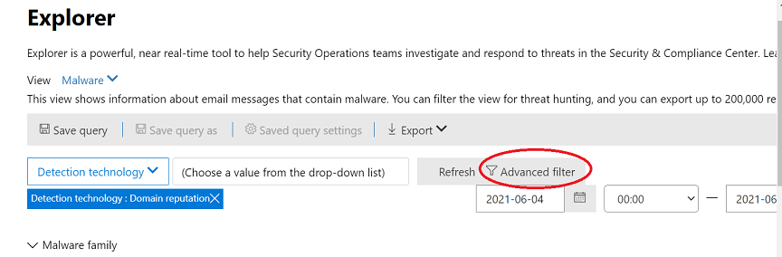
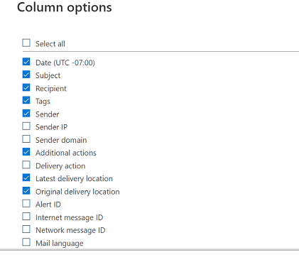

# Microsoft Defender for Office 365 威胁资源管理器中的威胁搜寻Threat hunting in Threat Explorer for Microsoft Defender for Office 365

本文内容：In this article:

- [威胁资源管理器演练Threat Explorer walk-through](#threat-explorer-walk-through)
- [电子邮件调查Email investigation](#email-investigation)
- [电子邮件修正Email remediation](#email-remediation)
- [威胁搜寻体验改进Improvements to threat hunting experience](#improvements-to-threat-hunting-experience)

> [!NOTE]
> 这是威胁资源管理器 (**资源管理器) 、** 电子邮件安全、资源管理器和实时检测基础知识的 **3** 篇文章系列中的一部分 **(如** 工具之间的差异以及操作它们所需的权限) 。This is part of a **3-article series** on **Threat Explorer (Explorer)**, **email security**, and **Explorer and Real-time detections basics** (such as differences between the tools, and permissions needed to operate them). 本系列中的其他两篇文章 [是使用威胁](email-security-in-microsoft-defender.md) 资源管理器和威胁资源管理器的电子邮件安全性以及实时检测 [基础知识](real-time-detections.md)。The other two articles in this series are [Email security with Threat Explorer](email-security-in-microsoft-defender.md) and [Threat Explorer and Real-time detections basics](real-time-detections.md).

**适用对象****Applies to**
- [Microsoft Defender for Office 365 计划 1 和计划 2Microsoft Defender for Office 365 plan 1 and plan 2](defender-for-office-365.md)
- [Microsoft 365 DefenderMicrosoft 365 Defender](../defender/microsoft-365-defender.md)

如果你的组织拥有适用于 Office 365 的 [Microsoft Defender，](defender-for-office-365.md)并且你拥有 权限，可以使用 **资源管理器** 或实时检测来检测和修正威胁。If your organization has [Microsoft Defender for Office 365](defender-for-office-365.md), and you have the [permissions](#required-licenses-and-permissions), you can use **Explorer** or **Real-time detections** to detect and remediate threats.

在Microsoft 365 Defender门户 () ，转到"电子邮件&协作"，然后选择"资源管理器"或" <https://security.microsoft.com> **实时检测"。**  In the Microsoft 365 Defender portal (<https://security.microsoft.com>), go to **Email & collaboration**, and then choose **Explorer** or **Real-time detections**. 若要直接对页面执行，请使用 <https://security.microsoft.com/threatexplorer> 或 <https://security.microsoft.com/realtimereports>To do directly to the page, use <https://security.microsoft.com/threatexplorer> or <https://security.microsoft.com/realtimereports>

使用这些工具，你可以：With these tools, you can:

- 查看由安全Microsoft 365检测到的恶意软件See malware detected by Microsoft 365 security features
- 查看网络钓鱼 URL 并单击裁定数据View phishing URL and click verdict data
- 从资源管理器中的视图启动自动调查和响应过程Start an automated investigation and response process from a view in Explorer
- 调查恶意电子邮件等Investigate malicious email, and more

有关详细信息，请参阅使用威胁 [资源管理器的电子邮件安全性](email-security-in-microsoft-defender.md)。For more information, see [Email security with Threat Explorer](email-security-in-microsoft-defender.md).

## 威胁资源管理器演练Threat Explorer walk-through

在 Microsoft Defender for Office 365 中，有两个订阅计划：计划 1 和计划 2。In Microsoft Defender for Office 365, there are two subscription plans—Plan 1 and Plan 2. 手动操作的威胁搜寻工具存在于两个计划中，名称不同，功能不同。Manually operated Threat hunting tools exist in both plans, under different names and with different capabilities.

Defender for Office 365 Plan 1 *使用实时* 检测，它是威胁资源管理器 *(（* 也称为计划 2 中的 *资源管理器) 搜寻* 工具）的子集。Defender for Office 365 Plan 1 uses *Real-time detections*, which is a subset of the *Threat Explorer* (also called *Explorer*) hunting tool in Plan 2. 在本系列文章中，大多数示例都是使用完整的威胁资源管理器创建的。In this series of articles, most of the examples were created using the full Threat Explorer. 管理员应在实时检测中测试任何步骤，以查看其应用位置。Admins should test any steps in Real-time detections to see where they apply.

转到资源管理器 **后，** 默认情况下，你将到达恶意软件页面，但使用视图下拉列表来熟悉你的选项。 After you go to **Explorer**, by default, you'll arrive on the **Malware** page, but use the **View** drop down to get familiar with your options. 如果你搜寻网络钓鱼，或进入威胁活动，请选择这些视图。If you're hunting Phish, or digging into a threat campaign, choose those views.

> [!div class="mx-imgBorder"]
> 

一旦安全操作 (Sec Ops) 人员选择要查看的数据，无论范围是较窄的视图（如用户提交）还是较宽的视图（如"所有电子邮件"），他们都可以使用"发件人"按钮进一步筛选。 Once a security operations (Sec Ops) person selects the data they want to see, whether the scope is narrow view like user **Submissions**, or a wider view, like **All email**, they can use the **Sender** button to further filter. 请记住，选择"刷新"以完成筛选操作。Remember to select Refresh to complete your filtering actions.

> [!div class="mx-imgBorder"]
> 

可以在层中考虑在资源管理器中精简焦点或实时检测。Refining focus in Explorer or Real-time detection can be thought of in layers. 第 **一个视图**。The first is **View**. 第二个可视为已 *筛选焦点*。The second can be thought of as a *filtered focus*. 例如，可以通过记录类似以下的决策来重新跟踪查找威胁时所执行的步骤：为了在资源管理器中查找问题，我选择了"具有收件人筛选器焦点的 **恶意软件视图"。**For example, you can retrace the steps you took in finding a threat by recording your decisions like this: To find the issue in Explorer, **I chose the Malware View with a Recipient filter focus**. 这样一来，可以更轻松地重新跟踪步骤。This makes retracing your steps easier.

> [!TIP]
> 如果 Sec Ops 使用 **标记** 标记他们认为高价值目标的帐户，他们可以做出选择，如具有标记筛选器焦点的网络钓鱼视图 (包括日期范围（ *如果使用*) ）。If Sec Ops uses **Tags** to mark accounts they consider high valued targets, they can make selections like *Phish View with a Tags filter focus (include a date range if used)*. 这将显示在一个时间范围内针对其高价值用户目标的任何网络钓鱼 (例如，当某些网络钓鱼攻击针对其行业组织发生很多事件时) 。This will show them any phishing attempts directed at their high value user targets during a time-range (like dates when certain phishing attacks are happening a lot for their industry).

可以使用日期范围控件对日期范围进行精简。Refinements can be made on date ranges by using the date range controls. 你可以在此处查看"恶意软件"视图中 **的** 资源管理器，具有 **检测技术** 筛选器焦点。Here you can see Explorer in **Malware** view, with a **Detection Technology** filter focus. 但高级筛选器按钮可让Sec Ops 团队深入了解。But it's the **Advanced filter** button that lets Sec Ops teams dig deep.

> [!div class="mx-imgBorder"]
> 

单击 **"高级** "筛选器将弹出一个面板，该面板将允许 Sec Ops 执行者自己生成查询，允许他们包含或排除他们需要查看的信息。Clicking the **Advanced filter** pops a panel that will let Sec Ops hunters build queries themselves, letting them include or exclude the information they need to see. 资源管理器页面上的图表和表格都将反映其结果。Both the chart and table on the Explorer page will reflect their results.

> [!div class="mx-imgBorder"]
> 

使用 **"列** 选项"按钮获取有关最有帮助的表的信息类型：Use the **Column options** button to get the kind of information on the table that would be most helpful:

> [!div class="mx-imgBorder"]
> 

> [!div class="mx-imgBorder"]
> 

在同一方面，请确保测试你的显示选项。In the same mien, make sure to test your display options. 不同的访问群体将很好地响应相同数据的不同演示文稿。Different audiences will react well to different presentations of the same data. 对于一些查看者，电子邮件来源地图可以显示威胁是普遍出现还是比它旁边的"宣传活动显示"选项更快速。For some viewers, the **Email Origins** map can show that a threat is widespread or discreet more quickly than the **Campaign display** option right next to it. Sec 操作可充分利用这些显示，以最好地突出安全性和保护需求，或用于稍后比较，以演示其操作的有效性。Sec Ops can make use of these displays to best make points that underscore the need for security and protection, or for later comparison, to demonstrate the effectiveness of their actions.

> [!div class="mx-imgBorder"]
> 

> [!div class="mx-imgBorder"]
> 

### 电子邮件调查Email investigation

当看到可疑电子邮件时，单击该名称以展开右侧飞出。When you see a suspicious email, click the name to expand the flyout on the right. 此处提供了允许 Sec Ops 查看 [电子邮件实体页面的](mdo-email-entity-page.md) 横幅。Here, the banner that lets Sec Ops see the [email entity page](mdo-email-entity-page.md) is available.

电子邮件实体页面将可以在详细信息、附件、设备下找到的内容汇集在一起，但包含组织性较详细的数据。 The email entity page pulls together contents that can be found under **Details**, **Attachments**, **Devices**, but includes more organized data. 这包括 DMARC 结果、带有复制选项的电子邮件头的纯文本显示、安全触发的附件裁定信息，以及丢弃的 (的文件可以包括联系到的 IP 地址以及页面或文件的屏幕截图) 。This includes things like DMARC results, plain text display of the email header with a copy option, verdict information on attachments that were securely detonated, and files those detonations dropped (can include IP addresses that were contacted and screenshots of pages or files). 还将列出 URL 及其裁定，并报告类似的详细信息。URLs and their verdicts are also listed with similar details reported.

当您进入此阶段时，电子邮件实体页面将对于最后一步（修正）*至关重要*。When you reach this stage, the email entity page will be critical to the final step—*remediation*.

> [!div class="mx-imgBorder"]
> 

> [!TIP]
> 若要了解有关"分析"选项卡)  (上显示的内容丰富的电子邮件实体页面的详细信息，包括触发的附件的结果、包含的 URL 的结果和安全的电子邮件预览，[请单击此处。](mdo-email-entity-page.md)To learn more about the rich email entity page (seen below on the **Analysis** tab), including the results of detonated Attachments, findings for included URLs, and safe Email preview, click [here](mdo-email-entity-page.md).

> [!div class="mx-imgBorder"]
> 

### 电子邮件修正Email remediation

Sec Ops 人员确定电子邮件是威胁后，下一个资源管理器或实时检测步骤将处理威胁并修正它。Once a Sec Ops person determines that an email is a threat, the next Explorer or Real-time detection step is dealing with the threat and remediating it. 为此，请返回到威胁资源管理器，选中问题电子邮件的复选框，然后使用"操作 **"按钮。**This can be done by returning to Threat Explorer, selecting the checkbox for the problem email, and using the **Actions** button.

> [!div class="mx-imgBorder"]
> 

在此，分析员可以执行将邮件报告为垃圾邮件、网络钓鱼或恶意软件、联系收件人或进一步调查等操作，包括触发自动调查和响应 (或 AIR) 操作手册 (（如果你有计划 2) ）。Here, the analyst can take actions like reporting the mail as Spam, Phishing, or Malware, contacting recipients, or further investigations that can include triggering Automated Investigation and Response (or AIR) playbooks (if you have Plan 2). 或者，也可以将邮件报告为干净。Or, the mail can also be reported as clean.

> [!div class="mx-imgBorder"]
> 

## 威胁搜寻体验改进Improvements to threat hunting experience

### 警报 IDAlert ID

从警报导航到威胁资源管理器时， **视图** 将按警报 **ID 进行筛选**。When navigating from an alert into Threat Explorer, the **View** will be filtered by **Alert ID**. 这同样适用于实时检测。This also applies in Real-time detection. 与特定警报相关的邮件，以及 (显示) 总数。Messages relevant to the specific alert, and an email total (a count) are shown. 你将能够查看邮件是否属于警报，以及从该邮件导航到相关警报。You will be able to see if a message was part of an alert, as well as navigate from that message to the related alert.

最后，警报 ID 包含在 URL 中，例如： `https://https://security.microsoft.com/viewalerts`Finally, alert ID is included in the URL, for example: `https://https://security.microsoft.com/viewalerts`

> [!div class="mx-imgBorder"]
> 

> [!div class="mx-imgBorder"]
> 

### 扩展资源管理器 (和实时检测) 试用租户的数据保留和搜索限制Extending Explorer (and Real-time detections) data retention and search limit for trial tenants

作为此更改的一部分，分析员将能够搜索和筛选 (在威胁资源管理器中为) 增加的 30 天内的电子邮件数据，以及针对 Office P1 和 P2 试用租户的 Defender 实时检测。As part of this change, analysts will be able to search for, and filter email data across 30 days (increased from seven days) in Threat Explorer and Real-time detections for both Defender for Office P1 and P2 trial tenants. 这不会影响 P1 和 P2 E5 客户的任何生产租户，其中保留默认值已是 30 天。This doesn't impact any production tenants for both P1 and P2 E5 customers, where the retention default is already 30 days.

### 已更新的导出限制Updated Export limit

现在，可以从威胁资源管理器导出的电子邮件记录数为 200，000， (为 9990) 。The number of Emails records that can be exported from Threat Explorer is now 200,000 (was 9990). 可导出的列集保持不变。The set of columns that can be exported is unchanged.

### 威胁资源管理器中的标记Tags in Threat Explorer

> [!NOTE]
> 用户标记功能在预览版中，可能并非对所有人都可用。The user tags feature is in Preview and may not be available to everyone. 此外，预览可能会更改。Also, Previews are subject to change. 有关发布计划的信息，请查看Microsoft 365路线图。For information about the release schedule, check out the Microsoft 365 roadmap.

用户标记标识 Microsoft Defender for Office 365 中的特定用户组。User tags identify specific groups of users in Microsoft Defender for Office 365. 有关标记（包括许可和配置）的信息，请参阅 [用户标记](user-tags.md)。For more information about tags, including licensing and configuration, see [User tags](user-tags.md).

在威胁资源管理器中，可以在以下体验中查看有关用户标记的信息。In Threat Explorer, you can see information about user tags in the following experiences.

#### 电子邮件网格视图Email grid view

当分析员查看电子邮件网格的 **"** 标签"列时，他们将看到已应用于发件人或收件人邮箱的所有标记。When analysts look at the **Tags** column the email grid, they are seeing all tags that have been applied to sender or recipient mailboxes. 默认情况下，优先显示优先 *帐户等* 系统标记。By default, system tags like *priority accounts* are shown first.

> [!div class="mx-imgBorder"]
> 

#### 筛选Filtering

标记可以用作筛选器。Tags can be used as filters. 仅在优先级帐户之间搜寻，或采用这种方式使用特定用户标记方案。Hunt among priority accounts only, or use specific user tags scenarios this way. 还可以排除具有特定标记的结果。You can also exclude results that have certain tags. 将标记与其他筛选器和日期范围相结合，以缩小调查范围。Combine Tags with other filters and date ranges to narrow your scope of investigation.

> [!div class="mx-imgBorder"]
> 

#### 电子邮件详细信息飞出Email detail flyout

若要查看发件人和收件人的单个标记，请选择一封电子邮件以打开邮件详细信息飞出。To view the individual tags for sender and recipient, select an email to open the message details flyout. 在 **"摘要"选项卡** 上，发件人和收件人标记将单独显示。On the **Summary** tab, the sender and recipient tags are shown separately. 有关发件人和收件人的单个标记的信息可以导出为 CSV 数据。The information about individual tags for sender and recipient can be exported as CSV data.

> [!div class="mx-imgBorder"]
> 

URL 单击飞出也显示标记信息。Tags information is also shown in the URL clicks flyout. 若要查看它，请转到网络钓鱼或所有电子邮件视图> **URL** 或 **URL** 单击选项卡。选择单个 URL 飞出，以查看有关该 URL 的单击的其他详细信息，包括与该单击关联的任何标记。To see it, go to Phish or All Email view > **URLs** or **URL Clicks** tab. Select an individual URL flyout to see additional details about clicks for that URL, including any Tags associated with that click.

### 更新的时间线视图Updated Timeline View

> [!div class="mx-imgBorder"]
> 
>
观看[此视频](https://www.youtube.com/watch?v=UoVzN0lYbfY&list=PL3ZTgFEc7LystRja2GnDeUFqk44k7-KXf&index=4)了解更多信息。Learn more by watching [this video](https://www.youtube.com/watch?v=UoVzN0lYbfY&list=PL3ZTgFEc7LystRja2GnDeUFqk44k7-KXf&index=4).

## 扩展功能Extended capabilities

### 主要目标用户Top targeted users

主要恶意软件系列在 **"恶意软件"部分显示** 主要目标用户。Top Malware Families shows the **top targeted users** in the Malware section. 主要目标用户也将通过钓鱼和所有电子邮件视图进行扩展。Top targeted users will be extended through Phish and All Email views too. 分析员将能够查看前五个目标用户，以及每个视图中每个用户的尝试次数。Analysts will be able to see the top-five targeted users, along with the number of attempts for each user in each view.

安全操作 用户可以导出目标用户列表（最多 3，000 个）以及尝试次数，以便针对每个电子邮件视图进行脱机分析。Security operations people be able to export the list of targeted users, up to a limit of 3,000, along with the number of attempts made, for offline analysis for each email view. 此外，选择尝试次数 (例如，在) 下的图像中尝试 13 次将在威胁资源管理器中打开筛选视图，以便你可以查看有关该用户的电子邮件和威胁的更多详细信息。Also, selecting the number of attempts (for example, 13 attempts in the image below) will open a filtered view in Threat Explorer, so you can see more details across emails, and threats for that user.

> [!div class="mx-imgBorder"]
> 

### Exchange传输规则Exchange transport rules

安全运营团队将能够在"电子邮件"网格Exchange查看 (邮件流规则) 邮件流规则。The security operations team will be able to see all the Exchange transport rules (or Mail flow rules) applied to a message, in the Email grid view. 选择 **网格中的**"列"选项，然后 **Exchange"添加** 传输规则"。Select **Column options** in the grid and then **Add Exchange Transport Rule** from the column options. The Exchange transport rules option is also visible on the **Details** flyout in the email.The Exchange transport rules option is also visible on the **Details** flyout in the email.

将显示应用于邮件的传输规则的名称和 GUID。Names and GUIDs of the transport rules applied to the message appear. 分析员将能够使用传输规则的名称搜索邮件。Analysts will be able to search for messages by using the name of the transport rule. 这是 CONTAINS 搜索，这意味着您也可以执行部分搜索。This is a CONTAINS search, which means you can do partial searches as well.

> [!IMPORTANT]
> Exchange规则搜索和名称可用性取决于分配给您的特定角色。Exchange transport rule search and name availability depend on the specific role assigned to you. 您需要具有以下角色或权限之一才能查看传输规则名称和搜索。You need to have one of the following roles or permissions to view the transport rule names and search. 但是，即使没有以下角色或权限，分析员也可以查看电子邮件详细信息中的传输规则标签和 GUID 信息。However, even without the roles or permissions below, an analyst may see the transport rule label and GUID information in the Email Details. 电子邮件网格、电子邮件飞出、筛选器和导出中的其他记录查看体验不受影响。Other record-viewing experiences in Email Grids, Email flyouts, Filters, and Export are not affected.
>
> - Exchange Online仅 - 数据丢失防护：全部Exchange Online Only - Data Loss Prevention: All
> - Exchange Online仅 - O365SupportViewConfig：全部Exchange Online Only - O365SupportViewConfig: All
> - Microsoft Azure Active Directory或Exchange Online - 安全管理员：全部Microsoft Azure Active Directory or Exchange Online - Security Admin: All
> - Azure Active Directory或Exchange Online - 安全读者：全部Azure Active Directory or Exchange Online - Security Reader: All
> - Exchange Online仅 - 传输规则：全部Exchange Online Only - Transport Rules: All
> - Exchange Online仅 - View-Only配置：全部Exchange Online Only - View-Only Configuration: All
>
> 在电子邮件网格、详细信息飞出控件和导出的 CSV 中，ETR 将显示一个名称/GUID，如下所示。Within the email grid, Details flyout, and Exported CSV, the ETRs are presented with a Name/GUID as shown below.
>
> > [!div class="mx-imgBorder"]
> > 

### 入站连接器Inbound connectors

连接器是一组说明，用于自定义电子邮件在组织或组织Microsoft 365 Office 365流。Connectors are a collection of instructions that customize how your email flows to and from your Microsoft 365 or Office 365 organization. 它们使您能够应用任何安全限制或控件。They enable you to apply any security restrictions or controls. 在威胁资源管理器中，可以查看与电子邮件相关的连接器，然后使用连接器名称搜索电子邮件。In Threat Explorer, you can view the connectors that are related to an email and search for emails using connector names.

搜索连接器是 CONTAINS 查询，这意味着部分关键字搜索可以正常工作：The search for connectors is a CONTAINS query, which means partial keyword searches can work:

> [!div class="mx-imgBorder"]
> 

## 所需的许可证和权限Required licenses and permissions

你必须拥有[Microsoft Defender Office 365](defender-for-office-365.md)使用资源管理器或实时检测。You must have [Microsoft Defender for Office 365](defender-for-office-365.md) to use Explorer or Real-time detections.

- 资源管理器包含在计划 2 Office 365 Defender 中。Explorer is included in Defender for Office 365 Plan 2.
- 实时检测报告包含在计划 1 的 Defender Office 365中。The Real-time detections report is included in Defender for Office 365 Plan 1.
- 计划为应受 Defender for Office 365 保护的所有用户分配Office 365。Plan to assign licenses for all users who should be protected by Defender for Office 365. 资源管理器和实时检测显示许可用户的检测数据。Explorer and Real-time detections show detection data for licensed users.

若要查看和使用资源管理器或实时检测，您必须具有以下权限：To view and use Explorer or Real-time detections, you must have the following permissions:

- 对于 Microsoft 365 Defender 门户：For the Microsoft 365 Defender portal:
  - 组织管理Organization Management
  - 安全 (可以在管理中心Azure Active Directory分配 <https://aad.portal.azure.com> () Security Administrator (this can be assigned in the Azure Active Directory admin center (<https://aad.portal.azure.com>)
  - 安全读取者Security Reader
- 例如Exchange Online：For Exchange Online:
  - 组织管理Organization Management
  - 仅查看组织管理View-Only Organization Management
  - 仅查看收件人View-Only Recipients
  - 合规性管理Compliance Management

若要详细了解角色和权限，请参阅以下资源：To learn more about roles and permissions, see the following resources:

- [Microsoft 365 Defender 门户中的权限Permissions in the Microsoft 365 Defender portal](permissions-microsoft-365-security-center.md)
- [Exchange Online 中的功能权限Feature permissions in Exchange Online](/exchange/permissions-exo/feature-permissions)
- [Exchange Online PowerShellExchange Online PowerShell](/powershell/exchange/exchange-online-powershell)

## 更多信息More information

- [查找和调查投递的恶意电子邮件Find and investigate malicious email that was delivered](investigate-malicious-email-that-was-delivered.md)
- [查看在 SharePoint Online、OneDrive 和 Microsoft TeamsView malicious files detected in SharePoint Online, OneDrive, and Microsoft Teams](mdo-for-spo-odb-and-teams.md)
- [大致了解威胁资源管理器中的 (和实时检测) Get an overview of the views in Threat Explorer (and Real-time detections)](threat-explorer-views.md)
- [威胁防护状态报告Threat protection status report](view-email-security-reports.md#threat-protection-status-report)
- [Microsoft 威胁防护中的自动调查和响应Automated investigation and response in Microsoft Threat Protection](automated-investigation-response-office.md)
- [使用"电子邮件实体"页调查电子邮件Investigate emails with the Email Entity Page](mdo-email-entity-page.md)
