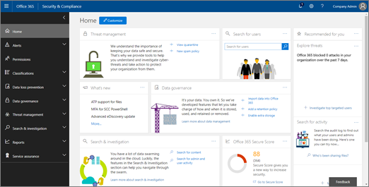

# 威胁跟踪器 - 新增的和值得注意的威胁Threat Trackers - New and Noteworthy

[!INCLUDE [Microsoft 365 Defender rebranding](../includes/microsoft-defender-for-office.md)]

通过[Office 365 的威胁调查和响应](office-365-ti.md)功能，贵组织的安全团队可以发现并针对 cybersecurity 威胁采取措施。[Office 365 Threat Investigation and Response](office-365-ti.md) capabilities enable your organization's security team to discover and take action against cybersecurity threats. Office 365 威胁调查和响应功能包括威胁跟踪器功能，包括值得注意的跟踪器。Office 365 Threat Investigation and Response capabilities include Threat Tracker features, including Noteworthy trackers. 阅读本文以获取这些新功能以及后续步骤的概述。Read this article to get an overview of these new features and next steps. 

> [!IMPORTANT]
> Office 365 威胁智能现已成为 Office 365 高级威胁防护计划2，以及其他威胁防护功能。Office 365 Threat Intelligence is now Office 365 Advanced Threat Protection Plan 2, along with additional threat protection capabilities. 若要了解详细信息，请参阅 [office 365 高级威胁防护计划和定价](https://products.office.com/exchange/advance-threat-protection) 以及 [Office 365 高级威胁防护服务说明](https://docs.microsoft.com/office365/servicedescriptions/office-365-advanced-threat-protection-service-description)。To learn more, see [Office 365 Advanced Threat Protection plans and pricing](https://products.office.com/exchange/advance-threat-protection) and the [Office 365 Advanced Threat Protection Service Description](https://docs.microsoft.com/office365/servicedescriptions/office-365-advanced-threat-protection-service-description).
  
## 什么是威胁跟踪跟踪？What are Threat Trackers?

威胁跟踪程序是信息小组件和视图，为您提供有关可能影响贵公司的不同 cybersecurity 问题的智能。Threat Trackers are informative widgets and views that provide you with intelligence on different cybersecurity issues that might impact your company. 例如，您可以使用威胁跟踪程序查看有关趋势恶意软件活动的信息。For example, you can view information about trending malware campaigns using Threat Trackers.
  

  
大多数跟踪器页面包括定期更新的趋势编号、小部件，可帮助您了解哪些问题最大或增长最多，以及将您带到资源管理器的 " **操作** " 列中的快速链接，您可以在其中查看更详细的信息。Most tracker pages include trending numbers that are updated periodically, widgets to help you understand which issues are the biggest or have grown the most, and a quick link in the **Actions** column that takes you to Explorer, where you can view more detailed information. 
  

  
跟踪跟踪只是您在 [Office 365 高级威胁防护计划 2](office-365-ti.md)中获得的众多强大功能中的少数几个。Trackers are just a few of the many great features you get with [Office 365 Advanced Threat Protection Plan 2](office-365-ti.md). 威胁跟踪包括 [Noteworth 跟踪](#noteworthy-trackers)跟踪、 [趋势跟踪跟踪](#trending-trackers)、 [跟踪的查询](#tracked-queries)和 [已保存的查询](#saved-queries)。Threat Trackers include [Noteworth trackers](#noteworthy-trackers), [Trending trackers](#trending-trackers), [Tracked queries](#tracked-queries), and [Saved queries](#saved-queries).
  
若要查看和使用您的组织的威胁跟踪器，请转到安全 &amp; 合规性中心 ([https://protection.office.com](https://protection.office.com)) 并选择 " **威胁管理** \> **威胁跟踪**程序"。To view and use your Threat Trackers for your organization, go to the Security &amp; Compliance Center ([https://protection.office.com](https://protection.office.com)) and choose **Threat management** \> **Threat tracker**.
  
> [!NOTE]
> 若要使用威胁跟踪器，您必须是全局管理员、安全管理员或安全阅读者。To use Threat Trackers, you must be a global administrator, security administrator, or security reader. 查看 [安全 &amp; 合规性中心中的权限](permissions-in-the-security-and-compliance-center.md)。See [Permissions in the Security &amp; Compliance Center](permissions-in-the-security-and-compliance-center.md). 
  
### 值得注意的跟踪跟踪Noteworthy trackers

值得注意的跟踪程序是你可以找到我们认为应了解的大型和更小的威胁和风险。Noteworthy trackers are where you'll find big and smaller threats and risks that we think you should know about. 注意：跟踪程序可帮助您查找这些问题是否存在于 Microsoft 365 环境中，并链接到与此类似的文章 (，) 提供有关所发生情况的更多详细信息，以及它们如何影响组织对 Office 365 的使用。Noteworthy trackers help you find whether these issues exist in your Microsoft 365 environment, plus link to articles (like this one) that give you more details on what is happening, and how they'll impact your organization's use of Office 365. 无论是大型新威胁 (例如 Wannacry、Petya) 还是可能造成一些新挑战的现有威胁 (如我们其他 inaugural 值得注意的项目-Nemucod) 中，这是您可以找到的重要新项目，您的安全团队应定期查看和检查。Whether it's a big new threat (e.g. Wannacry, Petya) or an existing threat that might create some new challenges (like our other inaugural Noteworthy item - Nemucod), this is where you'll find important new items you and your security team should review and examine periodically.
  
通常情况下，跟踪跟踪程序只会在几周内发布，我们发现新的威胁，并考虑您可能需要此功能提供的更多可见性。Typically Noteworthy trackers will be posted for just a couple of weeks when we identify new threats and think you might need the extra visibility that this feature provides. 一旦威胁的最大风险通过，我们就会删除这个值得注意的项目。Once the biggest risk for a threat has passed, we'll remove that Noteworthy item. 通过这种方式，我们可以将列表与其他相关新项目保持最新和最新。This way, we can keep the list fresh and up to date with other relevant new items.
  
### 趋势跟踪跟踪Trending trackers

趋势跟踪程序 (以前称为市场活动) 突出显示在过去一周内组织的电子邮件中收到的新威胁。Trending trackers (formerly called Campaigns) highlight new threats received in your organization's email in the past week.
  

  
趋势跟踪程序为您提供了新的威胁，您应查看这些威胁，以确保您的更广泛的公司环境对攻击进行了准备。Trending trackers give you an idea of new threats you should review to ensure your broader corporate environment is prepared against attacks.
  
### 跟踪的查询Tracked queries

跟踪的查询利用您保存的查询定期评估您的组织中的 Microsoft 365 活动。Tracked queries leverage your saved queries to periodically assess Microsoft 365 activity in your organization. 这为你提供了事件趋势，并增加了未来几个月的时间。This gives you event trending, with more to come in the coming months. 跟踪的查询将自动运行，为你提供最新信息，而无需记住重新运行你的查询。Tracked queries run automatically, giving you up-to-date information without having to remember to re-run your queries.
  

  
### 已保存的查询Saved queries

已保存的查询也位于跟踪栏部分。Saved queries are also found in the Trackers section. 您可以使用保存的查询来存储要快速且重复的常见资源管理器搜索，而无需每次都重新创建搜索。You can use Saved queries to store the common Explorer searches that you want to get back to quicker and repeatedly, without having to re-create the search every time.
  

  
您可以使用资源管理器页面顶部的 " **保存查询** " 按钮，始终保存重要的跟踪器查询或您自己的任何资源管理器查询。You can always save a Noteworthy tracker query or any of your own Explorer queries using the **Save query** button at the top of the Explorer page. 保存的任何内容将显示在 "跟踪程序" 页上的 " **已保存的查询** " 列表中。Anything saved there will show up in the **Saved queries** list on the Tracker page. 
  
## 跟踪器和资源管理器Trackers and Explorer

无论您是要查看电子邮件、内容还是办公室活动 (即将推出) ，资源管理器和跟踪器将协同工作，以帮助您调查和跟踪安全风险和威胁。Whether you're reviewing email, content, or Office activities (coming soon), Explorer and Trackers work together to help you investigate and track security risks and threats. 所有这些跟踪程序都为您提供了保护用户的信息，方法是突出显示新的、显著的和频繁搜索的问题-确保您的业务在迁移到云时得到更好的保护。All together, Trackers provide you with information to protect your users by highlighting new, notable, and frequently searched issues - ensuring your business is better protected as it moves to the cloud.
  
请注意，您可以通过单击[安全 & 合规中心概述](https://support.microsoft.com/office/a5f2fd18-b029-4257-b5a8-ae83e7768c85)的 "**反馈**" 按钮，随时为我们提供有关此或其他 Microsoft 365 安全功能的反馈。And remember that you can always provide us feedback on this or other Microsoft 365 security features by clicking on the **Feedback** button in the lower right corner of the [Overview of the Security & Compliance Center](https://support.microsoft.com/office/a5f2fd18-b029-4257-b5a8-ae83e7768c85).
  

  
## 跟踪跟踪和 Office 365 高级威胁防护Trackers and Office 365 Advanced Threat Protection

通过我们的 inaugural 值得注意的威胁，我们会突出显示 [安全附件](atp-safe-attachments.md)检测到的高级恶意软件威胁。With our inaugural Noteworthy threat, we're highlighting advanced malware threats detected by [Safe Attachments](atp-safe-attachments.md). 如果你是 Office 365 企业版 E5 客户，并且未使用 [office 365 高级威胁防护](office-365-atp.md) (ATP) ，则应为-它包含在你的订阅中。If you're an Office 365 Enterprise E5 customer and you're not using [Office 365 Advanced Threat Protection](office-365-atp.md) (ATP), you should be - it's included in your subscription. 即使您有其他安全工具筛选与 Office 365 服务的电子邮件流，ATP 也能提供值。ATP provides value even if you have other security tools filtering email flow with your Office 365 services. 但是，当您的主要电子邮件安全解决方案是 Office 365 时，反垃圾邮件和 [安全链接](atp-safe-links.md) 功能将发挥最佳效果。However, anti-spam and [Safe Links](atp-safe-links.md) features work best when your main email security solution is through Office 365.
  

  
在当今的威胁-riddled world 中，仅运行传统的反恶意软件扫描意味着您不能充分抵御攻击。In today's threat-riddled world, running only traditional anti-malware scans means you are not protected well enough against attacks. 如今，更复杂的攻击者使用常用工具来创建不受传统签名的反恶意软件引擎识别的新的、模糊的或延迟的攻击。Today's more sophisticated attackers use commonly available tools to create new, obfuscated, or delayed attacks that won't be recognized by traditional signature-based anti-malware engines. 安全附件功能将接收电子邮件附件，并将其 detonates 在虚拟环境中，以确定它们是安全的还是恶意的。The Safe Attachments feature takes email attachments and detonates them in a virtual environment to determine whether they're safe or malicious. 此沙箱进程在虚拟计算机环境中打开每个文件，然后观察在打开文件后会发生什么情况。This detonation process opens each file in a virtual computer environment, then watches what happens after the file is opened. 无论是 PDF、压缩文件还是 Office 文档，恶意代码都可以隐藏在文件中，只有在受害者在其计算机上打开它后才激活。Whether it's a PDF, and compressed file, or an Office document, malicious code can be hidden in a file, activating only once the victim opens it on their computer. 通过 detonating 和分析电子邮件流中的文件，Office 365 ATP 功能将根据行为、文件信誉和许多试探规则找到这些威胁。By detonating and analyzing the file in the email flow, Office 365 ATP capabilities finds these threats based on behaviors, file reputation, and a number of heuristic rules.
  
新的值得注意的威胁筛选器突出显示最近通过安全附件检测到的项目。The new Noteworthy threat filter highlights items that were recently detected through Safe Attachments. 这些检测项表示在电子邮件流或其他客户的电子邮件中，Microsoft 365 以前未发现的新恶意文件。These detections represent items that are new malicious files, not previously found by Microsoft 365 in either your email flow or other customers' email. 请注意 "值得注意的威胁跟踪程序" 中的项目，查看这些项目的目标，并查看 "高级分析" 选项卡上显示的沙箱详细信息 (通过在资源管理器) 中单击电子邮件的主题找到。Pay attention to the items in the Noteworthy Threat Tracker, see who was targeted by them, and review the detonation details shown on the Advanced Analysis tab (found by clicking on the subject of the email in Explorer). 注释您只会在安全附件功能检测到的电子邮件上找到此选项卡-此值得注意的跟踪器包含该筛选器，但您也可以在资源管理器中使用该筛选器进行其他搜索。Note you'll only find this tab on emails detected by the Safe Attachments capability - this Noteworthy tracker includes that filter, but you can also use that filter for other searches in Explorer.
  
## 后续步骤Next steps

- 如果您的组织尚不具备这些 Office 365 威胁调查和响应功能，请参阅 [如何获取 office 365 威胁调查和响应功能？](office-365-ti.md)。If your organization doesn't already have these Office 365 Threat Investigation and Response capabilities, see [How do we get Office 365 Threat Investigation and Response capabilities?](office-365-ti.md).

- 确保安全团队具有分配的正确角色和权限。Make sure that your security team has the correct roles and permissions assigned. 您必须是全局管理员，或者具有安全管理员或在安全合规中心中分配的 "搜索和清除" 角色 &amp; 。You must be a global administrator, or have the Security Administrator or Search and Purge role assigned in the Security &amp; Compliance Center. 查看 [安全 &amp; 合规性中心中的权限](permissions-in-the-security-and-compliance-center.md)。See [Permissions in the Security &amp; Compliance Center](permissions-in-the-security-and-compliance-center.md).

- 监视新跟踪程序，使其显示在 Microsoft 365 环境中。Watch for the new Trackers to show up in your Microsoft 365 environment. 如果可用，你将在 [此处](https://protection.office.com/)找到你的跟踪程序。When available, you'll find your Trackers [here](https://protection.office.com/). 转到 **威胁管理** \> **威胁跟踪**。Go to **Threat management** \> **Threat trackers**.

- 如果尚未执行此操作，请详细了解和为你的组织配置 [Office 365 高级威胁防护](office-365-atp.md) ，包括 [安全链接](atp-safe-links.md) 和 [安全附件](atp-safe-attachments.md)。If you haven't already done so, learn more about and configure [Office 365 Advanced Threat Protection](office-365-atp.md) for your organization, including [Safe links](atp-safe-links.md) and [Safe Attachments](atp-safe-attachments.md).
