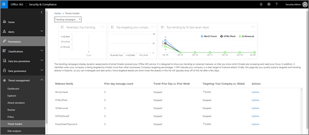
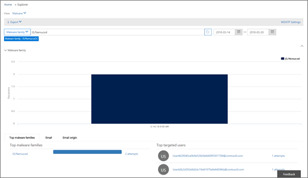
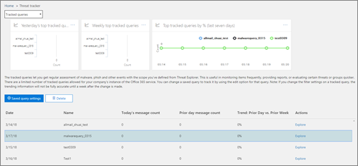
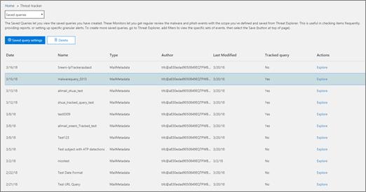

# 威胁跟踪器 - 新增的和值得注意的威胁

[!INCLUDE [Microsoft 365 Defender rebranding](../includes/microsoft-defender-for-office.md)]

**适用对象**
- [适用于 Office 365 计划 2 的 Microsoft Defender](defender-for-office-365.md)
- [Microsoft 365 Defender](../defender/microsoft-365-defender.md)

[Office 365威胁调查和响应](office-365-ti.md)功能使组织的安全团队能够发现网络安全威胁并采取措施。 Office 365调查和响应功能包括威胁跟踪器功能，包括值得注意的跟踪器。 阅读本文，大致了解这些新功能和接下来的步骤。

> [!IMPORTANT]
> Office 365威胁智能现在是 Microsoft Defender for Office 365 计划 2，以及其他威胁防护功能。 若要了解的详细信息，请参阅[Microsoft Defender for Office 365 计划和定价](https://products.office.com/exchange/advance-threat-protection)和 Microsoft Defender for Office 365[服务说明](/office365/servicedescriptions/office-365-advanced-threat-protection-service-description)。

## 什么是威胁跟踪器？

威胁跟踪器是信息小组件和视图，可针对可能会影响公司的不同网络安全问题提供情报。 例如，可以使用威胁跟踪器查看有关热门恶意软件活动的信息。

大多数跟踪器页面包括定期更新的趋势数字、帮助您了解问题最大或增长最多的小组件，以及"操作"列中的一个快速链接（可让你访问资源管理器，可在其中查看更多详细信息）。

跟踪器只是通过 Microsoft Defender for Office 365计划[2 获得的许多Office 365之一](office-365-ti.md)。 威胁跟踪器包括 [笔记跟踪](#noteworthy-trackers)器、 [趋势跟踪器](#trending-trackers)、 [跟踪](#tracked-queries)查询和 [保存的查询](#saved-queries)。

若要查看和使用组织的威胁跟踪器，请打开 Microsoft 365 Defender 门户，然后转到电子邮件& <https://security.microsoft.com> **协作** \> **威胁跟踪程序**。 若要直接转到威胁 **跟踪器** 页面，请使用 <https://security.microsoft.com/threattracker> 。

> [!NOTE]
> 若要使用威胁跟踪器，你必须是全局管理员、安全管理员或安全读者。 请参阅[网站门户Microsoft 365 Defender权限](permissions-microsoft-365-security-center.md)。

### 值得注意的跟踪器

值得一提的跟踪器可以发现我们认为你应了解的较大和较小的威胁和风险。 值得注意的跟踪器可帮助你查找 Microsoft 365 环境中是否存在这些问题，以及指向 (如下面的) 文章的链接，这些文章提供有关发生的情况以及这些问题如何影响组织对 Office 365 的使用的详细信息。 无论是新的重大威胁 (如 Wannacry、Pbya) ，还是可能会带来一些新挑战的现有威胁 (如我们的其他值得注意的项目 Nemucod) ，你将在此找到你和安全团队应定期查看和检查的重要新项。

通常，当我们发现新威胁，并且认为你可能需要此功能提供的额外可见性时，值得注意的跟踪器将发布几周。 威胁的最大风险一旦过去，我们将删除该值得注意的项目。 这样，我们可以在其他相关新项中保持列表最新。

### 趋势跟踪器

之前称为 (活动) 跟踪器可突出显示过去一周组织电子邮件中收到的新威胁。

趋势跟踪器让你了解应查看的新威胁，以确保更广泛的企业环境已做好抵御攻击的准备。

### 跟踪的查询

跟踪的查询利用保存的查询定期Microsoft 365组织中执行的活动。 这为你提供了事件趋势，未来几个月将有更多的事件趋势。 跟踪的查询将自动运行，从而为您提供最新信息，而无需记住重新运行查询。

### 已保存的查询

保存的查询也可在"跟踪器"部分找到。 可以使用保存的查询来存储希望更快、重复地返回的常见 Explorer 搜索，而无需每次重新创建搜索。

始终可以使用资源管理器页面顶部的"保存查询"按钮保存值得注意的跟踪器查询或任何你自己的资源管理器查询。 保存在那里的内容都会显示在"跟踪程序"页上的"保存的查询"列表中。

## 跟踪器和资源管理器

无论你正在查看电子邮件、内容还是 Office活动 (即将) ，Explorer 和 Trackers 协同工作，以帮助你调查和跟踪安全风险和威胁。 通过突出显示新的、值得注意的和经常搜索的问题，跟踪器可为您提供保护用户的信息 ， 从而确保业务在移动到云时得到更好的保护。

请记住，你始终可以通过单击右下角的"反馈"按钮Microsoft 365此功能或其他安全功能的反馈。 

## 跟踪器和 Microsoft Defender for Office 365

借助我们值得注意的威胁，我们重点介绍了附件 检测到的高级保险箱[威胁](safe-attachments.md)。 如果你是 E5 Office 365 企业版，并且没有使用[Microsoft Defender for Office 365，](defender-for-office-365.md)你应该是 -它包含在你的订阅中。 Defender for Office 365提供价值，即使你有其他安全工具使用你的服务筛选电子邮件Office 365流。 但是，反[垃圾邮件和保险箱](safe-links.md)链接功能在主要电子邮件安全解决方案通过邮件Office 365。

在当今的威胁威胁中，仅运行传统的反恶意软件扫描意味着你未受到充分保护，无法抵御攻击。 当今更复杂的攻击者使用常用的工具创建新的、模糊的或延迟的攻击，而传统的基于签名的反恶意软件引擎无法识别这些攻击。 "保险箱 附件"功能采用电子邮件附件，在虚拟环境中触发附件，以确定它们是安全附件还是恶意附件。 此触发过程在虚拟计算机环境中打开每个文件，然后监视打开文件后会发生什么情况。 无论是 PDF、压缩文件还是 Office 文档，恶意代码都可以隐藏在文件中，仅在攻击者在计算机上打开它时激活。 通过触发和分析电子邮件流中的文件，Office 365 Defender 功能可基于行为、文件信誉和大量启发式规则找到这些威胁。

新的值得注意的威胁筛选器突出显示最近通过"附件"保险箱项。 这些检测表示是新的恶意文件的项目，以前Microsoft 365电子邮件流或其他客户的电子邮件中发现。 注意值得注意的威胁跟踪器中的项目，查看它们的目标用户，并查看"高级分析"选项卡 (通过单击资源管理器) 中电子邮件的主题找到的触发详细信息。 请注意，仅在"保险箱 附件"功能检测到的电子邮件上找到此选项卡 - 此值得注意的跟踪器包含该筛选器，但您也可以使用该筛选器在资源管理器中执行其他搜索。

## 后续步骤

- 如果你的组织还没有这些威胁Office 365和响应功能，请参阅我们如何获得Office 365[调查和响应功能？。](office-365-ti.md)

- 确保安全团队分配了正确的角色和权限。 您必须是全局管理员，或者必须在安全门户中分配安全管理员或搜索Microsoft 365 Defender角色。 请参阅[网站门户Microsoft 365 Defender权限](permissions-microsoft-365-security-center.md)。

- 观察新的跟踪器显示在你的Microsoft 365环境中。 如果可用，你将在威胁跟踪器页面上找到威胁跟踪 **器，Microsoft 365 Defender** <https://security.microsoft.com/threattracker> 门户。

- 如果尚未开始操作，请详细了解并配置 Microsoft Defender [for Office 365](defender-for-office-365.md) for your organization，包括保险箱[链接](safe-links.md)和保险箱[附件](safe-attachments.md)。
