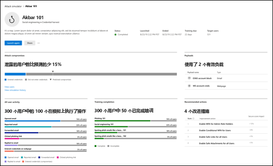

# 试用版手册: Microsoft Defender for Office 365

欢迎使用 Microsoft Defender for Office 365 试用版手册。 本游戏手册将帮助你充分利用你的 90 天免费试用期，教你如何使用 Office 365 的 Defender 保护你的组织。 使用 Microsoft 的建议，你将了解 Office 365 的 Defender 如何帮助你定义保护策略、分析组织面临的威胁以及响应攻击。

这些操作是 Microsoft Defender 团队针对要在 90 天试用期内尝试的关键功能建议。

## 步骤 1: 入门

### 开始 Microsoft Defender for Office 365 试用版

启动试用版并完成设置过程后，更改最长可能需要 2 小时才能生效。

我们已在你的环境中自动配置 [预设安全策略](preset-security-policies.md)。 这些策略表示适合大多数用户的基线保护配置文件。 标准保护包括:

- 安全链接、安全附件和反钓鱼策略的范围限于在试用设置过程中可能选择的整个租户或用户子集。
- 对 SharePoint、OneDrive、Office 应用和 Microsoft Teams 的保护。

观看此视频了解更多信息: [使用 Microsoft Defender for Office 365 - YouTube](https://www.youtube.com/watch?v=vhIJ1Veq36Y&list=PL3ZTgFEc7LystRja2GnDeUFqk44k7-KXf&index=9) 中的安全链接防范恶意链接。

### 使用户能够报告可疑内容

Defender for Office 365 使用户能够向其安全团队报告消息，并允许管理员将邮件提交给 Microsoft 进行分析。

- 部署 [报表邮件加载项或报表钓鱼加载项](enable-the-report-message-add-in.md)。
- 建立工作流以 [报告误报和漏报](report-false-positives-and-false-negatives.md)。
- 使用 [提交门户](admin-submission.md)。

观看此视频了解更多信息: [了解如何使用提交门户提交消息进行分析 - YouTube](https://www.youtube.com/watch?v=ta5S09Yz6Ks&ab_channel=MicrosoftSecurit)。

### 查看报告以了解威胁环境

使用 Defender for Office 365 中的报表功能获取有关环境的更多详细信息。

- 使用 [威胁防护状态报告](view-email-security-reports.md#threat-protection-status-report) 了解电子邮件和协作工具中收到的威胁。
- 使用 [邮件流状态报告](view-email-security-reports.md#mailflow-status-report) 查看阻止威胁的位置。
- [审查用户查看或系统封锁的链接](view-reports-for-mdo.md#url-protection-report)。

## 步骤 2: 中间步骤

### 优先关注你最有针对性的用户

使用 Defender for Office 365 中的优先级帐户保护功能保护最有针对性和最可见的用户，这有助于确定工作流的优先级以确保这些用户的安全。

- 确定最有针对性或最可见的用户。
- [将这些用户标记](../../admin/setup/priority-accounts.md#add-priority-accounts-from-the-setup-page) 为优先级帐户。
- 在整个门户中跟踪优先帐户的威胁。

观看此视频了解更多信息: [在 Microsoft Defender for Office 365 - YouTube 中保护优先账户](https://www.youtube.com/watch?v=tqnj0TlzQcI&list=PL3ZTgFEc7LystRja2GnDeUFqk44k7-KXf&index=11)。

### 防止用户泄露，避免成本高昂的漏洞

对潜在的损害发出警报，并自动限制这些威胁的影响，以防止攻击者更深入地访问你的环境。

- 查看 [泄露的用户警报](address-compromised-users-quickly.md#compromised-user-alerts)。
- [调查并响应被入侵用户](address-compromised-users-quickly.md)。

观看此视频了解更多信息: [在 Microsoft Defender for Office 365 - YouTube](https://www.youtube.com/watch?v=Pc7y3a-wdR0&list=PL3ZTgFEc7LystRja2GnDeUFqk44k7-KXf&index=5) 中检测和响应入侵。

### 使用威胁资源管理器调查恶意电子邮件

Defender for Office 365 使你能够调查使组织中的人员面临风险的活动，并采取措施保护你的组织。 可以使用 [威胁资源管理器或 (实时检测)](threat-explorer.md) 执行此操作。

- [查找已发送的可疑邮件](investigate-malicious-email-that-was-delivered.md#find-suspicious-email-that-was-delivered): 查找和删除邮件、识别恶意电子邮件发件人的 IP 地址，或启动事件以供进一步调查。
- [检查传递操作和位置](investigate-malicious-email-that-was-delivered.md#check-the-delivery-action-and-location): 此检查可让你知道问题电子邮件的位置。
- [查看电子邮件的时间线](investigate-malicious-email-that-was-delivered.md#view-the-timeline-of-your-email): 为安全运营团队简单地获取。

### 查看面向组织的活动

通过 Defender for Office 365 中的活动视图查看大图，可查看针对组织的攻击活动及其对用户的影响。

- [确定面向用户的活动](campaigns.md#what-is-a-campaign)。
- [可视化攻击的范围](campaigns.md#campaign-views-in-the-microsoft-365-defender-portal)。
- [跟踪用户与这些消息](campaigns.md#campaign-details) 交互。

观看此视频了解更多信息: [在 Microsoft Defender for Office 365 - YouTube 中的活动视图](https://www.youtube.com/watch?v=DvqzzYKu7cQ&list=PL3ZTgFEc7LystRja2GnDeUFqk44k7-KXf&index=14)。

### 使用自动化来修正风险

使用自动调查和响应 (AIR) 高效想要以查看、确定优先级并响应威胁。

- [了解更多](automated-investigation-response-office.md) 有关调查手册的信息。
- [查看调查的详细信息和结果](email-analysis-investigations.md)。
- 通过 [批准](air-remediation-actions.md) 的修正操作来消除威胁。

## 步骤 3: 高级内容

### 通过基于查询的搜寻深入了解数据

使用高级搜寻编写自定义检测规则，主动检查环境中的事件，并查找威胁指示器。 浏览环境中的原始数据。

- [生成自定义检测规则](../defender/advanced-hunting-overview.md#get-started-with-advanced-hunting)。
- [访问他人创建的共享查询](../defender/advanced-hunting-shared-queries.md)。

观看此视频了解更多信息: [使用 Microsoft 365 Defender 威胁搜寻 - YouTube](https://www.youtube.com/watch?v=l3OmH4U6XAs&list=PL3ZTgFEc7Lyt1O81TZol31YXve4e6lyQu&index=4)。

### 通过模拟攻击来训练用户发现威胁

通过 Defender for Office 365 中的攻击模拟培训，为用户提供正确的知识来识别威胁并报告可疑消息。

- [模拟现实威胁](attack-simulation-training.md) 以识别易受攻击的用户。
- [根据模拟结果将训练](attack-simulation-training.md#assign-training) 分配给用户。
- 在模拟和培训完成中 [跟踪组织的进度](attack-simulation-training-insights.md)。

## 其他资源

- **交互式指南**: 不熟悉 Defender for Office 365? 查看 [交互式指南](https://mslearn.cloudguides.com/guides/Safeguard%20your%20organization%20with%20Microsoft%20Defender%20for%20Office%20365) 以了解如何入门。
- **Microsoft 文档**: 获取有关 Defender for Office 365 工作原理以及如何为组织最佳实现它的详细信息。 请访问 [文档](overview.md)。
- **包含的内容**: 有关产品层列出的 Office 365 电子邮件安全功能的完整列表，请查看 [功能矩阵](/office365/servicedescriptions/office-365-advanced-threat-protection-service-description#feature-availability)。
- **为什么 Defender for Office 365**: [Defender for Office 365 数据表](https://query.prod.cms.rt.microsoft.com/cms/api/am/binary/RE4FCiy) 显示客户选择 Microsoft 的前 10 个原因。
