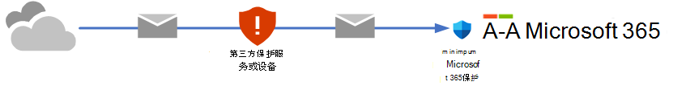
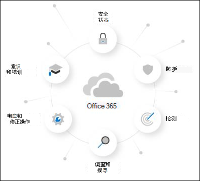

# 尝试Microsoft Defender for Office 365

> [!NOTE]
> 本文所述的功能以预览版提供，在所有组织中不可用，并且可能会发生更改。

Microsoft 365 Defender门户中的统一 **试** 用版门户为以前单独的试用版和评估Microsoft Defender for Office 365体验提供了一个入口点。 目的是在完全提交计划 2 之前，先试用 Defender for Office 365 计划 2 的功能 90 天。 但是，基于Microsoft 365组织的性质，评估体验存在差异：

- 你已有Microsoft 365邮箱，但目前使用的是第三方服务或设备以进行电子邮件保护。 在传递到Microsoft 365组织之前，来自 Internet 的邮件将流经保护服务。 Microsoft 365保护尽可能低， (它永远不会完全关闭;例如，恶意软件保护始终) 强制实施。

  

  在这些环境中，只能尝试在 *审核* 模式下Defender for Office 365。 无需更改邮件流 (MX 记录) 即可尝试Defender for Office 365。

- 你已有一个Microsoft 365组织。 来自 Internet 的邮件直接Microsoft 365，但当前订阅仅[Exchange Online Protection (EOP) ](exchange-online-protection-overview.md)或[Defender for Office 365计划 1](overview.md#microsoft-defender-for-office-365-plan-1-vs-plan-2-cheat-sheet)。

  

  在这些环境中，可以在 *审核* 模式或 *阻止模式* 下尝试Defender for Office 365。

你被邀请在Microsoft 365 Defender门户<https://security.microsoft.com>中的各种Defender for Office 365功能位置开始试用。 开始试用的集中位置位于 **“试用版** ”页 <https://security.microsoft.com/atpEvaluation>上。

本文的其余部分介绍了审核模式阻止模式、如何配置评估和其他详细信息之间的区别。

## Defender for Office 365概述

Defender for Office 365通过提供全面的功能来帮助组织保护其企业。 有关详细信息，请参阅[Microsoft Defender for Office 365](defender-for-office-365.md)。

还可以在此[交互式指南](https://aka.ms/MS365D.InteractiveGuide)中详细了解Defender for Office 365。

## 处于阻止模式或审核模式的策略

评估Defender for Office 365时，会显示控制Microsoft 365中的保护功能的策略：

- **Exchange Online Protection (EOP)**：不创建新的或特殊的策略。 现有的 EOP 策略能够对消息执行操作 (例如，将邮件发送到垃圾邮件文件夹或隔离) ：

  - [反恶意软件策略](anti-malware-protection.md)
  - [入站反垃圾邮件保护](anti-spam-protection.md)
  - [反钓鱼策略中的防欺骗保护](set-up-anti-phishing-policies.md#spoof-settings)

  这些功能的默认策略始终处于打开状态，适用于所有收件人，并且始终在任何自定义策略) 后 (应用。

- **Defender for Office 365**：为评估Defender for Office 365创建独占Defender for Office 365的策略：

  - [反钓鱼策略中的模拟保护](set-up-anti-phishing-policies.md#impersonation-settings-in-anti-phishing-policies-in-microsoft-defender-for-office-365)
  - [电子邮件保险箱附件](safe-attachments.md)
  - [保险箱电子邮件和Microsoft Teams链接](safe-links.md)

  但是，在阻止模式和审核模式下，这些策略的性质不同：

  - **审核模式**：创建常规策略，但策略配置只是为了 *检测* 威胁。 Defender for Office 365检测到用于报告的有害消息，但不会对消息执行操作 (例如，检测到的消息不会隔离) 。

  - **阻止模式**：使用 [预设安全策略](preset-security-policies.md)的标准模板创建策略。 Defender for Office 365 *检测* 有害消息并 *采取措施* (例如，检测到的消息被隔离) 。

  默认和建议的选择是将这些Defender for Office 365策略的范围限定给组织中的所有用户。 但在设置期间或之后，可以将策略分配更改为特定用户、组或电子邮件域。

**注意**:

- 保险箱链接会在邮件流中引爆 URL。 若要防止特定 URL 被引爆，请使用租户允许/阻止列表。 有关详细信息，请参阅 [“管理租户允许/阻止列表](tenant-allow-block-list.md)”。
- 保险箱链接不会包装电子邮件正文中的 URL 链接。
- 本文后面的“ [评估策略设置](#evaluation-policy-settings) ”部分介绍了评估策略设置。

## 在审核模式下设置评估

1. 单击 **“开始评估**”。

2. 在“ **打开保护** ”对话框中，选择 **“否”，我只想要报告**，然后单击“ **继续**”。

3. 在 **“选择要包含的用户** ”对话框中，配置以下设置：

   - **所有用户**：这是默认和建议的选项。
   - **选择用户**：如果选择此选项，则需要选择评估适用于谁：
     - **用户**：你的组织内指定的邮箱、邮件用户或邮件联系人。
     - **组**：你的组织内指定的通讯组、启用邮件的安全组或 Microsoft 365 组。
     - **域**：你的组织内指定的 [接受域](/exchange/mail-flow-best-practices/manage-accepted-domains/manage-accepted-domains)中的所有收件人。

     单击相应的框，开始键入值，然后从结果中选择所需的值。 根据需要多次重复此过程。 若要删除现有值，请单击值旁边的  “删除”。

     对于用户或组，可以使用大多数标识符（名称、显示名称、别名、电子邮件地址、帐户名称等），但相应的显示名称则显示在结果中。对于用户，请自行输入星号（\*），以查看所有可用值。

   > [!NOTE]
   > 设置完评估后，可以更改这些选择。

   完成后，单击 **“继续**”。

4. 在 **“帮助我们了解邮件流** ”对话框中，配置以下选项：

   - **与 Microsoft 共享数据**：默认情况下选择了此选项，但你可以根据需要清除复选框。

   - 根据对域的 MX 记录的检测，将自动选择以下选项之一：

     - **我使用的是第三方和/或本地服务提供程序**：域点的 MX 记录，而不是Microsoft 365。 单击“ **下一步**”后，此选择需要以下附加设置：

       1. 在第 **三方或本地设置** 对话框中，配置以下设置：

          - **选择第三方服务提供程序**：选择以下值之一：
            - **梭鱼**
            - **IronPort**
            - **Mimecast**
            - **Proofpoint**
            - **Sophos**
            - **Symantec**
            - **Trend Micro**
            - **其他**

          - **要将此评估应用于的连接器**：选择用于将邮件流向Microsoft 365的连接器。

            [连接器的增强筛选](/exchange/mail-flow-best-practices/use-connectors-to-configure-mail-flow/enhanced-filtering-for-connectors) (也称为 *跳过列表*) 会在指定的连接器上自动配置。

            当第三方服务或设备位于Microsoft 365中时，针对连接器的增强筛选可以正确识别 Internet 消息的源，并大大提高 Microsoft 筛选堆栈的准确性 (特别是[欺骗智能](anti-spoofing-protection.md)，以及[威胁资源管理器](threat-explorer.md)和[自动调查&响应 (AIR) ) ](automated-investigation-response-office.md) 中的泄露后功能。

          - **列出消息传递的每个网关 IP 地址**：仅当为 **选择第三方服务提供程序** 选择了 **“其他**”时，此设置才可用。 输入第三方保护服务或设备用于将邮件发送到Microsoft 365的 IP 地址的逗号分隔列表。

          完成后，请单击“**下一步**”。

       2. 在 **“Exchange邮件流规则**”对话框中，确定是否需要Exchange Online邮件流规则 (也称为传输规则) ，该规则可跳过对来自第三方保护服务或设备的传入邮件的垃圾邮件筛选。

          Exchange Online中可能已有 SCL=-1 邮件流规则，允许保护服务中的所有入站邮件绕过 (大多数) Microsoft 365筛选。 许多保护服务鼓励使用其服务的Microsoft 365客户使用此垃圾邮件置信度 (SCL) 邮件流规则方法。

          如上一步所述，连接器的增强筛选自动配置在连接器上，你指定为保护服务的邮件源。

          为连接器启用增强筛选，而不使用 SCL=-1 规则从保护服务传入邮件，将大大提高 EOP 保护功能 [（如欺骗智能）的](anti-spoofing-protection.md)检测功能，并可能影响这些新检测到的消息的传递 (例如移动到垃圾邮件文件夹或隔离) 。 此影响仅限于 EOP 策略;如前所述，Defender for Office 365策略是在审核模式下创建的。

          若要创建 SCL=-1 邮件流规则或查看现有规则，请单击页面上的 **“转到Exchange管理中心**”按钮。 有关详细信息，请参阅[“使用邮件流规则”设置Exchange Online邮件中的垃圾邮件置信度级别 (SCL) ](/exchange/security-and-compliance/mail-flow-rules/use-rules-to-set-scl)。

          完成后，单击 **“完成**”。

     - **我只使用Microsoft Exchange Online**：域的 MX 记录指向Microsoft 365。 无需进行任何配置，请单击 **“完成**”。

5. 设置评估时会显示进度对话框。 设置完成后，单击 **“完成**”。

## 在阻止模式下设置评估

1. 单击 **“开始评估**”。

2. 在 **“打开保护** ”对话框中，选择 **“是”，通过阻止威胁来保护我的组织**，然后单击“ **继续**”。

3. 在 **“选择要包含的用户** ”对话框中，配置以下设置：

   - **所有用户**：这是默认和建议的选项。
   - **选择用户**：如果选择此选项，则需要选择评估适用于谁：
     - **用户**：你的组织内指定的邮箱、邮件用户或邮件联系人。
     - **组**：你的组织内指定的通讯组、启用邮件的安全组或 Microsoft 365 组。
     - **域**：你的组织内指定的 [接受域](/exchange/mail-flow-best-practices/manage-accepted-domains/manage-accepted-domains)中的所有收件人。

     单击相应的框，开始键入值，然后从结果中选择所需的值。 根据需要多次重复此过程。 若要删除现有值，请单击值旁边的  “删除”。

     对于用户或组，可以使用大多数标识符（名称、显示名称、别名、电子邮件地址、帐户名称等），但相应的显示名称则显示在结果中。对于用户，请自行输入星号（\*），以查看所有可用值。

   > [!NOTE]
   > 设置完评估后，可以更改这些选择。

   完成后，单击 **“继续**”。

4. 设置评估时会显示进度对话框。 设置完成后，单击 **“完成**”。

## 审核模式下的报告

- [威胁防护状态报告](view-email-security-reports.md#threat-protection-status-report)通过以下视图中的Defender for Office 365显示检测：
  - [按电子邮件 \> 恶意软件查看数据，按检测技术查看图表明细](view-email-security-reports.md#view-data-by-email--malware-and-chart-breakdown-by-detection-technology)
  - [按检测技术按电子邮件 \> 网络钓鱼和图表明细查看数据](view-email-security-reports.md#view-data-by-email--phish-and-chart-breakdown-by-detection-technology)

- 在[威胁资源管理器](threat-explorer.md)中，Defender for Office 365评估检测到的消息在条目详细信息中显示以下横幅：

  

<!--- This stuff is likely not applicable for V2 reporting --->

**Microsoft Defender for Office 365评估** 页<https://security.microsoft.com/atpEvaluation>合并评估中策略的报告：

- 反钓鱼策略中的模拟保护
- 安全链接
- 安全附件

默认情况下，图表显示过去 30 天的数据，但可以通过单击  **30 天** ，并从以下小于 30 天的附加值中进行选择：

- 24 小时
- 7 天
- 14 天
- 自定义日期范围

可以单击“  **下载** 以将图表数据下载到.csv文件。

## 所需权限

以下列表中介绍了设置 Defender for **Microsoft 365 评估Azure AD** 所需的权限：

- **创建、修改或删除评估**：安全管理员或全局管理员。
- **查看评估策略和报表**：安全管理员或安全读取者。

有关Microsoft 365 Defender门户中Azure AD权限的详细信息，请参阅[Microsoft 365 Defender门户中的Azure AD角色](permissions-microsoft-365-security-center.md#azure-ad-roles-in-the-microsoft-365-defender-portal)

## 评估策略设置

下表介绍了专门为评估创建的Defender for Office 365中的设置：

**反网络钓鱼评估策略设置**：

|设置|值|
|---|---|
|AdminDisplayName|评估策略|
|AuthenticationFailAction|MoveToJmf|
|已启用|True|
|EnableFirstContactSafetyTips|False|
|EnableMailboxIntelligence|True|
|EnableMailboxIntelligenceProtection|True|
|EnableOrganizationDomainsProtection|False|
|EnableSimilarDomainsSafetyTips|False|
|EnableSimilarUsersSafetyTips|False|
|EnableSpoofIntelligence|True|
|EnableSuspiciousSafetyTip|False|
|EnableTargetedDomainsProtection|False|
|EnableTargetedUserProtection|False|
|EnableUnauthenticatedSender|True|
|EnableUnusualCharactersSafetyTips|False|
|EnableViaTag|True|
|Guid|GUID 值|
|ImpersonationProtectionState|手动|
|IsDefault|False|
|MailboxIntelligenceProtectionAction|NoAction|
|MailboxIntelligenceProtectionActionRecipients|{}|
|MailboxIntelligenceQuarantineTag|DefaultFullAccessPolicy|
|名称|评估策略|
|PhishThresholdLevel|1|
|RecommendedPolicyType|评估|
|SpoofQuarantineTag|DefaultFullAccessPolicy|
|TargetedDomainActionRecipients|{}|
|TargetedDomainProtectionAction|NoAction|
|TargetedDomainQuarantineTag|DefaultFullAccessPolicy|
|TargetedUserActionRecipients|{}|
|TargetedUserProtectionAction|NoAction|
|TargetedUserQuarantineTag|DefaultFullAccessPolicy|
|||
|AntiPhishPolicyLevelDataList|空白|
|AntiSpoofEnforcementType|高|
|AuthenticationSafetyTipText|空白|
|AuthenticationSoftPassSafetyTipText|空白|
|EnableAuthenticationSafetyTip|False|
|EnableAuthenticationSoftPassSafetyTip|False|
|PolicyTag|空白|
|SimilarUsersSafetyTipsCustomText|空白|
|TreatSoftPassAsAuthenticated|True|
|UnusualCharactersSafetyTipsCustomText|空白|
|||
|ExcludedDomains|{}|
|ExcludedSenders|{}|
|TargetedDomainsToProtect|{}|
|TargetedUsersToProtect|{}|

**保险箱附件评估策略设置**：

|设置|值|
|---|---|
|Action|允许|
|ActionOnError|True|
|AdminDisplayName|评估策略|
|ConfidenceLevelThreshold|80|
|启用|True|
|EnableOrganizationBranding|False|
|Guid|GUID 值|
|IsBuiltInProtection|False|
|IsDefault|False|
|名称|评估策略|
|OperationMode|Delay|
|QuarantineTag|AdminOnlyAccessPolicy|
|RecommendedPolicyType|评估|
|Redirect|False|
|RedirectAddress|{}|
|ScanTimeout|30|

**保险箱链接评估策略设置**：

|设置|值|
|---|---|
|AdminDisplayName|评估策略|
|AllowClickThrough|False|
|CustomNotificationText|空白|
|DeliverMessageAfterScan|True|
|DisableUrlRewrite|True|
|DoNotRewriteUrls|{}|
|EnableForInternalSenders|False|
|EnableOrganizationBranding|False|
|EnableSafeLinksForTeams|True|
|Guid|GUID 值|
|IsBuiltInProtection|False|
|IsDefault|False|
|IsEnabled|True|
|LocalizedNotificationTextList|{}|
|名称|“EvaluationPolicy”|
|RecommendedPolicyType|评估|
|ScanUrls|True|
|TrackClicks|True|
|||
|DoNotAllowClickThrough|空白|
|DoNotTrackUserClicks|False|
|EnableSafeLinksForEmail|True|
|EnableSafeLinksForOffice|True|
|ExcludedUrls|{}|
|WhiteListedUrls|空白|
