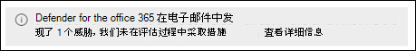

# 请尝试Microsoft Defender for Office 365

> [!NOTE]
> 本文介绍的功能为预览版，并非在所有组织中都可用，并且可能会更改。

Microsoft 365 Defender 门户中的统一试用版门户为以前单独的试用版和评估体验提供了单一入口点Microsoft Defender for Office 365。 目的是允许你在完全提交计划 2 Defender for Office 365 30 天内试用这些功能。 但是，根据贵组织的性质，评估体验Microsoft 365不同：

- 你已Microsoft 365邮箱，但当前正在使用第三方服务或设备进行电子邮件保护。 在将来自 Internet 的邮件发送到组织之前，邮件将流经Microsoft 365服务。 Microsoft 365防护尽可能低 (永远不会完全关闭;例如，始终在) 。

  

  在这些环境中，你只能尝试Defender for Office 365审核 *模式*。 无需更改 MX 记录的邮件流 (MX) 尝试Defender for Office 365。

- 你已经拥有一个Microsoft 365组织。 来自 Internet 的邮件直接Microsoft 365，但当前订阅仅Exchange Online Protection ([EOP ](exchange-online-protection-overview.md)) 或Defender for Office 365[计划 1](overview.md#microsoft-defender-for-office-365-plan-1-vs-plan-2-cheat-sheet)。

  

  在这些环境中，你可以尝试 *Defender for Office 365审核模式* 或阻止 *模式。*

你受邀在位于 的 Defender for Office 365 门户中的不同Microsoft 365 Defender开始试用版<https://security.microsoft.com>。 开始试用版的集中位置在 **试用页面上** ，位于 <https://security.microsoft.com/atpEvaluation>。

本文的其余部分介绍了审核模式阻止模式、如何配置评估和其他详细信息的区别。

## 概述Defender for Office 365

Defender for Office 365提供一系列全面的功能，帮助组织保护企业。 有关详细信息，[请参阅Microsoft Defender for Office 365。](defender-for-office-365.md)

您还可以在此交互式指南中了解有关Defender for Office 365[信息。](https://aka.ms/MS365D.InteractiveGuide)

## 阻止模式或审核模式中的策略

在评估Defender for Office 365时，存在控制保护功能Microsoft 365策略：

- **Exchange Online Protection (EOP)**：不创建任何新策略或特殊策略。 现有的 EOP 策略可以处理邮件 (例如，将邮件发送到"垃圾邮件"文件夹或隔离) ：

  - [反恶意软件策略](anti-malware-protection.md)
  - [入站反垃圾邮件保护](anti-spam-protection.md)
  - [防钓鱼策略中的反欺骗保护](set-up-anti-phishing-policies.md#spoof-settings)

  这些功能的默认策略始终启用，适用于所有收件人，并且始终在自定义策略 (应用最后一) 。

- **Defender for Office 365**：将创建专用于Defender for Office 365策略，用于评估Defender for Office 365：

  - [反钓鱼策略中的模拟保护](set-up-anti-phishing-policies.md#impersonation-settings-in-anti-phishing-policies-in-microsoft-defender-for-office-365)
  - [保险箱电子邮件的附件](safe-attachments.md)
  - [保险箱电子邮件和电子邮件的链接Microsoft Teams](safe-links.md)

  但是，这些策略在阻止模式和审核模式中的性质有所不同：

  - **审核模式**：已创建常规策略，但策略配置为仅 *检测* 威胁。 Defender for Office 365检测有害的邮件以用于报告，但是这些邮件不会 (例如，检测到的邮件不会) 。

  - **阻止模式**：使用预设安全策略的标准模板 [创建策略](preset-security-policies.md)。 Defender for Office 365 *对* 有害的 *邮件* 执行检测 (，例如，检测到的邮件将被隔离) 。

  默认选择和推荐选择是，将Defender for Office 365策略的范围设置为组织中所有用户。 但是，在设置期间或之后，你可以将策略分配更改为特定用户、组或电子邮件域。

**注意**：

- 保险箱链接将触发邮件流中的 URL。 若要阻止触发特定 URL，请使用租户允许/阻止列表。 有关详细信息，请参阅 [管理租户允许/阻止列表](tenant-allow-block-list.md)。
- 保险箱链接不会在电子邮件正文中包装 URL 链接。
- 评估策略设置在本文稍后的评估策略 [设置](#evaluation-policy-settings) 一节中介绍。

## 在审核模式下设置评估

1. 单击 **"开始评估"**。

2. 在" **打开保护"对话框中** ， **选择"否，我只需要报告**"，然后单击"继续 **"**。

3. 在 **"选择要包含的用户"对话框中** ，配置以下设置：

   - **所有用户**：这是默认和推荐选项。
   - **选择用户**：如果选择此选项，则需要选择评估适用于以下用户：
     - **用户**：你的组织内指定的邮箱、邮件用户或邮件联系人。
     - **组**：你的组织内指定的通讯组、启用邮件的安全组或 Microsoft 365 组。
     - **域**：你的组织内指定的 [接受域](/exchange/mail-flow-best-practices/manage-accepted-domains/manage-accepted-domains)中的所有收件人。

     单击相应的框，开始键入值，然后从结果中选择所需的值。 根据需要多次重复此过程。 若要删除现有值，请单击值旁边的  “删除”。

     对于用户或组，可以使用大多数标识符（名称、显示名称、别名、电子邮件地址、帐户名称等），但相应的显示名称则显示在结果中。对于用户，请自行输入星号（\*），以查看所有可用值。

   > [!NOTE]
   > 完成计算设置后，可以更改这些选择。

   完成后，单击"继续 **"**。

4. 在" **帮助我们了解邮件流** "对话框中，配置以下选项：

   - **与 Microsoft 共享数据**：此选项默认为选中状态，但如果需要，可以清除此复选框。

   - 根据我们对你的域的 MX 记录的检测，将自动选择以下选项之一：

     - **我使用的是第三** 方和/或本地服务提供商：域的 MX 记录指向除Microsoft 365。 单击"下一步"后，此选择需要以下其他 **设置**：

       1. 在 **"第三方或本地设置** "对话框中，配置以下设置：

          - **选择第三方服务提供商**：选择下列值之一：
            - **Barracuda**
            - **IronPort**
            - **Mimecast**
            - **Proofpoint**
            - **S一os**
            - **Symantec**
            - **Trend Micro**
            - **其他**

          - **要应用此评估的** 连接器：选择用于邮件流到邮件Microsoft 365。

            [增强的连接器筛选](/exchange/mail-flow-best-practices/use-connectors-to-configure-mail-flow/enhanced-filtering-for-connectors) (也称为跳过 *列表) 在* 指定的连接器上自动配置。

            当第三方服务或设备位于 Microsoft 365 中时，连接器的增强筛选功能可正确识别 Internet 邮件的来源，并显著提高 Microsoft 筛选堆栈 (尤其是欺骗智能的准确性，以及威胁资源管理器和自动调查 [& 响应 (AIR) ](automated-investigation-response-office.md)) 中的攻破后功能。

          - **列出邮件传递的每个网关 IP** 地址：只有为"选择第三方服务提供商"选择了"其他"时，此设置 **才可用**。 输入第三方保护服务或设备用于将邮件发送到邮箱的 IP 地址的逗号Microsoft 365。

          完成后，单击“**下一步**”。

       2. 在"**Exchange** 邮件流规则"对话框中，确定是否需要 Exchange Online 邮件流规则 (也称为传输规则) ，用于跳过第三方保护服务或设备的传入邮件的垃圾邮件筛选。

          您可能已在 Exchange Online 中拥有 SCL=-1 邮件流规则，该规则允许来自保护服务的所有入站邮件绕过大多数 (邮件) Microsoft 365筛选。 许多保护服务都鼓励使用此垃圾邮件可信度 (SCL) 邮件流规则方法，Microsoft 365客户使用其服务。

          如上一步所说明，连接器的增强筛选功能会自动在指定为来自保护服务的邮件源的连接器上配置。

          如果对来自保护服务的传入邮件启用针对没有 SCL=-1 规则的连接器的增强筛选功能，将大大提高 EOP 保护功能（如欺骗智能）的检测功能，并可能会影响新检测到的邮件的传递 (例如，移动到"垃圾邮件"文件夹或隔离) 。 此影响仅限于 EOP 策略;如前所述，Defender for Office 365审核模式下创建策略。

          若要创建 SCL=-1 邮件流规则或查看现有规则，请单击页面上的"转到Exchange **管理** 中心"按钮。 有关详细信息，请参阅使用邮件流规则设置邮件中 ([SCL) 的垃圾邮件可信度Exchange Online](/exchange/security-and-compliance/mail-flow-rules/use-rules-to-set-scl)。

          完成后，单击"完成 **"**。

     - **我仅使用Microsoft Exchange Online** 域指向域的 Yhe MX 记录Microsoft 365。 没有要配置执行任何操作，因此请单击"完成 **"**。

5. 设置评估时，将显示一个进度对话框。 完成设置后，单击"完成 **"**。

## 在阻止模式下设置评估

1. 单击 **"开始评估"**。

2. 在" **打开保护"对话框中** ，选择"是，通过阻止威胁 **保护我的** 组织"，然后单击"继续 **"**。

3. 在 **"选择要包含的用户"对话框中** ，配置以下设置：

   - **所有用户**：这是默认和推荐选项。
   - **选择用户**：如果选择此选项，则需要选择评估适用于以下用户：
     - **用户**：你的组织内指定的邮箱、邮件用户或邮件联系人。
     - **组**：你的组织内指定的通讯组、启用邮件的安全组或 Microsoft 365 组。
     - **域**：你的组织内指定的 [接受域](/exchange/mail-flow-best-practices/manage-accepted-domains/manage-accepted-domains)中的所有收件人。

     单击相应的框，开始键入值，然后从结果中选择所需的值。 根据需要多次重复此过程。 若要删除现有值，请单击值旁边的  “删除”。

     对于用户或组，可以使用大多数标识符（名称、显示名称、别名、电子邮件地址、帐户名称等），但相应的显示名称则显示在结果中。对于用户，请自行输入星号（\*），以查看所有可用值。

   > [!NOTE]
   > 完成计算设置后，可以更改这些选择。

   完成后，单击"继续 **"**。

4. 设置评估时，将显示一个进度对话框。 设置完成后，单击"完成 **"**。

## 审核模式下的报告

- 威胁[防护状态报告显示](view-email-security-reports.md#threat-protection-status-report)以下视图中Defender for Office 365检测：
  - [按电子邮件恶意软件查看 \> 数据，按检测技术查看图表细目](view-email-security-reports.md#view-data-by-email--malware-and-chart-breakdown-by-detection-technology)
  - [通过检测技术按电子邮件 \> 垃圾邮件和图表细分查看数据](view-email-security-reports.md#view-data-by-email--spam-and-chart-breakdown-by-detection-technology)
  - [通过电子邮件钓鱼查看数据 \> ，按检测技术查看图表细目](view-email-security-reports.md#view-data-by-email--phish-and-chart-breakdown-by-detection-technology)

- 在["](threat-explorer.md)威胁资源管理器"中，Defender for Office 365评估检测到的邮件在条目详细信息中显示以下横幅：

  

<!--- This stuff is likely not applicable for V2 reporting --->

上 **Microsoft Defender for Office 365**<https://security.microsoft.com/atpEvaluation>评估页面合并了评估中的策略报告：

- 反钓鱼策略中的模拟保护
- 安全链接
- 安全附件

默认情况下，图表显示最近 30  **30 天** ，然后从以下少于 30 天的其他值中选择：

- 24 小时
- 7 天
- 14 天
- 自定义日期范围

你可以单击下载  **下载** 以将图表数据下载到.csv文件中。

## 所需权限

下表介绍了Azure AD Defender for Microsoft 365评估所需的权限：

- **创建、修改或删除评估：** 安全管理员或全局管理员。
- **查看评估策略和报告：** 安全管理员或安全读者。

有关在 Azure AD 门户中Microsoft 365 Defender权限Azure AD，请参阅 Microsoft 365 Defender [门户](permissions-microsoft-365-security-center.md#azure-ad-roles-in-the-microsoft-365-defender-portal)中的角色

## 评估策略设置

下表介绍了Defender for Office 365创建用于评估的一组设置：

**防钓鱼评估策略设置**：

|设置|值|
|---|---|
|AdminDisplayName|评估策略|
|AuthenticationFailAction|MoveToJmf|
|已启用|True|
|EnableFirstContactSafetyTips|False|
|EnableMailboxIntelligence|True|
|EnableMailboxIntelligenceProtection|True|
|EnableOrganizationDomainsProtection|False|
|EnableSimilarDomainsSafetyTips|False|
|EnableSimilarUsersSafetyTips|False|
|EnableSpoofIntelligence|True|
|EnableSuspiciousSafetyTip|False|
|EnableTargetedDomainsProtection|False|
|EnableTargetedUserProtection|False|
|EnableUnauthenticatedSender|True|
|EnableUnusualCharactersSafetyTips|False|
|EnableViaTag|True|
|Guid|GUID 值|
|ImpersonationProtectionState|手动|
|IsDefault|False|
|MailboxIntelligenceProtectionAction|NoAction|
|MailboxIntelligenceProtectionActionRecipients|{}|
|MailboxIntelligenceQuarantineTag|DefaultFullAccessPolicy|
|名称|评估策略|
|PhishThresholdLevel|1|
|RecommendedPolicyType|评估|
|SpoofQuarantineTag|DefaultFullAccessPolicy|
|TargetedDomainActionRecipients|{}|
|TargetedDomainProtectionAction|NoAction|
|TargetedDomainQuarantineTag|DefaultFullAccessPolicy|
|TargetedUserActionRecipients|{}|
|TargetedUserProtectionAction|NoAction|
|TargetedUserQuarantineTag|DefaultFullAccessPolicy|
|||
|AntiPhishPolicyLevelDataList|空白|
|AntiSpoofEnforcementType|高|
|AuthenticationSafetyTipText|空白|
|AuthenticationSoftPassSafetyTipText|空白|
|EnableAuthenticationSafetyTip|False|
|EnableAuthenticationSoftPassSafetyTip|False|
|PolicyTag|空白|
|SimilarUsersSafetyTipsCustomText|空白|
|TreatSoftPassAsAuthenticated|True|
|UnusualCharactersSafetyTipsCustomText|空白|
|||
|ExcludedDomains|{}|
|ExcludedSenders|{}|
|TargetedDomainsToProtect|{}|
|TargetedUsersToProtect|{}|

**保险箱附件评估策略设置**：

|设置|值|
|---|---|
|Action|允许|
|ActionOnError|True|
|AdminDisplayName|评估策略|
|ConfidenceLevelThreshold|80|
|启用|True|
|EnableOrganizationBranding|False|
|Guid|GUID 值|
|IsBuiltInProtection|False|
|IsDefault|False|
|名称|评估策略|
|OperationMode|Delay|
|QuarantineTag|AdminOnlyAccessPolicy|
|RecommendedPolicyType|评估|
|Redirect|False|
|RedirectAddress|{}|
|ScanTimeout|30|

**保险箱链接评估策略设置**：

|设置|值|
|---|---|
|AdminDisplayName|评估策略|
|AllowClickThrough|False|
|CustomNotificationText|空白|
|DeliverMessageAfterScan|True|
|DisableUrlRewrite|True|
|DoNotRewriteUrls|{}|
|EnableForInternalSenders|False|
|EnableOrganizationBranding|False|
|EnableSafeLinksForTeams|True|
|Guid|GUID 值|
|IsBuiltInProtection|False|
|IsDefault|False|
|IsEnabled|True|
|LocalizedNotificationTextList|{}|
|名称|"EvaluationPolicy"|
|RecommendedPolicyType|评估|
|ScanUrls|True|
|TrackClicks|True|
|||
|DoNotAllowClickThrough|空白|
|DoNotTrackUserClicks|False|
|EnableSafeLinksForEmail|True|
|EnableSafeLinksForOffice|True|
|ExcludedUrls|{}|
|WhiteListedUrls|空白|
