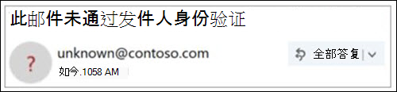

# 未验证发件人Unverified Sender

> [!NOTE]
> 这些更新现在即将推出，并且可能对所有用户不可用。These updates are rolling out now, and might not be available for all users. Enterprise Outlook.com and Enterprise Outlook Win32 desktop users 支持此功能。This feature is supported for Enterprise Outlook.com and Enterprise Outlook Win32 desktop users. 它目前对消费者 Office 365 用户不可用。It is not currently available for consumer Office 365 users.

若要防止仿冒邮件到达您的邮箱，Office 365 将验证发件人是否是他们所说的人，并将可疑邮件标记为垃圾邮件。To prevent phishing messages from reaching your mailbox, Office 365 verifies that the senders are who they say they are and mark suspicious messages as junk email.

> [!IMPORTANT]
> 将邮件标记为 "仿冒欺诈" 时，Outlook 会在页面顶部显示一条警告，但仍可打开邮件中的任何链接。When a message is marked as a phishing scam, Outlook displays a warning at the top of the page, but any links in the message can still be opened.

## 如何在收件箱中识别可疑邮件？How can I identify a suspicious message in my inbox?

当邮件的发件人无法识别或其标识与 "发件人" 地址中显示的内容不同时，Outlook 会显示指示器。Outlook shows indicators when the sender of a message either can't be identified or their identity is different from what you see in the From address.

## 您将在发件人图像中看到 "？"You see a '?' in the sender image

如果 Office 365 无法使用电子邮件身份验证技术验证发件人的身份，则会在发件人图像中显示 "？"。When Office 365 can't verify the identity of the sender using email authentication techniques, a '?' is displayed in the sender image.

并不是每个验证失败的邮件都是恶意的。Not every message that fails to authenticate is malicious. 但是，如果您不识别发件人，则应注意与不进行身份验证的邮件进行交互。However, you should be careful about interacting with messages that don't authenticate if you don't recognize the sender. 或者，如果您识别的发件人在发件人图像中通常不包含 '？ '，但突然开始看到它，则可能是发件人哄骗的签名。Or, if you recognize a sender that normally doesn't have a '?' in the sender image, but you suddenly start seeing it, that could be a sign the sender is being spoofed.

## 如何管理哪些邮件会收到未验证的发件人处理How to manage which messages receive the unverified sender treatment 

如果你是 Office 365 客户，则可以通过 Office 365 安全性 & 合规性中心管理此功能。If you are an Office 365 customer you can manage this feature through the Office 365 Security & Compliance Center.

- 在安全 & 合规性中心中，全局管理员或安全管理员可以通过反网络钓鱼策略下的反欺骗保护来打开或关闭该功能。In the Security & Compliance Center, global or security administrators can turn the feature on or off, through anti-spoofing protection under the Anti-Phish policy. 此外，还可以使用 Exchange Online PowerShell 中的**AntiPhishPolicy** cmdlet。Additionally, you can use the **Set-AntiPhishPolicy** cmdlet in Exchange Online PowerShell. 有关详细信息，请参阅[Office 365 中的反钓鱼防护](anti-phishing-protection.md)和 [AntiPhishPolicy](https://docs.microsoft.com/powershell/module/exchange/set-antiphishpolicy)。For details, see [Anti-phishing protection in Office 365](anti-phishing-protection.md) and [Set-AntiPhishPolicy](https://docs.microsoft.com/powershell/module/exchange/set-antiphishpolicy).

    

- 如果管理员已识别误报，并且发件人不应接收未验证的发件人处理，则可以执行下列操作之一将发件人添加到欺骗智能欺骗允许列表中：If an admin has identified a false positive, and a sender should not be receiving the unverified sender treatment, one of the following actions can be taken to add the sender to the Spoof Intelligence spoof allow list:

  - 通过欺骗性智能洞察力添加域对。Add the domain pair through the Spoof Intelligence Insight. 有关详细信息，请参阅[演练：欺骗性智能洞察力](walkthrough-spoof-intelligence-insight.md)。For details, see [Walkthrough: spoof intelligence insight](walkthrough-spoof-intelligence-insight.md).

  - 通过 Exchange Online PowerShell 中的**将 get-phishfilterpolicy** cmdlet 添加域对。Add the domain pair through the **Set-PhishFilterPolicy** cmdlet in Exchange Online PowerShell. 有关详细信息，请参阅[将 get-phishfilterpolicy](https://docs.microsoft.com/powershell/module/exchange/set-phishfilterpolicy)和[设置 Office 365 ATP 反网络钓鱼和反网络钓鱼策略](set-up-anti-phishing-policies.md)。For details, see [Set-PhishFilterPolicy](https://docs.microsoft.com/powershell/module/exchange/set-phishfilterpolicy) and [Set up Office 365 ATP anti-phishing and anti-phishing policies](set-up-anti-phishing-policies.md).

此外，如果邮件通过邮件流规则（也称为传输规则）或安全域列表（反垃圾邮件策略）传递到收件箱，则不会应用未验证的发件人处理。Additionally, we don't apply the unverified sender treatment if the message was delivered to the Inbox via mail flow rules (also known as transport rules) or the Safe Domain List (anti-spam policies).

## 如何管理 "via" 标记How to manage the 'via' tag 

如果你是 Office 365 客户，则可以通过 Office 365 安全性 & 合规性中心管理此功能，这与管理未验证的发件人处理的方法相同。If you are an Office 365 customer you can manage this feature through the Office 365 Security & Compliance center, the same way that you manage the unverified sender treatment. 如果将发件人添加到欺骗智能欺骗允许列表中，将不会应用 "via" 处理。If you add the sender to the Spoof Intelligence spoof allow list, the 'via' treatment will not be applied.

## 常见问题Frequently asked questions

### Outlook.com 和 Outlook Win32 desktop 用于添加 "？" 和 "via" 属性的条件是什么？What criteria does Outlook.com and Outlook Win32 desktop use to add the '?' and the 'via' properties?

对于发件人图像中的 "？"： Outlook.com 要求邮件传递 SPF 或 DKIM 身份验证，并接收 dmarc pass 或来自 Office 365 欺骗智能的复合身份验证传递。For the '?' in the sender image:  Outlook.com requires that the message pass either SPF or DKIM authentication and receive either a dmarc pass, or a composite authentication pass from Office 365 Spoof Intelligence. 有关详细信息，请参阅[Set UP SPF In office 365，以帮助防止哄骗](set-up-spf-in-office-365-to-help-prevent-spoofing.md)和[使用 DKIM 验证从您的自定义域在 Office 365 中发送的出站电子邮件](use-dkim-to-validate-outbound-email.md)。For details, see [Set up SPF in Office 365 to help prevent spoofing](set-up-spf-in-office-365-to-help-prevent-spoofing.md) and [Use DKIM to validate outbound email sent from your custom domain in Office 365](use-dkim-to-validate-outbound-email.md).

对于 via 标记：如果 "发件人" 地址中的域不同于 DKIM 签名中的域，或者 SMTP 邮件来自，则 Outlook.com 将在这两个字段之一中显示域（首选 DKIM 签名）。For the via tag: If the domain in the From address is different from the domain in the DKIM signature or the SMTP MAIL FROM, Outlook.com displays the domain in one of those two fields (preferring the DKIM signature).

### 如何在不利用欺骗智能欺骗允许列表的情况下删除 '？ '？How do I remove the '?' without utilizing the Spoof Intelligence spoof allow list?

对于发件人图像中的 '？ '，作为发件人，应使用 SPF 或 DKIM 对邮件进行身份验证。For the '?' in the sender image: As a sender, you should authenticate your message with either SPF or DKIM.

对于 via 标记：作为发件人，应确保 "DKIM" 签名中的域或 "发件人" 中的 "SMTP 邮件" 与 "发件人" 地址中的域相同，或者是的子域。For the via tag: As a sender, you should ensure that either the domain in the DKIM signature or the SMTP MAIL FROM is the same as, or is a subdomain of, the domain in the From address.

### 是否对不通过身份验证的每封邮件显示此 Outlook.com 和 Outlook Win32 桌面？Do Outlook.com and Outlook Win32 desktop show this for every message that doesn't pass authentication?

不一定。Not necessarily. Office 365 在邮件中可能有其他属性来对发件人进行身份验证。Office 365 may have other properties within the message to authenticate the sender.

## 相关主题Related topics

[帮助保护你的 Outlook.com 电子邮件帐户Help protect your Outlook.com email account](https://support.microsoft.com/office/a4f20fc5-4307-4ece-8231-6d4d4bd8a9ba)

[在 Outlook.com 中处理网络钓鱼或欺骗Deal with phishing or spoofing in Outlook.com](https://support.office.com/article/0d882ea5-eedc-4bed-aebc-079ffa1105a3)

[在 web 上的 Outlook 中筛选垃圾电子邮件和垃圾邮件Filter junk email and spam in Outlook on the web](https://support.microsoft.com/office/db786e79-54e2-40cc-904f-d89d57b7f41d)
