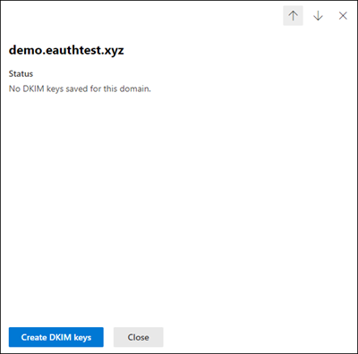
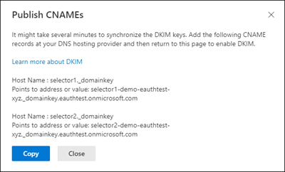
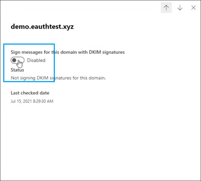

# <a name="use-dkim-to-validate-outbound-email-sent-from-your-custom-domain"></a>使用 DKIM 验证从自定义域发送的出站电子邮件

[!INCLUDE [Microsoft 365 Defender rebranding](../includes/microsoft-defender-for-office.md)]

**适用对象**
- [Exchange Online Protection](exchange-online-protection-overview.md)
- [Microsoft Defender for Office 365 计划 1 和计划 2](defender-for-office-365.md)
- [Microsoft 365 Defender](../defender/microsoft-365-defender.md)

 本文列出了在 Microsoft365 中使用域密钥识别邮件 (DKIM) 的步骤，以确保目标电子邮件系统信任从自定义域发送的出站邮件。

本文内容：

- [DKIM 如何能够比单独使用 SPF 更有效地防止恶意欺骗](#how-dkim-works-better-than-spf-alone-to-prevent-malicious-spoofing)
- [从 Microsoft 365 Defender 门户创建、启用和禁用 DKIM 的步骤](#steps-to-create-enable-and-disable-dkim-from-microsoft-365-defender-portal)
- [手动将 1024 位密钥升级到 2048 位 DKIM 加密密钥的步骤](#steps-to-manually-upgrade-your-1024-bit-keys-to-2048-bit-dkim-encryption-keys)
- [手动设置 DKIM 的步骤](#steps-to-manually-set-up-dkim)
- [为多个自定义域配置 DKIM 的步骤](#to-configure-dkim-for-more-than-one-custom-domain)
- [为自定义域禁用 DKIM 签名策略](#disabling-the-dkim-signing-policy-for-a-custom-domain)
- [DKIM 和 Microsoft 365 的默认行为](#default-behavior-for-dkim-and-microsoft-365)
- [设置 DKIM 以便第三方服务可以代表自定义域发送或假冒电子邮件](#set-up-dkim-so-that-a-third-party-service-can-send-or-spoof-email-on-behalf-of-your-custom-domain)
- [后续步骤：为 Microsoft 365 设置 DKIM 后](#next-steps-after-you-set-up-dkim-for-microsoft-365)

> [!NOTE]
> Microsoft 365 自动为它的初始“onmicrosoft.com”域设置 DKIM。 这意味着无需执行任何操作，即可为任意初始域名（例如 litware.onmicrosoft.com）。 有关域的详细信息，请参阅[关于域的常见问题](../../admin/setup/domains-faq.yml#why-do-i-have-an--onmicrosoft-com--domain)。

DKIM 是三种身份验证方法（SPF、DKIM 和 DMARC）之一，可帮助防止攻击者发送看起来像来自你的域的邮件。

DKIM 允许你在邮件头中为出站电子邮件添加数字签名。配置 DKIM 时，你授权域使用加密身份验证将其名称与电子邮件关联或签名。从你的域获取电子邮件的电子邮件系统可以使用此数字签名来帮助验证传入的电子邮件是否合法。

基本来说，私钥对域的传出电子邮件的邮件头进行加密。 公钥在域的 DNS 记录中发布，接收服务器可以使用该密钥解码签名。 DKIM 验证帮助接收服务器确认邮件确实来自你的域，而非 *欺骗* 分子。

> [!TIP]
>你也可以选择对自己的自定义域不执行任何有关 DKIM 的操作。如果你没有为自定义域设置 DKIM，Microsoft 365 会创建私钥和公钥对，启用 DKIM 签名，然后为自定义域配置 Microsoft 365 默认策略。

 Microsoft-365 的内置 DKIM 配置对大多数客户来说已经足够。但仍应在以下情况为自定义域手动配置 DKIM：

- 在 Microsoft 365 中有多个自定义域
- 您同时要设置 DMARC（**推荐**）
- 您想要控制您的私钥
- 您要自定义 CNAME 记录
- 你想为源自第三方域的电子邮件设置 DKIM 密钥，例如，如果你使用第三方群发邮件程序。

## <a name="how-dkim-works-better-than-spf-alone-to-prevent-malicious-spoofing"></a>DKIM 如何能够比单独使用 SPF 更有效地防止恶意欺骗
<a name="HowDKIMWorks"> </a>

虽然 SPF 将信息添加到邮件信封中，但 DKIM 在邮件头中 *加密签名*。当你转发邮件时，转发服务器可能会截除邮件信封部分。由于数字签名作为电子邮件头的一部分与电子邮件同时存在，因此即使当邮件已如以下示例所示进行了转发，DKIM 也仍在工作。


在此示例中，如果您只发布了域的一条 SPF TXT 记录，收件人的邮件服务器可能已将您的电子邮件标记为垃圾邮件，并生成一个误报结果。**在这种情况下，添加 DKIM 可以减少 *误报* 垃圾邮件** 报告。由于 DKIM 依赖于公钥加密（而不仅仅对 IP 地址加密）进行身份验证，DKIM 被认为是比 SPF 更强大的身份验证形式。建议在部署中同时使用 SPF、DKIM 以及 DMARC。

> [!TIP]
> DKIM 使用私钥将加密的签名插入邮件头中。在邮件头中，将签名域或出站域作为 **d=** 字段中的值插入。然后，验证域或收件人域使用 **d=** 字段从 DNS 中查找公钥，并对邮件进行身份验证。如果邮件已经过验证，则通过 DKIM 检查。

## <a name="steps-to-create-enable-and-disable-dkim-from-microsoft-365-defender-portal"></a>从 Microsoft 365 Defender 门户创建、启用和禁用 DKIM 的步骤

租户的所有接受域都将显示在 Microsoft 365 Defender 门户中的 DKIM 页下。 如果未看到，请从 [域页面](/microsoft-365/admin/setup/add-domain#add-a-domain) 添加接受的域。
添加域后，按照如下所示的步骤配置 DKIM。

步骤 1：单击希望在 DKIM 页上配置 DKIM 的域（https://security.microsoft.com/dkimv2 或 https://protection.office.com/dkimv2)。


步骤 2：单击“创建 DKIM 密钥”。



步骤 3：复制弹出窗口中显示的 CNAMES



步骤 4：将复制的 CNAME 记录发布到 DNS 服务提供程序。

在 DNS 提供程序的网站上，为要启用的 DKIM 添加 CNAME 记录。 请确保将每个字段设置为以下值：

```text
Record Type: CNAME (Alias)
> Host: Paste the values you copy from DKIM page.
Points to address: Copy the value from DKIM page.
TTL: 3600 (or your provider default)
```

步骤 5：返回到 DKIM 页以启用 DKIM。



如果看到 CNAME 记录不存在错误，则可能是由于：

1. 与 DNS 服务器同步，这可能需要几秒钟到几个小时。如果问题仍然存在，请重复这些步骤
2. 检查是否有任何复制粘贴错误，如额外的空格或选项卡等。

如果要禁用 DKIM，请切换回禁用模式

## <a name="steps-to-manually-upgrade-your-1024-bit-keys-to-2048-bit-dkim-encryption-keys"></a>手动将 1024 位密钥升级到 2048 位 DKIM 加密密钥的步骤
<a name="1024to2048DKIM"> </a>

> [!NOTE]
> Microsoft 365 会自动为 *onmicrosoft.com* 域设置 DKIM。 无需任何步骤就可以将 DKIM 用于任何初始域名（如 litware.*onmicrosoft.com*）。 有关域的详细信息，请参阅[关于域的常见问题](../../admin/setup/domains-faq.yml#why-do-i-have-an--onmicrosoft-com--domain)。

由于 DKIM 键同时支持 1024 位和 2048 位版，这些说明将告诉你如何在 [Exchange Online PowerShell](/powershell/exchange/connect-to-exchange-online-powershell)中将 1024 位密钥升级到 2048。 以下步骤针对的是两种用例，请选择最适合你的配置的步骤。

- 如果 **配置了 DKIM**，请通过运行以下命令轮换位数：

  ```powershell
  Rotate-DkimSigningConfig -KeySize 2048 -Identity <DkimSigningConfigIdParameter>
  ```

  **或者**

- 要 **实现新的 DKIM**，请运行以下命令：

  ```powershell
  New-DkimSigningConfig -DomainName <Domain for which config is to be created> -KeySize 2048 -Enabled $true
  ```

保持连接到 Exchange Online PowerShell *运行* 验证是否包括该配置：

```powershell
Get-DkimSigningConfig -Identity <Domain for which the configuration was set> | Format-List
```

> [!TIP]
> 这一新的 2048 位密钥将在 RotateOnDate 生效，在过渡期间则使用 1024 位密钥发送电子邮件。 四天后，可以使用 2048 位秘钥再次进行测试（即一旦轮换对第二个选择器生效）。

如果要旋转到第二个选择器，请在四天后确认 是否正在使用 2048 位，然后通过使用上面列出的适当 cmdlet 手动轮换第二个选择器键。

有关详细语法和参数信息，请参阅以下文章： [Rotate-DkimSigningConfig](/powershell/module/exchange/rotate-dkimsigningconfig)、 [New-DkimSigningConfig](/powershell/module/exchange/new-dkimsigningconfig)和 [Get-DkimSigningConfig](/powershell/module/exchange/get-dkimsigningconfig)。

## <a name="steps-to-manually-set-up-dkim"></a>手动设置 DKIM 的步骤
<a name="SetUpDKIMO365"> </a>

要配置 DKIM，您需要完成以下步骤：

- [在 DNS 中发布自定义域的两条 CNAME 记录](use-dkim-to-validate-outbound-email.md#Publish2CNAME)
- [为自定义域启用 DKIM 签名](use-dkim-to-validate-outbound-email.md#EnableDKIMinO365)

### <a name="publish-two-cname-records-for-your-custom-domain-in-dns"></a>在 DNS 中发布自定义域的两条 CNAME 记录
<a name="Publish2CNAME"> </a>

对于您要为其在 DNS 中添加 DKIM 签名的每个域，您需要发布两条 CNAME 记录。

> [!NOTE]
> 如果尚未阅读完整文章，则你可能遗漏了此节约时间的 PowerShell 连接信息： [连接到 Exchange Online PowerShell](/powershell/exchange/connect-to-exchange-online-powershell)。

在 Exchange Online PowerShell 中运行以下命令以创建选择器记录：

```powershell
New-DkimSigningConfig -DomainName <domain> -Enabled $false
Get-DkimSigningConfig -Identity <domain> | Format-List Selector1CNAME, Selector2CNAME
```

如果在 Microsoft 365 中除了初始域外还预配了自定义域，则必须为额外配置的每个域发布两条 CNAME 记录。因此，如果有两个域，就必须发布两条额外的 CNAME 记录，依此类推。

CNAME 记录使用以下格式。

> [!IMPORTANT]
> 如果你是我们的 GCC High 客户，我们会以不同方式计算 _customDomainIdentifier_！ 不是查找你的 _initialDomain_ 来计算 _customDomainIdentifier_，而是直接从自定义域计算。 例如，如果自定义域名为“contoso.com”，则 _customDomainIdentifier_ 将变为“contoso-com”，任何句点都将替换为短划线。 因此，无论 _initialDomain_ 指向什么 MX 记录，你都将始终使用上述方法来计算要在 CNAME 记录中使用的 _customDomainIdentifier_。

```console
Host name:            selector1._domainkey
Points to address or value:    selector1-<customDomainIdentifier>._domainkey.<initialDomain>
TTL:                3600

Host name:            selector2._domainkey
Points to address or value:    selector2-<customDomainIdentifier>._domainkey.<initialDomain>
TTL:                3600
```

其中：

- 对于 Microsoft 365，选择器始终为“selector1”或“selector2”。
- _customDomainIdentifier_ 与显示在 mail.protection.outlook.com 前面的自定义域的自定义 MX 记录中的 _customDomainIdentifier_ 相同。 例如，在域 contoso.com 的以下 MX 记录中，_customDomainIdentifier_ 为 contoso com：

  > contoso.com.  3600  IN  MX   5 contoso-com.mail.protection.outlook.com

- _initialDomain_ 是你在注册 Microsoft 365 时所使用的域。 初始域始终以 onmicrosoft.com 结尾。 有关确定初始域的信息，请参阅[关于域的常见问题](../../admin/setup/domains-faq.yml#why-do-i-have-an--onmicrosoft-com--domain)。

例如，如果你有一个初始域 cohovineyardandwinery.onmicrosoft.com，以及两个自定义域 cohovineyard.com 和 cohowinery.com，那么你需要为额外配置的每个域设置两条 CNAME 记录，总共四条 CNAME 记录。

```console
Host name:            selector1._domainkey
Points to address or value:    selector1-cohovineyard-com._domainkey.cohovineyardandwinery.onmicrosoft.com
TTL:                3600

Host name:            selector2._domainkey
Points to address or value:    selector2-cohovineyard-com._domainkey.cohovineyardandwinery.onmicrosoft.com
TTL:                3600

Host name:            selector1._domainkey
Points to address or value:    selector1-cohowinery-com._domainkey.cohovineyardandwinery.onmicrosoft.com
TTL:                3600

Host name:            selector2._domainkey
Points to address or value:    selector2-cohowinery-com._domainkey.cohovineyardandwinery.onmicrosoft.com
TTL:                3600
```

> [!NOTE]
> 创建第二条记录非常重要，但创建时仅可使用其中一个选择器。 实际上，第二个选择器可能指向尚未创建的地址。 我们仍然建议创建第二条 CNAME 记录，因为你的密钥轮换是无缝的。

### <a name="steps-to-enable-dkim-signing-for-your-custom-domain"></a>为自定义域启用 DKIM 签名的步骤
<a name="EnableDKIMinO365"> </a>

在 DNS 中发布了 CNAME 记录后，就可以通过 Microsoft 365 启用 DKIM 签名。为此，可以使用 Microsoft 365 管理中心或 PowerShell。

#### <a name="to-enable-dkim-signing-for-your-custom-domain-in-the-microsoft-365-defender-portal"></a>若要在 Microsoft 365 Defender 门户中为自定义域启用 DKIM 签名

1. 在 Microsoft 365 Defender 门户的 <https://security.microsoft.com> 中，转到“**规则**”部分中的“**电子邮件和协作**”\>“**策略和规则**”\>“**威胁策略**”\>“**DKIM**”。 若要直接转到 DKIM 页面，请使用 <https://security.microsoft.com/dkimv2>。

2. 在 **DKIM** 页面，通过点击名称选择域。

3. 在出现的详细信息浮出控件中，将 **使用 DKIM 签名为该域签名消息** 设置更改为 **已启用**（）

   完成后，请点击 **轮换 DKIM 密钥**。

4. 对每个自定义域重复这些步骤。

5. 如果是首次配置 DKIM，并且看到错误“没有为此域保存 DKIM 密钥”，则必须使用 Windows PowerShell 启用 DKIM 签名，如下一步中所述。

#### <a name="to-enable-dkim-signing-for-your-custom-domain-by-using-powershell"></a>使用 PowerShell 为自定义域启用 DKIM 签名

> [!IMPORTANT]
> :::image type="content" source="../../media/dkim.png" alt-text="“此域未保存 DKIM 密钥。”错误。":::
> 如果是第一次配置 DKIM，并看到“没有为该域保存 DKIM 密钥”的错误，请完成下面第 2 步的命令 (例如，`Set-DkimSigningConfig -Identity contoso.com -Enabled $true`) 来查看密钥。

1. [连接到 Exchange Online PowerShell](/powershell/exchange/connect-to-exchange-online-powershell)。

2. 使用以下语法:

   ```powershell
   Set-DkimSigningConfig -Identity <Domain> -Enabled $true
   ```

   \<Domain\> 是想启用 DKIM 签名的自定义域的名称。

   此示例为域名 contoso.com 启用了 DKIM 签名:

   ```powershell
   Set-DkimSigningConfig -Identity contoso.com -Enabled $true
   ```

#### <a name="to-confirm-dkim-signing-is-configured-properly-for-microsoft-365"></a>确认是否已为 Microsoft 365 正确配置 DKIM 签名的具体步骤

请等待几分钟，然后按以下步骤操作，确认是否已正确配置 DKIM。这样就有时间将域的 DKIM 信息分布到整个网络了。

- 从 Microsoft 365 中已启用 DKIM 的域内的帐户向其他电子邮件帐户（如 outlook.com 或 Hotmail.com）发送邮件。
- 不要将 aol.com 帐户用于测试目的。如果 SPF 检查通过，AOL 可能会跳过 DKIM 检查。这会使测试无效。
- 打开邮件，然后查看邮件头。查看邮件头的说明因邮件客户端而异。有关在 Outlook 中查看邮件头的说明，请参阅[在 Outlook 中查看电子邮件头](https://support.microsoft.com/office/cd039382-dc6e-4264-ac74-c048563d212c)。

  进行了 DKIM 签名的邮件将包含主机名以及您在发布 CNAME 条目时定义的域。该邮件如下例所示：

  ```console
    From: Example User <example@contoso.com>
    DKIM-Signature: v=1; a=rsa-sha256; q=dns/txt; c=relaxed/relaxed;
        s=selector1; d=contoso.com; t=1429912795;
        h=From:To:Message-ID:Subject:MIME-Version:Content-Type;
        bh=<body hash>;
        b=<signed field>;
  ```

- 查找身份验证结果标头。尽管每个接收服务用于标记传入邮件的格式稍有不同，但结果应都包括以下类似内容：**DKIM=pass** 或 **DKIM=OK**

## <a name="to-configure-dkim-for-more-than-one-custom-domain"></a>为多个自定义域配置 DKIM 的具体步骤
<a name="DKIMMultiDomain"> </a>

如果你在将来决定添加其他自定义域，并且想要为新域启用 DKIM，必须为每个域完成本文中介绍的步骤。尤其需要完成 [手动设置 DKIM 需要执行的操作](use-dkim-to-validate-outbound-email.md#SetUpDKIMO365) 中的所有步骤。

## <a name="disabling-the-dkim-signing-policy-for-a-custom-domain"></a>为自定义域禁用 DKIM 签名策略
<a name="DisableDKIMSigningPolicy"> </a>

禁用签名策略不会完全禁用 DKIM。 一段时间后，如果默认策略仍处于启用状态，则 Microsoft 365 将自动为域应用默认策略。 如果希望完全禁用 DKIM，则需要同时在自定义域和默认域上禁用 DKIM。 有关详细信息，请参阅 [DKIM 和 Microsoft 365 的默认行为](use-dkim-to-validate-outbound-email.md#DefaultDKIMbehavior)。

### <a name="to-disable-the-dkim-signing-policy-by-using-windows-powershell"></a>使用 Windows PowerShell 禁用 DKIM 签名策略

1. [连接到 Exchange Online PowerShell](/powershell/exchange/connect-to-exchange-online-powershell)。

2. 为您要为其禁用 DKIM 签名的每个域运行以下命令之一。

   ```powershell
   $p = Get-DkimSigningConfig -Identity <Domain>
   $p[0] | Set-DkimSigningConfig -Enabled $false
   ```

   例如：

   ```powershell
   $p = Get-DkimSigningConfig -Identity contoso.com
   $p[0] | Set-DkimSigningConfig -Enabled $false
   ```

   或

   ```powershell
   Set-DkimSigningConfig -Identity $p[<number>].Identity -Enabled $false
   ```

   其中， _number_ 是策略的索引。例如：

   ```powershell
   Set-DkimSigningConfig -Identity $p[0].Identity -Enabled $false
   ```

## <a name="default-behavior-for-dkim-and-microsoft-365"></a>DKIM 和 Microsoft 365 的默认行为
<a name="DefaultDKIMbehavior"> </a>

如果不启用 DKIM，Microsoft 365 会自动为 Microsoft Online 电子邮件路由地址 (MOERA)/初始域创建 2048 位 DKIM 公钥，以及我们存储在内部（我们的数据中心中）的关联私钥。 默认情况下，Microsoft 365 对没有适当策略的域使用默认签名配置。 也就是说，如果你自己没有设置 DKIM，Microsoft 365 会使用它的默认策略和它创建的密钥来为你的域启用 DKIM。

此外，如果启用后在自定义域上禁用 DKIM 签名，则在一段时间后，Microsoft 365 将自动为自定义域应用 MOERA/初始域策略。

在以下示例中，假定 fabrikam.com 的 DKIM 已由 Microsoft 365（而不是域管理员）启用。这表明 DNS 中没有所需的 CNAME。来自此域的电子邮件的 DKIM 签名如下所示：

```console
From: Second Example <second.example@fabrikam.com>
DKIM-Signature: v=1; a=rsa-sha256; q=dns/txt; c=relaxed/relaxed;
    s=selector1-fabrikam-com; d=contoso.onmicrosoft.com; t=1429912795;
    h=From:To:Message-ID:Subject:MIME-Version:Content-Type;
    bh=<body hash>;
    b=<signed field>;
```

在此示例中，主机名和域包含在 fabrikam.com 的 DKIM 签名由域管理员启用情况下 CNAME 将指向的值。发送自 Microsoft 365 的每封邮件将最终进行 DKIM 签名。如果自行启用 DKIM，该域将与发件人地址（此例中为 fabrikam.com）中的域相同。如果不自行启用，该域将不同于发件人地址中的域，而是会使用组织的初始域。有关如何确定初始域的信息，请参阅 [域常见问题解答](../../admin/setup/domains-faq.yml#why-do-i-have-an--onmicrosoft-com--domain)。

## <a name="set-up-dkim-so-that-a-third-party-service-can-send-or-spoof-email-on-behalf-of-your-custom-domain"></a>设置 DKIM 以便第三方服务可以代表自定义域发送或假冒电子邮件
<a name="SetUp3rdPartyspoof"> </a>

一些批量电子邮件服务提供商或服务型软件提供商允许你为来自其服务的电子邮件设置 DKIM 密钥。这需要你自己和第三方之间进行协调，从而设置必要的 DNS 记录。某些第三方服务器可能使用不同的选择器来获取自身的 CNAME 记录。任何两个组织的操作过程都不会完全相同。相反，此过程完全因组织而异。

显示为 contoso.com 和 bulkemailprovider.com 正确配置了 DKIM 的示例邮件如下所示：

```console
Return-Path: <communication@bulkemailprovider.com>
 From: <sender@contoso.com>
 DKIM-Signature: s=s1024; d=contoso.com
 Subject: Here is a message from Bulk Email Provider's infrastructure, but with a DKIM signature authorized by contoso.com
```

在此示例中，为了获得该结果：

1. 批量电子邮件提供商为 Contoso 提供一个 DKIM 公钥。

2. Contoso 将 DKIM 密钥发布到 DNS 记录。

3. 发送电子邮件时，批量电子邮件提供商使用相应的私钥对密钥进行签名。这样一来，批量电子邮件提供商可以将 DKIM 签名附加到邮件头中。

4. 接收电子邮件系统通过对电子邮件键的收件人：(5322.From) 地址中的域验证 DKIM-Signature d=\<domain\> 值来执行 DKIM 检查。在此示例中，该值匹配：

   > sender@**contoso.com**

   > d=**contoso.com**

## <a name="identify-domains-that-do-not-send-email"></a>确定不发送电子邮件的域

组织应该通过在这些域的DKIM记录中明确说明 `v=DKIM1; p=`域是否不发送电子邮件。 这将告知接收邮件的服务器，该域没有有效的公共密钥，任何声称来自该域的邮件都应该被拒绝。 应该为每个域和子域使用通配符DKIM来执行此操作。

例如，DKIM 记录将如下所示：

```console
*._domainkey.SubDomainThatShouldntSendMail.contoso.com. TXT "v=DKIM1; p="
```

## <a name="next-steps-after-you-set-up-dkim-for-microsoft-365"></a>后续步骤：为 Microsoft 365 设置 DKIM 后
<a name="DKIMNextSteps"> </a>

**尽管 DKIM 旨在帮助防止欺骗，但 DKIM 与 SPF 和 DMARC 协同工作效果更佳。**

设置了 DKIM 后，如果你尚未设置 SPF，则应执行此操作。有关 SPF 的简要介绍以及快速配置 SPF 的信息，请参阅 [**在 Microsoft 365 中设置 SPF 以帮助防止欺骗**](set-up-spf-in-office-365-to-help-prevent-spoofing.md)。有关 Microsoft 365 如何使用 SPF 的更深入了解，或者有关故障排除或非标准部署（如混合部署）的信息，请首先阅读 [Microsoft 365 如何使用发件人策略框架 (SPF) 来防止欺骗](how-office-365-uses-spf-to-prevent-spoofing.md)。

接下来，请参阅 [**使用 DMARC 验证电子邮件**](use-dmarc-to-validate-email.md)。 [反垃圾邮件邮件头](anti-spam-message-headers.md)包括 Microsoft 365 用来执行 DKIM 检查的语法和头字段。

**此测试将验证** DKIM 签名配置是否正确配置，以及是否发布了正确的 DNS 条目。

<div class="nextstepaction">
<p><a href="https://admin.microsoft.com/AdminPortal/?searchSolutions=DKIM#/homepage" data-linktype="external">运行测试：DKIM</a></p>
</div>

## <a name="more-information"></a>更多信息

通过 PowerShell 进行密钥轮换：[Rotate DkimSigningConfig](/powershell/module/exchange/rotate-dkimsigningconfig) 

[使用 DMARC 验证电子邮件](use-dmarc-to-validate-email.md)
