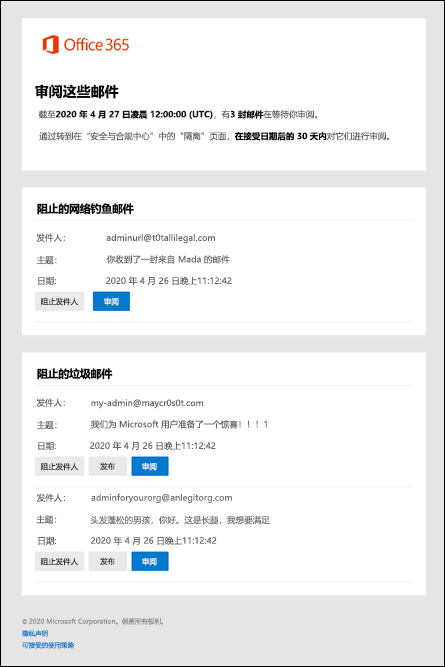

# 使用隔离通知释放并报告隔离邮件

[!INCLUDE [Microsoft 365 Defender rebranding](../includes/microsoft-defender-for-office.md)]

**适用对象**
- [Exchange Online Protection](exchange-online-protection-overview.md)
- [Microsoft Defender for Office 365 计划 1 和计划 2](defender-for-office-365.md)
- [Microsoft 365 Defender](../defender/microsoft-365-defender.md)

无论是在有 Exchange Online 邮箱的 Microsoft 365 组织中，还是在没有 Exchange Online 邮箱的独立 Exchange Online Protection (EOP) 组织中，隔离功能都会隔离具有潜在危险或不需要的邮件。 有关详细信息，请参阅 [EOP 中的隔离邮件](quarantine-email-messages.md)。

_隔离_ 策略根据邮件被隔离的原因来定义允许用户对隔离邮件 (支持的功能) 。 有关详细信息，请参阅 [隔离策略](quarantine-policies.md)。 隔离策略还控制受影响的收件人是否 (共享邮箱 _) 定期收到_ 有关其隔离邮件的隔离通知。 隔离通知替代了所有支持保护功能的最终用户垃圾邮件 (，而不仅是反垃圾邮件策略裁定) 。

管理员还可使用隔离策略中的全局设置来自定义发件人的 显示名称、不同语言的免责声明文本以及通知中使用的公司徽标。 有关说明，请参阅在门户[中配置全局隔离Microsoft 365 Defender设置](quarantine-policies.md#configure-global-quarantine-notification-settings-in-the-microsoft-365-defender-portal)。

对于共享邮箱，仅向共享邮箱授予 FullAccess 权限的用户支持隔离通知。 有关详细信息，请参阅使用 [EAC 编辑共享邮箱委派](/Exchange/collaboration-exo/shared-mailboxes#use-the-eac-to-edit-shared-mailbox-delegation)。

> [!NOTE]
> 默认情况下，被隔离为高可信度网络钓鱼、恶意软件、邮件流规则 (也称为传输规则) 或在 Defender for Office 365 中隔离为 保险箱 附件策略的邮件仅对管理员可用。 有关详细信息，请参阅 [在 EOP 中以管理员身份管理已隔离邮件和文件](manage-quarantined-messages-and-files.md)。
>
> 组不支持隔离通知。

当您收到隔离通知时，以下信息始终可用于每个隔离邮件：

- **发件人**：已隔离邮件的发送名称和电子邮件地址。
- **主题**：隔离邮件的主题行文本。
- **日期**：隔离邮件 (的日期和时间) UTC 格式。

隔离通知中可用的操作取决于邮件被隔离的原因，以及关联的隔离策略分配的权限。 有关详细信息，请参阅隔离 [策略权限详细信息](quarantine-policies.md#quarantine-policy-permission-details)。

默认情况下，对于被隔离为垃圾邮件、高可信度垃圾邮件或批量邮件的邮件，隔离通知中提供以下操作：

- **阻止发件人**：单击此链接将发件人添加到邮箱上的 _阻止发件人列表中_ 。 有关详细信息，请参阅 [阻止邮件发件人](https://support.microsoft.com/office/b29fd867-cac9-40d8-aed1-659e06a706e4)。
- **释放**：你可以在此处释放邮件，**而无需在** Microsoft 365 Defender 门户中。
- **Review**： Click this link to go to **Quarantine** in the Microsoft 365 Defender portal， where you can (depending on why the message was quarantined) view， release， delete or report your quarantined messages. 有关详细信息，请参阅在 [EOP](find-and-release-quarantined-messages-as-a-user.md)中以用户模式查找并释放隔离邮件。

> [!NOTE]
> 阻止的发件人仍可向您发送邮件。 来自此发件人的任何发送到您的邮箱的邮件将立即移动到"垃圾邮件"文件夹。 以后来自此发件人的邮件将转到"垃圾邮件"文件夹或隔离。 如果要在到达时删除这些邮件，而不是隔离它们，请使用邮件流规则 [ (也称为](/exchange/security-and-compliance/mail-flow-rules/mail-flow-rules) 传输规则) 到达时删除邮件。
