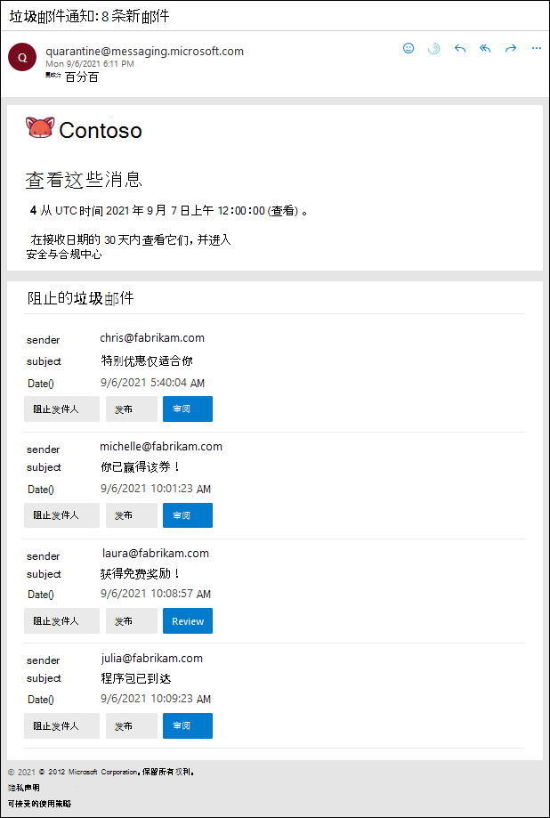

# 使用用户垃圾邮件通知释放和报告隔离的邮件Use user spam notifications to release and report quarantined messages

在没有 Exchange Online 邮箱的 Exchange Online 或独立 Exchange Online 保护（EOP）组织中具有邮箱的 Microsoft 365 组织中，隔离会保留可能有害或不需要的邮件。In Microsoft 365 organizations with mailboxes in Exchange Online or standalone Exchange Online Protection (EOP) organizations without Exchange Online mailboxes, quarantine holds potentially dangerous or unwanted messages. 有关详细信息，请参阅[EOP 中的隔离邮件](quarantine-email-messages.md)。For more information, see [Quarantined messages in EOP](quarantine-email-messages.md).

默认情况下，在反垃圾邮件策略中禁用最终用户垃圾邮件通知。By default, end-user spam notifications are disabled in anti-spam policies. 当管理员[启用最终用户垃圾邮件通知](configure-your-spam-filter-policies.md#configure-end-user-spam-notifications)后，收件人（包括共享邮箱）将收到有关被隔离为垃圾邮件、批量电子邮件或（截止到2020年4月）的网络钓鱼的定期通知。When an admin [enables end-user spam notifications](configure-your-spam-filter-policies.md#configure-end-user-spam-notifications), recipients (including shared mailboxes) will receive periodic notifications about their messages that were quarantined as spam, bulk email, or (as of April 2020) phishing.

> [!NOTE]
> 被隔离为高可信度网络钓鱼、恶意软件或通过邮件流规则（也称为传输规则）的邮件仅适用于管理员。Messages that were quarantined as high confidence phishing, malware, or by mail flow rules (also known as transport rules) are only available to admins. 有关详细信息，请参阅[在 EOP 中以管理员身份管理隔离的邮件和文件](manage-quarantined-messages-and-files.md)。For more information, see [Manage quarantined messages and files as an admin in EOP](manage-quarantined-messages-and-files.md).

最终用户垃圾邮件通知包含每个隔离邮件的以下信息：An end-user spam notification contains the following information for each quarantined message:

- **发件人**：隔离邮件的发送名称和电子邮件地址。**Sender**: The send name and email address of the quarantined message.

- **Subject**：隔离邮件的主题行文本。**Subject**: The subject line text of the quarantined message.

- **日期**：邮件被隔离的日期和时间（以 UTC 为单位）。**Date**: The date and time (in UTC) that the message was quarantined.

- **阻止发件人**：单击此链接可将发件人添加到阻止发件人列表。**Block Sender**: Click this link to add the sender to your Blocked Senders list. 有关详细信息，请参阅[在 Outlook 中阻止邮件发件人](https://support.office.com/article/b29fd867-cac9-40d8-aed1-659e06a706e4)。For more information, see [Block a mail sender in Outlook](https://support.office.com/article/b29fd867-cac9-40d8-aed1-659e06a706e4).

- **Release**：对于垃圾邮件（不是网络钓鱼）邮件，您可以在此处释放邮件，而无需隔离安全 & 合规性中心。**Release**: For spam (not phish) messages, you can release the message here without going to Quarantine the Security & Compliance Center.

- **查看**：单击此链接可转到 Security & 合规性中心中的隔离，可在其中释放、删除或报告隔离邮件。**Review**: Click this link to go to Quarantine in the Security & Compliance Center, where you can release, delete or report your quarantined messages. 有关详细信息，请参阅[在 EOP 中以用户的方式查找和释放隔离的邮件](find-and-release-quarantined-messages-as-a-user.md)。For more information, see [Find and release quarantined messages as a user in EOP](find-and-release-quarantined-messages-as-a-user.md).

