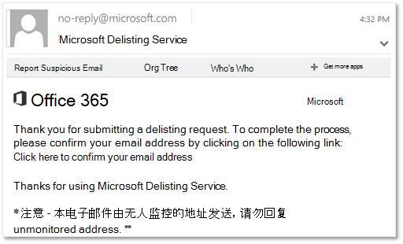

# 使用除名门户将自己从阻止的发件人名单中删除

[!INCLUDE [Microsoft 365 Defender rebranding](../includes/microsoft-defender-for-office.md)]

**适用对象**
- [Exchange Online Protection](exchange-online-protection-overview.md)
- [Microsoft Defender for Office 365 计划 1 和计划 2](defender-for-office-365.md)
- [Microsoft 365 Defender](../defender/microsoft-365-defender.md)

当您尝试向电子邮件地址位于邮箱中的收件人发送电子邮件时，是否收到Microsoft 365？ 如果您认为不应收到错误消息，您可以使用除名门户将自己从阻止的发件人名单中删除。

## 阻止的发件人名单是什么？

Microsoft 使用阻止的发件人名单来防止其客户遭受垃圾邮件、欺诈和网络钓鱼网站的攻击。 您的邮件服务器的 IP 地址（即邮件服务器在 Internet 上用于标识自身的地址）被标记为可能Microsoft 365威胁，原因有多种。 当Microsoft 365 IP 地址添加到列表中时，它会阻止 IP 地址与任何客户通过我们的数据中心进行进一步的通信。

在您收到包含类似于以下错误的邮件回复时，您就知道自己已被添加到该列表中：

> 550 5.7.606-649 访问被拒绝，已禁止发送 IP [_IP 地址_];若要请求从此列表删除，请访问 <https://sender.office.com/> 并按照说明操作。 有关详细信息，请参阅电子邮件[中的未送达Exchange Online。](/Exchange/mail-flow-best-practices/non-delivery-reports-in-exchange-online/non-delivery-reports-in-exchange-online)

其中  _IP address_ 是邮件服务器在其上运行的计算机的 IP 地址。

### 使用除名门户将自己从阻止的发件人名单中删除

1. 在 Web 浏览器中，请转至 <https://sender.office.com>。

2. 按照页面上的说明执行操作。请确保您使用收到错误消息的电子邮件地址，以及错误消息中指定的 IP 地址。每次访问只能输入一个电子邮件地址和一个 IP 地址。

3. Click **Submit**.

    门户会向您提供的电子邮件地址发送电子邮件。该电子邮件如下所示：

    

4. 单击除名门户发送给您的电子邮件中的确认链接。

    这将使您返回到除名门户。

5. In the delist portal, click **Delist IP**.

    从阻止的发件人列表中删除 IP 地址后，来自该 IP 地址的电子邮件将传递给使用"发件人"Microsoft 365。 因此，请确保你确信从该 IP 地址发送的电子邮件不会滥用或恶意;否则，可能会再次阻止 IP 地址。

    > [!NOTE]
    > 可能需要最多 24 小时，或者结果在删除限制之前可能会有很大差异。

请参阅 [在 EOP 中创建](create-safe-sender-lists-in-office-365.md) 安全发件人列表和 [EOP](outbound-spam-controls.md) 中的出站垃圾邮件保护，以防止阻止 IP。

## 更多信息

the delisting form for **Outlook.com， the consumer service** can be found [here](https://support.microsoft.com/supportrequestform/8ad563e3-288e-2a61-8122-3ba03d6b8d75). 请务必先阅读 [常见问题解答](https://sendersupport.olc.protection.outlook.com/pm/troubleshooting.aspx) ，了解 *提交* 方向。
