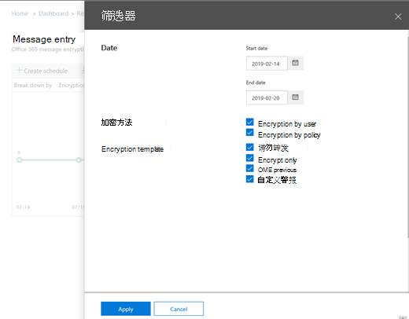
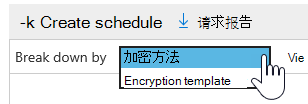
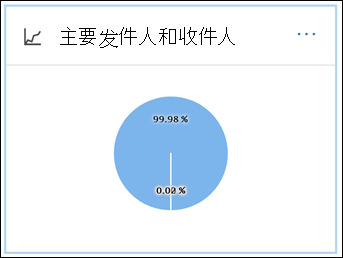
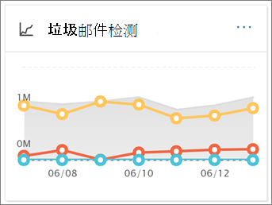
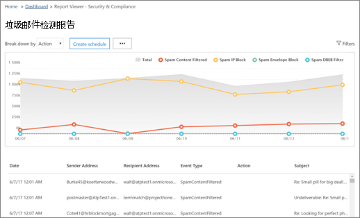
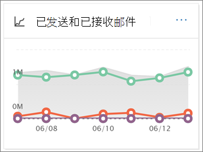
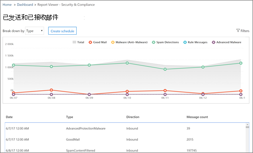

# 查看安全与合规中心内的电子邮件安全报告

[安全 & 合规性中心](https://protection.office.com)中提供了多种报告，可帮助您了解电子邮件安全功能（如 Microsoft 365 中的反垃圾邮件、反恶意软件和加密功能如何保护您的组织）。 如果您具有[必要的权限](#what-permissions-are-needed-to-view-these-reports)，则可以转到 "**报告** \> "**仪表板**，在安全 & 合规中心中查看这些报告。

您的电子邮件安全报告包括以下内容：

- [URL 威胁防护报告](#url-threat-protection-report-new)（**新！**）
- [已泄露用户报告](#compromised-users-report)
- [加密报告](#encryption-report)
- [威胁防护状态](#threat-protection-status-report)
- [恶意软件检测报告](#malware-detections-report)
- [主要恶意软件报告](#top-malware-report)
- [主要发件人和收件人报告](#top-senders-and-recipients-report)
- [欺骗检测报告](#spoof-detections-report)
- [垃圾邮件检测报告](#spam-detections-report)
- [发送和接收的电子邮件报告](#sent-and-received-email-report)
- [用户报告的邮件报告](#user-reported-messages-report)

## URL 威胁防护报告（**新！**）

任何人都可以使用 URL 威胁防护报告：

- Exchange Online Protection*和*高级威胁防护外接程序（计划 1*或*计划2）
- Microsoft 365 E5 订阅

这是一个具有两个聚合视图的 "单击中心" 报告。

1. 第一个视图是*URL 单击保护操作*，它重点显示由租户中的用户单击的 URL 的数目，以及单击的结果。 A 单击此处指示用户已通过阻止页面单击到恶意网站（可由管理员在安全链接策略中禁用）。

2. 第二个视图是*URL 单击 "按应用程序*"，它显示了在当今支持安全链接的不同应用程序（如在电子邮件客户端或 Microsoft Word 中）单击的 url 的数目。 两个聚合视图中的数据每4小时刷新一次。

URL 威胁防护报告的详细信息表提供了在租户内发生的所有点击的近实时视图，其中包括诸如*username*、 *URL*、*网络邮件 ID* （如果从电子邮件中单击该 URL）的调查信息，以及有关调查和分析的其他有用信息。

默认情况下，报告仅显示通过安全链接阻止的 Url 单击时的数据，但也可以查看筛选器中的 "通过选择*允许的 url* " 复选框的所有 URL 单击的信息。

如果应用了 "安全链接策略" 的用户已选中 "不*跟踪用户单击*" 选项，则此报告将不会有单击的数据。

## 已泄露用户报告

此报告可供任何具有 Exchange Online Protection 的用户使用，并显示标记为可疑用户或受限制用户的用户帐户数。在帐户中，数据尤其有用的是表明用户帐户可能有问题或甚至已泄露的状态。 通过频繁使用，已损坏的用户报告可以发现处于可疑或受限制状态的帐户中的峰值、甚至是趋势，从而提供证据可能存在安全和租户的 wellness 问题。

## 加密报告

**加密报告**显示有关通过组织策略或通过最终用户控件进行加密的电子邮件的信息。 您组织的安全团队可以使用此报告中的信息来标识模式，并主动应用或调整敏感电子邮件的策略。

若要查看此报告，请在安全 & 合规性中心中，转到 "**报告** \> **" 仪表板** \> **加密报告**。

当报告第一次打开时，您将看到有关过去七（7）天的电子邮件上使用的加密方法的数据。 通过单击屏幕右上角的 "**筛选器**"，可以更改报告中显示的日期范围和详细信息。

您还可以使用 "**向下分页**" 菜单查看通过加密模板（或方法）的数据。

您还可以使用 "**查看数据方式**" 菜单更改视图，以查看前五个收件人域的加密邮件数。

通过新的加密报告的灵活性，您可以查看趋势并采取适当的操作。 例如，如果您看到用户加密了大量的电子邮件，您可能希望添加加密策略以对某些用例自动进行加密。 （若要获取有关信息，请参阅[定义邮件流规则以在 Microsoft 365 中对电子邮件进行加密](../../compliance/define-mail-flow-rules-to-encrypt-email.md)。）另一个示例是，如果有许多可用的加密模板，但没有用户正在使用它们，则可以考察用户是否需要针对该功能的培训。

使用此报告使组织的安全和合规性团队能够监视邮件加密的使用情况，以及是否需要进一步的操作。 若要了解有关加密的详细信息，请参阅[Microsoft 365 中的电子邮件加密](../../compliance/email-encryption.md)。

## 威胁防护状态

**威胁防护状态**报告是一个智能报告，显示 Exchange Online Protection 检测到并阻止的恶意电子邮件。 此报告可用于查看标识为恶意软件的电子邮件或一段时间内的网络钓鱼尝试（最长为90天），并使安全管理员能够确定趋势或确定策略是否需要调整。

> [!NOTE]
> 拥有[Office 365 ATP](https://docs.microsoft.com/microsoft-365/security/office-365-security/office-365-atp)或[Exchange Online Protection](https://docs.microsoft.com/microsoft-365/security/office-365-security/what-is-eop) （EOP）的客户可以使用威胁防护状态报告;但是，在 ATP 客户的威胁防护状态报告中显示的信息可能包含不同的 EOP 客户可能看到的数据。 例如，EOP 客户可以查看有关在电子邮件中检测到的恶意软件的信息，但不是关于[在 SharePoint Online、OneDrive 或 Microsoft 团队中检测到的恶意文件](https://docs.microsoft.com/microsoft-365/security/office-365-security/atp-for-spo-odb-and-teams)的信息，这是与 ATP 相关的功能。 （[了解有关 ATP 报告的详细信息](https://docs.microsoft.com/microsoft-365/security/office-365-security/view-reports-for-atp)。）

若要查看此报告，请在[安全 & 合规性中心](https://protection.office.com)中，转到 "**报告** \> "**仪表板** \> **威胁防护状态**。

当您首次打开 "威胁 Protection 状态报告" 时，报告默认显示过去七天的数据;不过，您可以单击 "**筛选器**" 并将日期范围更改为最多90天的详细信息。 （如果使用的是试用订阅，则可能限制为30天的数据。）

此报告对查看组织的[Exchange Online Protection 功能](https://docs.microsoft.com/microsoft-365/security/office-365-security/eop-features)和长期趋势分析的有效性和影响非常有用。

您还可以选择查看标识为恶意的电子邮件的数据、被标识为网络钓鱼尝试的电子邮件，或确定为包含恶意软件的电子邮件。

## 恶意软件检测报告

**恶意软件检测**报告将显示检测到多少传入邮件和传出邮件，以包含贵组织的恶意软件。

若要查看此报告，请在[安全 & 合规性中心](https://protection.office.com)中，转到 "**报告** \> "**仪表板** \> **恶意软件检测**。

与其他报告（如 "[威胁防护状态报告](#threat-protection-status-report)"）类似，报告默认显示过去七天的数据。 不过，您可以选择**筛选器**来更改日期范围。

## 主要恶意软件报告

**上面的恶意软件**报告显示[Exchange Online](https://docs.microsoft.com/microsoft-365/security/office-365-security/eop-features)检测到的各种类型的恶意软件。

若要查看此报告，请在[安全 & 合规性中心](https://protection.office.com)中，转到 "**报告** \> "**仪表板** \> "**热门恶意软件**"。

当您将鼠标指针悬停在饼图中时，您可以看到某种类型的恶意软件的名称以及检测到该恶意软件的邮件数。

单击（或点击）报表以在新的浏览器窗口中打开它，您可以在其中获取报表的更详细视图。

在图表下方，你将看到检测到的恶意软件的列表以及检测到该恶意软件的邮件数。

## 主要发件人和收件人报告

**最上面的发件人和收件人**报告是显示主要电子邮件发件人的饼形图。

若要查看此报告，请在[安全 & 合规性中心](https://protection.office.com)中，转到 "**报告** \> "**仪表板** \>的**主要发件人和收件人**。

当您将鼠标指针悬停在饼图中时，您可以看到发送或接收的邮件数。

单击（或点击）报表以在新的浏览器窗口中打开它，您可以在其中获取报表的更详细视图。

使用 "**显示数据**" 列表选择是查看主要发件人、收件人、垃圾邮件收件人和恶意软件收件人的数据。 您还可以查看[Exchange Online Protection](https://docs.microsoft.com/microsoft-365/security/office-365-security/what-is-eop)检测到的恶意软件的接收人。

在图表下方，你将看到首要的电子邮件发件人或收件人，以及在给定时间段内发送或接收的邮件数。

## 欺骗检测报告

**欺骗检测**报告显示检测到的欺骗邮件的数量以及这些邮件被视为 "好" （欺骗邮件出于合理商业原因而完成）。

若要查看此报告，请在[安全 & 合规性中心](https://protection.office.com)中，转到 "**报告** \> "**仪表板** \> **欺骗邮件**。

当您将鼠标指针悬停在图表中的某一天时，您可以看到通过的欺骗邮件的数量。

单击（或点击）报表以在新的浏览器窗口中打开它，您可以在其中获取报表的更详细视图。 若要了解有关反欺骗保护的详细信息，请参阅[Microsoft 365 中的反欺骗保护](anti-spoofing-protection.md)。

## 垃圾邮件检测报告

**垃圾邮件检测**报告显示 Exchange Online 阻止的所有垃圾邮件内容。 邮件按每封邮件计数，而不是按收件人计数。 例如，如果电子邮件发送给组织中的100收件人，则会将其计为一封邮件。

若要查看此报告，请在[安全 & 合规性中心](https://protection.office.com)中，转到 "**报告** \> "**仪表板** \> **垃圾邮件检测**。

当您将鼠标指针悬停在图表中的某一天时，您可以看到该日已被阻止的项目数，以及这些项目的分类方式。 例如，您可以查看筛选出的垃圾邮件的数量，以及来自阻止的 Internet 协议（IP）地址的项目数。

单击（或点击）报表以在新的浏览器窗口中打开它，您可以在其中获取报表的更详细视图。

在图表下方，你将看到检测到的垃圾邮件项目的列表。 选择一个项目以查看其他信息，例如垃圾邮件项目是否为入站或出站、其邮件 ID 及其收件人。 若要了解有关反垃圾邮件保护的详细信息，请参阅[Office 365 电子邮件反垃圾邮件保护](https://docs.microsoft.com/microsoft-365/security/office-365-security/anti-spam-and-anti-malware-protection)。

## 发送和接收的电子邮件报告

**已发送和已接收的电子邮件**报告是一个智能报告，显示有关传入和传出电子邮件的信息，包括垃圾邮件检测、恶意软件和标识为 "正常" 的电子邮件。

若要查看此报告，请在[安全 & 合规性中心](https://protection.office.com)中，转到 "**报告** \> "**仪表板** \> **发送和接收的电子邮件**。

当您将鼠标指针悬停在图表中的某一天时，可以看到传入的邮件数以及这些邮件的分类方式。 例如，您可以查看检测到包含恶意软件的邮件数，以及被标识为垃圾邮件的邮件数。

单击（或点击）报表以在新的浏览器窗口中打开它，您可以在其中获取报表的更详细视图。

您可以使用 "**分解依据**" 列表按类型或按方向（传入和传出）查看信息。

在图表下方，您将看到一个电子邮件类别的列表，如**GoodMail**、 **SpamContentFiltered**等。 选择类别以查看其他信息，例如对恶意软件所执行的操作以及电子邮件是传入的还是传出的。

若要了解有关电子邮件智能的详细信息，请参阅[Microsoft 365 中的邮件流智能](https://docs.microsoft.com/microsoft-365/security/office-365-security/mail-flow-intelligence-in-office-365)。

## 用户报告的邮件报告

"**用户报告的邮件**" 报告显示用户通过使用[报告邮件外接程序](https://docs.microsoft.com/microsoft-365/security/office-365-security/enable-the-report-message-add-in)报告为垃圾邮件、网络钓鱼尝试或良好邮件的电子邮件的相关信息。

详细信息可用于每封邮件，包括传递原因、为您的组织配置的垃圾邮件策略例外或邮件流规则。 若要查看详细信息，请在 "用户报告" 列表中选择一个项目，然后查看 "**摘要**" 和 "**详细信息**" 选项卡上的信息。

若要查看此报告，请在[安全 & 合规性中心](https://protection.office.com)中，执行下列操作之一：

- 转到 "**威胁管理** \> **仪表板** \> **用户报告的邮件**"。

- 转到 "**威胁管理** \> "**查看** \> **用户报告的邮件**。

> [!IMPORTANT]
> 为了使用户报告的邮件报告正常工作，必须为您的 Office 365 环境**打开审核日志记录**。 这通常由在 Exchange Online 中分配了审核日志角色的人完成。 有关详细信息，请参阅[打开或关闭 Microsoft 365 审核日志搜索](https://docs.microsoft.com/microsoft-365/compliance/turn-audit-log-search-on-or-off)。

## 查看这些报告所需的权限是什么？

若要查看和使用本文中所述的报告，**您必须为安全 & 合规中心和 Exchange 管理中心分配适当的角色**。

- 对于 "安全 & 合规中心"，您必须具有以下分配的角色之一：

  -组织管理-安全管理员（可在 Azure Active Directory 管理中心中分配（[https://aad.portal.azure.com](https://aad.portal.azure.com)）-安全读取器

- 对于 Exchange Online，必须在 Exchange 管理中心（[https://outlook.office365.com/ecp](https://outlook.office365.com/ecp)）或 PowerShell cmdlet 中分配以下角色之一（请参阅[Exchange Online PowerShell](https://docs.microsoft.com/powershell/exchange/exchange-online/exchange-online-powershell?view=exchange-ps)）：

  -组织管理-仅查看组织管理-仅查看收件人角色合规性管理

若要了解详细信息，请参阅以下资源：

- [安全与合规中心内的权限](https://docs.microsoft.com/microsoft-365/security/office-365-security/permissions-in-the-security-and-compliance-center)
 
- [Exchange Online 中的功能权限](https://docs.microsoft.com/exchange/permissions-exo/feature-permissions)

## 如果报告不显示数据，该怎么办？

如果您未在报告中看到数据，请仔细检查您的策略设置是否正确。 若要了解详细信息，请参阅[在 Microsoft 365 中防御威胁](https://docs.microsoft.com/microsoft-365/security/office-365-security/protect-against-threats)。

## 相关主题

[Microsoft 365 电子邮件反垃圾邮件保护](https://docs.microsoft.com/microsoft-365/security/office-365-security/anti-spam-and-anti-malware-protection)

[安全 & 合规中心中的报告和见解](https://docs.microsoft.com/microsoft-365/security/office-365-security/reports-and-insights-in-security-and-compliance)

[在安全 & 合规中心内创建报表的计划](https://docs.microsoft.com/microsoft-365/security/office-365-security/create-a-schedule-for-a-report)

[在安全 & 合规中心中设置和下载自定义报表](https://docs.microsoft.com/microsoft-365/security/office-365-security/set-up-and-download-a-custom-report)