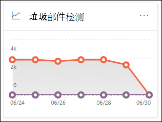
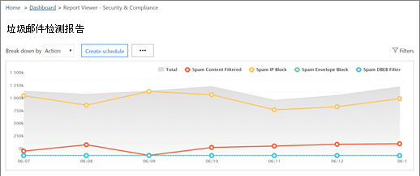
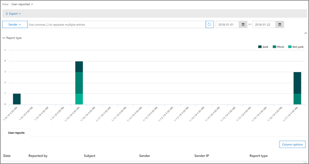

# 查看安全与合规中心内的电子邮件安全报告

[!INCLUDE [Microsoft 365 Defender rebranding](../includes/microsoft-defender-for-office.md)]

[安全 & 合规性中心](https://protection.office.com)中提供了多种报告，可帮助您了解电子邮件安全功能（如 Microsoft 365 中的反垃圾邮件、反恶意软件和加密功能如何保护您的组织）。 如果您具有 [必要的权限](#what-permissions-are-needed-to-view-these-reports)，则可以转到 " **报告** " \> **仪表板** ，在安全 & 合规中心中查看这些报告。 若要直接转到 "报表" 仪表板，请打开 <https://protection.office.com/insightdashboard> 。

## 已泄露用户报告

> [!NOTE]
> 此报告在具有 Exchange Online 邮箱的 Microsoft 365 组织中可用。 它在独立 Exchange Online Protection (EOP) 组织中不可用。

"已 **泄露的用户** " 报告显示在最近7天内被标记为 **可疑** 或 **受限制** 的用户帐户数。 在上述任一状态中的帐户都有问题或甚至已损坏。 通过频繁使用，您可以使用报告发现可疑或受限帐户中的峰值、甚至是趋势。 有关受损用户的详细信息，请参阅 [响应已泄露的电子邮件帐户](responding-to-a-compromised-email-account.md)。

聚合视图显示最近90天的数据，详细信息视图显示最近30天的数据。

若要查看报告，请打开 " [安全 & 合规中心](https://protection.office.com)"，转到 " **报告** " \> **仪表板** ，然后选择 "已 **损坏用户** "。 若要直接转到报表，请打开 <https://protection.office.com/reportv2?id=CompromisedUsers> 。

可以通过单击 " **筛选** 器" 并选择以下一个或多个值来筛选图表和详细信息表：

- **开始日期** 和 **结束日期**

- **可疑** ：用户帐户发送了可疑电子邮件，并且存在受限制的发送电子邮件的风险。

- **受限** ：由于高度可疑的模式，用户帐户受到限制，无法发送电子邮件。

如果单击 " **查看详细信息表** "，则可以看到以下详细信息：

- **创建时间**
- **用户 ID**
- **操作**

若要返回到报告视图，请单击 " **查看报告** "。

## 加密报告

在 Exchange Online 或独立 EOP 中邮箱的 EOP (订阅中提供 **加密报告** ，而无需 Exchange online 邮箱) 。 您组织的安全团队可以使用此报告中的信息来标识模式，并主动应用或调整敏感电子邮件的策略。 例如：

- 如果您看到用户加密了大量的电子邮件，则可能需要添加加密策略以对某些用例自动进行加密。 有关详细信息，请参阅 [在 Microsoft 365 中定义用于加密电子邮件的邮件流规则](../../compliance/define-mail-flow-rules-to-encrypt-email.md)。

- 如果有许多可用的加密模板，但没有用户正在使用它们，则可以考察用户是否需要功能培训。

"聚合" 视图允许筛选过去的90天，而 "详细信息" 视图允许筛选10天。

若要查看报告，请打开 [安全性 & 合规性中心](https://protection.office.com)，转到 " **报告** " \> **仪表板** ，然后选择 " **加密报告** "。 若要直接转到报表，请打开 <https://protection.office.com/reportv2?id=EncryptionReport> 。

若要了解有关加密的详细信息，请参阅 [Microsoft 365 中的电子邮件加密](../../compliance/email-encryption.md)。

### 加密报告的报告视图

您可以在图表上使用以下筛选器：

- **数据查看依据：邮件加密报告** 和 **分解方式：加密方法** ：以下是可用的加密方法：

  - **按用户加密**
  - **按策略加密**

  如果单击 " **筛选器** "，则可以使用以下筛选器修改图表：

  - **开始日期** 和 **结束日期**
  - 加密方法。
  - 加密模板。

- **数据查看依据：邮件加密报告** 和 **分解方式：加密模板** ：以下是可用的加密方法：

  - **请勿转发**
  - **仅加密**
  - **OME 以前**
  - **自定义**

  如果单击 " **筛选器** "，则可以使用以下筛选器修改图表：

  - **开始日期** 和 **结束日期**
  - 加密方法
  - 加密模板

- **按数据查看：前5个收件人域** ：此视图显示包含前5个收件人域的已发送邮件计数的饼图。

  如果单击 " **筛选器** "，则可以选择 " **开始日期** " 和 " **结束日期** "。

### 加密报告的详细信息表格视图

如果您单击 " **查看详细信息表** "，则显示的信息将取决于所查看的图表：

- **分解方式：加密方法** 或 **分解方式：加密模板** ：显示以下信息：

  - **Date**
  - **发件人地址**
  - **加密模板**
  - **加密方法**
  - **收件人地址**
  - **主题**

- **数据查看依据：前5个收件人域** ：

  - **Date**
  - **收件人域**
  - **邮件计数**
  
如果单击 "详细信息" 表视图中的 " **筛选器** "，则可以使用以下筛选器修改结果：

- **开始日期** 和 **结束日期**
- 加密方法
- 加密模板

若要返回到报告视图，请单击 " **查看报告** "。

## 邮件流状态报告

**邮件流状态报告** 包含有关恶意软件、垃圾邮件、网络钓鱼和边缘阻止的邮件的信息。 有关更多详细信息，请参阅 [邮件流 status report](view-mail-flow-reports.md#mailflow-status-report)。

## 电子邮件中的恶意软件检测报告

" **电子邮件中的恶意软件检测** " 报告显示在 Exchange Online PROTECTION 或 EOP) 检测到的传入和传出电子邮件中的恶意软件检测 (的相关信息。 有关 EOP 中的恶意软件保护的详细信息，请参阅 [EOP 中的反恶意软件保护](anti-malware-protection.md)。

 聚合视图筛选器允许90天，而详细信息表筛选器仅允许10天。

若要查看报告，请打开 [安全 & 合规中心](https://protection.office.com)，转到 " **报告** " \> **仪表板** ，然后选择 **"在电子邮件中检测到恶意软件"** 。 若要直接转到报表，请打开 <https://protection.office.com/reportv2?id=MalwareDetections> 。

您可以通过单击 " **筛选** 器" 并选择 "筛选器" 来筛选图表和详细信息表：

- **开始日期** 和 **结束日期**
- **进货**
- **出站**

如果单击 " **查看详细信息表** "，则可以看到以下详细信息：

- **Date**
- **发件人地址**
- **收件人地址**
- **邮件 id** ：在邮件头的 **邮件 id** 标头字段中可用，并且应是唯一的。  (的示例值 `<08f1e0f6806a47b4ac103961109ae6ef@server.domain>` 记下尖括号) 。
- **主题**
- **Filename**
- **恶意软件名称**

若要返回到报告视图，请单击 " **查看报告** "。

## 发送和接收的电子邮件报告

**发送和接收的电子邮件** 报告包含有关恶意软件、垃圾邮件、邮件流规则的信息 (也称为传输规则) ，以及在电子邮件进入服务后进行的高级恶意软件检测。 有关详细信息，请参阅 [发送和接收的电子邮件报告](view-mail-flow-reports.md#sent-and-received-email-report)。

## 垃圾邮件检测报告

**垃圾邮件检测** 报告显示由 EOP 阻止的垃圾电子邮件。 邮件单独计数，而不是每个收件人。 例如，如果将相同的垃圾邮件发送给组织中的100收件人，则会将其计为一封邮件。

聚合视图允许90天筛选，而详细信息表允许进行10天的筛选。

若要查看报告，请打开 " [安全 & 合规中心](https://protection.office.com)"，转到 " **报告** " \> **仪表板** ，然后选择 " **垃圾邮件检测** "。 若要直接转到报表，请打开 <https://protection.office.com/reportv2?id=SpamDetections> 。

有关反垃圾邮件保护的详细信息，请参阅 [EOP 中的反垃圾邮件保护](anti-spam-protection.md)。

### 垃圾邮件检测报告的报告视图

报表视图中提供了以下图表：

- **分解方式：操作** ：显示以下事件类型：

  - **筛选出的垃圾邮件内容**
  - **垃圾邮件 IP 阻止**
  - **垃圾邮件信封块**
  - **垃圾邮件 DBEB 筛选器** ：基于目录的边缘阻止 (DBEB) 

  当您悬停在图表中 (数据点) 的某一天时，您可以看到该日已阻止的项目数，以及这些项目的分类方式。

  

- **分解方式：方向** ：以下说明如下所示：

  - **进货**
  - **出站**

  

如果您在报告视图中单击 " **筛选器** "，则可以使用以下筛选器修改结果：

- **开始日期** 和 **结束日期**
- 方向值
- 事件类型值

### 垃圾邮件检测报告的详细信息表格视图

如果您在任何报告视图中单击 " **查看详细信息表** "，将显示以下信息：

- **Date**
- **发件人地址**
- **收件人地址**
- **事件类型**
- **操作**
- **主题**

如果单击 "详细信息" 表中的 " **筛选器** "，则可以使用以下筛选器修改结果：

- **开始日期** 和 **结束日期**
- 方向值
- 事件类型值

若要返回到报告视图，请单击 " **查看报告** "。

## 欺骗检测报告

**欺骗检测** 报告显示检测到的欺骗邮件和这些邮件的数目，这些邮件被视为 "好" (欺骗邮件出于) 的合法商业原因而完成。 有关哄骗的详细信息，请参阅 [EOP 中的反欺骗保护](anti-spoofing-protection.md)。

报告的聚合视图允许在筛选过程中90天，而详细信息视图只允许进行10天的筛选。

若要查看报告，请打开 [安全性 & 合规性中心](https://protection.office.com)，转到 " **报告** " \> **仪表板** ，然后选择 " **欺骗检测** "。 若要直接转到报表，请打开 <https://protection.office.com/reportv2?id=SpoofMailReport> 。

当鼠标悬停在图表中 (数据点) 时，您可以看到通过的欺骗邮件的数量。

可以通过单击 " **筛选** 器" 并选择以下一个或多个值来筛选图表和详细信息表：

- **开始日期** 和 **结束日期**

- **正常邮件**

- **作为垃圾邮件捕获**

如果单击 " **查看详细信息表** "，则可以看到以下详细信息：

- **Date**
- **欺骗发件人**
- **真正发件人**
- **发件人 IP**
- **操作**
- **邮件计数**

若要返回到报告视图，请单击 " **查看报告** "。

## 威胁防护状态报告

" **威胁防护状态** 报告" 在 EOP 和 Microsoft Defender for Office 365 中均可用;但是，报告包含不同的数据。 例如，EOP 客户可以查看有关在电子邮件中检测到的恶意软件的信息，但不 [是关于由 SharePoint、OneDrive 或 Microsoft 团队的 ATP 检测到的恶意文件](atp-for-spo-odb-and-teams.md)的信息。

该报告提供了包含恶意内容的电子邮件（如文件或网站地址 (Url) 被反恶意软件引擎阻止、 [零小时自动清除 (ZAP) ](zero-hour-auto-purge.md)和 Defender for Office 365 功能（如 [安全链接](atp-safe-links.md)、 [安全附件](atp-safe-attachments.md)和 [反网络钓鱼](set-up-anti-phishing-policies.md)）等电子邮件的计数。 您可以使用此信息来确定趋势或确定组织策略是否需要调整。 请务必注意，如果将邮件发送给5个收件人，我们会将其计数为五个不同的邮件，而不是一封邮件。

若要查看报告，请打开 [安全 & 合规中心](https://protection.office.com)，转到 " **报告** " \> **仪表板** ，然后选择 " **威胁保护状态** "。 若要直接转到报告，请打开以下 Url 之一：

- Microsoft Defender for Office 365： <https://protection.office.com/reportv2?id=TPSAggregateReportATP>
- EOP <https://protection.office.com/reportv2?id=TPSAggregateReport>

默认情况下，图表显示过去7天的数据。 如果单击 " **筛选器** "，则可以选择一个90天的日期范围 (试用订阅可能限制为30天) 。 [！说明] [！说明] 详细信息表视图允许筛选30天。

### 威胁防护状态报告的报告视图

可以使用以下视图：

- **查看数据的依据：概述** ：显示以下检测信息：

  - **电子邮件恶意软件**
  - **电子邮件网络钓鱼**
  - **内容恶意软件**

  

- **数据查看依据：内容 \> 恶意软件**1：为 Microsoft Defender for Office 365 组织显示以下信息：

  - **反恶意软件引擎** ：通过反恶意软件在 Sharepoint Online、OneDrive 和团队中捕获恶意文件。
  - **文件沙箱** ：沙箱安全附件在 Sharepoint Online、OneDrive 和团队中的恶意文件。

  

- **数据查看依据：邮件覆盖** ：以下是显示的替代原因信息：

  - **内部部署跳过**
  - **IP 允许**
  - **邮件流规则**
  - **发件人允许**
  - **域允许**
  - **未启用 ZAP**
  - **未启用 "垃圾邮件" 文件夹**
  - **用户安全发件人**
  - **用户安全域**

  

- **分解方式：检测技术** 和 **查看数据的方式：电子邮件 \> 网络钓鱼** ：将显示以下信息：

  - **ATP 生成的 url 信誉**1：从 office 365 客户的其他 defender 中的 office 365 DETONATIONS 生成的恶意 url 信誉。
  - **高级网络钓鱼筛选器** ：基于机器学习的网络钓鱼信号。
  - **反欺骗-DMARC 失败** ：邮件上的 DMARC 身份验证失败。
  - **反欺骗-组织内** ：发件人试图欺骗收件人域。
  - **反欺骗-外部域** ：发件人试图欺骗某个其他域。
  - **品牌模拟** ：模拟基于发件人的知名品牌。
  - **域模拟**1：模拟客户拥有或定义的域。
  - **EOP url 信誉** ：恶意 url 信誉。
  - **常规网络钓鱼筛选器** ：基于分析师规则的网络钓鱼信号。 
  - **其他**
  - **网络钓鱼 ZAP**2：零小时自动清除网络钓鱼邮件。
  - **URL 沙箱**1
  - **用户模拟**1：模拟管理员定义的用户或通过邮箱智能学习的用户。

  

- **分解方式：检测技术** 和 **查看数据的依据：电子邮件 \> 恶意软件** ：显示以下信息：

  - **ATP 生成的文件信誉**1：由 Defender for Office 365 detonations 生成的所有恶意文件信誉。
  - **反恶意软件引擎**1：来自反恶意软件引擎的检测。
  - **反恶意软件策略文件类型阻止** ：这些电子邮件是由于邮件中标识的恶意文件的类型而筛选出的。
  - **文件沙箱**1： File 沙箱由安全附件捕获。  
  - **恶意文件信誉**
  - **恶意软件 ZAP**2
  - **其他**

  

- **分解方式：策略类型** 和 **查看数据的依据：电子邮件 \> 网络钓鱼诈骗** 或 **查看数据：电子邮件 \> 恶意软件** ：显示以下信息：

  - **反恶意软件**
  - **安全附件**1
  - **反网络钓鱼**
  - **反垃圾邮件**
  - **邮件流规则** (也称为传输规则) 
  - **其他**

  

- **分解方式：传递状态** 和 **查看数据方式：电子邮件 \> 网络钓鱼** 或 **查看数据：电子邮件 \> 恶意软件** ：显示以下信息：

  - **传递失败**
  - **已**
  - **哪个**
  - **托管邮箱：自定义文件夹**
  - **托管邮箱：已删除项目**
  - **托管邮箱：收件箱**
  - **托管邮箱：垃圾邮件**
  - **内部部署服务器：已交付**
  - **隔离**

  

仅限1个仅限 Office 365 的 Defender

2 个零小时自动清除 (ZAP) 在独立 EOP 中不可用 (它仅适用于 Exchange Online 邮箱) 。

如果您单击 " **筛选器** "，可用的筛选器将取决于所查看的图表：

对于 **内容 \> 恶意软件** ，可以按 " **开始日期** " 和 " **结束日期** " 以及 **检测** 值修改报告。

对于 **邮件覆盖** ，可以使用以下筛选器修改报告：

- **开始日期** 和 **结束日期**
- **重写原因**
- **标记** ：按标记进行筛选，以返回已应用特定标记的用户或组。 有关用户标记的详细信息，请参阅 [用户标记](user-tags.md)。
- **域**

对于所有其他视图，您可以使用以下筛选器修改报告：

- **开始日期** 和 **结束日期**
- **检测**
- **受以下保护** ： **ATP** 或 **EOP**
- **标记** ：按标记进行筛选，以返回已应用特定标记的用户或组。 有关用户标记的详细信息，请参阅 [用户标记](user-tags.md)。
- **域**

### 威胁防护状态报告的详细信息表格视图

如果您单击 " **查看详细信息表** "，则显示的信息将取决于所查看的图表：

- **数据查看依据：内容 \> 恶意软件** ：

  - **Date**
  - **位置**
  - **指导者**
  - **恶意软件名称**

如果单击此视图中的 " **筛选器** "，则可以按 **开始日期** 和 **结束日期** 以及 **检测** 值修改报告。

- **数据查看依据：邮件覆盖** ：

  - **Date**
  - **主题**
  - **发件人**
  - **Recipients**
  - **检测人**
  - **重写原因**
  - **泄露来源**
  - **Tags**

如果单击此视图中的 " **筛选器** "，则可以使用以下筛选器修改报表：

- **开始日期** 和 **结束日期**
- **重写原因**
- **标记** ：按标记进行筛选，以返回已应用特定标记的用户或组。 有关用户标记的详细信息，请参阅 [用户标记](user-tags.md)。
- **域**
- **收件人** (请注意，此可筛选属性仅在 "详细信息" 表格视图中可用) 

**数据查看方式：概述** ：没有可用的 **视图详细信息表** 按钮。

- 所有其他图表：

  - **Date**
  - **主题**
  - **发件人**
  - **Recipients**
  - **检测人**
  - **传递状态**
  - **泄露来源**
  - **Tags**

如果单击 " **筛选器** "，则可以使用以下筛选器修改报表：

- **开始日期** 和 **结束日期**
- **检测**
- **受以下保护** ： **适用于 Office 365 的 Defender** 或 **EOP**
- **标记** ：按标记进行筛选，以返回已应用特定标记的用户或组。 有关用户标记的详细信息，请参阅 [用户标记](user-tags.md)。
- **域**
- **收件人** (请注意，此可筛选属性仅在 "详细信息" 表格视图中可用) 

## 主要恶意软件报告

**最上面的恶意软件** 报告显示了 [EOP 中的反恶意软件保护](anti-malware-protection.md)检测到的各种类型的恶意软件。

若要查看报告，请打开 [安全性 & 合规性中心](https://protection.office.com)，转到 " **报告** " \> **仪表板** ，然后选择 " **主要恶意软件** "。 若要直接转到报表，请打开 <https://protection.office.com/reportv2?id=TopMalware> 。

当您将鼠标指针悬停在饼图中时，您可以看到某种类型的恶意软件的名称以及检测到该恶意软件的邮件数。

如果单击 " **查看详细信息表** "，则可以看到以下详细信息：

- **主要恶意软件**
- **Count**

如果单击 "报表视图" 或 "详细信息表" 视图中的 " **筛选器** "，则可以指定具有 " **开始日期** " 和 " **结束日期** " 的日期范围。

## URL 威胁防护报告

Microsoft Defender for Office 365 中提供了 **URL 威胁防护报告** 。 有关详细信息，请参阅 [URL 威胁防护报告](view-reports-for-atp.md#url-threat-protection-report)。

## 用户报告的邮件报告

" **用户报告的邮件** " 报告显示用户通过使用 [报告邮件外接程序](https://docs.microsoft.com/microsoft-365/security/office-365-security/enable-the-report-message-add-in)报告为垃圾邮件、网络钓鱼尝试或良好邮件的电子邮件的相关信息。

详细信息可用于每封邮件，包括传递原因、为您的组织配置的垃圾邮件策略例外或邮件流规则。 若要查看详细信息，请在 "用户报告" 列表中选择一个项目，然后查看 " **摘要** " 和 " **详细信息** " 选项卡上的信息。

若要查看此报告，请在 [安全 & 合规性中心](https://protection.office.com)中，执行下列操作之一：

- 转到 " **威胁管理** \> **仪表板** \> **用户报告的邮件** "。

- 转到 " **威胁管理** " \> **查看** \> **用户报告的邮件** 。

> [!IMPORTANT]
> 为了使用户报告的邮件报告正常工作，必须为您的 Office 365 环境 **打开审核日志记录** 。 这通常由在 Exchange Online 中分配了审核日志角色的人完成。 有关详细信息，请参阅 [打开或关闭 Microsoft 365 审核日志搜索](https://docs.microsoft.com/microsoft-365/compliance/turn-audit-log-search-on-or-off)。

## 查看这些报告所需的权限是什么？

若要查看和使用报告，您必须是安全 & 合规性中心 **和** Exchange Online 中指定角色组的成员。

- 在安全 & 合规性中心中，您必须是下列角色组之一的成员：

  -组织管理-安全管理员 (你也可以在 [Azure Active Directory 管理中心](https://aad.portal.azure.com) 中执行此操作-安全读者

  有关详细信息，请参阅[安全与合规中心中的权限](https://docs.microsoft.com/microsoft-365/security/office-365-security/permissions-in-the-security-and-compliance-center)。

- 在 Exchange Online 中，您必须是下列角色组之一的成员：

  -组织管理-仅查看组织管理-仅查看收件人-合规性管理

有关详细信息，请参阅 [Exchange online](https://docs.microsoft.com/Exchange/permissions-exo/permissions-exo) 中的权限和 [管理 exchange online 中的角色组](https://docs.microsoft.com/Exchange/permissions-exo/role-groups)。

## 如果报告不显示数据，该怎么办？

如果您未在报告中看到数据，请仔细检查您的策略设置是否正确。 若要了解详细信息，请参阅 [防止威胁](protect-against-threats.md)。

## 相关主题

[EOP 中的反垃圾邮件和反恶意软件保护](anti-spam-and-anti-malware-protection.md)

[安全与合规中心内的智能报告和见解](reports-and-insights-in-security-and-compliance.md)

[查看安全 & 合规性中心中的邮件流报告](view-mail-flow-reports.md)

[查看适用于 Office 365 的 Defender 报告](view-reports-for-atp.md)
