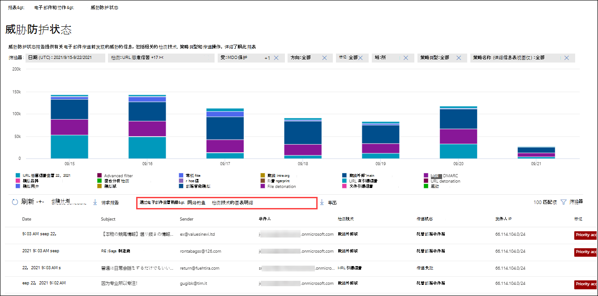

# 查看安全与合规中心内的电子邮件安全报告View email security reports in the Security & Compliance Center

[!INCLUDE [Microsoft 365 Defender rebranding](../includes/microsoft-defender-for-office.md)]

[安全 & 合规性中心](https://protection.office.com)中提供了多种报告，可帮助您了解电子邮件安全功能（如 Microsoft 365 中的反垃圾邮件、反恶意软件和加密功能如何保护您的组织）。A variety of reports are available in the [Security & Compliance Center](https://protection.office.com) to help you see how email security features, such as anti-spam, anti-malware, and encryption features in Microsoft 365 are protecting your organization. 如果您具有 [必要的权限](#what-permissions-are-needed-to-view-these-reports)，则可以转到 " **报告**" \> **仪表板**，在安全 & 合规中心中查看这些报告。If you have the [necessary permissions](#what-permissions-are-needed-to-view-these-reports), you can view these reports in the Security & Compliance Center by going to **Reports** \> **Dashboard**. 若要直接转到 "报表" 仪表板，请打开 <https://protection.office.com/insightdashboard> 。To go directly to the Reports dashboard, open <https://protection.office.com/insightdashboard>.

## 已泄露用户报告Compromised users report

> [!NOTE]
> 此报告在具有 Exchange Online 邮箱的 Microsoft 365 组织中可用。This report is available in Microsoft 365 organizations with Exchange Online mailboxes. 它在独立 Exchange Online Protection (EOP) 组织中不可用。It's not available in standalone Exchange Online Protection (EOP) organizations.

"已 **泄露的用户** " 报告显示在最近7天内被标记为 **可疑** 或 **受限制** 的用户帐户数。The **Compromised users** report shows shows the number of user accounts that were marked as **Suspicious** or **Restricted** within the last 7 days. 在上述任一状态中的帐户都有问题或甚至已损坏。Accounts in either of these states are problematic or even compromised. 通过频繁使用，您可以使用报告发现可疑或受限帐户中的峰值、甚至是趋势。With frequent use, you can use the report to spot spikes, and even trends, in suspicious or restricted accounts. 有关受损用户的详细信息，请参阅 [响应已泄露的电子邮件帐户](responding-to-a-compromised-email-account.md)。For more information about compromised users, see [Responding to a compromised email account](responding-to-a-compromised-email-account.md).

聚合视图显示最近90天的数据，详细信息视图显示最近30天的数据。The aggregate view shows data for the last 90 days and the detail view shows data for the last 30 days.

若要查看报告，请打开 " [安全 & 合规中心](https://protection.office.com)"，转到 " **报告**" \> **仪表板** ，然后选择 "已 **损坏用户**"。To view the report, open the [Security & Compliance Center](https://protection.office.com), go to **Reports** \> **Dashboard** and select **Compromised users**. 若要直接转到报表，请打开 <https://protection.office.com/reportv2?id=CompromisedUsers> 。To go directly to the report, open <https://protection.office.com/reportv2?id=CompromisedUsers>.

可以通过单击 " **筛选** 器" 并选择以下一个或多个值来筛选图表和详细信息表：You can filter both the chart and the details table by clicking **Filters** and selecting one or more of the following values:

- **开始日期** 和 **结束日期****Start date** and **End date**

- **可疑**：用户帐户发送了可疑电子邮件，并且存在受限制的发送电子邮件的风险。**Suspicious**: The user account has sent suspicious email and is at risk of being restricted from sending email.

- **受限**：由于高度可疑的模式，用户帐户受到限制，无法发送电子邮件。**Restricted**: The user account has been restricted from sending email due to highly suspicious patterns.

如果单击 " **查看详细信息表**"，则可以看到以下详细信息：If you click **View details table**, you can see the following details:

- **创建时间****Creation time**
- **用户 ID****User ID**
- **操作****Action**

若要返回到报告视图，请单击 " **查看报告**"。To go back to the report view, click **View report**.

## 加密报告Encryption report

在 Exchange Online 或独立 EOP 中邮箱的 EOP (订阅中提供 **加密报告** ，而无需 Exchange online 邮箱) 。The **Encryption report** is available in EOP (subscriptions with mailboxes in Exchange Online or standalone EOP without Exchange Online mailboxes). 您组织的安全团队可以使用此报告中的信息来标识模式，并主动应用或调整敏感电子邮件的策略。Your organization's security team can use information in this report to identify patterns and proactively apply or adjust policies for sensitive email messages. 例如：For example:

- 如果您看到用户加密了大量的电子邮件，则可能需要添加加密策略以对某些用例自动进行加密。If you see a high number of email messages encrypted by users, you might want to add an encryption policy to automate encryption for certain use cases. 有关详细信息，请参阅 [在 Microsoft 365 中定义用于加密电子邮件的邮件流规则](../../compliance/define-mail-flow-rules-to-encrypt-email.md)。For more information, see [Define mail flow rules to encrypt email messages in Microsoft 365](../../compliance/define-mail-flow-rules-to-encrypt-email.md).

- 如果有许多可用的加密模板，但没有用户正在使用它们，则可以考察用户是否需要功能培训。If you have a number of encryption templates available but no one is using them, you might explore whether users need feature training.

"聚合" 视图允许筛选过去的90天，而 "详细信息" 视图允许筛选10天。The aggregate view allows filtering for the last 90 days, while the detail view allows filtering for 10 days.

若要查看报告，请打开 [安全性 & 合规性中心](https://protection.office.com)，转到 " **报告**" \> **仪表板** ，然后选择 " **加密报告**"。To view the report, open the [Security & Compliance Center](https://protection.office.com), go to **Reports** \> **Dashboard** and select **Encryption report**. 若要直接转到报表，请打开 <https://protection.office.com/reportv2?id=EncryptionReport> 。To go directly to the report, open <https://protection.office.com/reportv2?id=EncryptionReport>.

若要了解有关加密的详细信息，请参阅 [Microsoft 365 中的电子邮件加密](../../compliance/email-encryption.md)。To learn more about encryption, see [Email encryption in Microsoft 365](../../compliance/email-encryption.md).

### 加密报告的报告视图Report view for the Encryption report

您可以在图表上使用以下筛选器：You can use the following filters on the chart:

- **数据查看依据：邮件加密报告** 和 **分解方式：加密方法**：以下是可用的加密方法：**View data by: Message Encryption Report** and **Break down by: Encryption method**: The following encryption methods are available:

  - **按用户加密****Encryption by user**
  - **按策略加密****Encryption by policy**

  如果单击 " **筛选器**"，则可以使用以下筛选器修改图表：If you click **Filters**, you can modify the chart with the following filters:

  - **开始日期** 和 **结束日期****Start date** and **End date**
  - 加密方法。Encryption method.
  - 加密模板。Encryption template.

- **数据查看依据：邮件加密报告** 和 **分解方式：加密模板**：以下是可用的加密方法：**View data by: Message Encryption Report** and **Break down by: Encryption template**: The following encryption methods are available:

  - **请勿转发****Do not forward**
  - **仅加密****Encrypt only**
  - **OME 以前****OME previous**
  - **自定义****Custom**

  如果单击 " **筛选器**"，则可以使用以下筛选器修改图表：If you click **Filters**, you can modify the chart with the following filters:

  - **开始日期** 和 **结束日期****Start date** and **End date**
  - 加密方法Encryption method
  - 加密模板Encryption template

- **按数据查看：前5个收件人域**：此视图显示包含前5个收件人域的已发送邮件计数的饼图。**View data by: Top 5 recipient domains**: This view shows a pie chart with sent message counts for the top 5 recipient domains.

  如果单击 " **筛选器**"，则可以选择 " **开始日期** " 和 " **结束日期**"。If you click **Filters**, you can select a **Start date** and **End date**.

### 加密报告的详细信息表格视图Details table view for the Encryption report

如果您单击 " **查看详细信息表**"，则显示的信息将取决于所查看的图表：If you click **View details table**, the information that's shown depends on the chart you were looking at:

- **分解方式：加密方法** 或 **分解方式：加密模板**：显示以下信息：**Break down by: Encryption method** or **Break down by: Encryption template**: The following information is shown:

  - **Date****Date**
  - **发件人地址****Sender address**
  - **加密模板****Encryption template**
  - **加密方法****Encryption method**
  - **收件人地址****Recipient address**
  - **Subject****Subject**

- **数据查看依据：前5个收件人域**：**View data by: Top 5 recipient domains**:

  - **Date****Date**
  - **收件人域****Recipient domain**
  - **邮件计数****Message count**

如果单击 "详细信息" 表视图中的 " **筛选器** "，则可以使用以下筛选器修改结果：If you click **Filters** in a details table view, you can modify the results with the following filters:

- **开始日期** 和 **结束日期****Start date** and **End date**
- 加密方法Encryption method
- 加密模板Encryption template

若要返回到报告视图，请单击 " **查看报告**"。To go back to the report view, click **View report**.

## 邮件流状态报告Mailflow status report

**邮件流状态报告** 包含有关恶意软件、垃圾邮件、网络钓鱼和边缘阻止的邮件的信息。The **Mailflow status report** contains information about malware, spam, phishing and edge blocked messages. 有关更多详细信息，请参阅 [邮件流 status report](view-mail-flow-reports.md#mailflow-status-report)。For more details, see [Mailflow status report](view-mail-flow-reports.md#mailflow-status-report).

## 电子邮件中的恶意软件检测报告Malware detections in email report

" **电子邮件中的恶意软件检测** " 报告显示在 Exchange Online PROTECTION 或 EOP) 检测到的传入和传出电子邮件中的恶意软件检测 (的相关信息。The **Malware detections in email** report shows information about malware detections in incoming and outgoing email messages (malware detected by Exchange Online Protection or EOP). 有关 EOP 中的恶意软件保护的详细信息，请参阅 [EOP 中的反恶意软件保护](anti-malware-protection.md)。For more information about malware protection in EOP, see [Anti-malware protection in EOP](anti-malware-protection.md).

 聚合视图筛选器允许90天，而详细信息表筛选器仅允许10天。The aggregate view filter allows for 90 days, while the details table filter only allows for 10 days.

若要查看报告，请打开 [安全 & 合规中心](https://protection.office.com)，转到 " **报告**" \> **仪表板** ，然后选择 **"在电子邮件中检测到恶意软件"**。To view the report, open the [Security & Compliance Center](https://protection.office.com), go to **Reports** \> **Dashboard** and select **Malware detections in email**. 若要直接转到报表，请打开 <https://protection.office.com/reportv2?id=MalwareDetections> 。To go directly to the report, open <https://protection.office.com/reportv2?id=MalwareDetections>.

您可以通过单击 " **筛选** 器" 并选择 "筛选器" 来筛选图表和详细信息表：You can filter both the chart and the details table by clicking **Filters** and selecting:

- **开始日期** 和 **结束日期****Start date** and **End date**
- **进货****Inbound**
- **出站****Outbound**

如果单击 " **查看详细信息表**"，则可以看到以下详细信息：If you click **View details table**, you can see the following details:

- **Date****Date**
- **发件人地址****Sender address**
- **收件人地址****Recipient address**
- **邮件 id**：在邮件头的 **邮件 id** 标头字段中可用，并且应是唯一的。**Message ID**: Available in the **Message-ID** header field in the message header and should be unique.  (的示例值 `<08f1e0f6806a47b4ac103961109ae6ef@server.domain>` 记下尖括号) 。An example value is `<08f1e0f6806a47b4ac103961109ae6ef@server.domain>` (note the angle brackets).
- **Subject****Subject**
- **Filename****Filename**
- **恶意软件名称****Malware name**

若要返回到报告视图，请单击 " **查看报告**"。To go back to the report view, click **View report**.

## 邮件延迟报告Mail latency report

**邮件延迟报告** 包含有关您组织中的邮件传递和沙箱延迟的信息。The **Mail latency report** contains information on the mail delivery and detonation latency experienced within your organization. 有关详细信息，请参阅 [邮件延迟报告](view-reports-for-atp.md#mail-latency-report)。For more information, see [Mail latency report](view-reports-for-atp.md#mail-latency-report).

## 发送和接收的电子邮件报告Sent and received email report

**发送和接收的电子邮件** 报告包含有关恶意软件、垃圾邮件、邮件流规则的信息 (也称为传输规则) ，以及在电子邮件进入服务后进行的高级恶意软件检测。The **Sent and received email** report contains information about malware, spam, mail flow rules (also known as transport rules), and advanced malware detections after email enters the service. 有关详细信息，请参阅 [发送和接收的电子邮件报告](view-mail-flow-reports.md#sent-and-received-email-report)。For more information, see [Sent and received email report](view-mail-flow-reports.md#sent-and-received-email-report).

## 垃圾邮件检测报告Spam detections report

**垃圾邮件检测** 报告显示由 EOP 阻止的垃圾电子邮件。The **Spam detections** report shows spam email messages that were blocked by EOP. 邮件单独计数，而不是每个收件人。Messages are counted individually, not per recipient. 例如，如果将相同的垃圾邮件发送给组织中的100收件人，则会将其计为一封邮件。For example, if the same spam message was sent to 100 recipients in your organization, it counts as one message.

聚合视图允许90天筛选，而详细信息表允许进行10天的筛选。The aggregate view allows for 90 days filtering, while the details table allows for 10 days filtering.

若要查看报告，请打开 " [安全 & 合规中心](https://protection.office.com)"，转到 " **报告**" \> **仪表板** ，然后选择 " **垃圾邮件检测**"。To view the report, open the [Security & Compliance Center](https://protection.office.com), go to **Reports** \> **Dashboard** and select **Spam detections**. 若要直接转到报表，请打开 <https://protection.office.com/reportv2?id=SpamDetections> 。To go directly to the report, open <https://protection.office.com/reportv2?id=SpamDetections>.

有关反垃圾邮件保护的详细信息，请参阅 [EOP 中的反垃圾邮件保护](anti-spam-protection.md)。For more information about anti-spam protection, see [Anti-spam protection in EOP](anti-spam-protection.md).

### 垃圾邮件检测报告的报告视图Report view for the Spam detections report

报表视图中提供了以下图表：The following charts are available in the report view:

- **分解方式：操作**：显示以下事件类型：**Break down by: Action**: The following event types are shown:

  - **筛选出的垃圾邮件内容****Spam content filtered**
  - **垃圾邮件 IP 阻止****Spam IP block**
  - **垃圾邮件信封块****Spam envelope block**
  - **垃圾邮件 DBEB 筛选器**：基于目录的边缘阻止 (DBEB) **Spam DBEB filter**: Directory based edge blocking (DBEB)

  当您悬停在图表中 (数据点) 的某一天时，您可以看到该日已阻止的项目数，以及这些项目的分类方式。When you hover over a day (data point) in the chart, you can see how many items were blocked that day, as well as how those items are categorized.

  

- **分解方式：方向**：以下说明如下所示：**Break down by: Direction**: The following directions are shown:

  - **进货****Inbound**
  - **出站****Outbound**

  

如果您在报告视图中单击 " **筛选器** "，则可以使用以下筛选器修改结果：If you click **Filters** in a report view, you can modify the results with the following filters:

- **开始日期** 和 **结束日期****Start date** and **End date**
- 方向值Direction values
- 事件类型值Event type values

### 垃圾邮件检测报告的详细信息表格视图Details table view for the Spam detections report

如果您在任何报告视图中单击 " **查看详细信息表** "，将显示以下信息：If you click **View details table** in any report view, the following information is shown:

- **Date****Date**
- **发件人地址****Sender address**
- **收件人地址****Recipient address**
- **事件类型****Event type**
- **操作****Action**
- **Subject****Subject**

如果单击 "详细信息" 表中的 " **筛选器** "，则可以使用以下筛选器修改结果：If you click **Filters** in a details table, you can modify the results with the following filters:

- **开始日期** 和 **结束日期****Start date** and **End date**
- 方向值Direction values
- 事件类型值Event type values

若要返回到报告视图，请单击 " **查看报告**"。To go back to the report view, click **View report**.

## 欺骗检测报告Spoof detections report

**欺骗检测** 报告显示检测到的欺骗邮件和这些邮件的数目，这些邮件被视为 "好" (欺骗邮件出于) 的合法商业原因而完成。The **Spoof detections** report shows how many spoof mail messages were detected, and of those, which ones were considered "good" (spoof mail done for legitimate business reasons). 有关哄骗的详细信息，请参阅 [EOP 中的反欺骗保护](anti-spoofing-protection.md)。For more information about spoofing, see [Anti-spoofing protection in EOP](anti-spoofing-protection.md).

报告的聚合视图允许在筛选过程中90天，而详细信息视图只允许进行10天的筛选。The aggregate view of the report allows for 90 days of filtering, while the detail view only allows for ten days of filtering.

若要查看报告，请打开 [安全性 & 合规性中心](https://protection.office.com)，转到 " **报告**" \> **仪表板** ，然后选择 " **欺骗检测**"。To view the report, open the [Security & Compliance Center](https://protection.office.com), go to **Reports** \> **Dashboard** and select **Spoof detections**. 若要直接转到报表，请打开 <https://protection.office.com/reportv2?id=SpoofMailReport> 。To go directly to the report, open <https://protection.office.com/reportv2?id=SpoofMailReport>.

当鼠标悬停在图表中 (数据点) 时，您可以看到通过的欺骗邮件的数量。When you hover over a day (data point) in the chart, you can see how many spoof mail messages came through.

可以通过单击 " **筛选** 器" 并选择以下一个或多个值来筛选图表和详细信息表：You can filter both the chart and the details table by clicking **Filters** and selecting one or more of the following values:

- **开始日期** 和 **结束日期****Start date** and **End date**

- **正常邮件****Good mail**

- **作为垃圾邮件捕获****Caught as spam**

如果单击 " **查看详细信息表**"，则可以看到以下详细信息：If you click **View details table**, you can see the following details:

- **Date****Date**
- **欺骗发件人****Spoofed sender**
- **真正发件人****True sender**
- **发件人 IP****Sender IP**
- **操作****Action**
- **邮件计数****Message count**

若要返回到报告视图，请单击 " **查看报告**"。To go back to the report view, click **View report**.

## 威胁防护状态报告Threat protection status report

" **威胁防护状态** 报告" 在 EOP 和 Microsoft Defender for Office 365 中均可用;但是，报告包含不同的数据。The **Threat protection status** report is available in both EOP and Microsoft Defender for Office 365; however, the reports contain different data. 例如，EOP 客户可以查看有关在电子邮件中检测到的恶意软件的信息，但不是关于由 [SharePoint、OneDrive 或 Microsoft 团队的 ATP](atp-for-spo-odb-and-teams.md)检测到的恶意文件的信息。For example, EOP customers can view information about malware detected in email, but not information about malicious files detected by [ATP for SharePoint, OneDrive, or Microsoft Teams](atp-for-spo-odb-and-teams.md).

该报告提供了包含恶意内容的电子邮件（如文件或网站地址 (Url) 被反恶意软件引擎阻止、 [零小时自动清除 (ZAP) ](zero-hour-auto-purge.md)和 Defender for Office 365 功能（如 [安全链接](atp-safe-links.md)、 [安全附件](atp-safe-attachments.md)和 [反网络钓鱼](set-up-anti-phishing-policies.md)）等电子邮件的计数。The report provides the count of email messages with malicious content, such as files or website addresses (URLs) that were blocked by the anti-malware engine, [zero-hour auto purge (ZAP)](zero-hour-auto-purge.md), and Defender for Office 365 features like [Safe Links](atp-safe-links.md), [Safe Attachments](atp-safe-attachments.md), and [Anti-phishing](set-up-anti-phishing-policies.md). 您可以使用此信息来确定趋势或确定组织策略是否需要调整。You can use this information to identify trends or determine whether organization policies need adjustment.

**注意**：如果将邮件发送给5个收件人，请务必先将其计数为五个不同的邮件，而不是一封邮件。**Note**: It's important to understand that if a message is sent to five recipients we count it as five different messages and not one message.

若要查看报告，请打开 [安全 & 合规中心](https://protection.office.com)，转到 " **报告**" \> **仪表板** ，然后选择 " **威胁保护状态**"。To view the report, open the [Security & Compliance Center](https://protection.office.com), go to **Reports** \> **Dashboard** and select **Threat protection status**. 若要直接转到报告，请打开以下 Url 之一：To go directly to the report, open one of the following URLs:

- Microsoft Defender for Office 365： <https://protection.office.com/reportv2?id=TPSAggregateReportATP>Microsoft Defender for Office 365: <https://protection.office.com/reportv2?id=TPSAggregateReportATP>
- EOP <https://protection.office.com/reportv2?id=TPSAggregateReport>EOP: <https://protection.office.com/reportv2?id=TPSAggregateReport>

默认情况下，图表显示过去7天的数据。By default, the chart shows data for the past 7 days. 如果单击 " **筛选器**"，则可以选择一个90天的日期范围 (试用订阅可能限制为30天) 。If you click **Filters**, you can select a 90 day date range (trial subscriptions might be limited to 30 days). [！说明] [！说明] 详细信息表视图允许筛选30天。The details table view allows filtering for 30 days.

### 威胁防护状态报告的报告视图Report view for the Threat protection status report

可以使用以下视图：The following views are available:

- **查看数据的依据：概述**：显示以下检测信息：**View data by: Overview**: The following detection information is shown:

  - **电子邮件恶意软件****Email malware**
  - **电子邮件网络钓鱼****Email phish**
  - **内容恶意软件****Content malware**

  

- **数据查看依据：内容 \> 恶意软件**1：为 Microsoft Defender for Office 365 组织显示以下信息：**View data by: Content \> Malware**1: The following information is shown for Microsoft Defender for Office 365 organizations:

  - **反恶意软件引擎**： [Microsoft 365 中内置的病毒检测](virus-detection-in-spo.md)在 Sharepoint、OneDrive 和 Microsoft 团队中检测到的恶意文件。**Anti-malware engine**: Malicious files detected in Sharepoint, OneDrive, and Microsoft Teams by the [built-in virus detection in Microsoft 365](virus-detection-in-spo.md).
  - **文件沙箱**：由 [Sharepoint、OneDrive 和 Microsoft 团队的 ATP](atp-for-spo-odb-and-teams.md)检测到的恶意文件。**File detonation**: Malicious files detected by [ATP for Sharepoint, OneDrive, and Microsoft Teams](atp-for-spo-odb-and-teams.md).

  

- **数据查看依据：邮件覆盖**：以下是显示的替代原因信息：**View data by: Message Override**: The following override reason information is shown:

  - **内部部署跳过****On-premises skip**
  - **IP 允许****IP Allow**
  - **邮件流规则****Mail flow rule**
  - **发件人允许****Sender allow**
  - **域允许****Domain allow**
  - **未启用 ZAP****ZAP not enabled**
  - **未启用 "垃圾邮件" 文件夹****Junk Mail folder not enabled**
  - **用户安全发件人****User Safe Sender**
  - **用户安全域****User Safe Domain**

  

- **分解方式：检测技术** 和 **查看数据的方式：电子邮件 \> 网络钓鱼**：将显示以下信息：**Break down by: Detection technology** and **View data by: Email \> Phish**: The following information is shown:

  - **ATP 生成的 url 信誉**1：在其他 Microsoft 365 客户中从适用于 Office 365 detonations 的 DEFENDER 生成的恶意 url 信誉。**ATP-generated URL reputation**1: Malicious URL reputation generated from Defender for Office 365 detonations in other Microsoft 365 customers.
  - **高级网络钓鱼筛选器**：基于机器学习的网络钓鱼信号。**Advanced phish filter**: Phishing signals based on machine learning.
  - **反欺骗-DMARC 失败**：邮件上的 DMARC 身份验证失败。**Anti-spoof - DMARC failure**: DMARC authentication failure on messages.
  - **反欺骗-组织内**：发件人试图欺骗收件人域。**Anti-spoof - intra-org**: Sender is trying to spoof the recipient domain.
  - **反欺骗-外部域**：发件人试图欺骗某个其他域。**Anti-spoof - external domain**: Sender is trying to spoof some other domain.
  - **品牌模拟**：模拟基于发件人的知名品牌。**Brand impersonation**: Impersonation of well-known brands based on senders.
  - **域模拟**1：模拟客户拥有或定义的域。**Domain impersonation**1: Impersonation of domains that the customer owns or defines.
  - **EOP url 信誉**：恶意 url 信誉。**EOP URL reputation**: Malicious URL reputation.
  - **常规网络钓鱼筛选器**：基于分析师规则的网络钓鱼信号。**General phish filter**: Phishing signals based on analyst rules.
  - **其他****Others**
  - **网络钓鱼 ZAP**2：零小时自动清除网络钓鱼邮件。**Phish ZAP**2: Zero hour auto purge of phishing messages.
  - **URL 沙箱**1**URL detonation**1
  - **用户模拟**1：模拟管理员定义的用户或通过邮箱智能学习的用户。**User impersonation**1: Impersonation of users defined by admin or learned through mailbox intelligence.

  

- **分解方式：检测技术** 和 **查看数据的依据：电子邮件 \> 恶意软件**：显示以下信息：**Break down by: Detection technology** and **View data by: Email \> Malware**: The following information is shown:

  - **ATP 生成的文件信誉**1：由 Defender for Office 365 detonations 生成的所有恶意文件信誉。**ATP-generated file reputation**1: All malicious file reputation generated by Defender for Office 365 detonations.
  - **反恶意软件引擎**1：来自反恶意软件引擎的检测。**Anti-malware engine**1: Detection from anti-malware engines.
  - **反恶意软件策略文件类型阻止**：这些电子邮件是由于邮件中标识的恶意文件的类型而筛选出的。**Anti-malware policy file type block**: These are email messages filtered out due to the type of malicious file identified in the message.
  - **文件沙箱**1：由安全附件检测。**File detonation**1: Detection by Safe Attachments.
  - **恶意文件信誉****Malicious file reputation**
  - **恶意软件 ZAP**2**Malware ZAP**2
  - **其他****Others**

  

- **分解方式：策略类型** 和 **查看数据的依据：电子邮件 \> 网络钓鱼诈骗** 或 **查看数据：电子邮件 \> 恶意软件**：显示以下信息：**Break down by: Policy type** and **View data by: Email \> Phish** or **View data by: Email \> Malware**: The following information is shown:

  - **反恶意软件****Anti-malware**
  - **安全附件**1**Safe Attachments**1
  - **反网络钓鱼****Anti-phish**
  - **反垃圾邮件****Anti-spam**
  - **邮件流规则** (也称为传输规则) **Mail flow rule** (also known as a transport rule)
  - **其他****Others**

  

- **分解方式：传递状态** 和 **查看数据方式：电子邮件 \> 网络钓鱼** 或 **查看数据：电子邮件 \> 恶意软件**：显示以下信息：**Break down by: Delivery status** and **View data by: Email \> Phish** or **View data by: Email \> Malware**: The following information is shown:

  - **传递失败****Delivery failed**
  - **已****Dropped**
  - **哪个****Forwarded**
  - **托管邮箱：自定义文件夹****Hosted mailbox: Custom folder**
  - **托管邮箱：已删除项目****Hosted mailbox: Deleted items**
  - **托管邮箱：收件箱****Hosted mailbox: Inbox**
  - **托管邮箱：垃圾邮件****Hosted mailbox: Junk**
  - **内部部署服务器：已交付****On-premises server: Delivered**
  - **隔离****Quarantine**

  

仅限1个仅限 Office 365 的 Defender1 Defender for Office 365 only

2 个零小时自动清除 (ZAP) 在独立 EOP 中不可用 (它仅适用于 Exchange Online 邮箱) 。2 Zero-hour auto purge (ZAP) isn't available in standalone EOP (it only works in Exchange Online mailboxes).

如果您单击 " **筛选器**"，可用的筛选器将取决于所查看的图表：If you click **Filters**, the filters available depends on the chart you were looking at:

- 对于 **View data by by： Content \> 恶意软件**，可以按 **开始日期** 和 **结束日期** 以及 **检测** 值修改报告。For **View data by: Content \> Malware**, you can modify the report by **Start date** and **End date**, and the **Detection** value.

- 对于 **View data by by： Message Override**，可以使用以下筛选器修改报告：For **View data by: Message Override**, you can modify the report with the following filters:

  - **开始日期** 和 **结束日期****Start date** and **End date**
  - **重写原因****Override Reason**
  - **标记**：按已应用指定用户标记的用户或组筛选结果 (包括优先级帐户) 。**Tag**: Filter the results by users or groups that have had the specified user tag applied (including priority accounts). 有关用户标记的详细信息，请参阅 [用户标记](user-tags.md)。For more information about user tags, see [User tags](user-tags.md).
  - **域****Domain**

- 对于所有其他视图，您可以使用以下筛选器修改报告：For all other views, you can modify the report with the following filters:

  - **开始日期** 和 **结束日期****Start date** and **End date**
  - **检测****Detection**
  - **受以下保护**： **ATP** 或 **EOP****Protected by**: **ATP** or **EOP**
  - **标记**：按已应用指定用户标记的用户或组筛选结果 (包括优先级帐户) 。**Tag**: Filter the results by users or groups that have had the specified user tag applied (including priority accounts). 有关用户标记的详细信息，请参阅 [用户标记](user-tags.md)。For more information about user tags, see [User tags](user-tags.md).
  - **域****Domain**

### 威胁防护状态报告的详细信息表格视图Details table view for the Threat protection status report

如果您单击 " **查看详细信息表**"，则显示的信息将取决于所查看的图表：If you click **View details table**, the information that's shown depends on the chart you were looking at:

- **数据查看方式：概述**：没有可用的 **视图详细信息表** 按钮。**View data by: Overview**: No **View details table** button is available.

- **数据查看依据：内容 \> 恶意软件**：**View data by: Content \> Malware**:

  - **Date****Date**
  - **位置****Location**
  - **指导者****Directed by**
  - **恶意软件名称****Malware name**

  如果单击此视图中的 " **筛选器** "，则可以按 **开始日期** 和 **结束日期** 以及 **检测** 值修改报告。If you click **Filters** in this view, you can modify the report by **Start date** and **End date**, and the **Detection** value.

- **数据查看依据：邮件覆盖**：**View data by: Message Override**:

  - **Date****Date**
  - **Subject****Subject**
  - **发件人****Sender**
  - **Recipients****Recipients**
  - **检测人****Detected by**
  - **重写原因****Override Reason**
  - **泄露来源****Source of Compromise**
  - **Tags****Tags**

  如果单击此视图中的 " **筛选器** "，则可以使用以下筛选器修改报表：If you click **Filters** in this view, you can modify the report with the following filters:

  - **开始日期** 和 **结束日期****Start date** and **End date**
  - **重写原因****Override Reason**
  - **标记**：按已应用指定用户标记的用户或组筛选结果 (包括优先级帐户) 。**Tag**: Filter the results by users or groups that have had the specified user tag applied (including priority accounts). 有关用户标记的详细信息，请参阅 [用户标记](user-tags.md)。For more information about user tags, see [User tags](user-tags.md).
  - **域****Domain**
  - **收件人** (请注意，此可筛选属性仅在 "详细信息" 表格视图中可用) **Recipients** (Note that this filterable property is only available in the details table view)

- 所有其他图表：All other charts:

  - **Date****Date**
  - **Subject****Subject**
  - **发件人****Sender**
  - **Recipients****Recipients**
  - **检测人****Detected by**
  - **传递状态****Delivery Status**
  - **泄露来源****Source of Compromise**
  - **Tags****Tags**

  如果单击 " **筛选器**"，则可以使用以下筛选器修改报表：If you click **Filters**, you can modify the report with the following filters:

  - **开始日期** 和 **结束日期****Start date** and **End date**
  - **检测****Detection**
  - **受以下保护**： **适用于 Office 365 的 Defender** 或 **EOP****Protected by**: **Defender for Office 365** or **EOP**
  - **标记**：按已应用指定用户标记的用户或组筛选结果 (包括优先级帐户) 。**Tag**: Filter the results by users or groups that have had the specified user tag applied (including priority accounts). 有关用户标记的详细信息，请参阅 [用户标记](user-tags.md)。For more information about user tags, see [User tags](user-tags.md).
  - **域****Domain**
  - **收件人** (请注意，此可筛选属性仅在 "详细信息" 表格视图中可用) **Recipients** (Note that this filterable property is only available in the details table view)

## 主要恶意软件报告Top malware report

**最上面的恶意软件** 报告显示了 [EOP 中的反恶意软件保护](anti-malware-protection.md)检测到的各种类型的恶意软件。The **Top malware** report shows the various kinds of malware that was detected by [anti-malware protection in EOP](anti-malware-protection.md).

若要查看报告，请打开 [安全性 & 合规性中心](https://protection.office.com)，转到 " **报告**" \> **仪表板** ，然后选择 " **主要恶意软件**"。To view the report, open the [Security & Compliance Center](https://protection.office.com), go to **Reports** \> **Dashboard** and select **Top malware**. 若要直接转到报表，请打开 <https://protection.office.com/reportv2?id=TopMalware> 。To go directly to the report, open <https://protection.office.com/reportv2?id=TopMalware>.

当您将鼠标指针悬停在饼图中时，您可以看到某种类型的恶意软件的名称以及检测到该恶意软件的邮件数。When you hover over a wedge in the pie chart, you can see the name of a kind of malware and how many messages were detected as having that malware.

如果单击 " **查看详细信息表**"，则可以看到以下详细信息：If you click **View details table**, you can see the following details:

- **主要恶意软件****Top malware**
- **Count****Count**

如果单击 "报表视图" 或 "详细信息表" 视图中的 " **筛选器** "，则可以指定具有 " **开始日期** " 和 " **结束日期**" 的日期范围。If you click **Filters** in the report view or details table view, you can specify a date range with **Start date** and **End date**.

## URL 威胁防护报告URL threat protection report

Microsoft Defender for Office 365 中提供了 **URL 威胁防护报告** 。The **URL threat protection report** is available in Microsoft Defender for Office 365. 有关详细信息，请参阅 [URL 威胁防护报告](view-reports-for-atp.md#url-threat-protection-report)。For more information, see [URL threat protection report](view-reports-for-atp.md#url-threat-protection-report).

## 用户报告的邮件报告User-reported messages report

" **用户报告的邮件** " 报告显示用户通过使用 [报告邮件外接程序](enable-the-report-message-add-in.md)报告为垃圾邮件、网络钓鱼尝试或良好邮件的电子邮件的相关信息。The **User-reported messages** report shows information about email messages that users have reported as junk, phishing attempts, or good mail by using the [Report Message add-in](enable-the-report-message-add-in.md).

详细信息可用于每封邮件，包括传递原因、为您的组织配置的垃圾邮件策略例外或邮件流规则。Details are available for each message, including the delivery reason, such a spam policy exception or mail flow rule configured for your organization. 若要查看详细信息，请在 "用户报告" 列表中选择一个项目，然后查看 " **摘要** " 和 " **详细信息** " 选项卡上的信息。To view details, select an item in the user-reports list, and then view the information on the **Summary** and **Details** tabs.

若要查看此报告，请在 [安全 & 合规性中心](https://protection.office.com)中，执行下列操作之一：To view this report, in the [Security & Compliance Center](https://protection.office.com), do one of the following:

- 转到 " **威胁管理** \> **仪表板** \> **用户报告的邮件**"。Go to **Threat management** \> **Dashboard** \> **User-reported messages**.

- 转到 " **威胁管理**" \> **查看** \> **用户报告的邮件**。Go to **Threat management** \> **Review** \> **User-reported messages**.

> [!IMPORTANT]
> 为了使用户报告的邮件报告正常工作，必须为您的 Office 365 环境 **打开审核日志记录** 。In order for the User-reported messages report to work correctly, **audit logging must be turned on** for your Office 365 environment. 这通常由在 Exchange Online 中分配了审核日志角色的人完成。This is typically done by someone who has the Audit Logs role assigned in Exchange Online. 有关详细信息，请参阅 [打开或关闭 Microsoft 365 审核日志搜索](https://docs.microsoft.com/microsoft-365/compliance/turn-audit-log-search-on-or-off)。For more information, see [Turn Microsoft 365 audit log search on or off](https://docs.microsoft.com/microsoft-365/compliance/turn-audit-log-search-on-or-off).

## 查看这些报告所需的权限是什么？What permissions are needed to view these reports?

若要查看和使用本主题中所述的报告，您必须是安全 & 合规性中心中下列角色组之一的成员：In order to view and use the reports described in this topic, you need to be a member of one of the following role groups in the Security & Compliance Center:

- **组织管理****Organization Management**
- **安全管理员****Security Administrator**
- **安全读者****Security Reader**
- **全局读者****Global Reader**

有关详细信息，请参阅[安全与合规中心中的权限](permissions-in-the-security-and-compliance-center.md)。For more information, see [Permissions in the Security & Compliance Center](permissions-in-the-security-and-compliance-center.md).

**注意**：将用户添加到 microsoft 365 管理中心中对应的 Azure Active Directory 角色，用户可为用户提供安全 & 合规性中心中的必需权限 _以及_ Microsoft 365 中其他功能的权限。**Note**: Adding users to the corresponding Azure Active Directory role in the Microsoft 365 admin center gives users the required permissions in the Security & Compliance Center _and_ permissions for other features in Microsoft 365. 有关详细信息，请参阅[关于管理员角色](https://docs.microsoft.com/microsoft-365/admin/add-users/about-admin-roles)。For more information, see [About admin roles](https://docs.microsoft.com/microsoft-365/admin/add-users/about-admin-roles).

## 如果报告不显示数据，该怎么办？What if the reports aren't showing data?

如果您未在报告中看到数据，请仔细检查您的策略设置是否正确。If you are not seeing data in your reports, double-check that your policies are set up correctly. 若要了解详细信息，请参阅 [防止威胁](protect-against-threats.md)。To learn more, see [Protect against threats](protect-against-threats.md).

## 相关主题Related topics

[EOP 中的反垃圾邮件和反恶意软件保护Anti-spam and anti-malware protection in EOP](anti-spam-and-anti-malware-protection.md)

[安全与合规中心内的智能报告和见解Smart reports and insights in the Security & Compliance Center](reports-and-insights-in-security-and-compliance.md)

[查看安全 & 合规性中心中的邮件流报告View mail flow reports in the Security & Compliance Center](view-mail-flow-reports.md)

[查看适用于 Office 365 的 Defender 报告View reports for Defender for Office 365](view-reports-for-atp.md)
