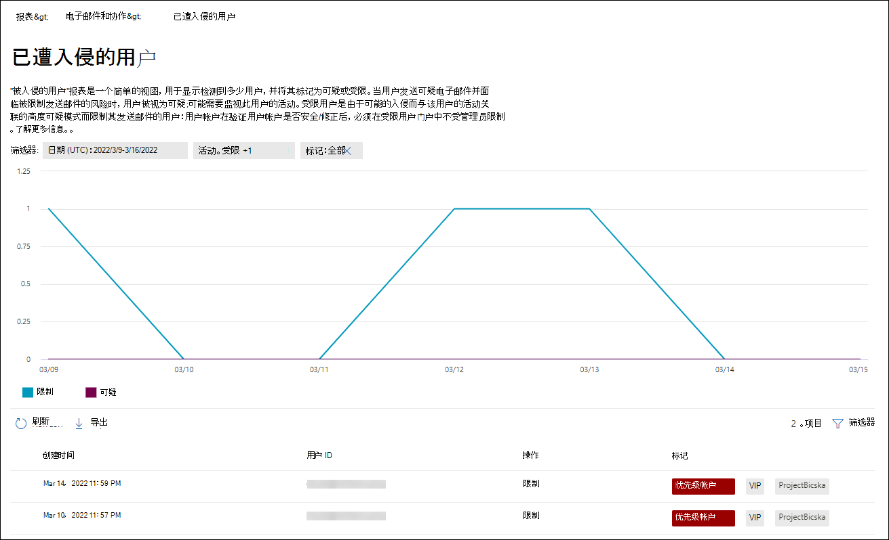
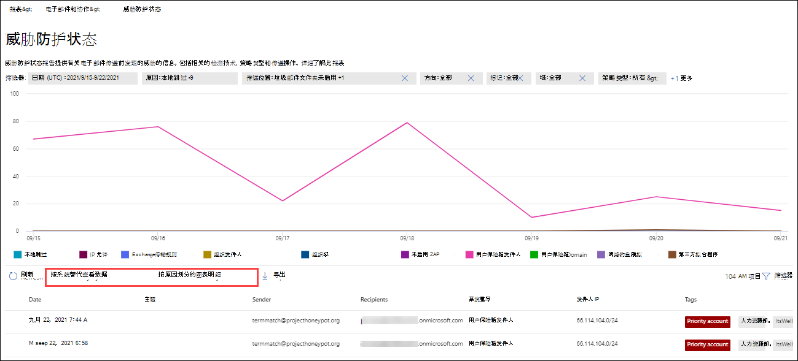

# 在电子邮件门户中查看Microsoft 365 Defender报告

[!INCLUDE [Microsoft 365 Defender rebranding](../includes/microsoft-defender-for-office.md)]

**适用对象**
- [Exchange Online Protection](exchange-online-protection-overview.md)
- [Microsoft Defender for Office 365 计划 1 和计划 2](defender-for-office-365.md)
- [Microsoft 365 Defender](../defender/microsoft-365-defender.md)

Microsoft 365 Defender 门户中提供了各种报告，可帮助你查看电子邮件安全功能（如 Microsoft 365 中的反垃圾邮件、反恶意软件和加密功能 <https://security.microsoft.com> ）如何保护你的组织。 如果您具有 [必要的权限](#what-permissions-are-needed-to-view-these-reports)，可以在 Microsoft 365 Defender 门户中查看这些报告，方式为"报告电子邮件& \> **协作** 电子邮件& \> **协作报告"。** 若要直接转到"电子邮件 **&协作报告"** 页面，请打开 <https://security.microsoft.com/emailandcollabreport> 。

> [!NOTE]
>
> 电子邮件和协作报告页面上的 **一些&需要使用** Microsoft Defender 进行Office 365。 有关这些报告的信息，请参阅查看 Office 365[门户中的 Microsoft 365 Defender 报告](view-reports-for-mdo.md)。
>
> 与邮件流相关的报告现在位于 EAC Exchange管理 () 。 有关这些报告详细信息，请参阅新管理中心中的Exchange[报告](/exchange/monitoring/mail-flow-reports/mail-flow-reports)。

## 遭到入侵的用户报告

> [!NOTE]
> 此报告适用于Microsoft 365邮箱Exchange Online组织。 它不适用于独立 EOP Exchange Online Protection () 组织。

"**遭到入侵的用户**"报告显示过去 7 天内标记为"可疑"或"受限"的用户帐户数量。 其中任一状态的帐户存在问题，甚至受到威胁。 通过频繁使用，可以使用报告来发现可疑或受限帐户的峰值甚至趋势。 有关遭到入侵的用户详细信息，请参阅响应遭到入侵 [的电子邮件帐户](responding-to-a-compromised-email-account.md)。

聚合视图显示过去 90 天的数据，而详细信息视图显示最近 30 天的数据。

To view the report in the Microsoft 365 Defender portal， go to **Reports** \> **Email & collaboration** Email & collaboration \> **reports**. 在"**电子邮件&协作报告**"页上，找到 **"遭到** 入侵的用户"，然后单击"**查看详细信息"。** 若要直接转到报告，请打开 <https://security.microsoft.com/reports/CompromisedUsers> 。

在" **遭到入侵的用户** "页上，图表显示指定日期范围的以下信息：

- **受限**：由于高度可疑的模式，已限制用户帐户发送电子邮件。
- **可疑**：用户帐户已发送可疑电子邮件，并且存在被限制发送电子邮件的风险。

图形下方的详细信息表显示了以下信息：

- **创建时间**
- **用户 ID**
- **操作**

通过单击"筛选器"，并选择出现的一个或多个以下值，可以筛选图表和详细信息表：

- **DATE (UTC)**： **Start date** and **End date**.
- **活动**：**受限或****可疑**

配置完筛选器后，请单击"应用"、"**取消**"或"**清除筛选器"。**

## Exchange传输规则报告

**"Exchange传输** 规则"报告显示邮件流规则对 (传入和传出邮件) 传输规则的影响。

To view the report in the Microsoft 365 Defender portal， go to **Reports** \> **Email & collaboration** Email & collaboration \> **reports**. 在"**电子邮件&协作报告**"页上，找到 **"Exchange规则"，** 然后单击"**查看详细信息"。** 若要直接转到报告，请打开 <https://security.microsoft.com/reports/ETRRuleReport> 。

在 **"Exchange** 规则报告"页上，以下各节介绍了可用的图表和数据。

### 按方向细分图表

如果选择" **按方向细分图表"，** 则以下图表可用：

- **按传输Exchange** 查看数据：受邮件流规则影响的入站和出站邮件的数量。
- **按 DLP 或** Exchange规则查看数据：受 DLP和邮件流规则中数据丢失防护 () 邮件的数量。

下图下的详细信息表中显示了以下信息：

- **日期**
- **DLP 策略** (通过 **DLP 查看数据Exchange传输规则仅)**
- **传输规则**
- **主题**
- **发件人地址**
- **收件人地址**
- **严重性**
- **Direction**

通过单击"筛选器"，并选择出现的一个或多个以下值，可以筛选图表和详细信息表：

- **DATE (UTC)** **Start date** and **End date**
- **方向**： **出站** 和 **入站**
- **严重性：****高严重性**、**中等严重性** 和 **低严重性**

配置完筛选器后，请单击"应用"、"**取消**"或"**清除筛选器"。**

### 按严重性分类的图表

如果选择" **按严重性划分图表细分"，** 则以下图表可用：

- **按以下传输Exchange** 查看数据：高严重性、中等严重性和 **低严重性邮件** 的数量。  将严重性级别设置为规则中的操作， (严重性级别审核此规则或 _SetAuditSeverity_) 。 有关详细信息，请参阅邮件[流规则操作Exchange Online。](/Exchange/security-and-compliance/mail-flow-rules/mail-flow-rule-actions)

- **按 DLP 查看数据Exchange** 传输规则：受 DLP 邮件流规则影响的高严重性、中等严重性和低严重性邮件的数量。 

下图下的详细信息表中显示了以下信息：

- **日期**
- **DLP 策略** (通过 **DLP 查看数据Exchange传输规则仅)**
- **传输规则**
- **主题**
- **发件人地址**
- **收件人地址**
- **严重性**
- **Direction**

通过单击"筛选器"，并选择出现的一个或多个以下值，可以筛选图表和详细信息表：

- **DATE (UTC)** **Start date** and **End date**
- **方向**： **出站** 和 **入站**
- **严重性：****高严重性**、**中等严重性** 和 **低严重性**

配置完筛选器后，请单击"应用"、"**取消**"或"**清除筛选器"。**

## 转发报告

> [!NOTE]
> 转发 **报告现已** 在 EAC 中提供。 有关详细信息，请参阅新 [EAC 中的自动转发邮件报告](/exchange/monitoring/mail-flow-reports/mfr-auto-forwarded-messages-report)。

## 邮件流状态报告

**邮件流状态** 报告是一个智能报告，它显示有关传入和传出电子邮件、垃圾邮件检测、恶意软件、标识为"良好"的电子邮件的信息，以及边缘上允许或阻止的电子邮件的信息。 这是包含边缘保护信息的唯一报告，并且只显示 EOP 服务允许其进入服务进行评估之前阻止Exchange Online Protection (电子邮件) 。 必须了解，如果将一封邮件发送给五个收件人，我们会将邮件计为五个不同的邮件，而不是一封邮件。

To view the report in the Microsoft 365 Defender portal， go to **Reports** \> **Email & collaboration** Email & collaboration \> **reports**. 在"**电子邮件&协作报告**"页上，找到 **"邮件流状态摘要**"，然后单击"**查看详细信息"。** 若要直接转到报告，请打开 <https://security.microsoft.com/reports/mailflowStatusReport> 。

### 邮件流状态报告的类型视图

在" **邮件流状态报告** "页上， **默认情况下选择** "类型"选项卡。 该图表显示指定日期范围的以下信息：

- **良好的邮件**
- **Total**
- **恶意软件**
- **钓鱼电子邮件**
- **垃圾邮件**
- **边缘保护**
- **规则邮件**

图形下方的详细信息表显示了以下信息：

- **Direction**
- **类型**
- **24 小时**
- **3 天**
- **7 天**
- **15 天**
- **30 天**

通过单击"筛选器"，并选择出现的一个或多个以下值，可以筛选图表和详细信息表：

- **UTC (utc** **) ：开始日期和****结束日期**
- **邮件方向**：
  - **入站**
  - **出站**
  - **组织内部**：在同一租户内发送的邮件。 例如，chris@contoso.com 向用户发送 michelle@contso.com。
- **类型**：
  - **良好的邮件**
  - **恶意软件**
  - **垃圾邮件**
  - **边缘保护**
  - **规则邮件**
  - **钓鱼电子邮件**
- **域**： **全部**

配置完筛选器后，请单击"应用"、"**取消**"或"**清除筛选器"。**

If you click **Choose a category for more details**， you can select from the following values：

- **网络钓鱼电子邮件**：此选择将你带至 [威胁防护状态报告](view-email-security-reports.md#threat-protection-status-report)。
- **电子邮件中的恶意软件**：此选择将你带至 [威胁防护状态报告](view-email-security-reports.md#threat-protection-status-report)。
- **垃圾邮件检测**：此选择将你带至 [垃圾邮件检测报告](view-email-security-reports.md#spam-detections-report)。
- **边缘阻止的垃圾邮件**：此选择将你带至 [垃圾邮件检测报告](view-email-security-reports.md#spam-detections-report)。

#### 从类型视图导出

对于详细信息视图，只能导出一天的数据。 因此，如果要导出 7 天的数据，需要执行 7 种不同的导出操作。

每个导出.csv文件限制为 150，000 行。 如果当天的数据包含超过 150，000 行，则创建多个.csv文件。

### 邮件流状态报告的方向视图

如果单击" **方向"** 选项卡，图表将显示指定日期范围的以下信息：

- **入站**
- **出站**
- **组织内部**

图形下方的详细信息表包含"类型"视图中 **的相同** 信息。

可以通过单击筛选器 来筛选图表和详细信息 **表**。 "类型"视图中可用的 **筛选器** 相同。

" **选择类别"了解更多详细信息** 可用的选择和行为与"类型 **"视图相同** 。

#### 从方向视图导出

对于详细信息视图，只能导出一天的数据。 因此，如果要导出 7 天的数据，需要执行 7 种不同的导出操作。

每个导出.csv文件限制为 150，000 行。 如果当天的数据包含超过 150，000 行，则创建多个.csv文件。

### 邮件流状态报告的漏斗视图

漏 **斗** 视图显示 Microsoft 的电子邮件威胁防护功能如何筛选组织中传入和传出的电子邮件。 它提供有关总电子邮件计数以及配置的威胁防护功能（包括边缘保护、反恶意软件、反网络钓鱼、反垃圾邮件和反欺骗）如何影响此计数的详细信息。

聚合视图和详细信息表视图允许筛选 90 天。

如果单击" **漏斗"** 选项卡，图表将显示按指定日期范围按以下类别组织的邮件：

- **电子邮件总数**：此值始终先显示。 剩余值按邮件计数降序显示。
- **边缘保护后的电子邮件**
- **传输规则之后的电子邮件 (** 邮件流规则) 
- **反恶意软件后的电子邮件， 文件信誉， 文件类型阻止**
  - **文件信誉**：由于其他 Microsoft 客户标识的附加文件而筛选的邮件。
  - **文件类型阻止**：由于邮件中标识的恶意文件类型而筛选的邮件。
- **反网络钓鱼后的电子邮件， URL 信誉， 品牌模拟， 反欺骗**
  - **URL 信誉**：由于其他 Microsoft 客户标识的 URL 而筛选的邮件。
  - **品牌模拟**：由于来自已知品牌模拟发件人的邮件而筛选的邮件。
  - **反欺骗**：由于邮件试图欺骗收件人所属的域或邮件发件人不属于的域而筛选的邮件。
- **反垃圾邮件、批量邮件筛选后的电子邮件**
  - **批量邮件筛选**：根据反垃圾邮件策略中的批量投诉级别 (BCL) 筛选的邮件。
- **用户和域模拟后的电子邮件**
  - 用户模拟：由于尝试模拟用户 (邮件发件人) 而筛选的邮件在 Defender for Office 365 中的反网络钓鱼策略的模拟保护设置中定义。
  - **域模拟**：由于尝试模拟在 Defender for Office 365 中反网络钓鱼策略的模拟保护设置中定义的域而筛选的邮件。
- **文件和 URL 触发后的电子邮件**
  - **文件触发**：由附件策略保险箱的邮件。
  - **URL 触发**：由链接策略保险箱的邮件。
- **传递后保护或 URL 单击时间保护 (检测为安全)**

类别由 **EOP** 或 Defender for **Office 365** 编码。 若要筛选图表中的类别，请单击图表图例Office 365 **EOP** 或 Defender for **(** 单击可消除;第二次单击可返回) 。

图表下方的详细信息表包含与图表相同的信息，但信息 (较短) 说明：

- **电子邮件总数**
- **边缘保护**
- **规则邮件**
- **反恶意软件， 文件信誉， 文件类型， 文件阻止**
- **反网络钓鱼， URL 信誉， 品牌模拟， 反欺骗**
- **反垃圾邮件、批量邮件筛选**
- **用户和域模拟**
- **ATP (文件和 URL) ：Defender** for Office 365
- **传递后保护和 ZAP (ATP) ：Defender** for Office 365

如果在详细信息表中选择一行，则电子邮件计数的进一步细分将显示在该飞出内容中。

通过单击"筛选器"，并选择出现的一个或多个以下值，可以筛选图表和详细信息表：

- **UTC (utc** **) ：开始日期和****结束日期**
- **邮件方向**：
  - **入站**
  - **出站**
  - **组织内部**：在同一租户内发送的邮件。 例如，chris@contoso.com 向用户发送 michelle@contso.com。

配置完筛选器后，请单击"应用"、"**取消**"或"**清除筛选器"。**

#### 从漏斗视图导出

单击"选项 **"** 下的 **"** 导出"后，可以选择下列值之一：

- **与 (最近 90 天的数据的摘要)**
- **有关 (最近 30 天的数据的详细信息)**

在 **"日期**"下，选择一个范围，然后单击"应用 **"。** 当前筛选器的数据将导出到一个.csv文件中。

每个导出.csv文件限制为 150，000 行。 如果数据包含的行数超过 150，000，.csv将创建多个文件。

### 邮件流状态报告的技术视图

" **技术"** 视图类似于漏 **斗视图** ，提供有关配置的威胁防护功能的更具体的详细信息。 从图中，你可以看到如何在威胁防护的不同阶段对邮件进行分类。

聚合视图和详细信息表允许筛选 90 天。

如果单击" **技术视图"** 选项卡，图表将显示按指定日期范围按以下类别组织的消息：

- **电子邮件总数**
- **边缘允许** 和 **边缘筛选**
- **传输规则允许****和传输规则筛选 (** 邮件流规则) 
- **不是恶意软件****保险箱附件检测** \* ，**以及反恶意软件引擎检测**
- **非网络钓鱼****、DMARC 失败**、**模拟检测** \* 、**欺骗检测和****钓鱼检测**
- **无需检测 URL 触发和** **URL 触发检测**\*
- **不是垃圾邮件** 和  **垃圾邮件**
- **非恶意电子邮件****、保险箱链接检测和** \* **ZAP**

\*Defender for Office 365

当您将鼠标悬停在图表中的类别上时，可以看到该类别中的消息数。

图表下面的详细信息表包含以下信息

- **UTC (日期)**
- **电子邮件总数**
- **已筛选边缘**
- **规则邮件**：由于邮件流规则而筛选 (也称为传输规则) 。
- **反恶意软件引擎，保险箱附件** \* ：
- **DMARC， 模拟** \* ，**欺骗**，**网络钓鱼筛选**：
  - **DMARC：** 由于邮件未通过 DMARC 身份验证检查而筛选的邮件。
- **URL 触发检测**\*
- **已筛选反垃圾邮件**
- **ZAP 已删除**
- **通过链接保险箱检测**\*

\*Defender for Office 365

如果在详细信息表中选择一行，则电子邮件计数的进一步细分将显示在该飞出内容中。

通过单击"筛选器"，并选择出现的一个或多个以下值，可以筛选图表和详细信息表：

- **DATE (UTC)**： **Start date** and **End date**
- **邮件方向**：
  - **入站**
  - **出站**
  - **组织内部**：在同一租户内发送的邮件。 例如，chris@contoso.com 向用户发送 michelle@contso.com。

配置完筛选器后，请单击"应用"、"**取消**"或"**清除筛选器"。**

#### "从技术导出"视图

单击" **导出"，** 在" **选项** "下，可以选择下列值之一：

- **与 (最近 90 天的数据的摘要)**
- **有关 (最近 30 天的数据的详细信息)**

在 **"日期**"下，选择一个范围，然后单击"应用 **"。** 当前筛选器的数据将导出到一个.csv文件中。

每个导出.csv文件限制为 150，000 行。 如果数据包含的行数超过 150，000，.csv将创建多个文件。

## 恶意软件检测报告

恶意软件 **检测报告显示** 有关传入和传出电子邮件中的恶意软件检测信息， (EOP Exchange Online Protection检测到的) 。 有关 EOP 中的恶意软件保护详细信息，请参阅 [EOP 中的反恶意软件保护](anti-malware-protection.md)。

聚合视图筛选器允许 90 天，而详细信息表筛选器仅允许 10 天。

To view the report in the Microsoft 365 Defender portal， go to **Reports** \> **Email & collaboration** Email & collaboration \> **reports**. 在"**电子邮件&协作** 报告"页上，找到 **"电子邮件** 中检测到的恶意软件"，然后单击"**查看详细信息"。** 若要直接转到报告，请打开 <https://security.microsoft.com/reports/MalwareDetections> 。

在" **恶意软件检测报告"** 页上，图表显示指定日期范围的以下信息：

- **出站**
- **入站**

图形下方的详细信息表显示了以下信息：

- **日期**
- **发件人地址**
- **收件人地址**
- **邮件 ID：** 在邮件 **头的 Message-ID** 头字段中可用，并且应该是唯一的。 示例值是 `<08f1e0f6806a47b4ac103961109ae6ef@server.domain>` (尖括号) 。
- **主题**
- **Filename**
- **恶意软件名称**

通过单击"筛选器"并选择下列值之一，可以筛选图表和详细信息表：

- **DATE (UTC)** **Start date** and **End date**
- **方向**：**入站****和出站**

配置完筛选器后，请单击"应用"、"**取消**"或"**清除筛选器"。**

## 邮件延迟报告

Defender **for** Office 365 中的邮件延迟报告包含有关组织中遇到的邮件传递和触发延迟的信息。 有关详细信息，请参阅邮件 [延迟报告](view-reports-for-mdo.md#mail-latency-report)。

## 垃圾邮件检测报告

> [!NOTE]
> 垃圾邮件 **检测报告** 最终将消失。 威胁防护状态报告中提供了 [相同的信息](#threat-protection-status-report)。

## 欺骗检测报告

> [!NOTE]
> 本文中所述的改进的欺骗检测报告在预览版中，可能会更改，并且并非在所有组织中都可用。 较旧版本的报告只显示"**良好邮件"和**"**捕获为垃圾邮件"。**

欺骗 **检测报告显示** 有关由于欺骗被阻止或允许的邮件的信息。 有关欺骗功能详细信息，请参阅 [EOP 中的反欺骗保护](anti-spoofing-protection.md)。

报告聚合视图允许筛选 45 天，而详细信息视图仅 \* 允许筛选 10 天。

\* 最终，你将能够使用最多 90 天的筛选。

To view the report in the Microsoft 365 Defender portal， go to **Reports** \> **Email & collaboration** Email & collaboration \> **reports**. 在"**电子邮件&协作** 报告"页上，找到 **"欺骗检测**"，然后单击"**查看详细信息"。** 若要直接转到报告，请打开 <https://security.microsoft.com/reports/SpoofMailReportV2> 。

该图表显示以下信息：

- **Pass**
- **失败**
- **SoftPass**
- **无**
- **其他**

当你将鼠标悬停在图表中 (数据) 时，你可以看到检测到的欺骗邮件的个个和原因。

在"**欺骗邮件报告**"页上，可以通过单击"筛选器"并选择以下一个或多个值来筛选图表和详细信息表：

- **DATE (UTC)** **Start date** and **End date**
- **结果**：
  - **Pass**
  - **失败**
  - **SoftPass**
  - **无**
  - **其他**
- **欺骗类型**：**内部和外部**

图形下方的详细信息表显示了以下信息：

- **日期**
- **欺骗用户**
- **发送基础结构**
- **欺骗类型**
- **结果**
- **结果代码**
- **SPF**
- **DKIM**
- **DMARC**
- **邮件计数**

有关复合身份验证结果代码详细信息，请参阅邮件中的[反垃圾邮件Microsoft 365。](anti-spam-message-headers.md)

## 提交报告

提交 **报告显示** 有关管理员已报告给 Microsoft 进行分析的项目的信息。 有关详细信息，请参阅使用[管理员提交将可疑的垃圾邮件、网络钓鱼、URL 和文件提交到 Microsoft。](admin-submission.md)

To view the report in the Microsoft 365 Defender portal， go to **Reports** \> **Email & Collaboration** Email & collaboration \> **reports**. 在"**电子邮件&协作报告**"页上，找到 **"提交"，** 然后单击"**查看详细信息"。** 若要直接转到报告，请打开 <https://security.microsoft.com/adminSubmissionReport> 。 To go to [admin submissions in the Microsoft 365 Defender portal](admin-submission.md)， click Go to **Submissions**. 管理员将能够查看最近 30 天的报告。 

该图表显示以下信息：

- **Pending**
- **已完成**

在 **"提交"** 页上，可以通过单击"筛选器"并选择以下一个或多个值来筛选图表和详细信息表：

- **报告的日期****：开始时间和****结束时间**
- **提交类型**：
  - **Email**
  - **URL**
  - **文件**
- **提交 ID**
- **网络消息 ID**
- **Sender**
- **名称**
- **提交者**
- **提交原因**：
  - **非垃圾邮件**
  - **网络钓鱼**
  - **恶意软件**
  - **垃圾邮件**
- **重新扫描状态**：
  - **Pending**
  - **已完成**

图形下方的详细信息表显示相同的信息，并且具有相同的组或自定义列选项与电子邮件和协作提交中的提交进行分析选项卡& \> **选项**。 有关详细信息，请参阅查看向 [Microsoft 提交的管理员](admin-submission.md#view-admin-submissions-to-microsoft)。

## 威胁防护状态报告

威胁 **防护状态报告** 在 EOP 和 Defender for Office 365;但是，报告包含不同的数据。 例如，EOP 客户可以查看有关电子邮件中检测到的恶意软件的信息，但不能查看有关 保险箱 Attachments 针对 SharePoint、OneDrive 和 Microsoft Teams 检测到的恶意[文件的信息](mdo-for-spo-odb-and-teams.md)。

该报告提供包含恶意内容的电子邮件（如反恶意软件引擎阻止的文件或网站地址 (URL) 、零时差自动清除[ (ZAP) ](zero-hour-auto-purge.md)和 Defender 等 Office 365 功能（如 保险箱[链接](safe-links.md)[、保险箱](safe-attachments.md)附件和防钓鱼策略中的模拟保护功能）的计数。  您可以使用此信息来确定趋势或确定组织策略是否需要调整。

**注意**：如果邮件发送给五个收件人，则我们将邮件计为五个不同邮件，而不是一封邮件，了解这一点很重要。

To view the report in the Microsoft 365 Defender portal， go to **Reports** \> **Email & Collaboration** Email & collaboration \> **reports**. 在"**电子邮件&协作报告**"页上，找到 **"威胁防护状态**"，然后单击"**查看详细信息"。** 若要直接转到报告，请打开以下 URL 之一：

- Defender for Office 365：<https://security.microsoft.com/reports/TPSAggregateReportATP>
- EOP： <https://security.microsoft.com/reports/TPSAggregateReport>

默认情况下，图表显示过去 7 天的数据。 如果 **单击"****威胁** 防护状态报告"页上的"筛选"，可以选择 90 天的日期范围 (试用版订阅可能限制为 30 天) 。 详细信息表允许筛选 30 天。

以下各节介绍了可用的视图。

### 按概述查看数据

在 **"按概述查看数据"** 视图中，图表中显示了以下检测信息：

- **电子邮件恶意软件**
- **电子邮件钓鱼邮件**
- **内容恶意软件**

图表下方没有详细信息表。

如果单击 **"筛选器"，** 则以下筛选器可用：

- **DATE (UTC)** **Start date** and **End date**
- **检测**：**电子邮件恶意软件****、电子邮件钓鱼** 邮件或 **内容恶意软件**
- **受保护****：MDO** (Defender for Office 365) **或 EOP**
- **Tag**：按应用了指定用户标记的用户或组筛选结果 (包括优先级帐户) 。 有关用户标记详细信息，请参阅用户 [标记](user-tags.md)。
- **Direction**
- **域**
- **策略类型**

配置完筛选器后，请单击"应用"、"**取消**"或"**清除筛选器"。**

### 通过电子邮件钓鱼查看 \> 数据，按检测技术查看图表细目

在" **通过电子邮件查看数据" \>** 和"按检测技术查看图表细分 **"** 视图中，图表中显示了以下信息：

- **URL 恶意信誉** \* ：来自 Defender 的恶意 URL 信誉Office 365客户的其他Microsoft 365触发。
- **高级筛选器**：基于机器学习的网络钓鱼信号。
- **常规筛选器**：基于分析员规则的网络钓鱼信号。
- **欺骗组织内部**：发件人正在尝试欺骗收件人域。
- **欺骗外部域**：发件人正在尝试欺骗某些其他域。
- **欺骗 DMARC：** 邮件上的 DMARC 身份验证失败。
- **模拟品牌**：模拟基于发件人的已知品牌。
- **混合分析检测**
- **文件信誉**
- **指纹匹配**
- **URL 触发信誉**\*
- **URL 触发**\*
- **模拟用户**\*
- **模拟域** \* ：模拟客户拥有或定义的域。
- **邮箱智能模拟** \* ：模拟由管理员定义或通过邮箱智能学习的用户。
- **文件触发**\*
- **宣传活动**\*

在图表下面的详细信息表中，提供了以下信息：

- **日期**
- **主题**
- **发件人**
- **Recipients**
- **检测者**
- **传递状态**
- **泄露来源**
- **Tags**

如果单击 **"筛选器"，** 则以下筛选器可用：

- **DATE (UTC)** **Start date** and **End date**
- **检测**
- **受保护****：MDO** (Defender for Office 365) 或 **EOP**
- **Direction**
- **Tag**：按应用了指定用户标记的用户或组筛选结果 (包括优先级帐户) 。 有关用户标记详细信息，请参阅用户 [标记](user-tags.md)。
- **域**
- **策略类型**
- **策略名称** (详细信息表) 
- **收件人**

配置完筛选器后，请单击"应用"、"**取消**"或"**清除筛选器"。**

### 按电子邮件恶意软件查看 \> 数据，按检测技术查看图表细目

在" **通过电子邮件查看数据 \> "和** "按检测技术查看图表细分 **"** 视图中，图表中显示了以下信息：

- **文件触发** \* ：按附件保险箱检测。
- **文件触发信誉** \* ：Defender 为安全触发生成的所有恶意Office 365信誉。
- **文件信誉**
- **反恶意软件引擎** \* ：来自反恶意软件引擎的检测。
- **反恶意软件策略文件类型阻止**：这些是由于邮件中标识的恶意文件类型而筛选掉的电子邮件。
- **URL 恶意声誉**
- **URL 设置**
- **URL 组织的信誉**
- **市场活动**

在图表下面的详细信息表中，提供了以下信息：

- **日期**
- **主题**
- **发件人**
- **Recipients**
- **检测者**
- **传递状态**
- **泄露来源**
- **Tags**

如果单击 **"筛选器"，** 则以下筛选器可用：

- **DATE (UTC)** **Start date** and **End date**
- **检测**
- **受保护****：MDO** (Defender for Office 365) 或 **EOP**
- **Direction**
- **Tag**：按应用了指定用户标记的用户或组筛选结果 (包括优先级帐户) 。 有关用户标记详细信息，请参阅用户 [标记](user-tags.md)。
- **域**
- **策略类型**
- **策略名称** (详细信息表) 
- **收件人**

配置完筛选器后，请单击"应用"、"**取消**"或"**清除筛选器"。**

### 按策略类型和通过电子邮件查看数据或通过电子邮件恶意软件 \> 查看数据的图表 \> 细分

在 **"按策略类型划分** 的图表细分"和 **" \>** 通过电子邮件查看数据"或"通过电子邮件查看恶意软件数据"视图中，图表中显示了以下信息： **\>**

- **反恶意软件**
- **保险箱附件**\*
- **防钓鱼**
- **反垃圾邮件**
- **邮件流规则** (也称为传输规则) 
- **其他**

在图表下面的详细信息表中，提供了以下信息：

- **日期**
- **主题**
- **发件人**
- **Recipients**
- **检测者**
- **传递状态**
- **泄露来源**
- **Tags**

如果单击 **"筛选器"，** 则以下筛选器可用：

- **DATE (UTC)** **Start date** and **End date**
- **检测**
- **受保护****：MDO** (Defender for Office 365) 或 **EOP**
- **Direction**
- **Tag**：按应用了指定用户标记的用户或组筛选结果 (包括优先级帐户) 。 有关用户标记详细信息，请参阅用户 [标记](user-tags.md)。
- **域**
- **策略类型**
- **策略名称** (详细信息表) 
- **收件人**

配置完筛选器后，请单击"应用"、"**取消**"或"**清除筛选器"。**

### 按传递状态和通过电子邮件查看数据或通过电子邮件恶意软件 \> 查看数据的图表 \> 细分

在 **"按传递状态分类"** 和 **" \>** 通过电子邮件查看数据"或"通过电子邮件查看恶意软件数据"视图中，图表中显示了以下信息： **\>**

- **托管邮箱：收件箱**
- **托管邮箱：垃圾邮件**
- **托管邮箱：自定义文件夹**
- **托管邮箱：已删除项目**
- **转发**
- **本地服务器：已传递**
- **隔离**
- **传递失败**
- **已丢弃**

在图表下面的详细信息表中，提供了以下信息：

- **日期**
- **主题**
- **发件人**
- **Recipients**
- **检测者**
- **传递状态**
- **泄露来源**
- **Tags**

如果单击 **"筛选器"，** 则以下筛选器可用：

- **DATE (UTC)** **Start date** and **End date**
- **检测**
- **受保护****：MDO** (Defender for Office 365) **或 EOP**
- **Direction**
- **Tag**：按应用了指定用户标记的用户或组筛选结果 (包括优先级帐户) 。 有关用户标记详细信息，请参阅用户 [标记](user-tags.md)。
- **域**
- **策略类型**
- **策略名称** (详细信息表) 
- **收件人**

配置完筛选器后，请单击"应用"、"**取消**"或"**清除筛选器"。**

### 按内容恶意软件查看 \> 数据

在 **"按内容恶意软件查看 \>** 数据"视图中，以下信息显示在 Microsoft Defender for Office 365 图表中：

- **反恶意软件引擎**：在 SharePoint、OneDrive 和 Microsoft Teams 中通过内置病毒检测 [检测到的恶意](virus-detection-in-spo.md)Microsoft 365。
- **文件爆炸**：附件检测到的恶意保险箱 [文件SharePoint、OneDrive和Microsoft Teams。](mdo-for-spo-odb-and-teams.md)

在图表下面的详细信息表中，提供了以下信息：

- **DATE (UTC)** **Start date** and **End date**
- **Location**
- **检测者**
- **恶意软件名称**

如果单击 **"筛选器"，** 则以下筛选器可用：

- **DATE (UTC)** **Start date** and **End date**
- **检测****：反恶意软件引擎** 或 **文件触发**

配置完筛选器后，请单击"应用"、"**取消**"或"**清除筛选器"。**

### 按系统覆盖和按原因的图表细分查看数据

在" **按系统覆盖查看数据"和** "按原因 **查看** 图表细分"视图中，图表中将显示以下替代原因信息：

- **本地跳过**
- **IP 允许**
- **Exchange邮件传输规则 (** 邮件流规则) 
- **组织允许的发件人**
- **组织允许的域**
- **ZAP 未启用**
- **用户保险箱发件人**
- **用户保险箱域**
- **网络钓鱼模拟**：有关详细信息，请参阅配置向用户传递第三方网络钓鱼模拟以及将未筛选的邮件发送到 [SecOps 邮箱](configure-advanced-delivery.md)。
- **第三方筛选器**

在图表下面的详细信息表中，提供了以下信息：

- **日期**
- **主题**
- **发件人**
- **Recipients**
- **系统替代**
- **泄露来源**
- **Tags**

如果单击 **"筛选器"，** 则以下筛选器可用：

- **DATE (UTC)** **Start date** and **End date**
- **原因**
- **方向**：
  - **全部**
  - **入站**
  - **出站**
- **Tag**：按应用了指定用户标记的用户或组筛选结果 (包括优先级帐户) 。 有关用户标记详细信息，请参阅用户 [标记](user-tags.md)。
- **域**
- **策略类型**：
  - **全部**
  - **反恶意软件**
  - **保险箱附件**\*
  - **防钓鱼**
  - **反垃圾邮件**
  - **邮件流规则** (传输规则) 
  - **其他**
- **策略名称** (详细信息表) 
- **收件人**

\*仅 defender for Office 365

配置完筛选器后，请单击"应用"、"**取消**"或"**清除筛选器"。**

### 按"系统替代"和"图表细分"按传递位置查看数据

在"**按系统覆盖查看** 数据"和"按传递位置查看图表细分"视图中，图表中显示了以下替代原因信息：

- **未启用垃圾邮件文件夹**
- **SecOps 邮箱**：有关详细信息，请参阅配置向用户传递第三方网络钓鱼模拟以及将未筛选的邮件发送到 [SecOps 邮箱](configure-advanced-delivery.md)。

在图表下面的详细信息表中，提供了以下信息：

- **日期**
- **主题**
- **发件人**
- **Recipients**
- **系统替代**
- **泄露来源**
- **Tags**

如果单击 **"筛选器"，** 则以下筛选器可用：

- **Date (UTC)** **Start date** and **End date**
- **原因**
- **方向**：
  - **全部**
  - **入站**
  - **出站**
- **Tag**：按应用了指定用户标记的用户或组筛选结果 (包括优先级帐户) 。 有关用户标记详细信息，请参阅用户 [标记](user-tags.md)。
- **域**
- **策略类型**：
  - **全部**
  - **反恶意软件**
  - **保险箱附件**\*
  - **防钓鱼**
  - **反垃圾邮件**
  - **邮件流规则** (传输规则) 
  - **其他**
- **策略名称** (详细信息表) 
- **收件人**

\*仅 defender for Office 365

配置完筛选器后，请单击"应用"、"**取消**"或"**清除筛选器"。**

## 热门恶意软件报告

" **热门恶意软件** "报告显示 [EOP](anti-malware-protection.md)中的反恶意软件保护检测到的各种恶意软件。

To view the report in the Microsoft 365 Defender portal， go to **Reports** \> **Email & Collaboration** Email & collaboration \> **reports**. 在"**电子邮件&协作报告**"页上，找到 **"热门恶意软件**"，然后单击"**查看详细信息"。** 若要直接转到报告，请打开 <https://security.microsoft.com/reports/TopMalware> 。

当您将鼠标悬停在饼图中的一个浮点上时，可以看到某种恶意软件的名称，以及检测到具有该恶意软件的邮件数。

在" **热门恶意软件报告** "页上，报表页上将显示饼图的较大版本。图表下面的详细信息表显示以下信息：

- **热门恶意软件**
- **Count**

If you click **Filter**， you can specify a date range with **Start date** and **End date**.

## URL 威胁防护报告

URL **威胁防护报告** 仅在 Microsoft Defender 中提供Office 365。 有关详细信息，请参阅 [URL 威胁防护报告](view-reports-for-mdo.md#url-threat-protection-report)。

## 用户报告的邮件报告

> [!IMPORTANT]
> 为了使"**用户报告的消息**"报告正常工作，必须为用户报告环境启用Microsoft 365日志记录。 通常是由在 Exchange Online 中分配为审核日志的角色执行。 有关详细信息，请参阅打开[Microsoft 365 审核日志或关闭搜索](../../compliance/turn-audit-log-search-on-or-off.md)。

用户 **报告的邮件** 报告显示有关用户使用报告邮件外接程序或报告网络钓鱼外接程序报告为垃圾邮件、网络钓鱼尝试或良好邮件 [的电子邮件的信息](enable-the-report-phish-add-in.md)。 

To view the report in the Microsoft 365 Defender portal， go to **Reports** \> **Email & Collaboration** Email & collaboration \> **reports**. 在"**电子邮件&协作报告**"页上，找到 **"用户报告的邮件**"，然后单击"**查看详细信息"。** 若要直接转到报告，请打开 <https://security.microsoft.com/reports/userSubmissionReport> 。 若要转到管理员 [门户中的管理员Microsoft 365 Defender，请单击](admin-submission.md)**"转到提交"。**

在"**用户报告的消息**"页上，可以通过单击"筛选器"，在出现的飞出中选择以下一个或多个值来筛选图表和详细信息表：

- **报告的日期****：开始时间和****结束时间**
- **报告者**
- **电子邮件主题**
- **邮件报告 ID**
- **网络消息 ID**
- **Sender**
- **报告的原因**
  - **非垃圾邮件**
  - **网络钓鱼**
  - **垃圾邮件**
- **网络钓鱼模拟**： **是** 或 **否**

配置完筛选器后，请单击"应用"、"**取消**"或"**清除筛选器"。**

若要对条目进行分组 **，请单击"** 分组"，然后从下拉列表中选择下列值之一：

- **无**
- **原因**
- **Sender**
- **报告者**
- **重新扫描结果**
- **网络钓鱼模拟**

图形下方的详细信息表显示了以下信息：

- **电子邮件主题**
- **报告者**
- **报告的日期**
- **Sender**
- **报告的原因**
- **重新扫描结果**
- **Tags**

若要将邮件提交给 Microsoft 进行分析，请从表中选择邮件条目，单击"提交给 **Microsoft** 进行分析"，然后从下拉列表中选择下列值之一：

- **报告干净**
- **报告网络钓鱼**
- **报告恶意软件**
- **报告垃圾邮件**'
- **触发调查** (Defender for Office 365) 

## 查看这些报告需要哪些权限？

若要查看和使用本文中所述的报告，您需要是该门户中以下角色组之一Microsoft 365 Defender成员：

- **组织管理**
- **安全管理员**
- **安全信息读取者**
- **全局读取者**

有关详细信息，请参阅 [Microsoft 365 Defender 门户中的权限](permissions-microsoft-365-security-center.md)。

**注意**：向 Microsoft 365 管理中心 中的相应 Azure Active Directory 角色添加用户会为用户提供 Microsoft 365 Defender 门户中所需的权限以及 Microsoft 365 中其他功能的权限。 有关详细信息，请参阅 [关于管理员角色](../../admin/add-users/about-admin-roles.md)。

## 如果报告未显示数据，该做什么？

如果报告中未显示数据，请仔细检查策略是否正确设置。 若要了解更多信息，请参阅 [防范威胁](protect-against-threats.md)。

## 相关主题

[EOP 中的反垃圾邮件和反恶意软件保护](anti-spam-and-anti-malware-protection.md)

[智能报表和 Microsoft 365 Defender见解](reports-and-insights-in-security-and-compliance.md)

[在邮件门户中查看Microsoft 365 Defender报告](view-mail-flow-reports.md)

[查看 Defender for Office 365](view-reports-for-mdo.md)
