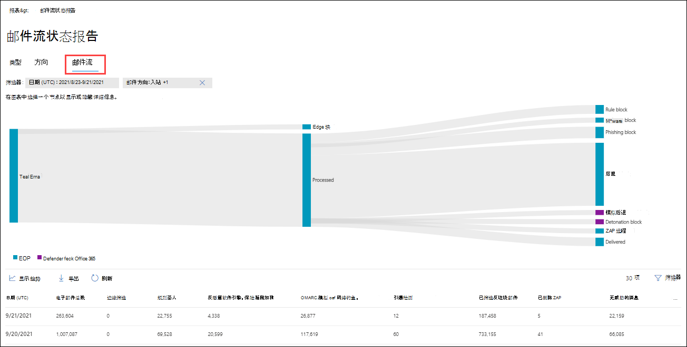
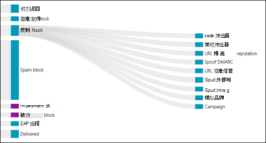
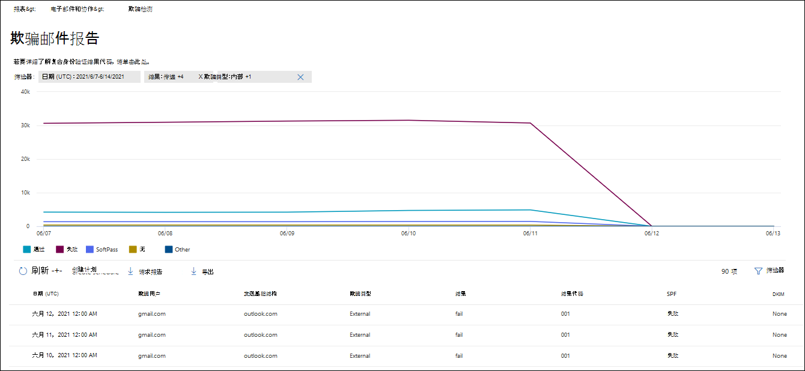
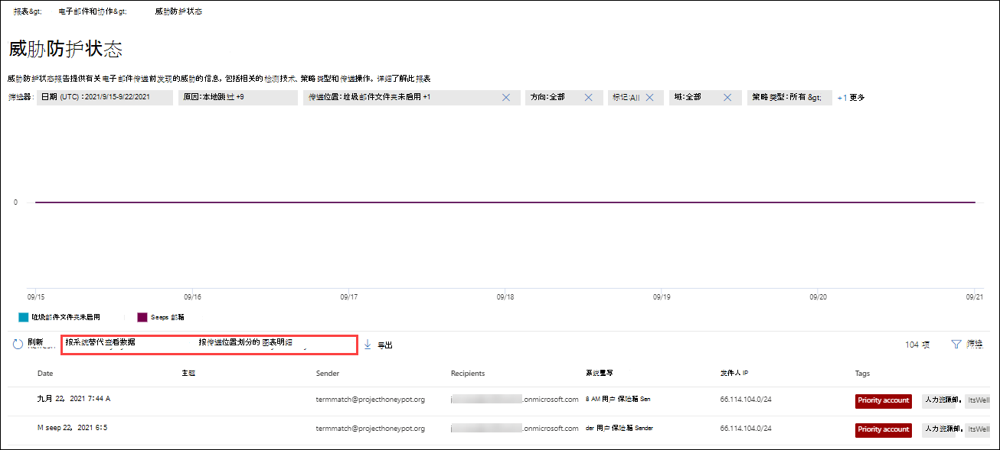

# 在电子邮件门户中查看Microsoft 365 Defender报告

[!INCLUDE [Microsoft 365 Defender rebranding](../includes/microsoft-defender-for-office.md)]

**适用对象**
- [Exchange Online Protection](exchange-online-protection-overview.md)
- [Microsoft Defender for Office 365 计划 1 和计划 2](defender-for-office-365.md)
- [Microsoft 365 Defender](../defender/microsoft-365-defender.md)

<https://security.microsoft.com> Microsoft 365 Defender 门户中提供了各种报告，可帮助你查看电子邮件安全功能（如电子邮件中的反垃圾邮件和反恶意软件Microsoft 365功能）如何保护你的组织。 如果您具有 [必要的权限](#what-permissions-are-needed-to-view-these-reports)，您可以查看和下载这些报告，如本文中所述。

> [!NOTE]
>
> 电子邮件和协作报告页面上的 **一些&需要使用** Microsoft Defender 进行Office 365。 有关这些报告的信息，请参阅在 Office 365 [门户](view-reports-for-mdo.md)中查看 Microsoft 365 Defender 报告。
>
> 与邮件流相关的报告现在位于Exchange中心。 有关这些报告详细信息，请参阅新管理中心中的Exchange[报告](/exchange/monitoring/mail-flow-reports/mail-flow-reports)。

## 电子邮件安全报告在电子邮件Microsoft 365 Defender更改

下表介绍了 Microsoft 365 Defender 门户中) EOP) 和 Microsoft Defender for Office 365 报告（已替换、移动或已弃用）。 Exchange Online Protection (

 

****

|已弃用的报告和 cmdlet|新报表和 cmdlet|消息中心 ID|Date|
|---|---|:---:|:---:|
|**URL 跟踪** 
 Get-URLTrace|[URL 保护报告](view-reports-for-mdo.md#url-protection-report) 
 [Get-SafeLinksAggregateReport](/powershell/module/exchange/get-safelinksaggregatereport)   [Get-SafeLinksDetailReport](/powershell/module/exchange/get-safelinksdetailreport)|MC239999|2021 年 6 月|
|**已发送和已接收电子邮件报告** 
 Get-MailTrafficReport   Get-MailDetailReport|[威胁防护状态报告](#threat-protection-status-report)   [邮件流状态报告](#mailflow-status-report) 
 [Get-MailTrafficATPReport](/powershell/module/exchange/get-mailtrafficatpreport)   [Get-MailDetailATPReport](/powershell/module/exchange/get-maildetailatpreport)   [Get-MailFlowStatusReport](/powershell/module/exchange/get-mailflowstatusreport)|MC236025|2021 年 6 月|
|**转发报告** 
 无 cmdlet|[EAC 中的自动转发邮件报告](/exchange/monitoring/mail-flow-reports/mfr-auto-forwarded-messages-report) 
 无 cmdlet|MC250533|2021 年 6 月|
|**保险箱附件文件类型报告** 
 Get-AdvancedThreatProtectionTrafficReport   Get-MailDetailMalwareReport|[威胁防护状态报告：通过电子邮件恶意软件查看 \> 数据](#view-data-by-email--malware-and-chart-breakdown-by-detection-technology) 
 [Get-MailTrafficATPReport](/powershell/module/exchange/get-mailtrafficatpreport)   [Get-MailDetailATPReport](/powershell/module/exchange/get-maildetailatpreport)|MC250532|2021 年 6 月|
|**保险箱附件邮件处置报告** 
 Get-AdvancedThreatProtectionTrafficReport   Get-MailDetailMalwareReport|[威胁防护状态报告：通过电子邮件恶意软件查看 \> 数据](#view-data-by-email--malware-and-chart-breakdown-by-detection-technology) 
 [Get-MailTrafficATPReport](/powershell/module/exchange/get-mailtrafficatpreport)   [Get-MailDetailATPReport](/powershell/module/exchange/get-maildetailatpreport)|MC250531|2021 年 6 月|
|**电子邮件报告中检测到的恶意软件** 
 Get-MailTrafficReport   Get-MailDetailMalwareReport|[威胁防护状态报告：通过电子邮件恶意软件查看 \> 数据](#view-data-by-email--malware-and-chart-breakdown-by-detection-technology) 
 [Get-MailTrafficATPReport](/powershell/module/exchange/get-mailtrafficatpreport)   [Get-MailDetailATPReport](/powershell/module/exchange/get-maildetailatpreport)|MC250530|2021 年 6 月|
|**垃圾邮件检测报告** 
 Get-MailTrafficReport   Get-MailDetailSpamReport|[威胁防护状态报告：通过电子邮件垃圾邮件查看 \> 数据](#view-data-by-email--spam-and-chart-breakdown-by-detection-technology) 
 [Get-MailTrafficATPReport](/powershell/module/exchange/get-mailtrafficatpreport)   [Get-MailDetailATPReport](/powershell/module/exchange/get-maildetailatpreport)|MC250529|2021 年 10 月|
|Get-AdvancedThreatProtectionDocumentReport 
 Get-AdvancedThreatProtectionDocumentDetail|[Get-ContentMalwareMdoAggregateReport](/powershell/module/exchange/get-contentmalwaremdoaggregatereport) 
 [Get-ContentMalwareMdoDetailReport](/powershell/module/exchange/get-contentmalwaremdodetailreport)|TBA|2022 年 5 月|
|**Exchange传输规则报告** 
 Get-MailTrafficPolicyReport   Get-MailDetailTransportRuleReport|[Exchange EAC 中的传输规则报告](/exchange/monitoring/mail-flow-reports/mfr-exchange-transport-rule-report) 
 无 cmdlet|MC316157|2022 年 4 月|
|Get-MailTrafficTopReport|[威胁防护状态报告：通过电子邮件恶意软件查看 \> 数据](#view-data-by-email--malware-and-chart-breakdown-by-detection-technology) 
 [Get-MailTrafficATPReport](/powershell/module/exchange/get-mailtrafficatpreport)   [Get-MailDetailATPReport](/powershell/module/exchange/get-maildetailatpreport) 
 **注意**：Get-MailTrafficTopReport 中的加密报告功能没有替代。|MC315742|2022 年 4 月|
|

## 遭到入侵的用户报告

> [!NOTE]
> 此报告适用于具有Microsoft 365邮箱Exchange Online组织。 它不适用于独立 EOP Exchange Online Protection () 组织。

"**遭到入侵的用户**"报告显示最近 7 天内标记为"可疑"或"受限"的用户帐户数量。 其中任一状态的帐户存在问题，甚至受到威胁。 通过频繁使用，可以使用报告来发现可疑或受限帐户的峰值甚至趋势。 有关遭到入侵的用户详细信息，请参阅 [响应遭到入侵的电子邮件帐户](responding-to-a-compromised-email-account.md)。

聚合视图显示过去 90 天的数据，而详细信息视图显示最近 30 天的数据。

To view the report in the Microsoft 365 Defender portal at <https://security.microsoft.com>， go to **Reports** \> **Email & collaboration** \> **Email & collaboration reports**. 在" **电子邮件&协作报告** "页上，找到 **"遭到入侵的用户** "，然后单击" **查看详细信息"**。 若要直接转到报告，请打开 <https://security.microsoft.com/reports/CompromisedUsers>。

在" **遭到入侵的用户** "页上，图表显示指定日期范围的以下信息：

- **受限**：由于高度可疑的模式，已限制用户帐户发送电子邮件。
- **可疑**：用户帐户已发送可疑电子邮件，并且存在被限制发送电子邮件的风险。

图形下方的详细信息表显示了以下信息：

- **创建时间**
- **用户 ID**
- **操作**

通过单击"筛选器"，并选择出现的一个或多个以下值，可以筛选图表和详细信息表：

- **DATE (UTC)**： **Start date** and **End date**.
- **活动**：**受限或****可疑**

配置完筛选器后，请单击"应用"**、"****取消**"或"清除 **筛选器"**。

在" **遭到入侵的用户"** 页上，"创建  **[创建计划](#schedule-report)**、请求  **["请求报告](#request-report)**"和"  **["](#export-report)** 导出"按钮可用。

## Exchange传输规则报告

> [!NOTE]
> 当前 **Exchange** EAC 中提供了传输规则报告。 有关详细信息，请参阅Exchange [EAC 中的传输规则报告](/exchange/monitoring/mail-flow-reports/mfr-exchange-transport-rule-report)。

### 按方向细分图表

如果选择" **按方向细分图表"**，则以下图表可用：

- **按以下传输Exchange** 查看数据：受邮件流规则影响的入站和出站邮件的数量。
- **按 DLP 或** Exchange规则查看数据：受 DLP 和邮件流规则中数据丢失防护 () 邮件的数量。

下图下的详细信息表中显示了以下信息：

- **Date**
- **DLP 策略** (**仅通过 DLP Exchange传输规则查看**) 
- **传输规则**
- **主题**
- **发件人地址**
- **收件人地址**
- **严重性**
- **方向**

通过单击"筛选器"，并选择出现的一个或多个以下值，可以筛选图表和详细信息表：

- **Date (UTC)** **Start date** and **End date**.
- **方向**：**出站和****入站**。
- **严重性：****高严重性**、**中等严重性** 和 **低严重性**

配置完筛选器后，请单击"应用"**、"****取消**"或"清除 **筛选器"**。

在"**Exchange规则报告**"页上，"创建 **[创建计划](#schedule-report)**、请求  **["请求报告](#request-report)**"和"  **["](#export-report)** 导出"按钮可用。

### 按严重性分类的图表

如果选择" **按严重性划分的** 图表细分"，则以下图表可用：

- **按以下传输Exchange** 查看数据：高严重性、中等严重性和 **低严重性邮件** 的数量。  将严重性级别设置为规则中的操作， (严重性级别审核此规则或 _SetAuditSeverity_) 。 有关详细信息，请参阅邮件[流规则操作Exchange Online](/Exchange/security-and-compliance/mail-flow-rules/mail-flow-rule-actions)。

- **按 DLP 查看数据Exchange** 传输规则：受 DLP 邮件流规则影响的高严重性、中等严重性和低严重性邮件的数量。

下图下的详细信息表中显示了以下信息：

- **Date**
- **DLP 策略** (**仅通过 DLP Exchange传输规则查看**) 
- **传输规则**
- **主题**
- **发件人地址**
- **收件人地址**
- **严重性**
- **方向**

通过单击"筛选器"，并选择出现的一个或多个以下值，可以筛选图表和详细信息表：

- **DATE (UTC)** **Start date** and **End date**
- **方向**： **出站** 和 **入站**
- **严重性：****高严重性**、**中等严重性** 和 **低严重性**

配置完筛选器后，请单击"应用"**、"****取消**"或"清除 **筛选器"**。

在"**Exchange规则报告**"页上，"创建 **[创建计划](#schedule-report)**、请求  **["请求报告](#request-report)**"和"  **["](#export-report)** 导出"按钮可用。

## 转发报告

> [!NOTE]
> 此报告现已在 EAC 中提供。 有关详细信息，请参阅新 [EAC 中的自动转发邮件报告](/exchange/monitoring/mail-flow-reports/mfr-auto-forwarded-messages-report)。

## 邮件流状态报告

**邮件流状态** 报告是一个智能报告，它显示有关传入和传出电子邮件、垃圾邮件检测、恶意软件、标识为"良好"的电子邮件的信息，以及边缘上允许或阻止的电子邮件的信息。 这是包含边缘保护信息的唯一报告，并且只显示 EOP 服务允许其进入服务进行评估之前阻止Exchange Online Protection (电子邮件) 。 必须了解，如果将一封邮件发送给五个收件人，我们会将邮件计为五个不同的邮件，而不是一封邮件。

To view the report in the Microsoft 365 Defender portal at <https://security.microsoft.com>， go to **Reports** \> **Email & collaboration** \> **Email & collaboration reports**. 在" **电子邮件&协作报告** "页上，找到 **"邮件流状态摘要** "，然后单击" **查看详细信息"**。 若要直接转到报告，请打开 <https://security.microsoft.com/reports/mailflowStatusReport>。

### 邮件流状态报告的类型视图

在" **邮件流状态报告** "页上 **，默认情况下选择** "类型"选项卡。 该图表显示指定日期范围的以下信息：

- **良好的邮件**：确定不是垃圾邮件或用户或组织策略允许的电子邮件。
- **Total**
- **恶意软件**：由各种筛选器作为恶意软件阻止的电子邮件。
- **网络钓鱼电子邮件**：由各种筛选器阻止为网络钓鱼的电子邮件。
- **垃圾邮件**：由各种筛选器阻止为垃圾邮件的电子邮件。
- **边缘保护**：在 EOP 或 Defender 评估边缘/外围上拒绝的电子邮件Office 365。
- **规则邮件**：由邮件流规则操作的电子邮件 (传输规则) 。

图形下方的详细信息表显示了以下信息：

- **方向**
- **类型**
- **24 小时**
- **3 天**
- **7 天**
- **15 天**
- **30 天**

通过单击"筛选器"，并选择出现的一个或多个以下值，可以筛选图表和详细信息表：

- **DATE (UTC)**： **Start date** and **End date**.
- **邮件方向**： **入站** 和 **出站**。
- **类型**：
  - **良好的邮件**
  - **恶意软件**
  - **垃圾邮件**
  - **边缘保护**
  - **规则邮件**
  - **钓鱼电子邮件**

配置完筛选器后，请单击"应用"**、"****取消**"或"清除 **筛选器"**。

返回到"**邮件流状态报告**"页，如果单击"选择类别"了解更多详细信息，您可以从以下值中选择：

- **网络钓鱼电子邮件**：此选择将你查看 [威胁防护状态报告](view-email-security-reports.md#threat-protection-status-report)。
- **电子邮件中的恶意软件**：此选择将你带至 [威胁防护状态报告](view-email-security-reports.md#threat-protection-status-report)。
- **垃圾邮件检测**：此选择将您带至 ["垃圾邮件检测"报告](view-email-security-reports.md#spam-detections-report)。
- **边缘阻止的垃圾邮件**：此选择将您带至 [垃圾邮件检测报告](view-email-security-reports.md#spam-detections-report)。

在" **邮件流状态报告"** 页上，"创建  **[创建日程安排和](#schedule-report)** **["](#export-report)** 导出"按钮可用。

### 邮件流状态报告的方向视图

如果单击" **方向"** 选项卡，图表将显示指定日期范围的以下信息：

- **入站**
- **出站**

通过单击"筛选器"，并选择出现的一个或多个以下值，可以筛选图表和详细信息表：

- **DATE (UTC)**： **Start date** and **End date**.
- **邮件方向**： **入站** 和 **出站**。
- **类型**：
  - **良好的邮件**
  - **恶意软件**
  - **垃圾邮件**
  - **边缘保护**
  - **规则邮件**
  - **钓鱼电子邮件**

配置完筛选器后，请单击"应用"**、"****取消**"或"清除 **筛选器"**。

返回到"**邮件流状态报告**"页，如果单击"选择类别"了解更多详细信息，您可以从以下值中选择：

- **网络钓鱼电子邮件**：此选择将你查看 [威胁防护状态报告](view-email-security-reports.md#threat-protection-status-report)。
- **电子邮件中的恶意软件**：此选择将你带至 [威胁防护状态报告](view-email-security-reports.md#threat-protection-status-report)。
- **垃圾邮件检测**：此选择将您带至 ["垃圾邮件检测"报告](view-email-security-reports.md#spam-detections-report)。
- **边缘阻止的垃圾邮件**：此选择将您带至 [垃圾邮件检测报告](view-email-security-reports.md#spam-detections-report)。

在" **邮件流状态报告"** 页上，"创建  **创建日程安排和** **"** 导出"按钮可用。

### 邮件流状态报告的邮件流视图

邮件 **流** 视图显示 Microsoft 的电子邮件威胁防护功能如何筛选组织中传入和传出的电子邮件。 此视图使用水平流程图 (称为 _Sankey_ 图表) ，提供有关电子邮件总数以及配置的威胁防护功能（包括边缘保护、反恶意软件、反网络钓鱼、反垃圾邮件和反欺骗）对此计数有何影响的详细信息。

聚合视图和详细信息表视图允许筛选 90 天。

图中的信息由 **EOP 或 Defender** 进行颜色编码 **，Office 365** 技术。

该图分为以下水平带：

- **电子邮件总** 带：此值始终先显示。
- **边缘块** 和 **已处理带** ：
  - **边缘阻止**：在边缘筛选并标识为边缘保护的邮件。
  - **已** 处理：由筛选堆栈处理的消息。
- 结果带：
  - **规则阻止**：由邮件流规则Exchange的邮件 (传输规则) 。
  - **恶意软件阻止**：由各种筛选器标识为恶意软件的邮件。\*
  - **网络钓鱼阻止**：各种筛选器在处理过程中标识为网络钓鱼的邮件。\*
  - **垃圾邮件阻止**：各种筛选器在处理过程中标识为垃圾邮件的邮件。\*
  - **模拟阻止**：在 Defender for Office 365 中检测为用户模拟或域Office 365。\*
  - **触发块**：在文件或 URL 触发期间检测到保险箱附件策略保险箱 Defender 中的链接策略Office 365。\*
  - **ZAP 已删除**：通过零时差自动清除功能删除 (ZAP) 。\*
  - **已** 传递：由于允许而传递给用户的邮件。\*

如果将鼠标悬停在图表中的水平条带上，你将看到相关消息的数量。

\* 如果单击此元素，图表将展开以显示更多详细信息。 有关扩展节点中每个元素的说明，请参阅 [检测技术](/office/office-365-management-api/office-365-management-activity-api-schema#detection-technologies)。

图表下面的详细信息表显示了以下信息：

- **Date**
- **电子邮件总数**
- **已筛选边缘**
- **规则邮件**
- **反恶意软件引擎，保险箱附件，已筛选规则**
- **DMARC 模拟、欺骗、已筛选的网络钓鱼**
- **触发检测**
- **已筛选反垃圾邮件**
- **ZAP 已删除**
- **未检测到威胁的邮件**

如果在详细信息表中选择一行，电子邮件计数的进一步细分将显示在显示的详细信息飞出中。

通过单击"筛选器"，并选择出现的一个或多个以下值，可以筛选图表和详细信息表：

- **Date (UTC)** **Start date** and **End date**.
- **方向**：**出站和****入站**。

配置完筛选器后，请单击"应用"**、"****取消**"或"清除 **筛选器"**。

返回到"**邮件流状态报告**"页，您可以单击"显示趋势"以查看出现的"**邮件流** 趋势"飞出区中的趋势图。

在" **邮件流状态报告"** 页上，"导出  **"** 导出"按钮可用。

## 恶意软件检测报告

> [!NOTE]
> 此报告已被弃用。 威胁防护状态报告中提供了 [相同的信息](#threat-protection-status-report)。

## 邮件延迟报告

Defender **for Office 365** 中的邮件延迟报告包含有关组织中遇到的邮件传递和触发延迟的信息。 有关详细信息，请参阅邮件 [延迟报告](view-reports-for-mdo.md#mail-latency-report)。

## 垃圾邮件检测报告

> [!NOTE]
> 此报告已被弃用。 威胁防护状态报告中提供了 [相同的信息](#threat-protection-status-report)。

## 欺骗检测报告

欺骗 **检测** 报告显示有关由于欺骗被阻止或允许的邮件的信息。 有关欺骗功能详细信息，请参阅 [EOP 中的反欺骗保护](anti-spoofing-protection.md)。

报告聚合视图允许筛选 90 天，而详细信息视图仅允许筛选 10 天。

To view the report in the Microsoft 365 Defender portal， go to **Reports** \> **Email & Email** \> **& collaboration reports**. 在" **电子邮件&协作** 报告"页上，找到 **"欺骗检测** "，然后单击" **查看详细信息"**。 若要直接转到报告，请打开 <https://security.microsoft.com/reports/SpoofMailReportV2>。

该图表显示以下信息：

- **Pass**
- **失败**
- **SoftPass**
- **无**
- **其他**

当你将鼠标悬停在 (中) 的数据点时，你可以看到检测到的欺骗邮件的个以及原因。

通过单击"筛选器"，并选择出现的一个或多个以下值，可以筛选图表和详细信息表：

- **DATE (UTC)** **Start date** and **End date**
- **结果**：
  - **Pass**
  - **失败**
  - **SoftPass**
  - **无**
  - **其他**
- **欺骗类型**：**内部和外部** 

图形下方的详细信息表显示了以下信息：

- **Date**
- **欺骗用户**
- **发送基础结构**
- **欺骗类型**
- **结果**
- **结果代码**
- **SPF**
- **DKIM**
- **DMARC**
- **邮件计数**

有关复合身份验证结果代码详细信息，请参阅邮件中的反垃圾邮件[Microsoft 365](anti-spam-message-headers.md)。

在" **欺骗检测"** 页上，"创建  **[创建计划](#schedule-report)**、请求  **["请求报告](#request-report)**"和"  **["](#export-report)** 导出"按钮可用。

## 提交报告

提交 **报告显示** 有关管理员已报告给 Microsoft 进行分析的项目的信息。 有关详细信息，请参阅使用管理员提交将可疑的垃圾邮件、网络钓鱼、 [URL 和文件提交到 Microsoft](admin-submission.md)。

To view the report in the Microsoft 365 Defender portal at <https://security.microsoft.com>， go to **Reports** \> **Email & collaboration** \> **Email & collaboration reports**. 在" **电子邮件&协作报告** "页上，找到 **"提交"** ，然后单击" **查看详细信息"**。 若要直接转到报告，请打开 <https://security.microsoft.com/adminSubmissionReport>。 若要转到管理 [门户中的管理员Microsoft 365 Defender，](admin-submission.md)请单击"**转到提交"**。 管理员将能够查看最近 30 天的报告。

该图表显示以下信息：

- **Pending**
- **已完成**

通过单击"筛选器"，并选择出现的一个或多个以下值，可以筛选图表和详细信息表：

- **报告的日期****：开始时间和****结束时间**
- **提交类型**：
  - **电子邮件**
  - **URL**
  - **文件**
- **提交 ID**
- **网络消息 ID**
- **Sender**
- **名称**
- **提交者**
- **提交原因**：
  - **非垃圾邮件**
  - **网络钓鱼**
  - **恶意软件**
  - **垃圾邮件**
- **重新扫描状态**：
  - **Pending**
  - **已完成**

图形下方的详细信息表显示相同的信息，并且具有与电子邮件和协作提交中的"提交进行分析"选项卡上相同的"组"或"**自定义**\>&**选项**。 有关详细信息，请参阅 [查看向 Microsoft 提交的管理员](admin-submission.md#view-admin-submissions-to-microsoft)。

在 **"提交"** 页上， **["导出"](#export-report)** 按钮可用。

## 威胁防护状态报告

威胁 **防护状态报告** 在 EOP 和 Defender for Office 365中提供;但是，报告包含不同的数据。 例如，EOP 客户可以查看有关电子邮件中检测到的恶意软件的信息，但不能查看有关 [保险箱 Attachments](mdo-for-spo-odb-and-teams.md) 检测到的恶意文件的信息SharePoint、OneDrive和Microsoft Teams。

该报告提供包含恶意内容的电子邮件数量，如反恶意软件引擎阻止的文件或网站地址 (URL) 、零时差自动清除 [ (ZAP) ](zero-hour-auto-purge.md)以及针对 Office 365 功能（如 [保险箱 链接](safe-links.md)、[保险箱](safe-attachments.md) 附件和防钓鱼策略中的模拟保护功能）的 Defender。 您可以使用此信息来确定趋势或确定组织策略是否需要调整。

**注意**：如果邮件发送给五个收件人，则我们将邮件计为五个不同邮件，而不是一封邮件，了解这一点很重要。

To view the report in the Microsoft 365 Defender portal， go to **Reports** \> **Email & Email** \> **& collaboration reports**. 在" **电子邮件&协作** 报告"页上，查找 **威胁防护状态** ，然后单击" **查看详细信息"**。 若要直接转到报告，请打开以下 URL 之一：

- Defender for Office 365：<https://security.microsoft.com/reports/TPSAggregateReportATP>
- EOP： <https://security.microsoft.com/reports/TPSAggregateReport>

默认情况下，图表显示过去 7 天的数据。 如果 **单击"****威胁** 防护状态报告"页上的"筛选器"，可以选择 90 天的日期范围 (试用版订阅可能限制为 30) 。 详细信息表允许筛选 30 天。

以下各节介绍了可用的视图。

### 按概述查看数据

在 **"按概述查看数据"** 视图中，图表中显示了以下检测信息：

- **电子邮件恶意软件**
- **电子邮件钓鱼邮件**
- **垃圾电子邮件**
- **内容恶意软件**

图表下方没有详细信息表。

如果单击 **"筛选器"**，则以下筛选器可用：

- **Date (UTC)** **Start date** and **End date**.
- **检测**：
  - **电子邮件恶意软件**
  - **电子邮件钓鱼邮件**
  - **垃圾电子邮件**
  - **内容恶意软件**
- **受：****MDO** (Defender Office 365) **EOP 保护**。
- **Tag**： **All** or the specified user tag (including priority accounts) . 有关用户标记详细信息，请参阅用户 [标记](user-tags.md)。
- **方向**：
  - **全部**
  - **入站**
  - **出站**
- **域**： **全部** 或 [接受的域](/exchange/mail-flow-best-practices/manage-accepted-domains/manage-accepted-domains)。
- **策略类型**：
  - **全部**
  - **反恶意软件**
  - **安全附件**
  - **防钓鱼**
  - **反垃圾邮件**
  - **邮件流规则** (传输规则) 
  - **其他**

配置完筛选器后，请单击"应用"**、"****取消**"或"清除 **筛选器"**。

### 通过电子邮件钓鱼查看数据 \> ，按检测技术查看图表细目

> [!NOTE]
> 从 2021 年 5 月开始，电子邮件中的网络钓鱼检测已更新 **为包括包含** 网络钓鱼 URL 的邮件附件。 此更改可能会将某些 **\>** 检测卷从"通过电子邮件恶意软件查看"视图转移到"通过电子邮件 **查看\>** 数据""钓鱼邮件"视图。 换句话说，带有钓鱼 URL 的邮件附件（传统上被标识为恶意软件）现在可能会被标识为网络钓鱼。

In the **View data by Email \> Phish** and **Chart breakdown by Detection Technology** view， the following information is shown in the chart：

- **URL 恶意信誉**\*：来自 Defender 的恶意 URL 信誉Office 365其他客户进行Microsoft 365触发。
- **高级筛选器**：基于机器学习的网络钓鱼信号。
- **常规筛选器**：基于分析员规则的网络钓鱼信号。
- **内部欺骗**：发件人正在尝试欺骗收件人域。
- **欺骗外部域**：发件人正在尝试欺骗某些其他域。
- **欺骗 DMARC**：邮件上的 DMARC 身份验证失败。
- **模拟品牌**：模拟基于发件人的已知品牌。
- **混合分析检测**
- **文件信誉**
- **指纹匹配**
- **URL 触发信誉**\*
- **URL 触发**\*
- **模拟用户**\*
- **模拟域**\*：模拟客户拥有或定义的域。
- **邮箱智能模拟**\*：模拟由管理员定义或通过邮箱智能学习的用户。
- **文件触发**\*
- **文件触发信誉**\*
- **宣传活动**\*

\*仅 defender for Office 365

在图表下面的详细信息表中，提供了以下信息：

- **Date**
- **主题**
- **发件人**
- **Recipients**
- **检测技术**
- **传递状态**
- **发件人 IP**
- **Tags**

如果单击 **"筛选器"**，则以下筛选器可用：

- **DATE (UTC)** **Start date** and **End date**
- **检测**：与图表中的值相同。
- **受保护者**：**MDO** (Defender for Office 365) **或 EOP**
- **方向**：
  - **全部**
  - **入站**
  - **出站**
- **Tag**： **All** or the specified user tag (including priority accounts) . 有关用户标记详细信息，请参阅用户 [标记](user-tags.md)。
- **域**： **全部** 或 [接受的域](/exchange/mail-flow-best-practices/manage-accepted-domains/manage-accepted-domains)。
- **策略类型**：
  - **全部**
  - **反恶意软件**
  - **安全附件**
  - **防钓鱼**
  - **反垃圾邮件**
  - **邮件流规则** (传输规则) 
  - **其他**
- **策略名称 (详细信息表视图)****：全部或** 指定的策略。
- **收件人**

配置完筛选器后，请单击"应用"**、"****取消**"或"清除 **筛选器"**。

在威胁 **防护状态页面上** ，创建  **[创建计划](#schedule-report)**、请求  **["请求报告](#request-report)**"和"  **["](#export-report)** 导出"按钮可用。

### 通过检测技术按电子邮件 \> 垃圾邮件和图表细分查看数据

在" **按电子邮件查看数据 \> "** 和"按检测技术查看图表细分 **"** 视图中，图表中显示了以下信息：

- **URL 恶意声誉**
- **高级筛选器**
- **常规筛选器**
- **混合分析检测**：邮件裁定由多个筛选器参与。
- **指纹匹配**：由于以前的邮件，邮件被标记为错误。
- **域信誉**：此邮件被视为基于发件人域信誉的垃圾邮件。
- **批量**：检测到超过用户的批量设置的项目。
- **IP 信誉**：邮件被视为基于发送 IP 地址信誉的垃圾邮件。

在图表下面的详细信息表中，提供了以下信息：

- **Date**
- **主题**
- **发件人**
- **Recipients**
- **检测技术**
- **传递状态**
- **发件人 IP**
- **Tags**

如果单击 **"筛选器"**，则以下筛选器可用：

- **DATE (UTC)** **Start date** and **End date**
- **检测**：与图表中的值相同。
- **方向**：
  - **全部**
  - **入站**
  - **出站**
- **Tag**： **All** or the specified user tag (including priority accounts) . 有关用户标记详细信息，请参阅用户 [标记](user-tags.md)。
- **域**： **全部** 或 [接受的域](/exchange/mail-flow-best-practices/manage-accepted-domains/manage-accepted-domains)。
- **策略类型**：
  - **全部**
  - **反恶意软件**
  - **安全附件**
  - **防钓鱼**
  - **反垃圾邮件**
  - **邮件流规则** (传输规则) 
  - **其他**
- **策略名称 (详细信息表视图)****：全部或** 指定的策略。
- **收件人**

配置完筛选器后，请单击"应用"**、"****取消**"或"清除 **筛选器"**。

在威胁 **防护状态页面上** ，创建  **[创建计划](#schedule-report)**、请求  **["请求报告](#request-report)**"和"  **["](#export-report)** 导出"按钮可用。

### 按电子邮件恶意软件查看 \> 数据，按检测技术查看图表细目

> [!NOTE]
> 从 2021 年 5 月开始，电子邮件中的恶意软件检测已更新为在邮件附件 **中包括** 有害的 URL。 此更改可能会将一些 **\>** 检测卷从"通过电子邮件查看电子邮件"视图转移到"通过电子邮件 **恶意软件查看数据\>"** 视图。 换句话说，在传统上被标识为网络钓鱼的邮件附件中，有害的 URL 现在可能会标识为恶意软件。

在" **通过电子邮件查看数据 \> "和** "按检测技术查看图表细分 **"** 视图中，图表中显示了以下信息：

- **文件触发**\*：按附件保险箱检测。
- **文件触发信誉**\*：Defender 为安全触发生成的所有恶意Office 365信誉。
- **文件信誉**
- **反恶意软件引擎**\*：来自反恶意软件引擎的检测。
- **反恶意软件策略文件类型阻止**：这些是由于邮件中标识的恶意文件类型而筛选掉的电子邮件。
- **URL 恶意信誉**\*
- **URL 触发**\*
- **URL 触发信誉**\*
- **宣传活动**\*

在图表下面的详细信息表中，提供了以下信息：

- **Date**
- **主题**
- **发件人**
- **Recipients**
- **检测技术**
- **传递状态**
- **发件人 IP**
- **Tags**

如果单击 **"筛选器"**，则以下筛选器可用：

- **DATE (UTC)** **Start date** and **End date**
- **检测**：与图表中的值相同。
- **受保护者**：**MDO** (Defender for Office 365) **或 EOP**
- **方向**：
  - **全部**
  - **入站**
  - **出站**
- **Tag**： **All** or the specified user tag (including priority accounts) . 有关用户标记详细信息，请参阅用户 [标记](user-tags.md)。
- **域**： **全部** 或 [接受的域](/exchange/mail-flow-best-practices/manage-accepted-domains/manage-accepted-domains)。
- **策略类型**：
  - **全部**
  - **反恶意软件**
  - **安全附件**
  - **防钓鱼**
  - **反垃圾邮件**
  - **邮件流规则** (传输规则) 
  - **其他**
- **策略名称 (详细信息表视图)****：全部或** 指定的策略。
- **收件人**

配置完筛选器后，请单击"应用"**、"****取消**"或"清除 **筛选器"**。

在"**保护状态"** 页上，"创建  **[创建计划](#schedule-report)**、请求  **["请求报告](#request-report)**"和"  **["](#export-report)** 导出"按钮可用。

### 按策略类型分类的图表

In the **View data by Email \> Phish**， **View data by Email \> Spam**， or **View data by Email \> Malware** views， selecting **Chart breakdown by Policy type** shows the following information in the chart：

- **反恶意软件**
- **保险箱附件**\*
- **防钓鱼**
- **反垃圾邮件**
- **邮件流规则** (也称为传输规则) 
- **其他**

在图表下面的详细信息表中，提供了以下信息：

- **Date**
- **主题**
- **发件人**
- **Recipients**
- **检测技术**
- **传递状态**
- **发件人 IP**
- **Tags**

如果单击 **"筛选器"**，则以下筛选器可用：

- **DATE (UTC)** **Start date** and **End date**
- **检测**：
  - **URL 恶意信誉**\*：来自 Defender 的恶意 URL 信誉Office 365其他客户进行Microsoft 365触发。
  - **高级筛选器**：基于机器学习的网络钓鱼信号。
  - **常规筛选器**：基于分析员规则的网络钓鱼信号。
  - **内部欺骗**：发件人正在尝试欺骗收件人域。
  - **欺骗外部域**：发件人正在尝试欺骗某些其他域。
  - **欺骗 DMARC**：邮件上的 DMARC 身份验证失败。
  - **模拟品牌**：模拟基于发件人的已知品牌。
  - **混合分析检测**
  - **文件信誉**
  - **指纹匹配**
  - **URL 触发信誉**\*
  - **URL 触发**\*
  - **模拟用户**\*
  - **模拟域**\*：模拟客户拥有或定义的域。
  - **邮箱智能模拟**\*：模拟由管理员定义或通过邮箱智能学习的用户。
  - **文件触发**\*
  - **文件触发信誉**\*
  - **宣传活动**\*
- **受保护者**：**MDO** (Defender for Office 365) **或 EOP**
- **方向**：
  - **全部**
  - **入站**
  - **出站**
- **Tag**： **All** or the specified user tag (including priority accounts) . 有关用户标记详细信息，请参阅用户 [标记](user-tags.md)。
- **域**： **全部** 或 [接受的域](/exchange/mail-flow-best-practices/manage-accepted-domains/manage-accepted-domains)。
- **策略类型**：
  - **全部**
  - **反恶意软件**
  - **安全附件**
  - **防钓鱼**
  - **反垃圾邮件**
  - **邮件流规则** (传输规则) 
  - **其他**
- **策略名称 (详细信息表视图)****：全部或** 指定的策略。
- **收件人**

\*仅 defender for Office 365

配置完筛选器后，请单击"应用"**、"****取消**"或"清除 **筛选器"**。

在威胁 **防护状态页面上** ，创建  **[创建计划](#schedule-report)**、请求  **["请求报告](#request-report)**"和"  **["](#export-report)** 导出"按钮可用。

### 按传递状态分类的图表

In the **View data by Email \> Phish**， **View data by Email \> Spam**， or **View data by Email \> Malware** views， selecting **Chart breakdown by Delivery status** shows the following information in the chart：

- **托管邮箱：收件箱**
- **托管邮箱：垃圾邮件**
- **托管邮箱：自定义文件夹**
- **托管邮箱：已删除邮件**
- **转发**
- **本地服务器：已传递**
- **隔离**
- **传递失败**
- **已丢弃**

在图表下面的详细信息表中，提供了以下信息：

- **Date**
- **主题**
- **发件人**
- **Recipients**
- **检测技术**
- **传递状态**
- **发件人 IP**
- **Tags**

如果单击 **"筛选器"**，则以下筛选器可用：

- **DATE (UTC)** **Start date** and **End date**
- **检测**：
  - **URL 恶意信誉**\*：来自 Defender 的恶意 URL 信誉Office 365其他客户进行Microsoft 365触发。
  - **高级筛选器**：基于机器学习的网络钓鱼信号。
  - **常规筛选器**：基于分析员规则的网络钓鱼信号。
  - **内部欺骗**：发件人正在尝试欺骗收件人域。
  - **欺骗外部域**：发件人正在尝试欺骗某些其他域。
  - **欺骗 DMARC**：邮件上的 DMARC 身份验证失败。
  - **模拟品牌**：模拟基于发件人的已知品牌。
  - **混合分析检测**
  - **文件信誉**
  - **指纹匹配**
  - **URL 触发信誉**\*
  - **URL 触发**\*
  - **模拟用户**\*
  - **模拟域**\*：模拟客户拥有或定义的域。
  - **邮箱智能模拟**\*：模拟由管理员定义或通过邮箱智能学习的用户。
  - **文件触发**\*
  - **文件触发信誉**\*
  - **宣传活动**\*
- **受保护者**：**MDO** (Defender for Office 365) **或 EOP**
- **方向**：
  - **全部**
  - **入站**
  - **出站**
- **Tag**： **All** or the specified user tag (including priority accounts) . 有关用户标记详细信息，请参阅用户 [标记](user-tags.md)。
- **域**： **全部** 或 [接受的域](/exchange/mail-flow-best-practices/manage-accepted-domains/manage-accepted-domains)。
- **策略类型**：
  - **全部**
  - **反恶意软件**
  - **安全附件**
  - **防钓鱼**
  - **反垃圾邮件**
  - **邮件流规则** (传输规则) 
  - **其他**
- **策略名称 (详细信息表视图)****：全部或** 指定的策略。
- **收件人**

\*仅 defender for Office 365

配置完筛选器后，请单击"应用"**、"****取消**"或"清除 **筛选器"**。

在威胁 **防护状态页面上** ，创建  **[创建计划](#schedule-report)**、请求  **["请求报告](#request-report)**"和"  **["](#export-report)** 导出"按钮可用。

### 按内容恶意软件查看 \> 数据

在 **"按内容恶意软件查看\>** 数据"视图中，以下信息显示在 Microsoft Defender for Office 365图表中：

- **反恶意软件引擎**：在 SharePoint、OneDrive 和 Microsoft Teams 中通过内置病毒检测 [检测到的恶意Microsoft 365](virus-detection-in-spo.md)。
- **MDO 触发**：附件检测到的恶意保险箱 [文件SharePoint、OneDrive和Microsoft Teams](mdo-for-spo-odb-and-teams.md)。
- **文件信誉**

在图表下面的详细信息表中，提供了以下信息：

- **UTC (日期)**
- **附件的文件名**
- **工作负载**
- **检测技术**
- **文件大小**
- **上次修改用户**

如果单击 **"筛选器"**，则以下筛选器可用：

- **DATE (UTC)** **Start date** and **End date**
- **检测****：反恶意软件引擎**、**MDO 爆炸** 和 **文件触发**
- **工作负载**：**Teams**、**SharePoint** 和 **OneDrive**

配置完筛选器后，请单击"应用"**、"****取消**"或"清除 **筛选器"**。

在威胁 **防护状态页面上** ，创建  **[创建计划](#schedule-report)**、请求  **["请求报告](#request-report)**"和"  **["](#export-report)** 导出"按钮可用。

### 按系统覆盖和按原因的图表细分查看数据

在" **按系统覆盖查看数据"和** "按原因 **查看** 图表细分"视图中，图表中将显示以下替代原因信息：

- **本地跳过**
- **IP 允许**
- **Exchange传输规则 (** 邮件流规则) 
- **组织允许的发件人**
- **组织允许的域**
- **ZAP 未启用**
- **用户保险箱发件人**
- **用户保险箱域**
- **网络钓鱼模拟**：有关详细信息，请参阅配置向用户传递第三方网络钓鱼模拟以及将未筛选邮件发送到 [SecOps 邮箱](configure-advanced-delivery.md)。
- **第三方筛选器**

在图表下面的详细信息表中，提供了以下信息：

- **Date**
- **主题**
- **发件人**
- **Recipients**
- **系统替代**
- **发件人 IP**
- **Tags**

如果单击 **"筛选器"**，则以下筛选器可用：

- **DATE (UTC)** **Start date** and **End date**
- **原因**：与图表的值相同。
- **传递位置****：未启用垃圾邮件文件夹或** **SecOps 邮箱**。
- **方向**：
  - **全部**
  - **入站**
  - **出站**
- **Tag**： **All** or the specified user tag (including priority accounts) . 有关用户标记详细信息，请参阅用户 [标记](user-tags.md)。
- **域**： **全部** 或 [接受的域](/exchange/mail-flow-best-practices/manage-accepted-domains/manage-accepted-domains)。
- **策略类型**： **全部**
- **策略名称 (详细信息表视图)**： **全部**
- **收件人**

配置完筛选器后，请单击"应用"**、"****取消**"或"清除 **筛选器"**。

在" **威胁防护状态"** 页上，"导出  **["](#export-report)** 导出"按钮可用。

### 按"系统替代"和"图表细分"按传递位置查看数据

在"**按系统覆盖查看** 数据"和"按传递位置查看图表细分"视图中，图表中显示了以下替代原因信息：

- **未启用垃圾邮件文件夹**
- **SecOps 邮箱**：有关详细信息，请参阅配置向用户传递第三方网络钓鱼模拟以及将未筛选的邮件发送到 [SecOps 邮箱](configure-advanced-delivery.md)。

在图表下面的详细信息表中，提供了以下信息：

- **Date**
- **主题**
- **发件人**
- **Recipients**
- **系统替代**
- **发件人 IP**
- **Tags**

如果单击 **"筛选器"**，则以下筛选器可用：

- **DATE (UTC)** **Start date** and **End date**
- **原因**
  - **本地跳过**
  - **IP 允许**
  - **Exchange传输规则 (** 邮件流规则) 
  - **组织允许的发件人**
  - **组织允许的域**
  - **ZAP 未启用**
  - **用户保险箱发件人**
  - **用户保险箱域**
  - **网络钓鱼模拟**：有关详细信息，请参阅配置向用户传递第三方网络钓鱼模拟以及将未筛选邮件发送到 [SecOps 邮箱](configure-advanced-delivery.md)。
  - **第三方筛选器**
- **传递位置****：未启用垃圾邮件文件夹或** **SecOps 邮箱**。
- **方向**：
  - **全部**
  - **入站**
  - **出站**
- **Tag**： **All** or the specified user tag (including priority accounts) . 有关用户标记详细信息，请参阅用户 [标记](user-tags.md)。
- **域**： **全部** 或 [接受的域](/exchange/mail-flow-best-practices/manage-accepted-domains/manage-accepted-domains)。
- **策略类型**：
  - **全部**
  - **反恶意软件**
  - **保险箱附件**\*
  - **防钓鱼**
  - **反垃圾邮件**
  - **邮件流规则** (传输规则) 
  - **其他**
- **策略名称 (详细信息表视图)**： **全部**
- **收件人**

\*仅 defender for Office 365

配置完筛选器后，请单击"应用"**、"****取消**"或"清除 **筛选器"**。

在" **威胁防护状态"** 页上，"导出  **["](#export-report)** 导出"按钮可用。

## 热门恶意软件报告

" **热门恶意软件** "报告显示 [EOP](anti-malware-protection.md) 中的反恶意软件保护检测到的各种恶意软件。

To view the report in the Microsoft 365 Defender portal， go to **Reports** \> **Email & Email** \> **& collaboration reports**. 在" **电子邮件&协作报告** "页上，找到 **"热门恶意软件** "，然后单击" **查看详细信息"**。 若要直接转到报告，请打开 <https://security.microsoft.com/reports/TopMalware>。

当您将鼠标悬停在饼图中的一个浮点上时，可以看到某种恶意软件的名称，以及检测到具有该恶意软件的邮件数。

在" **热门恶意软件报告** "页上，将显示饼图的较大版本。 图表下面的详细信息表显示以下信息：

- **热门恶意软件**
- **Count**

如果单击 **"筛选器**"，可以指定开始日期和结束日期 **的日期范围**。

在" **热门恶意软件"** 页面上，"创建  **[创建日程安排和](#schedule-report)** **["](#export-report)** 导出"按钮可用。

## 首要发件人和收件人报告

The **Top senders and recipients** report is available in both EOP and Defender for Office 365; however， the reports contain different data. 例如，EOP 客户可以查看有关顶级恶意软件、垃圾邮件和网络钓鱼 (欺骗) 收件人的信息，但无法查看有关 [保险箱 附件](safe-attachments.md)或模拟保护检测到的网络钓鱼检测到的恶意软件[的信息](set-up-anti-phishing-policies.md#impersonation-settings-in-anti-phishing-policies-in-microsoft-defender-for-office-365)。

The **Top senders and recipients** shows the top messages senders in your organization， and the top recipients for messages that were detected by EOP and Defender for Office 365 protection features. 默认情况下，报告显示上周的数据，但最近 90 天的数据可用。

To view the report in the Microsoft 365 Defender portal at <https://security.microsoft.com>， go to **Reports** \> **Email & collaboration** \> **Email & collaboration reports**. 在" **电子邮件&协作** 报告"页上，找到" **顶级发件人和收件人** 报告"，然后单击" **查看详细信息"**。 若要直接转到报告，请打开以下 URL 之一：

- Defender for Office 365：<https://security.microsoft.com/reports/TopSenderRecipientsATP>
- EOP： <https://security.microsoft.com/reports/TopSenderRecipient>

将鼠标悬停在饼图中的一个浮点上时，可以看到发件人或收件人的邮件数。

在 **"顶部发件人和收件人"** 页上，将显示饼图的较大版本。 以下图表可用：

- **显示顶部邮件发件人的数据** (这是默认视图) 
- **显示热门邮件收件人的数据**
- **显示热门垃圾邮件收件人的数据**
- **显示 EOP 邮件中** "热门 (收件人) 
- **显示热门网络钓鱼收件人的数据**
- **显示 MDO 邮件中 (收件人)**
- **显示 MDO 邮件中 (收件人)**

数据根据你的选择而更改。

当您将鼠标悬停在饼图中的某个浮点上时，可以看到该特定发件人或收件人的邮件计数。

此图下方的详细信息表根据所选的视图显示发件人或收件人以及邮件计数。

通过单击"筛选器"并选择"开始日期"和"结束日期"，可以筛选 **图表和****详细信息表**。

配置完筛选器后，请单击"应用"**、"****取消**"或"清除 **筛选器"**。

在" **主要发件人和收件人"页上** ，"导出  **"** 导出"按钮可用。

## URL 保护报告

URL **保护报告** 仅在 Microsoft Defender for Office 365。 有关详细信息，请参阅 [URL 保护报告](view-reports-for-mdo.md#url-protection-report)。

## 用户报告的邮件报告

> [!IMPORTANT]
> 为了使用户 **报告的消息** 报告正常工作，必须为用户报告的环境启用  Microsoft 365日志记录。 通常是由在 Exchange Online 中分配为审核日志的角色执行。 有关详细信息，请参阅打开[Microsoft 365 审核日志或关闭搜索](../../compliance/turn-audit-log-search-on-or-off.md)。

用户 **报告的邮件** 报告显示有关用户使用报告邮件外接程序或报告网络钓鱼外接程序报告为垃圾邮件、网络钓鱼尝试或良好邮件 [的电子邮件的信息](enable-the-report-phish-add-in.md)。

To view the report in the Microsoft 365 Defender portal， go to **Reports** \> **Email & Email** \> **& collaboration reports**. 在" **电子邮件&协作报告** "页上，找到 **"用户报告的邮件** "，然后单击" **查看详细信息"**。 若要直接转到报告，请打开 <https://security.microsoft.com/reports/userSubmissionReport>。 若要转到管理 [门户中的管理员Microsoft 365 Defender，](admin-submission.md)请单击"**转到提交"**。

通过单击"筛选器"，并选择出现的一个或多个以下值，可以筛选图表和详细信息表：

- **报告的日期****：开始时间和****结束时间**
- **报告者**
- **电子邮件主题**
- **邮件报告 ID**
- **网络消息 ID**
- **Sender**
- **报告的原因**
  - **非垃圾邮件**
  - **网络钓鱼**
  - **垃圾邮件**
- **网络钓鱼模拟**： **是** 或 **否**

配置完筛选器后，请单击"应用"**、"****取消**"或"清除 **筛选器"**。

若要对条目进行分组 **，请单击"** 分组"，然后从下拉列表中选择下列值之一：

- **无**
- **原因**
- **Sender**
- **报告者**
- **重新扫描结果**
- **网络钓鱼模拟**

图形下方的详细信息表显示了以下信息：

- **电子邮件主题**
- **报告者**
- **报告的日期**
- **Sender**
- **报告的原因**
- **重新扫描结果**
- **Tags**

若要将邮件提交给 Microsoft 进行分析，请从表中选择邮件条目，单击"提交给 **Microsoft** 进行分析"，然后从下拉列表中选择下列值之一：

- **报告干净**
- **报告网络钓鱼**
- **报告恶意软件**
- **报告垃圾邮件**'
- **触发调查** (Defender for Office 365) 

在" **用户报告的邮件"** 页上，"导出  **["](#export-report)** 导出"按钮可用。

## 查看这些报告需要哪些权限？

若要查看和使用本文中所述的报告，您需要是该门户中以下角色组之一Microsoft 365 Defender成员：

- **组织管理**
- **安全管理员**
- **安全读取者**
- **全局读取者**

有关详细信息，请参阅 [Microsoft 365 Defender 门户中的权限](permissions-microsoft-365-security-center.md)。

**注意**：将用户添加到 Microsoft 365 管理中心 中的相应 Azure Active Directory 角色会为用户提供 Microsoft 365 Defender 门户中所需的权限以及 Microsoft 365 中其他功能Microsoft 365。 有关详细信息，请参阅 [关于管理员角色](../../admin/add-users/about-admin-roles.md)。

## 如果报告未显示数据，该做什么？

如果报告中未显示数据，请检查您使用的筛选器并仔细检查策略是否正确设置。 若要了解更多信息，请参阅 [防范威胁](protect-against-threats.md)。

## 计划报告

1. 在特定报告的主页上，单击"创建  **创建计划**。
2. 将 **打开"创建计划报表"** 向导。 在" **名称计划报告"页上** ，查看或自定义 **"名称** "值，然后单击"下一步 **"**。
3. 在 **"设置首选项"** 页上，配置以下设置：
   - **频率**：选择下列值之一：
     - **每周** (默认) 
     - **每月**
   - **开始日期**：报告生成开始时。 默认值为 today。
   - **到期日期：** 报告生成结束时。 默认值为从今天开始一年。

   完成后，单击“**下一步**”。

4. 在 **"收件人"** 页上，选择报告的收件人。 默认值是您的电子邮件地址，但您可以添加其他地址。

   完成后，单击“**下一步**”。

5. 在" **审阅** "页上，查看您的选择。 可以单击各个 **部分中的"返回**"按钮或"编辑"链接进行更改。

   完成后，请单击“**提交**”。

### 托管的现有计划报告

若要管理已创建的计划报告，请执行以下步骤：

1. In the Microsoft 365 Defender portal at <https://security.microsoft.com>， go to **Reports** \> expand **Email & collaboration select** \> **Manage schedules**.

   若要直接转到"管理 **计划"页** ，请使用 <https://security.microsoft.com/ManageSubscription>。

2. 在 **"管理计划"** 页上，将显示每个计划报告的以下信息：
   - **计划开始日期**
   - **计划名称**
   - **报告类型**
   - **Frequency**
   - **上次发送**

   查找要修改的现有计划报表。

3. 选择计划报表后，请在打开的详细信息飞出中执行以下操作之一：
   - **编辑名称**：单击此按钮，在出现的飞出控件中更改报告的名称，然后单击"保存 **"**。
   - **删除计划**：单击此按钮，阅读 (之前的报告将不再可供下载的) ，然后单击"保存 **"**。
   - **计划详细信息** 部分：单击 **"编辑首选项** "以更改以下设置：
     - **频率**：**每周或****每月**
     - **开始日期**
     - **到期日期**

     完成后，单击“**保存**”。

   - **"收件人** "部分：单击" **编辑** 收件人"以添加或删除计划报告的收件人。 完成后，单击"保存 **"**

   完成后，单击“关闭”。

## 请求报告

1. 在特定报告的主页上，单击"请求报告  **请求报告**。
2. 将 **打开"创建按需报告"** 向导。 在" **名称按需报告** "页上，查看或自定义 **"名称** "值，然后单击"下一步 **"**。
3. 在 **"设置首选项"** 页上，查看或配置以下设置：
   - **开始日期**：报告生成开始时。 默认值是一个月之前。
   - **到期日期：** 报告生成结束时。 默认值为 today。

   完成后，单击“**下一步**”。

4. 在 **"收件人"** 页上，选择报告的收件人。 默认值是您的电子邮件地址，但您可以添加其他地址。

   完成后，单击“**下一步**”。

5. 在" **审阅** "页上，查看您的选择。 可以单击各个 **部分中的"返回**"按钮或"编辑"链接进行更改。

   完成后，请单击“**提交**”。

6. 成功创建报告后，您将进入"新建按需报告创建"页，可在其中单击"创建其他报告"或 **"完成****"**。

   报告也可在"报告 **下载"页上获得** ，如下一节中所述。

### 下载报表

1. In the Microsoft 365 Defender portal at <https://security.microsoft.com>， go to **Reports** \> expand **Email & collaboration select** \> **Reports for download**.

   若要直接转到" **报告"下载页面，** 请使用 <https://security.microsoft.com/ReportsForDownload>。

2. 在 **"报告下载"** 页上，将显示每个可用报告的以下信息：
   - **开始日期**
   - **名称**
   - **报告类型**
   - **上次发送**
   - **方向**

   查找并选择要下载的报告。

## 导出报告

在特定报告的主页上，单击"导出  **如果** (链接可用，则导出) 。 将显示 **"导出条件** "飞出，可在其中配置以下设置：

- **选择要导出的视图**：选择下列值之一：
  - **摘要**：最近 90 天内提供数据。
  - **详细信息**：最近 30 天内提供数据。
- **DATE (UTC)**： **Start date** and **End date**.

配置完筛选器后，单击"导出 **"**。 在打开的对话框中，可以选择打开文件、保存文件或记住选择。

每个导出.csv文件限制为 150，000 行。 如果数据包含的行数超过 150，000，.csv文件。

## 相关主题

[EOP 中的反垃圾邮件和反恶意软件保护](anti-spam-and-anti-malware-protection.md)

[智能报表和 Microsoft 365 Defender见解](reports-and-insights-in-security-and-compliance.md)

[在邮件门户中查看Microsoft 365 Defender报告](view-mail-flow-reports.md)

[查看 Defender for Office 365](view-reports-for-mdo.md)
