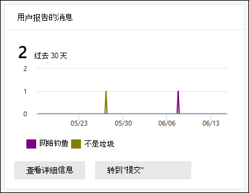

# 在 Microsoft 365 Defender 门户中查看电子邮件安全报告View email security reports in the Microsoft 365 Defender portal

[!INCLUDE [Microsoft 365 Defender rebranding](../includes/microsoft-defender-for-office.md)]

**适用对象****Applies to**
- [Exchange Online ProtectionExchange Online Protection](exchange-online-protection-overview.md)
- [Microsoft Defender for Office 365 计划 1 和计划 2Microsoft Defender for Office 365 plan 1 and plan 2](defender-for-office-365.md)
- [Microsoft 365 DefenderMicrosoft 365 Defender](../defender/microsoft-365-defender.md)

Microsoft 365 Defender 门户中提供了各种报告，可帮助你了解 Microsoft 365 中的电子邮件安全功能（如 Microsoft 365 中的反垃圾邮件、反恶意软件和加密功能）如何保护 <https://security.microsoft.com> 你的组织。A variety of reports are available in the Microsoft 365 Defender portal at <https://security.microsoft.com> to help you see how email security features, such as anti-spam, anti-malware, and encryption features in Microsoft 365 are protecting your organization. 如果你拥有 [必要的权限](#what-permissions-are-needed-to-view-these-reports)，可以在 Microsoft 365 Defender 门户中查看这些报告，方式为：查看报告电子邮件&协作 电子邮件& \>  \> **协作报告**。If you have the [necessary permissions](#what-permissions-are-needed-to-view-these-reports), you can view these reports in the Microsoft 365 Defender portal by going to **Reports** \> **Email & collaboration** \> **Email & collaboration reports**. 若要直接转到"电子邮件& **协作报告"** 页，请打开 <https://security.microsoft.com/emailandcollabreport> 。To go directly to the **Email & collaboration reports** page, open <https://security.microsoft.com/emailandcollabreport>.

> [!NOTE]
>
> "电子邮件和协作报告 **"&一些报告** 需要 Microsoft Defender for Office 365。Some of the reports on the **Email & collaboration reports** page require Microsoft Defender for Office 365. 有关这些报告的信息，请参阅在 [Microsoft 365](view-reports-for-mdo.md)Defender 门户中查看适用于 Office 365 的 Defender 报告。For information about these reports, see [View Defender for Office 365 reports in the Microsoft 365 Defender portal](view-reports-for-mdo.md).
>
> 与邮件流相关的报告现在位于 Exchange 管理中心 (EAC) 。Reports that are related to mail flow are now in the Exchange admin center (EAC). 有关这些报告详细信息，请参阅新 Exchange 管理中心 [中的邮件流报告](/exchange/monitoring/mail-flow-reports/mail-flow-reports)。For more information about these reports, see [Mail flow reports in the new Exchange admin center](/exchange/monitoring/mail-flow-reports/mail-flow-reports).

## 遭到入侵的用户报告Compromised users report

> [!NOTE]
> 此报告适用于具有 Exchange Online 邮箱的 Microsoft 365 组织。This report is available in Microsoft 365 organizations with Exchange Online mailboxes. 它不适用于独立 Exchange Online Protection (EOP) 组织。It's not available in standalone Exchange Online Protection (EOP) organizations.

"**遭到入侵的用户**"报告显示过去 7 天内标记为"可疑"或"受限"的用户帐户数量。The **Compromised users** report shows shows the number of user accounts that were marked as **Suspicious** or **Restricted** within the last 7 days. 其中任一状态的帐户存在问题，甚至受到威胁。Accounts in either of these states are problematic or even compromised. 通过频繁使用，可以使用报告来发现可疑或受限帐户的峰值甚至趋势。With frequent use, you can use the report to spot spikes, and even trends, in suspicious or restricted accounts. 有关遭到入侵的用户详细信息，请参阅响应遭到入侵 [的电子邮件帐户](responding-to-a-compromised-email-account.md)。For more information about compromised users, see [Responding to a compromised email account](responding-to-a-compromised-email-account.md).

聚合视图显示过去 90 天的数据，而详细信息视图显示最近 30 天的数据。The aggregate view shows data for the last 90 days and the detail view shows data for the last 30 days.

若要查看 Microsoft 365 Defender 门户中的报告，请转到报告电子邮件 \> **&协作** \> **电子邮件&报告**。To view the report in the Microsoft 365 Defender portal, go to **Reports** \> **Email & collaboration** \> **Email & collaboration reports**. 在 **"遭到入侵的用户"上**，单击 **"查看详细信息"。**On **Compromised users**, click **View details**. 若要直接转到报告，请打开 <https://security.microsoft.com/reports/CompromisedUsers> 。To go directly to the report, open <https://security.microsoft.com/reports/CompromisedUsers>.

单击"**查看详细信息**"后，可以通过单击"筛选器"，在出现的飞出视图中选择以下一个或多个值来筛选图表和详细信息表：After you click **View details**, you can filter both the chart and the details table by clicking **Filter** and selecting one or more of the following values in the flyout that appears:

- **DATE (UTC)**： **Start date** and **End date**.**Date (UTC)**: **Start date** and **End date**.
- **活动**：**Activity**:
  - **可疑**：用户帐户已发送可疑电子邮件，并且存在被限制发送电子邮件的风险。**Suspicious**: The user account has sent suspicious email and is at risk of being restricted from sending email.
  - **受限**：由于高度可疑的模式，已限制用户帐户发送电子邮件。**Restricted**: The user account has been restricted from sending email due to highly suspicious patterns.

完成筛选后，单击"应用 **"** 或"取消 **"。**When you're finished filtering, click **Apply** or **Cancel**.

在图表下面的表中，可以看到以下详细信息：In the table below the graph, you can see the following details:

- **创建时间****Creation time**
- **用户 ID****User ID**
- **Action****Action**

## Exchange 传输规则报告Exchange transport rule report

**Exchange 传输规则** 报告显示邮件流规则对组织中 (传输规则) 传入和传出邮件的影响。The **Exchange transport rule** report shows the effect of mail flow rules (also known as transport rules) on incoming and outgoing messages in your organization.

若要查看 Microsoft 365 Defender 门户中的报告，请转到报告电子邮件 \> **&协作** \> **电子邮件&报告**。To view the report in the Microsoft 365 Defender portal, go to **Reports** \> **Email & collaboration** \> **Email & collaboration reports**. 在 **"Exchange 传输规则"上**，单击"**查看详细信息"。**On **Exchange transport rule**, click **View details**. 若要直接转到报告，请打开 <https://security.microsoft.com/reports/ETRRuleReport> 。To go directly to the report, open <https://security.microsoft.com/reports/ETRRuleReport>.

单击" **查看详细信息"** 后，以下图表和数据可用：After you click **View details**, the following charts and data are available:

- **按 Exchange 传输规则查看数据** \>**按方向划分** 的图表细分：此图显示受邮件流规则影响的入站和出站邮件的数量。**View data by Exchange transport rules** \> **Chart breakdown by Direction**: This chart shows the number of **Inbound** and **Outbound** messages that were affected by mail flow rules.

- **按 Exchange 传输规则查看数据** \>**按严重性分类** 的图表：此图表显示高严重性、中等严重性和 **低严重性邮件的数量**。 **View data by Exchange transport rules** \> **Chart breakdown by Severity**: This chart shows the number of **High severity**, **Medium severity**, and **Low severity** messages. 将严重性级别设置为规则中的操作， (严重性级别审核此规则或 _SetAuditSeverity_) 。You set the severity level as an action in the rule (**Audit this rule with severity level** or _SetAuditSeverity_). 有关详细信息，请参阅 Mail [flow rule actions in Exchange Online。](/Exchange/security-and-compliance/mail-flow-rules/mail-flow-rule-actions)For more information, see [Mail flow rule actions in Exchange Online](/Exchange/security-and-compliance/mail-flow-rules/mail-flow-rule-actions).

- **按 DLP Exchange 传输规则查看数据** \>**按方向划分** 的图表细分：此图显示受DLP和邮件流规则中的数据丢失防护 (入站) 邮件的数量。**View data by DLP Exchange transport rules** \> **Chart breakdown by Direction**: This chart shows the number of **Inbound** and **Outbound** messages that were affected by data loss prevention (DLP) mail flow rules.

- **按 DLP Exchange 传输规则查看数据** \>**按严重性分类** 的图表：此视图显示受 DLP 邮件流规则影响的高严重性、中等严重性和低严重性邮件的数量。 **View data by DLP Exchange transport rules** \> **Chart breakdown by Severity**: This view shows the number of **High severity**, **Medium severity**, and **Low severity** messages that were affected by DLP mail flow rules.

对于 **"按 Exchange 传输规则** 查看数据"选项，下图下方的详细信息表中显示了以下信息：For **View data by Exchange transport rules** selections, the following information is shown in the details table below the graph:

- **Date****Date**
- **传输规则****Transport rule**
- **主题****Subject**
- **发件人地址****Sender address**
- **收件人地址****Recipient address**
- **严重性****Severity**
- **方向****Direction**

对于 **"按 DLP Exchange 传输规则** 查看数据"选项，下图下方的详细信息表中显示了以下信息：For **View data by DLP Exchange transport rules** selections, the following information is shown in the details table below the graph:

- **Date****Date**
- **DLP 策略****DLP policy**
- **传输规则****Transport rule**
- **主题****Subject**
- **发件人地址****Sender address**
- **收件人地址****Recipient address**
- **严重性****Severity**
- **方向****Direction**

通过单击"筛选器"，并选择出现的一个或多个以下值，可以筛选图表和详细信息表：You can filter both the chart and the details table by clicking **Filter** and selecting one or more of the following values in the flyout that appears:

- **开始日期和\*\*\*\*结束日期****Start date** and **End date**
- **方向**： **出站** 和 **入站****Direction**: **Outbound** and **Inbound**
- **严重性：\*\*\*\*高严重性**、**中等严重性** 和 **低严重性****Severity**: **High severity**, **Medium severity**, and **Low severity**

## 邮件流状态报告Mailflow status report

**邮件流状态** 报告是一个智能报告，它显示有关传入和传出电子邮件、垃圾邮件检测、恶意软件、标识为"良好"的电子邮件的信息，以及边缘上允许或阻止的电子邮件的信息。The **Mailflow status report** is a smart report that shows information about incoming and outgoing email, spam detections, malware, email identified as "good", and information about email allowed or blocked on the edge. 这是包含边缘保护信息的唯一报告，它显示了在 Exchange Online Protection (EOP) 允许进入服务之前阻止的电子邮件数。This is the only report that contains edge protection information, and shows just how much email is blocked before being allowed into the service for evaluation by Exchange Online Protection (EOP). 必须了解，如果将一封邮件发送给五个收件人，我们会将邮件计为五个不同的邮件，而不是一封邮件。It's important to understand that if a message is sent to five recipients we count it as five different messages and not one message.

若要查看 Microsoft 365 Defender 门户中的报告，请转到报告电子邮件 \> **&协作** \> **电子邮件&报告**。To view the report in the Microsoft 365 Defender portal, go to **Reports** \> **Email & collaboration** \> **Email & collaboration reports**. 在 **"邮件流状态摘要"上，** 单击"**查看详细信息"。**On **Mailflow status summary**, click **View details**. 若要直接转到报告，请打开 <https://security.microsoft.com/reports/mailflowStatusReport> 。To go directly to the report, open <https://security.microsoft.com/reports/mailflowStatusReport>.

### 邮件流状态报告的类型视图Type view for the Mailflow status report

打开报表时，默认情况下 **会选中** "类型"选项卡。When you open the report, the **Type** tab is selected by default. 默认情况下，此视图包含一个图表和一个使用以下筛选器配置的数据表：By default, this view contains a chart and a data table that's configured with the following filters:

- **日期**：最近 7 天。**Date**: The last 7 days.
- **邮件方向**：**Mail direction**:
  - **入站****Inbound**
  - **出站****Outbound**
  - **组织内部**：此计数用于租户内的邮件，即**Intra-org**: this count is for messages within a tenant i.e 发件人 abc@domain.com 发送到收件人的邮件 xyz@domain.com (与 **入站** 和出站邮件 **分开计算)**sender abc@domain.com sends to recipient xyz@domain.com  (counted separately from **Inbound** and **Outbound**)
- **类型**：**Type**:
  - **良好的邮件****Good mail**
  - **恶意软件****Malware**
  - **垃圾邮件****Spam**
  - **边缘保护****Edge protection**
  - **规则邮件****Rule messages**
  - **钓鱼电子邮件****Phishing email**
- **域**： **全部****Domain**: **All**

图表按 Type **值组织** 。The chart is organized by the **Type** values.

可以通过单击"筛选器 **"或单击** 图表图例中的值来更改这些筛选器。You can change these filters by clicking **Filter** or by clicking a value in the chart legend.

该数据表包含以下信息：The data table contains the following information:

- **方向****Direction**
- **类型****Type**
- **24 小时****24 hours**
- **3 天****3 days**
- **7 天****7 days**
- **15 天****15 days**
- **30 天****30 days**

If you click **Choose a category for more details**， you can select from the following values：If you click **Choose a category for more details**, you can select from the following values:

- **网络钓鱼电子邮件**：此选择将你带至 [威胁防护状态报告](view-email-security-reports.md#threat-protection-status-report)。**Phishing email**: This selection takes you to the [Threat protection status report](view-email-security-reports.md#threat-protection-status-report).
- **电子邮件中的恶意软件**：此选择将你带至 [威胁防护状态报告](view-email-security-reports.md#threat-protection-status-report)。**Malware in email**: This selection takes you to the [Threat protection status report](view-email-security-reports.md#threat-protection-status-report).
- **垃圾邮件检测**：此选择将你带至 [垃圾邮件检测报告](view-email-security-reports.md#spam-detections-report)。**Spam detections**: This selection takes you to the [Spam Detections report](view-email-security-reports.md#spam-detections-report).
- **边缘阻止的垃圾邮件**：此选择将你带至 [垃圾邮件检测报告](view-email-security-reports.md#spam-detections-report)。**Edge blocked spam**: This selection takes you to the [Spam Detections report](view-email-security-reports.md#spam-detections-report).

#### 从类型视图导出Export from Type view

对于详细信息视图，只能导出一天的数据。For the detail view, you can only export data for one day. 因此，如果要导出 7 天的数据，需要执行 7 种不同的导出操作。So, if you want to export data for 7 days, you need to do 7 different export actions.

每个导出.csv文件限制为 150，000 行。Each exported .csv file is limited to 150,000 rows. 如果当天的数据包含超过 150，000 行，则创建多个.csv文件。If the data for that day contains more than 150,000 rows, then multiple .csv files will be created.

### 邮件流状态报告的方向视图Direction view for the Mailflow status report

如果单击" **方向"** 选项卡，则使用"类型"视图中 **的相同** 默认筛选器。If you click the **Direction** tab, the same default filters from the **Type** view are used.

图表按 Direction **值** 组织。The chart is organized by **Direction** values.

可以通过单击"筛选器 **"或单击** 图表图例中的值来更改这些筛选器。You can change these filters by clicking **Filter** or by clicking a value in the chart legend. 使用"类型" **视图中的** 相同筛选器。The same filters from the **Type** view are used.

该数据表包含"类型"视图中 **的相同** 信息。The data table contains same information from the **Type** view.

" **选择类别"了解更多详细信息** 可用的选择和行为与"类型 **"视图相同** 。The **Choose a category for more details** available selections and behavior are the same as the **Type** view.

#### 从方向视图导出Export from Direction view

对于详细信息视图，只能导出一天的数据。For the detail view, you can only export data for one day. 因此，如果要导出 7 天的数据，需要执行 7 种不同的导出操作。So, if you want to export data for 7 days, you need to do 7 different export actions.

每个导出.csv文件限制为 150，000 行。Each exported .csv file is limited to 150,000 rows. 如果当天的数据包含超过 150，000 行，则创建多个.csv文件。If the data for that day contains more than 150,000 rows, then multiple .csv files will be created.

### 邮件流状态报告的漏斗视图Funnel view for the Mailflow status report

漏 **斗** 视图显示 Microsoft 的电子邮件威胁防护功能如何筛选组织中传入和传出的电子邮件。The **Funnel** view shows you how Microsoft's email threat protection features filter incoming and outgoing email in your organization. 它提供有关总电子邮件计数以及配置的威胁防护功能（包括边缘保护、反恶意软件、反网络钓鱼、反垃圾邮件和反欺骗）如何影响此计数的详细信息。It provides details on the total email count, and how the configured threat protection features, including edge protection, anti-malware, anti-phishing, anti-spam, and anti-spoofing affect this count.

如果单击" **漏斗"** 选项卡，默认情况下，此视图包含一个图表和一个使用以下筛选器配置的数据表：If you click the **Funnel** tab, by default, this view contains a chart and a data table that's configured with the following filters:

- **日期**：最近 7 天。**Date**: The last 7 days.

- **方向**：**Direction**:

  - **入站****Inbound**
  - **出站****Outbound**
  - **组织内部**：此计数用于租户内发送的邮件;即，发件人 abc@domain.com 收件人的邮件 xyz@domain.com (入站和出站邮件分开计算) 。**Intra-org**: This count is for messages sent within a tenant; i.e, sender abc@domain.com sends to recipient xyz@domain.com (counted separately from Inbound and Outbound).

聚合视图和数据表视图允许筛选 90 天。The aggregate view and data table view allow for 90 days of filtering.

如果单击 **"筛选器**"，可以同时筛选图表和数据表。If you click **Filter**, you can filter both the chart and the data table.

此图表显示按以下方式组织的电子邮件计数：This chart shows the email count organized by:

- **电子邮件总数****Total email**
- **边缘保护后的电子邮件****Email after edge protection**
- **传输规则之后的电子邮件 (** 邮件流规则) **Email after transport rule** (mail flow rule)
- **反恶意软件后的电子邮件， 文件信誉， 文件类型阻止****Email after anti-malware, file reputation, file type block**
- **反网络钓鱼后的电子邮件， URL 信誉， 品牌模拟， 反欺骗****Email after anti-phish, URL reputation, brand impersonation, anti-spoof**
- **反垃圾邮件、批量邮件筛选后的电子邮件****Email after anti-spam, bulk mail filtering**
- **用户和域模拟后的电子邮件**\***Email after user and domain impersonation**\*
- **文件和 URL 触发后的电子邮件**\***Email after file and URL detonation**\*
- **在传递后保护或 URL 单击时间保护 (检测为安全)****Email detected as benign after post-delivery protection (URL click time protection)**

\*仅 defender for Office 365\* Defender for Office 365 only

若要查看由 EOP 或 Defender 单独筛选的电子邮件Office 365，请单击图表图例中的值。To view the email filtered by EOP or Defender for Office 365 separately, click on the value in the chart legend.

该数据表包含以下信息，按降序日期顺序显示：The data table contains the following information, shown in descending date order:

- **Date****Date**
- **电子邮件总数****Total email**
- **边缘保护****Edge protection**
- **反恶意软件， 文件信誉， 文件类型阻止**：**Anti-malware, file reputation, file type block**:
  - **文件信誉**：由于其他 Microsoft 客户标识的附加文件而筛选的邮件。**File reputation**: Messages filtered due to identification of an attached file by other Microsoft customers.
  - **文件类型阻止**：由于邮件中标识的恶意文件类型而筛选的邮件。**File type block**: Messages filtered due to the type of malicious file identified in the message.
- **反网络钓鱼， URL 信誉， 品牌模拟， 反欺骗**：**Anti-phish, URL reputation, Brand impersonation, anti-spoof**:
  - **URL 信誉**：由于其他 Microsoft 客户标识的 URL 而筛选的邮件。**URL reputation**: Messages filtered due to the identification of the URL by other Microsoft customers.
  - **品牌模拟**：由于来自已知品牌模拟发件人的邮件而筛选的邮件。**Brand impersonation**: Messages filtered due to the message coming from well-known brand impersonating senders.
  - **反欺骗**：由于邮件试图欺骗收件人所属的域或邮件发件人不属于的域而筛选的邮件。**Anti-spoof**: Messages filtered due to the message attempting to spoof a domain that the recipient belongs to, or a domain that the message sender doesn't own.
- **反垃圾邮件，批量邮件筛选**：**Anti-spam, bulk mail filtering**:
  - **批量邮件筛选**：根据反垃圾邮件策略中的批量投诉级别 (BCL) 筛选的邮件。**Bulk mail filtering**: Messages filtered based on the bulk complain level (BCL) threshold in an anti-spam policy.
- **Defender for (的用户和Office 365) ：****User and domain impersonation (Defender for Office 365)**:
  - 用户模拟：由于尝试模拟用户 (邮件发件人) （在反网络钓鱼策略的模拟保护设置中定义）而筛选的邮件。**User impersonation**: Messages filtered due to an attempt to impersonate a user (message sender) that's defined in the impersonation protection settings of an anti-phishing policy.
  - **域模拟**：由于尝试模拟在反网络钓鱼策略的模拟保护设置中定义的域而筛选的邮件。**Domain impersonation**: Messages filtered due to an attempt to impersonate a domain that's defined in the impersonation protection settings of an anti-phishing policy.
- **Defender for (的文件和 URL Office 365) ：****File and URL detonation (Defender for Office 365)**:
  - **文件触发**：由附件策略保险箱的邮件。**File detonation**: Messages filtered by a Safe Attachments policy.
  - **URL 触发**：按链接策略保险箱的邮件。**URL detonation**: Message filtered by a Safe Links policy.
- 传递后保护和 **ZAP (ATP) 或 ZAP (EOP) ：** 零时差自动清除 (ZAP) 恶意软件、垃圾邮件和网络钓鱼。**Post-delivery protection and ZAP (ATP), or ZAP (EOP)**: Zero-hour auto purge (ZAP) for malware, spam, and phishing.

如果在数据表中选择一行，则电子邮件计数的进一步细分将显示在该飞出区中。If you select a row in the data table, a further breakdown of the email counts are shown in the flyout.

#### 从漏斗视图导出Export from Funnel view

单击"选项 **"** 下的 **"** 导出"后，可以选择下列值之一：After you click **Export** under **Options**, you can select one of the following values:

- **摘要 (最近 90 天的数据汇总)****Summary (with data for last 90 days at most)**
- **有关 (最近 30 天的数据的详细信息)****Details (with data for last 30 days at most)**

在 **"日期**"下，选择一个范围，然后单击"应用 **"。**Under **Date**, choose a range, and then click **Apply**. 当前筛选器的数据将导出到.csv文件中。Data for the current filters will be exported to a .csv file.

每个导出.csv文件限制为 150，000 行。Each exported .csv file is limited to 150,000 rows. 如果数据包含的行数超过 150，000，.csv文件。If the data contains more than 150,000 rows, then multiple .csv files will be created.

### 邮件流状态报告的技术视图Tech view for the Mailflow status report

" **技术"** 视图类似于漏 **斗视图** ，提供有关配置的威胁防护功能的更具体的详细信息。The **Tech view** is similar to the **Funnel** view, providing more granular details for the configured threat protections features. 从图中，你可以看到如何在威胁防护的不同阶段对邮件进行分类。From the chart, you can see how messages are categorized at the different stages of threat protection.

如果单击" **技术视图** "选项卡，默认情况下，此视图包含一个图表和一个使用以下筛选器配置的数据表：If you click the **Tech view** tab, by default, this view contains a chart and a data table that's configured with the following filters:

- **日期**：最近 7 天。**Date**: The last 7 days.

- **方向**：**Direction**:

  - **入站****Inbound**
  - **出站****Outbound**
  - **组织内部**：此计数用于租户内的邮件，即**Intra-org**: this count is for messages within a tenant i.e 发件人 abc@domain.com 发送到收件人的邮件 xyz@domain.com (与入站和出站邮件分开计数) sender abc@domain.com sends to recipient xyz@domain.com (counted separately from Inbound and Outbound)

聚合视图和数据表视图允许筛选 90 天。The aggregate view and data table view allow for 90 days of filtering.

如果单击 **"筛选器**"，可以同时筛选图表和数据表。If you click **Filter**, you can filter both the chart and the data table.

此图显示按以下类别组织的邮件：This chart shows messages organized into the following categories:

- **电子邮件总数****Total email**
- **边缘允许** 和 **边缘筛选****Edge allow** and **Edge filtered**
- **传输规则允许\*\*\*\*和传输规则筛选 (** 邮件流规则) **Transport rule allow** and **Transport rule filtered** (mail flow rules)
- **不是恶意软件\*\*\*\*、保险箱附件检测和** \* **反恶意软件引擎检测****Not malware**, **Safe Attachments detection**\*, and **Anti-malware engine detection**
- **非网络钓鱼\*\*\*\*、DMARC 失败**、**模拟检测** \* 、**欺骗检测和\*\*\*\*钓鱼检测****Not phish**, **DMARC failure**, **Impersonation detection**\*, **Spoof detection**, and **Phish detection**
- **无需检测 URL 触发和** **URL 触发检测**\***No detection with URL detonation** and **URL detonation detection**\*
- **不是垃圾邮件** 和  **垃圾邮件****Not spam** and  **Spam**
- **非恶意电子邮件\*\*\*\*、保险箱链接检测和** \* **ZAP****Non-malicious email**, **Safe Links detection**\*, and **ZAP**

\*Defender for Office 365\* Defender for Office 365

将鼠标悬停在图表中的类别上时，可以看到该类别中的消息数。When you hover over a category in the chart, you can see the number of messages in that category.

该数据表包含以下信息，按降序日期顺序显示：The data table contains the following information, shown in descending date order:

- **Date****Date**
- **电子邮件总数****Total email**
- **已筛选边缘****Edge filtered**
- **规则邮件**：由于邮件流规则而筛选 (也称为传输规则) 。**Rule messages**: Messages filtered due to  mail flow rules (also known as transport rules).
- **反恶意软件引擎** **，保险箱附件** \* ：**Anti-malware engine**, **Safe Attachments**\*:
- **DMARC， 模拟** \* ，**欺骗**，**网络钓鱼筛选**：**DMARC, impersonation**\*, **spoof**, **phish filtered**:
  - **DMARC：** 由于邮件未通过 DMARC 身份验证检查而筛选的邮件。**DMARC**: Messages filtered due to the message failing its DMARC authentication check.
- **URL 触发检测**\***URL detonation detection**\*
- **已筛选反垃圾邮件****Anti-spam filtered**
- **ZAP 已删除****ZAP removed**
- **按链接保险箱检测**\***Detection by Safe Links**\*

\*Defender for Office 365\* Defender for Office 365

如果在数据表中选择一行，则电子邮件计数的进一步细分将显示在该飞出区中。If you select a row in the data table, a further breakdown of the email counts are shown in the flyout.

#### "从技术导出"视图Export from Tech view

单击" **导出"，** 在" **选项** "下，可以选择下列值之一：On clicking **Export**, under **Options** you can select one of the following values:

- **摘要 (最近 90 天的数据汇总)****Summary (with data for last 90 days at most)**
- **有关 (最近 30 天的数据的详细信息)****Details (with data for last 30 days at most)**

在 **"日期**"下，选择一个范围，然后单击"应用 **"。**Under **Date**, choose a range, and then click **Apply**. 当前筛选器的数据将导出到.csv文件中。Data for the current filters will be exported to a .csv file.

每个导出.csv文件限制为 150，000 行。Each exported .csv file is limited to 150,000 rows. 如果数据包含的行数超过 150，000，.csv文件。If the data contains more than 150,000 rows, then multiple .csv files will be created.

## 恶意软件检测报告Malware detections report

恶意软件 **检测报告显示** 有关传入和传出电子邮件中的恶意软件检测信息， (EOP Exchange Online Protection检测到的) 。The **Malware detections report** report shows information about malware detections in incoming and outgoing email messages (malware detected by Exchange Online Protection or EOP). 有关 EOP 中的恶意软件保护详细信息，请参阅 [EOP 中的反恶意软件保护](anti-malware-protection.md)。For more information about malware protection in EOP, see [Anti-malware protection in EOP](anti-malware-protection.md).

聚合视图筛选器允许 90 天，而详细信息表筛选器仅允许 10 天。The aggregate view filter allows for 90 days, while the details table filter only allows for 10 days.

To view the report in the Microsoft 365 Defender portal， go to **Reports** \> **Email & Email** & collaboration \> **reports**.To view the report in the Microsoft 365 Defender portal, go to **Reports** \> **Email & collaboration** \> **Email & collaboration reports**. 在 **电子邮件中检测到的恶意软件上**，单击 **查看详细信息**。On **Malware detected in email**, click **View details**. 若要直接转到报告，请打开 <https://security.microsoft.com/reports/MalwareDetections> 。To go directly to the report, open <https://security.microsoft.com/reports/MalwareDetections>.

单击" **查看详细信息"** 后，可以通过单击"筛选器"并选择以下选项来筛选图表 **和详细信息表** ：After you click **View details**, you can filter both the chart and the details table by clicking **Filter** and selecting:

- **Date**： **开始日期** 和 **结束日期****Date**: **Start date** and **End date**
- **方向**：**入站\*\*\*\*和出站****Direction**: **Inbound** and **Outbound**

在图表下面的详细信息表中，可以看到以下详细信息：In the details table below the graph, you can see the following details:

- **Date****Date**
- **发件人地址****Sender address**
- **收件人地址****Recipient address**
- **邮件 ID：** 在邮件 **头的 Message-ID** 头字段中可用，并且应该是唯一的。**Message ID**: Available in the **Message-ID** header field in the message header and should be unique. 示例值是 `<08f1e0f6806a47b4ac103961109ae6ef@server.domain>` (尖括号) 。An example value is `<08f1e0f6806a47b4ac103961109ae6ef@server.domain>` (note the angle brackets).
- **主题****Subject**
- **Filename****Filename**
- **恶意软件名称****Malware name**

## 邮件延迟报告Mail latency report

Defender **for** Office 365 中的邮件延迟报告包含有关组织中遇到的邮件传递和触发延迟的信息。The **Mail latency report** in Defender for Office 365 contains information on the mail delivery and detonation latency experienced within your organization. 有关详细信息，请参阅邮件 [延迟报告](view-reports-for-mdo.md#mail-latency-report)。For more information, see [Mail latency report](view-reports-for-mdo.md#mail-latency-report).

## 垃圾邮件检测报告Spam detections report

> [!NOTE]
> 垃圾邮件 **检测报告将于** 2021 年 6 月 30 日消失。The **Spam detections report** will go away on June 30, 2021. 威胁防护状态报告中提供了 [相同的信息](#threat-protection-status-report)。The same information is available in the [Threat protection status report](#threat-protection-status-report).

## 欺骗检测报告Spoof detections report

> [!NOTE]
> 本文中所述的改进的欺骗检测报告在预览版中，可能会更改，并且并非在所有组织中都可用。The improved Spoof detections report as described in this article is in Preview, is subject to change, and is not available in all organizations. 较旧版本的报告只显示"**良好邮件"和**"**捕获为垃圾邮件"。**The older version of the report shows only **Good mail** and **Caught as spam**.

欺骗 **检测报告显示** 有关由于欺骗被阻止或允许的邮件的信息。The **Spoof detections** report shows information about messages that were blocked or allowed due to spoofing. 有关欺骗功能详细信息，请参阅 [EOP 中的反欺骗保护](anti-spoofing-protection.md)。For more information about spoofing, see [Anti-spoofing protection in EOP](anti-spoofing-protection.md).

报告聚合视图允许筛选 45 天，而详细信息视图仅 \* 允许筛选 10 天。The aggregate view of the report allows for 45 days of filtering\*, while the detail view only allows for ten days of filtering.

\* 最终，你将能够使用最多 90 天的筛选。\* Eventually, you'll be able to use up to 90 days of filtering.

To view the report in the Microsoft 365 Defender portal， go to **Reports** \> **Email & Email** & collaboration \> **reports**.To view the report in the Microsoft 365 Defender portal, go to **Reports** \> **Email & collaboration** \> **Email & collaboration reports**. 在 **"欺骗检测"上**，单击 **"查看详细信息"。**On **Spoof detections**, click **View details**. 若要直接转到报告，请打开 <https://security.microsoft.com/reports/SpoofMailReportV2> 。To go directly to the report, open <https://security.microsoft.com/reports/SpoofMailReportV2>.

当您将鼠标悬停在 (中) 的数据点时，可以看到检测到的欺骗邮件的个个和原因。When you hover over a day (data point) in the chart, you can see how many spoofed messages were detected and why.

单击"**查看详细信息**"后，可以通过单击"筛选器"并选择以下一个或多个值来筛选图表和详细信息表：After you click **View details**, you can filter both the chart and the details table by clicking **Filter** and selecting one or more of the following values:

- **Date**： **开始日期** 和 **结束日期****Date**: **Start date** and **End date**
- **结果**：**Result**:
  - **Pass****Pass**
  - **失败****Fail**
  - **SoftPass****SoftPass**
  - **无****None**
  - **其他****Other**
- **欺骗类型**：**内部和外部****Spoof type**: **Internal** and **External**

在图表下面的表中，可以看到以下详细信息：In the table below the graph, you can see the following details:

- **Date****Date**
- **欺骗用户****Spoofed user**
- **发送基础结构****Sending infrastructure**
- **欺骗类型****Spoof type**
- **结果****Result**
- **结果代码****Result code**
- **SPF****SPF**
- **DKIM****DKIM**
- **DMARC****DMARC**
- **邮件计数****Message count**

有关复合身份验证结果代码详细信息，请参阅邮件中的[反垃圾邮件Microsoft 365。](anti-spam-message-headers.md)For more information about composite authentication result codes, see [Anti-spam message headers in Microsoft 365](anti-spam-message-headers.md).

## 威胁防护状态报告Threat protection status report

威胁 **防护状态报告** 在 EOP 和 Defender for Office 365;但是，报告包含不同的数据。The **Threat protection status** report is available in both EOP and Defender for Office 365; however, the reports contain different data. 例如，EOP 客户可以查看有关电子邮件中检测到的恶意软件的信息，但不能查看有关 SharePoint、OneDrive 和 Microsoft Teams 的 保险箱 附件检测到的恶意[文件的信息](mdo-for-spo-odb-and-teams.md)。For example, EOP customers can view information about malware detected in email, but not information about malicious files detected by [Safe Attachments for SharePoint, OneDrive, and Microsoft Teams](mdo-for-spo-odb-and-teams.md).

该报告提供包含恶意内容的电子邮件（如反恶意软件引擎阻止的文件或网站地址 (URL) 、零时差自动清除[ (ZAP) ](zero-hour-auto-purge.md)和 Defender 等 Office 365 功能（如 保险箱[链接](safe-links.md)[、保险箱](safe-attachments.md)附件和防钓鱼策略中的模拟保护功能）的计数。 The report provides the count of email messages with malicious content, such as files or website addresses (URLs) that were blocked by the anti-malware engine, [zero-hour auto purge (ZAP)](zero-hour-auto-purge.md), and Defender for Office 365 features like [Safe Links](safe-links.md), [Safe Attachments](safe-attachments.md), and [impersonation protection features in anti-phishing policies](set-up-anti-phishing-policies.md#exclusive-settings-in-anti-phishing-policies-in-microsoft-defender-for-office-365). 您可以使用此信息来确定趋势或确定组织策略是否需要调整。You can use this information to identify trends or determine whether organization policies need adjustment.

**注意**：如果邮件发送给五个收件人，则我们将邮件计为五个不同的邮件，而不是一封邮件，了解这一点很重要。**Note**: It's important to understand that if a message is sent to five recipients we count it as five different messages and not one message.

To view the report in the Microsoft 365 Defender portal， go to **Reports** \> **Email & Email** & collaboration \> **reports**.To view the report in the Microsoft 365 Defender portal, go to **Reports** \> **Email & collaboration** \> **Email & collaboration reports**. 在 **"威胁防护状态"上**，单击 **"查看详细信息"。**On **Threat protection status**, click **View details**. 若要直接转到报告，请打开以下 URL 之一：To go directly to the report, open one of the following URLs:

- Defender for Office 365：<https://security.microsoft.com/reports/TPSAggregateReportATP>Defender for Office 365: <https://security.microsoft.com/reports/TPSAggregateReportATP>
- EOP： <https://security.microsoft.com/reports/TPSAggregateReport>EOP: <https://security.microsoft.com/reports/TPSAggregateReport>

默认情况下，单击"查看 **详细信息"后**，图表将显示过去 7 天的数据。By default, after you click **View details**, the chart shows data for the past 7 days. 如果单击 **"筛选**"，可以选择 90 天的日期范围 (试用版订阅可能限制为 30) 。If you click **Filter**, you can select a 90 day date range (trial subscriptions might be limited to 30 days). 详细信息表允许筛选 30 天。The details table allows filtering for 30 days.

以下各节介绍了可用的视图。The available views are described in the following sections.

### 按概述查看数据View data by Overview

在 **"按概述查看数据"** 视图中，图表中显示了以下检测信息：In the **View data by Overview** view, the following detection information is shown in the chart:

- **电子邮件恶意软件****Email malware**
- **电子邮件钓鱼邮件****Email phish**
- **内容恶意软件****Content malware**

图表下方没有详细信息表。No details table is available below the chart.

如果单击 **"筛选器"，** 则以下筛选器可用：If you click **Filter**, the following filters are available:

- **Date**： **开始日期** 和 **结束日期****Date**: **Start date** and **End date**
- **检测**：**电子邮件恶意软件\*\*\*\*、电子邮件钓鱼** 邮件或 **内容恶意软件****Detection**: **Email malware**, **Email phish**, or **Content malware**
- **受保护\*\*\*\*：MDO** (Defender for Office 365) **或 EOP****Protected by**: **MDO** (Defender for Office 365) or **EOP**
- **Tag**：按应用了指定用户标记的用户或组筛选结果 (包括优先级帐户) 。**Tag**: Filter the results by users or groups that have had the specified user tag applied (including priority accounts). 有关用户标记详细信息，请参阅用户 [标记](user-tags.md)。For more information about user tags, see [User tags](user-tags.md).
- **方向****Direction**
- **域****Domain**
- **策略类型****Policy type**

配置完筛选器后，请单击"应用"、"**取消**"或"清除 **筛选器"。**When you're finished configuring the filters, click **Apply**, **Cancel**, or **Clear filters**.

### 通过电子邮件钓鱼查看 \> 数据，按检测技术查看图表细目View data by Email \> Phish and Chart breakdown by Detection Technology

在" **通过电子邮件查看数据" \>** 和"按检测技术查看图表细分 **"** 视图中，图表中显示了以下信息：In the **View data by Email \> Phish** and **Chart breakdown by Detection Technology** view, the following information is shown in the chart:

- **URL 恶意信誉** \* ：来自 Defender 的恶意 URL 信誉Office 365客户的其他Microsoft 365触发。**URL malicious reputation**\*: Malicious URL reputation generated from Defender for Office 365 detonations in other Microsoft 365 customers.
- **高级筛选器**：基于机器学习的网络钓鱼信号。**Advanced filter**: Phishing signals based on machine learning.
- **常规筛选器**：基于分析员规则的网络钓鱼信号。**General filter**: Phishing signals based on analyst rules.
- **欺骗组织内部**：发件人正在尝试欺骗收件人域。**Spoof intra-org**: Sender is trying to spoof the recipient domain.
- **欺骗外部域**：发件人正在尝试欺骗某些其他域。**Spoof external domain**: Sender is trying to spoof some other domain.
- **欺骗 DMARC：** 邮件上的 DMARC 身份验证失败。**Spoof DMARC**: DMARC authentication failure on messages.
- **模拟品牌**：模拟基于发件人的已知品牌。**Impersonation brand**: Impersonation of well-known brands based on senders.
- **混合分析检测****Mixed analysis detection**
- **文件信誉****File reputation**
- **指纹匹配****Fingerprint matching**
- **URL 触发信誉**\***URL detonation reputation**\*
- **URL 触发**\***URL detonation**\*
- **模拟用户**\***Impersonation user**\*
- **模拟域** \* ：模拟客户拥有或定义的域。**Impersonation domain**\*: Impersonation of domains that the customer owns or defines.
- **邮箱智能模拟** \* ：模拟由管理员定义或通过邮箱智能学习的用户。**Mailbox intelligence impersonation**\*: Impersonation of users defined by admin or learned through mailbox intelligence.
- **文件触发**\***File detonation**\*
- **宣传活动**\***Campaign**\*

在图表下面的详细信息表中，提供了以下信息：In the details table below the chart, the following information is available:

- **Date****Date**
- **主题****Subject**
- **发件人****Sender**
- **Recipients****Recipients**
- **检测者****Detected by**
- **传递状态****Delivery Status**
- **泄露来源****Source of Compromise**
- **Tags****Tags**

如果单击 **"筛选器"，** 则以下筛选器可用：If you click **Filter**, the following filters are available:

- **Date**： **开始日期** 和 **结束日期****Date**: **Start date** and **End date**
- **检测****Detection**
- **受保护\*\*\*\*：MDO** (Defender for Office 365) **或 EOP****Protected by**: **MDO** (Defender for Office 365) or **EOP**
- **方向****Direction**
- **Tag**：按应用了指定用户标记的用户或组筛选结果 (包括优先级帐户) 。**Tag**: Filter the results by users or groups that have had the specified user tag applied (including priority accounts). 有关用户标记详细信息，请参阅用户 [标记](user-tags.md)。For more information about user tags, see [User tags](user-tags.md).
- **域****Domain**
- **策略类型****Policy type**
- **策略名称** (详细信息表) **Policy name** (details table only)
- **收件人****Recipients**

配置完筛选器后，请单击"应用"、"**取消**"或"清除 **筛选器"。**When you're finished configuring the filters, click **Apply**, **Cancel**, or **Clear filters**.

### 按电子邮件恶意软件查看 \> 数据，按检测技术查看图表细目View data by Email \> Malware and Chart breakdown by Detection Technology

在" **通过电子邮件查看数据 \> "和** "按检测技术查看图表细分 **"** 视图中，图表中显示了以下信息：In the **View data by Email \> Malware** and **Chart breakdown by Detection Technology** view, the following information is shown in the chart:

- **文件触发** \* ：按附件保险箱检测。**File detonation**\*: Detection by Safe Attachments.
- **文件触发信誉** \* ：Defender 为安全触发生成的所有恶意Office 365信誉。**File detonation reputation**\*: All malicious file reputation generated by Defender for Office 365 detonations.
- **文件信誉****File reputation**
- **反恶意软件引擎** \* ：来自反恶意软件引擎的检测。**Anti-malware engine**\*: Detection from anti-malware engines.
- **反恶意软件策略文件类型阻止**：这些是由于邮件中标识的恶意文件类型而筛选掉的电子邮件。**Anti-malware policy file type block**: These are email messages filtered out due to the type of malicious file identified in the message.
- **URL 恶意声誉****URL malicious reputation**
- **URL 设置****URL detonation**
- **URL 组织的信誉****URL detonation reputation**
- **市场活动****Campaign**

在图表下面的详细信息表中，提供了以下信息：In the details table below the chart, the following information is available:

- **Date****Date**
- **主题****Subject**
- **发件人****Sender**
- **Recipients****Recipients**
- **检测者****Detected by**
- **传递状态****Delivery Status**
- **泄露来源****Source of Compromise**
- **Tags****Tags**

如果单击 **"筛选器"，** 则以下筛选器可用：If you click **Filter**, the following filters are available:

- **Date**： **开始日期** 和 **结束日期****Date**: **Start date** and **End date**
- **检测****Detection**
- **受保护\*\*\*\*：MDO** (Defender for Office 365) **或 EOP****Protected by**: **MDO** (Defender for Office 365) or **EOP**
- **方向****Direction**
- **Tag**：按应用了指定用户标记的用户或组筛选结果 (包括优先级帐户) 。**Tag**: Filter the results by users or groups that have had the specified user tag applied (including priority accounts). 有关用户标记详细信息，请参阅用户 [标记](user-tags.md)。For more information about user tags, see [User tags](user-tags.md).
- **域****Domain**
- **策略类型****Policy type**
- **策略名称** (详细信息表) **Policy name** (details table only)
- **收件人****Recipients**

配置完筛选器后，请单击"应用"、"**取消**"或"清除 **筛选器"。**When you're finished configuring the filters, click **Apply**, **Cancel**, or **Clear filters**.

### 按策略类型和通过电子邮件查看数据或通过电子邮件恶意软件 \> 查看数据的图表 \> 细分Chart breakdown by Policy type and View data by Email \> Phish or View data by Email \> Malware

在 **"按策略类型划分** 的图表细分"和 **" \>** 通过电子邮件查看数据"或"通过电子邮件查看恶意软件数据"视图中，图表中显示了以下信息： **\>**In the **Chart breakdown by Policy type** and **View data by Email \> Phish** or **View data by Email \> Malware** views, the following information is shown in the charts:

- **反恶意软件****Anti-malware**
- **保险箱附件**\***Safe Attachments**\*
- **防钓鱼****Anti-phish**
- **反垃圾邮件****Anti-spam**
- **邮件流规则** (也称为传输规则) **Mail flow rule** (also known as a transport rule)
- **其他****Others**

在图表下面的详细信息表中，提供了以下信息：In the details table below the chart, the following information is available:

- **Date****Date**
- **主题****Subject**
- **发件人****Sender**
- **Recipients****Recipients**
- **检测者****Detected by**
- **传递状态****Delivery Status**
- **泄露来源****Source of Compromise**
- **Tags****Tags**

如果单击 **"筛选器"，** 则以下筛选器可用：If you click **Filter**, the following filters are available:

- **Date**： **开始日期** 和 **结束日期****Date**: **Start date** and **End date**
- **检测****Detection**
- **受保护\*\*\*\*：MDO** (Defender for Office 365) **或 EOP****Protected by**: **MDO** (Defender for Office 365) or **EOP**
- **方向****Direction**
- **Tag**：按应用了指定用户标记的用户或组筛选结果 (包括优先级帐户) 。**Tag**: Filter the results by users or groups that have had the specified user tag applied (including priority accounts). 有关用户标记详细信息，请参阅用户 [标记](user-tags.md)。For more information about user tags, see [User tags](user-tags.md).
- **域****Domain**
- **策略类型****Policy type**
- **策略名称** (详细信息表) **Policy name** (details table only)
- **收件人****Recipients**

配置完筛选器后，请单击"应用"、"**取消**"或"清除 **筛选器"。**When you're finished configuring the filters, click **Apply**, **Cancel**, or **Clear filters**.

### 按传递状态和通过电子邮件查看数据或通过电子邮件恶意软件 \> 查看数据的图表 \> 细分Chart breakdown by Delivery status and View data by Email \> Phish or View data by Email \> Malware

在 **"按传递状态分类"** 和 **" \>** 通过电子邮件查看数据"或"通过电子邮件查看恶意软件数据"视图中，图表中显示了以下信息： **\>**In the **Chart breakdown by Delivery status** and **View data by Email \> Phish** or **View data by Email \> Malware** views, the following information is shown in the charts:

- **托管邮箱：收件箱****Hosted mailbox: Inbox**
- **托管邮箱：垃圾邮件****Hosted mailbox: Junk**
- **托管邮箱：自定义文件夹****Hosted mailbox: Custom folder**
- **托管邮箱：已删除项目****Hosted mailbox: Deleted items**
- **转发****Forwarded**
- **本地服务器：已传递****On-premises server: Delivered**
- **隔离****Quarantine**
- **传递失败****Delivery failed**
- **已丢弃****Dropped**

在图表下面的详细信息表中，提供了以下信息：In the details table below the chart, the following information is available:

- **Date****Date**
- **主题****Subject**
- **发件人****Sender**
- **Recipients****Recipients**
- **检测者****Detected by**
- **传递状态****Delivery Status**
- **泄露来源****Source of Compromise**
- **Tags****Tags**

如果单击 **"筛选器"，** 则以下筛选器可用：If you click **Filter**, the following filters are available:

- **Date**： **开始日期** 和 **结束日期****Date**: **Start date** and **End date**
- **检测****Detection**
- **受保护\*\*\*\*：MDO** (Defender for Office 365) **或 EOP****Protected by**: **MDO** (Defender for Office 365) or **EOP**
- **方向****Direction**
- **Tag**：按应用了指定用户标记的用户或组筛选结果 (包括优先级帐户) 。**Tag**: Filter the results by users or groups that have had the specified user tag applied (including priority accounts). 有关用户标记详细信息，请参阅用户 [标记](user-tags.md)。For more information about user tags, see [User tags](user-tags.md).
- **域****Domain**
- **策略类型****Policy type**
- **策略名称** (详细信息表) **Policy name** (details table only)
- **收件人****Recipients**

配置完筛选器后，请单击"应用"、"**取消**"或"清除 **筛选器"。**When you're finished configuring the filters, click **Apply**, **Cancel**, or **Clear filters**.

### 按内容恶意软件查看 \> 数据View data by Content \> Malware

在 **"按内容恶意软件查看 \>** 数据"视图中，以下信息显示在 Microsoft Defender for Office 365图表中：In the **View data by Content \> Malware** view, the following information is shown in the chart for Microsoft Defender for Office 365 organizations:

- **反恶意软件引擎**：Sharepoint、OneDrive 和 Microsoft Teams 中内置的病毒检测 [检测到的恶意](virus-detection-in-spo.md)Microsoft 365。**Anti-malware engine**: Malicious files detected in Sharepoint, OneDrive, and Microsoft Teams by the [built-in virus detection in Microsoft 365](virus-detection-in-spo.md).
- **文件触发**：附件检测到的恶意保险箱 [文件SharePoint、OneDrive和Microsoft Teams。](mdo-for-spo-odb-and-teams.md)**File detonation**: Malicious files detected by [Safe Attachments for SharePoint, OneDrive, and Microsoft Teams](mdo-for-spo-odb-and-teams.md).

在图表下面的详细信息表中，提供了以下信息：In the details table below the chart, the following information is available:

- **Date**： **开始日期** 和 **结束日期****Date**: **Start date** and **End date**
- **位置****Location**
- **检测者****Detected by**
- **恶意软件名称****Malware name**

如果单击 **"筛选器"，** 则以下筛选器可用：If you click **Filter**, the following filters are available:

- **Date**： **开始日期** 和 **结束日期****Date**: **Start date** and **End date**
- **检测\*\*\*\*：反恶意软件引擎** 或 **文件触发****Detection**: **Anti-malware engine** or **File detonation**

配置完筛选器后，请单击"应用"、"**取消**"或"清除 **筛选器"。**When you're finished configuring the filters, click **Apply**, **Cancel**, or **Clear filters**.

### 按系统覆盖查看数据View data by System override

在" **按系统覆盖查看数据"视图中** ，图表中显示了以下替代原因信息：In the **View data by System override** view, the following override reason information is shown in the chart:

- **本地跳过****On-premises skip**
- **IP 允许****IP allow**
- **Exchange邮件传输规则 (** 邮件流规则) **Exchange mail transport rule** (mail flow rule)
- **组织允许的发件人****Organization allowed senders**
- **组织允许的域****Organization allowed domains**
- **ZAP 未启用****ZAP not enabled**
- **未启用垃圾邮件文件夹****Junk Mail folder not enabled**
- **用户保险箱发件人****User Safe Sender**
- **用户保险箱域****User Safe Domain**

在图表下面的详细信息表中，提供了以下信息：In the details table below the chart, the following information is available:

- **Date****Date**
- **主题****Subject**
- **发件人****Sender**
- **Recipients****Recipients**
- **检测者****Detected by**
- **传递状态****Delivery Status**
- **泄露来源****Source of Compromise**
- **Tags****Tags**

如果单击 **"筛选器"，** 则以下筛选器可用：If you click **Filter**, the following filters are available:

- **Date**： **开始日期** 和 **结束日期****Date**: **Start date** and **End date**
- **检测****Detection**
- **受保护\*\*\*\*：MDO** (Defender for Office 365) **或 EOP****Protected by**: **MDO** (Defender for Office 365) or **EOP**
- **方向****Direction**
- **Tag**：按应用了指定用户标记的用户或组筛选结果 (包括优先级帐户) 。**Tag**: Filter the results by users or groups that have had the specified user tag applied (including priority accounts). 有关用户标记详细信息，请参阅用户 [标记](user-tags.md)。For more information about user tags, see [User tags](user-tags.md).
- **域****Domain**
- **策略类型****Policy type**
- **策略名称** (详细信息表) **Policy name** (details table only)
- **收件人****Recipients**

配置完筛选器后，请单击"应用"、"**取消**"或"清除 **筛选器"。**When you're finished configuring the filters, click **Apply**, **Cancel**, or **Clear filters**.

\*仅 defender for Office 365\* Defender for Office 365 only

## 热门恶意软件报告Top malware report

" **热门恶意软件** "报告显示 [EOP](anti-malware-protection.md)中的反恶意软件保护检测到的各种恶意软件。The **Top malware** report shows the various kinds of malware that was detected by [anti-malware protection in EOP](anti-malware-protection.md).

To view the report in the Microsoft 365 Defender portal， go to **Reports** \> **Email & Email** & collaboration \> **reports**.To view the report in the Microsoft 365 Defender portal, go to **Reports** \> **Email & collaboration** \> **Email & collaboration reports**. 在 **"热门恶意软件"** 上，单击 **"查看详细信息"。**On **Top malware**, click **View details**. 若要直接转到报告，请打开 <https://security.microsoft.com/reports/TopMalware> 。To go directly to the report, open <https://security.microsoft.com/reports/TopMalware>.

当您将鼠标悬停在饼图中的一个浮点上时，可以看到某种恶意软件的名称，以及检测到具有该恶意软件的邮件数。When you hover over a wedge in the pie chart, you can see the name of a kind of malware and how many messages were detected as having that malware.

单击" **查看详细信息"** 后，报表页上将显示饼图的较大版本。图表下面的详细信息表显示以下信息：After you click **View details**, a larger version of the pie chart is displayed on the report page.The details table below the chart shows the following information:

- **热门恶意软件****Top malware**
- **Count****Count**

If you click **Filter**， you can specify a date range with **Start date** and **End date**.If you click **Filter**, you can specify a date range with **Start date** and **End date**.

## URL 威胁防护报告URL threat protection report

Microsoft Defender for Office 365 中提供了 **URL** 威胁防护报告。The **URL threat protection report** is available in Microsoft Defender for Office 365. 有关详细信息，请参阅 [URL 威胁防护报告](view-reports-for-mdo.md#url-threat-protection-report)。For more information, see [URL threat protection report](view-reports-for-mdo.md#url-threat-protection-report).

## 用户报告的邮件报告User reported messages report

> [!IMPORTANT]
> 为了使用户 **报告的消息** 报告正常工作，必须为用户报告的环境启用Microsoft 365日志记录。In order for the **User reported messages** report to work correctly, **audit logging must be turned on** for your Microsoft 365 environment. 通常是由在 Exchange Online 中分配为审核日志的角色执行。This is typically done by someone who has the Audit Logs role assigned in Exchange Online. 有关详细信息，请参阅打开[Microsoft 365 审核日志或关闭搜索](../../compliance/turn-audit-log-search-on-or-off.md)。For more information, see [Turn Microsoft 365 audit log search on or off](../../compliance/turn-audit-log-search-on-or-off.md).

用户 **报告的邮件** 报告显示有关用户使用报告邮件外接程序或报告网络钓鱼外接程序报告为垃圾邮件、网络钓鱼尝试或良好邮件 [的电子邮件的信息](enable-the-report-phish-add-in.md)。 The **User reported messages** report shows information about email messages that users have reported as junk, phishing attempts, or good mail by using the [Report Message add-in](enable-the-report-message-add-in.md) or the [Report Phishing add-in](enable-the-report-phish-add-in.md).

To view the report in the Microsoft 365 Defender portal， go to **Reports** \> **Email & collaboration** Email & \> **reports** User \> **reported messages**.To view the report in the Microsoft 365 Defender portal, go to **Reports** \> **Email & collaboration** \>**Email & collaboration reports** \> **User reported messages**. 在 **"用户报告的邮件"上**，单击 **"查看详细信息"。**On **User reported messages**, click **View details**. 若要直接转到报告，请打开 <https://security.microsoft.com/reports/userSubmissionReport> 。To go directly to the report, open <https://security.microsoft.com/reports/userSubmissionReport>. 若要转到管理 [门户中的管理员Microsoft 365 Defender，请单击](admin-submission.md)**"转到提交"。**To go to [admin submissions in the Microsoft 365 Defender portal](admin-submission.md), click **Go to Submissions**.

单击"**查看详细信息**"后，可以通过单击"筛选器"，在出现的飞出视图中选择以下一个或多个值来筛选图表和详细信息表：After you click **View details**, you can filter both the chart and the details table by clicking **Filter** and selecting one or more of the following values in the flyout that appears:

- **报告的日期\*\*\*\*：开始时间和\*\*\*\*结束时间****Date reported**: **Start time** and **End time**
- **报告者****Reported by**
- **电子邮件主题****Email subject**
- **邮件报告 ID****Message reported ID**
- **网络消息 ID****Network Message ID**
- **Sender****Sender**
- **报告的原因****Reported reason**
  - **非垃圾邮件****Not junk**
  - **网络钓鱼****Phish**
  - **垃圾邮件****Spam**
- **网络钓鱼模拟**： **是** 或 **否****Phish simulation**: **Yes** or **No**

配置完筛选器后，请单击"应用"、"**取消**"或"清除 **筛选器"。**When you're finished configuring the filters, click **Apply**, **Cancel**, or **Clear filters**.

若要对条目进行分组，请单击 **"分组** "，然后从下拉列表中选择下列值之一：To group the entries, click **Group** and select one of the following values from the drop down list:

- **无****None**
- **原因****Reason**
- **Sender****Sender**
- **报告者****Reported by**
- **重新扫描结果****Rescan result**
- **网络钓鱼模拟****Phish simulation**

在图表下面的表中，可以看到以下详细信息：In the table below the graph, you can see the following details:

- **电子邮件主题****Email subject**
- **报告者****Reported by**
- **报告的日期****Date reported**
- **Sender****Sender**
- **报告的原因****Reported reason**
- **重新扫描结果****Rescan result**
- **Tags****Tags**

若要将邮件提交给 Microsoft 进行分析，请从表中选择邮件条目，单击"提交给 **Microsoft** 进行分析"，然后从下拉列表中选择下列值之一：To submit a message to Microsoft for analysis, select the message entry from the table, click **Submit to Microsoft for analysis** and then select one of the following values from the drop down list:

- **报告干净****Report clean**
- **报告网络钓鱼****Report phishing**
- **报告恶意软件****Report malware**
- **报告垃圾邮件**'**Report spam**'
- **触发 Defender** (调查Office 365) **Trigger investigation** (Defender for Office 365)

## 查看这些报告需要哪些权限？What permissions are needed to view these reports?

若要查看和使用本文中所述的报告，你需要是本文门户中以下角色组之一Microsoft 365 Defender成员：In order to view and use the reports described in this article, you need to be a member of one of the following role groups in the Microsoft 365 Defender portal:

- **组织管理****Organization Management**
- **安全管理员****Security Administrator**
- **安全读者****Security Reader**
- **全局读者****Global Reader**

有关详细信息，请参阅应用程序[门户中Microsoft 365 Defender权限](permissions-in-the-security-and-compliance-center.md)。For more information, see [Permissions in the Microsoft 365 Defender portal](permissions-in-the-security-and-compliance-center.md).

**注意**：向 Microsoft 365 管理中心 中的相应 Azure Active Directory 角色添加用户会为用户提供 Microsoft 365 Defender 门户中所需的权限以及 Microsoft 365 中其他功能Microsoft 365。 **Note**: Adding users to the corresponding Azure Active Directory role in the Microsoft 365 admin center gives users the required permissions in the Microsoft 365 Defender portal _and_ permissions for other features in Microsoft 365. 有关详细信息，请参阅 [关于管理员角色](../../admin/add-users/about-admin-roles.md)。For more information, see [About admin roles](../../admin/add-users/about-admin-roles.md).

## 如果报告未显示数据，该做什么？What if the reports aren't showing data?

如果报告中未显示数据，请仔细检查策略是否正确设置。If you are not seeing data in your reports, double-check that your policies are set up correctly. 若要了解更多信息，请参阅 [防范威胁](protect-against-threats.md)。To learn more, see [Protect against threats](protect-against-threats.md).

## 相关主题Related topics

[EOP 中的反垃圾邮件和反恶意软件保护Anti-spam and anti-malware protection in EOP](anti-spam-and-anti-malware-protection.md)

[智能报表和 Microsoft 365 Defender见解Smart reports and insights in the Microsoft 365 Defender portal](reports-and-insights-in-security-and-compliance.md)

[在邮件门户中查看Microsoft 365 Defender报告View mail flow reports in the Microsoft 365 Defender portal](view-mail-flow-reports.md)

[查看 Defender for Office 365View reports for Defender for Office 365](view-reports-for-mdo.md)
