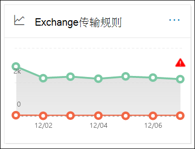
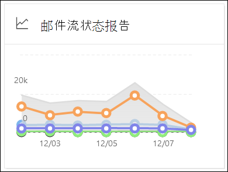

# 在安全与合规中心的"报告"仪表板中查看&报告

[!INCLUDE [Microsoft 365 Defender rebranding](../includes/microsoft-defender-for-office.md)]

**适用对象**
- [Exchange Online Protection](exchange-online-protection-overview.md)
- [Microsoft Defender for Office 365 计划 1 和计划 2](defender-for-office-365.md)
- [Microsoft 365 Defender](../defender/microsoft-365-defender.md)

> [!NOTE]
>
> 本文中的大多数报告也可在 EAC Microsoft 365 Defender Exchange管理中心 () 。 有关详细信息，请参阅下列主题：
>
> - [新管理中心中的Exchange报告](/exchange/monitoring/mail-flow-reports/mail-flow-reports)
> - [在电子邮件门户中查看Microsoft 365 Defender报告](view-email-security-reports.md)

除了安全与合规中心内"邮件流"仪表板中提供的邮件流报告之外，"报告"仪表板中还提供了各种其他邮件流报告，以帮助您监视 Microsoft 365 组织。 &

如果您具有[必要的权限](#what-permissions-are-needed-to-view-these-reports)，可以在安全与合规中心内查看这些报告&报告仪表板 <https://protection.office.com>  \> 。 若要直接转到"报表"仪表板，请打开 <https://protection.office.com/insightdashboard> 。

## 连接器报告

> [!NOTE]
> 此报告已替换为 EAC 中的 **入站** 邮件报表和出 **站** 邮件报告。 有关详细信息，请参阅新 EAC 中的入站邮件和 [出站邮件报告](/exchange/monitoring/mail-flow-reports/mfr-inbound-messages-and-outbound-messages-reports)。

## Exchange传输规则报告

**"Exchange传输** 规则"报告显示邮件流规则对 (传入和传出邮件) 传输规则的影响。

若要查看报告，请在 打开安全与&合规中心，转到"报告仪表板"，然后选择 <https://protection.office.com>  \> "Exchange **规则"。** 若要直接转到报告，请打开 <https://security.microsoft.com/reports/ETRRuleReport> 。

> [!NOTE]
> 单击安全与合规中心&此报告的小部件 (protection.office.com) 现在将你查看 Microsoft 365 Defender 门户 (security.microsoft.com) 。 有关报告的详细信息，请参阅传输[Exchange报告](view-email-security-reports.md#exchange-transport-rule-report)。

## 转发报告

> [!NOTE]
> 转发 **报告现已** 在 EAC 中提供。 有关详细信息，请参阅新 [EAC 中的自动转发邮件报告](/exchange/monitoring/mail-flow-reports/mfr-auto-forwarded-messages-report)。

## 邮件流状态报告

邮件 **流状态报告** 类似于"已发送和已接收 [电子邮件](#sent-and-received-email-report)"报告，包含有关边缘上允许或阻止的电子邮件的其他信息。 这是包含边缘保护信息的唯一报告，并且只显示 EOP 服务允许其进入服务进行评估之前阻止Exchange Online Protection (电子邮件) 。 必须了解，如果将一封邮件发送给五个收件人，我们会将邮件计为五个不同的邮件，而不是一封邮件。

若要查看报告，请打开安全与&中心，**转到"报告**[仪表板](https://protection.office.com) \> "，然后选择"**邮件流状态报告"。** 若要直接转到邮件 **流状态报告，** 请打开 <https://security.microsoft.com/reports/mailflowStatusReport> 。

> [!NOTE]
> 单击安全与合规中心&此报告的小部件 (protection.office.com) 现在将你查看 Microsoft 365 Defender 门户 (security.microsoft.com) 。 有关报告的详细信息，请参阅 [邮件流状态报告](view-email-security-reports.md#mailflow-status-report)。

## 已发送和已接收电子邮件报告

> [!NOTE]
> 此报告已替换为邮件 [流状态报告](#mailflow-status-report)。

## 首要发件人和收件人报告

The **Top senders and recipients** report is a pie chart showing your top email senders and recipients.

若要查看报告，请打开安全与合规&，**转到"报告**[仪表板](https://protection.office.com) \> "，然后选择"**顶级发件人和收件人"。** 若要直接转到报告，请打开 <https://protection.office.com/reportv2?id=TopSenderRecipientsATP> 。

### 顶级发件人和收件人报告的报告视图

下表中提供了以下报表视图：

- **显示热门 \> 邮件发件人的数据**
- **显示热门 \> 邮件收件人的数据**
- **显示热门 \> 垃圾邮件收件人的数据**
- **显示数据 \>** EOP 邮件 (恶意软件) 
- **在 Defender for (\> 中显示顶级恶意软件Office 365)**

饼图的组成将基于这些选择进行更改。

将鼠标悬停在饼图中的一个浮点上时，可以看到已发送或已接收邮件的计数。

如果 **单击筛选器中的** 报表视图，可以指定开始日期和 **结束日期的日期范围**。 

### "热门发件人和收件人"报告的详细信息表视图

如果单击 **"查看详细信息表**"，显示的信息取决于您所查看的图表：

- **显示热门 \> 邮件发件人的数据**

  - **热门邮件发件人**
  - **Count**

- **显示热门 \> 邮件收件人的数据**

  - **热门邮件收件人**
  - **Count**

- **显示热门 \> 垃圾邮件收件人的数据**

  - **热门垃圾邮件收件人**
  - **Count**

- **显示数据 \>** EOP 邮件 (恶意软件) 

  - **热门恶意软件收件人**
  - **Count**

- **在 Defender for (\> 中显示顶级恶意软件Office 365)**

  - **Defender for (的热门恶意软件Office 365)**
  - **Count**

如果在详细信息 **表** 视图中单击筛选器，可以指定开始日期和 **结束日期的日期范围**。 

若要返回到报告报表视图，请单击"**查看报告"。**

## 查看这些报告需要哪些权限？

若要查看和使用本文中所述的报告，你需要是安全与合规中心内以下角色&之一：

- **组织管理**
- **安全管理员**
- **安全信息读取者**
- **全局读取者**

有关详细信息，请参阅 [安全与合规中心的权限](permissions-in-the-security-and-compliance-center.md)。

> [!NOTE]
> 向 Microsoft 365 管理中心相应的 Azure 活动目录添加用户会向其提供安全与合规中心的必备权限 _以及_ Microsoft 365其它功能的权限。 有关详细信息，请参阅 [关于管理员角色](../../admin/add-users/about-admin-roles.md)。

## 相关主题

[安全与合规中心内的智能报告和见解](reports-and-insights-in-security-and-compliance.md)

[安全与合规中心内的邮件流见解](mail-flow-insights-v2.md)

[查看安全与合规中心内的电子邮件安全报告](view-email-security-reports.md)

[查看 Microsoft Defender for Office 365](view-reports-for-mdo.md)
