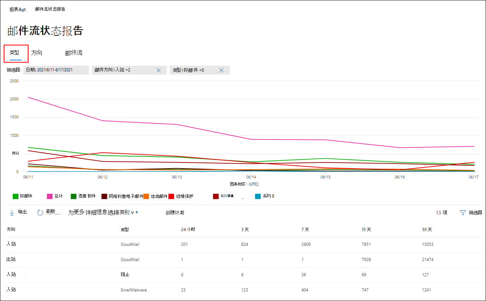
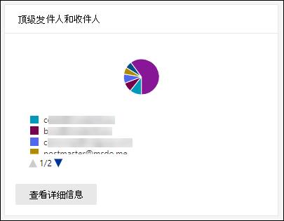

# 在安全与合规中心的"报告"仪表板中 &查看邮件流报告

除了安全 & 合规中心的 [邮件流仪表板中可用的](mail-flow-insights-v2.md) 邮件流报告，"报告"仪表板中还提供了各种其他邮件流报告，可以帮助监视 Microsoft 365 组织。

如果你拥有必要 [的权限，](#what-permissions-are-needed-to-view-these-reports)可通过转到报告仪表板， [在安全&合规性](https://office.protection.com) 中心查看 **这些** \> **报告**。 若要直接转到"报表"仪表板，请打开 <https://office.protection.office.com/insightdashboard> 。

## 连接器报告

连接器 **报告** 显示在为组织配置的 [入站和出站](https://docs.microsoft.com/Exchange/mail-flow-best-practices/use-connectors-to-configure-mail-flow/use-connectors-to-configure-mail-flow) 连接器上的邮件流活动。

若要查看报表，请打开安全 [&合规中心，](https://protection.office.com)转到" **报告** \> **仪表板"，** 然后选择"连接器 **"报告**。 若要直接转到报表，请打开 <https://protection.office.com/reportv2?id=ConnectorReport> 。

### 连接器报告的报表视图

下面的图表分为报表视图：

- **查看数据：邮件流：** 此图显示按以下条件组织的入站和出站邮件的数量：

  - **Total**
  - **在不带连接器的情况下通过 Internet**
  - **在没有连接器的情况下连接到 Internet**
  - 你配置的特定连接器。
  
  若要隔离图表中的数据，请使用"显示控制**数据**"选择这些选项之一或"全部**邮件流"。**

  

- **查看数据：TLS 使用**情况：此图显示邮件流的传输层安全性 (TLS) 的百分比。

  若要隔离图表中的数据，请使用控件的"显示 **数据"** 以选择下列选项之一：

  - **所有邮件流**
  - **在不带连接器的情况下通过 Internet**
  - **在没有连接器的情况下连接到 Internet**
  - 你配置的特定连接器。

  

如果单击**筛选器 中的**筛选器报表视图，可以指定具有开始日期和结束**日期的****日期范围**。

### 连接器报告的详细信息表视图

如果单击 **链接控件中的** "查看详细信息报表视图，会显示以下信息：

- **Date**
- **连接器方向和名称**
- **连接器类型**
- **是否被启用 TLS？：** 值 **True** 或 **False**。
- **无 TLS** 百 (百) 
- **TLS 1.0 百** (百) 
- **TLS 1.1 百** () 
- **TLS 1.2** (百) 
- **Volume：** 邮件的数量。

如果在详细信息**表视图中单击**"筛选器"，可以指定具有开始日期和结束**日期的****日期范围**。

要返回到数据库报表视图，请单击"**查看报告"。**

## Exchange 传输规则报告

**Exchange 传输规则报告显示**邮件流规则类型 (也称为组织中接收和传) 出邮件的传输规则的影响。

若要查看报告，请打开[安全&合规中心](https://protection.office.com)，转到 **"报告** \> **仪表板"，** 然后选择 **"Exchange 传输规则"。** 若要直接转到报表，请打开 <https://protection.office.com/reportv2?id=ETRRuleReport> 。

### Exchange 传输规则报告的报告视图

下面的图表分为报表视图：

- **查看数据：Exchange 传输规则** \>**按方向分解**：方向：此图显示**受传输规则影响**的**入站**和出站邮件的数量。

- **查看数据：Exchange 传输规则** \>**细节信息：严重性**：此图显示**高严重性**和**中等严重性**、低**严重性邮件的**数量。 在规则中将严重级别设置为操作， (使用以下严重 **性级别或** _SetAuditSeverity_) 。 有关详细信息，请参阅 [Exchange Online 中的邮件流规则操作](https://docs.microsoft.com//Exchange/security-and-compliance/mail-flow-rules/mail-flow-rule-actions)。

- **查看数据：DLP Exchange 传输规则** \>**按方向分解：方向**：该图显示了**受数据**丢失防护**Outbound**或 DLP 保护策略影响的入) 站和出站邮件 (数量。 通过选择以下选项，可以进一步优化图表：

  - **显示数据：所有 DLP 传输规则**
  - **显示数据：被已被阻止的用户**
  - **显示数据：检测到美国纹理法的低内容量**

- **查看数据：DLP Exchange 传输规则** \>**"按方向：方向**：方向：此视图显示受 DLP**传输规则**影响的高严重性和**Low severity**中等严重性邮件数"和"低严重性"邮件数。 **Medium severity** 通过选择以下选项，可以进一步优化图表：

  - **显示数据：所有 DLP 传输规则**
  - **显示数据：被已被阻止的用户**
  - **显示数据：检测到美国纹理法的低内容量**

如果单击 **筛选器** 报表视图，则可以通过以下筛选器修改结果：

- **开始日期** 和 **结束日期**
- 方向值
- 严重性值

### Exchange 传输规则报告的详细信息表视图

如果您单击 **"查看详细信息**表"，显示的信息取决于正在查看的图表：

- **查看数据：Exchange 传输规则**：

  - **Date**
  - **传输规则**
  - **主题**
  - **发件人地址**
  - **收件人地址**
  - **严重性**
  - **方向**

- **查看数据：DLP Exchange 传输规则**：

  - **Date**
  - **DLP 策略**
  - **传输规则**
  - **主题**
  - **发件人地址**
  - **收件人地址**
  - **严重性**
  - **方向**

如果单击 **详细信息表** 视图中的"筛选器"，则可以使用以下筛选器修改结果：

- **开始日期** 和 **结束日期**
- 方向值
- 严重性值

要返回到数据库报表视图，请单击"**查看报告"。**

## 转发报告

转 **发报告** 显示您的组织从 Exchange Online 邮箱自动将邮件转发到外部域。 转发的邮件可能带来安全或合规性风险，并且可能指示帐户被已被了威胁。

若要查看报告，请打开安全[&合规中心](https://protection.office.com)，转到"**报告** \> **仪表板"，** 然后选择"**转发报告"。** 若要直接转到报表，请打开 <https://protection.office.com/reportv2?id=MailFlowForwarding> 。

### 转发报告的报告视图

下面的图表提供了报表视图：

- **显示数据：转发方法**：以下方法分为如下：

  - **传输规则：** 也称为 [邮件流规则](https://docs.microsoft.com/Exchange/security-and-compliance/mail-flow-rules/mail-flow-rules)。
  - **邮箱规则**：也称为收 [件箱规则](https://support.microsoft.com/office/c24f5dea-9465-4df4-ad17-a50704d66c59)。

  

- **显示数据：转发域**：此视图显示作为转发目标的收件人域。

  

- **显示数据：转发器**：以下转发器显示：

  - **传输规则**
  - 包含转发收件箱规则的邮箱。

  

如果单击**筛选器 中的**筛选器报表视图，可以指定具有开始日期和结束**日期的****日期范围**。

### 转发报告的详细信息表视图

如果单击 **链接控件中的** "查看详细信息报表视图，会显示以下信息：

- **转发器**： **值传输规则** 或包含转发收件箱规则的邮箱。
- **转发类型**：邮箱 **规则** 或 **传输规则的值**。
- **收件人名称**
- **收件人域**
- **详细信息**：这是邮件流规则的 GUID 值，或收件箱规则的 RuleIdentity 值。
- **Count**
- **第一个前进日期**

如果在详细信息**表视图中单击**"筛选器"，可以指定具有开始日期和结束**日期的****日期范围**。

若要返回报告视图，请单击"查看**报告"。**

## 邮件流状态报告

邮件流 **状态报告类似于** "已发送 [和已接收的电子邮件"报告，包含](#sent-and-received-email-report)边缘上允许或阻止的电子邮件的其他信息。 这是唯一包含边缘保护信息的报告，其中仅显示 Exchange Online Protection (EOP 邮件允许用于评估的服务中的)  (数量。 务必了解，如果将邮件发送给五个收件人，则将邮件作为五个不同的邮件而不是一封邮件。  
要查看报告，请打开[安全&合规中心](https://protection.office.com)，转到报告**Reports** \> **仪表板，** 然后选择 **"邮件流状态报告"。** 若要直接转到邮件流 **状态报告，请**打开 <https://protection.office.com/mailflowStatusReport> 。

### 邮件流状态报告的类型视图

打开报表时，" **类型"选项卡** 在默认情况下处于选中状态。 默认情况下，此视图包含一个具有以下筛选器配置的图表和一个数据表：

- **日期**：过去 7 天。
- **方向**：

  - **入站**
  - **出站**
  - **组织内： 此**计数针对租户中的邮件，即 发件人abc@domain.com邮件发送到由入站xyz@domain.com (站和**出站邮件****计数独立计数的**) 

- **类型**：

  - **正常邮件**
  - **恶意软件**
  - **垃圾邮件**
  - **边缘保护**
  - **规则邮件**
  - **钓鱼电子邮件**

图表按 Type 值 **组织** 。

你可以通过单击"筛选" **或** 单击图表图例中的值来更改这些筛选器。

该表包含以下信息：

- **方向**
- **类型**
- **24 小时**
- **3 天**
- **7 天**
- **15 天**
- **30 天**

如果您单击 **"选择类别"了解更多详细信息**，可以从下列值中进行选择：

- **网络钓鱼电子邮件：** 选择此选项后，将进入威 [胁防护状态报告](view-email-security-reports.md#threat-protection-status-report)。
- **电子邮件中的恶意软件**：选择此选项可转到威胁 [防护状态报告](view-email-security-reports.md#threat-protection-status-report)。
- **垃圾邮件检测：** 选择此选项将您转到 [垃圾邮件检测报告](view-email-security-reports.md#spam-detections-report)。
- **边缘阻止垃圾邮件**：选择此选项后，您可以 [进出垃圾邮件检测报告](view-email-security-reports.md#spam-detections-report)。

**导出**：

对于详细信息视图，您只能导出一天的数据。 因此，如果要将数据导出 7 天，需要执行 7 种不同的导出操作。

每个导出的 .csv 文件只能包含 150，000 行。 如果当天数据包含 150，000 个行以上，则会创建多个 .csv 文件。

### 邮件流状态报告的路线视图

如果单击方向 **选项卡** ，将使用来自类型视图中 **相同的** 默认筛选器。

图表按方向值 **组织** 。

你可以通过单击"筛选" **或** 单击图表图例中的值来更改这些筛选器。 使用"类型"视图中 **的** 相同筛选器。

该数据表包含来自类型视图的 **相同** 信息。

" **为更多详细信息提供的内容和** 行为选择类别"与"类型" **视图** 相同。

**导出**：

对于详细信息视图，只能导出一天的数据。 因此，如果要将数据导出 7 天，需要执行 7 种不同的导出操作。

每个导出的 .csv 文件只能包含 150，000 行。 如果当天数据包含 150，000 个行以上，则会创建多个 .csv 文件。

### 邮件流状态报告的漏斗视图

" **漏斗"** 视图向你展示 Microsoft 电子邮件威胁防护功能如何在组织中筛选传入和传出电子邮件。 它提供了有关总电子邮件计数的详细信息，以及配置的威胁保护功能（包括边缘保护、反恶意软件、反网络钓鱼、反垃圾邮件和反欺骗）对此计数的影响的详细信息。

如果单击 **"漏斗"** 选项卡，此视图默认包含一个使用以下筛选器配置的图表和数据表：

- **日期**：过去 7 天。

- **方向**：

  - **入站**
  - **出站**
  - **组织内：此**计数适用于租户内发送的邮件;例如，发件人abc@domain.com发送至收件人，xyz@domain.com (入站和出站邮件计数器) 。

聚合视图和数据表视图允许 90 天过时筛选。

如果单击 **"筛选器**"，可同时筛选图表和数据表。

此图显示按以下条件组织的电子邮件计数：

  - **总电子邮件数**
  - **边缘保护后的电子邮件**
  - **反恶意软件、文件信誉后的电子邮件、文件类型阻止**
  - **反网络钓鱼、URL 信誉、品牌模拟、反欺骗邮件的电子邮件**
  - **反垃圾邮件、批量邮件筛选之后的电子邮件**
  - **用户和域模拟 1 后的**电子邮件
  - **文件后的电子邮件和 URL 销销**1
  - **传递后保护后被检测为)  (性的电子邮件) **

仅 限 Office 365 ATP

若要单独查看 EOP 或 ATP 筛选的电子邮件，请单击图表图例中的值。

Data 表包含以下信息，按日期顺序降序显示：

 - **Date**
 - **总电子邮件数**
 - **边缘保护**
 - **反恶意软件， 文件信誉， 文件类型阻止**
 - **Anti-phish， URL reputation， Brand impersonation， anti-spoof**
 - **反垃圾邮件、批量邮件筛选**
 - **用户和域配置 (ATP) **
 - **文件和 URL 指定 (ATP) **
 - **传递后保护和 ZAP 防 (ATP) 或 ZAP (EOP) **

如果你选择数据表中的行，电子邮件计数的进一步细分会显示在浮出控件中。

**导出**：

单击" **选项"** 下 **的"** 导出"后，可以选择以下值之一：

- **最 (90 天的数据的摘要) **
- **详细信息 (，最多使用过去 30) **

在 **"日期**"下，选择一个范围，然后单击"**应用"。** 当前筛选器的数据将导出到 .csv 文件。

每个导出的 .csv 文件只能包含 150，000 行。 如果数据包含的行超过 150，000 个，则会创建多个 .csv 文件。

 

 ### 邮件流状态报告的技术视图

" **技术"** 视图类似于 **漏斗视图** ，为配置的威胁防护功能提供更精细的详细信息。 你可以从该图表查看如何在威胁防护的不同阶段对邮件进行分类。

如果你单击" **技术"** 视图选项卡，默认情况下，此视图将包含一个具有以下筛选器配置的图表和数据表：

- **日期**：过去 7 天。

- **方向**：

  - **入站**
  - **出站**
  - **组织内： 此**计数针对租户中的邮件，即 发件人abc@domain.com邮件发送到收件人，xyz@domain.com (来自入站和出站邮件) 

聚合视图和数据表视图允许 90 天过时筛选。

如果单击 **"筛选器**"，可同时筛选图表和数据表。

此图显示分为以下类别的邮件：

  - **总电子邮件数**
  - **边缘允许，边缘筛选出**
  - **非恶意软件，安全附件检测 (ATP) 、反恶意软件引擎检测、规则阻止**
  - **非网络钓鱼，DMARC 故障，模拟检测，欺骗检测， 钓鱼检测**
  - **无具有 URL 通知的检测、URL 减少检测（ (ATP) **
  - **非垃圾邮件、垃圾邮件**
  - **非恶意电子邮件、安全链接检测和 (ATP) ZAP**

将鼠标悬停在图表的某个类别上时，可以看到该类别中的邮件数。

Data 表包含以下信息，按日期顺序降序显示：

  - **Date**  
  - **总电子邮件数**
  - **筛选边缘**
  - **反恶意软件引擎、安全附件、已筛选规则**
  - **DMARC， 模拟， 欺骗， 已筛选钓鱼**
  - **URL 描述检测**
  - **已筛选反垃圾邮件**
  - **删除 ZAP**
  - **通过安全链接进行检测**

如果你选择数据表中的行，电子邮件计数的进一步细分会显示在浮出控件中。

**导出**：

单击"导出 **"，** 可以在" **选项** "下选择以下值之一：

- **最 (90 天的数据的摘要) **
- **详细信息 (，最多使用过去 30) **

在 **"日期**"下，选择一个范围，然后单击"**应用"。** 当前筛选器的数据将导出到 .csv 文件。

每个导出的 .csv 文件只能包含 150，000 行。 如果数据包含的行超过 150，000 个，则会创建多个 .csv 文件。

 

## 已发送和已接收电子邮件报告

" **已发送和已接收电子邮件** 报告"是一种智能报告，其中显示有关传入和传出电子邮件的信息，包括标识为"良好"的垃圾邮件检测、恶意软件和电子邮件。 此报告和邮件流状态报告 [之间的差异在](#mailflow-status-report) 于：此报告不包括有关受边缘保护阻止的邮件的数据。

报告的聚合视图和详细信息视图允许 90 天过时筛选。

若要查看报告，请打开安全 [与&合规中心，](https://protection.office.com)转到"报表 **仪表板** \> **"，选择** "已发送 **和已接收"电子邮件**。 若要直接转到报表，请打开 <https://protection.office.com/reportv2?id=SentAndReceivedMailATP> 。

### "已发送和已接收的电子邮件"报告的报告视图

下面的图表提供了报表视图：

- **按类型分解：** 类型：此图显示所有可用类别：

  - **Total**
  - **正常邮件**
  - **EOP (恶意软件策略)  (** 恶意软件) 
  - **垃圾邮件检测**
  - **规则邮件**
  - Office 365 ATP ** (高级**) 

  当您将鼠标悬停在图表 (的数据) 时，可以看到该天的详细信息。

  

- **分解器：方向**：图表显示**总数据**、**入站****和出站**数据。 当您将鼠标悬停在图表 (的数据) 时，可以看到该天的详细信息。

  

- **深化信息** \>**恶意软件 (恶意软件) ：** 该选择将会使您[进入电子邮件报告中的恶意软件检测](view-email-security-reports.md#malware-detections-in-email-report)。

- **深化信息** \>**垃圾邮件检测) **：此选项将会转到[垃圾邮件检测报告](view-email-security-reports.md#spam-detections-report)。

如果单击 **筛选器** 报表视图，则可以通过以下筛选器修改结果：

- **开始日期** 和 **结束日期**
- 方向值
- 类型值

要返回到数据库报表视图，请单击"**查看报告"。**

### "已发送"和"已接收邮件"报告的详细信息表视图

如果您单击"**分解依次**显示：**方向或细分：方向****视图"或"方向"视图中**的"查看详细信息表"，会显示以下信息：

- **UTC (日期) **
- **类型**
- **方向**
- **邮件计数**

如果单击 **详细信息表** 视图中的"筛选器"，则可以使用以下筛选器修改结果：

- **开始日期** 和 **结束日期**
- 方向值
- 类型值

要返回到数据库报表视图，请单击"**查看报告"。**

## 主要发件人和收件人报告

主要 **发件人和收件人报告** 是一个饼图，显示您的最高电子邮件发件人和收件人。

若要查看报告，请打开安全[&合规中心，](https://protection.office.com)转到"**报告仪表板** \> **"，然后选择**"首**要发件人和收件人"。** 若要直接转到报表，请打开 <https://protection.office.com/reportv2?id=TopSenderRecipientsATP> 。

### 主要发件人和收件人报告的报告视图

下面的图表提供了报表视图：

- **显示主要 \> 邮件发件人的数据**
- **显示主要邮件 \> 收件人的数据**
- **显示主要垃圾邮件 \> 收件人的数据**
- **显示数据的 \> EOP 网站集的 (** 收件人) 
- **显示数据的 \> Office 365 ATP (与)  (** 主要的恶意软件) 

复合饼图的大小根据这些选择发生变化。

将鼠标悬停在饼图中的 wedge 上时，可以看到发送或接收的邮件的计数。

如果单击**筛选器 中的**筛选器报表视图，可以指定具有开始日期和结束**日期的****日期范围**。

### 顶级发件人和收件人报告的详细信息表视图

如果您单击 **"查看详细信息**表"，显示的信息取决于正在查看的图表：

- **显示主要 \> 邮件发件人的数据**

  - **主要邮件发件人**
  - **Count**

- **显示主要邮件 \> 收件人的数据**

  - **主要邮件收件人**
  - **Count**

- **显示主要垃圾邮件 \> 收件人的数据**

  - **主要垃圾邮件收件人**
  - **Count**

- **显示数据的 \> EOP 网站集的 (** 收件人) 

  - **主要的恶意软件收件人**
  - **Count**

- **显示数据的 \> Office 365 ATP (与)  (** 主要的恶意软件) 

  - **ATP 对象 (的主要) **
  - **Count**

如果在详细信息**表视图中单击**"筛选器"，可以指定具有开始日期和结束**日期的****日期范围**。

要返回到数据库报表视图，请单击"**查看报告"。**

## 查看这些报表需要哪些权限？

若要查看和使用这些报告，你必须是安全 & 合规中心和 Exchange Online **中指定角色** 组的成员。

- 在安全&合规中心内，你必须是以下角色组之一的成员：

  -组织管理 -安全 (也可以在 Azure Active Directory 管理中心 [-Security](https://aad.portal.azure.com) Reader 中执行此操作

  有关详细信息，请参阅[安全与合规中心中的权限](https://docs.microsoft.com/microsoft-365/security/office-365-security/permissions-in-the-security-and-compliance-center)。

- 在 Exchange Online 中，你必须是以下角色组之一的成员：

  -Organization Management -View-only Organization Management -View-Only Recipients -Compliance Management

有关详细信息，请参阅 Exchange [Online 中的权限和](https://docs.microsoft.com/Exchange/permissions-exo/permissions-exo)[管理 Exchange Online 中的角色组](https://docs.microsoft.com/Exchange/permissions-exo/role-groups)。

## 相关主题

[安全与合规中心内的智能报告和见解](reports-and-insights-in-security-and-compliance.md)

[安全与合规中心内的邮件流见解](mail-flow-insights-v2.md)

[查看安全与合规中心内的电子邮件安全报告](view-email-security-reports.md)

[查看 Office 365 高级威胁防护报告](view-reports-for-atp.md)
