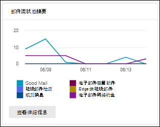

# 在安全 & 合规中心中查看 "报告" 仪表板中的邮件流报告View mail flow reports in the Reports dashboard in Security & Compliance Center

除了安全性 & 合规性中心中的[邮件流仪表板](mail-flow-insights-v2.md)中提供的邮件流报告之外，"报告" 仪表板中还提供了多种其他邮件流报告，可帮助您监视 Microsoft 365 组织。In addition to the mail flow reports that are available in the [Mail flow dashboard](mail-flow-insights-v2.md) in the Security & Compliance Center, a variety of additional mail flow reports are available in the Reports dashboard to help you monitor your Microsoft 365 organization.

如果您具有[必要的权限](#what-permissions-are-needed-to-view-these-reports)，则可以转到 "**报告**" 仪表板，在[安全 & 合规中心](https://office.protection.com)中查看这些报告 \> **Dashboard**。If you have the [necessary permissions](#what-permissions-are-needed-to-view-these-reports), you can view these reports in the [Security & Compliance Center](https://office.protection.com) by going to **Reports** \> **Dashboard**. 若要直接转到 "报表" 仪表板，请打开 <https://office.protection.office.com/insightdashboard> 。To go directly to the Reports dashboard, open <https://office.protection.office.com/insightdashboard>.

## 连接器报告Connector report

**连接器报告**显示为您的组织配置的[入站和出站连接器](https://docs.microsoft.com/Exchange/mail-flow-best-practices/use-connectors-to-configure-mail-flow/use-connectors-to-configure-mail-flow)上的 "邮件流" 活动。The **Connector report** shows mail flow activity on the [inbound and outbound connectors](https://docs.microsoft.com/Exchange/mail-flow-best-practices/use-connectors-to-configure-mail-flow/use-connectors-to-configure-mail-flow) that are configured for your organization.

若要查看报告，请打开[安全性 & 合规性中心](https://protection.office.com)，转到 "**报告**" \> **仪表板**，然后选择 "**连接器报告**"。To view the report, open the [Security & Compliance Center](https://protection.office.com), go to **Reports** \> **Dashboard** and select **Connector report**. 若要直接转到报表，请打开 <https://protection.office.com/reportv2?id=ConnectorReport> 。To go directly to the report, open <https://protection.office.com/reportv2?id=ConnectorReport>.

### 连接器报告的报告视图Report view for the Connector report

以下图表在报表视图中可用：The following charts are available in report view:

- **数据查看依据：邮件流**：此图显示按以下方式组织的入站和出站邮件的数量：**View data by: Mail flow**: This chart shows the number of inbound and outbound messages organized by:

  - **Total****Total**
  - **从不带连接器的 internet****From the internet without a connector**
  - **不带连接器的 internet 连接****To the internet without a connector**
  - 您已配置的特定连接器。A specific connector that you've configured.
  
  若要隔离图表中的数据，请使用 "**显示数据以供**控制" 选择其中一个选项或**所有邮件流**。To isolate the data in the chart, use the **Show data for** control to select one of these options or **All mail flow**.

  

- **查看数据的依据： TLS 用法**：此图显示了邮件流的传输层安全性 (TLS) 版本使用情况的百分比。**View data by: TLS usage**: This chart shows the percentage of Transport Layer Security (TLS) version usage for mail flow.

  若要隔离图表中的数据，请使用 "**显示数据以供**控制" 选择以下选项之一：To isolate the data in the chart, use the **Show data for** control to select one of the following options:

  - **所有邮件流****All mail flow**
  - **从不带连接器的 internet****From the internet without a connector**
  - **不带连接器的 internet 连接****To the internet without a connector**
  - 您已配置的特定连接器。A specific connector that you've configured.

  

如果您在报告视图中单击 "**筛选器**"，则可以指定具有 "**开始日期**" 和 "**结束日期**" 的日期范围。If you click **Filters** in a report view, you can specify a date range with **Start date** and **End date**.

### 连接器报告的详细信息表格视图Details table view for the Connector report

如果您在报告视图中单击 "**查看详细信息表**"，将显示以下信息：If you click **View details table** in a report view, the following information is shown:

- **Date****Date**
- **连接器方向和名称****Connector direction and name**
- **连接器类型****Connector type**
- **强制 TLS？**：值**True**或**False**。**Forced TLS?**: The value **True** or **False**.
- **没有 TLS** (百分比) **No TLS** (percentage)
- **TLS 1.0** (百分比) **TLS 1.0** (percentage)
- **TLS 1.1** (百分比) **TLS 1.1** (percentage)
- **TLS 1.2** (百分比) **TLS 1.2** (percentage)
- **Volume**：邮件数。**Volume**: The number of messages.

如果单击 "详细信息" 表视图中的 "**筛选器**"，则可以指定具有 "**开始日期**" 和 "**结束日期**" 的日期范围。If you click **Filters** in a details table view, you can specify a date range with **Start date** and **End date**.

若要返回到报告视图，请单击 "**查看报告**"。To go back to the report view, click **View report**.

## Exchange 传输规则报告Exchange transport rule report

**Exchange 传输规则报告**显示邮件流规则的效果 (也称为传输规则) 组织中的传入和传出邮件。The **Exchange transport rule report** shows the effect of mail flow rules (also known as transport rules) on incoming and outgoing messages in your organization.

若要查看报告，请打开[安全 & 合规中心](https://protection.office.com)，转到 "**报告** \> **仪表板**"，然后选择 " **Exchange 传输规则**"。To view the report, open the [Security & Compliance Center](https://protection.office.com), go to **Reports** \> **Dashboard** and select **Exchange Transport rule**. 若要直接转到报表，请打开 <https://protection.office.com/reportv2?id=ETRRuleReport> 。To go directly to the report, open <https://protection.office.com/reportv2?id=ETRRuleReport>.

### Exchange 传输规则报告的报告视图Report view for the Exchange transport rule report

以下图表在报表视图中可用：The following charts are available in report view:

- **数据查看依据： Exchange 传输规则** \>**分解方式：方向**：此图显示受传输规则影响的**入站**和**出站**邮件的数量。**View data by: Exchange transport rules** \> **Break down by: Direction**: This chart shows the number of **Inbound** and **Outbound** messages that were affected by transport rules.

- **数据查看依据： Exchange 传输规则** \>**分解方式：严重性**：此图显示**高严重性**和**中低严重性**以及**低严重性**邮件的数量。**View data by: Exchange transport rules** \> **Break down by: Severity**: This chart shows the number of **High severity** and **Medium severity**, and **Low severity** messages. 将严重性级别设置为规则中的操作 (使用严重级别或_SetAuditSeverity_) **审核此规则**。You set the severity level as an action in the rule (**Audit this rule with severity level** or _SetAuditSeverity_). 有关详细信息，请参阅[Exchange Online 中的邮件流规则操作](https://docs.microsoft.com//Exchange/security-and-compliance/mail-flow-rules/mail-flow-rule-actions)。For more information, see [Mail flow rule actions in Exchange Online](https://docs.microsoft.com//Exchange/security-and-compliance/mail-flow-rules/mail-flow-rule-actions).

- **数据查看依据： DLP Exchange 传输规则** \>**分解方式：方向**：此图显示受数据丢失防护 (DLP) 传输规则影响的**入站**和**出站**邮件的数量。**View data by: DLP Exchange transport rules** \> **Break down by: Direction**: This chart shows the number of **Inbound** and **Outbound** messages that were affected by data loss prevention (DLP) transport rules. 您可以通过选择以下选项来进一步优化图表：You can further refine the chart by selecting on of the following options:

  - **显示以下项的数据：所有 DLP 传输规则****Show data for: All DLP transport rules**
  - **显示以下项的数据：已损坏的用户****Show data for: Compromised users**
  - **显示以下项的数据：检测到的内容量过低美国爱国法案****Show data for: Low volume of content detected U.S. Patriot Act**

- **数据查看依据： DLP Exchange 传输规则** \>**分解方式：方向**：此视图显示**高严重性**和**中严重性**的数目以及受 DLP 传输规则影响的**低严重性**邮件。**View data by: DLP Exchange transport rules** \> **Break down by: Direction**: This view shows the number of **High severity** and **Medium severity**, and **Low severity** messages that were affected by DLP transport rules. 您可以通过选择以下选项来进一步优化图表：You can further refine the chart by selecting on of the following options:

  - **显示以下项的数据：所有 DLP 传输规则****Show data for: All DLP transport rules**
  - **显示以下项的数据：已损坏的用户****Show data for: Compromised users**
  - **显示以下项的数据：检测到的内容量过低美国爱国法案****Show data for: Low volume of content detected U.S. Patriot Act**

如果您在报告视图中单击 "**筛选器**"，则可以使用以下筛选器修改结果：：If you click **Filters** in a report view, you can modify the results with the following filters::

- **开始日期**和**结束日期****Start date** and **End date**
- 方向值Direction values
- 严重度值Severity values

### Exchange 传输规则报告的详细信息表格视图Details table view for the Exchange transport rule report

如果您单击 "**查看详细信息表**"，则显示的信息将取决于所查看的图表：If you click **View details table**, the information that's shown depends on the chart you were looking at:

- **数据查看依据： Exchange 传输规则**：**View data by: Exchange Transport rules**:

  - **Date****Date**
  - **传输规则****Transport rule**
  - **主题****Subject**
  - **发件人地址****Sender address**
  - **收件人地址****Recipient address**
  - **严重性****Severity**
  - **方向****Direction**

- **数据查看依据： DLP Exchange 传输规则**：**View data by: DLP Exchange transport rules**:

  - **Date****Date**
  - **DLP 策略****DLP policy**
  - **传输规则****Transport rule**
  - **主题****Subject**
  - **发件人地址****Sender address**
  - **收件人地址****Recipient address**
  - **严重性****Severity**
  - **方向****Direction**

如果单击 "详细信息" 表视图中的 "**筛选器**"，则可以使用以下筛选器修改结果：If you click **Filters** in a details table view, you can modify the results with the following filters:

- **开始日期**和**结束日期****Start date** and **End date**
- 方向值Direction values
- 严重度值Severity values

若要返回到报告视图，请单击 "**查看报告**"。To go back to the report view, click **View report**.

## 转发报告Forwarding report

**转发报告**将组织的自动转发的邮件显示为 Exchange Online 邮箱中的外部域。The **Forwarding report** shows your organization's automatically forwarded messages to external domains from Exchange Online mailboxes. 转发的邮件可能会带来安全或合规性风险，并可能指示已损坏的帐户。Forwarded messages can pose a security or compliance risk, and might indicate a compromised account.

若要查看报告，请打开[安全性 & 合规性中心](https://protection.office.com)，转到 "**报告**" \> **仪表板**，然后选择 "**转发报告**"。To view the report, open the [Security & Compliance Center](https://protection.office.com), go to **Reports** \> **Dashboard** and select **Forwarding report**. 若要直接转到报表，请打开 <https://protection.office.com/reportv2?id=MailFlowForwarding> 。To go directly to the report, open <https://protection.office.com/reportv2?id=MailFlowForwarding>.

### 转发报告的报告视图Report view for the Forwarding report

报表视图中提供了以下图表：The following charts are available in the report view:

- 显示以下各项**的数据：转发方法**：显示以下方法：**Show data for: Forwarding methods**: The following methods are shown:

  - **传输规则**：也称为[邮件流规则](https://docs.microsoft.com/Exchange/security-and-compliance/mail-flow-rules/mail-flow-rules)。**Transport rule**: Also known as [mail flow rules](https://docs.microsoft.com/Exchange/security-and-compliance/mail-flow-rules/mail-flow-rules).
  - **邮箱规则**：也称为[收件箱规则](https://support.microsoft.com/office/c24f5dea-9465-4df4-ad17-a50704d66c59)。**Mailbox rule**: Also known as [Inbox rules](https://support.microsoft.com/office/c24f5dea-9465-4df4-ad17-a50704d66c59).

  

- **显示数据：转发域**：此视图显示作为转发目标的收件人域。**Show data for: Forwarding domains**: This view shows the recipient domains that are the destinations for forwarding.

  

- **显示以下项的数据：转发器**：显示以下转发器：**Show data for: Forwarders**: The following forwarders are shown:

  - **传输规则****Transport rule**
  - 包含转发收件箱规则的邮箱。The mailbox that contains the forwarding Inbox rule.

  

如果您在报告视图中单击 "**筛选器**"，则可以指定具有 "**开始日期**" 和 "**结束日期**" 的日期范围。If you click **Filters** in a report view, you can specify a date range with **Start date** and **End date**.

### 转发报告的详细信息表格视图Details table view for the Forwarding report

如果您在报告视图中单击 "**查看详细信息表**"，将显示以下信息：If you click **View details table** in a report view, the following information is shown:

- **转发器**：值**传输规则**或包含转发收件箱规则的邮箱。**Forwarders**: The value **Transport rule** or the mailbox that contains the forwarding Inbox rule.
- **转发类型**：值**邮箱规则**或**传输规则**。**Forwarding type**: The value **Mailbox rule** or **Transport rule**.
- **收件人名称****Recipient name**
- **收件人域****Recipient domain**
- **详细信息**：这是邮件流规则的 GUID 值，或收件箱规则的 RuleIdentity 值。**Details**: This is the GUID value of the mail flow rule, or the RuleIdentity value of the Inbox rule.
- **Count****Count**
- **第一次转发日期****First forward date**

如果单击 "详细信息" 表视图中的 "**筛选器**"，则可以指定具有 "**开始日期**" 和 "**结束日期**" 的日期范围。If you click **Filters** in a details table view, you can specify a date range with **Start date** and **End date**.

若要返回到 "报告" 视图，请单击 "**查看报告**"。To go back to the reports view, click **View report**.

## 邮件流状态报告Mailflow status report

**邮件流状态报告**类似于[发送和接收的电子邮件报告](#sent-and-received-email-report)，其中包含有关在边缘上允许或阻止的电子邮件的其他信息。The **Mailflow status report** is similar to the [Sent and received email report](#sent-and-received-email-report), with additional information about email allowed or blocked on the edge. 这是唯一包含 edge 保护信息的报告，仅显示在允许 Exchange Online Protection (EOP) 进行评估之前阻止的电子邮件的数量。This is the only report that contains edge protection information, and shows just how much email is blocked before being allowed into the service for evaluation by Exchange Online Protection (EOP).

若要查看报表，请打开 "[安全 & 合规中心](https://protection.office.com)"，转到 "**报告**" \> **仪表板**，然后选择 "**邮件流状态报告**"。To view the report, open the [Security & Compliance Center](https://protection.office.com), go to **Reports** \> **Dashboard** and select **Mailflow status report**. 若要直接转到 "**邮件流状态" 报告**，请打开 <https://protection.office.com/mailflowStatusReport> 。To go directly to the **Mail flow status report**, open <https://protection.office.com/mailflowStatusReport>.

### 邮件流状态报告的类型视图Type view for the Mailflow status report

打开报表时，"**类型**" 选项卡在默认情况下处于选中状态。When you open the report, the **Type** tab is selected by default. 默认情况下，此视图包含一个使用以下筛选器配置的图表和数据表：By default, this view contains a chart and a data table that's configured with the following filters:

- **日期**：最近7天。**Date**: The last 7 days.
- **方向**：**Direction**:

  - **进货****Inbound**
  - **出站****Outbound**
  - **组织内** (独立于**入站**和**出站**) 计数**Intra-org** (counted separately from **Inbound** and **Outbound**)

- **类型**：**Type**:

  - **正常邮件****Good mail**
  - **恶意软件****Malware**
  - **垃圾邮件****Spam**
  - **边缘保护****Edge protection**
  - **规则消息****Rule messages**
  - **钓鱼电子邮件****Phishing email**

图表按**类型**值进行组织。The chart is organized by the **Type** values.

您可以通过单击 "**筛选器**" 或单击图表图例中的值来更改这些筛选器。You can changes these filters by clicking **Filter** or by clicking a value in the chart legend.

数据表包含以下信息：The data table contains the following information:

- **方向****Direction**
- **类型****Type**
- **24 小时****24 hours**
- **3 天****3 days**
- **7 天****7 days**
- **15 天****15 days**
- **30 天****30 days**

如果单击 "**选择类别" 以了解更多详细信息**，则可以从以下值中进行选择：If you click **Choose a category for more details**, you can select from the following values:

- **网络钓鱼电子邮件**：此选择会将您带到[威胁防护状态报告](view-email-security-reports.md#threat-protection-status-report)。**Phishing email**: This selection takes you to the [Threat protection status report](view-email-security-reports.md#threat-protection-status-report).
- **电子邮件中的恶意软件**：此选择会将您带到[威胁防护状态报告](view-email-security-reports.md#threat-protection-status-report)。**Malware in email**: This selection takes you to the [Threat protection status report](view-email-security-reports.md#threat-protection-status-report).
- **垃圾邮件检测**：选择此选项将转到[垃圾邮件检测报告](view-email-security-reports.md#spam-detections-report)。**Spam detections**: This selection takes you to the [Spam Detections report](view-email-security-reports.md#spam-detections-report).
- **边缘阻止的垃圾邮件**：选择此选项将转到[垃圾邮件检测报告](view-email-security-reports.md#spam-detections-report)。**Edge blocked spam**: This selection takes you to the [Spam Detections report](view-email-security-reports.md#spam-detections-report).

**导出**：**Export**:

对于详细信息视图，只能导出一天的数据。For the detail view, you can only export data for one day. 因此，如果要将数据导出7天，则需要执行7个不同的导出操作。So, if you want to export data for 7 days, you need to do 7 different export actions.

每个导出的 .csv 文件限制为150000行。Each exported .csv file is limited to 150,000 rows. 如果该天的数据包含的行数超过150000，则会创建多个 .csv 文件。If the data for that day contains more than 150,000 rows, then multiple .csv files will be created.

### 邮件流状态报告的方向视图Direction view for the Mailflow status report

如果单击 "**方向**" 选项卡，则将使用 "**类型**" 视图中的相同默认筛选器。If you click the **Direction** tab, the same default filters from the **Type** view are used.

图表按**方向**值组织。The chart is organized by **Direction** values.

您可以通过单击 "**筛选器**" 或通过单击图表图例中的值来更改这些筛选器。You can change these filters by clicking **Filter** or by clicking a value in the chart legend. 将使用 "**类型**" 视图中的相同筛选器。The same filters from the **Type** view are used.

数据表包含**类型**视图中的相同信息。The data table contains same information from the **Type** view.

**选择类别以获取更多详细信息**可用的选择和行为与 "**类型**" 视图相同。The **Choose a category for more details** available selections and behavior are the same as the **Type** view.

**导出**：**Export**:

对于详细信息视图，只能导出一天的数据。For the detail view, you can only export data for one day. 因此，如果要将数据导出7天，则需要执行7个不同的导出操作。So, if you want to export data for 7 days, you need to do 7 different export actions.

每个导出的 .csv 文件限制为150000行。Each exported .csv file is limited to 150,000 rows. 如果该天的数据包含的行数超过150000，则会创建多个 .csv 文件。If the data for that day contains more than 150,000 rows, then multiple .csv files will be created.

## 发送和接收的电子邮件报告Sent and received email report

**已发送和已接收的电子邮件**报告是一个智能报告，显示有关传入和传出电子邮件的信息，包括垃圾邮件检测、恶意软件和标识为 "正常" 的电子邮件。The **Sent and received email** report is a smart report that shows information about incoming and outgoing email, including spam detections, malware, and email identified as "good." 此报告和[邮件流状态报告](#mailflow-status-report)的区别在于：此报告不包含有关边缘保护阻止的邮件的数据。The difference between this report and the [Mailflow status report](#mailflow-status-report) is: this report doesn't include data about messages blocked by edge protection.

报告的聚合视图和详细信息视图允许90天的筛选。The aggregate view and the detail view of the report allow for 90 days of filtering.

若要查看报告，请打开[安全性 & 合规性中心](https://protection.office.com)，转到 "**报告**" \> **仪表板**，然后选择 "**已发送和已接收电子邮件**"。To view the report, open the [Security & Compliance Center](https://protection.office.com), go to **Reports** \> **Dashboard** and select **Sent and received email**. 若要直接转到报表，请打开 <https://protection.office.com/reportv2?id=SentAndReceivedMailATP> 。To go directly to the report, open <https://protection.office.com/reportv2?id=SentAndReceivedMailATP>.

### 已发送和已接收电子邮件报告的报告视图Report view for the Sent and received email report

报表视图中提供了以下图表：The following charts are available in the report view:

- **分解方式：类型**：图表显示所有可用类别：**Break down by: Type**: The chart shows all available categories:

  - **Total****Total**
  - **正常邮件****Good mail**
  - \*\*恶意软件 (反恶意软件) \*\* (EOP) **Malware (anti-malware)** (EOP)
  - **垃圾邮件检测****Spam detections**
  - **规则消息****Rule messages**
  -  (Office 365 ATP) 的**高级恶意软件****Advanced malware** (Office 365 ATP)

  当鼠标悬停在图表中某天 (数据点) 时，可以查看那天的详细信息。When you hover over a day (data point) in the chart, you can see details for that day.

  

- **分解方式：方向**：图表显示**总计**、**入站**和**出站**数据。**Break down by: Direction**: The chart shows **Total**, **Inbound**, and **Outbound** data. 当鼠标悬停在图表中某天 (数据点) 时，可以查看那天的详细信息。When you hover over a day (data point) in the chart, you can see details for that day.

  

- **向下** \> 钻取\*\*恶意软件 (反恶意软件) \*\*：此选择会将您带到[电子邮件报告中的恶意软件检测](view-email-security-reports.md#malware-detections-in-email-report)。**Drill down by** \> **Malware (anti-malware)**: This selection takes you to the [Malware detections in email report](view-email-security-reports.md#malware-detections-in-email-report).

- **向下** \> 钻取\*\*垃圾邮件检测) \*\*：选择此选项将转到[垃圾邮件检测报告](view-email-security-reports.md#spam-detections-report)。**Drill down by** \> **Spam detections)**: This selection takes you to the [Spam Detections report](view-email-security-reports.md#spam-detections-report).

如果您在报告视图中单击 "**筛选器**"，则可以使用以下筛选器修改结果：If you click **Filters** in a report view, you can modify the results with the following filters:

- **开始日期**和**结束日期****Start date** and **End date**
- 方向值Direction values
- 类型值Type values

若要返回到报告视图，请单击 "**查看报告**"。To go back to the report view, click **View report**.

### 已发送和已接收电子邮件报告的详细信息表格视图Details table view for the Sent and received email report

如果在 "分解方式" 中单击 "**查看详细信息表** **：方向**" 或 "**分解方式"： "方向**" 视图，将显示以下信息：If you click **View details table** in the **Break down by: Direction** or **Break down by: Direction** view, the following information is shown:

- \*\*日期 (UTC) \*\***Date (UTC)**
- **类型****Type**
- **方向****Direction**
- **邮件计数****Message count**

如果单击 "详细信息" 表视图中的 "**筛选器**"，则可以使用以下筛选器修改结果：If you click **Filters** in a details table view, you can modify the results with the following filters:

- **开始日期**和**结束日期****Start date** and **End date**
- 方向值Direction values
- 类型值Type values

若要返回到报告视图，请单击 "**查看报告**"。To go back to the report view, click **View report**.

## 主要发件人和收件人报告Top senders and recipients report

**最上面的发件人和收件人**报告是显示主要电子邮件发件人和收件人的饼形图。The **Top senders and recipients** report is a pie chart showing your top email senders and recipients.

若要查看报告，请打开 "[安全 & 合规中心](https://protection.office.com)"，转到 "**报告**" \> **仪表板**，然后选择 "**主要发件人和收件人**"。To view the report, open the [Security & Compliance Center](https://protection.office.com), go to **Reports** \> **Dashboard** and select **Top senders and recipients**. 若要直接转到报表，请打开 <https://protection.office.com/reportv2?id=TopSenderRecipientsATP> 。To go directly to the report, open <https://protection.office.com/reportv2?id=TopSenderRecipientsATP>.

### 主要发件人和收件人报告的报告视图Report view for the Top senders and recipient report

报表视图中提供了以下图表：The following charts are available in the report view:

- **显示 \> 主要邮件发件人的数据****Show data for \> Top mail senders**
- **显示 \> 主要邮件收件人的数据****Show data for \> Top mail recipients**
- **显示 \> 排名靠前的垃圾邮件收件人的数据****Show data for \> Top spam recipients**
- **显示数据 \>主要的恶意软件收件人** (EOP) **Show data for \> Top malware recipients** (EOP)
- \*\*显示数据 \>主要的恶意软件收件人 (ATP) \*\* (Office 365 ATP) **Show data for \> Top malware recipients (ATP)** (Office 365 ATP)

饼图的复合根据这些选择的变化而变化。The composition of the pie chart changes based on these selections.

当您将鼠标指针悬停在饼图中时，您可以看到发送或接收的邮件数。When you hover over a wedge in the pie chart, you can see a count of messages sent or received.

如果您在报告视图中单击 "**筛选器**"，则可以指定具有 "**开始日期**" 和 "**结束日期**" 的日期范围。If you click **Filters** in a report view, you can specify a date range with **Start date** and **End date**.

### 主要发件人和收件人报告的详细信息表格视图Details table view for the Top senders and recipient report

如果您单击 "**查看详细信息表**"，则显示的信息将取决于所查看的图表：If you click **View details table**, the information that's shown depends on the chart you were looking at:

- **显示 \> 主要邮件发件人的数据****Show data for \> Top mail senders**

  - **主要邮件发件人****Top mail senders**
  - **Count****Count**

- **显示 \> 主要邮件收件人的数据****Show data for \> Top mail recipients**

  - **主要邮件收件人****Top mail recipients**
  - **Count****Count**

- **显示 \> 排名靠前的垃圾邮件收件人的数据****Show data for \> Top spam recipients**

  - **主要垃圾邮件收件人****Top spam recipients**
  - **Count****Count**

- **显示数据 \>主要的恶意软件收件人** (EOP) **Show data for \> Top malware recipients** (EOP)

  - **主要恶意软件收件人****Top malware recipients**
  - **Count****Count**

- \*\*显示数据 \>主要的恶意软件收件人 (ATP) \*\* (Office 365 ATP) **Show data for \> Top malware recipients (ATP)** (Office 365 ATP)

  - \*\* (ATP) 的主要恶意软件收件人\*\***Top malware recipients (ATP)**
  - **Count****Count**

如果单击 "详细信息" 表视图中的 "**筛选器**"，则可以指定具有 "**开始日期**" 和 "**结束日期**" 的日期范围。If you click **Filters** in a details table view, you can specify a date range with **Start date** and **End date**.

若要返回到报告视图，请单击 "**查看报告**"。To go back to the report view, click **View report**.

## 查看这些报告所需的权限是什么？What permissions are needed to view these reports?

若要查看和使用报告，您必须是安全 & 合规性中心**和**Exchange Online 中指定角色组的成员。To view and use the reports, you need to be a member of the specified role group in the Security & Compliance Center **and** in Exchange Online.

- 在安全 & 合规性中心中，您必须是下列角色组之一的成员：In the Security & Compliance Center, you need to be a member of one of the following role groups:

  -组织管理-安全管理员 (你也可以在[Azure Active Directory 管理中心](https://aad.portal.azure.com)中执行此操作-安全读者-Organization Management -Security Administrator (you can also do this in the [Azure Active Directory admin center](https://aad.portal.azure.com) -Security Reader

  有关详细信息，请参阅[安全与合规中心中的权限](https://docs.microsoft.com/microsoft-365/security/office-365-security/permissions-in-the-security-and-compliance-center)。For more information, see [Permissions in the Security & Compliance Center](https://docs.microsoft.com/microsoft-365/security/office-365-security/permissions-in-the-security-and-compliance-center).

- 在 Exchange Online 中，您必须是下列角色组之一的成员：In Exchange Online, you need to be a member of one of the following role groups:

  -组织管理-仅查看组织管理-仅查看收件人-合规性管理-Organization Management -View-only Organization Management -View-Only Recipients -Compliance Management

有关详细信息，请参阅[Exchange online](https://docs.microsoft.com/Exchange/permissions-exo/permissions-exo)中的权限和[管理 exchange online 中的角色组](https://docs.microsoft.com/Exchange/permissions-exo/role-groups)。For more information, see [Permissions in Exchange Online](https://docs.microsoft.com/Exchange/permissions-exo/permissions-exo) and [Manage role groups in Exchange Online](https://docs.microsoft.com/Exchange/permissions-exo/role-groups).

## 相关主题Related topics

[安全与合规中心内的智能报告和见解Smart reports and insights in the Security & Compliance Center](reports-and-insights-in-security-and-compliance.md)

[安全与合规中心内的邮件流见解Mail flow insights in the Security & Compliance Center](mail-flow-insights-v2.md)

[查看安全与合规中心内的电子邮件安全报告View email security reports in the Security & Compliance Center](view-email-security-reports.md)

[查看 Office 365 高级威胁防护报告View reports for Office 365 Advanced Threat Protection](view-reports-for-atp.md)
