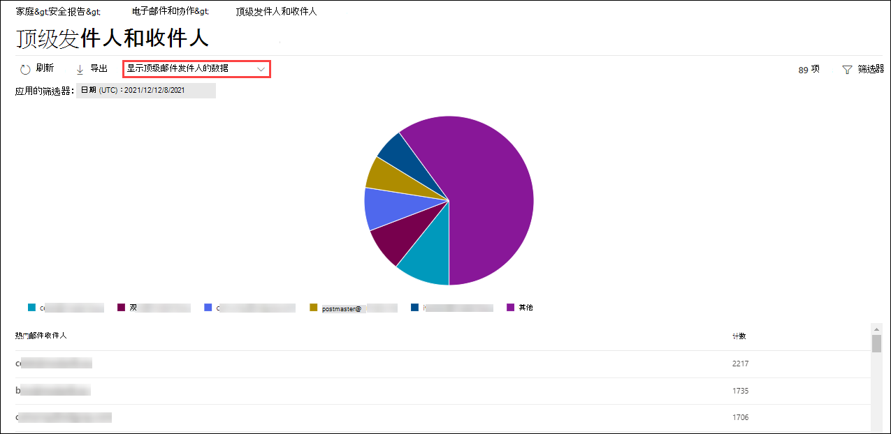

# 在安全与合规中心的"报告"仪表板中 &查看邮件流报告View mail flow reports in the Reports dashboard in Security & Compliance Center

除了安全 & 合规中心的 [邮件流仪表板中可用的](mail-flow-insights-v2.md) 邮件流报告，"报告"仪表板中还提供了各种其他邮件流报告，可以帮助监视 Microsoft 365 组织。In addition to the mail flow reports that are available in the [Mail flow dashboard](mail-flow-insights-v2.md) in the Security & Compliance Center, a variety of additional mail flow reports are available in the Reports dashboard to help you monitor your Microsoft 365 organization.

如果你拥有必要 [的权限，](#what-permissions-are-needed-to-view-these-reports)可通过转到报告仪表板， [在安全&合规性](https://office.protection.com) 中心查看 **这些** \> **报告**。If you have the [necessary permissions](#what-permissions-are-needed-to-view-these-reports), you can view these reports in the [Security & Compliance Center](https://office.protection.com) by going to **Reports** \> **Dashboard**. 若要直接转到"报表"仪表板，请打开 <https://office.protection.office.com/insightdashboard> 。To go directly to the Reports dashboard, open <https://office.protection.office.com/insightdashboard>.

## 连接器报告Connector report

连接器 **报告** 显示在为组织配置的 [入站和出站](https://docs.microsoft.com/Exchange/mail-flow-best-practices/use-connectors-to-configure-mail-flow/use-connectors-to-configure-mail-flow) 连接器上的邮件流活动。The **Connector report** shows mail flow activity on the [inbound and outbound connectors](https://docs.microsoft.com/Exchange/mail-flow-best-practices/use-connectors-to-configure-mail-flow/use-connectors-to-configure-mail-flow) that are configured for your organization.

若要查看报表，请打开安全 [&合规中心，](https://protection.office.com)转到" **报告** \> **仪表板"，** 然后选择"连接器 **"报告**。To view the report, open the [Security & Compliance Center](https://protection.office.com), go to **Reports** \> **Dashboard** and select **Connector report**. 若要直接转到报表，请打开 <https://protection.office.com/reportv2?id=ConnectorReport> 。To go directly to the report, open <https://protection.office.com/reportv2?id=ConnectorReport>.

### 连接器报告的报表视图Report view for the Connector report

下面的图表分为报表视图：The following charts are available in report view:

- **查看数据：邮件流：** 此图显示按以下条件组织的入站和出站邮件的数量：**View data by: Mail flow**: This chart shows the number of inbound and outbound messages organized by:

  - **Total****Total**
  - **在不带连接器的情况下通过 Internet****From the internet without a connector**
  - **在没有连接器的情况下连接到 Internet****To the internet without a connector**
  - 你配置的特定连接器。A specific connector that you've configured.
  
  若要隔离图表中的数据，请使用"显示控制**数据**"选择这些选项之一或"全部**邮件流"。**To isolate the data in the chart, use the **Show data for** control to select one of these options or **All mail flow**.

  

- **查看数据：TLS 使用**情况：此图显示邮件流的传输层安全性 (TLS) 的百分比。**View data by: TLS usage**: This chart shows the percentage of Transport Layer Security (TLS) version usage for mail flow.

  若要隔离图表中的数据，请使用控件的"显示 **数据"** 以选择下列选项之一：To isolate the data in the chart, use the **Show data for** control to select one of the following options:

  - **所有邮件流****All mail flow**
  - **在不带连接器的情况下通过 Internet****From the internet without a connector**
  - **在没有连接器的情况下连接到 Internet****To the internet without a connector**
  - 你配置的特定连接器。A specific connector that you've configured.

  

如果单击**筛选器 中的**筛选器报表视图，可以指定具有开始日期和结束**日期的\*\*\*\*日期范围**。If you click **Filters** in a report view, you can specify a date range with **Start date** and **End date**.

### 连接器报告的详细信息表视图Details table view for the Connector report

如果单击 **链接控件中的** "查看详细信息报表视图，会显示以下信息：If you click **View details table** in a report view, the following information is shown:

- **Date****Date**
- **连接器方向和名称****Connector direction and name**
- **连接器类型****Connector type**
- **是否被启用 TLS？：** 值 **True** 或 **False**。**Forced TLS?**: The value **True** or **False**.
- **无 TLS** 百 (百) **No TLS** (percentage)
- **TLS 1.0 百** (百) **TLS 1.0** (percentage)
- **TLS 1.1 百** () **TLS 1.1** (percentage)
- **TLS 1.2** (百) **TLS 1.2** (percentage)
- **Volume：** 邮件的数量。**Volume**: The number of messages.

如果在详细信息**表视图中单击**"筛选器"，可以指定具有开始日期和结束**日期的\*\*\*\*日期范围**。If you click **Filters** in a details table view, you can specify a date range with **Start date** and **End date**.

要返回到数据库报表视图，请单击"**查看报告"。**To go back to the report view, click **View report**.

## Exchange 传输规则报告Exchange transport rule report

**Exchange 传输规则报告显示**邮件流规则类型 (也称为组织中接收和传) 出邮件的传输规则的影响。The **Exchange transport rule report** shows the effect of mail flow rules (also known as transport rules) on incoming and outgoing messages in your organization.

若要查看报告，请打开[安全&合规中心](https://protection.office.com)，转到 **"报告** \> **仪表板"，** 然后选择 **"Exchange 传输规则"。**To view the report, open the [Security & Compliance Center](https://protection.office.com), go to **Reports** \> **Dashboard** and select **Exchange Transport rule**. 若要直接转到报表，请打开 <https://protection.office.com/reportv2?id=ETRRuleReport> 。To go directly to the report, open <https://protection.office.com/reportv2?id=ETRRuleReport>.

### Exchange 传输规则报告的报告视图Report view for the Exchange transport rule report

下面的图表分为报表视图：The following charts are available in report view:

- **查看数据：Exchange 传输规则** \>**按方向分解**：方向：此图显示**受传输规则影响**的**入站**和出站邮件的数量。**View data by: Exchange transport rules** \> **Break down by: Direction**: This chart shows the number of **Inbound** and **Outbound** messages that were affected by transport rules.

- **查看数据：Exchange 传输规则** \>**细节信息：严重性**：此图显示**高严重性**和**中等严重性**、低**严重性邮件的**数量。**View data by: Exchange transport rules** \> **Break down by: Severity**: This chart shows the number of **High severity** and **Medium severity**, and **Low severity** messages. 在规则中将严重级别设置为操作， (使用以下严重 **性级别或** _SetAuditSeverity_) 。You set the severity level as an action in the rule (**Audit this rule with severity level** or _SetAuditSeverity_). 有关详细信息，请参阅 [Exchange Online 中的邮件流规则操作](https://docs.microsoft.com//Exchange/security-and-compliance/mail-flow-rules/mail-flow-rule-actions)。For more information, see [Mail flow rule actions in Exchange Online](https://docs.microsoft.com//Exchange/security-and-compliance/mail-flow-rules/mail-flow-rule-actions).

- **查看数据：DLP Exchange 传输规则** \>**按方向分解：方向**：该图显示了**受数据**丢失防护**Outbound**或 DLP 保护策略影响的入) 站和出站邮件 (数量。**View data by: DLP Exchange transport rules** \> **Break down by: Direction**: This chart shows the number of **Inbound** and **Outbound** messages that were affected by data loss prevention (DLP) transport rules. 通过选择以下选项，可以进一步优化图表：You can further refine the chart by selecting on of the following options:

  - **显示数据：所有 DLP 传输规则****Show data for: All DLP transport rules**
  - **显示数据：被已被阻止的用户****Show data for: Compromised users**
  - **显示数据：检测到美国纹理法的低内容量****Show data for: Low volume of content detected U.S. Patriot Act**

- **查看数据：DLP Exchange 传输规则** \>**"按方向：方向**：方向：此视图显示受 DLP**传输规则**影响的高严重性和**Low severity**中等严重性邮件数"和"低严重性"邮件数。 **Medium severity****View data by: DLP Exchange transport rules** \> **Break down by: Direction**: This view shows the number of **High severity** and **Medium severity**, and **Low severity** messages that were affected by DLP transport rules. 通过选择以下选项，可以进一步优化图表：You can further refine the chart by selecting on of the following options:

  - **显示数据：所有 DLP 传输规则****Show data for: All DLP transport rules**
  - **显示数据：被已被阻止的用户****Show data for: Compromised users**
  - **显示数据：检测到美国纹理法的低内容量****Show data for: Low volume of content detected U.S. Patriot Act**

如果单击 **筛选器** 报表视图，则可以通过以下筛选器修改结果：If you click **Filters** in a report view, you can modify the results with the following filters::

- **开始日期** 和 **结束日期****Start date** and **End date**
- 方向值Direction values
- 严重性值Severity values

### Exchange 传输规则报告的详细信息表视图Details table view for the Exchange transport rule report

如果您单击 **"查看详细信息**表"，显示的信息取决于正在查看的图表：If you click **View details table**, the information that's shown depends on the chart you were looking at:

- **查看数据：Exchange 传输规则**：**View data by: Exchange Transport rules**:

  - **Date****Date**
  - **传输规则****Transport rule**
  - **主题****Subject**
  - **发件人地址****Sender address**
  - **收件人地址****Recipient address**
  - **严重性****Severity**
  - **方向****Direction**

- **查看数据：DLP Exchange 传输规则**：**View data by: DLP Exchange transport rules**:

  - **Date****Date**
  - **DLP 策略****DLP policy**
  - **传输规则****Transport rule**
  - **主题****Subject**
  - **发件人地址****Sender address**
  - **收件人地址****Recipient address**
  - **严重性****Severity**
  - **方向****Direction**

如果单击 **详细信息表** 视图中的"筛选器"，则可以使用以下筛选器修改结果：If you click **Filters** in a details table view, you can modify the results with the following filters:

- **开始日期** 和 **结束日期****Start date** and **End date**
- 方向值Direction values
- 严重性值Severity values

要返回到数据库报表视图，请单击"**查看报告"。**To go back to the report view, click **View report**.

## 转发报告Forwarding report

转 **发报告** 显示您的组织从 Exchange Online 邮箱自动将邮件转发到外部域。The **Forwarding report** shows your organization's automatically forwarded messages to external domains from Exchange Online mailboxes. 转发的邮件可能带来安全或合规性风险，并且可能指示帐户被已被了威胁。Forwarded messages can pose a security or compliance risk, and might indicate a compromised account.

若要查看报告，请打开安全[&合规中心](https://protection.office.com)，转到"**报告** \> **仪表板"，** 然后选择"**转发报告"。**To view the report, open the [Security & Compliance Center](https://protection.office.com), go to **Reports** \> **Dashboard** and select **Forwarding report**. 若要直接转到报表，请打开 <https://protection.office.com/reportv2?id=MailFlowForwarding> 。To go directly to the report, open <https://protection.office.com/reportv2?id=MailFlowForwarding>.

### 转发报告的报告视图Report view for the Forwarding report

下面的图表提供了报表视图：The following charts are available in the report view:

- **显示数据：转发方法**：以下方法分为如下：**Show data for: Forwarding methods**: The following methods are shown:

  - **传输规则：** 也称为 [邮件流规则](https://docs.microsoft.com/Exchange/security-and-compliance/mail-flow-rules/mail-flow-rules)。**Transport rule**: Also known as [mail flow rules](https://docs.microsoft.com/Exchange/security-and-compliance/mail-flow-rules/mail-flow-rules).
  - **邮箱规则**：也称为收 [件箱规则](https://support.microsoft.com/office/c24f5dea-9465-4df4-ad17-a50704d66c59)。**Mailbox rule**: Also known as [Inbox rules](https://support.microsoft.com/office/c24f5dea-9465-4df4-ad17-a50704d66c59).

  

- **显示数据：转发域**：此视图显示作为转发目标的收件人域。**Show data for: Forwarding domains**: This view shows the recipient domains that are the destinations for forwarding.

  

- **显示数据：转发器**：以下转发器显示：**Show data for: Forwarders**: The following forwarders are shown:

  - **传输规则****Transport rule**
  - 包含转发收件箱规则的邮箱。The mailbox that contains the forwarding Inbox rule.

  

如果单击**筛选器 中的**筛选器报表视图，可以指定具有开始日期和结束**日期的\*\*\*\*日期范围**。If you click **Filters** in a report view, you can specify a date range with **Start date** and **End date**.

### 转发报告的详细信息表视图Details table view for the Forwarding report

如果单击 **链接控件中的** "查看详细信息报表视图，会显示以下信息：If you click **View details table** in a report view, the following information is shown:

- **转发器**： **值传输规则** 或包含转发收件箱规则的邮箱。**Forwarders**: The value **Transport rule** or the mailbox that contains the forwarding Inbox rule.
- **转发类型**：邮箱 **规则** 或 **传输规则的值**。**Forwarding type**: The value **Mailbox rule** or **Transport rule**.
- **收件人名称****Recipient name**
- **收件人域****Recipient domain**
- **详细信息**：这是邮件流规则的 GUID 值，或收件箱规则的 RuleIdentity 值。**Details**: This is the GUID value of the mail flow rule, or the RuleIdentity value of the Inbox rule.
- **Count****Count**
- **第一个前进日期****First forward date**

如果在详细信息**表视图中单击**"筛选器"，可以指定具有开始日期和结束**日期的\*\*\*\*日期范围**。If you click **Filters** in a details table view, you can specify a date range with **Start date** and **End date**.

若要返回报告视图，请单击"查看**报告"。**To go back to the reports view, click **View report**.

## 邮件流状态报告Mailflow status report

邮件流 **状态报告类似于** "已发送 [和已接收的电子邮件"报告，包含](#sent-and-received-email-report)边缘上允许或阻止的电子邮件的其他信息。The **Mailflow status report** is similar to the [Sent and received email report](#sent-and-received-email-report), with additional information about email allowed or blocked on the edge. 这是唯一包含边缘保护信息的报告，其中仅显示 Exchange Online Protection (EOP 邮件允许用于评估的服务中的)  (数量。This is the only report that contains edge protection information, and shows just how much email is blocked before being allowed into the service for evaluation by Exchange Online Protection (EOP). 务必了解，如果将邮件发送给五个收件人，则将邮件作为五个不同的邮件而不是一封邮件。It's important to understand that if a message is sent to five recipients we count it as five different messages and not one message.  
要查看报告，请打开[安全&合规中心](https://protection.office.com)，转到报告**Reports** \> **仪表板，** 然后选择 **"邮件流状态报告"。**To view the report, open the [Security & Compliance Center](https://protection.office.com), go to **Reports** \> **Dashboard** and select **Mailflow status report**. 若要直接转到邮件流 **状态报告，请**打开 <https://protection.office.com/mailflowStatusReport> 。To go directly to the **Mail flow status report**, open <https://protection.office.com/mailflowStatusReport>.

### 邮件流状态报告的类型视图Type view for the Mailflow status report

打开报表时，" **类型"选项卡** 在默认情况下处于选中状态。When you open the report, the **Type** tab is selected by default. 默认情况下，此视图包含一个具有以下筛选器配置的图表和一个数据表：By default, this view contains a chart and a data table that's configured with the following filters:

- **日期**：过去 7 天。**Date**: The last 7 days.
- **方向**：**Direction**:

  - **入站****Inbound**
  - **出站****Outbound**
  - **组织内： 此**计数针对租户中的邮件，即**Intra-org**: this count is for messages within a tenant i.e 发件人abc@domain.com邮件发送到由入站xyz@domain.com (站和**出站邮件\*\*\*\*计数独立计数的**) sender abc@domain.com sends to recipient xyz@domain.com  (counted separately from **Inbound** and **Outbound**)

- **类型**：**Type**:

  - **正常邮件****Good mail**
  - **恶意软件****Malware**
  - **垃圾邮件****Spam**
  - **边缘保护****Edge protection**
  - **规则邮件****Rule messages**
  - **钓鱼电子邮件****Phishing email**

图表按 Type 值 **组织** 。The chart is organized by the **Type** values.

你可以通过单击"筛选" **或** 单击图表图例中的值来更改这些筛选器。You can change these filters by clicking **Filter** or by clicking a value in the chart legend.

该表包含以下信息：The data table contains the following information:

- **方向****Direction**
- **类型****Type**
- **24 小时****24 hours**
- **3 天****3 days**
- **7 天****7 days**
- **15 天****15 days**
- **30 天****30 days**

如果您单击 **"选择类别"了解更多详细信息**，可以从下列值中进行选择：If you click **Choose a category for more details**, you can select from the following values:

- **网络钓鱼电子邮件：** 选择此选项后，将进入威 [胁防护状态报告](view-email-security-reports.md#threat-protection-status-report)。**Phishing email**: This selection takes you to the [Threat protection status report](view-email-security-reports.md#threat-protection-status-report).
- **电子邮件中的恶意软件**：选择此选项可转到威胁 [防护状态报告](view-email-security-reports.md#threat-protection-status-report)。**Malware in email**: This selection takes you to the [Threat protection status report](view-email-security-reports.md#threat-protection-status-report).
- **垃圾邮件检测：** 选择此选项将您转到 [垃圾邮件检测报告](view-email-security-reports.md#spam-detections-report)。**Spam detections**: This selection takes you to the [Spam Detections report](view-email-security-reports.md#spam-detections-report).
- **边缘阻止垃圾邮件**：选择此选项后，您可以 [进出垃圾邮件检测报告](view-email-security-reports.md#spam-detections-report)。**Edge blocked spam**: This selection takes you to the [Spam Detections report](view-email-security-reports.md#spam-detections-report).

**导出**：**Export**:

对于详细信息视图，您只能导出一天的数据。For the detail view, you can only export data for one day. 因此，如果要将数据导出 7 天，需要执行 7 种不同的导出操作。So, if you want to export data for 7 days, you need to do 7 different export actions.

每个导出的 .csv 文件只能包含 150，000 行。Each exported .csv file is limited to 150,000 rows. 如果当天数据包含 150，000 个行以上，则会创建多个 .csv 文件。If the data for that day contains more than 150,000 rows, then multiple .csv files will be created.

### 邮件流状态报告的路线视图Direction view for the Mailflow status report

如果单击方向 **选项卡** ，将使用来自类型视图中 **相同的** 默认筛选器。If you click the **Direction** tab, the same default filters from the **Type** view are used.

图表按方向值 **组织** 。The chart is organized by **Direction** values.

你可以通过单击"筛选" **或** 单击图表图例中的值来更改这些筛选器。You can change these filters by clicking **Filter** or by clicking a value in the chart legend. 使用"类型"视图中 **的** 相同筛选器。The same filters from the **Type** view are used.

该数据表包含来自类型视图的 **相同** 信息。The data table contains same information from the **Type** view.

" **为更多详细信息提供的内容和** 行为选择类别"与"类型" **视图** 相同。The **Choose a category for more details** available selections and behavior are the same as the **Type** view.

**导出**：**Export**:

对于详细信息视图，只能导出一天的数据。For the detail view, you can only export data for one day. 因此，如果要将数据导出 7 天，需要执行 7 种不同的导出操作。So, if you want to export data for 7 days, you need to do 7 different export actions.

每个导出的 .csv 文件只能包含 150，000 行。Each exported .csv file is limited to 150,000 rows. 如果当天数据包含 150，000 个行以上，则会创建多个 .csv 文件。If the data for that day contains more than 150,000 rows, then multiple .csv files will be created.

### 邮件流状态报告的漏斗视图Funnel view for the Mailflow status report

" **漏斗"** 视图向你展示 Microsoft 电子邮件威胁防护功能如何在组织中筛选传入和传出电子邮件。The **Funnel** view shows you how Microsoft's email threat protection features filter incoming and outgoing email in your organization. 它提供了有关总电子邮件计数的详细信息，以及配置的威胁保护功能（包括边缘保护、反恶意软件、反网络钓鱼、反垃圾邮件和反欺骗）对此计数的影响的详细信息。It provides details on the total email count, and how the configured threat protection features, including edge protection, anti-malware, anti-phishing, anti-spam, and anti-spoofing affect this count.

如果单击 **"漏斗"** 选项卡，此视图默认包含一个使用以下筛选器配置的图表和数据表：If you click the **Funnel** tab, by default, this view contains a chart and a data table that's configured with the following filters:

- **日期**：过去 7 天。**Date**: The last 7 days.

- **方向**：**Direction**:

  - **入站****Inbound**
  - **出站****Outbound**
  - **组织内：此**计数适用于租户内发送的邮件;例如，发件人abc@domain.com发送至收件人，xyz@domain.com (入站和出站邮件计数器) 。**Intra-org**: This count is for messages sent within a tenant; i.e, sender abc@domain.com sends to recipient xyz@domain.com (counted separately from Inbound and Outbound).

聚合视图和数据表视图允许 90 天过时筛选。The aggregate view and data table view allow for 90 days of filtering.

如果单击 **"筛选器**"，可同时筛选图表和数据表。If you click **Filter**, you can filter both the chart and the data table.

此图显示按以下条件组织的电子邮件计数：This chart shows the email count organized by:

  - **总电子邮件数****Total email**
  - **边缘保护后的电子邮件****Email after edge protection**
  - **反恶意软件、文件信誉后的电子邮件、文件类型阻止****Email after anti-malware, file reputation, file type block**
  - **反网络钓鱼、URL 信誉、品牌模拟、反欺骗邮件的电子邮件****Email after anti-phish, URL reputation, brand impersonation, anti-spoof**
  - **反垃圾邮件、批量邮件筛选之后的电子邮件****Email after anti-spam, bulk mail filtering**
  - **用户和域模拟 1 后的**电子邮件**Email after user and domain impersonation**1
  - **文件后的电子邮件和 URL 销销**1**Email after file and URL detonation**1
  - \*\*传递后保护后被检测为)  (性的电子邮件) \*\***Email detected as benign after post-delivery protection (URL click time protection)**

仅 限 Office 365 ATP1 Office 365 ATP only

若要单独查看 EOP 或 ATP 筛选的电子邮件，请单击图表图例中的值。To view the email filtered by EOP or ATP separately, click on the value in the chart legend.

Data 表包含以下信息，按日期顺序降序显示：The data table contains the following information, shown in descending date order:

 - **Date****Date**
 - **总电子邮件数****Total email**
 - **边缘保护****Edge protection**
 - **反恶意软件， 文件信誉， 文件类型阻止****Anti-malware, file reputation, file type block**
 - **Anti-phish， URL reputation， Brand impersonation， anti-spoof****Anti-phish, URL reputation, Brand impersonation, anti-spoof**
 - **反垃圾邮件、批量邮件筛选****Anti-spam, bulk mail filtering**
 - \*\*用户和域配置 (ATP) \*\***User and domain impersonation (ATP)**
 - \*\*文件和 URL 指定 (ATP) \*\***File and URL detonation (ATP)**
 - \*\*传递后保护和 ZAP 防 (ATP) 或 ZAP (EOP) \*\***Post-delivery protection and ZAP (ATP), or ZAP (EOP)**

如果你选择数据表中的行，电子邮件计数的进一步细分会显示在浮出控件中。If you select a row in the data table, a further breakdown of the email counts are shown in the flyout.

**导出**：**Export**:

单击" **选项"** 下 **的"** 导出"后，可以选择以下值之一：After you click **Export** under **Options**, you can select one of the following values:

- \*\*最 (90 天的数据的摘要) \*\***Summary (with data for last 90 days at most)**
- \*\*详细信息 (，最多使用过去 30) \*\***Details (with data for last 30 days at most)**

在 **"日期**"下，选择一个范围，然后单击"**应用"。**Under **Date**, choose a range, and then click **Apply**. 当前筛选器的数据将导出到 .csv 文件。Data for the current filters will be exported to a .csv file.

每个导出的 .csv 文件只能包含 150，000 行。Each exported .csv file is limited to 150,000 rows. 如果数据包含的行超过 150，000 个，则会创建多个 .csv 文件。If the data contains more than 150,000 rows, then multiple .csv files will be created.

 

 ### 邮件流状态报告的技术视图Tech view for the Mailflow status report

" **技术"** 视图类似于 **漏斗视图** ，为配置的威胁防护功能提供更精细的详细信息。The **Tech view** is similar to the **Funnel** view, providing more granular details for the configured threat protections features. 你可以从该图表查看如何在威胁防护的不同阶段对邮件进行分类。From the chart, you can see how messages are categorized at the different stages of threat protection.

如果你单击" **技术"** 视图选项卡，默认情况下，此视图将包含一个具有以下筛选器配置的图表和数据表：If you click the **Tech view** tab, by default, this view contains a chart and a data table that's configured with the following filters:

- **日期**：过去 7 天。**Date**: The last 7 days.

- **方向**：**Direction**:

  - **入站****Inbound**
  - **出站****Outbound**
  - **组织内： 此**计数针对租户中的邮件，即**Intra-org**: this count is for messages within a tenant i.e 发件人abc@domain.com邮件发送到收件人，xyz@domain.com (来自入站和出站邮件) sender abc@domain.com sends to recipient xyz@domain.com (counted separately from Inbound and Outbound)

聚合视图和数据表视图允许 90 天过时筛选。The aggregate view and data table view allow for 90 days of filtering.

如果单击 **"筛选器**"，可同时筛选图表和数据表。If you click **Filter**, you can filter both the chart and the data table.

此图显示分为以下类别的邮件：This chart shows messages organized into the following categories:

  - **总电子邮件数****Total email**
  - **边缘允许，边缘筛选出****Edge allow, edge filtered**
  - **非恶意软件，安全附件检测 (ATP) 、反恶意软件引擎检测、规则阻止****Not malware, Safe attachments detection (ATP), Anti-malware engine detection, rule block**
  - **非网络钓鱼，DMARC 故障，模拟检测，欺骗检测， 钓鱼检测****Not phish, DMARC failure, impersonation detection, spoof detection, phish detection**
  - \*\*无具有 URL 通知的检测、URL 减少检测（ (ATP) \*\***No detection with URL detonation, URL detonation detection (ATP)**
  - **非垃圾邮件、垃圾邮件****Not spam, spam**
  - **非恶意电子邮件、安全链接检测和 (ATP) ZAP****Non-malicious email, safe links detection (ATP), ZAP**

将鼠标悬停在图表的某个类别上时，可以看到该类别中的邮件数。When you hover over a category in the chart, you can see the number of messages in that category.

Data 表包含以下信息，按日期顺序降序显示：The data table contains the following information, shown in descending date order:

  - **Date****Date**  
  - **总电子邮件数****Total email**
  - **筛选边缘****Edge filtered**
  - **反恶意软件引擎、安全附件、已筛选规则****Anti-malware engine, safe attachments, rule filtered**
  - **DMARC， 模拟， 欺骗， 已筛选钓鱼****DMARC, impersonation, spoof, phish filtered**
  - **URL 描述检测****URL detonation detection**
  - **已筛选反垃圾邮件****Anti-spam filtered**
  - **删除 ZAP****ZAP removed**
  - **通过安全链接进行检测****Detection by safe links**

如果你选择数据表中的行，电子邮件计数的进一步细分会显示在浮出控件中。If you select a row in the data table, a further breakdown of the email counts are shown in the flyout.

**导出**：**Export**:

单击"导出 **"，** 可以在" **选项** "下选择以下值之一：On clicking **Export**, under **Options** you can select one of the following values:

- \*\*最 (90 天的数据的摘要) \*\***Summary (with data for last 90 days at most)**
- \*\*详细信息 (，最多使用过去 30) \*\***Details (with data for last 30 days at most)**

在 **"日期**"下，选择一个范围，然后单击"**应用"。**Under **Date**, choose a range, and then click **Apply**. 当前筛选器的数据将导出到 .csv 文件。Data for the current filters will be exported to a .csv file.

每个导出的 .csv 文件只能包含 150，000 行。Each exported .csv file is limited to 150,000 rows. 如果数据包含的行超过 150，000 个，则会创建多个 .csv 文件。If the data contains more than 150,000 rows, then multiple .csv files will be created.

 

## 已发送和已接收电子邮件报告Sent and received email report

" **已发送和已接收电子邮件** 报告"是一种智能报告，其中显示有关传入和传出电子邮件的信息，包括标识为"良好"的垃圾邮件检测、恶意软件和电子邮件。The **Sent and received email** report is a smart report that shows information about incoming and outgoing email, including spam detections, malware, and email identified as "good." 此报告和邮件流状态报告 [之间的差异在](#mailflow-status-report) 于：此报告不包括有关受边缘保护阻止的邮件的数据。The difference between this report and the [Mailflow status report](#mailflow-status-report) is: this report doesn't include data about messages blocked by edge protection.

报告的聚合视图和详细信息视图允许 90 天过时筛选。The aggregate view and the detail view of the report allow for 90 days of filtering.

若要查看报告，请打开安全 [与&合规中心，](https://protection.office.com)转到"报表 **仪表板** \> **"，选择** "已发送 **和已接收"电子邮件**。To view the report, open the [Security & Compliance Center](https://protection.office.com), go to **Reports** \> **Dashboard** and select **Sent and received email**. 若要直接转到报表，请打开 <https://protection.office.com/reportv2?id=SentAndReceivedMailATP> 。To go directly to the report, open <https://protection.office.com/reportv2?id=SentAndReceivedMailATP>.

### "已发送和已接收的电子邮件"报告的报告视图Report view for the Sent and received email report

下面的图表提供了报表视图：The following charts are available in the report view:

- **按类型分解：** 类型：此图显示所有可用类别：**Break down by: Type**: The chart shows all available categories:

  - **Total****Total**
  - **正常邮件****Good mail**
  - **EOP (恶意软件策略)  (** 恶意软件) **Malware (anti-malware)** (EOP)
  - **垃圾邮件检测****Spam detections**
  - **规则邮件****Rule messages**
  - Office 365 ATP \*\* (高级\*\*) **Advanced malware** (Office 365 ATP)

  当您将鼠标悬停在图表 (的数据) 时，可以看到该天的详细信息。When you hover over a day (data point) in the chart, you can see details for that day.

  

- **分解器：方向**：图表显示**总数据**、**入站\*\*\*\*和出站**数据。**Break down by: Direction**: The chart shows **Total**, **Inbound**, and **Outbound** data. 当您将鼠标悬停在图表 (的数据) 时，可以看到该天的详细信息。When you hover over a day (data point) in the chart, you can see details for that day.

  

- **深化信息** \>**恶意软件 (恶意软件) ：** 该选择将会使您[进入电子邮件报告中的恶意软件检测](view-email-security-reports.md#malware-detections-in-email-report)。**Drill down by** \> **Malware (anti-malware)**: This selection takes you to the [Malware detections in email report](view-email-security-reports.md#malware-detections-in-email-report).

- **深化信息** \>\*\*垃圾邮件检测) \*\*：此选项将会转到[垃圾邮件检测报告](view-email-security-reports.md#spam-detections-report)。**Drill down by** \> **Spam detections)**: This selection takes you to the [Spam Detections report](view-email-security-reports.md#spam-detections-report).

如果单击 **筛选器** 报表视图，则可以通过以下筛选器修改结果：If you click **Filters** in a report view, you can modify the results with the following filters:

- **开始日期** 和 **结束日期****Start date** and **End date**
- 方向值Direction values
- 类型值Type values

要返回到数据库报表视图，请单击"**查看报告"。**To go back to the report view, click **View report**.

### "已发送"和"已接收邮件"报告的详细信息表视图Details table view for the Sent and received email report

如果您单击"**分解依次**显示：**方向或细分：方向\*\*\*\*视图"或"方向"视图中**的"查看详细信息表"，会显示以下信息：If you click **View details table** in the **Break down by: Direction** or **Break down by: Direction** view, the following information is shown:

- \*\*UTC (日期) \*\***Date (UTC)**
- **类型****Type**
- **方向****Direction**
- **邮件计数****Message count**

如果单击 **详细信息表** 视图中的"筛选器"，则可以使用以下筛选器修改结果：If you click **Filters** in a details table view, you can modify the results with the following filters:

- **开始日期** 和 **结束日期****Start date** and **End date**
- 方向值Direction values
- 类型值Type values

要返回到数据库报表视图，请单击"**查看报告"。**To go back to the report view, click **View report**.

## 主要发件人和收件人报告Top senders and recipients report

主要 **发件人和收件人报告** 是一个饼图，显示您的最高电子邮件发件人和收件人。The **Top senders and recipients** report is a pie chart showing your top email senders and recipients.

若要查看报告，请打开安全[&合规中心，](https://protection.office.com)转到"**报告仪表板** \> **"，然后选择**"首**要发件人和收件人"。**To view the report, open the [Security & Compliance Center](https://protection.office.com), go to **Reports** \> **Dashboard** and select **Top senders and recipients**. 若要直接转到报表，请打开 <https://protection.office.com/reportv2?id=TopSenderRecipientsATP> 。To go directly to the report, open <https://protection.office.com/reportv2?id=TopSenderRecipientsATP>.

### 主要发件人和收件人报告的报告视图Report view for the Top senders and recipient report

下面的图表提供了报表视图：The following charts are available in the report view:

- **显示主要 \> 邮件发件人的数据****Show data for \> Top mail senders**
- **显示主要邮件 \> 收件人的数据****Show data for \> Top mail recipients**
- **显示主要垃圾邮件 \> 收件人的数据****Show data for \> Top spam recipients**
- **显示数据的 \> EOP 网站集的 (** 收件人) **Show data for \> Top malware recipients** (EOP)
- **显示数据的 \> Office 365 ATP (与)  (** 主要的恶意软件) **Show data for \> Top malware recipients (ATP)** (Office 365 ATP)

复合饼图的大小根据这些选择发生变化。The composition of the pie chart changes based on these selections.

将鼠标悬停在饼图中的 wedge 上时，可以看到发送或接收的邮件的计数。When you hover over a wedge in the pie chart, you can see a count of messages sent or received.

如果单击**筛选器 中的**筛选器报表视图，可以指定具有开始日期和结束**日期的\*\*\*\*日期范围**。If you click **Filters** in a report view, you can specify a date range with **Start date** and **End date**.

### 顶级发件人和收件人报告的详细信息表视图Details table view for the Top senders and recipient report

如果您单击 **"查看详细信息**表"，显示的信息取决于正在查看的图表：If you click **View details table**, the information that's shown depends on the chart you were looking at:

- **显示主要 \> 邮件发件人的数据****Show data for \> Top mail senders**

  - **主要邮件发件人****Top mail senders**
  - **Count****Count**

- **显示主要邮件 \> 收件人的数据****Show data for \> Top mail recipients**

  - **主要邮件收件人****Top mail recipients**
  - **Count****Count**

- **显示主要垃圾邮件 \> 收件人的数据****Show data for \> Top spam recipients**

  - **主要垃圾邮件收件人****Top spam recipients**
  - **Count****Count**

- **显示数据的 \> EOP 网站集的 (** 收件人) **Show data for \> Top malware recipients** (EOP)

  - **主要的恶意软件收件人****Top malware recipients**
  - **Count****Count**

- **显示数据的 \> Office 365 ATP (与)  (** 主要的恶意软件) **Show data for \> Top malware recipients (ATP)** (Office 365 ATP)

  - \*\*ATP 对象 (的主要) \*\***Top malware recipients (ATP)**
  - **Count****Count**

如果在详细信息**表视图中单击**"筛选器"，可以指定具有开始日期和结束**日期的\*\*\*\*日期范围**。If you click **Filters** in a details table view, you can specify a date range with **Start date** and **End date**.

要返回到数据库报表视图，请单击"**查看报告"。**To go back to the report view, click **View report**.

## 查看这些报表需要哪些权限？What permissions are needed to view these reports?

若要查看和使用这些报告，你必须是安全 & 合规中心和 Exchange Online **中指定角色** 组的成员。To view and use the reports, you need to be a member of the specified role group in the Security & Compliance Center **and** in Exchange Online.

- 在安全&合规中心内，你必须是以下角色组之一的成员：In the Security & Compliance Center, you need to be a member of one of the following role groups:

  -组织管理 -安全 (也可以在 Azure Active Directory 管理中心 [-Security](https://aad.portal.azure.com) Reader 中执行此操作-Organization Management -Security Administrator (you can also do this in the [Azure Active Directory admin center](https://aad.portal.azure.com) -Security Reader

  有关详细信息，请参阅[安全与合规中心中的权限](https://docs.microsoft.com/microsoft-365/security/office-365-security/permissions-in-the-security-and-compliance-center)。For more information, see [Permissions in the Security & Compliance Center](https://docs.microsoft.com/microsoft-365/security/office-365-security/permissions-in-the-security-and-compliance-center).

- 在 Exchange Online 中，你必须是以下角色组之一的成员：In Exchange Online, you need to be a member of one of the following role groups:

  -Organization Management -View-only Organization Management -View-Only Recipients -Compliance Management-Organization Management -View-only Organization Management -View-Only Recipients -Compliance Management

有关详细信息，请参阅 Exchange [Online 中的权限和](https://docs.microsoft.com/Exchange/permissions-exo/permissions-exo)[管理 Exchange Online 中的角色组](https://docs.microsoft.com/Exchange/permissions-exo/role-groups)。For more information, see [Permissions in Exchange Online](https://docs.microsoft.com/Exchange/permissions-exo/permissions-exo) and [Manage role groups in Exchange Online](https://docs.microsoft.com/Exchange/permissions-exo/role-groups).

## 相关主题Related topics

[安全与合规中心内的智能报告和见解Smart reports and insights in the Security & Compliance Center](reports-and-insights-in-security-and-compliance.md)

[安全与合规中心内的邮件流见解Mail flow insights in the Security & Compliance Center](mail-flow-insights-v2.md)

[查看安全与合规中心内的电子邮件安全报告View email security reports in the Security & Compliance Center](view-email-security-reports.md)

[查看 Office 365 高级威胁防护报告View reports for Office 365 Advanced Threat Protection](view-reports-for-atp.md)
