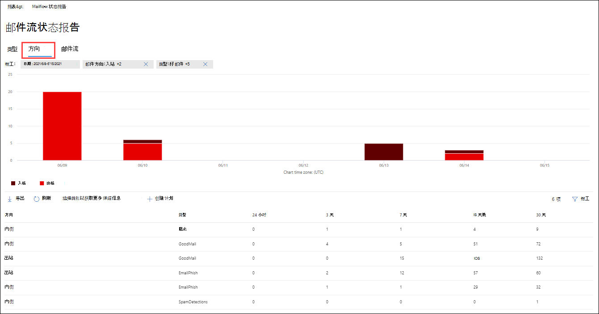

# 在安全与合规中心的"报告"仪表板中&流报告

[!INCLUDE [Microsoft 365 Defender rebranding](../includes/microsoft-defender-for-office.md)]

**适用对象**
- [Exchange Online Protection](exchange-online-protection-overview.md)
- [Microsoft Defender for Office 365 计划 1 和计划 2](defender-for-office-365.md)
- [Microsoft 365 Defender](../defender/microsoft-365-defender.md)

> [!NOTE]
> 本文中的大多数报告在 EAC Microsoft 365 Defender Exchange 管理中心 () 。 有关详细信息，请参阅下列主题：
>
> - [新管理中心中的Exchange报告](/exchange/monitoring/mail-flow-reports/mail-flow-reports)
> - [在电子邮件门户中查看Microsoft 365 Defender报告](view-email-security-reports.md)

除了安全 & 合规中心中的"邮件流"仪表板中提供的邮件流报告，"报告"仪表板中还提供了各种其他邮件流报告，以帮助您监视 Microsoft 365 组织。

如果您具有 [必要的权限](#what-permissions-are-needed-to-view-these-reports)，可以在安全与合规中心内查看这些报告 [&"报告仪表板](https://protection.office.com) \> **"。** 若要直接转到"报表"仪表板，请打开 <https://protection.office.com/insightdashboard> 。

## 连接器报告

> [!NOTE]
> 此报告已替换为 EAC 中的 **入站** 邮件报表和出 **站** 邮件报告。 有关详细信息，请参阅新 EAC 中的入站邮件和 [出站邮件报告](/exchange/monitoring/mail-flow-reports/mfr-inbound-messages-and-outbound-messages-reports)。

## Exchange传输规则报告

**"Exchange传输** 规则"报告显示邮件流规则对组织中 (传输规则) 传入和传出邮件的影响。

若要查看报告，请打开安全与合规 [&，转到](https://protection.office.com)**报告仪表板** \> 并选择"Exchange **规则"。** 若要直接转到报告，请打开 <https://protection.office.com/reportv2?id=ETRRuleReport> 。

### 传输规则Exchange报告视图

以下图表可用于报表视图：

- **查看数据者：Exchange传输规则** \>**Break down by： Direction**： This chart shows the number of **Inbound** and **Outbound** messages that were affected by transport rules.

- **查看数据者：Exchange传输规则** \>**按以下值进行** 分解：严重性：此图表显示高严重性和中等严重性和 **低严重性邮件的数量**。 将严重性级别设置为规则中的操作 (严重性级别审核此规则或 _SetAuditSeverity_) 。  有关详细信息，请参阅邮件[流规则操作Exchange Online。](//Exchange/security-and-compliance/mail-flow-rules/mail-flow-rule-actions)

- **查看数据者：DLP Exchange传输规则** \>**Break down by： Direction**： This chart shows the number of **Inbound** and **Outbound** messages that were affected by data loss prevention (DLP) rules. 您可以通过选择以下选项来进一步优化图表：

  - **显示数据：所有 DLP 传输规则**
  - **显示针对：遭到入侵的用户的数据**
  - **显示数据：检测到美国爱国者法案的内容量较低**

- **查看数据者：DLP Exchange传输规则** \>**Break down by： Direction**： This view shows the number of **High severity** and **Medium severity**， and Low **severity messages** that were affected by DLP transport rules. 您可以通过选择以下选项来进一步优化图表：

  - **显示数据：所有 DLP 传输规则**
  - **显示针对：遭到入侵的用户的数据**
  - **显示数据：检测到美国爱国者法案的内容量较低**

如果 **单击"筛选器** "，报表视图筛选器修改结果：

- **开始日期和****结束日期**
- 方向值
- 严重性值

### 传输规则报告的详细信息Exchange视图

如果单击 **"查看详细信息表**"，显示的信息取决于您所查看的图表：

- **查看数据者：Exchange传输规则**：

  - **Date**
  - **传输规则**
  - **主题**
  - **发件人地址**
  - **收件人地址**
  - **严重性**
  - **Direction**

- **查看数据者：DLP Exchange传输规则**：

  - **日期**
  - **DLP 策略**
  - **传输规则**
  - **主题**
  - **发件人地址**
  - **收件人地址**
  - **严重性**
  - **Direction**

如果在详细信息 **表** 视图中单击"筛选器"，可以使用以下筛选器修改结果：

- **开始日期和****结束日期**
- 方向值
- 严重性值

若要返回到报告报表视图，请单击"查看 **报告"。**

## 转发报告

> [!NOTE]
> 转发 **报告现已** 在 EAC 中提供。 有关详细信息，请参阅新 [EAC 中的自动转发邮件报告](/exchange/monitoring/mail-flow-reports/mfr-auto-forwarded-messages-report)。

## 邮件流状态报告

邮件 **流状态报告** 类似于"已发送和已接收 [电子邮件](#sent-and-received-email-report)"报告，包含有关边缘上允许或阻止的电子邮件的其他信息。 这是包含边缘保护信息的唯一报告，它只显示 EOP 服务允许其进入服务进行评估之前阻止Exchange Online Protection (电子邮件) 。 必须了解，如果将一封邮件发送给五个收件人，我们会将邮件计为五个不同的邮件，而不是一封邮件。
若要查看报告，请打开安全与合规&，**转到"** 报告 [仪表板](https://protection.office.com) \> "，然后选择"**邮件流状态报告"。** 若要直接转到邮件 **流状态报告，** 请打开 <https://protection.office.com/mailflowStatusReport> 。

### 邮件流状态报告的类型视图

打开报表时，默认情况下 **会选中** "类型"选项卡。 默认情况下，此视图包含一个图表和一个使用以下筛选器配置的数据表：

- **日期**：最近 7 天。
- **方向**：

  - **入站**
  - **出站**
  - **组织内部**：此计数用于租户内的邮件，即 发件人 abc@domain.com 发送到收件人的邮件 xyz@domain.com (与 **入站** 和出站邮件 **分开** 计数) 

- **类型**：

  - **良好的邮件**
  - **恶意软件**
  - **垃圾邮件**
  - **边缘保护**
  - **规则邮件**
  - **钓鱼电子邮件**

图表按 Type **值组织** 。

可以通过单击"筛选器 **"或单击** 图表图例中的值来更改这些筛选器。

该数据表包含以下信息：

- **Direction**
- **Type**
- **24 小时**
- **3 天**
- **7 天**
- **15 天**
- **30 天**

If you click **Choose a category for more details**， you can select from the following values：

- **网络钓鱼电子邮件**：此选择将你带至 [威胁防护状态报告](view-email-security-reports.md#threat-protection-status-report)。
- **电子邮件中的恶意软件**：此选择将你带至 [威胁防护状态报告](view-email-security-reports.md#threat-protection-status-report)。
- **垃圾邮件检测**：此选择将你带至 [垃圾邮件检测报告](view-email-security-reports.md#spam-detections-report)。
- **边缘阻止的垃圾邮件**：此选择将你带至 [垃圾邮件检测报告](view-email-security-reports.md#spam-detections-report)。

**导出**：

对于详细信息视图，只能导出一天的数据。 因此，如果要导出 7 天的数据，需要执行 7 种不同的导出操作。

每个导出.csv文件限制为 150，000 行。 如果当天的数据包含超过 150，000 行，则创建多个.csv文件。

### 邮件流状态报告的方向视图

如果单击" **方向"** 选项卡，则使用"类型"视图中 **的相同默认** 筛选器。

图表按 Direction **值** 组织。

可以通过单击"筛选器 **"或单击** 图表图例中的值来更改这些筛选器。 使用"类型" **视图中的** 相同筛选器。

该数据表包含"类型"视图中 **的相同** 信息。

" **选择类别"了解更多详细信息** 可用的选择和行为与"类型 **"视图相同** 。

**导出**：

对于详细信息视图，只能导出一天的数据。 因此，如果要导出 7 天的数据，需要执行 7 种不同的导出操作。

每个导出.csv文件限制为 150，000 行。 如果当天的数据包含超过 150，000 行，则创建多个.csv文件。

### 邮件流状态报告的漏斗视图

漏 **斗** 视图显示 Microsoft 的电子邮件威胁防护功能如何筛选组织中传入和传出的电子邮件。 它提供有关总电子邮件计数以及配置的威胁防护功能（包括边缘保护、反恶意软件、反网络钓鱼、反垃圾邮件和反欺骗）如何影响此计数的详细信息。

如果单击" **漏斗"** 选项卡，默认情况下，此视图包含一个图表和一个使用以下筛选器配置的数据表：

- **日期**：最近 7 天。

- **方向**：

  - **入站**
  - **出站**
  - **组织内部**：此计数用于租户内发送的邮件;即，发送给收件人 abc@domain.com 的发件人 xyz@domain.com (与入站和出站邮件分开计算) 。

聚合视图和数据表视图允许筛选 90 天。

如果单击 **"筛选器**"，可以同时筛选图表和数据表。

此图表显示按以下方式组织的电子邮件计数：

- **电子邮件总数**
- **边缘保护后的电子邮件**
- **反恶意软件后的电子邮件， 文件信誉， 文件类型阻止**
- **反网络钓鱼后的电子邮件， URL 信誉， 品牌模拟， 反欺骗**
- **反垃圾邮件、批量邮件筛选后的电子邮件**
- **用户和域模拟之后的电子邮件**1
- **文件和 URL 触发**1之后的电子邮件
- **传递后保护或 URL 单击时间保护 (检测为安全)**

1 Defender for Office 365 仅

若要查看由 EOP 或 Defender 单独筛选的电子邮件Office 365，请单击图表图例中的值。

该数据表包含以下信息，按降序日期顺序显示：

- **Date**
- **电子邮件总数**
- **边缘保护**
- **反恶意软件， 文件信誉， 文件类型阻止**：
  - **文件信誉**：由于其他 Microsoft 客户标识的附加文件而筛选的邮件。
  - **文件类型阻止**：由于邮件中标识的恶意文件类型而筛选的邮件。
- **反网络钓鱼， URL 信誉， 品牌模拟， 反欺骗**：
  - **URL 信誉**：由于其他 Microsoft 客户标识的 URL 而筛选的邮件。
  - **品牌模拟**：由于来自已知品牌模拟发件人的邮件而筛选的邮件。
  - **反欺骗**：由于邮件试图欺骗收件人所属的域或邮件发件人不属于的域而筛选的邮件。
- **反垃圾邮件，批量邮件筛选**：
  - **批量邮件筛选**：由于尝试将批量邮件传递至收件人而筛选的邮件。
- **Defender for (的用户和Office 365) ：**
  - 用户模拟：由于尝试模拟 (用户的邮件发件人) （在反网络钓鱼策略的模拟保护设置中定义）而筛选的邮件。
  - **域模拟**：由于尝试模拟在反网络钓鱼策略的模拟保护设置中定义的域而筛选的邮件。
- **Defender for (的文件和 URL Office 365) ：**
  - **文件触发**：由附件策略保险箱的邮件。
  - **URL 触发**：由链接策略保险箱的邮件。
- **POST-delivery protection and ZAP (ATP) ， or ZAP (EOP)**： ZAP indicates zero hour auto-purge.

如果在数据表中选择一行，则电子邮件计数的进一步细分将显示在该飞出区中。

**导出**：

单击"选项 **"** 下的 **"** 导出"后，可以选择下列值之一：

- **与 (最近 90 天的数据的摘要)**
- **有关 (最近 30 天的数据的详细信息)**

在 **"日期**"下，选择一个范围，然后单击"应用 **"。** 当前筛选器的数据将导出到一个.csv文件中。

每个导出.csv文件限制为 150，000 行。 如果数据包含的行数超过 150，000，.csv将创建多个文件。

 

### 邮件流状态报告的技术视图

" **技术"** 视图类似于漏 **斗视图** ，提供有关配置的威胁防护功能的更具体的详细信息。 从图中，你可以看到如何在威胁防护的不同阶段对邮件进行分类。

如果单击" **技术视图** "选项卡，默认情况下，此视图包含一个图表和一个使用以下筛选器配置的数据表：

- **日期**：最近 7 天。

- **方向**：

  - **入站**
  - **出站**
  - **组织内部**：此计数用于租户内的邮件，即 发件人 abc@domain.com 发送到收件人的邮件 xyz@domain.com (入站和出站邮件单独计数) 

聚合视图和数据表视图允许筛选 90 天。

如果单击 **"筛选器**"，可以同时筛选图表和数据表。

此图显示按以下类别组织的邮件：

- **电子邮件总数**
- **边缘允许** 和 **边缘筛选**
- **不是恶意软件****、保险箱附件检测**、 \* **反恶意软件引擎检测和****规则邮件**
- **非网络钓鱼****、DMARC 失败**、**模拟检测**、**欺骗检测和****钓鱼检测**
- **无需检测 URL 触发和** **URL 触发检测**\*
- **不是垃圾邮件** 和  **垃圾邮件**
- **非恶意电子邮件****、保险箱链接检测和** \* **ZAP**

\*Defender for Office 365

当您将鼠标悬停在图表中的类别上时，可以看到该类别中的消息数。

该数据表包含以下信息，按降序日期顺序显示：

- **日期**
- **电子邮件总数**
- **已筛选边缘**
- **反恶意软件引擎，保险箱附件，已筛选规则**：
  - **已筛选规则**：由于邮件流规则而筛选 (也称为传输规则) 。
- **DMARC， 模拟， 欺骗， 网络钓鱼筛选：**
  - **DMARC：** 由于邮件未通过 DMARC 身份验证检查而筛选的邮件。
- **URL 触发检测**
- **已筛选反垃圾邮件**
- **ZAP 已删除**
- **按链接保险箱检测**

如果在数据表中选择一行，则电子邮件计数的进一步细分将显示在该飞出区中。

**导出**：

单击" **导出"，** 在" **选项** "下，可以选择下列值之一：

- **与 (最近 90 天的数据的摘要)**
- **有关 (最近 30 天的数据的详细信息)**

在 **"日期**"下，选择一个范围，然后单击"应用 **"。** 当前筛选器的数据将导出到一个.csv文件中。

每个导出.csv文件限制为 150，000 行。 如果数据包含的行数超过 150，000，.csv文件。

 

## 已发送和已接收电子邮件报告

> [!NOTE]
> 此报告已替换为邮件 [流状态报告](#mailflow-status-report)。

## 首要发件人和收件人报告

The **Top senders and recipients** report is a pie chart showing your top email senders and recipients.

若要查看报告，请打开安全与合规&，**转到"** 报告 [仪表板](https://protection.office.com) \> "，然后选择"**顶级发件人和收件人"。** 若要直接转到报告，请打开 <https://protection.office.com/reportv2?id=TopSenderRecipientsATP> 。

### 顶级发件人和收件人报告的报告视图

下表中提供了以下报表视图：

- **显示热门 \> 邮件发件人的数据**
- **显示热门 \> 邮件收件人的数据**
- **显示热门 \> 垃圾邮件收件人的数据**
- **显示数据 \>** EOP 邮件 (恶意软件) 
- **在 Defender for (\> 中显示顶级恶意软件收件人Office 365)**

饼图的组成将基于这些选择进行更改。

将鼠标悬停在饼图中的一个浮点上时，可以看到已发送或已接收邮件的计数。

如果 **单击筛选器中的** 报表视图，可以指定开始日期和 **结束日期的日期范围**。 

### "热门发件人和收件人"报告的详细信息表视图

如果单击 **"查看详细信息表**"，显示的信息取决于您所查看的图表：

- **显示热门 \> 邮件发件人的数据**

  - **热门邮件发件人**
  - **Count**

- **显示热门 \> 邮件收件人的数据**

  - **热门邮件收件人**
  - **Count**

- **显示热门 \> 垃圾邮件收件人的数据**

  - **热门垃圾邮件收件人**
  - **Count**

- **显示数据 \>** EOP 邮件 (恶意软件) 

  - **热门恶意软件收件人**
  - **Count**

- **在 Defender for (\> 中显示顶级恶意软件收件人Office 365)**

  - **Defender for (的热门恶意软件Office 365)**
  - **Count**

如果在详细信息 **表** 视图中单击筛选器，可以指定开始日期和 **结束日期的日期范围**。 

若要返回到报告报表视图，请单击"查看 **报告"。**

## 查看这些报告需要哪些权限？

若要查看和使用本文中所述的报告，您需要是安全与合规中心内以下角色&之一：

- **组织管理**
- **安全管理员**
- **安全信息读取者**
- **全局读取者**

有关详细信息，请参阅 [安全与合规中心的权限](permissions-in-the-security-and-compliance-center.md)。

> [!NOTE]
> 向 Microsoft 365 管理中心相应的 Azure 活动目录添加用户会向其提供安全与合规中心的必备权限 _以及_ Microsoft 365其它功能的权限。 有关详细信息，请参阅 [关于管理员角色](../../admin/add-users/about-admin-roles.md)。

## 相关主题

[安全与合规中心内的智能报告和见解](reports-and-insights-in-security-and-compliance.md)

[安全与合规中心内的邮件流见解](mail-flow-insights-v2.md)

[查看安全与合规中心内的电子邮件安全报告](view-email-security-reports.md)

[查看 Microsoft Defender for Office 365](view-reports-for-mdo.md)
