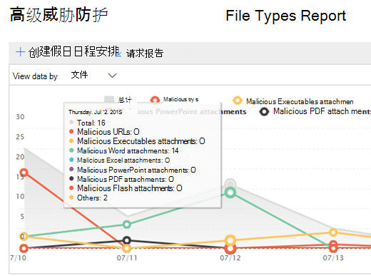

# 查看 Office 365 高级威胁防护报告View reports for Office 365 Advanced Threat Protection

如果您的组织具有[Office 365 高级威胁防护](office-365-atp.md)（ATP），并且您具有[必要的权限](#what-permissions-are-needed-to-view-the-atp-reports)，则可以在安全&amp;合规中心中使用多个 ATP 报告。If your organization has [Office 365 Advanced Threat Protection](office-365-atp.md) (ATP) and you have the [necessary permissions](#what-permissions-are-needed-to-view-the-atp-reports), you can use several ATP reports in the Security &amp; Compliance Center. （转到 "**报表** \> "**仪表板**。）(Go to **Reports** \> **Dashboard**.)

ATP 报告包括以下内容：ATP reports include the following:

- [威胁防护状态Threat Protection Status report](#threat-protection-status-report)
- [ATP 文件类型报告ATP File Types report](#atp-file-types-report)
- [ATP 邮件处置报告ATP Message Disposition report](#atp-message-disposition-report)
- [实时检测或资源管理器](threat-explorer.md)（取决于您是否拥有 OFFICE 365 ATP 计划1或2）either [real-time detections or Explorer](threat-explorer.md) (depending on whether you have Office 365 ATP Plan 1 or 2)
- ...[等等](#additional-reports-to-view)。... [and more](#additional-reports-to-view).

阅读本文，了解有关 ATP 报告以及如何使用它们的概述。Read this article to get an overview of ATP reports and how to use them.

## 威胁防护状态Threat Protection Status report

**威胁防护状态**报告是一个视图，它将有关检测到的恶意内容和恶意电子邮件的信息，以及[Exchange Online Protection](exchange-online-protection-overview.md) （EOP）和 Office 365 ATP （）和[Office ATP](office-365-atp.md)结合在一起。The **Threat Protection Status** report is a single view that brings together information about malicious content and malicious email detected and blocked by [Exchange Online Protection](exchange-online-protection-overview.md) (EOP) and [Office 365 ATP](office-365-atp.md). 此报告可用于查看一段时间内的检测（最多90天），并使安全管理员能够确定趋势或确定策略是否需要调整。This report is useful for viewing detections over time (up to 90 days), and it enables security administrators to identify trends or determine whether policies need adjustments.

该报告提供了包含恶意内容的独特电子邮件的聚合计数，如反恶意软件引擎阻止的文件或网站地址（Url）、[零小时自动清除（ZAP）](zero-hour-auto-purge.md)和 atp 功能（如[atp 安全链接](atp-safe-links.md)、 [atp 安全附件](atp-safe-attachments.md)和[atp 反网络钓鱼](set-up-anti-phishing-policies.md)）。The report provides an aggregated count of unique email messages with malicious content, such as files or website addresses (URLs) that were blocked by the anti-malware engine, [zero-hour auto purge (ZAP)](zero-hour-auto-purge.md), and ATP features like [ATP Safe Links](atp-safe-links.md), [ATP Safe Attachments](atp-safe-attachments.md), and [ATP anti-phishing](set-up-anti-phishing-policies.md).

信息的筛选器和细目允许对此报告中的信息进行更精细的分类。Filters and breakdowns of the information allow for more granular categorizations of the information in this report. 具体来说，**电子邮件** \> **网络钓鱼**和**电子邮件** \> **恶意软件视图**包含 "分解方式" 菜单。Specifically, there is a 'break down by' menu included for **Email** \> **Phish** and **Email** \> **Malware views**. 它会将数据分解为：It will break down the data into:

|||
|---|---|
|按检测类型By detection type|哪些策略有助于捕捉这些威胁？What policy helped catch these threats?|
|按检测技术By detection technology|哪种基本的 Microsoft 技术会发现威胁？What underlying Microsoft technology caught the threat?|
|按传递状态By delivery status|作为威胁检测到的电子邮件发生了什么？What happened to the email messages detected as threats?|
|

> [!TIP]
> 电子邮件 > 网络钓鱼 |恶意软件视图对所示的检测技术有细微的细分，其中类别如*ATP 生成的文件信誉*、*文件沙箱*、 *URL 沙箱*、*反欺骗： DMARC 故障*，例如，有助于准确准确地查明组织要拦截威胁的功能 led。Both the Email > Phish | Malware views have granular breakdowns for the detection technologies shown, with categories like *ATP-generated file reputation*, *File detonation*, *URL detonation*, *Anti-spoof: DMARC failure*, for example, helpful in pinpointing exactly which feature led your organization to catch threats.

这些视图为您提供通过按钮单击（在**电子邮件** \> **网络钓鱼**、**电子邮件** \> **恶意软件**和**内容** \> **恶意软件**视图）中导出的选项。These views give you the option to export, via a button click (in **Email** \> **Phish**, **Email** \> **Malware**, and **Content** \> **Malware** views). 可以在 Excel 中打开导出到您的计算机上的聚合数据。The aggregated data exported to your computer can be opened in Excel.

**注意**：可以为**网络钓鱼**和**恶意软件**导出的最大条目数就是10000。**Note**: The maximum number of entries that can be exported for **Phish** and **Malware** is just under 10000. 如果导出视图，则仅导出最新的10000项。If you export a view, only the most recent 10000 entries are exported.

概述和电子邮件视图将在处理小时数（而不是24小时）内显示信息（请求重新）。The Overview and Emails views will display information within hours of processing rather than in 24 hours (demand re. 此处的提高速度是一个清晰的信号）！increased speeds here has been a clear signal)!

> [!NOTE]
> 拥有[Office 365 ATP](office-365-atp.md)或[Exchange Online Protection](exchange-online-protection-eop.md) （EOP）的客户可以使用威胁防护状态报告;但是，在 ATP 客户的威胁防护状态报告中显示的信息可能包含不同的 EOP 客户可能看到的数据。A Threat Protection Status report is available to customers who have either [Office 365 ATP](office-365-atp.md) or [Exchange Online Protection](exchange-online-protection-eop.md) (EOP); however, the information that is displayed in the Threat Protection Status report for ATP customers will likely contain different data than what EOP customers might see. 例如，ATP 客户的威胁防护状态报告将包含有关[在 SharePoint Online、OneDrive 或 Microsoft 团队中检测到的恶意文件](atp-for-spo-odb-and-teams.md)的信息。For example, the Threat Protection Status report for ATP customers will contain information about [malicious files detected in SharePoint Online, OneDrive, or Microsoft Teams](atp-for-spo-odb-and-teams.md). 此类信息特定于 ATP，因此具有 EOP 但不是 ATP 的客户将不会在其威胁防护状态报告中看到这些详细信息。Such information is specific to ATP, so customers who have EOP but not ATP will not see those details in their Threat Protection Status report.

若要查看威胁防护状态报告，请在[安全&amp;合规性中心](https://protection.office.com)中转到 "**报告** \> "**仪表板** \> **威胁防护状态**。To view the Threat Protection Status report, in the [Security &amp; Compliance Center](https://protection.office.com), go to **Reports** \> **Dashboard** \> **Threat Protection Status**.

若要获取一天的详细状态，请将鼠标悬停在关系图上。To get detailed status for a day, hover over the graph.

默认情况下，威胁防护状态报告显示过去七天的数据。By default, the Threat Protection Status report shows data for the past seven days. 不过，您可以选择 "**筛选器**" 并将日期范围更改为查看最多90天的数据。However, you can choose **Filters** and change the date range to view data for up to 90 days. （如果使用的是试用订阅，则可能限制为30天的数据。）(If you are using a trial subscription, you might be limited to 30 days' of data.)

您还可以使用 "**查看数据依据**" 菜单来更改报表中显示的信息。You can also use the **View data by** menu to change what information is displayed in the report.

## URL 保护状态报告URL Protection Status report

此报告基于每次单击收集的数据和检测到的威胁（而大多数其他电子邮件威胁相关报告针对每个邮件数据）。This report is based data collected, and threats detected, per click (whereas most other email threat related reports are per message data). 此报告旨在显示来自电子邮件和文档中的超链接的威胁，每次单击。This report is designed to show threats that come from hyperlinks in email messages and documents, per click. 有两种视图：There are two views:

|||
|---|---|
|URL 单击保护操作URL click protection action|查看阻止的 Url 的数量、被阻止但被用户通过单击覆盖的 Url，通过用户的单击覆盖和允许。See the number of URLs blocked, blocked but overridden with a click-through by a user, overridden with a click-through by a user, and allowed.|
|按应用程序单击的 URLURL click by application|查看从中单击了 URL 的应用程序。See the application from which the URL was clicked.|
|

在详细信息表中，您将能够看到有关单击时间和用户信息的详细信息。In the details table, you'll be able to see more information regarding click time and user information. 最后，请记住 URL 保护状态报告显示来自 ATP 安全链接功能的保护，因此只有启用了 ATP 安全链接的客户才会看到此报告上反映的数据。Finally, keep in mind the URL Protection Status report shows the protection from ATP Safe Links feature, so only customers who have enabled ATP Safe Links will see data reflected on this report.

> [!NOTE]
> 这是一个 "*保护趋势" 报告*，即数据表示较大数据集中的趋势。This is a *protection trend report*, meaning data represents trends in a larger dataset. 因此，在这里，聚合视图中的数据不是实时提供的，但详细信息表视图中的数据是，因此在这两种视图之间可能会出现细微差异。As a result, the data in the aggregate view is not available in real time here, but the data in the details table view is, so you may see a slight discrepancy between the two views.

## ATP 文件类型报告ATP File Types report

**Atp 文件类型**报告显示通过[ATP 安全附件](atp-safe-attachments.md)检测为恶意的文件类型。The **ATP File Types** report shows you the type of files detected as malicious by [ATP Safe Attachments](atp-safe-attachments.md).

若要查看此报告，请[在&amp;安全合规性中心](https://protection.office.com)中，转到 "**报告** \> "**仪表板** \> **ATP 文件类型**。To view this report, in the [Security &amp; Compliance Center](https://protection.office.com), go to **Reports** \> **Dashboard** \> **ATP File Types**.

  
当您将鼠标悬停在特定的一天时，您可以看到[ATP 安全附件](atp-safe-attachments.md)和[ &amp;反垃圾邮件反恶意软件保护](anti-spam-and-anti-malware-protection.md)检测到的恶意文件的类型细目。When you hover over a particular day, you can see the breakdown of types of malicious files that were detected by [ATP Safe Attachments](atp-safe-attachments.md) and [anti-spam &amp; anti-malware protection](anti-spam-and-anti-malware-protection.md).
  

## ATP 邮件处置报告ATP Message Disposition report

**ATP 邮件处置**报告将向您显示检测为包含恶意内容的电子邮件所采取的操作。The **ATP Message Disposition** report shows you the actions that were taken for email messages that were detected as having malicious content.

若要查看此报告，请[在&amp;安全合规性中心](https://protection.office.com)中，转到 "**报告** \> "**仪表板** \> **ATP 邮件处置**。To view this report, in the [Security &amp; Compliance Center](https://protection.office.com), go to **Reports** \> **Dashboard** \> **ATP Message Disposition**.

当您将鼠标悬停在图表中的某条上时，可以看到在那天中对检测到的电子邮件执行了哪些操作。When you hover over a bar in the chart, you can see what actions were taken for detected email for that day.

## 要查看的其他报告Additional reports to view

除了本文中介绍的 ATP 报告之外，还有几个其他报告可供使用，如下表所述：In addition to the ATP reports described in this article, several other reports are available, as described in the following table:

|||
|---|---|
|**报告****Report(s)**|**详细信息****Details**|
|**浏览器**或**实时检测**：（Office 365 ATP 计划2客户具有资源管理器;Office 365 ATP 计划1客户具有实时检测。**Explorer** or **real-time detections**: (Office 365 ATP Plan 2 customers have Explorer; Office 365 ATP Plan 1 customers have real-time detections.)|[威胁资源管理器（和实时检测）Threat Explorer (and real-time detections)](threat-explorer.md)|
|**电子邮件安全报告**，如主要发件人和收件人报告、欺骗邮件报告和垃圾邮件检测报告。**Email security reports**, such as a Top Senders and Recipients report, a Spoof Mail report, and a Spam Detections report.|[查看安全&amp;合规性中心中的电子邮件安全报告View email security reports in the Security &amp; Compliance Center](view-email-security-reports.md)|
|**ATP 安全链接 URL 跟踪**：（这是使用 PowerShell 生成的报告。）此报告显示过去七（7）天的 ATP 安全链接操作的结果。**ATP Safe Links URL trace**: (This is a report you generate by using PowerShell.) This report shows the results of ATP Safe Links actions over the past seven (7) days.|[UrlTrace cmdlet 参考Get-UrlTrace cmdlet reference](https://docs.microsoft.com/powershell/module/exchange/advanced-threat-protection/get-urltrace)|
|**EOP 和 ATP 结果**：（这是使用 PowerShell 生成的自定义报表）。**EOP and ATP results**: (This is a custom report you generate by using PowerShell). 此报告包含域、日期、事件类型、方向、操作和邮件计数等信息。This report contains information, such as Domain, Date, Event Type, Direction, Action, and Message Count.|[MailTrafficATPReport cmdlet 参考Get-MailTrafficATPReport cmdlet reference](https://docs.microsoft.com/powershell/module/exchange/advanced-threat-protection/get-mailtrafficatpreport)|
|**EOP 和 ATP 检测**：（这是使用 PowerShell 生成的自定义报告）。**EOP and ATP detections**: (This is a custom report you generate by using PowerShell). 此报告包含有关电子邮件或文件中的恶意文件或 Url、网络钓鱼企图、模拟和其他潜在威胁的详细信息。This report contains details about malicious files or URLs, phishing attempts, impersonation, and other potential threats in email or files.|[MailDetailATPReport cmdlet 参考Get-MailDetailATPReport cmdlet reference](https://docs.microsoft.com/powershell/module/exchange/advanced-threat-protection/get-maildetailatpreport)|
|

## 查看 ATP 报告所需的权限是什么？What permissions are needed to view the ATP reports?

为了查看和使用本文中介绍的报告，**必须为安全&amp;合规中心和 Exchange 管理中心分配适当的角色**。In order to view and use the reports described in this article, **you must have an appropriate role assigned for both the Security &amp; Compliance Center and the Exchange admin center**.

- 对于安全&amp;合规中心，您必须具有以下分配的角色之一：For the Security &amp; Compliance Center, you must have one of the following roles assigned:

  - 组织管理Organization Management
  - 安全管理员（可在 Azure Active Directory 管理中心中分配（[https://aad.portal.azure.com](https://aad.portal.azure.com)））Security Administrator (this can be assigned in the Azure Active Directory admin center ([https://aad.portal.azure.com](https://aad.portal.azure.com)))
  - 安全操作员（可在 Azure Active Directory 管理中心中分配（[https://aad.portal.azure.com](https://aad.portal.azure.com)））Security Operator (this can be assigned in the Azure Active Directory admin center ([https://aad.portal.azure.com](https://aad.portal.azure.com)))
  - 安全读取者Security Reader

- 对于 Exchange Online，必须在 Exchange 管理中心（[https://outlook.office365.com/ecp](https://outlook.office365.com/ecp)）或 PowerShell cmdlet 中分配以下角色之一（请参阅[Exchange Online PowerShell](https://docs.microsoft.com/powershell/exchange/exchange-online/exchange-online-powershell)）：For Exchange Online, you must have one of the following roles assigned in either the Exchange admin center ([https://outlook.office365.com/ecp](https://outlook.office365.com/ecp)) or with PowerShell cmdlets (See [Exchange Online PowerShell](https://docs.microsoft.com/powershell/exchange/exchange-online/exchange-online-powershell)):

  - 组织管理Organization Management
  - 仅限查看组织管理View-only Organization Management
  - “仅供查看收件人”角色View-Only Recipients role
  - 合规性管理Compliance Management

若要了解详细信息，请参阅以下资源：To learn more, see the following resources:

- [安全&amp;合规性中心中的权限Permissions in the Security &amp; Compliance Center](permissions-in-the-security-and-compliance-center.md)

- [Exchange Online 中的功能权限Feature permissions in Exchange Online](https://docs.microsoft.com/exchange/permissions-exo/feature-permissions)

## 如果报告不显示数据，该怎么办？What if the reports aren't showing data?

如果您未在 ATP 报告中看到数据，请仔细检查您的策略设置是否正确。If you are not seeing data in your ATP reports, double-check that your policies are set up correctly. 您的组织必须定义[Atp 安全链接策略](set-up-atp-safe-links-policies.md)和[atp 安全附件策略](set-up-atp-safe-attachments-policies.md)，以便将 ATP 保护设置到位。Your organization must have [ATP Safe Links policies](set-up-atp-safe-links-policies.md) and [ATP Safe Attachments policies](set-up-atp-safe-attachments-policies.md) defined in order for ATP protection to be in place. 另请参阅[Office 365 中的反垃圾邮件和反恶意软件保护](anti-spam-and-anti-malware-protection.md)。Also see [Anti-spam and anti-malware protection in Office 365](anti-spam-and-anti-malware-protection.md).

## 相关主题Related topics

[安全&amp;合规中心中的报告和见解Reports and insights in the Security &amp; Compliance Center](reports-and-insights-in-security-and-compliance.md)
  
[在安全&amp;合规中心中创建报表的日程安排Create a schedule for a report in the Security &amp; Compliance Center](create-a-schedule-for-a-report.md)

[在安全&amp;合规中心中设置和下载自定义报告Set up and download a custom report in the Security &amp; Compliance Center](set-up-and-download-a-custom-report.md)

[角色权限（Azure Active DirectoryRole permissions (Azure Active Directory](https://docs.microsoft.com/azure/active-directory/users-groups-roles/directory-assign-admin-roles#role-permissions)
