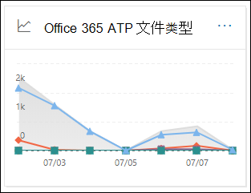
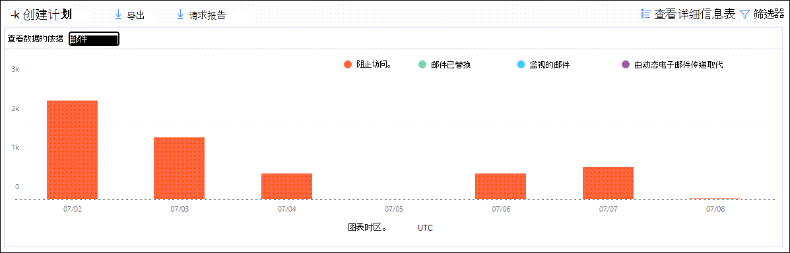
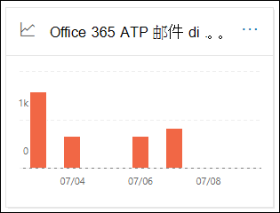

# 查看 Office 365 高级威胁防护报告View reports for Office 365 Advanced Threat Protection

Office 365 高级威胁防护 (ATP) 组织 (例如，Microsoft 365 E5 订阅或 ATP Plan 1 或 ATP Plan 2 加载项) 包含各种与安全相关的报告。Office 365 Advanced Threat Protection (ATP) organizations (for example, Microsoft 365 E5 subscriptions or ATP Plan 1 or ATP Plan 2 add-ons) contain a variety of security-related reports. 如果您具有[必要的权限](#what-permissions-are-needed-to-view-the-atp-reports)，则可以转到 "**报告**" \> **仪表板**，在安全 & 合规中心中查看这些报告。If you have the [necessary permissions](#what-permissions-are-needed-to-view-the-atp-reports), you can view these reports in the Security & Compliance Center by going to **Reports** \> **Dashboard**. 若要直接转到 "报表" 仪表板，请打开 <https://protection.office.com/insightdashboard> 。To go directly to the Reports dashboard, open <https://protection.office.com/insightdashboard>.

## 高级威胁防护文件类型报告Advanced Threat Protection file types report

**高级威胁防护文件类型报告**报告显示通过[ATP 安全附件](atp-safe-attachments.md)检测为恶意的文件类型。The **Advanced Threat Protection file types report** report shows you the type of files detected as malicious by [ATP Safe Attachments](atp-safe-attachments.md).

 报告的聚合视图允许在筛选过程中90天，而详细信息视图仅允许10天的筛选。The aggregate view of the report allows for 90 days of filtering, while the detail view only allows for 10 days of filtering.

若要查看报告，请打开 "[安全 & 合规中心](https://protection.office.com)"，转到 "**报告**" \> **仪表板**，然后选择 " **Office ATP 文件类型**"。To view the report, open the [Security & Compliance Center](https://protection.office.com), go to **Reports** \> **Dashboard** and select **Office ATP file types**. 若要直接转到报表，请打开 <https://protection.office.com/reportv2?id=ATPFileReport> 。To go directly to the report, open <https://protection.office.com/reportv2?id=ATPFileReport>.

> [!NOTE]
> [高级威胁防护邮件处置报告](#advanced-threat-protection-message-disposition-report)中也提供了此报告中的信息。The information in this report is also available in the [Advanced Threat Protection message disposition report](#advanced-threat-protection-message-disposition-report).

### 高级威胁防护文件类型报告的报告视图Report view for the Advanced Threat Protection file types report

可以使用以下视图：The following views are available:

- **数据查看依据：文件**：图表包含以下信息：**View data by: File**: The chart contains the following information:

  - **恶意 Excel 附件****Malicious Excel attachments**
  - **恶意 Flash 附件****Malicious Flash attachments**
  - **恶意 PDF 附件****Malicious PDF attachments**
  - **恶意 PowerPoint 附件****Malicious PowerPoint attachments**
  - **恶意 Url****Malicious URLs**
  - **恶意 Word 附件****Malicious Word attachments**
  - **恶意可执行附件****Malicious executable attachments**
  - **其他****Others**

  当您将鼠标悬停在特定日期 (数据点) 时，您可以通过 EOP 中的[ATP 安全附件](atp-safe-attachments.md)和[反恶意软件保护](anti-malware-protection.md)来查看检测到的恶意文件类型的细目。When you hover over a particular day (data point), you can see the breakdown of types of malicious files that were detected by [ATP Safe Attachments](atp-safe-attachments.md) and [anti-malware protection in EOP](anti-malware-protection.md).

  

  如果单击 "**筛选器**"，则可以使用以下筛选器修改报表：If you click **Filters**, you can modify the report with the following filters:

  - **开始日期**和**结束日期****Start date** and **End date**
  - 图表中显示的相同文件类型值。The same file type values that are visible in the chart.

- **数据查看依据：消息**：图表包含以下信息：**View data by: Message**: The chart contains the following information:

  - **阻止访问****Block access**
  - **邮件已替换****Messages replaced**
  - **监视的邮件****Messages monitored**
  - **替换为动态电子邮件传递**：有关详细信息，请参阅[使用 ATP 安全附件进行动态传递和预览](dynamic-delivery-and-previewing.md)。**Replaced by Dynamic Email Delivery**: For more information, see [Dynamic Delivery and previewing with ATP Safe Attachments](dynamic-delivery-and-previewing.md).

  

  如果单击 "**筛选器**"，则可以使用以下筛选器修改报表：If you click **Filters**, you can modify the report with the following filters:

  - **开始日期**和**结束日期****Start date** and **End date**
  - 图表中可用的相同邮件处置值，以及传递的其他**邮件**值。The same message disposition values that are available in the chart, and the additional **Messages passed** value.

### 高级威胁防护文件类型报告的详细信息表格视图Details table view for the Advanced Threat Protection file types report

如果单击 "**查看详细信息表**"，则报告将提供最近10天内组织内发生的所有点击的近实时视图。If you click **View details table**, the report provides a near-real-time view of all clicks that happen within the organization for the last 10 days. 显示的信息取决于您所查看的图表：The information that's shown depends on the chart you were looking at:

- **数据查看依据：文件**：**View data by: File**:

  - **Date****Date**
  - **收件人地址****Recipient address**
  - **发件人地址****Sender address**
  - **邮件 id**：在邮件头的**邮件 id**标头字段中可用，并且应是唯一的。**Message ID**: Available in the **Message-ID** header field in the message header and should be unique.  (的示例值 `<08f1e0f6806a47b4ac103961109ae6ef@server.domain>` 记下尖括号) 。An example value is `<08f1e0f6806a47b4ac103961109ae6ef@server.domain>` (note the angle brackets).
  - **File****File**

  如果单击 "**筛选器**"，则可以使用以下筛选器修改报表：If you click **Filters**, you can modify the report with the following filters:

  - **开始日期**和**结束日期****Start date** and **End date**
  - 图表中显示的相同文件类型值。The same file type values that are visible in the chart.

- **数据查看依据：消息**：**View data by: Message**:

  - **Date****Date**
  - **收件人地址****Recipient address**
  - **发件人地址****Sender address**
  - **邮件 ID****Message ID**
  - **File****File**
  - **主题****Subject**

  如果单击 "**筛选器**"，则可以使用以下筛选器修改结果：If you click **Filters**, you can modify the results with the following filters:

  - **开始日期**和**结束日期****Start date** and **End date**
  - 图表中可用的相同邮件处置值，以及传递的其他**邮件**值。The same message disposition values that are available in the chart, and the additional **Messages passed** value.

若要返回到 "报告" 视图，请单击 "**查看报告**"。To get back to the reports view, click **View report**.

## 高级威胁防护邮件处置报告Advanced Threat Protection message disposition report

**ATP 邮件处置**报告将向您显示检测为包含恶意内容的电子邮件所采取的操作。The **ATP Message Disposition** report shows you the actions that were taken for email messages that were detected as having malicious content.

若要查看报告，请打开 "[安全 & 合规中心](https://protection.office.com)"，转到 "**报告**" \> **仪表板**，然后选择 " **Office ATP 邮件处置**"。To view the report, open the [Security & Compliance Center](https://protection.office.com), go to **Reports** \> **Dashboard** and select **Office ATP message disposition**. 若要直接转到报表，请打开 <https://protection.office.com/reportv2?id=ATPMessageReport> 。To go directly to the report, open <https://protection.office.com/reportv2?id=ATPMessageReport>.

> [!NOTE]
> [高级威胁防护文件类型报告](#advanced-threat-protection-file-types-report)中也提供了此报告中的信息。The information in this report is also available in the [Advanced Threat Protection file types report](#advanced-threat-protection-file-types-report).

### 高级威胁防护邮件处置报告的报告视图Report view for the Advanced Threat Protection message disposition report

可以使用以下视图：The following views are available:

- **数据查看依据：消息**：图表包含以下信息：**View data by: Message**: The chart contains the following information:

  - **阻止访问****Block access**
  - **邮件已替换****Messages replaced**
  - **监视的邮件****Messages monitored**
  - **替换为动态电子邮件传递**：有关详细信息，请参阅[使用 ATP 安全附件进行动态传递和预览](dynamic-delivery-and-previewing.md)。**Replaced by Dynamic Email Delivery**: For more information, see [Dynamic Delivery and previewing with ATP Safe Attachments](dynamic-delivery-and-previewing.md).

  

  如果单击 "**筛选器**"，则可以使用以下筛选器修改报表：If you click **Filters**, you can modify the report with the following filters:

  - **开始日期**和**结束日期****Start date** and **End date**
  - 图表中可用的相同邮件处置值，以及传递的其他**邮件**值。The same message disposition values that are available in the chart, and the additional **Messages passed** value.

- **数据查看依据：文件**：图表包含以下信息：**View data by: File**: The chart contains the following information:

  - **恶意 Excel 附件****Malicious Excel attachments**
  - **恶意 Flash 附件****Malicious Flash attachments**
  - **恶意 PDF 附件****Malicious PDF attachments**
  - **恶意 PowerPoint 附件****Malicious PowerPoint attachments**
  - **恶意 Url****Malicious URLs**
  - **恶意 Word 附件****Malicious Word attachments**
  - **恶意可执行附件****Malicious executable attachments**
  - **其他****Others**

  当您将鼠标悬停在特定日期 (数据点) 时，您可以通过 EOP 中的[ATP 安全附件](atp-safe-attachments.md)和[反恶意软件保护](anti-malware-protection.md)来查看检测到的恶意文件类型的细目。When you hover over a particular day (data point), you can see the breakdown of types of malicious files that were detected by [ATP Safe Attachments](atp-safe-attachments.md) and [anti-malware protection in EOP](anti-malware-protection.md).

  

  如果单击 "**筛选器**"，则可以使用以下筛选器修改报表：If you click **Filters**, you can modify the report with the following filters:

  - **开始日期**和**结束日期****Start date** and **End date**
  - 图表中显示的相同文件类型值。The same file type values that are visible in the chart.

### 高级威胁防护邮件处置报告的详细信息表格视图Details table view for the Advanced Threat Protection message disposition report

如果单击 "**查看详细信息表**"，则报告将提供最近10天内组织内发生的所有点击的近实时视图。If you click **View details table**, the report provides a near-real-time view of all clicks that happen within the organization for the last 10 days. 显示的信息取决于您所查看的图表：The information that's shown depends on the chart you were looking at:

- **数据查看依据：消息**：**View data by: Message**:

  - **Date****Date**
  - **收件人地址****Recipient address**
  - **发件人地址****Sender address**
  - **邮件 ID****Message ID**
  - **File****File**
  - **主题****Subject**

  如果单击 "**筛选器**"，则可以使用以下筛选器修改结果：If you click **Filters**, you can modify the results with the following filters:

  - **开始日期**和**结束日期****Start date** and **End date**
  - 图表中可用的相同邮件处置值，以及传递的其他**邮件**值。The same message disposition values that are available in the chart, and the additional **Messages passed** value.

- **数据查看依据：文件**：**View data by: File**:

  - **Date****Date**
  - **收件人地址****Recipient address**
  - **发件人地址****Sender address**
  - **邮件 ID****Message ID**
  - **File****File**

  如果单击 "**筛选器**"，则可以使用以下筛选器修改报表：If you click **Filters**, you can modify the report with the following filters:

  - **开始日期**和**结束日期****Start date** and **End date**
  - 图表中显示的相同文件类型值。The same file type values that are visible in the chart.

若要返回到 "报告" 视图，请单击 "**查看报告**"。To get back to the reports view, click **View report**.

## 威胁防护状态报告Threat protection status report

**威胁防护状态**报告是一个单一视图，它将有关检测到的恶意内容和恶意电子邮件的信息，以及[Exchange ONLINE protection](exchange-online-protection-overview.md) (EOP) 和 Office 365 ATP 进行了阻止。The **Threat protection status** report is a single view that brings together information about malicious content and malicious email detected and blocked by [Exchange Online Protection](exchange-online-protection-overview.md) (EOP) and Office 365 ATP. 有关详细信息，请参阅[威胁防护状态报告](view-email-security-reports.md#threat-protection-status-report)。For more information, see [Threat protection status report](view-email-security-reports.md#threat-protection-status-report).

## URL 威胁防护报告URL threat protection report

**Url 威胁防护报告**提供了检测到的威胁的汇总和趋势视图，以及对 URL 单击执行的操作作为[ATP 安全链接](atp-safe-links.md)的一部分。The **URL threat protection report** provides summary and trend views for threats detected and actions taken on URL clicks as part of [ATP Safe Links](atp-safe-links.md). 此报告将不会从用户处单击 "数据"，即应用了 "安全链接策略" 的用户已选中 "不**跟踪用户点击**" 选项。This report will not have click data from users where the Safe Links policy applied has the **Do not track user clicks** option selected.

若要查看报告，请打开[安全性 & 合规性中心](https://protection.office.com)，转到 "**报告**" \> **仪表板**，然后选择 " **URL 保护报告**"。To view the report, open the [Security & Compliance Center](https://protection.office.com), go to **Reports** \> **Dashboard** and select **URL protection report**. 若要直接转到报表，请打开 <https://protection.office.com/reportv2?id=URLProtectionActionReport> 。To go directly to the report, open <https://protection.office.com/reportv2?id=URLProtectionActionReport>.

> [!NOTE]
> 这是一个 "*保护趋势" 报告*，即数据表示较大数据集中的趋势。This is a *protection trend report*, meaning data represents trends in a larger dataset. 因此，在这里，聚合视图中的数据不是实时提供的，但详细信息表视图中的数据是，因此在这两种视图之间可能会出现细微差异。As a result, the data in the aggregate view is not available in real time here, but the data in the details table view is, so you may see a slight discrepancy between the two views.

### URL 威胁防护报告的报告视图Report view for the URL threat protection report

**URL 威胁防护**报告包含两个聚合视图，每四个小时刷新一次，显示最近90天的数据：The **URL threat protection** report has two aggregated views that are refreshed once every four hours that shows data for the last 90 days:

- **URL 单击 "保护操作**"：显示组织中的用户单击的 url 的数量以及单击的结果：**URL click protection action**: Shows the number of URL clicks by users in the organization and the results of the click:

  - **阻止 (阻止**用户导航到 URL) **Blocked** (the user was blocked from navigating to the URL)
  - **阻止并单击****Blocked and clicked through**
  - **在扫描过程中单击****Clicked through during scan**

  单击指示用户已通过阻止页面单击了恶意网站， (管理员可以禁用 "安全链接策略") 中的 "单击"。A click indicates that the user has clicked through the block page to the malicious website (admins can disable click through in Safe Links policies).

  如果单击 "**筛选器**"，则可以使用以下筛选器修改报表：If you click **Filters**, you can modify the report with the following filters:

  - **开始日期**和**结束日期****Start date** and **End date**
  - 可用的单击保护操作加上 (**允许**用户导航到 URL) 的值。The available click protection actions, plus the value **Allowed** (the user was allowed to navigate to the URL).

  

- **URL 单击应用程序**：显示支持 OFFICE 365 ATP 安全链接的应用程序的 url 单击次数：**URL click by application**: Shows the number of URL clicks by applications that support Office 365 ATP Safe Links:

  - **电子邮件客户端****Email client**
  - **PowerPoint****PowerPoint**
  - **Word****Word**
  - **Excel****Excel**
  - **OneNote****OneNote**
  - **Visio****Visio**
  - **Teams****Teams**
  - **其他****Other**

  如果单击 "**筛选器**"，则可以使用以下筛选器修改报表：If you click **Filters**, you can modify the report with the following filters:

  - **开始日期**和**结束日期****Start date** and **End date**
  - 可用的应用程序。The available applications.

### URL 威胁防护报告的详细信息表格视图Details table view for the URL threat protection report

如果单击 "**查看详细信息表**"，则报告将提供最近7天内在组织内发生的所有点击的近实时视图，并提供以下详细信息：If you click **View details table**, the report provides a near-real-time view of all clicks that happen within the organization for the last 7 days with the following details:

- **单击 "时间"****Click time**
- **用户****User**
- **URL****URL**
- **操作****Action**
- **App****App**

如果单击 "详细信息表" 视图中的 "**筛选器**"，则可以按与报表视图中相同的条件进行筛选，也可以按逗号分隔的**域**或**收件人**进行筛选。If you click **Filters** in the details table view, you can filter by the same criteria as in the report view, and also by **Domains** or **Recipients** separated by commas.

若要返回到 "报告" 视图，请单击 "**查看报告**"。To get back to the reports view, click **View report**.

## 要查看的其他报告Additional reports to view

除了本主题中所述的 ATP 报告之外，还有几个其他报告可供使用，如下表所述：In addition to the ATP reports described in this topic, several other reports are available, as described in the following table:

****

|报告Report|主题Topic|
|---|---|
|**资源管理器** (atp plan 2) 或 (ATP plan 1) 的**实时检测****Explorer** (ATP Plan 2) or **real-time detections** (ATP Plan 1)|[威胁资源管理器（和实时检测）Threat Explorer (and real-time detections)](threat-explorer.md)|
|**电子邮件安全报告**，如主要发件人和收件人报告、欺骗邮件报告和垃圾邮件检测报告。**Email security reports**, such as the Top senders and recipients report, the Spoof mail report, and the Spam detections report.|[查看安全与合规中心内的电子邮件安全报告View email security reports in the Security & Compliance Center](view-email-security-reports.md)|
|**邮件流报告**，例如转发报告、邮件流状态报告和主要发件人和收件人报告。**Mail flow reports**, such as the Forwarding report, the Mailflow status report, and the Top senders and recipients report.|[查看安全 & 合规性中心中的邮件流报告View mail flow reports in the Security & Compliance Center](view-mail-flow-reports.md)|
|**ATP 安全链接的 URL 跟踪**仅 (PowerShell) 。**URL trace for ATP Safe Links** (PowerShell only). 此 cmdlet 的输出显示在过去七天内 ATP 安全链接操作的结果。The output of this cmdlet shows you the results of ATP Safe Links actions over the past seven days.|[UrlTraceGet-UrlTrace](https://docs.microsoft.com/powershell/module/exchange/get-urltrace)|
|仅) **的 EOP 和 ATP (PowerShell 的邮件流量结果**。**Mail traffic results for EOP and ATP** (PowerShell only). 此 cmdlet 的输出包含有关域、日期、事件类型、方向、操作和邮件计数的信息。The output of this cmdlet contains information about Domain, Date, Event Type, Direction, Action, and Message Count.|[MailTrafficATPReportGet-MailTrafficATPReport](https://docs.microsoft.com/powershell/module/exchange/get-mailtrafficatpreport)|
|仅 (PowerShell) 中**的 EOP 和 ATP 检测的邮件详细信息报告**。**Mail detail reports for EOP and ATP detections** (PowerShell only). 此 cmdlet 的输出包含有关恶意文件或 Url、网络钓鱼企图、模拟以及电子邮件或文件中的其他潜在威胁的详细信息。The output of this cmdlet contains details about malicious files or URLs, phishing attempts, impersonation, and other potential threats in email or files.|[MailDetailATPReportGet-MailDetailATPReport](https://docs.microsoft.com/powershell/module/exchange/get-maildetailatpreport)|
|

## 查看 ATP 报告所需的权限是什么？What permissions are needed to view the ATP reports?

为了查看和使用本主题中所述的报告，**必须为安全 &amp; 合规中心和 Exchange 管理中心分配适当的角色**。In order to view and use the reports described in this topic, **you must have an appropriate role assigned for both the Security &amp; Compliance Center and the Exchange admin center**.

- 对于 "安全 & 合规中心"，您必须具有以下分配的角色之一：For the Security & Compliance Center, you must have one of the following roles assigned:

  - 组织管理Organization Management
  - 安全管理员 (可以在 Azure Active Directory 管理中心 (中分配此项 [https://aad.portal.azure.com](https://aad.portal.azure.com)) # A3Security Administrator (this can be assigned in the Azure Active Directory admin center ([https://aad.portal.azure.com](https://aad.portal.azure.com)))
  -  (可以在 Azure Active Directory 管理中心中分配安全操作员 ([https://aad.portal.azure.com](https://aad.portal.azure.com)) # A3Security Operator (this can be assigned in the Azure Active Directory admin center ([https://aad.portal.azure.com](https://aad.portal.azure.com)))
  - 安全读取者Security Reader

- 对于 Exchange Online，必须在 Exchange 管理中心 () 或 PowerShell cmdlet 中分配以下角色之一 [https://outlook.office365.com/ecp](https://outlook.office365.com/ecp) (请参阅[Exchange Online PowerShell](https://docs.microsoft.com/powershell/exchange/exchange-online-powershell)) ：For Exchange Online, you must have one of the following roles assigned in either the Exchange admin center ([https://outlook.office365.com/ecp](https://outlook.office365.com/ecp)) or with PowerShell cmdlets (See [Exchange Online PowerShell](https://docs.microsoft.com/powershell/exchange/exchange-online-powershell)):

  - 组织管理Organization Management
  - 仅限查看组织管理View-only Organization Management
  - “仅供查看收件人”角色View-Only Recipients role
  - 合规性管理Compliance Management

若要了解详细信息，请参阅以下资源：To learn more, see the following resources:

- [安全与合规中心内的权限Permissions in the Security & Compliance Center](permissions-in-the-security-and-compliance-center.md)

- [Exchange Online 中的功能权限Feature permissions in Exchange Online](https://docs.microsoft.com/exchange/permissions-exo/feature-permissions)

## 如果报告不显示数据，该怎么办？What if the reports aren't showing data?

如果您未在 ATP 报告中看到数据，请仔细检查您的策略设置是否正确。If you are not seeing data in your ATP reports, double-check that your policies are set up correctly. 您的组织必须定义[Atp 安全链接策略](set-up-atp-safe-links-policies.md)和[atp 安全附件策略](set-up-atp-safe-attachments-policies.md)，以便将 ATP 保护设置到位。Your organization must have [ATP Safe Links policies](set-up-atp-safe-links-policies.md) and [ATP Safe Attachments policies](set-up-atp-safe-attachments-policies.md) defined in order for ATP protection to be in place. 另请参阅[Office 365 中的反垃圾邮件和反恶意软件保护](anti-spam-and-anti-malware-protection.md)。Also see [Anti-spam and anti-malware protection in Office 365](anti-spam-and-anti-malware-protection.md).

## 相关主题Related topics

[安全与合规中心内的智能报告和见解Smart reports and insights in the Security & Compliance Center](reports-and-insights-in-security-and-compliance.md)
  
[Azure Active Directory (角色权限Role permissions (Azure Active Directory](https://docs.microsoft.com/azure/active-directory/users-groups-roles/directory-assign-admin-roles#role-permissions)
