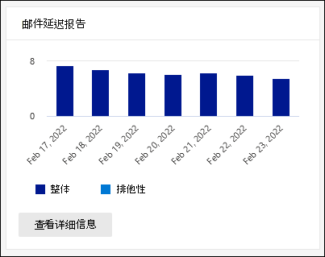

# 在安全与合规中心的报告仪表板中查看 Defender for Office 365 &报告

[!INCLUDE [Microsoft 365 Defender rebranding](../includes/microsoft-defender-for-office.md)]

**适用对象**
- [Microsoft Defender for Office 365 计划 1 和计划 2](office-365-atp.md)
- [Microsoft 365 Defender](../mtp/microsoft-threat-protection.md)

Microsoft Defender for Office 365 组织 (例如，Microsoft 365 E5 订阅或 Microsoft Defender for Office 365 计划 1 或 Microsoft Defender for Office 365 计划 2 加载项) 包含各种与安全相关的报告。 如果您具有 [必要的权限](#what-permissions-are-needed-to-view-the-defender-for-office-365-reports)，可以通过访问报告仪表板&安全与合规中心 **查看** \> **这些报告**。 若要直接转到报表仪表板，请打开 <https://protection.office.com/insightdashboard> 。

## Defender for Office 365 文件类型报告

Defender **for Office 365** 文件类型报告显示安全附件检测到的恶意 [文件类型](atp-safe-attachments.md)。

 报告的聚合视图允许筛选 90 天，而详细信息视图仅允许筛选 10 天。

若要查看报告，请打开 [安全](https://protection.office.com)与合规&，转到"报告仪表板"，然后选择 \> 适用于 Office **365** 的 Defender 文件类型。 若要直接转到报表，请打开 <https://protection.office.com/reportv2?id=ATPFileReport> 。

> [!NOTE]
> 此报告中的信息也可在 Defender for [Office 365 邮件处置报告中获取](#defender-for-office-365-message-disposition-report)。

### Defender for Office 365 文件类型报告的报表视图

以下视图可用：

- **查看数据者：文件**：图表包含以下信息：

  - **恶意 Excel 附件**
  - **恶意 Flash 附件**
  - **恶意 PDF 附件**
  - **恶意 PowerPoint 附件**
  - **恶意 URL**
  - **恶意 Word 附件**
  - **恶意可执行附件**
  - **其他**

  当您将鼠标悬停在 (数据点) 时，可以看到 EOP 中安全附件和反恶意软件保护检测到的恶意文件类型[的细目](anti-malware-protection.md)。 

  

  如果单击 **"筛选器**"，可以使用以下筛选器修改报告：

  - **开始日期和****结束日期**
  - 图表中可见的相同文件类型值。

- **查看数据者：消息**：图表包含以下信息：

  - **阻止访问**
  - **已替换邮件**
  - **监视的邮件**
  - **替换为动态电子邮件传递**：有关详细信息，请参阅"安全附件 [策略中的动态传递"。](atp-safe-attachments.md#dynamic-delivery-in-safe-attachments-policies)

  

  如果单击 **"筛选器**"，可以使用以下筛选器修改报告：

  - **开始日期和****结束日期**
  - 图表中可用的相同邮件处置值，以及传递 **值的其他邮件** 。

### Defender for Office 365 文件类型报告的详细信息表视图

如果单击 **"查看详细信息"表**，报告将提供最近 10 天内在组织中发生的所有单击的近实时视图。 显示的信息取决于您正在查看的图表：

- **查看数据者：文件**：

  - "日期"
  - **收件人地址**
  - **发件人地址**
  - **邮件 ID：** 在邮件 **头的 Message-ID** 头字段中可用，并且应该是唯一的。 示例值是 (`<08f1e0f6806a47b4ac103961109ae6ef@server.domain>` 中括号) 。
  - **File**

  如果单击 **"筛选器**"，可以使用以下筛选器修改报告：

  - **开始日期和****结束日期**
  - 图表中可见的相同文件类型值。

- **查看数据者：消息**：

  - "日期"
  - **收件人地址**
  - **发件人地址**
  - **邮件 ID**
  - **File**
  - **主题**

  如果单击 **"筛选器**"，可以使用以下筛选器修改结果：

  - **开始日期和****结束日期**
  - 图表中可用的相同邮件处置值，以及传递 **值的其他邮件** 。

若要返回到报告视图，请单击"**查看报告"。**

## Defender for Office 365 邮件处置报告

**ATP 邮件处置** 报告将显示对检测到包含恶意内容的电子邮件采取的操作。

若要查看报告，请打开 [安全](https://protection.office.com)与合规&，转到报告 \> **仪表板** 并选择 Defender for Office **365 邮件处置**。 若要直接转到报表，请打开 <https://protection.office.com/reportv2?id=ATPMessageReport> 。

> [!NOTE]
> 此报告中的信息也可在 Defender for [Office 365 文件类型报告中获取](#defender-for-office-365-file-types-report)。

### Defender for Office 365 邮件处置报告的报告视图

以下视图可用：

- **查看数据者：消息**：图表包含以下信息：

  - **阻止访问**
  - **已替换邮件**
  - **监视的邮件**
  - **替换为动态电子邮件传递**：有关详细信息，请参阅"安全附件 [策略中的动态传递"。](atp-safe-attachments.md#dynamic-delivery-in-safe-attachments-policies)

  

  如果单击 **"筛选器**"，可以使用以下筛选器修改报告：

  - **开始日期和****结束日期**
  - 图表中可用的相同邮件处置值，以及传递 **值的其他邮件** 。

- **查看数据者：文件**：图表包含以下信息：

  - **恶意 Excel 附件**
  - **恶意 Flash 附件**
  - **恶意 PDF 附件**
  - **恶意 PowerPoint 附件**
  - **恶意 URL**
  - **恶意 Word 附件**
  - **恶意可执行附件**
  - **其他**

  当您将鼠标悬停在 (数据点) 时，可以看到 EOP 中安全附件和反恶意软件保护检测到的恶意文件类型[的细目](anti-malware-protection.md)。 

  

  如果单击 **"筛选器**"，可以使用以下筛选器修改报告：

  - **开始日期和****结束日期**
  - 图表中可见的相同文件类型值。

### Defender for Office 365 邮件处置报告的详细信息表视图

如果单击 **"查看详细信息"表**，报告将提供最近 10 天内在组织中发生的所有单击的近实时视图。 显示的信息取决于您正在查看的图表：

- **查看数据者：消息**：

  - "日期"
  - **收件人地址**
  - **发件人地址**
  - **邮件 ID**
  - **File**
  - **主题**

  如果单击 **"筛选器**"，可以使用以下筛选器修改结果：

  - **开始日期和****结束日期**
  - 图表中可用的相同邮件处置值，以及传递 **值的其他邮件** 。

- **查看数据者：文件**：

  - "日期"
  - **收件人地址**
  - **发件人地址**
  - **邮件 ID**
  - **File**

  如果单击 **"筛选器**"，可以使用以下筛选器修改报告：

  - **开始日期和****结束日期**
  - 图表中可见的相同文件类型值。

若要返回到报告视图，请单击"**查看报告"。**

## 邮件延迟报告

邮件 **延迟报告** 显示组织中遇到的邮件传递和触发延迟的聚合视图。 服务中的邮件传递时间受多种因素影响，绝对传递时间（以秒表示）通常不是成功或出现问题的良好指示器。 一天中较慢的送达时间可能被视为另一天的平均送达时间，反之亦然。 邮件 **延迟报告** 尝试根据有关其他邮件的观测送达时间的统计数据来限定邮件传递：

- **第 50** 个百分点：这是邮件传递时间中间值。 可以将此值视为平均送达时间。
- **第 90** 个百分点：这表示邮件传递的延迟时间长。 只有 10% 的邮件传递时间超过此值。
- **第 99** 个百分点：这表示邮件传递的延迟最大。

不包括客户端和网络延迟。

若要查看报告，请打开 [安全](https://protection.office.com)与合规&，**转到"** 报告仪表板 \> "并选择 **"邮件延迟报告"。** 若要直接转到报表，请打开 <https://protection.office.com/mailLatencyReport?viewid=P50> 。

### 邮件延迟报告的报告视图

打开报表时，默认情况下会选择 **第 50** 个百分点选项卡。

默认情况下，此视图包含使用以下筛选器配置的图表：

- **日期**：最近 7 天
- **消息视图**：
  - 触发的邮件

此图表显示按以下类别组织的消息：

- **邮件传递延迟**
- **触发延迟**

将鼠标悬停在图表中的类别上时，可以看到每个类别中的延迟细分。

如果 **单击"** 筛选器"报表视图，可以使用以下筛选器修改结果：

- 所有邮件
- 包含附件或 URL 的邮件

如果单击第 **90** 个百分点值选项卡或 **第 99** 个百分点选项卡，则使用第 **50** 个百分点视图中的相同默认筛选器。

### 邮件延迟报告的详细信息表视图

详细信息表视图中显示了以下信息：

- "日期"
- **百分点值**
- **邮件计数**
- **总体延迟**

以上显示，11 月 14 日，所有传递和触发的邮件的平均延迟为 **108.033** 秒。

详细信息表包含每个选项卡上的相同信息。

## 威胁防护状态报告

威胁 **防护状态** 报告是一个视图，它汇集 [了 Exchange Online Protection](exchange-online-protection-overview.md) (EOP) 和 Microsoft Defender for Office 365 检测并阻止的恶意内容和恶意电子邮件的信息。 有关详细信息，请参阅 [威胁防护状态报告](view-email-security-reports.md#threat-protection-status-report)。

## URL 威胁防护报告

URL **威胁防护报告** 提供检测到的威胁的摘要和趋势视图，以及作为安全链接的一部分对 URL 单击 [采取的操作](atp-safe-links.md)。 此报告不会包含已选择"不跟踪用户单击"选项且应用了安全链接策略的用户 **的单击** 数据。

若要查看报告，请打开 [安全](https://protection.office.com)与合规&，转到 **报告** \> **仪表板** 并选择 **URL 保护报告**。 若要直接转到报表，请打开 <https://protection.office.com/reportv2?id=URLProtectionActionReport> 。

> [!NOTE]
> 这是一 *个保护趋势报告*，表示数据表示较大数据集中的趋势。 因此，聚合视图中的数据在此处无法实时使用，但详细信息表视图中的数据是，因此您可能会看到这两个视图之间稍有差异。

### URL 威胁防护报告的报告视图

**URL 威胁防护** 报告有两个聚合视图，每四小时刷新一次，显示过去 90 天的数据：

- **URL 单击保护操作**：显示组织中用户单击的 URL 数和单击结果：

  - **阻止** (用户导航到 URL) 
  - **阻止并单击**
  - **在扫描过程中单击**

  单击表示用户已单击阻止页面到恶意网站 (在安全链接策略中禁用) 。

  如果单击 **"筛选器**"，可以使用以下筛选器修改报告：

  - **开始日期和****结束日期**
  - 可用的单击保护操作，以及 (导航到URL 地址时允许) 。

  

- **按应用程序单击的 URL：** 显示支持安全链接的应用程序单击的 URL 数：

  - **电子邮件客户端**
  - **PowerPoint**
  - **Word**
  - **Excel**
  - **OneNote**
  - **Visio**
  - **Teams**
  - **其他**

  如果单击 **"筛选器**"，可以使用以下筛选器修改报告：

  - **开始日期和****结束日期**
  - 可用的应用程序。

### URL 威胁防护报告的详细信息表视图

如果单击 **"查看详细信息"表**，报告将提供最近 7 天内在组织中发生的所有单击的近实时视图，并包含以下详细信息：

- **单击时间**
- "用户"
- **URL**
- **操作**
- **App**

如果 **单击详细信息** 表视图中的"筛选器"，可以按照与"收件人"报表视图相同的条件进行筛选，也可以按以逗号分隔的"域"或"收件人"进行筛选。

> [!NOTE]
> 域 **筛选器** 引用报告结果中列出的 URL 域。 

若要返回到报告视图，请单击"**查看报告"。**

## 要查看的其他报告

除了本文中所述的报告之外，还有其他一些报告可用，如下表所述：

****

|报告|主题|
|---|---|
|**Explorer** (Microsoft Defender for Office 365 Plan 2) 或实时检测 **(** Microsoft Defender for Office 365 计划 1) |[威胁资源管理器（和实时检测）](threat-explorer.md)|
|**电子邮件安全报告**，如顶级发件人和收件人报告、欺骗邮件报告和垃圾邮件检测报告。|[查看安全与合规中心内的电子邮件安全报告](view-email-security-reports.md)|
|**邮件流报告**，如转发报告、邮件流状态报告以及顶级发件人和收件人报告。|[在安全与合规中心&邮件流报告](view-mail-flow-reports.md)|
|**仅 PowerShell 中安全链接 (** URL 跟踪) 。 此 cmdlet 的输出显示过去七天内安全链接操作的结果。|[Get-UrlTrace](https://docs.microsoft.com/powershell/module/exchange/get-urltrace)|
|**仅支持 PowerShell 的 EOP 和 Microsoft Defender for Office 365** (邮件) 。 此 cmdlet 的输出包含有关域、日期、事件类型、方向、操作和消息计数的信息。|[Get-MailTrafficATPReport](https://docs.microsoft.com/powershell/module/exchange/get-mailtrafficatpreport)|
|仅适用于 PowerShell 的 EOP 和 **Defender for Office 365** 检测的邮件 (报告) 。 此 cmdlet 的输出包含有关恶意文件或 URL、网络钓鱼尝试、模拟以及电子邮件或文件中其他潜在威胁的详细信息。|[Get-MailDetailATPReport](https://docs.microsoft.com/powershell/module/exchange/get-maildetailatpreport)|
|

## 查看 Defender for Office 365 报告需要哪些权限？

若要查看和使用本文中所述的报告，您需要是安全与合规中心内以下角色组&之一：

- **组织管理**
- **安全管理员**
- **安全读者**
- **全局阅读器**

有关详细信息，请参阅[安全与合规中心中的权限](permissions-in-the-security-and-compliance-center.md)。

注意：将用户添加到 Microsoft 36 & 5 管理中心的相应 Azure Active Directory 角色会为用户提供安全与合规中心中所需的权限以及 Microsoft 365 中其他功能的权限。 有关详细信息，请参阅 [关于管理员角色](../../admin/add-users/about-admin-roles.md)。

## 如果报告未显示数据，该做什么？

如果在 Defender for Office 365 报告中看不到数据，请仔细检查策略是否正确设置。 你的组织必须定义[安全链接策略](set-up-atp-safe-links-policies.md)[和安全附件](set-up-atp-safe-attachments-policies.md)策略，以便 Defender for Office 365 保护就位。 另请参阅 [反垃圾邮件和反恶意软件保护](anti-spam-and-anti-malware-protection.md)。

## 相关主题

[安全与合规中心内的智能报告和见解](reports-and-insights-in-security-and-compliance.md)

[Azure Active Directory (角色权限](https://docs.microsoft.com/azure/active-directory/users-groups-roles/directory-assign-admin-roles#role-permissions)
