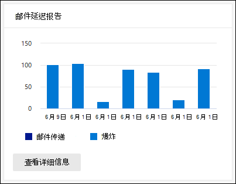
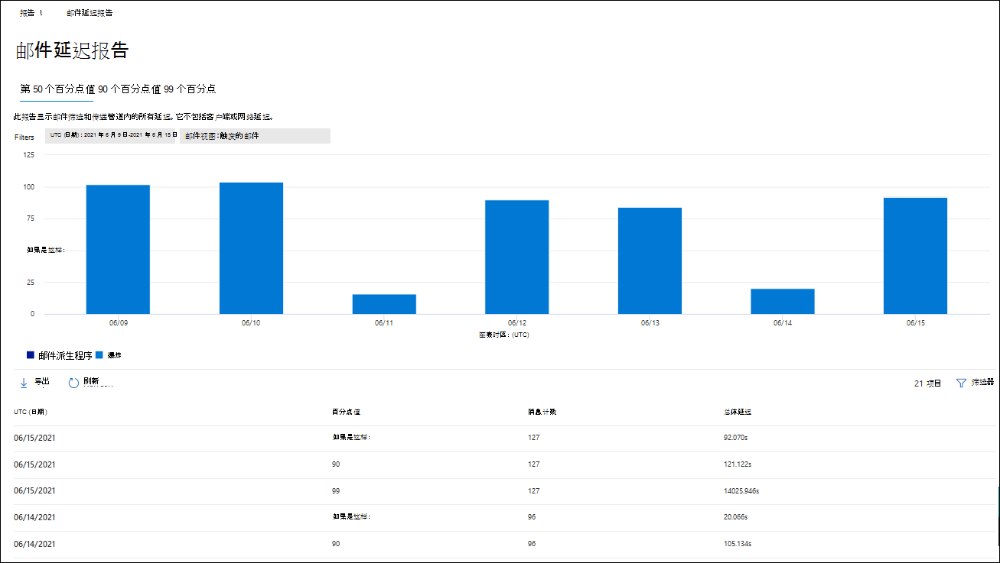
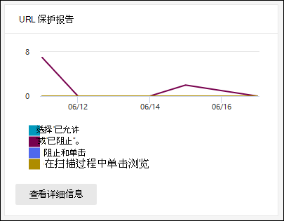
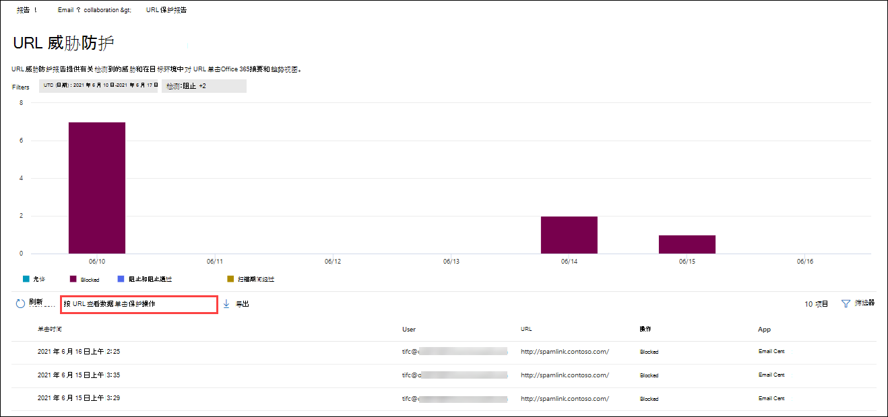
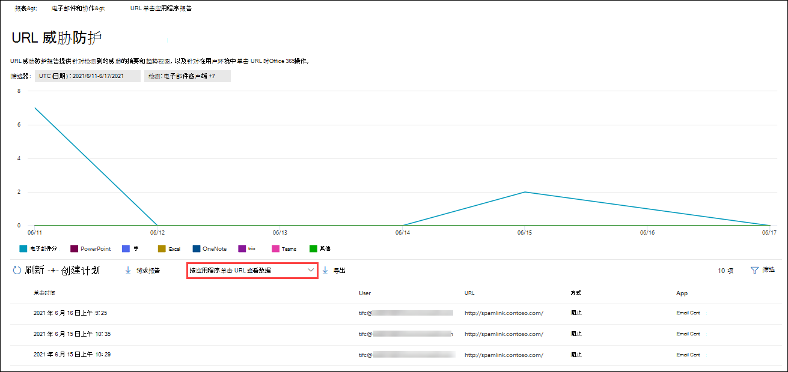

# 在 Office 365 门户中查看 Defender for Microsoft 365 Defender报告View Defender for Office 365 reports in the Microsoft 365 Defender portal

[!INCLUDE [Microsoft 365 Defender rebranding](../includes/microsoft-defender-for-office.md)]

**适用对象****Applies to**
- [Microsoft Defender for Office 365 计划 1 和计划 2Microsoft Defender for Office 365 plan 1 and plan 2](defender-for-office-365.md)
- [Microsoft 365 DefenderMicrosoft 365 Defender](../defender/microsoft-365-defender.md)

适用于 Office 365 组织的 Microsoft Defender (例如，Microsoft 365 E5 订阅或 Microsoft Defender for Office 365 计划 1 或 Microsoft Defender for Office 365 计划 2 加载项) 包含各种与安全相关的报告。Microsoft Defender for Office 365 organizations (for example, Microsoft 365 E5 subscriptions or Microsoft Defender for Office 365 Plan 1 or Microsoft Defender for Office 365 Plan 2 add-ons) contain a variety of security-related reports. 如果您具有 [必要的权限](#what-permissions-are-needed-to-view-the-defender-for-office-365-reports)，可以在 Microsoft 365 Defender 门户中查看这些报告，& \> **电子邮件**& \> **协作报告**。If you have the [necessary permissions](#what-permissions-are-needed-to-view-the-defender-for-office-365-reports), you can view these reports in the Microsoft 365 Defender portal by going to **Reports** \> **Email & collaboration** \> **Email & collaboration reports**. 若要直接转到"电子邮件& **协作报告"** 页，请打开 <https://security.microsoft.com/emailandcollabreport> 。To go directly to the **Email & collaboration reports** page, open <https://security.microsoft.com/emailandcollabreport>.

> [!NOTE]
>
> 不需要 Defender for Office 365的电子邮件安全报告在 Microsoft 365 Defender[门户中进行了介绍](view-email-security-reports.md)。Email security reports that don't require Defender for Office 365 are described in [View email security reports in the Microsoft 365 Defender portal](view-email-security-reports.md).
>
> 与邮件流相关的报告现在位于 EAC Exchange管理 () 。Reports that are related to mail flow are now in the Exchange admin center (EAC). 有关这些报告详细信息，请参阅新邮件管理中心Exchange[报告](/exchange/monitoring/mail-flow-reports/mail-flow-reports)。For more information about these reports, see [Mail flow reports in the new Exchange admin center](/exchange/monitoring/mail-flow-reports/mail-flow-reports).

## 保险箱附件文件类型报告Safe Attachments file types report

> [!NOTE]
> **"保险箱附件文件类型"** 报告最终将消失。The **Safe Attachments file types report** will eventually go away. 威胁防护状态报告中提供了 [相同的信息](#threat-protection-status-report)。The same information is available in the [Threat protection status report](#threat-protection-status-report).

## 保险箱附件邮件处置报告Safe Attachments message disposition report

> [!NOTE]
> 最终 **保险箱附件邮件** 处置报告将消失。The **Safe Attachments message disposition report** will eventually go away. 威胁防护状态报告中提供了 [相同的信息](#threat-protection-status-report)。The same information is available in the [Threat protection status report](#threat-protection-status-report).

## 邮件延迟报告Mail latency report

邮件 **延迟报告显示** 组织中遇到的邮件传递和触发延迟的聚合视图。The **Mail latency report** shows you an aggregate view of the mail delivery and detonation latency experienced within your organization. 服务中的邮件传递时间受多种因素的影响，绝对传递时间（以秒表示）通常不是成功或出现问题的良好指标。Mail delivery times in the service are affected by a number of factors, and the absolute delivery time in seconds is often not a good indicator of success or a problem. 一天的较慢的送达时间可能被视为另一天的平均送达时间，反之亦然。A slow delivery time on one day might be considered an average delivery time on another day, or vice-versa. 这将尝试根据有关其他邮件的观察到送达时间的统计数据来限定邮件传递。This tries to qualify message delivery based on statistical data about the observed delivery times of other messages.

不包括客户端和网络延迟。Client side and network latency are not included.

若要查看报告，请打开Microsoft 365 Defender [门户](https://security.microsoft.com)，**转到报告** \> **电子邮件&** \> **电子邮件&协作报告**。To view the report, open the [Microsoft 365 Defender portal](https://security.microsoft.com), go to **Reports** \> **Email & collaboration** \> **Email & collaboration reports**. 在"**电子邮件&协作报告**"页上，找到 **"邮件延迟** 报告"，然后单击"**查看详细信息"。**On the **Email & collaboration reports** page, find **Mail latency report** and then click **View details**. 若要直接转到报告，请打开 <https://security.microsoft.com/mailLatencyReport> 。To go directly to the report, open <https://security.microsoft.com/mailLatencyReport>.

在" **邮件延迟报告"** 页上，"邮件延迟报告"页上提供了 **以下** 选项卡：On the **Mail latency report** page, the following tabs are available on the **Mail latency report** page:

- **第 50 个** 百分点值：这是邮件传递时间中间值。**50th percentile**: This is the middle for message delivery times. 可以将此值视为平均送达时间。You can consider this value as an average delivery time. 默认情况下，此选项卡为选中状态。This tab is selected by default.
- **第 90** 个百分点值：这表示邮件传递的延迟很高。**90th percentile**: This indicates a high latency for message delivery. 仅 10% 的邮件传递时间超过此值。Only 10% of messages took longer than this value to deliver.
- **第 99 个** 百分点值：这表示邮件传递的延迟最高。**99th percentile**: This indicates the highest latency for message delivery.

无论选择哪个选项卡，图表都会显示按以下类别组织的邮件：Regardless of the tab you select, the chart shows messages organized into the following categories:

- **邮件传递延迟****Mail delivery latency**
- **爆炸****Detonations**

将鼠标悬停在图表中的类别上时，可以看到每个类别中延迟的细分。When you hover over a category in the chart, you can see a breakdown of the latency in each category.

如果单击 **"筛选器**"，可以按以下值筛选图表和详细信息表：If you click **Filter**, you can filter both the chart and the details table by the following values:

- **UTC (日期) ：\*\*\*\*开始日期和\*\*\*\*结束日期****Date (UTC)**: **Start date** and **End date**
- **消息视图**：下列值之一：**Message view**: One of the following values:
  - **所有邮件****All messages**
  - **包含附件或 URL 的邮件****Messages that contain attachments or URLs**
  - **触发的邮件****Detonated messages**

配置完筛选器后，请单击"应用"、"**取消**"或"清除 **筛选器"。**When you're finished configuring the filters, click **Apply**, **Cancel**, or **Clear filters**.

在图表下面的详细信息表中，提供了以下信息：In the details table below the chart, the following information is available:

- **Date (UTC)****Date (UTC)**
- **百分点值\*\*\*\*：50、90** 或 **99** **Percentiles**: **50**, **90**, or **99**
- **邮件计数****Message count**
- **总体延迟****Overall latency**

## 威胁防护状态报告Threat protection status report

威胁防护 **状态** 报告是一个单一视图，将有关 [Exchange Online Protection](exchange-online-protection-overview.md) (EOP) 和 Microsoft Defender for Office 365 检测并阻止的恶意内容和恶意电子邮件的信息汇集在一起。The **Threat protection status** report is a single view that brings together information about malicious content and malicious email detected and blocked by [Exchange Online Protection](exchange-online-protection-overview.md) (EOP) and Microsoft Defender for Office 365. 有关详细信息，请参阅威胁 [防护状态报告](view-email-security-reports.md#threat-protection-status-report)。For more information, see [Threat protection status report](view-email-security-reports.md#threat-protection-status-report).

## URL 威胁防护报告URL threat protection report

URL **威胁防护报告** 提供检测到的威胁的摘要和趋势视图，以及作为链接的一部分对 URL [单击保险箱视图](safe-links.md)。The **URL threat protection report** provides summary and trend views for threats detected and actions taken on URL clicks as part of [Safe Links](safe-links.md). 此报告不会包含应用了"链接"策略保险箱"不跟踪用户单击"选项的用户的 **单击** 数据。This report will not have click data from users where the Safe Links policy applied has the **Do not track user clicks** option selected.

若要查看报告，请打开Microsoft 365 Defender [门户](https://security.microsoft.com)，**转到报告** \> **电子邮件&** \> **电子邮件&协作报告**。To view the report, open the [Microsoft 365 Defender portal](https://security.microsoft.com), go to **Reports** \> **Email & collaboration** \> **Email & collaboration reports**. 在"**电子邮件&协作报告**"页上，找到 **"URL 保护"页**，然后单击"**查看详细信息"。**On the **Email & collaboration reports** page, find **URL protection page** and then click **View details**. 若要直接转到报告，请打开 <https://security.microsoft.com/reports/URLProtectionActionReport> 。To go directly to the report, open <https://security.microsoft.com/reports/URLProtectionActionReport>.

以下各节介绍了 **URL 威胁防护** 报告页面上的可用视图。The available views on the **URL threat protection** report page are described in the following sections.

> [!NOTE]
> 这是一个 *保护趋势报告*，表示数据表示较大数据集中的趋势。This is a *protection trend report*, meaning data represents trends in a larger dataset. 因此，此处无法实时获得图表中的数据，但详细信息表中的数据是，因此您可能会发现这两者稍有不同。As a result, the data in the charts is not available in real time here, but the data in the details table is, so you may see a slight discrepancy between the two. 图表每四小时刷新一次，并包含过去 90 天的数据。The charts are refreshed once every four hours and contain data for the last 90 days.

### 按 URL 查看数据单击保护操作View data by URL click protection action

" **按 URL 查看数据"单击** 保护操作视图显示组织中用户单击的 URL 数以及单击结果：The **View data by URL click protection action** view shows the number of URL clicks by users in the organization and the results of the click:

- **允许**：允许用户导航到 URL。**Allowed**: The user was allowed to navigate to the URL.
- **已阻止**：阻止用户导航到 URL。**Blocked**: The user was blocked from navigating to the URL.
- **阻止并单击：** 用户已选择继续导航到 URL。**Blocked and clicked through**: The user has chosen to continue navigating to the URL.
- **在扫描过程中单击** 完成：用户已单击链接，扫描完成之前。**Clicked through during scan**: The user has clicked on the link before the scan was complete.

单击表示用户已单击"阻止"页面访问恶意网站 (管理员可以在"链接策略" (禁用单击保险箱单击) 。A click indicates that the user has clicked through the block page to the malicious website (admins can disable click through in Safe Links policies).

If you click **Filters**， you can modify the report and the details table by selecting one or more of the following values in the flyout that appears：If you click **Filters**, you can modify the report and the details table by selecting one or more of the following values in the flyout that appears:

- **UTC (日期) ：\*\*\*\*开始日期和\*\*\*\*结束日期****Date (UTC)**: **Start date** and **End date**
- **检测**：**Detection**:
  - **允许****Allowed**
  - **已阻止****Blocked**
  - **阻止和单击****Blocked and clicked through**
  - **在扫描过程中单击浏览****Clicked through during scan**
- **域**：报告结果中列出的 URL 域。**Domains**: The URL domains listed in the report results.
- **收件人****Recipients**

配置完筛选器后，请单击"应用"、"**取消**"或"清除 **筛选器"。**When you're finished configuring the filters, click **Apply**, **Cancel**, or **Clear filters**.

图表下面的详细信息表提供了最近 7 天内组织中发生的所有单击的以下近实时视图：The details table below the chart provides the following near-real-time view of all clicks that happened within the organization for the last 7 days:

- **单击时间****Click time**
- **用户****User**
- **URL****URL**
- **Action****Action**
- **应用****App**

### 按 URL 单击应用程序查看数据View data by URL click by application

"**按 URL 单击应用程序** 查看数据"视图显示支持"链接"保险箱单击数：The **View data by URL click by application** view shows the number of URL clicks by apps that support Safe Links:

- **电子邮件客户端****Email client**
- **PowerPoint****PowerPoint**
- **Word****Word**
- **Excel****Excel**
- **OneNote****OneNote**
- **Visio****Visio**
- **Teams****Teams**
- **其他****Others**

If you click **Filters**， you can modify the report and the details table by selecting one or more of the following values in the flyout that appears：If you click **Filters**, you can modify the report and the details table by selecting one or more of the following values in the flyout that appears:

- **UTC (日期) ：\*\*\*\*开始日期和\*\*\*\*结束日期****Date (UTC)**: **Start date** and **End date**
- **检测**：图表中可用的应用。**Detection**: Available apps from the chart.
- **域**：报告结果中列出的 URL 域。**Domains**: The URL domains listed in the report results.
- **收件人****Recipients**

配置完筛选器后，请单击"应用"、"**取消**"或"清除 **筛选器"。**When you're finished configuring the filters, click **Apply**, **Cancel**, or **Clear filters**.

图表下面的详细信息表提供了最近 7 天内组织中发生的所有单击的以下近实时视图：The details table below the chart provides the following near-real-time view of all clicks that happened within the organization for the last 7 days:

- **单击时间****Click time**
- **用户****User**
- **URL****URL**
- **Action****Action**
- **应用****App**

## 要查看的其他报告Additional reports to view

除了本文中所述的报告之外，还有其他一些报告可用，如下表所述：In addition to the reports described in this article, several other reports are available, as described in the following table:

 

****

|报告Report|主题Topic|
|---|---|
|**Explorer** (Microsoft Defender for Office 365 Plan 2) or **real-time detections** (Microsoft Defender for Office 365 Plan 1) **Explorer** (Microsoft Defender for Office 365 Plan 2) or **real-time detections** (Microsoft Defender for Office 365 Plan 1)|[威胁资源管理器（和实时检测）Threat Explorer (and real-time detections)](threat-explorer.md)|
|**电子邮件安全** 报告，例如顶级发件人和收件人报告、欺骗邮件报告和垃圾邮件检测报告。**Email security reports**, such as the Top senders and recipients report, the Spoof mail report, and the Spam detections report.|[在电子邮件门户中查看Microsoft 365 Defender报告View email security reports in the Microsoft 365 Defender portal](view-email-security-reports.md)|
|**邮件流报告**，如转发报告、邮件流状态报告以及顶级发件人和收件人报告。**Mail flow reports**, such as the Forwarding report, the Mailflow status report, and the Top senders and recipients report.|[新管理中心中的Exchange报告Mail flow reports in the new Exchange admin center](/exchange/monitoring/mail-flow-reports/mail-flow-reports)|
|**仅 PowerShell 保险箱链接** (URL) 。**URL trace for Safe Links** (PowerShell only). 此 cmdlet 的输出显示过去七保险箱链接操作的结果。The output of this cmdlet shows you the results of Safe Links actions over the past seven days.|[Get-UrlTraceGet-UrlTrace](/powershell/module/exchange/get-urltrace)|
|**仅适用于 PowerShell 的 EOP** 和 Microsoft Defender Office 365 (邮件) 。**Mail traffic results for EOP and Microsoft Defender for Office 365** (PowerShell only). 此 cmdlet 的输出包含有关域、日期、事件类型、方向、操作和消息计数的信息。The output of this cmdlet contains information about Domain, Date, Event Type, Direction, Action, and Message Count.|[Get-MailTrafficATPReportGet-MailTrafficATPReport](/powershell/module/exchange/get-mailtrafficatpreport)|
|**仅适用于 PowerShell 的 EOP** 和 Defender Office 365检测 (报告) 。**Mail detail reports for EOP and Defender for Office 365 detections** (PowerShell only). 此 cmdlet 的输出包含有关电子邮件或文件中恶意文件或 URL、网络钓鱼尝试、模拟和其他潜在威胁的详细信息。The output of this cmdlet contains details about malicious files or URLs, phishing attempts, impersonation, and other potential threats in email or files.|[Get-MailDetailATPReportGet-MailDetailATPReport](/powershell/module/exchange/get-maildetailatpreport)|
|

## 查看 Defender for Office 365报告需要哪些权限？What permissions are needed to view the Defender for Office 365 reports?

若要查看和使用本文中所述的报告，你需要是本文门户中以下角色组之一Microsoft 365 Defender成员：In order to view and use the reports described in this article, you need to be a member of one of the following role groups in the Microsoft 365 Defender portal:

- **组织管理****Organization Management**
- **安全管理员****Security Administrator**
- **安全读者****Security Reader**
- **全局读者****Global Reader**

有关详细信息，请参阅 [Microsoft 365 Defender 门户中的权限](permissions-microsoft-365-security-center.md)。For more information, see [Permissions in the Microsoft 365 Defender portal](permissions-microsoft-365-security-center.md).

**注意**：向 Microsoft 365 管理中心 中的相应 Azure Active Directory 角色添加用户会为用户提供 Microsoft 365 Defender 门户中所需的权限以及 Microsoft 365 中其他功能Microsoft 365。 **Note**: Adding users to the corresponding Azure Active Directory role in the Microsoft 365 admin center gives users the required permissions in the Microsoft 365 Defender portal _and_ permissions for other features in Microsoft 365. 有关详细信息，请参阅[关于管理员角色](../../admin/add-users/about-admin-roles.md)。For more information, see [About admin roles](../../admin/add-users/about-admin-roles.md).

## 如果报告未显示数据，该做什么？What if the reports aren't showing data?

如果你在 Defender for Office 365报告中看不到数据，请仔细检查策略是否正确设置。If you are not seeing data in your Defender for Office 365 reports, double-check that your policies are set up correctly. 你的组织必须保险箱[链接](set-up-safe-links-policies.md)策略保险箱[附件](set-up-safe-attachments-policies.md)策略，以便 Defender Office 365保护就位。Your organization must have [Safe Links policies](set-up-safe-links-policies.md) and [Safe Attachments policies](set-up-safe-attachments-policies.md) defined in order for Defender for Office 365 protection to be in place. 另请参阅 [反垃圾邮件和反恶意软件保护](anti-spam-and-anti-malware-protection.md)。Also see [Anti-spam and anti-malware protection](anti-spam-and-anti-malware-protection.md).

## 相关主题Related topics

[智能报表和 Microsoft 365 Defender见解Smart reports and insights in the Microsoft 365 Defender portal](reports-and-insights-in-security-and-compliance.md)

[角色权限 (Azure Active DirectoryRole permissions (Azure Active Directory](/azure/active-directory/users-groups-roles/directory-assign-admin-roles#role-permissions)
