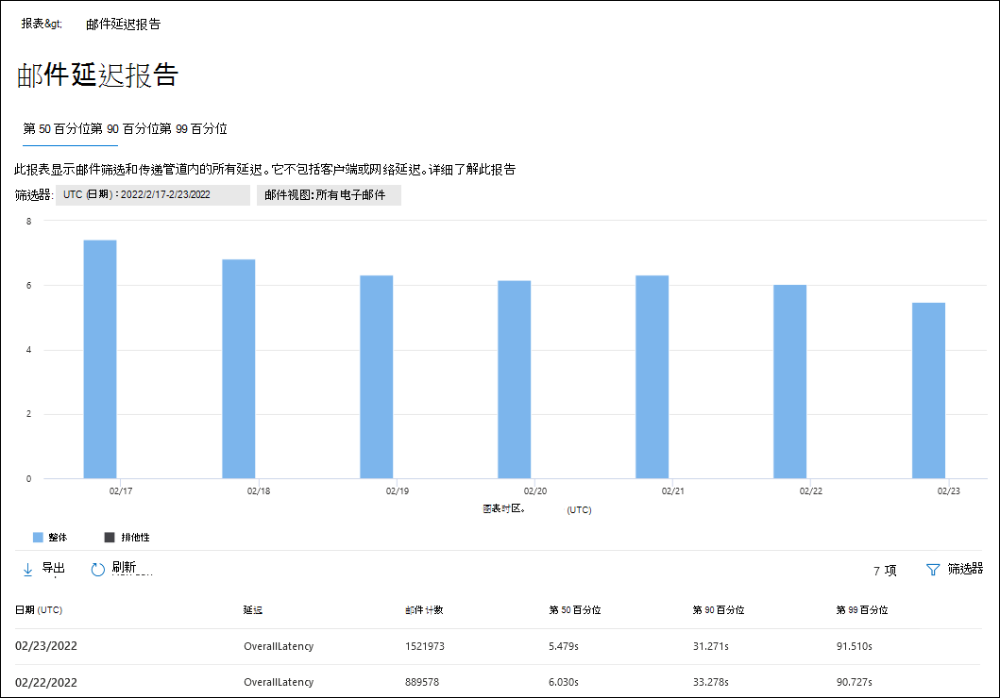
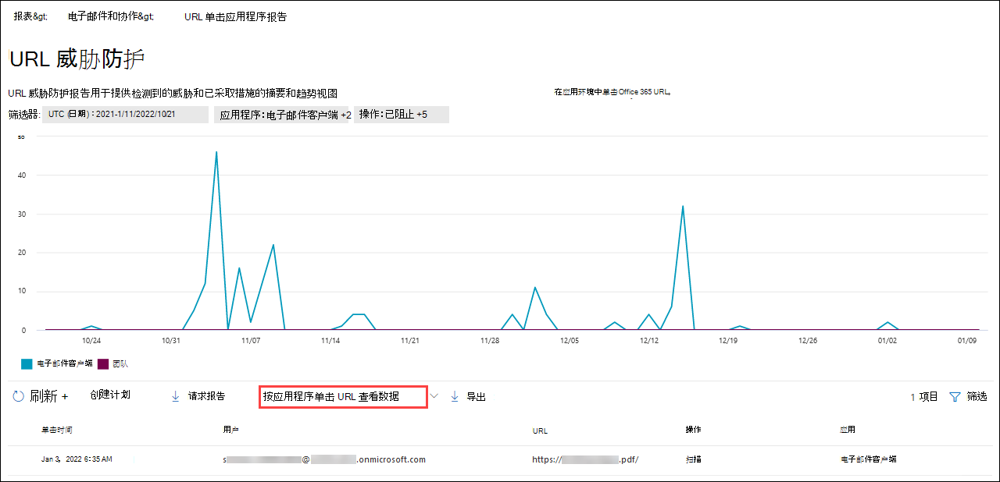

# 在 Office 365 门户中查看 Defender for Microsoft 365 Defender报告

[!INCLUDE [Microsoft 365 Defender rebranding](../includes/microsoft-defender-for-office.md)]

**适用对象**
- [Microsoft Defender for Office 365 计划 1 和计划 2](defender-for-office-365.md)
- [Microsoft 365 Defender](../defender/microsoft-365-defender.md)

适用于 Office 365 组织的 Microsoft Defender (例如，Microsoft 365 E5 订阅或 Microsoft Defender for Office 365 计划 1 或 Microsoft Defender for Office 365 计划 2 加载项) 包含各种与安全相关的报告。 如果您具有 [必要的权限](#what-permissions-are-needed-to-view-the-defender-for-office-365-reports)，可以在 Microsoft 365 Defender 门户中查看这些报告，& \> **电子邮件**& \> **协作报告**。 若要直接转到"电子邮件& **协作报告"** 页，请打开 <https://security.microsoft.com/emailandcollabreport> 。

> [!NOTE]
>
> 不需要 Defender for Office 365的电子邮件安全报告在 Microsoft 365 Defender[门户中进行了介绍](view-email-security-reports.md)。
>
> 与邮件流相关的报告现在位于 EAC Exchange管理 () 。 有关这些报告详细信息，请参阅新邮件管理中心Exchange[报告](/exchange/monitoring/mail-flow-reports/mail-flow-reports)。

## 保险箱附件文件类型报告

> [!NOTE]
> **"保险箱附件文件类型"** 报告最终将消失。 威胁防护状态报告中提供了 [相同的信息](#threat-protection-status-report)。

## 保险箱附件邮件处置报告

> [!NOTE]
> 最终 **保险箱附件邮件** 处置报告将消失。 威胁防护状态报告中提供了 [相同的信息](#threat-protection-status-report)。

## 邮件延迟报告

邮件 **延迟报告显示** 组织中遇到的邮件传递和触发延迟的聚合视图。 服务中的邮件传递时间受多种因素的影响，绝对传递时间（以秒表示）通常不是成功或出现问题的良好指标。 一天的较慢的送达时间可能被视为另一天的平均送达时间，反之亦然。 这将尝试根据有关其他邮件的观察到送达时间的统计数据来限定邮件传递。

不包括客户端和网络延迟。

若要查看报告，请打开Microsoft 365 Defender [门户](https://security.microsoft.com)，**转到报告** \> **电子邮件&** \> **电子邮件&协作报告**。 在"**电子邮件&协作报告**"页上，找到 **"邮件延迟** 报告"，然后单击"**查看详细信息"。** 若要直接转到报告，请打开 <https://security.microsoft.com/mailLatencyReport> 。

在" **邮件延迟报告"** 页上，"邮件延迟报告"页上提供了 **以下** 选项卡：

- **第 50 个** 百分点值：这是邮件传递时间中间值。 可以将此值视为平均送达时间。 默认情况下，此选项卡为选中状态。
- **第 90** 个百分点值：这表示邮件传递的延迟很高。 仅 10% 的邮件传递时间超过此值。
- **第 99 个** 百分点值：这表示邮件传递的延迟最高。

无论选择哪个选项卡，图表都会显示按以下类别组织的邮件：

- **邮件传递延迟**
- **爆炸**

将鼠标悬停在图表中的类别上时，可以看到每个类别中延迟的细分。

如果单击 **"筛选器**"，可以按以下值筛选图表和详细信息表：

- **UTC (日期) ：****开始日期和****结束日期**
- **消息视图**：下列值之一：
  - **所有邮件**
  - **包含附件或 URL 的邮件**
  - **触发的邮件**

配置完筛选器后，请单击"应用"、"**取消**"或"清除 **筛选器"。**

在图表下面的详细信息表中，提供了以下信息：

- **Date (UTC)**
- **百分点值****：50、90** 或 **99** 
- **邮件计数**
- **总体延迟**

## 威胁防护状态报告

威胁防护 **状态** 报告是一个单一视图，将有关 [Exchange Online Protection](exchange-online-protection-overview.md) (EOP) 和 Microsoft Defender for Office 365 检测并阻止的恶意内容和恶意电子邮件的信息汇集在一起。 有关详细信息，请参阅威胁 [防护状态报告](view-email-security-reports.md#threat-protection-status-report)。

## URL 威胁防护报告

URL **威胁防护报告** 提供检测到的威胁的摘要和趋势视图，以及作为链接的一部分对 URL [单击保险箱视图](safe-links.md)。 此报告不会包含应用了"链接"策略保险箱"不跟踪用户单击"选项的用户的 **单击** 数据。

若要查看报告，请打开Microsoft 365 Defender [门户](https://security.microsoft.com)，**转到报告** \> **电子邮件&** \> **电子邮件&协作报告**。 在"**电子邮件&协作报告**"页上，找到 **"URL 保护"页**，然后单击"**查看详细信息"。** 若要直接转到报告，请打开 <https://security.microsoft.com/reports/URLProtectionActionReport> 。

以下各节介绍了 **URL 威胁防护** 报告页面上的可用视图。

> [!NOTE]
> 这是一个 *保护趋势报告*，表示数据表示较大数据集中的趋势。 因此，此处无法实时获得图表中的数据，但详细信息表中的数据是，因此您可能会发现这两者稍有不同。 图表每四小时刷新一次，并包含过去 90 天的数据。

### 按 URL 查看数据单击保护操作

" **按 URL 查看数据"单击** 保护操作视图显示组织中用户单击的 URL 数以及单击结果：

- **允许**：允许用户导航到 URL。
- **已阻止**：阻止用户导航到 URL。
- **阻止并单击：** 用户已选择继续导航到 URL。
- **在扫描过程中单击** 完成：用户已单击链接，扫描完成之前。

单击表示用户已单击"阻止"页面访问恶意网站 (管理员可以在"链接策略" (禁用单击保险箱单击) 。

If you click **Filters**， you can modify the report and the details table by selecting one or more of the following values in the flyout that appears：

- **UTC (日期) ：****开始日期和****结束日期**
- **检测**：
  - **允许**
  - **已阻止**
  - **阻止和单击**
  - **在扫描过程中单击浏览**
- **域**：报告结果中列出的 URL 域。
- **收件人**

配置完筛选器后，请单击"应用"、"**取消**"或"清除 **筛选器"。**

图表下面的详细信息表提供了最近 7 天内组织中发生的所有单击的以下近实时视图：

- **单击时间**
- **用户**
- **URL**
- **Action**
- **应用**

### 按 URL 单击应用程序查看数据

"**按 URL 单击应用程序** 查看数据"视图显示支持"链接"保险箱单击数：

- **电子邮件客户端**
- **PowerPoint**
- **Word**
- **Excel**
- **OneNote**
- **Visio**
- **Teams**
- **其他**

If you click **Filters**， you can modify the report and the details table by selecting one or more of the following values in the flyout that appears：

- **UTC (日期) ：****开始日期和****结束日期**
- **检测**：图表中可用的应用。
- **域**：报告结果中列出的 URL 域。
- **收件人**

配置完筛选器后，请单击"应用"、"**取消**"或"清除 **筛选器"。**

图表下面的详细信息表提供了最近 7 天内组织中发生的所有单击的以下近实时视图：

- **单击时间**
- **用户**
- **URL**
- **Action**
- **应用**

## 要查看的其他报告

除了本文中所述的报告之外，还有其他一些报告可用，如下表所述：

 

****

|报告|主题|
|---|---|
|**Explorer** (Microsoft Defender for Office 365 Plan 2) or **real-time detections** (Microsoft Defender for Office 365 Plan 1) |[威胁资源管理器（和实时检测）](threat-explorer.md)|
|**电子邮件安全** 报告，例如顶级发件人和收件人报告、欺骗邮件报告和垃圾邮件检测报告。|[在电子邮件门户中查看Microsoft 365 Defender报告](view-email-security-reports.md)|
|**邮件流报告**，如转发报告、邮件流状态报告以及顶级发件人和收件人报告。|[新管理中心中的Exchange报告](/exchange/monitoring/mail-flow-reports/mail-flow-reports)|
|**仅 PowerShell 保险箱链接** (URL) 。 此 cmdlet 的输出显示过去七保险箱链接操作的结果。|[Get-UrlTrace](/powershell/module/exchange/get-urltrace)|
|**仅适用于 PowerShell 的 EOP** 和 Microsoft Defender Office 365 (邮件) 。 此 cmdlet 的输出包含有关域、日期、事件类型、方向、操作和消息计数的信息。|[Get-MailTrafficATPReport](/powershell/module/exchange/get-mailtrafficatpreport)|
|**仅适用于 PowerShell 的 EOP** 和 Defender Office 365检测 (报告) 。 此 cmdlet 的输出包含有关电子邮件或文件中恶意文件或 URL、网络钓鱼尝试、模拟和其他潜在威胁的详细信息。|[Get-MailDetailATPReport](/powershell/module/exchange/get-maildetailatpreport)|
|

## 查看 Defender for Office 365报告需要哪些权限？

若要查看和使用本文中所述的报告，你需要是本文门户中以下角色组之一Microsoft 365 Defender成员：

- **组织管理**
- **安全管理员**
- **安全读者**
- **全局读者**

有关详细信息，请参阅 [Microsoft 365 Defender 门户中的权限](permissions-microsoft-365-security-center.md)。

**注意**：向 Microsoft 365 管理中心 中的相应 Azure Active Directory 角色添加用户会为用户提供 Microsoft 365 Defender 门户中所需的权限以及 Microsoft 365 中其他功能Microsoft 365。  有关详细信息，请参阅[关于管理员角色](../../admin/add-users/about-admin-roles.md)。

## 如果报告未显示数据，该做什么？

如果你在 Defender for Office 365报告中看不到数据，请仔细检查策略是否正确设置。 你的组织必须保险箱[链接](set-up-safe-links-policies.md)策略保险箱[附件](set-up-safe-attachments-policies.md)策略，以便 Defender Office 365保护就位。 另请参阅 [反垃圾邮件和反恶意软件保护](anti-spam-and-anti-malware-protection.md)。

## 相关主题

[智能报表和 Microsoft 365 Defender见解](reports-and-insights-in-security-and-compliance.md)

[角色权限 (Azure Active Directory](/azure/active-directory/users-groups-roles/directory-assign-admin-roles#role-permissions)
