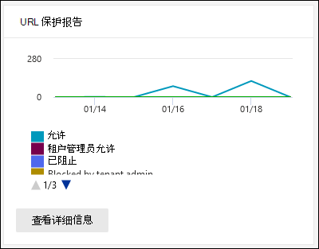

# 在安全与Office 365中心的报告仪表板中查看 Defender for &报告View Defender for Office 365 reports in the Reports dashboard in the Security & Compliance Center

[!INCLUDE [Microsoft 365 Defender rebranding](../includes/microsoft-defender-for-office.md)]

**适用对象****Applies to**
- [Microsoft Defender for Office 365 计划 1 和计划 2Microsoft Defender for Office 365 plan 1 and plan 2](defender-for-office-365.md)
- [Microsoft 365 DefenderMicrosoft 365 Defender](../defender/microsoft-365-defender.md)

适用于 Office 365 组织的 Microsoft Defender (例如，Microsoft 365 E5 订阅或 Microsoft Defender for Office 365 计划 1 或 Microsoft Defender for Office 365 计划 2 加载项) 包含各种与安全相关的报告。Microsoft Defender for Office 365 organizations (for example, Microsoft 365 E5 subscriptions or Microsoft Defender for Office 365 Plan 1 or Microsoft Defender for Office 365 Plan 2 add-ons) contain a variety of security-related reports. 如果您具有 [必要的权限](#what-permissions-are-needed-to-view-the-defender-for-office-365-reports)，可以在安全与合规中心内查看这些报告&"报告仪表板 \> **"。**If you have the [necessary permissions](#what-permissions-are-needed-to-view-the-defender-for-office-365-reports), you can view these reports in the Security & Compliance Center by going to **Reports** \> **Dashboard**. 若要直接转到"报表"仪表板，请打开 <https://protection.office.com/insightdashboard> 。To go directly to the Reports dashboard, open <https://protection.office.com/insightdashboard>.

## Defender for Office 365 文件类型报告Defender for Office 365 file types report

The **Defender for Office 365 file types report** report shows you the type of files detected as malicious by 保险箱 [Attachments](safe-attachments.md).The **Defender for Office 365 file types report** report shows you the type of files detected as malicious by [Safe Attachments](safe-attachments.md).

 报告聚合视图允许筛选 90 天，而详细信息视图仅允许筛选 10 天。The aggregate view of the report allows for 90 days of filtering, while the detail view only allows for 10 days of filtering.

若要查看报告，请打开安全与&中心，转到报告 [仪表板](https://protection.office.com) \> ，然后选择 **Defender Office 365文件类型**。To view the report, open the [Security & Compliance Center](https://protection.office.com), go to **Reports** \> **Dashboard** and select **Defender for Office 365 file types**. 若要直接转到报告，请打开 <https://protection.office.com/reportv2?id=ATPFileReport> 。To go directly to the report, open <https://protection.office.com/reportv2?id=ATPFileReport>.

> [!NOTE]
> 此报告中的信息也可在 Defender for [Office 365邮件处置报告中获取](#defender-for-office-365-message-disposition-report)。The information in this report is also available in the [Defender for Office 365 message disposition report](#defender-for-office-365-message-disposition-report).

### Defender for Office 365 文件类型报告的报告视图Report view for the Defender for Office 365 file types report

提供以下视图：The following views are available:

- **查看数据者：文件**：图表包含以下信息：**View data by: File**: The chart contains the following information:

  - **恶意Excel附件****Malicious Excel attachments**
  - **恶意 Flash 附件****Malicious Flash attachments**
  - **恶意 PDF 附件****Malicious PDF attachments**
  - **恶意PowerPoint附件****Malicious PowerPoint attachments**
  - **恶意 URL****Malicious URLs**
  - **恶意 Word 附件****Malicious Word attachments**
  - **恶意可执行附件****Malicious executable attachments**
  - **其他****Others**

  当你将鼠标悬停在 (数据点) 上时，你可以看到 EOP 中的[保险箱 附件](safe-attachments.md)和反恶意软件保护检测到的恶意文件类型[的细目](anti-malware-protection.md)。When you hover over a particular day (data point), you can see the breakdown of types of malicious files that were detected by [Safe Attachments](safe-attachments.md) and [anti-malware protection in EOP](anti-malware-protection.md).

  

  如果单击 **"筛选器"，** 可以使用以下筛选器修改报告：If you click **Filters**, you can modify the report with the following filters:

  - **开始日期和\*\*\*\*结束日期****Start date** and **End date**
  - 图表中可见的相同文件类型值。The same file type values that are visible in the chart.

- **查看数据者：消息**：图表包含以下信息：**View data by: Message**: The chart contains the following information:

  - **阻止访问****Block access**
  - **邮件被替换****Messages replaced**
  - **监视的邮件****Messages monitored**
  - **替换为动态电子邮件传递**：有关详细信息，请参阅动态传递 [保险箱附件策略](safe-attachments.md#dynamic-delivery-in-safe-attachments-policies)。**Replaced by Dynamic Email Delivery**: For more information, see [Dynamic Delivery in Safe Attachments policies](safe-attachments.md#dynamic-delivery-in-safe-attachments-policies).

  

  如果单击 **"筛选器"，** 可以使用以下筛选器修改报告：If you click **Filters**, you can modify the report with the following filters:

  - **开始日期和\*\*\*\*结束日期****Start date** and **End date**
  - 图表中可用的相同邮件处置值，以及传递值的其他 **邮件** 。The same message disposition values that are available in the chart, and the additional **Messages passed** value.

### Defender for Office 365 文件类型报告的详细信息表视图Details table view for the Defender for Office 365 file types report

如果单击 **"查看详细信息"** 表，报告将提供过去 10 天内在组织中发生的所有单击的近实时视图。If you click **View details table**, the report provides a near-real-time view of all clicks that happen within the organization for the last 10 days. 显示的信息取决于您所查看的图表：The information that's shown depends on the chart you were looking at:

- **查看数据者：文件**：**View data by: File**:

  - **Date****Date**
  - **收件人地址****Recipient address**
  - **发件人地址****Sender address**
  - **邮件 ID：** 在邮件 **头的 Message-ID** 头字段中可用，并且应该是唯一的。**Message ID**: Available in the **Message-ID** header field in the message header and should be unique. 示例值是 `<08f1e0f6806a47b4ac103961109ae6ef@server.domain>` (尖括号) 。An example value is `<08f1e0f6806a47b4ac103961109ae6ef@server.domain>` (note the angle brackets).
  - **文件****File**

  如果单击 **"筛选器"，** 可以使用以下筛选器修改报告：If you click **Filters**, you can modify the report with the following filters:

  - **开始日期和\*\*\*\*结束日期****Start date** and **End date**
  - 图表中可见的相同文件类型值。The same file type values that are visible in the chart.

- **查看数据者： 消息**：**View data by: Message**:

  - **Date****Date**
  - **收件人地址****Recipient address**
  - **发件人地址****Sender address**
  - **邮件 ID****Message ID**
  - **文件****File**
  - **主题****Subject**

  如果单击 **"筛选器"，** 可以使用以下筛选器修改结果：If you click **Filters**, you can modify the results with the following filters:

  - **开始日期和\*\*\*\*结束日期****Start date** and **End date**
  - 图表中可用的相同邮件处置值，以及传递值的其他 **邮件** 。The same message disposition values that are available in the chart, and the additional **Messages passed** value.

若要返回到报告视图，请单击"查看 **报告"。**To get back to the reports view, click **View report**.

## Defender for Office 365 邮件处置报告Defender for Office 365 message disposition report

**ATP 邮件处置** 报告显示对被检测为包含恶意内容的电子邮件采取的操作。The **ATP Message Disposition** report shows you the actions that were taken for email messages that were detected as having malicious content.

若要查看报告，请打开安全与合规 [&，转到](https://protection.office.com)报告仪表板，然后选择 Defender  \>  **Office 365邮件处置**。To view the report, open the [Security & Compliance Center](https://protection.office.com), go to **Reports** \> **Dashboard** and select **Defender for Office 365 message disposition**. 若要直接转到报告，请打开 <https://protection.office.com/reportv2?id=ATPMessageReport> 。To go directly to the report, open <https://protection.office.com/reportv2?id=ATPMessageReport>.

> [!NOTE]
> 此报告中的信息也可在 Defender for [Office 365文件类型报告中获取](#defender-for-office-365-file-types-report)。The information in this report is also available in the [Defender for Office 365 file types report](#defender-for-office-365-file-types-report).

### Defender for Office 365邮件处置报告的报告视图Report view for the Defender for Office 365 message disposition report

提供以下视图：The following views are available:

- **查看数据者：消息**：图表包含以下信息：**View data by: Message**: The chart contains the following information:

  - **阻止访问****Block access**
  - **邮件被替换****Messages replaced**
  - **监视的邮件****Messages monitored**
  - **替换为动态电子邮件传递**：有关详细信息，请参阅动态传递 [保险箱附件策略](safe-attachments.md#dynamic-delivery-in-safe-attachments-policies)。**Replaced by Dynamic Email Delivery**: For more information, see [Dynamic Delivery in Safe Attachments policies](safe-attachments.md#dynamic-delivery-in-safe-attachments-policies).

  

  如果单击 **"筛选器"，** 可以使用以下筛选器修改报告：If you click **Filters**, you can modify the report with the following filters:

  - **开始日期和\*\*\*\*结束日期****Start date** and **End date**
  - 图表中可用的相同邮件处置值，以及传递值的其他 **邮件** 。The same message disposition values that are available in the chart, and the additional **Messages passed** value.

- **查看数据者：文件**：图表包含以下信息：**View data by: File**: The chart contains the following information:

  - **恶意Excel附件****Malicious Excel attachments**
  - **恶意 Flash 附件****Malicious Flash attachments**
  - **恶意 PDF 附件****Malicious PDF attachments**
  - **恶意PowerPoint附件****Malicious PowerPoint attachments**
  - **恶意 URL****Malicious URLs**
  - **恶意 Word 附件****Malicious Word attachments**
  - **恶意可执行附件****Malicious executable attachments**
  - **其他****Others**

  当你将鼠标悬停在 (数据点) 上时，你可以看到 EOP 中的[保险箱 附件](safe-attachments.md)和反恶意软件保护检测到的恶意文件类型[的细目](anti-malware-protection.md)。When you hover over a particular day (data point), you can see the breakdown of types of malicious files that were detected by [Safe Attachments](safe-attachments.md) and [anti-malware protection in EOP](anti-malware-protection.md).

  

  如果单击 **"筛选器"，** 可以使用以下筛选器修改报告：If you click **Filters**, you can modify the report with the following filters:

  - **开始日期和\*\*\*\*结束日期****Start date** and **End date**
  - 图表中可见的相同文件类型值。The same file type values that are visible in the chart.

### Defender for Office 365 邮件处置报告的详细信息表视图Details table view for the Defender for Office 365 message disposition report

如果单击 **"查看详细信息"** 表，报告将提供过去 10 天内在组织中发生的所有单击的近实时视图。If you click **View details table**, the report provides a near-real-time view of all clicks that happen within the organization for the last 10 days. 显示的信息取决于您所查看的图表：The information that's shown depends on the chart you were looking at:

- **查看数据者： 消息**：**View data by: Message**:

  - **Date****Date**
  - **收件人地址****Recipient address**
  - **发件人地址****Sender address**
  - **邮件 ID****Message ID**
  - **文件****File**
  - **主题****Subject**

  如果单击 **"筛选器"，** 可以使用以下筛选器修改结果：If you click **Filters**, you can modify the results with the following filters:

  - **开始日期和\*\*\*\*结束日期****Start date** and **End date**
  - 图表中可用的相同邮件处置值，以及传递值的其他 **邮件** 。The same message disposition values that are available in the chart, and the additional **Messages passed** value.

- **查看数据者：文件**：**View data by: File**:

  - **Date****Date**
  - **收件人地址****Recipient address**
  - **发件人地址****Sender address**
  - **邮件 ID****Message ID**
  - **文件****File**

  如果单击 **"筛选器"，** 可以使用以下筛选器修改报告：If you click **Filters**, you can modify the report with the following filters:

  - **开始日期和\*\*\*\*结束日期****Start date** and **End date**
  - 图表中可见的相同文件类型值。The same file type values that are visible in the chart.

若要返回到报告视图，请单击"查看 **报告"。**To get back to the reports view, click **View report**.

## 邮件延迟报告Mail latency report

邮件 **延迟报告显示** 组织中遇到的邮件传递和触发延迟的聚合视图。The **Mail latency report** shows you an aggregate view of the mail delivery and detonation latency experienced within your organization. 服务中的邮件传递时间受多种因素的影响，绝对传递时间（以秒表示）通常不是成功或出现问题的良好指标。Mail delivery times in the service are affected by a number of factors, and the absolute delivery time in seconds is often not a good indicator of success or a problem. 一天的较慢的送达时间可能被视为另一天的平均送达时间，反之亦然。A slow delivery time on one day might be considered an average delivery time on another day, or vice-versa. 邮件 **延迟报告** 尝试根据有关其他邮件的观察到送达时间的统计数据来限定邮件传递：The **Mail latency report** tries to qualify message delivery based on statistical data about the observed delivery times of other messages:

- **第 50 个** 百分点值：这是邮件传递时间中间值。**50th percentile**: This is the middle for message delivery times. 可以将此值视为平均送达时间。You can consider this value as an average delivery time.
- **第 90** 个百分点值：这表示邮件传递的延迟很高。**90th percentile**: This indicates a high latency for message delivery. 仅 10% 的邮件传递时间超过此值。Only 10% of messages took longer than this value to deliver.
- **第 99 个** 百分点值：这表示邮件传递的延迟最高。**99th percentile**: This indicates the highest latency for message delivery.

不包括客户端和网络延迟。Client side and network latency are not included.

若要查看报告，请打开安全与&中心 **，转到报告**[仪表板](https://protection.office.com) \> 并选择 **邮件延迟报告**。To view the report, open the [Security & Compliance Center](https://protection.office.com), go to **Reports** \> **Dashboard** and select **Mail latency report**. 若要直接转到报告，请打开 <https://protection.office.com/mailLatencyReport?viewid=P50> 。To go directly to the report, open <https://protection.office.com/mailLatencyReport?viewid=P50>.

### 邮件延迟报告的报告视图Report view for the Mail latency report

打开报表时，默认情况下选择 **第 50** 个百分点值选项卡。When you open the report, the **50th percentiles** tab is selected by default.

默认情况下，此视图包含配置了以下筛选器的图表：By default, this view contains a chart that's configured with the following filters:

- **日期**：最近 7 天**Date**: The last 7 days
- **邮件视图**：**Message View**:
  - 触发的邮件Detonated messages

此图显示按以下类别组织的邮件：This chart shows messages organized into the following categories:

- **邮件传递延迟****Mail delivery latency**
- **触发延迟****Detonation latency**

将鼠标悬停在图表中的类别上时，可以看到每个类别中延迟的细分。When you hover over a category in the chart, you can see a breakdown of the latency in each category.

如果 **单击"** 筛选器"，报表视图筛选器修改结果：If you click **Filter** in the report view, you can modify the results with the following filters:

- 所有邮件All messages
- 包含附件或 URL 的邮件Messages that contain attachments or URLs

如果单击 **"第 90** 个百分点值"选项卡或 **"第 99** 个百分点值"选项卡，则使用第 **50** 个百分点值视图中的相同默认筛选器。If you click the **90th percentiles** tab or the **99th percentiles** tab, the same default filters from the **50th percentiles** view are used.

### 邮件延迟报告的详细信息表视图Details table view for the Mail latency report

详细信息表视图中显示了以下信息：The following information is shown in the details table view:

- **Date****Date**
- **百分点值****Percentiles**
- **邮件计数****Message count**
- **总体延迟****Overall latency**

以上显示，11 月 14 日传递和触发的所有邮件的平均延迟为 **108.033** 秒。The above shows that on November 14 the average latency experienced for all messages delivered and detonated was **108.033** seconds.

详细信息表在每个选项卡上包含相同的信息。The details table contains the same information on each tab.

## 威胁防护状态报告Threat protection status report

威胁防护 **状态** 报告是一个单一视图，将有关 [Exchange Online Protection](exchange-online-protection-overview.md) (EOP) 和 Microsoft Defender for Office 365 检测并阻止的恶意内容和恶意电子邮件的信息汇集在一起。The **Threat protection status** report is a single view that brings together information about malicious content and malicious email detected and blocked by [Exchange Online Protection](exchange-online-protection-overview.md) (EOP) and Microsoft Defender for Office 365. 有关详细信息，请参阅威胁 [防护状态报告](view-email-security-reports.md#threat-protection-status-report)。For more information, see [Threat protection status report](view-email-security-reports.md#threat-protection-status-report).

## URL 威胁防护报告URL threat protection report

URL **威胁防护报告** 提供检测到的威胁的摘要和趋势视图，以及作为链接的一部分对 URL [单击保险箱视图](safe-links.md)。The **URL threat protection report** provides summary and trend views for threats detected and actions taken on URL clicks as part of [Safe Links](safe-links.md). 此报告不会包含应用了"链接"策略保险箱"不跟踪用户单击"选项的用户的 **单击** 数据。This report will not have click data from users where the Safe Links policy applied has the **Do not track user clicks** option selected.

若要查看报告，请打开安全与合规 [&，转到](https://protection.office.com)**报告仪表板** \> ，然后选择 **URL 保护报告**。To view the report, open the [Security & Compliance Center](https://protection.office.com), go to **Reports** \> **Dashboard** and select **URL protection report**. 若要直接转到报告，请打开 <https://protection.office.com/reportv2?id=URLProtectionActionReport> 。To go directly to the report, open <https://protection.office.com/reportv2?id=URLProtectionActionReport>.

> [!NOTE]
> 这是一个 *保护趋势报告*，表示数据表示较大数据集中的趋势。This is a *protection trend report*, meaning data represents trends in a larger dataset. 因此，此处无法实时获得聚合视图中的数据，但详细信息表视图中的数据是，因此您可能会看到这两个视图之间稍有差异。As a result, the data in the aggregate view is not available in real time here, but the data in the details table view is, so you may see a slight discrepancy between the two views.

### URL 威胁防护报告的报告视图Report view for the URL threat protection report

**URL 威胁防护** 报告有两个聚合视图，每四小时刷新一次，显示过去 90 天的数据：The **URL threat protection** report has two aggregated views that are refreshed once every four hours that shows data for the last 90 days:

- **URL 单击保护操作**：显示组织中用户单击的 URL 数以及单击结果：**URL click protection action**: Shows the number of URL clicks by users in the organization and the results of the click:

  - **阻止** (用户导航到 URL) **Blocked** (the user was blocked from navigating to the URL)
  - **阻止并单击 (** 用户已选择继续导航到 URL) **Blocked and clicked through** (the user has chosen to continue navigating to the URL)
  - **在扫描过程中单击 (，** 在扫描完成之前用户已单击链接) **Clicked through during scan** (the user has clicked on the link before the scan was complete)

  单击表示用户已单击"阻止"页面访问恶意网站 (管理员可以在"链接策略" (禁用单击保险箱单击) 。A click indicates that the user has clicked through the block page to the malicious website (admins can disable click through in Safe Links policies).

  如果单击 **"筛选器"，** 可以使用以下筛选器修改报告：If you click **Filters**, you can modify the report with the following filters:

  - **开始日期和\*\*\*\*结束日期****Start date** and **End date**
  - 可用的单击保护操作以及值 **Allowed** (允许用户导航到 URL) 。The available click protection actions, plus the value **Allowed** (the user was allowed to navigate to the URL).

  

- **按应用程序单击的 URL：** 显示支持以下链接的应用程序保险箱数：**URL click by application**: Shows the number of URL clicks by applications that support Safe Links:

  - **电子邮件客户端****Email client**
  - **PowerPoint****PowerPoint**
  - **Word****Word**
  - **Excel****Excel**
  - **OneNote****OneNote**
  - **Visio****Visio**
  - **Teams****Teams**
  - **其他****Other**

  如果单击 **"筛选器"，** 可以使用以下筛选器修改报告：If you click **Filters**, you can modify the report with the following filters:

  - **开始日期和\*\*\*\*结束日期****Start date** and **End date**
  - 可用的应用程序。The available applications.

### URL 威胁防护报告的详细信息表视图Details table view for the URL threat protection report

如果单击 **"查看** 详细信息"表，报告将提供过去 7 天内在组织中发生的所有单击的近实时视图，并包含以下详细信息：If you click **View details table**, the report provides a near-real-time view of all clicks that happen within the organization for the last 7 days with the following details:

- **单击时间****Click time**
- **用户****User**
- **URL****URL**
- **Action****Action**
- **应用****App**

如果在 **详细信息表** 视图中单击"筛选器"，可以按照与"收件人"报表视图相同的条件进行筛选，也可以按"域"或"收件人"（用逗号分隔）进行筛选。 If you click **Filters** in the details table view, you can filter by the same criteria as in the report view, and also by **Domains** or **Recipients** separated by commas.

> [!NOTE]
> " **域** "筛选器是指报告结果中列出的 URL 域。The **Domains** filter refers to the URL domain listed in the report results. 

若要返回到报告视图，请单击"查看 **报告"。**To get back to the reports view, click **View report**.

## 要查看的其他报告Additional reports to view

除了本文中所述的报告之外，还有其他一些报告可用，如下表所述：In addition to the reports described in this article, several other reports are available, as described in the following table:

****

|报告Report|主题Topic|
|---|---|
|**Explorer** (Microsoft Defender for Office 365 Plan 2) or **real-time detections** (Microsoft Defender for Office 365 Plan 1) **Explorer** (Microsoft Defender for Office 365 Plan 2) or **real-time detections** (Microsoft Defender for Office 365 Plan 1)|[威胁资源管理器（和实时检测）Threat Explorer (and real-time detections)](threat-explorer.md)|
|**电子邮件安全** 报告，例如顶级发件人和收件人报告、欺骗邮件报告和垃圾邮件检测报告。**Email security reports**, such as the Top senders and recipients report, the Spoof mail report, and the Spam detections report.|[查看安全与合规中心内的电子邮件安全报告View email security reports in the Security & Compliance Center](view-email-security-reports.md)|
|**邮件流报告**，如转发报告、邮件流状态报告以及顶级发件人和收件人报告。**Mail flow reports**, such as the Forwarding report, the Mailflow status report, and the Top senders and recipients report.|[在安全与合规中心内查看&流报告View mail flow reports in the Security & Compliance Center](view-mail-flow-reports.md)|
|**仅 PowerShell 保险箱链接** (URL) 。**URL trace for Safe Links** (PowerShell only). 此 cmdlet 的输出显示过去七保险箱链接操作的结果。The output of this cmdlet shows you the results of Safe Links actions over the past seven days.|[Get-UrlTraceGet-UrlTrace](/powershell/module/exchange/get-urltrace)|
|**仅适用于 PowerShell 的 EOP** 和 Microsoft Defender Office 365 (邮件) 。**Mail traffic results for EOP and Microsoft Defender for Office 365** (PowerShell only). 此 cmdlet 的输出包含有关域、日期、事件类型、方向、操作和消息计数的信息。The output of this cmdlet contains information about Domain, Date, Event Type, Direction, Action, and Message Count.|[Get-MailTrafficATPReportGet-MailTrafficATPReport](/powershell/module/exchange/get-mailtrafficatpreport)|
|**仅适用于 PowerShell 的 EOP** 和 Defender Office 365检测 (报告) 。**Mail detail reports for EOP and Defender for Office 365 detections** (PowerShell only). 此 cmdlet 的输出包含有关电子邮件或文件中恶意文件或 URL、网络钓鱼尝试、模拟和其他潜在威胁的详细信息。The output of this cmdlet contains details about malicious files or URLs, phishing attempts, impersonation, and other potential threats in email or files.|[Get-MailDetailATPReportGet-MailDetailATPReport](/powershell/module/exchange/get-maildetailatpreport)|
|

## 查看 Defender for Office 365报告需要哪些权限？What permissions are needed to view the Defender for Office 365 reports?

若要查看和使用本文中所述的报告，你需要是安全与合规中心内以下角色&之一：In order to view and use the reports described in this article, you need to be a member of one of the following role groups in the Security & Compliance Center:

- **组织管理****Organization Management**
- **安全管理员****Security Administrator**
- **安全读者****Security Reader**
- **全局读取者****Global Reader**

有关详细信息，请参阅[安全与合规中心中的权限](permissions-in-the-security-and-compliance-center.md)。For more information, see [Permissions in the Security & Compliance Center](permissions-in-the-security-and-compliance-center.md).

**注意**：将用户添加到 Microsoft 365 管理中心的相应 Azure Active Directory 角色会为用户提供安全与合规中心中所需的权限&以及安全与合规中心中其他功能Microsoft 365。**Note**: Adding users to the corresponding Azure Active Directory role in the Microsoft 365 admin center gives users the required permissions in the Security & Compliance Center _and_ permissions for other features in Microsoft 365. 有关详细信息，请参阅 [关于管理员角色](../../admin/add-users/about-admin-roles.md)。For more information, see [About admin roles](../../admin/add-users/about-admin-roles.md).

## 如果报告未显示数据，该做什么？What if the reports aren't showing data?

如果你在 Defender for Office 365报告中看不到数据，请仔细检查策略是否正确设置。If you are not seeing data in your Defender for Office 365 reports, double-check that your policies are set up correctly. 你的组织必须保险箱[链接](set-up-safe-links-policies.md)策略保险箱[附件](set-up-safe-attachments-policies.md)策略，以便 Defender Office 365保护就位。Your organization must have [Safe Links policies](set-up-safe-links-policies.md) and [Safe Attachments policies](set-up-safe-attachments-policies.md) defined in order for Defender for Office 365 protection to be in place. 另请参阅 [反垃圾邮件和反恶意软件保护](anti-spam-and-anti-malware-protection.md)。Also see [Anti-spam and anti-malware protection](anti-spam-and-anti-malware-protection.md).

## 相关主题Related topics

[安全与合规中心内的智能报告和见解Smart reports and insights in the Security & Compliance Center](reports-and-insights-in-security-and-compliance.md)

[角色权限 (Azure Active DirectoryRole permissions (Azure Active Directory](/azure/active-directory/users-groups-roles/directory-assign-admin-roles#role-permissions)
