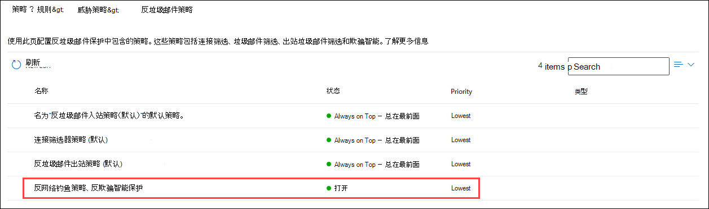
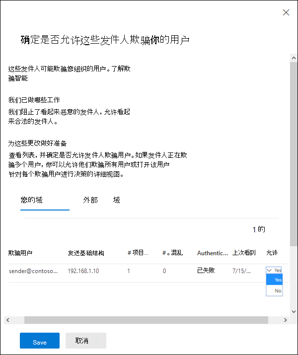
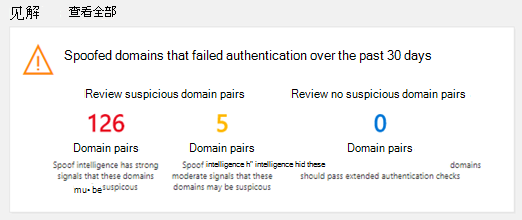
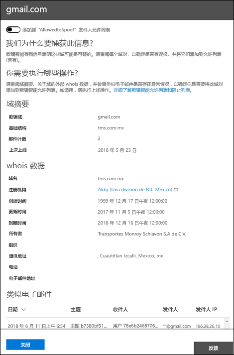

# <a name="manage-spoofed-senders-using-the-spoof-intelligence-policy-and-spoof-intelligence-insight-in-eop"></a>使用 EOP 中的欺骗智能策略和欺骗智能见解管理欺骗发件人

[!INCLUDE [Microsoft 365 Defender rebranding](../includes/microsoft-defender-for-office.md)]

**适用对象**
- [Microsoft Defender for Office 365 计划 1 和计划 2](defender-for-office-365.md)
- [Microsoft 365 Defender](../defender/microsoft-365-defender.md)

> [!IMPORTANT]
> 本文介绍在"反垃圾邮件策略"页上 (欺骗智能策略替换的旧版欺骗发件人管理) 。   有关租户允许/阻止列表 (中的"欺骗"选项卡) ，请参阅 EOP 中的欺骗[智能见解](learn-about-spoof-intelligence.md)。

在 Microsoft 365 组织中，在 Exchange Online 或独立 Exchange Online Protection (EOP) 组织中没有 Exchange Online 邮箱，自 2018 年 10 日起，入站电子邮件将自动受到 EOP 的欺骗保护。 EOP **使用欺骗智能** 作为组织防御网络钓鱼的整体防御的一部分。 有关详细信息，请参阅 [EOP 中的反欺骗保护](anti-spoofing-protection.md)。

默认 (仅) 欺骗智能策略有助于确保合法发件人发送的欺骗性电子邮件不会在 EOP 垃圾邮件筛选器中被发现，同时保护用户免受垃圾邮件或网络钓鱼攻击。 您还可以使用欺骗智能见解快速确定哪些外部发件人从未通过 SPF、DKIM 或 DMARC 检查的域合法地向您发送未经身份验证的电子邮件 (邮件) 。

您可以在 Microsoft 365 Defender 门户中或在 PowerShell (Exchange Online PowerShell 中为在 Exchange Online 中拥有邮箱的 Microsoft 365 组织管理欺骗智能;适用于没有邮箱的组织的独立 EOP PowerShell Exchange Online mailboxes) 。

## <a name="what-do-you-need-to-know-before-you-begin"></a>开始前，有必要了解什么？

- 访问 <https://security.microsoft.com> 打开 Microsoft 365 Defender 门户。 若要直接转到“**反垃圾邮件策略**”页面，请使用 <https://security.microsoft.com/antispam>。

- 若要连接到 Exchange Online PowerShell，请参阅[连接到 Exchange Online PowerShell](/powershell/exchange/connect-to-exchange-online-powershell)。 若要连接到独立 EOP PowerShell，请参阅[连接到 Exchange Online Protection PowerShell](/powershell/exchange/connect-to-exchange-online-protection-powershell)。

- 在 Exchange Online 网站中 **分配** 权限，才能执行本文中的步骤：
  - 若要修改欺骗智能策略或启用或禁用欺骗智能，你需要是组织管理或安全 **管理员角色****组** 的成员。
  - 若要对欺骗智能策略进行只读访问，你需要是全局读者或安全 **读者角色组** 的成员。 

  有关详细信息，请参阅 [Exchange Online 中权限](/exchange/permissions-exo/permissions-exo)。

  **注意**：

  - 在 Microsoft 365 管理中心将用户添加到相应的 Azure Active Directory 角色后，将为用户提供所需的权限 _和_ Microsoft 365 中其他功能的权限。有关详细信息，请参阅 [关于管理员角色](../../admin/add-users/about-admin-roles.md)。
  - [Exchange Online](/Exchange/permissions-exo/permissions-exo#role-groups) 中的 **仅查看组织管理人员** 角色组也提供到该功能的只读访问。

- 反网络钓鱼策略中的欺骗设置中 [介绍了欺骗智能选项](set-up-anti-phishing-policies.md#spoof-settings)。

- 可以在反网络钓鱼策略中启用、禁用和配置欺骗智能设置。 有关基于订阅的说明，请参阅下列主题之一：

  - [在 EOP 中配置防钓鱼策略](configure-anti-phishing-policies-eop.md)。
  - [在 Microsoft Defender 中为用户配置Office 365。](configure-mdo-anti-phishing-policies.md)

- 有关建议的欺骗智能设置，请参阅 [EOP 防钓鱼策略设置](recommended-settings-for-eop-and-office365.md#eop-anti-phishing-policy-settings)。

## <a name="manage-spoofed-senders"></a>管理欺骗性发件人

有两种方法允许和阻止欺骗发件人：

- [使用欺骗智能策略](#manage-spoofed-senders-in-the-spoof-intelligence-policy)
- [使用欺骗智能见解](#manage-spoofed-senders-in-the-spoof-intelligence-insight)

### <a name="manage-spoofed-senders-in-the-spoof-intelligence-policy"></a>管理欺骗智能策略中的欺骗发件人

> [!IMPORTANT]
> 本文介绍在"反垃圾邮件策略"页上 (欺骗智能策略替换的旧版欺骗发件人管理) 。   有关租户允许/阻止列表 (中的"欺骗"选项卡) ，请参阅 EOP 中的欺骗[智能见解](learn-about-spoof-intelligence.md)。

1. 在 Microsoft 365 Defender 门户的 <https://security.microsofot.com> 中，转到“**策略**”部分中的“**电子邮件和协作**”\>“**策略和规则**”\>“**威胁策略**”\>“**反垃圾邮件**”。 若要直接转到“**反垃圾邮件策略**”页面，请使用 <https://security.microsoft.com/antispam>。

2. 在 **"反垃圾邮件策略"** 页上 **，通过单击** 名称选择"欺骗智能策略"。

   

3. 在出现的 **欺骗智能** 策略飞出上，进行以下选择之一：
   - **向我显示我已审阅的发件人**
   - **查看新发件人**

4. 在 **"确定是否允许这些发件人** 欺骗出现的用户"飞出选项卡上，选择以下选项卡之一：
   - **你的域**：发件人欺骗内部域中的用户。
   - **外部域**：发件人欺骗外部域中的用户。

5. 单击  在 **"允许欺骗？"** 列中，进行以下选择之一：
   - **是**：允许欺骗性发件人。
   - **否**：将邮件标记为欺骗邮件。 操作由默认防钓鱼策略或自定义防钓鱼策略控制。 有关详细信息，请参阅[反钓鱼策略中的“欺骗”设置](set-up-anti-phishing-policies.md#spoof-settings)。

   

   您看到的列和值如下列表所示：

   - **欺骗用户**：被欺骗的用户帐户。 这是"发件人"地址 (也称为电子邮件 `5322.From`) 中显示的地址。 SPF 不检查此地址的有效性。
     - 在 **"你的域** "选项卡上，值包含一个电子邮件地址，或者，如果源电子邮件服务器欺骗多个用户帐户，则它包含 **多个**。
     - 在 **"外部域** "选项卡上，值包含欺骗用户的域，而不是完整的电子邮件地址。

   - **发送基础结构**：在反向 DNS 查找 (找到的域) 源电子邮件服务器的 IP 地址的 PTR 记录。 如果源 IP 地址没有 PTR 记录，则发送基础结构标识为 \<source IP\> /24 (例如，192.168.100.100/24) 。

     有关邮件源和邮件发件人的信息，请参阅 [电子邮件标准概述](how-office-365-validates-the-from-address.md#an-overview-of-email-message-standards)。

   - **邮件数**：过去 30 天内从发送基础结构发送到包含指定欺骗性发件人或发件人的组织的邮件数量。

   - **用户投诉数**：用户最近 30 天内针对此发件人提出投诉。 投诉通常采用向 Microsoft 提交垃圾邮件的形式。

   - **身份验证结果**：下列值之一：
      - **已通过**：发件人已通过 SPF 或 DKIM (发件人电子邮件) 。
      - **失败**：发件人未通过 EOP 发件人身份验证检查。
      - **未知**：这些检查的结果未知。

   - **Last seen**： The last date when a message was received from the sending infrastructure that contains the spoofed user.

   - **允许欺骗？：** 你在此处看到的值是：
     - **是**：允许来自欺骗用户和发送基础结构组合的邮件，并且不会被视为欺骗电子邮件。
     - **否**：来自欺骗用户和发送基础结构组合的邮件被标记为欺骗邮件。 该操作由默认的防钓鱼策略或自定义防钓鱼策略控制， (默认值为"将邮件移动到垃圾邮件文件夹") 。  有关详细信息，请参阅下一节。

     - **某些用户** (你的域"选项卡) ：发送基础结构是欺骗多个用户，其中一些欺骗用户是允许的，另一些则不允许。 使用 **"详细** "选项卡查看特定地址。

6. 完成后，单击“**保存**”。

#### <a name="use-powershell-to-manage-spoofed-senders"></a>使用 PowerShell 管理欺骗性发件人

> [!IMPORTANT]
> 本文介绍在"反垃圾邮件策略"页上 (欺骗智能策略替换的旧版欺骗发件人管理) 。   有关租户允许/阻止列表 (中的"欺骗"选项卡) ，请参阅 EOP 中的欺骗[智能见解](learn-about-spoof-intelligence.md)。

若要查看欺骗智能中允许和阻止的发件人，请使用以下语法：

```powershell
Get-PhishFilterPolicy [-AllowedToSpoof <Yes | No | Partial>] [-ConfidenceLevel <Low | High>] [-DecisionBy <Admin | SpoofProtection>] [-Detailed] [-SpoofType <Internal | External>]
```

本示例返回有关允许其欺骗域中用户的所有发件人的详细信息。

```powershell
Get-PhishFilterPolicy -AllowedToSpoof Yes -Detailed -SpoofType Internal
```

有关语法和参数的详细信息，请参阅 [Get-PhishFilterPolicy](/powershell/module/exchange/get-phishfilterpolicy)。

若要在欺骗智能中配置允许和阻止的发件人，请按照以下步骤操作：

1. 通过运行以下命令，将 **Get-PhishFilterPolicy** cmdlet 的输出写入 CSV 文件，捕获检测到的欺骗发件人的当前列表：

   ```powershell
   Get-PhishFilterPolicy -Detailed | Export-CSV "C:\My Documents\Spoofed Senders.csv"
   ```

2. 编辑 CSV 文件以添加或修改以下值：
   - **发件人** (源服务器的 PTR 记录或 IP/24 地址记录中的) 
   - **SpoofedUser：** 下列值之一：
     - 内部用户的电子邮件地址。
     - 外部用户的电子邮件域。
     - 一个空白值，指示你想要阻止或允许来自指定发件人的任何及所有欺骗邮件，而不考虑欺骗的电子邮件地址。
   - **AllowedToSpoof** (是或否) 
   - **SpoofType** (内部或外部) 

   通过运行以下命令保存文件、读取文件，将内容存储为名为 `$UpdateSpoofedSenders` 的变量：

   ```powershell
   $UpdateSpoofedSenders = Get-Content -Raw "C:\My Documents\Spoofed Senders.csv"
   ```

3. 通过 `$UpdateSpoofedSenders` 运行以下命令，使用 变量配置欺骗智能策略：

   ```powershell
   Set-PhishFilterPolicy -Identity Default -SpoofAllowBlockList $UpdateSpoofedSenders
   ```

有关语法和参数的详细信息，请参阅 [Set-PhishFilterPolicy](/powershell/module/exchange/set-phishfilterpolicy)。

### <a name="manage-spoofed-senders-in-the-spoof-intelligence-insight"></a>在欺骗智能见解中管理欺骗发件人

> [!IMPORTANT]
> 本文介绍在"反垃圾邮件策略"页上 (欺骗智能策略替换的旧版欺骗发件人管理) 。   有关租户允许/阻止列表 (中的"欺骗"选项卡) ，请参阅 EOP 中的欺骗[智能见解](learn-about-spoof-intelligence.md)。

1. 在安全与&中心，转到"**威胁管理仪表板** \> **"。**

2. 在 **Insights** 行中，查找下列项目之一：

   - **过去七天内** 可能欺骗的域：此见解表明在默认情况下 (已启用欺骗智能) 。
   - **启用欺骗** 保护：此见解表明已禁用欺骗智能，单击该见解将允许你启用欺骗智能。

3. 仪表板上的见解显示如下所示的信息：

   

   此见解有两种模式：

   - **见解模式**：如果启用了欺骗智能，该见解将展示在过去七天内我们的欺骗智能功能所影响的邮件数。
   - **如果模式**：如果禁用了欺骗智能，那么该见解将展示在过去七天内我们的欺骗智能功能将影响的邮件数。

   无论使用哪种方式，见解中显示的欺骗性域都分为两类： **可疑** 域 **和非可疑域**。

   - **可疑域**：
     - **高可信度欺骗**：根据历史发送模式和域的信誉分数，我们高度确信这些域是欺骗，来自这些域的邮件更有可能是恶意邮件。
     - **中等** 可信度欺骗：根据历史发送模式和域的信誉分数，我们确信这些域是欺骗的，并且从这些域发送的邮件是合法的。 在此类别中，误报的可能性大于高可信度欺骗。
   - **非可疑域**：域未通过显式电子邮件身份验证检查 [SPF、DKIM](how-office-365-uses-spf-to-prevent-spoofing.md)和 [DMARC。](use-dmarc-to-validate-email.md) [](use-dkim-to-validate-outbound-email.md) 但是，该域已通过我们的隐式电子邮件身份验证检查 ([身份验证) 。](email-validation-and-authentication.md#composite-authentication) 因此，未对邮件执行反欺骗操作。

#### <a name="view-detailed-information-about-suspicious-and-nonsuspicious-domains"></a>查看有关可疑域和非可疑域的详细信息

1. 在"欺骗智能见解"上，单击" **可疑** 域或非 **可疑** 域"以转到" **欺骗智能见解"** 页面。 " **欺骗智能见解** "页包含以下信息：

   - **欺骗性** 域：电子邮件客户端的"来源"框中显示的欺骗用户的域。  此地址也称为 `5322.From` 地址。
   - **基础结构**：也称为发送 _基础结构_。 反向 DNS 查找 (PTR 记录) 源电子邮件服务器的 IP 地址。 如果源 IP 地址没有 PTR 记录，则发送基础结构标识为 \<source IP\> /24 (例如，192.168.100.100/24) 。
   - **邮件计数**：过去 7 天内从发送基础结构发送到包含指定欺骗域的组织的邮件数量。
   - **上次看到** 时间：从包含欺骗域的发送基础结构接收邮件的最后日期。
   - **欺骗类型**：此值为 **External**。
   - **允许欺骗？：** 你在此处看到的值是：
     - **是**：允许来自欺骗用户域和发送基础结构组合的邮件，且不会被视为欺骗电子邮件。
     - **否**：来自欺骗用户域和发送基础结构组合的邮件被标记为欺骗邮件。 该操作由默认的防钓鱼策略或自定义防钓鱼策略控制， (默认值为"将邮件移动到垃圾邮件文件夹") 。 

2. 在列表中选择一个项目，在飞出视图中查看有关域/发送基础结构对的详细信息。 这些信息包括：
   - 我们为什么捕获到此。
   - 需要执行哪些工作。
   - 域摘要。
   - WhoIs 有关发件人的数据。
   - 我们在租户中看到的来自同一发件人的类似邮件。

   在此处，还可以选择在允许欺骗发件人允许列表中添加或删除域/发送基础结构对。  只需相应地设置切换。

   

## <a name="how-do-you-know-these-procedures-worked"></a>如何判断这些过程生效了？

若要验证是否配置了具有允许和不允许欺骗的发件人的欺骗智能，请使用以下步骤之一：

- **电子邮件&协作** \>**策略&规则** \>**威胁策略** \>**反垃圾邮件** 在"策略"部分"欺骗智能策略"中选择"向我显示已审阅的发件人"选择"你的域或外部域"选项卡，并验证发件人的"允许欺骗 \>  \>  \> **？"** 值。  

- 在 PowerShell 中，运行以下命令以查看允许和不允许欺骗的发件人：

  ```powershell
  Get-PhishFilterPolicy -AllowedToSpoof Yes -SpoofType Internal
  Get-PhishFilterPolicy -AllowedToSpoof No -SpoofType Internal
  Get-PhishFilterPolicy -AllowedToSpoof Yes -SpoofType External
  Get-PhishFilterPolicy -AllowedToSpoof No -SpoofType External
  ```

- 在 PowerShell 中，运行以下命令，将所有欺骗性发件人的列表导出到 CSV 文件：

   ```powershell
   Get-PhishFilterPolicy -Detailed | Export-CSV "C:\My Documents\Spoofed Senders.csv"
   ```
