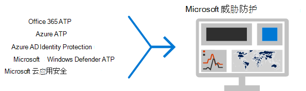

# 用于安全团队的前12个任务以支持在家中工作

如果你喜欢[Microsoft](https://www.microsoft.com/microsoft-365/blog/2020/03/10/staying-productive-while-working-remotely-with-microsoft-teams/)并突然发现你支持主要的基于家庭的劳动力，我们希望帮助你确保你的组织尽可能安全地工作。 本文对任务进行了划分，以帮助安全团队尽快实现最重要的安全功能。 

如果您是使用 Microsoft 商业版计划的小型组织或中型组织，请参阅以下资源：
- [确保 Office 365 和 Microsoft 365 商业版计划安全的十大方法](../admin/security-and-compliance/secure-your-business-data.md) 
- [适用于市场活动的 Microsoft 365](https://docs.microsoft.com/microsoft-365/campaigns/?view=o365-worldwide) （包括 Microsoft 365 商业版建议的安全配置）

  
对于使用我们的企业计划的客户，Microsoft 建议您完成下表中列出的适用于您的服务计划的任务。 如果你将订阅组合在一起，而不是购买 Microsoft 365 企业版计划，请注意以下事项：
- Microsoft 365 E3 包括企业移动性 + 安全性（EMS） E3 和 Azure AD P1
- Microsoft 365 E5 包括 EMS E5 和 Azure AD P2
  
||**任务**| 所有 Office 365 企业版计划|**Microsoft 365 E3** |**Microsoft 365 E5**|
|:-----|:-----|:-----|:-----|:-----|
|1      |[启用 Azure 多重身份验证（MFA）](#1-enable-azure-multi-factor-authentication-mfa)   |     |   |       | 
|双面     | [防御 Office 365 中的威胁](#2-protect-against-threats-in-office-365) | |         |        | 
|第三章      |  [配置 Office 365 高级威胁防护](#3-configure-office-365-advanced-threat-protection)  |   |      |       | 
|4       | [配置 Azure 高级威胁防护（ATP）](#4-configure-azure-advanced-threat-protection)   |   |      |       | 
|5      |   [启用 Microsoft 高级威胁防护](#5-turn-on-microsoft-advanced-threat-protection)  |  |      |       | 
|6       | [为电话和平板电脑配置 Intune 移动应用保护](#6-configure-intune-mobile-app-protection-for-phones-and-tablets) |    |         |         | 
|7      | [为来宾配置 MFA 和条件访问，包括 Intune 应用保护](#7-configure-mfa-and-conditional-access-for-guests-including-intune-mobile-app-protection)  |    |       |       | 
|8       |  [将电脑注册到设备管理并要求符合合规性的电脑](#8-enroll-pcs-into-device-management-and-require-compliant-pcs)   |  |         |         | 
|9       | [为云连接优化你的网络](#9-optimize-your-network-for-cloud-connectivity)  |   |      |        | 
|10    | [培训用户](#10-train-users) |     |      |      | 
|11x17 |[Microsoft 云应用安全入门](#11-get-started-with-microsoft-cloud-app-security) |   |   |   |
|12  |[监视威胁并采取措施](#12-monitor-for-threats-and-take-action) |   |  |  |
| | | |

   
在开始之前，请在 Microsoft 365 安全中心检查[microsoft 365 安全分数](https://docs.microsoft.com/microsoft-365/security/mtp/microsoft-secure-score)。 通过集中式仪表板，可以监视和提高 Microsoft 365 标识、数据、应用程序、设备和基础结构的安全性。 为您提供配置推荐安全功能、执行与安全相关的任务（如查看报告）或使用第三方应用程序或软件解决建议的相关积分。 本文中建议的任务将提高你的成绩。
  

  
## 1：启用 Azure 多因素身份验证（MFA）
为提高在家工作的员工的安全性，您可以采取的单一最佳做法是启用 MFA。 如果你还没有现成的过程，请将其视为紧急试点，并确保你的支持人员准备好帮助遇到障碍的员工。 由于你可能无法分布硬件安全设备，请使用 Windows Hello 生物识别和智能手机身份验证应用（如 Microsoft 身份验证器）。

通常情况下，Microsoft 建议你在要求进行 MFA 之前，为用户分配14天的时间来注册其设备以进行多重身份验证。 但是，如果您的工作团队突然在家中工作，请继续执行并要求 MFA 成为安全优先级，并准备好帮助需要它的用户。 

应用这些策略只需要几分钟时间，但在接下来的几天内准备为你的用户提供支持。  

|计划  |建议  |
|---------|---------|
|Office 365 计划（不包含 Azure AD P1 或 P2）     |[在 AZURE AD 中启用安全默认设置](https://docs.microsoft.com/azure/active-directory/fundamentals/concept-fundamentals-security-defaults)。 Azure AD 中的安全性默认值包括用户和管理员的 MFA。   |
|Microsoft 365 E3 （使用 Azure AD P1）     | 使用[常见的条件访问策略](https://docs.microsoft.com/azure/active-directory/conditional-access/concept-conditional-access-policy-common)配置以下策略：  - [要求对管理员进行 MFA](https://docs.microsoft.com/azure/active-directory/conditional-access/howto-conditional-access-policy-admin-mfa)  - [要求对所有用户进行 MFA](https://docs.microsoft.com/azure/active-directory/conditional-access/howto-conditional-access-policy-all-users-mfa)   - [阻止旧版身份验证](https://docs.microsoft.com/azure/active-directory/conditional-access/howto-conditional-access-policy-block-legacy)       |
|Microsoft 365 E5 （使用 Azure AD P2）     | 利用 Azure AD Identity Protection，开始通过创建以下两个策略来实现 Microsoft[建议的条件访问和相关策略集](../enterprise/identity-access-policies.md)：  - [当登录风险为 "中" 或 "高" 时，需要进行 MFA](../enterprise/identity-access-policies.md#require-mfa-based-on-sign-in-risk)  - [阻止不支持新式身份验证的客户端](../enterprise/identity-access-policies.md#block-clients-that-dont-support-modern-authentication) - [高风险用户必须更改密码](../enterprise/identity-access-policies.md#high-risk-users-must-change-password)       |
| | |

  
## 2：针对 Office 365 中的威胁进行保护

所有 Office 365 计划都包括各种威胁防护功能。 Bumping 对这些功能的保护只需几分钟。
- 反恶意软件保护
- 防止恶意 Url 和文件
- 防钓鱼保护
- 反垃圾邮件保护

请参阅[针对 Office 365 中的威胁进行保护](office-365-security/protect-against-threats.md)，以获取可用作起点的指南。
    

## 3：配置 Office 365 高级威胁防护

Office 365 高级威胁防护（ATP），包括在 Microsoft 365 E5 和 Office 365 E5 中，保护您的组织免受电子邮件、链接（Url）和协作工具带来的恶意威胁的侵扰。 这可能需要几个小时才能进行配置。

Office 365 ATP：
- 使用智能系统检查附件和链接以查看恶意内容，从而实时保护组织免受未知电子邮件威胁的侵扰。 这些自动化系统包括强健的沙箱平台、试探方法和机器学习模型。 
- 通过识别和阻止工作组网站和文档库中的恶意文件，在用户协作和共享文件时保护组织。 
- 应用机器学习模型和高级模拟检测算法，以防止网络钓鱼攻击。 

有关概述（包括计划摘要），请参阅[Office 365 高级威胁防护](office-365-security/office-365-atp.md)。

全局管理员可以配置这些保护：
- [设置 ATP 安全链接](office-365-security/set-up-atp-safe-links-policies.md)
- [设置 ATP 安全附件策略](office-365-security/set-up-atp-safe-attachments-policies.md)
- [设置自定义“不重写”URL 列表](office-365-security/set-up-a-custom-do-not-rewrite-urls-list-with-atp.md)
- [设置自定义已阻止 URL 列表](office-365-security/set-up-a-custom-blocked-urls-list-wtih-atp.md)

你需要与 Exchange Online 管理员和 SharePoint Online 管理员合作，为这些工作负载配置 ATP：
- [启用适用于 SharePoint、OneDrive 和 Microsoft Teams 的 ATP](office-365-security/turn-on-atp-for-spo-odb-and-teams.md)

## 4：配置 Azure 高级威胁防护

[Azure 高级威胁防护](https://docs.microsoft.com/azure-advanced-threat-protection/what-is-atp)（azure ATP）是基于云的安全解决方案，它利用本地 Active Directory 信号识别、检测和调查组织中的高级威胁、已损坏的身份和恶意内幕行为。 将重点放在接下来，因为它保护您的本地和云基础结构，没有任何依赖项或先决条件，并且可以提供直接的好处。

- 请参阅[AZURE ATP 快速入门](https://docs.microsoft.com/azure-advanced-threat-protection/install-atp-step1)以快速获取安装程序 
- 观看[视频： AZURE ATP 简介](https://www.youtube.com/watch?reload=9&v=EGY2m8yU_KE)
- 查看[AZURE ATP 部署的三个阶段](https://docs.microsoft.com/azure-advanced-threat-protection/what-is-atp#whats-next)

## 5：打开 Microsoft 高级威胁防护

现在，你已配置了 Office 365 ATP 和 Azure ATP，你可以在一个仪表板中查看这些功能中的组合信号。 [Microsoft 威胁防护](https://docs.microsoft.com/microsoft-365/security/mtp/microsoft-threat-protection)（MTP）将警报、事件、自动调查和响应以及跨工作负载（Azure ATP、OFFICE 365 ATP、MICROSOFT Defender ATP 和 Microsoft 云应用安全）的高级调查引入到[security.microsoft.com](https://security.microsoft.com)中的单个窗格中。 
 

  
配置了一个或多个高级威胁防护服务后，打开 MTP。 向 MTP 持续添加了新功能;考虑选择接收预览功能。

- [了解有关 MTP 的详细信息](https://docs.microsoft.com/microsoft-365/security/mtp/microsoft-threat-protection?view=o365-worldwide)
- [启用 MTP](https://docs.microsoft.com/microsoft-365/security/mtp/mtp-enable?view=o365-worldwide)
- [选择加入预览功能](https://docs.microsoft.com/microsoft-365/security/mtp/preview?view=o365-worldwide)

## 6：为电话和平板电脑配置 Intune 移动应用保护

Microsoft Intune 移动应用管理（MAM）允许你管理和保护你的组织在手机和平板电脑上的数据，而无需管理这些设备。 以下是相应的工作方式：
- 您创建了一个应用程序保护策略（应用），用于确定设备上的哪些应用程序被管理以及允许哪些行为（例如，阻止将来自托管应用程序的数据复制到非托管应用程序）。 为每个 platorm （iOS、Android）创建一个策略。
- 创建应用保护策略后，通过在 Azure AD 中创建条件访问规则来强制实施这些策略，以要求获得批准的应用和应用数据保护。

应用保护策略包括许多设置。 幸运的是，您无需了解每个设置并权衡选项。 通过推荐起始点，Microsoft 可以轻松地应用设置的配置。 [使用应用保护策略的数据保护框架](https://docs.microsoft.com/mem/intune/apps/app-protection-framework)包括三个可供选择的级别。 

更好的是，Microsoft 将此应用保护框架与一组条件访问和相关策略协调，我们建议所有组织都将其用作起始点。 如果您已使用本文中的指导实施了 MFA，那么你就是这样！

若要配置移动应用保护，请使用[常见标识和设备访问策略](../enterprise/identity-access-policies.md)中的指导：
 1. 使用[应用程序数据保护策略](../enterprise/identity-access-policies.md#apply-app-data-protection-policies)指南可为 IOS 和 Android 创建策略。 对于基准保护，建议使用级别2（增强的数据保护）。 
 2. 创建条件访问规则以[要求获得批准的应用程序和应用程序保护](../enterprise/identity-access-policies.md#require-approved-apps-and-app-protection)。 

## 7：为来宾配置 MFA 和条件访问，包括 Intune 移动应用保护

接下来，让我们确保你可以继续协作并与来宾合作。 如果您使用的是 Microsoft 365 E3 计划，并且您为所有用户实施了 MFA，则会进行设置。 

如果使用的是 Microsoft 365 E5 计划，并且要利用基于风险的 MFA 的 Azure 标识保护，则需要进行一些调整（因为 Azure AD Identity Protection 不会扩展到来宾）：
- 创建一个新的条件访问规则，以对来宾和外部用户始终要求进行 MFA。
- 更新基于风险的 MFA 条件访问规则以排除来宾和外部用户。

使用[更新常见策略的指南，以允许和保护来宾和外部访问](../enterprise/identity-access-policies-guest-access.md)，以了解来宾访问如何与 Azure AD 配合工作以及如何更新受影响的策略。 

你创建的 Intune 移动应用保护策略与条件访问规则一起使用，以要求获得批准的应用和应用保护，应用于来宾帐户并将帮助保护组织数据。 

**注意**：如果已将电脑注册到设备管理中，以要求符合条件的电脑，则还需要从强制实施设备合规性的条件访问规则中排除来宾帐户。 

## 8：将电脑注册到设备管理中并要求遵守合规性的电脑

有几种方法可用于注册员工的设备。 每种方法都取决于设备的所有权（个人或公司）、设备类型（iOS、Windows、Android）和管理要求（重置、关联、锁定）。 这可能需要一些时间才能进行排序。请参阅：[在 Microsoft Intune 中注册设备](https://docs.microsoft.com/mem/intune/enrollment/)。 

要做的最快的方法是[设置 Windows 10 设备的自动注册](https://docs.microsoft.com/mem/intune/enrollment/quickstart-setup-auto-enrollment)。 

您还可以利用以下教程：
- [使用 Autopilot 在 Intune 中注册 Windows 设备](https://docs.microsoft.com/mem/intune/enrollment/tutorial-use-autopilot-enroll-devices)
- [在 Apple Business Manager （ABM）中使用 Apple 的公司设备注册功能在 Intune 中注册 iOS/iPadOS 设备](https://docs.microsoft.com/mem/intune/enrollment/tutorial-use-device-enrollment-program-enroll-ios)

注册设备后，请使用[常见标识和设备访问策略](../enterprise/identity-access-policies.md)中的指导来创建以下策略：
- [定义设备合规性策略](../enterprise/identity-access-policies.md#define-device-compliance-policies)—推荐用于 Windows 10 的设置，包括需要进行病毒防护。 如果你有 Microsoft 365 E5，请使用 Microsoft Defender 高级威胁防护来监视员工设备的运行状况。 请确保其他操作系统的合规性策略包括防病毒保护和终结点保护软件。 
- [需要符合](../enterprise/identity-access-policies.md#require-compliant-pcs-but-not-compliant-phones-and-tablets)要求的电脑—这是 Azure AD 中强制实施设备合规性策略的条件访问规则。

只有一个组织可以管理设备，因此请务必从 Azure AD 中的条件访问规则中排除来宾帐户。 如果不从需要设备符合性的策略中排除来宾和外部用户，则这些策略将阻止这些用户。 有关详细信息，请参阅[更新通用策略以允许和保护来宾和外部访问](../enterprise/identity-access-policies-guest-access.md)。

## 9：为云连接优化你的网络

如果要快速使大部分员工在家中工作，这种连接模式的突然转换可能会对企业网络基础结构产生重大影响。 许多网络在采用云服务之前进行了扩展和设计。 在许多情况下，网络具有远程工作人员的容错性，但不能同时供所有用户远程使用。

网络元素（如 VPN 集中式）、中央网络出口设备（如代理和数据丢失防护设备）、中心 internet 带宽、backhaul MPLS 电路、NAT 功能等，突然由于使用它们的整个业务负载造成的压力而受到巨大压力的影响。 最终结果是，性能和工作效率差加在适应在家中工作的用户的用户体验方面较差。

由您的用户访问的云应用提供传统上通过公司网络提供的一些保护。 如果你已在本文中完成这一步，你已为 Microsoft 365 服务和数据实施了一组完善的云安全控制。 使用这些控制措施后，您可以准备将远程用户的流量直接路由到 Office 365。 如果仍需要 VPN 链接访问其他应用程序，可以通过实施拆分隧道来大大提高性能和用户体验。 在您的组织中实现协议后，可通过协调好的网络团队在一天内完成此工作。

有关详细信息，请参阅文档中的以下资源：
- [概述：使用 VPN 拆分隧道为远程用户优化 Office 365 连接](https://docs.microsoft.com/Office365/Enterprise/office-365-vpn-split-tunnel)
- [实现 Office 365 的 VPN 拆分隧道](https://docs.microsoft.com/Office365/Enterprise/office-365-vpn-implement-split-tunnel)

有关本主题的最新博客文章：
- [如何快速优化针对远程员工的 Office 365 流量 & 减少基础结构的负载](https://techcommunity.microsoft.com/t5/office-365-blog/how-to-quickly-optimize-office-365-traffic-for-remote-staff-amp/ba-p/1214571#)
- [安全专业人员和 IT 在当今独特的远程工作场景中实现新式安全控制的替代方法](https://www.microsoft.com/security/blog/2020/03/26/alternative-security-professionals-it-achieve-modern-security-controls-todays-unique-remote-work-scenarios/)

## 10：培训用户

当用户不知道组织中工作的威胁防护功能时，他们可能会陷入保护功能不足或阻止其完成工作的保护功能，从而获得不受欢迎的功能。 此外，如果他们事先知道要在可疑电子邮件或 Url 中监视哪些内容，则打开可疑项目的可能性将会大大降低。 培训用户可将您的用户和安全操作团队保存大量时间和不满。

Harvard 肯尼迪 School [Cybersecurity 活动手册](https://go.microsoft.com/fwlink/?linkid=2015598&amp;clcid=0x409)提供了有关在组织内建立强大的安全感知文化的最佳指南，包括培训用户以识别网络钓鱼攻击。 

Microsoft 365 提供了以下资源来帮助您在组织中通知用户：

|概念  |资源  |
|---------|---------|
|Microsoft 365     |[可自定义的学习途径](https://docs.microsoft.com/office365/customlearning/) 
这些资源可帮助您将组织中最终用户的培训放在一起        |
|Microsoft 365 安全中心 |[学习模块：使用 Microsoft 365 内置的智能安全保护您的组织](https://docs.microsoft.com/learn/modules/security-with-microsoft-365) 
此模块使您能够描述 Microsoft 365 安全功能如何协同工作，并阐明这些安全功能的优势。 |
|多重身份验证     | [双重验证：什么是额外的验证页？](https://docs.microsoft.com/azure/active-directory/user-help/multi-factor-authentication-end-user-first-time) 
本文帮助最终用户了解什么是多重身份验证，以及在您的组织中使用它的原因。    |
| | |

除了本指南之外，Microsoft 还建议您的用户执行本文中所述的操作：[保护您的帐户和设备免受黑客和恶意软件的攻击](https://support.office.com/article/066d6216-a56b-4f90-9af3-b3a1e9a327d6.aspx)。 这些操作包括：
  
- 使用强密码
    
- 保护设备 
    
- 在 Windows 10 和 Mac 电脑（针对非托管设备）上启用安全功能
    
Microsoft 还建议用户采取以下文章中建议的操作来保护其个人电子邮件帐户：
  
- [帮助保护你的 Outlook.com 电子邮件帐户](https://support.office.com/article/a4f20fc5-4307-4ece-8231-6d4d4bd8a9ba.aspx)
    
- [通过2步验证保护你的 Gmail 帐户](https://go.microsoft.com/fwlink/?linkid=2015688&amp;clcid=0x409)

## 11： Microsoft Cloud App Security 入门

[Microsoft 云应用安全性](https://docs.microsoft.com/cloud-app-security)提供丰富的可视性、控制数据旅行和完善的分析，以跨所有云服务识别和防御威胁。 一旦您开始使用云应用安全性，将自动启用异常检测策略，但云应用安全性在一段七天内将有一个为期七天的初始学习周期，而不会引发所有异常检测警报。

现在即可开始使用云应用安全。 稍后，您可以设置更复杂的监视和控件。

- [快速入门：云应用安全入门](https://docs.microsoft.com/cloud-app-security/getting-started-with-cloud-app-security)
- [获取即时行为分析和异常情况检测](https://docs.microsoft.com/cloud-app-security/anomaly-detection-policy)
- [了解有关 Microsoft 云应用安全性的详细信息](https://docs.microsoft.com/cloud-app-security/what-is-cloud-app-security)
- [查看新的特性和功能](https://docs.microsoft.com/cloud-app-security/release-notes)
- [请参阅基本设置说明](https://docs.microsoft.com/cloud-app-security/general-setup)

## 12：监视威胁并采取措施

Microsoft 365 包括几种监视状态和采取相应操作的方法。 您最好的起点是 Microsoft 365 安全中心（[https://security.microsoft.com](https://security.microsoft.com)），您可以在其中查看您的组织的[Microsoft 安全分数](https://docs.microsoft.com/microsoft-365/security/mtp/microsoft-secure-score?view=o365-worldwide)，以及需要您注意的任何警报或实体。

- [Microsoft 365 安全中心入门](https://docs.microsoft.com/microsoft-365/security/mtp/overview-security-center?view=o365-worldwide)
- [监视和查看报表](https://docs.microsoft.com/microsoft-365/security/mtp/monitoring-and-reporting?view=o365-worldwide)
- [请参阅 Microsoft 365 中的安全门户](https://docs.microsoft.com/microsoft-365/security/mtp/portals)

## 后续步骤

恭喜！ 您已经快速实现了一些最重要的安全保护，并且您的组织更安全。 现在，您已准备好继续使用威胁防护功能（包括 Microsoft Defender 高级威胁防护）、数据分类和保护功能，并保护管理帐户。 有关 Microsoft 365 的更深入的一组安全建议，请参阅[microsoft 365 security For Business 决策者（bdm）](Microsoft-365-security-for-bdm.md)。 

此外，在[docs.microsoft.com/security](https://docs.microsoft.com/security)上访问 Microsoft 新的安全中心。 
