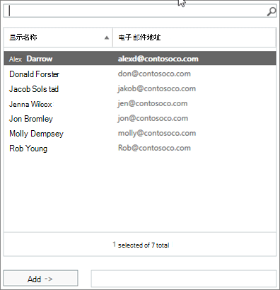
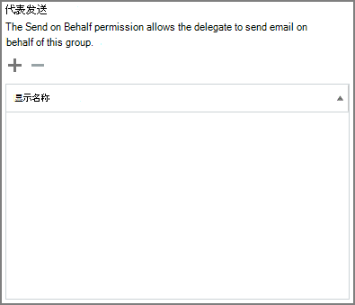

# 允许成员以组的名义发送或代表组发送

已被授予Microsoft 365"代理发送"或"代表发送"权限的组的成员可以组或代表组发送电子邮件。  (组内来宾无法授予这些权限。) 

本文介绍全局管理员或Exchange管理员如何设置这些权限。
  
例如，如果 Megan Bowen 是 **Training** Microsoft 365 组的一部分，并且具有该组的"发送为"权限，那么如果作为组发送电子邮件，则看起来好像培训组已发送电子邮件。 
  
"**代表发送**"权限允许用户代表组Microsoft 365发送电子邮件。 例如，如果 Alex Wilber 是 Marketing **Microsoft 365** 组的一部分，并且具有"代表发送"权限并作为组发送电子邮件，则电子邮件看起来好像是由 **Alex Wilber** 代表 Marketing 发送的。

> [!IMPORTANT]
> 您可以为 **给定用户配置****"** 代理发送"或"代表发送"，但不能同时配置这两者。 如果同时配置这两者，它将默认 **为"发送为"。**

> [!TIP]
> 请参阅[从组](https://support.microsoft.com/office/0f4964af-aec6-484b-a65c-0434df8cdb6b)或代表Microsoft 365发送电子邮件，了解如何使用 Outlook Outlook Web 上发送来自组的电子邮件。
    
## 允许成员以组发送电子邮件

本部分介绍如何允许用户在 Exchange[管理](https://go.microsoft.com/fwlink/p/?linkid=2059104)中心中以组 (EAC) Exchange Online。
  
1. In the <a href="https://go.microsoft.com/fwlink/p/?linkid=2059104" target="_blank">Exchange admin center，</a>go to **Recipients** \> **Groups**.
    
2. 选择 **"编辑**  上要允许用户发送为 的 。 
    
3. 选择 **组委派**。
    
4. 在 **"发送为** "部分，选择符号以添加要作为组 **+** 发送的用户。 
    
    
  
5. 键入 以从列表中搜索或选取用户。 选择 **"确定"** 和"**保存"。**
    
    
  
## 允许成员代表组发送电子邮件

本部分介绍如何允许用户代表 Exchange 管理中心中的组发送电子邮件 (EAC) Exchange Online。
  
1. In the <a href="https://go.microsoft.com/fwlink/p/?linkid=2059104" target="_blank">Exchange admin center，</a>go to **Recipients** \> **Groups**.
    
2. 选择 **"编辑**  上要允许用户发送为 的 。 
    
3. 选择 **组委派**。
    
4. 在"代表发送"部分，选择符号以添加要作为组 **+** 发送的用户。 
    
    
  
5. 键入 以从列表中搜索或选取用户。 选择 **"确定"** 和"**保存"。**
    
    

## 相关文章

[协作治理规划分步规划](collaboration-governance-overview.md#collaboration-governance-planning-step-by-step)

[创建协作管理计划](collaboration-governance-first.md)

[了解有关组Microsoft 365信息](https://support.microsoft.com/office/b565caa1-5c40-40ef-9915-60fdb2d97fa2)

[Add-RecipientPermission](/powershell/module/exchange/add-recipientpermission)

[Set-UnifiedGroup](/powershell/module/exchange/set-unifiedgroup)