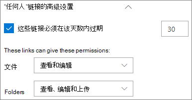
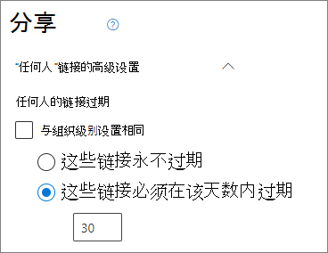
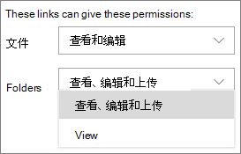
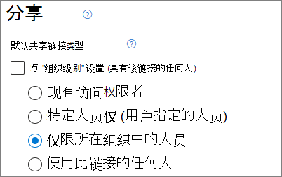
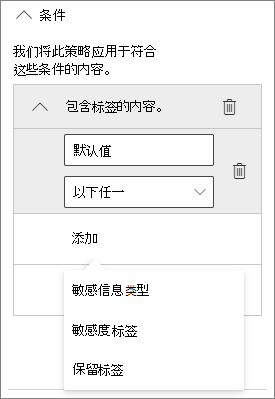
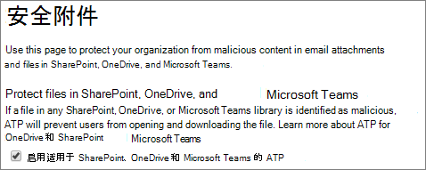

# 有关与身份未经验证用户共享文件和文件夹的最佳做法

未经身份验证共享（*任何人* 链接）非常方便，在各种情景中都很有用。 *任何人* 链接是最简单的共享方式：用户无需身份验证即可打开链接，并可将其自由传递给其他人。

通常，并非组织内容所有内容都适用于未经身份验证的共享。本文介绍了可用来帮助创建一个环境的选项，在这个环境中，用户可以使用未经身份验证的文件和文件夹共享，但同时也有安全措施帮助保护组织的内容。

> [!NOTE]
> 若要正常使用未经身份验证共享功能，必须为你的组织以及要使用的各个网站或团队启用该功能。 对于你希望启用该功能的情景，请参阅[与组织外部人员协作](collaborate-with-people-outside-your-organization.md)。

## 设置“任何人”链接的到期日期

文件通常在网站、组和团队中存储很长一段时间。 偶尔有些数据保留策略会要求将文件保留几年时间。 如果与未经身份验证人员共享此类文件，可能会导致将来在意想不到的情况下访问和更改文件。 为了降低这种可能性，可为 *任何人* 链接配置到期时间。

*任何人* 链接到期后，不能再将其用于访问内容。

设置组织中“任何人”链接到期日期

1. 在 SharePoint 管理中心中，展开“**策略**”，然后选择“<a href="https://go.microsoft.com/fwlink/?linkid=2185222" target="_blank">**共享**</a>”。
1. 在 **“任何人链接的选择到期和权限”** 下，选中 **“这些链接必须在这些天数内过期”** 复选框。 
   
1. 在输入框中键入天数，然后单击“**保存**”。

设置特定站点“任何人”链接的到期日期

1. 在 SharePoint 管理中心中，展开“**网站**”，然后选择“<a href="https://go.microsoft.com/fwlink/?linkid=2185220" target="_blank">**活动网站**</a>”。
1. 选择要更改的站点，然后选择“**共享**”。
1. 在“**“任何人”链接的高级设置**” 的“**”任何人“链接到期**”下，取消选中“**与组织级设置相同**”复选框。 
   
1. 选择“**这些链接必须在该天数内过期**”选项，然后再框中输入天数。
1. 选择“**保存**”。

请注意，*任何人* 链接到期后，可以使用新的“*任何人*”链接重新共享该文件或文件夹。

可使用 [Set-SPOSite](/powershell/module/sharepoint-online/set-sposite) 设置特定 OneDrive 的“*任何人*”链接的到期时间。

## 设置链接权限

默认情况下，文件的 *Anyone* 链接允许用户编辑文件，文件夹的 *Anyone* 链接则允许用户编辑和查看文件，并将新文件上传到文件夹。可以将文件和文件夹的这些权限单独更改为仅查看。

如果希望允许未经身份验证共享，但担心未经身份验证的人员修改组织的内容，可考虑将文件和文件夹权限设置为“**查看**”。

设置组织中“任何人”链接权限

1. 打开 SharePoint 管理中心，然后选择 <a href="https://go.microsoft.com/fwlink/?linkid=2185222" target="_blank">**共享**</a>。
1. 在“**‘任何人’链接的高级设置**”下，选择要使用的文件和文件夹权限。 
   

“*任何人*”链接设置为“**查看**”后，用户仍可与来宾共享文件和文件夹，并可使用 *特定人员* 链接为其提供编辑权限。 这些链接要求组织外人员作为来宾进行身份验证，并且你可以跟踪和审核使用这些链接共享的文件和文件夹上的来宾活动。

## 将默认链接类型设置为仅适用于组织内部人员

为组织启用 *任何人* 共享后，通常将默认共享链接设置为“**任何人**”。 虽然这对用户来说非常方便，但是会增加意外的未经身份验证的共享风险。 如果用户忘记在共享敏感文档时更改链接类型，可能会意外地创建不需要身份验证的共享链接。

你可以通过将默认链接设置更改为仅适用于组织内部人员的链接来降低此风险。 确实需要未经身份验证共享的用户，则必须明确选择该选项。

为组织设置默认文件和文件夹共享链接
1. 打开 SharePoint 管理中心，然后选择 <a href="https://go.microsoft.com/fwlink/?linkid=2185222" target="_blank">**共享**</a>。
1. 在“**文件和文件夹链接**”下，选中“**仅限组织中的人员**”。

   

1. 选择“**保存**”

为特定站点设置默认文件和文件夹共享链接

1. 在 SharePoint 管理中心中，展开“**网站**”，然后选择“<a href="https://go.microsoft.com/fwlink/?linkid=2185220" target="_blank">**活动网站**</a>”。
1. 选择要更改的站点，然后选择“**共享**”。
1. 在“**默认共享链接类型**”下，清除“**与组织级别设置相同**”复选框。

   

1. 选择“**仅限组织中的人员**”选项，然后选择“**保存**”。

## 阻止未经身份验证共享敏感内容

可使用 [数据丢失防护（DLP）](../compliance/dlp-learn-about-dlp.md) 阻止未经身份验证共享敏感内容。 数据丢失防护可以根据文件的敏感度标签、保留标签或文件本身中的敏感信息采取措施。

创建 DLP 规则
1. 在 Microsoft 365 合规性管理中心中，转到“[数据丢失防护页面](https://compliance.microsoft.com/datalossprevention)”。
2. 单击“**创建策略**”。
3. 选择“**自定义**”，然后单击“**下一步**”。
4. 键入策略名称，并单击“**下一步**”。
5. 在“**要应用该策略的位置**”页面上，关闭除 “**SharePoint 网站**”和 “**OneDrive 帐户**”之外的所有设置，然后单击“**下一步**”。
6. 在“**定义策略设置**”页面上，单击“**下一步**”。
7. 在“**自定义高级 DLP 规则**”页面上，单击“**创建规则**”并输入规则名称。
8. 在“**条件**”下，单击“**添加条件**”，然后选择“**内容包含**”。
9. 单击“**添加**”，然后选择要阻止未经身份验证共享的信息类型。

   

10. 在“**操作**”下，单击“**添加操作**”，然后选择“**限制访问或对 Microsoft 365 位置中的内容进行加密**”。
11. 选中“**限制访问或对 Microsoft 365 位置中的内容进行加密**”复选框，然后选择“**仅限通过“使用此链接的任何人”选项提供内容访问权限的人员**”选项。

      

12. 单击“**保存**”，然后单击“**下一步**”。
13. 选择测试选项，然后单击“**下一步**”。
14. 单击“**提交**”，然后单击“**完成**”。

## 防范恶意文件

如果允许匿名用户上传文件，可能会增加他人上载恶意文件的风险。 在 Microsoft 365 中，可使用 Defender for Office 365 中的 *安全附件* 功能自动扫描上传的文件并隔离发现的不安全文件。

启用安全附件
1. 在安全性和合规性管理中心中打开 “[ATP 安全附件页面](https://protection.office.com/safeattachmentv2)”。
2. 单击“**全局设置**”。
3. 启用适用于 SharePoint、OneDrive 和 Microsoft Teams 的 ATP。

   

4. 也可以选择打开安全文档，然后单击“**保存**”

请参阅[适用于 SharePoint、OneDrive 和 Microsoft Teams 的 ATP](../security/office-365-security/mdo-for-spo-odb-and-teams.md) 和[启用适用于 SharePoint、OneDrive 和 Microsoft Teams 的 ATP](../security/office-365-security/turn-on-mdo-for-spo-odb-and-teams.md) 以获取其他指导。

## 将版权信息添加到文件

如果在 Microsoft 365 合规管理中心使用灵敏度标签，则可以配置标签，以便自动向组织的 Office 文档添加水印或页眉/页脚。 通过这种方法，可确保共享文件包含版权或其他所有权信息。

向带标签的文件添加页脚

1. 打开 [Microsoft 365 合规管理中心](https://compliance.microsoft.com)。
2. 在左侧导航栏中的“**解决方案**”下，单击“**信息保护**”。
3. 单击要添加页脚的标签，然后单击“**编辑标签**”。
4. 单击“**下一步**”以进入“**内容标记**”选项卡，然后“**启用**”内容标记。
5. 选中要添加的文本类型的复选框，然后单击“**自定义文本**”。
6. 键入要添加到文档中的文本，选择所需的文本选项，然后单击“**保存**”。 
   
7. 单击“**下一步**”以到达向导的结尾，然后单击“**保存标签**”。

为标签启用内容标记后，用户应用该标签时，你指定的文本将添加到 Office 文档。

## 另请参阅

[敏感度标签概述](/Office365/SecurityCompliance/sensitivity-labels)

[与来宾共享时限制文件意外曝光](share-limit-accidental-exposure.md)

[创建安全的来宾共享环境](create-secure-guest-sharing-environment.md)
