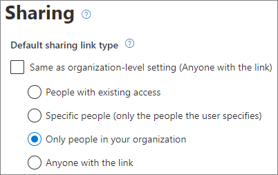

# 有关与身份未经验证用户共享文件和文件夹的最佳做法Best practices for sharing files and folders with unauthenticated users

未经身份验证共享（*任何人* 链接）非常方便，在各种情景中都很有用。Unauthenticated sharing (*Anyone* links) can be convenient and is useful in various scenarios. *任何人* 链接是最简单的共享方式：用户无需身份验证即可打开链接，并可将其自由传递给其他人。*Anyone* links are the easiest way to share: people can open the link without authentication and are free to pass it on to others.

通常，并非组织内容所有内容都适用于未经身份验证的共享。本文介绍了可用来帮助创建一个环境的选项，在这个环境中，用户可以使用未经身份验证的文件和文件夹共享，但同时也有安全措施帮助保护组织的内容。Usually, not all content in an organization is appropriate for unauthenticated sharing. This article covers the options available to help you create an environment where your users can use unauthenticated sharing of files and folders, but where there are safeguards in place to help protect your organization's content.

> [!NOTE]
> 若要正常使用未经身份验证共享功能，必须为你的组织以及要使用的各个网站或团队启用该功能。For unauthenticated sharing to work, you must enable it for your organization and for the individual site or team that you'll be using. 对于你希望启用该功能的情景，请参阅[与组织外部人员协作](collaborate-with-people-outside-your-organization.md)。See [Collaborating with people outside your organization](collaborate-with-people-outside-your-organization.md) for the scenario that you want to enable.

## 设置“任何人”链接的到期日期Set an expiration date for Anyone links

文件通常在网站、组和团队中存储很长一段时间。Files are often stored in sites, groups, and teams for long periods of time. 偶尔有些数据保留策略会要求将文件保留几年时间。Occasionally there are data retention policies that require files to be retained for years. 如果与未经身份验证人员共享此类文件，可能会导致将来在意想不到的情况下访问和更改文件。If such files are shared with unauthenticated people, this could lead to unexpected access and changes to files in the future. 为了降低这种可能性，可为 *任何人* 链接配置到期时间。To mitigate this possibility, you can configure an expiration time for *Anyone* links.

*任何人* 链接到期后，不能再将其用于访问内容。Once an *Anyone* link expires, it can no longer be used to access content.

设置组织中“任何人”链接到期日期To set an expiration date for Anyone links across the organization

1. 打开 [SharePoint 管理中心](https://admin.microsoft.com/sharepoint)。Open the [SharePoint admin center](https://admin.microsoft.com/sharepoint).
2. 在左侧导航中，展开“**策略**”，然后单击“**共享**”。In the left navigation, expand **Policies**, and then click **Sharing**.
3. 在 **“任何人链接的选择到期和权限”** 下，选中 **“这些链接必须在这些天数内过期”** 复选框。Under **Choose expiration and permissions options for Anyone links**, select the **These links must expire within this many days** check box. 
   
4. 在输入框中键入天数，然后单击“**保存**”。Type a number of days in the box, and then click **Save**.

设置特定站点“任何人”链接的到期日期To set an expiration date for Anyone links on a specific site

1. 打开 [SharePoint 管理中心](https://admin.microsoft.com/sharepoint)。Open the [SharePoint admin center](https://admin.microsoft.com/sharepoint).
2. 在左侧导航中，展开“**站点**”，然后单击“**活动站点**”。In the left navigation, expand **Sites**, and then click **Active sites**.
3. 选择要更改的站点，然后单击“**共享**”。Select the site you want to change, and then click **Sharing**.
4. 在“**“任何人”链接的高级设置**” 的“**”任何人“链接到期**”下，取消选中“**与组织级设置相同**”复选框。Under **Advanced settings for Anyone links**, under **Expiration of Anyone links**, clear the **Same as organization-level setting** check box. 
   
5. 选择“**这些链接必须在该天数内过期**”选项，然后再框中输入天数。Select the **These links must expire within this many days** option, and type a number of days in the box.
6. 单击“**保存**”。Click **Save**.

请注意，*任何人* 链接到期后，可以使用新的“*任何人*”链接重新共享该文件或文件夹。Note that once an *Anyone* link expires, the file or folder can be re-shared with a new *Anyone* link.

可使用 [Set-SPOSite](/powershell/module/sharepoint-online/set-sposite) 设置特定 OneDrive 的“*任何人*”链接的到期时间。You can set *Anyone* link expiration for a specific OneDrive by using [Set-SPOSite](/powershell/module/sharepoint-online/set-sposite).

## 设置链接权限Set link permissions

默认情况下，文件的 *任何人* 链接允许用户编辑文件，而文件夹的 *任何人* 链接允许用户编辑和查看其中的文件以及向文件夹上传新文件。By default, *Anyone* links for a file allow people to edit the file, and *Anyone* links for a folder allow people to edit and view files, and upload new files to the folder. 可单独将这些文件和文件夹的权限更改为“仅查看”。You can change these permissions for files and for folders independently to view-only.

如果希望允许未经身份验证共享，但担心未经身份验证的人员修改组织的内容，可考虑将文件和文件夹权限设置为“**查看**”。If you want to allow unauthenticated sharing, but are concerned about unauthenticated people modifying your organization's content, consider setting the file and folder permissions to **View**.

设置组织中“任何人”链接权限To set permissions for Anyone links across the organization

1. 打开 [SharePoint 管理中心](https://admin.microsoft.com/sharepoint)。Open the [SharePoint admin center](https://admin.microsoft.com/sharepoint).
2. 在左侧导航中，单击“**共享**”。In the left navigation, click **Sharing**.
3. 在“**‘任何人’链接的高级设置**”下，选择要使用的文件和文件夹权限。Under **Advanced settings for "Anyone" links**, select the file and folder permissions that you want to use. 
   

“*任何人*”链接设置为“**查看**”后，用户仍可与来宾共享文件和文件夹，并可使用 *特定人员* 链接为其提供编辑权限。With *Anyone* links set to **View**, users can still share files and folders with guests and give them edit permissions by using *Specific people* links. 这些链接要求组织外人员作为来宾进行身份验证，并且你可以跟踪和审核使用这些链接共享的文件和文件夹上的来宾活动。These links require people outside your organization to authenticate as guests, and you can track and audit guest activity on files and folders shared with these links.

## 将默认链接类型设置为仅适用于组织内部人员Set default link type to only work for people in your organization

为组织启用 *任何人* 共享后，通常将默认共享链接设置为“**任何人**”。When *Anyone* sharing is enabled for your organization, the default sharing link is normally set to **Anyone**. 虽然这对用户来说非常方便，但是会增加意外的未经身份验证的共享风险。While this can be convenient for users, it can increase the risk of unintentional unauthenticated sharing. 如果用户忘记在共享敏感文档时更改链接类型，可能会意外地创建不需要身份验证的共享链接。If a user forgets to change the link type while sharing a sensitive document, they might accidentally create a sharing link that doesn't require authentication.

你可以通过将默认链接设置更改为仅适用于组织内部人员的链接来降低此风险。You can mitigate this risk by changing the default link setting to a link that only works for people inside your organization. 确实需要未经身份验证共享的用户，则必须明确选择该选项。Users who want to share with unauthenticated people would then have to specifically select that option.

为组织设置默认文件和文件夹共享链接To set the default file and folder sharing link for the organization
1. 打开 [SharePoint 管理中心](https://admin.microsoft.com/sharepoint)。Open the [SharePoint admin center](https://admin.microsoft.com/sharepoint).
2. 在左侧导航中，单击“**共享**”。In the left navigation, click **Sharing**.
3. 在“**文件和文件夹链接**”下，选中“**仅限组织中的人员**”。Under **File and folder links**, select **Only people in your organization**.

   

4. 单击“**保存**”Click **Save**

为特定站点设置默认文件和文件夹共享链接To set the default file and folder sharing link for a specific site
1. 打开 [SharePoint 管理中心](https://admin.microsoft.com/sharepoint)。Open the [SharePoint admin center](https://admin.microsoft.com/sharepoint).
2. 在左侧导航中，展开“**站点**”，然后单击“**活动站点**”。In the left navigation, expand **Sites**, and then click **Active sites**.
3. 选择要更改的站点，然后单击“**共享**”。Select the site you want to change, and then click **Sharing**.
4. 在“**默认共享链接类型**”下，清除“**与组织级别设置相同**”复选框。Under **Default sharing link type**,  clear the **Same as organization-level setting** check box.

   

5. 选择“**仅限组织中的人员**”选项，然后单击“**保存**”。Select the **Only people in your organization** option and click **Save**.

## 阻止未经身份验证共享敏感内容Prevent unauthenticated sharing of sensitive content

可使用 [数据丢失防护（DLP）](../compliance/dlp-learn-about-dlp.md) 阻止未经身份验证共享敏感内容。You can use [data loss prevention (DLP)](../compliance/dlp-learn-about-dlp.md) to prevent unauthenticated sharing of sensitive content. 数据丢失防护可以根据文件的敏感度标签、保留标签或文件本身中的敏感信息采取措施。Data loss prevention can take action based on a file's sensitivity label, retention label, or sensitive information in the file itself.

创建 DLP 规则To create a DLP rule
1. 在 Microsoft 365 合规性管理中心中，转到“[数据丢失防护页面](https://compliance.microsoft.com/datalossprevention)”。In the Microsoft 365 compliance admin center, go to the [Data loss prevention page](https://compliance.microsoft.com/datalossprevention).
2. 单击“**创建策略**”。Click **Create policy**.
3. 选择“**自定义**”，然后单击“**下一步**”。Choose **Custom** and click **Next**.
4. 键入策略名称，并单击“**下一步**”。Type a name for the policy and click **Next**.
5. 在“**要应用该策略的位置**”页面上，关闭除 “**SharePoint 网站**”和 “**OneDrive 帐户**”之外的所有设置，然后单击“**下一步**”。On the **Locations to apply the policy** page turn off all settings except **SharePoint sites** and **OneDrive accounts**, and then click **Next**.
6. 在“**定义策略设置**”页面上，单击“**下一步**”。On the **Define policy settings** page, click **Next**.
7. 在“**自定义高级 DLP 规则**”页面上，单击“**创建规则**”并输入规则名称。On the **Customize advanced DLP rules** page, click **Create rule** and type a name for the rule.
8. 在“**条件**”下，单击“**添加条件**”，然后选择“**内容包含**”。Under **Conditions**, click **Add condition**, and choose **Content contains**.
9. 单击“**添加**”，然后选择要阻止未经身份验证共享的信息类型。Click **Add** and choose the type of information for which you want to prevent unauthenticated sharing.

   

10. 在“**操作**”下，单击“**添加操作**”，然后选择“**限制访问或对 Microsoft 365 位置中的内容进行加密**”。Under **Actions** click **Add an action** and choose **Restrict access or encrypt the content in Microsoft 365 locations**.
11. 选中“**限制访问或对 Microsoft 365 位置中的内容进行加密**”复选框，然后选择“**仅限通过“使用此链接的任何人”选项提供内容访问权限的人员**”选项。Select the **Restrict access or encrypt the content in Microsoft 365 locations** check box and then choose the **Only people who were given access to the content through the "Anyone withe the link" options** option.

      

12. 单击“**保存**”，然后单击“**下一步**”。Click **Save** and then click **Next**.
13. 选择测试选项，然后单击“**下一步**”。Choose your test options and click **Next**.
14. 单击“**提交**”，然后单击“**完成**”。Click **Submit**, and then click **Done**.

## 防范恶意文件Protect against malicious files

如果允许匿名用户上传文件，可能会增加他人上载恶意文件的风险。When you allow anonymous users to upload files, you're at an increased risk of someone uploading a malicious file. 在 Microsoft 365 中，可使用 Defender for Office 365 中的 *安全附件* 功能自动扫描上传的文件并隔离发现的不安全文件。In Microsoft 365, you can use the *Safe Attachments* feature in Defender for Office 365 to automatically scan uploaded files and quarantine files that are found to be unsafe.

启用安全附件To turn on safe attachments
1. 在安全性和合规性管理中心中打开 “[ATP 安全附件页面](https://protection.office.com/safeattachmentv2)”。Open the [ATP Safe Attachments page](https://protection.office.com/safeattachmentv2) in the Security and Compliance admin center.
2. 单击“**全局设置**”。Click **Global settings**.
3. 启用适用于 SharePoint、OneDrive 和 Microsoft Teams 的 ATP。Turn on ATP for SharePoint, OneDrive, and Microsoft Teams.

   

4. 也可以选择打开安全文档，然后单击“**保存**”Optionally turn on Safe Documents as well, and then click **Save**

请参阅[适用于 SharePoint、OneDrive 和 Microsoft Teams 的 ATP](../security/office-365-security/mdo-for-spo-odb-and-teams.md) 和[启用适用于 SharePoint、OneDrive 和 Microsoft Teams 的 ATP](../security/office-365-security/turn-on-mdo-for-spo-odb-and-teams.md) 以获取其他指导。See [ATP for SharePoint, OneDrive, and Microsoft Teams](../security/office-365-security/mdo-for-spo-odb-and-teams.md) and [Turn on ATP for SharePoint, OneDrive, and Microsoft Teams](../security/office-365-security/turn-on-mdo-for-spo-odb-and-teams.md) for additional guidance.

## 将版权信息添加到文件Add copyright information to your files

如果在 Microsoft 365 合规管理中心使用灵敏度标签，则可以配置标签，以便自动向组织的 Office 文档添加水印或页眉/页脚。If you use sensitivity labels in the Microsoft 365 Compliance admin center, you can configure your labels to add a watermark or a header or footer automatically to your organization's Office documents. 通过这种方法，可确保共享文件包含版权或其他所有权信息。In this way, you can make sure that shared files contain copyright or other ownership information.

向带标签的文件添加页脚To add a footer to a labeled file

1. 打开 [Microsoft 365 合规管理中心](https://compliance.microsoft.com)。Open the [Microsoft 365 compliance admin center](https://compliance.microsoft.com).
2. 在左侧导航栏中的“**解决方案**”下，单击“**信息保护**”。In the left navigation, under **Solutions**, click **Information protection**.
3. 单击要添加页脚的标签，然后单击“**编辑标签**”。Click the label that you want to have add a footer, and then click **Edit label**.
4. 单击“**下一步**”以进入“**内容标记**”选项卡，然后“**启用**”内容标记。Click **Next** to reach the **Content marking** tab, and then turn **On** content marking.
5. 选中要添加的文本类型的复选框，然后单击“**自定义文本**”。Select the check box for the type of text you want to add, and then click **Customize text**.
6. 键入要添加到文档中的文本，选择所需的文本选项，然后单击“**保存**”。Type the text that you want added to your documents, select the text options that you want, and then click **Save**. 
   
7. 单击“**下一步**”以到达向导的结尾，然后单击“**保存标签**”。Click **Next** to reach the end of the wizard, and then click **Save label**.

为标签启用内容标记后，用户应用该标签时，你指定的文本将添加到 Office 文档。With content marking enabled for the label, the text you specified will be added to Office documents when a user applies that label.

## 另请参阅See Also

[敏感度标签概述Overview of sensitivity labels](/Office365/SecurityCompliance/sensitivity-labels)

[与来宾共享时限制文件意外曝光Limit accidental exposure to files when sharing with guests](share-limit-accidental-exposure.md)

[创建安全的来宾共享环境Create a secure guest sharing environment](create-secure-guest-sharing-environment.md)
