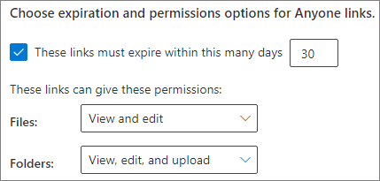

# 有关与身份未经验证用户共享文件和文件夹的最佳做法

未经身份验证共享（*任何人*链接）非常方便，在各种情景中都很有用。 *任何人*链接是最简单的共享方式：用户无需身份验证即可打开链接，并可将其自由传递给其他人。

通常情况下，并非组织中的所有内容都适合未经身份验证共享。 本文介绍了一些可用选项，这些选项可帮助你创建一个环境，让你的用户能在其中未经身份验证共享文件和文件夹，但其中也有安全措施来帮助你保护组织的内容。

> [!NOTE]
> 若要正常使用未经身份验证共享功能，必须为你的组织以及要使用的各个网站或团队启用该功能。 对于你希望启用该功能的情景，请参阅[与组织外部人员协作](collaborate-with-people-outside-your-organization.md)。

## 设置“任何人”链接的到期日期

文件通常在网站、组和团队中存储很长一段时间。 偶尔有些数据保留策略会要求将文件保留几年时间。 如果与未经身份验证人员共享此类文件，可能会导致将来在意想不到的情况下访问和更改文件。 为了降低这种可能性，可为*任何人*链接配置到期时间。

*任何人*链接到期后，不能再将其用于访问内容。

设置“任何人”链接的到期日期
1. 打开 SharePoint Online 管理中心。
2. 在左侧导航中，单击“**共享**”。
3. 在 **“任何人链接的选择到期和权限”** 下，选中 **“这些链接必须在这些天数内过期”** 复选框。 
   
4. 在输入框中键入天数，然后单击“**保存**”。

请注意，*任何人*链接到期后，可以使用新的“*任何人*”链接重新共享该文件或文件夹。

## 设置链接权限

默认情况下，文件的*任何人*链接允许用户编辑文件，而文件夹的*任何人*链接允许用户编辑和查看其中的文件以及向文件夹上传新文件。 可单独将这些文件和文件夹的权限更改为“仅查看”。

如果希望允许未经身份验证共享，但担心未经身份验证的人员修改组织的内容，可考虑将文件和文件夹权限设置为“**查看**”。

设置“任何人”链接权限
1. 打开 SharePoint Online 管理中心。
2. 在左侧导航中，单击“**共享**”。
3. 在“**‘任何人’链接的高级设置**”下，选择要使用的文件和文件夹权限。 
   

“*任何人*”链接设置为“**查看**”后，用户仍可与来宾共享文件和文件夹，并可使用*特定人员*链接为其提供编辑权限。 这些链接要求组织外人员作为来宾进行身份验证，并且你可以跟踪和审核使用这些链接共享的文件和文件夹上的来宾活动。

## 将默认链接类型设置为仅适用于组织内部人员

为组织启用*任何人*共享后，通常将默认共享链接设置为“**任何人**”。 虽然这对用户来说非常方便，但是会增加意外的未经身份验证的共享风险。 如果用户忘记在共享敏感文档时更改链接类型，可能会意外地创建不需要身份验证的共享链接。

你可以通过将默认链接设置更改为仅适用于组织内部人员的链接来降低此风险。 确实需要未经身份验证共享的用户，则必须明确选择该选项。

设置默认的文件和文件夹共享链接
1. 在 SharePoint 管理中心的左侧导航栏中，单击“**共享**”。
2. 在“**文件和文件夹链接**”下，选中“**仅限组织中的人员**”。 
   
3. 单击“**保存**”

## 防范恶意文件

如果允许匿名用户上传文件，可能会增加他人上载恶意文件的风险。 在 Microsoft 365 中，可使用高级威胁防护中的*安全附件*功能自动扫描上传的文件并隔离发现的不安全文件。

启用安全附件
1. 打开 [Microsoft 365 安全](https://security.microsoft.com)管理中心。
2. 在左侧导航中，单击“**策略**”。
3. 在“**威胁防护**”下，单击“**ATP 安全附件(Office 365)**”。
4. 选中“**为 SharePoint、OneDrive 和 Microsoft Teams 启用 ATP**”复选框，然后单击“**保存**”。 
   

## 将版权信息添加到文件

如果在 Microsoft 365 合规管理中心使用灵敏度标签，则可以配置标签，以便自动向组织的 Office 文档添加水印或页眉/页脚。 通过这种方法，可确保共享文件包含版权或其他所有权信息。

向带标签的文件添加页脚
1. 打开 [Microsoft 365 合规管理中心](https://compliance.microsoft.com)。
2. 在左侧导航中的“**分类**”下，单击“**敏感度标签**”。
3. 单击要添加页脚的标签，然后单击“**编辑标签**”。
4. 单击“**内容标记**”选项卡，然后**打开**内容标记。
5. 选中要添加的文本类型的复选框，然后单击“**自定义文本**”。
6. 键入要添加到文档中的文本，选择所需的文本选项，然后单击“**保存**”。 
   
7. 单击“**保存**”，然后单击“**关闭**”。

为标签启用内容标记后，用户应用该标签时，你指定的文本将添加到 Office 文档。

## 另请参阅

[敏感度标签概述](https://docs.microsoft.com/Office365/SecurityCompliance/sensitivity-labels)

[与来宾共享时限制文件意外曝光](share-limit-accidental-exposure.md)

[创建安全的来宾共享环境](create-secure-guest-sharing-environment.md)