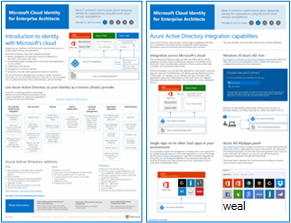
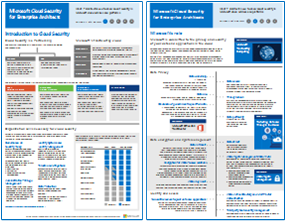
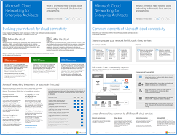
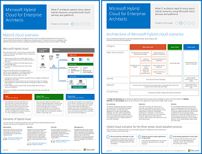
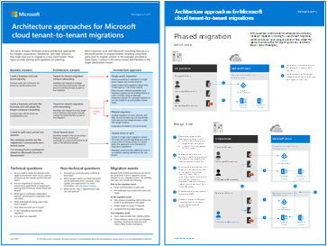

# 适用于 IT 架构师的 Microsoft 云插图

这些云体系结构海报提供有关 Microsoft 云服务的信息，包括 Microsoft 365、Azure Active Directory (Azure AD) 、Microsoft Intune、Microsoft Dynamics 365 以及混合本地和云解决方案。 

IT 决策者和架构师可以使用这些资源来确定其工作负载的理想解决方案，并做出有关核心基础结构组件（如网络、标识和安全性）的决策。

### 常见攻击和保护组织的 Microsoft 功能

了解最常见的网络攻击以及 Microsoft 在攻击的每个阶段如何帮助组织。 

| Item | 说明 |
|:-----|:-----|
|   [PDF](https://download.microsoft.com/download/F/A/C/FACFC1E9-FA35-4DF1-943C-8D4237B4275B/MSFT_Cloud_architecture_security_commonattacks.pdf) \| [Visio](https://download.microsoft.com/download/F/A/C/FACFC1E9-FA35-4DF1-943C-8D4237B4275B/MSFT_Cloud_architecture_security_commonattacks.vsdx)   2021 年 9 月更新 | 该海报展示了常见攻击的路径，并说明了哪些功能有助于在攻击的每个阶段阻止攻击者。   **相关解决方案指南**   <ul><li>[评估和试点 Microsoft 365 Defender](../security/defender/eval-overview.md)</li><li>[推荐的标识和设备访问配置](../security/office-365-security/microsoft-365-policies-configurations.md)</li><li>[为数据隐私法规部署信息保护Microsoft 365](information-protection-deploy.md)</li><li>[为 Microsoft 365 租户部署勒索软件保护](ransomware-protection-microsoft-365.md)</li><li>[Microsoft 365 内部风险解决方案](../compliance/insider-risk-solution-overview.md)</li></ul>

### 适用于 IT 架构师的 Microsoft 云标识

关于使用 Microsoft 云服务和平台为组织设计标识，IT 架构师需要了解的信息。
  
| 项目 | 说明 |
|:-----|:-----|
|   [PDF](https://download.microsoft.com/download/3/6/a/36a7c1ba-fe48-414f-92c9-9c9ddba323cd/5594928a.pdf )    2021 年 11 月更新 | 此模型包含：  <ul> <li> Microsoft 云标识简介 </li><li> Azure AD IDaaS 功能 </li><li>零信任标识和设备访问策略</li><li> 将本地 Active Directory 域服务 (AD DS) 帐户与 Azure AD </li><li> 将目录组件放入 Azure IaaS 中 </li><li> Azure IaaS 中工作负载的 AD DS 选项 </li></ul>    |

### 适用于 IT 架构师的 Microsoft 云安全性

关于 Microsoft 云服务和平台的安全性，IT 架构师需要了解的信息。
  
| 项目 | 说明 |
|:-----|:-----|
|   [PDF](https://download.microsoft.com/download/6/D/F/6DFD7614-BBCF-4572-A871-E446B8CF5D79/MSFT_cloud_architecture_security.pdf)   2021 年 11 月更新 | 此模型包含： <ul><li>Microsoft 和客户安全职责</li><li>标识和设备访问</li><li>威胁防护</li><li>信息保护 </ul> |
   

### 适用于 IT 架构师的 Microsoft 云网络

关于 Microsoft 云服务和平台的网络，IT 架构师需要了解的信息。
  
| 项目 | 说明 |
|:-----|:-----|
|    [以 PDF 格式查看](../downloads/MSFT_cloud_architecture_networking.pdf) \|[以 PDF 格式下载](https://github.com/MicrosoftDocs/microsoft-365-docs/raw/public/microsoft-365/downloads/MSFT_cloud_architecture_networking.pdf) \|[下载为Visio](https://github.com/MicrosoftDocs/microsoft-365-docs/raw/public/microsoft-365/downloads/MSFT_cloud_architecture_networking.vsdx)    2020 年 8 月更新 | 此模型包含： <ul><li> 发展你的云连接网络 </li><li> Microsoft 云连接的常见元素 </li><li> 面向 Microsoft 云连接的 ExpressRoute </li><li> 为 Microsoft SaaS、Azure PaaS 和 Azure IaaS 设计网络 </li></ul>    |

### 适用于 IT 架构师的 Microsoft 混合云

关于 Microsoft 服务和平台的混合云，IT 架构师需要了解的信息。
  
| Item | 说明 |
|:-----|:-----|
|   [以 PDF 格式查看](../downloads/MSFT_cloud_architecture_hybrid.pdf) \|[以 PDF 格式下载](https://github.com/MicrosoftDocs/microsoft-365-docs/raw/public/microsoft-365/downloads/MSFT_cloud_architecture_hybrid.pdf) \|[下载为Visio](https://github.com/MicrosoftDocs/microsoft-365-docs/raw/public/microsoft-365/downloads/MSFT_cloud_architecture_hybrid.vsdx)      2020 年 8 月更新 | 此模型包含： <ul><li> Microsoft 的云产品（SaaS、Azure PaaS 和 Azure IaaS）及它们的常用元素 </li><li> Microsoft 云产品的混合云体系结构 </li><li> Microsoft SaaS (Office 365)、Azure PaaS 和 Azure IaaS 的混合云方案 </li></ul> |

### Microsoft 云租户到租户迁移的体系结构方法 
本系列主题阐述了合并、收购、剥离和其他可能会导致你迁移到新云租户的方案的几种体系结构方法。 这些主题提供有关企业资源规划的起始指导。 

| Item | 说明 |
|:-----|:-----|
|   [PDF](https://download.microsoft.com/download/b/a/1/ba19dfe7-96e2-4983-8783-4dcff9cebe7b/microsoft-365-tenant-to-tenant-migration.pdf)   2021 年 2 月更新    |此模型包含： <ul><li>商业方案到体系结构方法的映射</li><li>设计注意事项</li><li>单个事件迁移流示例</li><li>分阶段迁移流示例</li><li>租户移动或拆分流示例</li></ul>|

## 相关资源

获取用于创建您自己的体系结构设计图表的资源：Microsoft 365[体系结构图标和模板](architecture-icons-templates.md)。

转到 [Azure 体系结构中心](/azure/architecture/)。
