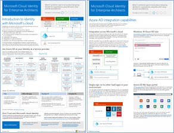

# 面向企业架构师的 Microsoft 云图解

这些云体系结构海报提供了有关 Microsoft 云服务的信息，其中包括 Microsoft 365、Azure Active Directory (Azure AD) 、Microsoft Intune、Microsoft Dynamics 365 以及混合的本地和云解决方案。 

IT 决策者和架构师可以使用这些资源来确定其工作负载的理想解决方案，并做出有关网络、标识和安全性等核心基础结构组件的决策。

### 企业级结构设计版的 Microsoft 云标识

关于使用 Microsoft 云服务和平台为组织设计标识，IT 架构师需要了解的信息。
  
|**项**|**说明**|
|:-----|:-----|
|   [以 PDF](../downloads/MSFT_cloud_architecture_identity.pdf) \| 形式查看[下载为 PDF 格式](https://github.com/MicrosoftDocs/microsoft-365-docs/raw/public/microsoft-365/downloads/MSFT_cloud_architecture_identity.pdf) \|[下载为 Visio](https://github.com/MicrosoftDocs/microsoft-365-docs/raw/public/microsoft-365/downloads/MSFT_cloud_architecture_identity.vsdx)    2020年8月更新 | 此模型包含：  <ul> <li> Microsoft 云标识简介 </li><li> Azure AD IDaaS 功能 </li><li> 将本地 Active Directory 域服务 (AD DS) 帐户与 Azure AD 集成 </li><li> 在 Azure IaaS 中放置目录组件 </li><li> Azure IaaS 中工作负荷的 AD DS 选项 </li></ul>    |
   

### 面向企业架构师的 Microsoft 云网络

关于 Microsoft 云服务和平台的网络，IT 架构师需要了解的信息。
  
|**项**|**说明**|
|:-----|:-----|
|    [以 PDF](../downloads/MSFT_cloud_architecture_networking.pdf) \| 形式查看[下载为 PDF 格式](https://github.com/MicrosoftDocs/microsoft-365-docs/raw/public/microsoft-365/downloads/MSFT_cloud_architecture_networking.pdf) \|[下载为 Visio](https://github.com/MicrosoftDocs/microsoft-365-docs/raw/public/microsoft-365/downloads/MSFT_cloud_architecture_networking.vsdx)    2020年8月更新 | 此模型包含： <ul><li> 发展你的云连接网络 </li><li> Microsoft 云连接的常见元素 </li><li> 面向 Microsoft 云连接的 ExpressRoute </li><li> 为 Microsoft SaaS、Azure PaaS 和 Azure IaaS 设计网络 </li></ul>    |

### 面向企业架构师的 Microsoft 混合云

关于 Microsoft 服务和平台的混合云，IT 架构师需要了解的信息。
  
|**项**|**说明**|
|:-----|:-----|
|   [以 PDF](../downloads/MSFT_cloud_architecture_hybrid.pdf) \| 形式查看[下载为 PDF 格式](https://github.com/MicrosoftDocs/microsoft-365-docs/raw/public/microsoft-365/downloads/MSFT_cloud_architecture_hybrid.pdf) \|[下载为 Visio](https://github.com/MicrosoftDocs/microsoft-365-docs/raw/public/microsoft-365/downloads/MSFT_cloud_architecture_hybrid.vsdx)      2020年8月更新 | 此模型包含： <ul><li> Microsoft 的云产品（SaaS、Azure PaaS 和 Azure IaaS）及它们的常用元素 </li><li> Microsoft 云产品的混合云体系结构 </li><li> Microsoft SaaS (Office 365)、Azure PaaS 和 Azure IaaS 的混合云方案 </li></ul> |
   

### Microsoft 云租户到租户迁移的体系结构方法 
本系列主题阐述了合并、收购、剥离和其他可能会导致你迁移到新云租户的方案的几种体系结构方法。 这些主题提供了有关规划的起点指南。 

|**Item**|**说明**|
|:-----|:-----|
|   [PDF](https://github.com/MicrosoftDocs/microsoft-365-docs/raw/public/microsoft-365/downloads/Microsoft-365-tenant-to-tenant-migration.pdf) \| [Visio](https://github.com/MicrosoftDocs/microsoft-365-docs/raw/public/microsoft-365/downloads/Microsoft-365-tenant-to-tenant-migration.vsdx)  2019年7月更新    |此模型包含： <ul><li>商业方案到体系结构方法的映射</li><li>设计注意事项</li><li>单事件迁移流</li><li>分阶段迁移流</li><li>租户移动或拆分流</li></ul>|

### 面向企业架构师的 Microsoft 云安全性

>[!Note]
>正在修订此模型。 请在以后查看此文章，了解更新的版本。
>

<!--

What IT architects need to know about security in Microsoft cloud services and platforms.
  
|**Item**|**Description**|
|:-----|:-----|
|[          ](https://www.microsoft.com/download/details.aspx?id=48121)   [PDF](https://go.microsoft.com/fwlink/p/?linkid=842070)  \| [Visio](https://go.microsoft.com/fwlink/p/?LinkId=842071)  \| [More languages](https://www.microsoft.com/download/details.aspx?id=48121)  Updated December 2018 | This model contains: <ul><li>Microsoft's role in providing secure services and platforms</li><li>Customer responsibilities to mitigate security risks</li><li>Top security certifications </li><li>Security offerings provided by Microsoft consulting services </ul> |

--> 

### 保护组织的常见攻击和 Microsoft 功能了解最常见的网络攻击以及 Microsoft 如何帮助您的组织在攻击的每个阶段进行。 

|**Item**|**说明**|
|:-----|:-----|
|   [PDF](https://download.microsoft.com/download/F/A/C/FACFC1E9-FA35-4DF1-943C-8D4237B4275B/MSFT_Cloud_architecture_security_commonattacks.pdf) \| [Visio](https://download.microsoft.com/download/F/A/C/FACFC1E9-FA35-4DF1-943C-8D4237B4275B/MSFT_Cloud_architecture_security_commonattacks.vsdx)   2017年8月更新 | 该海报展示了常见攻击的路径，并说明了哪些功能有助于在攻击的每个阶段阻止攻击者。  |

