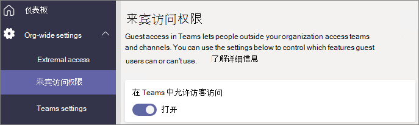
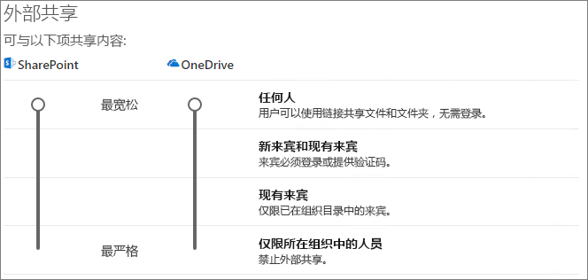

# 在团队中与来宾协作

如果需要在文档、任务和对话中与来宾进行协作，我们建议使用 Microsoft Teams。 Teams 在统一的用户体验中提供了 Office 和 SharePoint 中的所有协作功能，包括持续聊天和一套可定制和可扩展的协作工具。

在本文中，我们将介绍建立一个团队与客人协作所需的 Microsoft 365 配置步骤。 一旦配置客人的访问权限，就可以按照 [Teams 中的“添加来宾到团队”](https://support.microsoft.com/office/fccb4fa6-f864-4508-bdde-256e7384a14f) 中的步骤邀请来宾到团队。

## 视频演示

该视频展示了本文档中介绍的配置步骤。 

> [!VIDEO https://www.microsoft.com/videoplayer/embed/RE44NTr?autoplay=false]

## Azure 外部协作设置

Microsoft 365 中的共享在最高级别由 [Azure Active Directory 中的 B2B 外部协作设置](/azure/active-directory/external-identities/delegate-invitations) 管理。 如果在 Azure AD 中禁用或限制来宾共享，此设置将覆盖你在 Microsoft 365 中配置的任何共享设置。

检查 B2B 外部协作设置设置以确保不会阻止与来宾共享。

设置外部协作设置

1. 在 [https://aad.portal.azure.com](https://aad.portal.azure.com) 上登录到 Azure Active Directory。
2. 在左侧导航窗格中，单击 **Azure Active Directory**。
3. 单击 **“外部标识”**。
4. 在 **“入门”** 屏幕的左侧导航窗格中，单击 **“外部协作设置”**。
5. 请确保选择 **成员用户和分配给特定管理员角色的用户可以邀请来宾用户，包括具有成员权限的来宾** 或 **组织中的任何用户都可以邀请来宾用户，包括来宾和非管理员**。
6. 如果进行了任何更改，请单击 **“保存”**。

请注意 **“协作限制"** 部分的设置。 确保不会阻止要协作来宾的域。

如果与多个组织的来宾合作，可能需要限制其访问目录数据的能力。  这将阻止他们查看目录中的来宾。 为此，在 **“来宾用户访问限制”** 下，选择 **“来宾用户具有对目录对象设置的属性和成员身份的有限访问权限”** 或 **“来宾用户访问仅限于其自己的目录对象的属性和成员身份”**。

## Teams 来宾访问设置

Teams 具有用于来宾访问的主 “开/关” 开关，以及可用于控制来宾在团队中所能执行操作的各种设置。 主开关 **“允许来宾在 Teams 中访问”** 必须 **“打开”**，来宾才可以在 Teams 中工作。

检查以确保 Teams 中启用了“来宾访问”，并根据你的业务需求对来宾设置作出调整。请记住，这些设置会影响所有团队。

设定 Teams 来宾访问设置

1. 访问 [https://admin.microsoft.com](https://admin.microsoft.com) 登录到 Microsoft 365 管理中心。
2. 在左侧导航窗格中，单击 **“显示所有”**。
3. 在 **“管理中心”** 下，单击 **“Teams”**。
4. 在 Teams 管理中心，在左侧导航窗格中，选择 **用户** > <a href="https://go.microsoft.com/fwlink/p/?linkid=2173122" target="_blank">**来宾访问**</a>。
5. 确保 **在 Teams 中允许来宾访问** 设置为“**开**”。
6. 对其他来宾设置进行任何所需的更改，然后单击“**保存**”。

启用 Teams 来宾访问后，可以选择使用敏感度标签控制对各个团队及其关联 SharePoint 网站的来宾访问。 有关详细信息，请参阅 [使用敏感度标签保护 Microsoft Teams、Microsoft 365 组和 SharePoint 网站中的内容](../compliance/sensitivity-labels-teams-groups-sites.md)。

> [!NOTE]
> Teams 来宾设置将在启用后 24 小时内生效。

## Microsoft 365 组来宾设置

Teams 将 Microsoft 365 组用于团队成员资格。必须启用 Microsoft 365 组来宾设置，以便 Teams 中的来宾访问正常工作。

设置 Microsoft 365 组来宾设置

1. 在 Microsoft 365 管理中心左侧导航窗格中，展开 **“设置”**。
2. 单击 **“组织设置”**。
3. 在列表中，单击 **“Microsoft 365 组”**。
4. 确保复选框 **允许组所有者将组织外部人员作为来宾添加到 Microsoft 365 组** 和 **允许来宾组成员访问组内容** 都已选中。
5. 如果进行了更改，请单击 **“保存更改”**。

## SharePoint 组织级别共享设置

Teams 内容（如文件、文件夹和列表）均存储在 SharePoint 中。 为了使来宾能够访问 Teams 中的这些项目，SharePoint 组织级别的共享设置必须允许与来宾共享。

组织级别设置确定各个网站（包括与团队关联的网站）可用的设置。 网站设置不能比组织级别设置更宽松。

如果要允许与未经身份验证的人共享文件和文件夹，请选择 **“任何人”**。 如果要确保所有来宾都进行身份验证，请选择 **“新来宾和现有来宾”**。 选择组织中任何网站所需的最宽松设置。

设置 SharePoint 组织级共享设置

1. 在 <a href="https://go.microsoft.com/fwlink/p/?linkid=2024339" target="_blank">Microsoft 365 管理中心</a> 内左侧导航窗格中的 **管理中心** 下，单击“**SharePoint**”。
2. 在 SharePoint 管理中心的左侧导航窗格中，展开 **"策略"**，然后单击 **“共享”**。
3. 确保 SharePoint 的外部共享设置为 **“任何人”** 或 **“新来宾和现有来宾”**。
4. 如果进行了任何更改，请单击 **“保存”**。

## SharePoint 组织级别的默认链接设置

默认文件和文件夹链接设置确定在用户共享文件或文件夹时默认向用户显示的链接选项。 如果需要，用户可以在共享之前将链接类型更改为其他选项之一。

请记住，此设置会影响组织的所有团队和 SharePoint 网站。

选择以下任一链接类型，当用户共享文件和文件夹时将默认选择这些链接类型：

- **拥有链接的任何人** - 如果希望对文件和文件夹执行大量未经身份验证的共享，请选择此选项。  如果希望允许 *“任何人”* 链接，但担心意外的未经身份验证的共享，请考虑使用其他选项之一作为默认选项。 此链接类型仅在启用 **”任何人“** 共享时可用。
- **仅组织内部人员** - 如果希望大多数文件和文件夹共享是与组织内部人员共享，请选择此选项。
- **特定人员** - 如果希望与来宾进行大量文件和文件夹共享，请考虑此选项。 此类链接适用于来宾，且要求他们进行身份验证。
 

设置 SharePoint 组织级别的默认链接设置

1. 导航到 SharePoint 管理中心的"共享"页面。
2. 在 **“文件夹链接”** 下，选择要使用的默认共享链接。
3. 如果进行了任何更改，请单击 **“保存”**。

## 创建团队

下一步是创建计划用于与来宾协作的团队。

创建团队
1. 在 Teams 中的 **“Teams”** 选项卡上，单击左侧窗格底部的 **“加入”或“创建团队”**。
2. 单击 **“创建团队”**。
3. 单击 **“从头开始建立团队”**.
4. 选择 **“专用”** 或 **“公共”**。
5. 键入团队名称和说明，然后单击 **“创建”**。
6. 单击 **“跳过”**。

我们随后会邀请用户。接下来，检查与团队关联的 SharePoint 网站的网站级共享设置非常重要。

## SharePoint 网站级别共享设置

检查网站级别共享设置，确保它们允许此团队所需的访问类型。 例如，如果将组织级别设置设置为 **“任何人”**，但想让所有来宾都为此团队进行身份验证，则请确保网站级别共享设置设置为 **“新来宾和现有来宾”**。

设置网站级别共享设置
1. 在 SharePoint 管理中心的左侧导航栏中，展开 **“网站”**，然后单击 **“活动网站”**。
2. 选择刚才创建的团队站点。
3. 单击 ... 然后选择 **“共享”**。
4. 确保将共享设置为 **“任何人”** 或 **“新来宾和现有来宾”**。
5. 如果进行了任何更改，请单击 **“保存”**。

## 邀请用户

现在配置了来宾共享设置，以便你可以开始向团队添加内部用户和来宾。 

邀请内部用户加入团队
1. 在团队中，单击 **“更多选项”** (**\*\*\***)，然后单击 **“添加成员”**。
2. 键入要邀请人员的姓名。
3. 单击 **“添加”**，然后单击 **“关闭”**。

邀请来宾加入团队
1. 在团队中，单击 **“更多选项”** (**\*\*\***)，然后单击 **“添加成员”**。
2. 键入要邀请来宾的电子邮件地址。
3. 单击 **“编辑来宾信息”**。
4. 键入来宾全名，然后单击选中标记。
5. 单击 **“添加”**，然后单击 **“关闭”**。

> [!NOTE]
> 对于具有工作或学校帐户的来宾，只能通过使用其用户主体名称 (UPN) 来向其发出邀请（例如，adele@contoso.com）。 不支持使用 EAS ID 或其他电子邮件格式邀请来宾。

## 另请参阅

[有关与未经认证用户共享文件和文件夹的最佳做法](best-practices-anonymous-sharing.md)

[与来宾共享时限制文件意外曝光](share-limit-accidental-exposure.md)

[Create a secure guest sharing environment](create-secure-guest-sharing-environment.md)（创建安全的来宾共享环境）

[创建有托管来宾的 B2B 外网](b2b-extranet.md)

[SharePoint 和 OneDrive 与 Azure AD B2B 的集成](/sharepoint/sharepoint-azureb2b-integration-preview)

[从 SharePoint 或 OneDrive 共享时，共享选项呈灰色](/sharepoint/troubleshoot/administration/sharing-options-grayed-out-when-sharing-from-sharepoint-online-or-onedrive)
