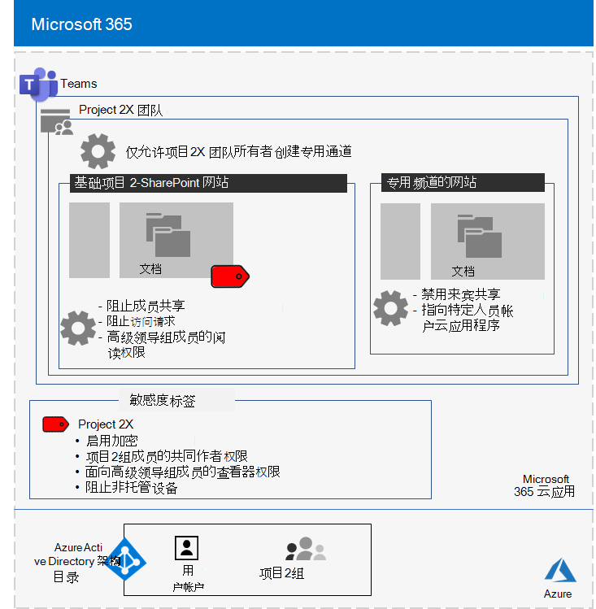
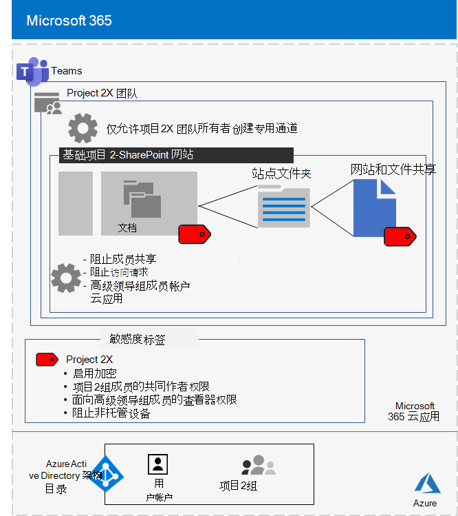

# Contoso Corporation 的主要机密项目的独立团队

在执行异地异地工作时，Contoso 首席执行官订购了一系列新产品和服务，在接下来的五年中，这可能会导致 Contoso 的利润加倍。 开发业务、工程和市场计划的首要项目称为 **Project 2x** ，而整个公司的主要员工均为 recruited。 

用于研究和开发的时间线是紧密的，这意味着协作必须高效，并提供安全会议、持续会话和文件存储。

项目2的结果可交付项是商业计划、产品和工程规范，以及 Word、Excel 和 PowerPoint 文件的格式的营销材料和计划。 

由于其敏感性，对这些文件的访问权限为：

- 限制为项目2个团队成员和高级领导。
- 使用权限进行加密和保护，以仅允许访问 Project 2X 团队成员和高级领导，即使这些文件是在其安全文件夹之外分发的也是如此。

Contoso IT 员工使用项目2的 [安全隔离团队](secure-teams-security-isolation.md) 和这些步骤。

## 步骤1：创建专用团队

首先，为了保护对团队的基础 SharePoint 网站的访问，Contoso IT 管理员配置了 [建议的 SharePoint 访问策略](../enterprise/sharepoint-file-access-policies.md)。

接下来，Contoso IT 管理员创建了一个名为 Project 2 的新私人团队，并将 Project 2X 员工的用户帐户添加为成员。 他们还配置了团队，以便只有项目2组的所有者才能创建专用频道。

有关配置的详细信息，请参阅 [创建专用团队](secure-teams-security-isolation.md#create-a-private-team)。

## 步骤2：为项目2组创建敏感度标签

Contoso admins 创建了一个名为 " **Project 2** " 的新敏感度标签，其类型为：

- 已启用加密。
- 允许项目2个 Microsoft 365 组的共同创作权限。
- 允许高级领导组的查看器权限。
- 阻止了对非托管设备的访问。

受以下条件保护的基础 Project 2X SharePoint 网站的 " **文档** " 部分中的文件：

- 网站权限，仅允许对项目2个 Microsoft 365 组的成员拥有完全权限，并为高级领导组读取权限。
- Project 2-2 敏感度标签，带有文件移动或复制到网站时携带的加密和权限。

有关配置的详细信息，请参阅 [创建灵敏度标签](secure-teams-security-isolation.md#create-a-sensitivity-label)。

## 步骤3：配置基础 SharePoint 网站

首先，为了保护对团队的基础 SharePoint 网站的访问，Contoso IT 管理员配置了 [建议的 SharePoint 访问策略](../enterprise/sharepoint-file-access-policies.md)。

接下来，他们为网站配置了其他权限设置：

- 以防止项目2X 组成员共享对网站的访问权限。 有关配置的详细信息，请参阅 [具有安全隔离的团队的 SharePoint 设置](secure-teams-security-isolation.md#sharepoint-settings)。
- 用于高级领导组的读取权限。

接下来，他们为网站配置了其他权限设置，以防止 Project 2X 组成员共享对网站的访问权限。 

由于已创建项目2X 的专用通道，组所有者禁用了来宾共享，并将默认共享链接设置为 " **特定人员** " 值。

下面是具有安全隔离的 Project 2X 团队的结果配置。

 ## 步骤4：训练有素的项目2组成员

Contoso 安全员工在强制性课程中培训了 Project 2X 团队成员，其中包括：

- 如何：访问新的 Project 2X 团队、使用会议和聊天以及如何在团队文件中进行协作。
- 如何：在团队中创建新文件并上载本地创建的新文件。
- 如何使用 Project 2X 敏感度标签标记文件。
- 演示 Project 2X 标签如何保护文件（即使是在离开团队时）。

最终结果是一个安全的环境，在此环境中，Project 2X 团队成员在安全环境中共同参与聊天、会议和文件。

下面的示例展示了存储在基础项目2X 网站中的文件，并分配了 Project 2/2 敏感度标签。

在几个实例中，Project 2X 工作组成员将受 Project 2X 标签保护的文件下载到本地驱动器以供脱机工作。 

但是，在打开凭据后收到凭据提示时，他们会意识到它们的错误并将其删除。

由于团队的协作环境和 Microsoft 365 的安全功能，project 2X 的详细信息在项目的持续时间内保持秘密。 Contoso 宣布了其计划，正在将新产品和服务推出给其客户和投资者的欣喜及其竞争对手的 chagrin 的过程。

## 后续步骤

在您的组织中[部署具有安全隔离的团队](secure-teams-security-isolation.md)。

