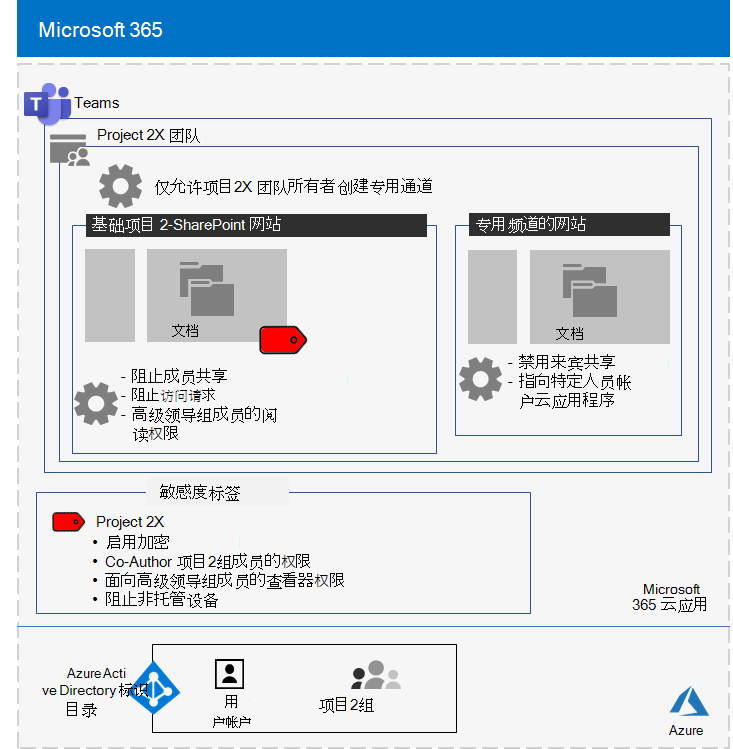

# Contoso Corporation 最高机密项目的隔离团队

在公司外执行人员之后，Contoso 的 CEO 订购了一套新的产品和服务的开发，这些产品和服务在接下来五年内可能会使 Contoso 利润翻倍。 开发业务、工程和市场计划的顶级机密项目名为 **Project 2X**，并招聘了整个公司的关键员工。 

研发的日程表很紧，这意味着协作必须高效，并提供安全会议、正在进行的对话和文件存储。

Project 2X 生成的可交付结果为业务计划、产品和工程规范，以及 Word、Excel 和 PowerPoint 形式的营销材料PowerPoint计划。 

由于这些文件的敏感性质，对这些文件的访问包括：

- 限制为Project 2X 团队成员和高层领导。
- 使用权限进行加密和保护，以仅允许 Project 2X 团队成员和高层领导访问，即使文件分发到其安全文件夹之外。

Contoso IT 员工使用具有安全[隔离](secure-teams-security-isolation.md)功能的团队Project 2X 和这些步骤。

## 步骤 1：创建了私人团队

首先，为了保护对团队SharePoint网站的访问权限，Contoso IT 管理员配置了建议SharePoint[访问策略](../security/office-365-security/sharepoint-file-access-policies.md)。

接下来，Contoso IT 管理员创建了一个名为 Project 2X 的新专用团队，并添加 Project 2X 员工的用户帐户作为成员。 他们还配置了团队，以便只有 Project 2X 团队所有者才能创建私人频道。

有关配置的详细信息，请参阅 [创建私人团队](secure-teams-security-isolation.md#create-a-private-team)。

## 步骤 2：为 2X 团队Project敏感度标签

Contoso 管理员创建了名为 Project **2X** 的新敏感度标签：：

- 启用加密。
- 允许Co-Author 2X Project组Microsoft 365权限。
- Senior Leadership 组允许的查看者权限。
- 阻止访问非托管设备。

基础网站的 **"文档**"部分Project 2X SharePoint受以下保护：

- 网站权限，仅允许 2X Project 2X Microsoft 365组的成员拥有对 Senior Leadership 组的读取权限。
- The Project 2Xsensitivity label， with encryption and permissions that travel with the file if it is moved or copied from the site.

有关配置的详细信息，请参阅 [创建敏感度标签](secure-teams-security-isolation.md#create-a-sensitivity-label)。

## 步骤 3：配置基础SharePoint网站

首先，为了保护对团队SharePoint网站的访问权限，Contoso IT 管理员配置了建议SharePoint[访问策略](../security/office-365-security/sharepoint-file-access-policies.md)。

接下来，他们为网站配置了其他权限设置：

- 阻止Project 2X 组的成员共享对网站的访问权限。 有关配置详细信息，请参阅SharePoint[隔离团队的自定义设置](secure-teams-security-isolation.md#sharepoint-settings)。
- 对于 Senior Leadership 组的读取权限。

接下来，他们为网站配置了其他权限设置Project 2X 组的成员无法共享对网站的访问权限。 

由于已创建 Project 2X 私人频道，因此组所有者禁用了来宾共享，将默认共享链接设置为 **"特定人员"** 值。

下面是使用安全隔离Project 2X 团队的配置结果。

 ## 步骤 4：经过培训Project 2X 团队成员

Contoso 安全人员在Project 2X 团队成员参加一个强制性课程，以通过以下方式进行培训：

- 如何访问新的 Project 2X 团队、使用会议和聊天，以及如何协作处理团队文件。
- 如何在团队中创建新文件并上载在本地创建的新文件。
- 如何使用 2X 敏感度Project标记文件。
- 演示 2X Project如何保护文件，即使文件离开团队。

最终结果是一个安全环境，Project 2X 团队成员在安全环境中协作处理聊天、会议和文件。

下面是一个示例，该文件存储在分配了 2X 敏感度Project 2X Project 2X 网站中。

在一些实例中，Project 2X 团队成员将受 Project 2X 标签保护的文件下载到本地驱动器，以脱机工作。 

但是，在打开凭据时提示输入凭据后，他们意识到自己的错误并将其删除。

由于 Teams 的协作环境和 Microsoft 365 安全功能，Project 2X 的详细信息在项目期间一直保密。 Contoso 宣布其计划，并正在推出新产品和服务，以令其客户和对手的满意以及其竞争对手的念。

## 后续步骤

[在组织中部署具有安全隔离](secure-teams-security-isolation.md) 的团队。

