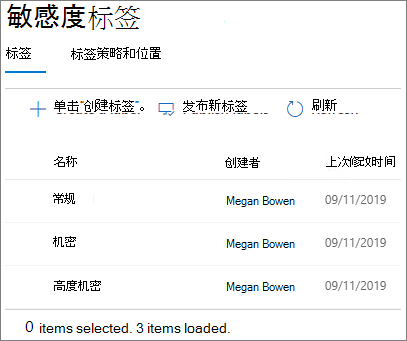

# 创建安全的来宾共享环境

在本文中，我们将介绍多种在 Microsoft 365 中创建安全来宾共享环境的选项。 这是一个示例方案，可让你大致了解可用选项。 你可以在不同的组合中使用这些过程，以满足组织的安全性和合规性需求。 在本文末尾，我们将演练一个测试案例，介绍其中的一些选项如何协同工作。

此方案包括：

- 为来宾设置多重身份验证。
- 设置来宾的使用条款。
- 设置每季度来宾访问评审，以定期验证来宾是否继续需要团队和站点的权限。
- 限制来宾仅对非托管设备进行仅 Web 访问。
- 配置会话超时策略，确保来宾每天进行身份验证。
- 创建和发布敏感度标签以对内容进行分类。
- 为高度敏感的项目创建敏感信息类型。
- 自动为包含敏感信息类型的文档分配“*高度敏感*”标签。
- 自动从标记为“*高度敏感*”的文件中删除来宾访问权限。

本文中所述的某些选项要求来宾在 Azure Active Directory 中具有帐户。 若要确保在与来宾共享文件和文件夹时在目录中包含这些来宾，请使用[与 Azure AD B2B 预览版的 SharePoint 和 OneDrive 集成](https://docs.microsoft.com/sharepoint/sharepoint-azureb2b-integration-preview)。

请注意，我们不在本文中讨论如何启用来宾共享设置。 有关为不同方案启用来宾共享的详细信息，请参阅[与组织外部人员进行协作](collaborate-with-people-outside-your-organization.md)。

## 为来宾设置多重身份验证

多重身份验证可显著降低帐户被盗的机率。 由于来宾用户对个人电子邮件帐户的使用可能不符合任何管理策略或最佳做法，因此要求对来宾进行多重身份验证尤为重要。 如果来宾用户的用户名和密码被盗，则要求进行双重身份验证可显著降低未知方获得对网站和文件的访问权限的机率。

在此示例中，我们将使用 Azure Active Directory 中的条件访问策略为来宾设置多重身份验证。

为来宾设置多重身份验证
1. 在 Microsoft Azure 中，搜索“*条件访问*”。
2. 在“**条件访问 - 策略**”边栏选项卡上，单击“**新建策略**”。
3. 在“**名称**”字段中，键入“*来宾 MFA*”。
4. 在“**分配**”下，单击“**用户和组**”。
5. 在“**用户和组**”边栏选项卡上，选择“**选择用户和组**”，然后选中“**所有来宾和外部用户**”复选框。
6. 在“**分配**”下，单击“**云应用或操作**”。
7. 在“**云应用或操作**”边栏选项卡中，选择“**包含**”选项卡上的“**所有云应用**”。
8. 在“**访问控制**”下，单击“**授予**”。
9. 在“**授予**”边栏选项卡上，选中“**要求多重身份验证**”复选框，然后单击“**选择**”。
10. 在“**新建**”边栏选项卡中的“**启用策略**”下面，单击“**打开**”，然后单击“**创建**”。

现在，来宾需要在多重身份验证中进行注册，然后才能访问共享内容、网站或团队。

### 更多信息

[规划基于云的 Azure 多重身份验证部署](https://docs.microsoft.com/azure/active-directory/authentication/howto-mfa-getstarted)

## 设置来宾的使用条款

通常，来宾用户可能未与贵组织签署保密协议或其他法律协议。 你可以要求来宾在访问与之共享的文件之前同意使用条款。 可在他们首次尝试访问共享文件或网站时显示使用条款。

若要创建使用条款，首先需要在 Word 或其他创作程序中创建文档，然后将其另存为 pdf 文件。 然后，可将该文件上传到 Azure AD。

创建 Azure AD 使用条款
1. 以全局管理员、安全管理员或条件访问管理员的身份登录到 Azure。
2. 导航到“[使用条款](https://aka.ms/catou)”。
3. 单击“**新建条款**”。 
   
4. 在“**名称**”和“**显示名称**”框中，键入“*来宾使用条款*”。
6. 对于“**使用条款文档**”，浏览至你创建的 pdf 文件并选择它。
7. 选择使用条款文档的语言。
8. 将“**要求用户展开使用条款**”设置为“**打开**”。
9. 在“**条件访问**”下的“**强制实施条件访问策略模板**”列表中，选择“**稍后创建条件访问策略**”。
10. 单击“**创建**”。

创建使用条款后，下一步是创建用于显示来宾用户的使用条款的条件访问策略。

创建条件访问策略
1. 在 Microsoft Azure 中，搜索“*条件访问*”。
2. 在“**条件访问 - 策略**”边栏选项卡上，单击“**新建策略**”。
3. 在“**名称**”框中，键入“*来宾用户使用条款策略*”。
4. 在“**分配**”下，单击“**用户和组**”。
5. 在“**用户和组**”边栏选项卡上，选择“**选择用户和组**”，选中“**所有来宾和外部用户**”复选框，然后单击“**完成**”。
6. 在“**分配**”下，单击“**云应用或操作**”。
7. 在“**包括**”选项卡上，选择“**选择应用**”，然后单击“**选择**”。
8. 在“**选择**”边栏选项卡上，选择“**Microsoft Teams**”、“**Office 365 SharePoint Online**”和“**Outlook Groups**”，然后单击“**选择**”。
9. 在“**云应用或操作**”边栏选项卡上，单击“**完成**”。
10. 在“**访问控制**”下，单击“**授予**”。
11. 在“**授予**”边栏选项卡上，选择“**来宾使用条款**”，然后单击“**选择**”。
12. 在“**新建**”边栏选项卡中的“**启用策略**”下面，单击“**打开**”，然后单击“**创建**”。

现在，当来宾用户首次尝试访问组织中的内容、团队或网站时，必须接受使用条款。

### 更多信息
[Azure Active Directory 使用条款](https://docs.microsoft.com/azure/active-directory/conditional-access/terms-of-use)

## 设置来宾访问评审

借助 Azure AD 中的访问评审功能，可以自动定期评审用户对各个团队和组的访问权限。 通过特别要求对来宾进行访问评审，可帮助确保来宾用户在规定时间内拥有对组织敏感信息的访问权限。

访问评审可以组织成计划。 计划是一组类似的访问评审，可用于组织访问评审以进行报告和审核。

在此示例中，我们将创建一个用于来宾访问评审的计划。

创建计划
1. 登录到 Azure 门户并打开 [Identity Governance](https://portal.azure.com/#blade/Microsoft_AAD_ERM/DashboardBlade) 页面。
2. 在左侧菜单中，单击“**计划**”
3. 单击“**新建计划**”。
4. 在“**名称**”框中，键入“*来宾访问评审计划*”。
5. 在“**说明**”框中，键入“*来宾访问评审的计划*”。
6. 单击“**创建**”。

创建计划后，即可创建来宾访问评审并将其与计划关联。

设置来宾用户访问评审
1. 在 [Identity Governance](https://portal.azure.com/#blade/Microsoft_AAD_ERM/DashboardBlade) 页面上的左侧菜单中，单击“**访问评审**”。
2. 单击“**新建访问评审**”。 
   
3. 在“**名称**”框中，键入“*每季度来宾访问评审*”。
4. 对于“**频率**”，选择“**每季度**”。
5. 对于“**结束**”，选择“**从不**”。
6. 对于“**范围**”，选择“**仅限来宾用户**”。
7. 单击“**组**”，选择要包括在访问评审中的组，然后单击“**选择**”。
8. 在“**计划**”下，单击“**链接到计划**”。
9. 在“**选择计划**”边栏选项卡上，选择“**来宾访问评审计划**”
10. 单击“**开始**”。

将为你指定的每个组创建一个单独的访问评审。 每个组的组所有者将在每季度收到一封电子邮件，用于批准或拒绝来宾访问其组。

请务必注意，可以向来宾授予对团队或组的访问权限，也可以授予对各个文件和文件夹的访问权限。 授予对文件和文件夹的访问权限时，可能不会将来宾添加到任何特定组。 如果想要对不属于团队或组的来宾用户执行访问评审，可在 Azure AD 中创建一个动态组，以包含所有来宾并为该组创建访问评审。

### 更多信息
[使用 Azure AD 访问评审管理来宾访问权限](https://docs.microsoft.com/azure/active-directory/governance/manage-guest-access-with-access-reviews)

[在 Azure AD 访问评审中针对组或应用程序创建访问评审](https://docs.microsoft.com/azure/active-directory/governance/create-access-review)

## 为来宾用户设置仅 Web 访问权限

通过要求来宾用户仅使用 Web 浏览器来访问团队、网站和文件，可以减少攻击面并简化管理。 这是通过 Azure AD 条件访问策略完成的。

限制来宾进行仅 Web 访问
1. 在 Microsoft Azure 中，搜索“*条件访问*”。
2. 在“**条件访问 - 策略**”边栏选项卡上，单击“**新建策略**”。
3. 在“**名称**”框中，键入“*来宾用户浏览器访问*”。
4. 在“**分配**”下，单击“**用户和组**”。
5. 在“**用户和组**”边栏选项卡上，选择“**选择用户和组**”，选中“**所有来宾和外部用户**”复选框，然后单击“**完成**”。
6. 在“**分配**”下，单击“**云应用或操作**”。
7. 在“**包括**”选项卡上，选择“**选择应用**”，然后单击“**选择**”。
8. 在“**选择**”边栏选项卡上，选择“**Microsoft Teams**”、“**Office 365 SharePoint Online**”和“**Outlook Groups**”，然后单击“**选择**”。
9. 在“**云应用或操作**”边栏选项卡上，单击“**完成**”。
10. 在“**分配**”下，单击“**条件**”。
11. 在“**条件**”边栏选项卡上，单击“**客户端应用**”。
12. 在“**客户端应用**”边栏选项卡上，为“**配置**”单击“**是**”，然后选择“**移动应用和桌面客户端**”和“**新式身份验证客户端**”设置。 
    
13. 单击“**完成**”，然后在“**条件**”边栏选项卡上，再次单击“**完成**”。
14. 在“**访问控制**”下，单击“**授予**”。
15. 在“**授予**”边栏选项卡上，选择“**需要标记为兼容的设备**”和“**需要加入混合 Azure AD 的设备**”。
16. 在“**对于多个控件**”，选择“**需要某一已选控件**”，然后单击“**选择**”。
17. 在“**新建**”边栏选项卡中的“**启用策略**”下面，单击“**打开**”，然后单击“**创建**”。

## 为来宾用户配置会话超时

如果来宾用户的设备不安全，则定期要求来宾进行身份验证可以降低未知用户访问组织内容的可能性。 可以在 Azure AD 中为来宾用户配置会话超时条件访问策略。

配置来宾会话超时策略
1. 在 Microsoft Azure 中，搜索“*条件访问*”。
2. 在“**条件访问 - 策略**”边栏选项卡上，单击“**新建策略**”。
3. 在“**名称**”框中，键入“*来宾会话超时*”。
4. 在“**分配**”下，单击“**用户和组**”。
5. 在“**用户和组**”边栏选项卡上，选择“**选择用户和组**”，选中“**所有来宾和外部用户**”复选框，然后单击“**完成**”。
6. 在“**分配**”下，单击“**云应用或操作**”。
7. 在“**包括**”选项卡上，选择“**选择应用**”，然后单击“**选择**”。
8. 在“**选择**”边栏选项卡上，选择“**Microsoft Teams**”、“**Office 365 SharePoint Online**”和“**Outlook Groups**”，然后单击“**选择**”。
9. 在“**云应用或操作**”边栏选项卡上，单击“**完成**”。
10. 在“**访问控制**”下，单击“**会话**”。
11. 在“**会话**”边栏选项卡上，选择“**登录频率**”。
12. 为时间段选择 **1** 和“**天**”，然后单击“**选择**”。
13. 在“**新建**”边栏选项卡中的“**启用策略**”下面，单击“**打开**”，然后单击“**创建**”。

## 创建敏感度标签

可通过多种方式使用敏感度标签来分类和保护组织的信息。 在此示例中，我们将介绍如何使用标签来帮助管理来宾对共享文件和文件夹的访问。

首先，我们将在 Microsoft 365 合规中心创建三个敏感度标签：

- 常规
- 敏感
- 高度敏感

请按下列步骤创建“*常规*”和“*敏感*”标签。

创建分类标签（常规和敏感）
1. 在 [Microsoft 365 合规中心](https://compliance.microsoft.com)的左侧导航中，展开“**分类**”，然后单击“**敏感度标签**”。
2. 单击“**创建标签**”。
3. 在“**标签名称**”中，键入“*常规*”或“*敏感*”。
4. 在“**工具提示**”中，键入“*可与员工、来宾和合作伙伴共享的常规信息*”或“*仅与员工和授权来宾共享的敏感信息*”，然后单击“**下一步**”。
5. 让加密保持“**关闭**”，然后单击“**下一步**”。
6. 让内容标记保持“**关闭**”，然后单击“**下一步**”。
7. 让终结点数据丢失防护保持“**关闭**”，然后单击“**下一步**”。
8. 让自动标记保持“**关闭**”，然后单击“**下一步**”。
9. 单击“创建”****。

使用“*高度敏感*”标签，为带有标签的文档自动添加水印。

创建分类标签（高度敏感）
1. 单击“**创建标签**”。
2. 在“**标签名称**”中，键入“*高度敏感*”。
3. 在“**工具提示**”中，键入“*高度敏感信息。不要与来宾共享*”，然后单击“**下一步**”。
4. 让加密保持“**关闭**”，然后单击“**下一步**”。
5. 将内容标记设为“**打开**”，选中“**添加页眉**”复选框，然后单击“**自定义文本**”。
6. 为页眉文本键入“*高度敏感*”，然后单击“**保存**”。
7. 在“**内容标记**”页面上，将内容标记设为“**打开**”。
8. 选中“**添加水印**”复选框，然后单击“**自定义文本**”。
9. 对于“**水印文本**”，请键入“*高度敏感*”。
10. 为“**字号**”键入 *24*，然后单击“**保存**”。
11. 在“**内容标记**”页面上，单击“**下一步**”。
12. 让终结点数据丢失防护保持“**关闭**”，然后单击“**下一步**”。
13. 让自动标记保持“**关闭**”，然后单击“**下一步**”。
14. 单击“**创建**”。

创建标签后，下一步是发布它们。 

发布标签
1. 在“**敏感度标签**”页面上，单击“**发布标签**”。
2. 单击“**选择要发布的标签**”。
3. 单击“**添加**”，选择创建的标签，然后单击“**添加**”。
4. 单击“**完成**”。
5. 单击“**下一步**”。
6. 将用户和组设置保留为“**全部**”，然后单击“**下一步**”。
7. 在“**默认将此标签应用于文档和电子邮件**”列表中，选择“**常规**”，然后单击“**下一步**”。
8. 在“**策略设置**”页面上，为名称键入“*文档敏感度*”，然后单击“**下一步**”。
9. 单击“**发布**”。

发布标签后，Office 桌面应用的用户就可以使用它们。 当用户应用“**高度敏感**”标签时，水印会自动添加到文档中。

### 更多信息
[敏感度标签概述](https://docs.microsoft.com/Office365/SecurityCompliance/sensitivity-labels)

## 为高度敏感的项目创建敏感信息类型

敏感信息类型是预定义的字符串，可以在策略工作流中使用这些字符串来强制执行合规性要求。 Microsoft 365 合规中心提供一百多种敏感信息类型，包括驾驶执照号码、信用卡号、银行帐号等。

你可以创建自定义敏感信息类型，以帮助管理特定于组织的内容。 在此示例中，我们将为高度敏感项目创建自定义敏感信息类型。 然后，可使用此敏感信息类型自动应用分类标签。

创建敏感信息类型
1. 在 [Microsoft 365 合规中心](https://compliance.microsoft.com)的左侧导航中，展开“**分类**”，然后单击“**敏感信息类型**”。
2. 单击“**创建**”。
3. 对于“**名称**”和“**说明**”，键入“**土星项目**”，然后单击“**下一步**”。
4. 单击“**添加元素**”。
5. 在“**检测内容包含**”列表上，选择“**关键字**”，然后在“关键字”框中键入“*土星项目*”。
6. 单击“**下一步**”，再单击“**完成**”。
7. 如果系统询问你是否要测试敏感信息类型，请单击“**否**”。

### 更多信息
[自定义敏感信息类型](https://docs.microsoft.com/Office365/SecurityCompliance/custom-sensitive-info-types)

## 创建根据敏感信息类型分配标签的策略

创建敏感信息类型后，可以在 Microsoft Cloud App Security 中创建文件策略，以将“*高度敏感*”标签自动应用于包含“*土星项目*”字符串的文档。

> [!NOTE]
> 可通过复制过程在 Cloud App Security 中使用敏感度标签。 你可能无法立即看到可用于某一策略的标签。

创建基于敏感信息类型的文件策略
1. 打开 [Microsoft Cloud App Security](https://portal.cloudappsecurity.com)。
2. 在左侧导航中，展开“**控制**”，然后单击“**策略**”。
3. 单击“**创建策略**”，然后选择“**文件策略**”。
4. 对于“**策略名称**”，键入“*土星项目标记*”。
5. 在“**创建一个筛选器，筛选出即将应用此策略的文件**”下，单击 X 两次以删除默认筛选器。
7. 在“**选择筛选器**”列表中选择“**应用**”，然后从“**选择应用...**”列表中选择 **Microsoft SharePoint Online**。
8. 在“**检查方法**”下，选择“**数据分类服务**”。
9. 在“**选择检查类型**”列表上，选择“**敏感信息类型**”。
10. 搜索并选择“*土星项目*”敏感度标签，然后单击“**完成**”。 
   
11. 在“**治理**”下，展开 **Microsoft SharePoint Online**。
12. 选中“**应用分类标签**”复选框，然后选择“**高度敏感**”标签。
13. 单击“创建”****。

实施策略后，当用户在文档中键入“土星项目”时，Cloud App Security 在扫描文件时将自动应用“*高度敏感*”标签。

### 更多信息
[文件策略](https://docs.microsoft.com/cloud-app-security/data-protection-policies)

## 创建用于删除来宾对高度敏感文件的访问权限的策略

在本文的示例中，不应将带有“*高度敏感*”标签的文件与来宾共享。 可以在 Cloud App Security 中创建一个文件策略，该策略会自动从带有该标签的文件中删除来宾访问权限。

请注意，这不会阻止用户共享或重新共享这些文件。 对于存储在允许来宾共享的网站中的文件，仍依靠用户来执行你的治理策略。 但是，这是一个有用的工具，可用于从与来宾共享后添加了敏感信息的文件中删除来宾访问权限。

创建基于标签的文件策略
1. 打开 [Microsoft Cloud App Security](https://portal.cloudappsecurity.com)。
2. 在左侧导航中，展开“**控制**”，然后单击“**策略**”。
3. 单击“**创建策略**”，然后选择“**文件策略**”。
4. 对于“**策略名称**”，键入“*土星项目 - 删除来宾访问权限*”。
5. 在“**创建一个筛选器，筛选出即将应用此策略的文件**”下，单击 X 两次以删除默认筛选器。
6. 在“**选择筛选器**”列表中选择“**应用**”，然后从“**选择应用...**”列表中选择 **Microsoft SharePoint Online**。
7. 单击“**添加筛选器**”。
8. 在“**选择筛选器**”列表中，选择“**分类标签**”，然后从“**选择筛选器...**”列表中选择“**Azure 信息保护**”。
9. 在“**选择分类标签**”列表中，选择“**高度敏感**”。 
   
10. 在“**治理**”下，展开 **Microsoft SharePoint Online**。
11. 选中“**向文件所有者发送策略匹配摘要**”和“**删除外部用户**”复选框。
12. 对于自定义通知消息，请键入“*此文件是高度敏感文件。公司策略禁止与来宾共享该文件*”。
13. 单击“创建”****。

请务必注意，该策略将删除使用*特定人员*链接共享的文件的访问权限。 它不会从未认证（*任何人*）链接中删除访问权限。 如果来宾是整个网站或团队的成员，也不会删除其访问权限。 如果计划将网站或团队中的高度机密文档与来宾成员进行共享，请考虑使用 [Teams 中的专用频道](https://support.office.com/article/60ef929a-4d68-418b-bf4f-5784db184ec9)并仅允许组织成员在专用频道中共享。

## 测试解决方案

若要测试本文中所述的解决方案，请创建一个 Word 文档并将其保存到文档库。 与来宾用户共享文件。 当来宾尝试访问该文档时，应要求他们在多重身份验证中注册，然后接受使用条款。

一旦来宾有权访问文档，请在文档中键入“*土星项目*”并进行保存。 Cloud App Security 扫描文档后，应该应用“*高度敏感*”标签，并且来宾用户将不再有权访问它。

可使用本文中所述的各种组合工具，帮助为组织创建高效而安全的来宾共享环境。

## 其他选项

Microsoft 365 和 Azure Active Directory 中提供部分选项，可帮助保护来宾共享环境的安全。

- 可创建允许或拒绝的共享域的列表，限制用户可以与之共享的人员。 有关详细信息，请参见“[按域限制共享 SharePoint 和 OneDrive 内容”](https://docs.microsoft.com/sharepoint/restricted-domains-sharing)和“[允许或组织邀请指定组织的 B2B 用户](https://docs.microsoft.com/azure/active-directory/b2b/allow-deny-list)”。
- 可限制用户连接至的其他 Azure Active Directory 租户。 参见“[使用租户限制管理对 SaaS 云应用程序的访问权限](https://docs.microsoft.com/azure/active-directory/manage-apps/tenant-restrictions)”了解详细信息。
- 可创建合作伙伴能够帮助管理访客用户的托管环境。 有关信息，请参见“[创建有访客用户的 B2B 外联网](https://docs.microsoft.com/Office365/Enterprise/b2b-extranet)”。

## 另请参阅

[与来宾共享时限制文件意外曝光](share-limit-accidental-exposure.md)

[有关与未经认证用户共享文件和文件夹的最佳做法](best-practices-anonymous-sharing.md)

[创建托管有来宾的 B2B 外联网](b2b-extranet.md)
