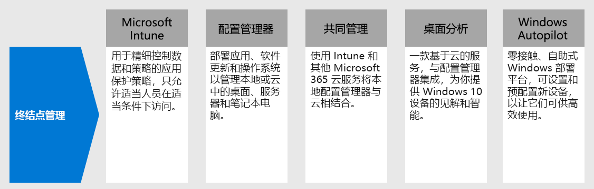

# 步骤 4。为设备、电脑和其他终结点部署终结点管理

使用混合式工作者，需要支持数量不断增多的个人设备。 终结点管理是一种基于策略的安全方法，要求设备在获得对资源的访问权限之前满足特定条件。 Microsoft Endpoint Manager 提供新式管理功能，使你的数据在云中和本地保持安全。 

[Microsoft Endpoint Manager](/mem/endpoint-manager-overview) 将你可能已了解和正在使用的下列服务结合在一起，提供相关服务和工具用来管理移动设备、台式计算机、虚拟机、嵌入式设备和服务器。

## Microsoft Intune

Microsoft Intune 是一种基于云的服务，侧重于 Microsoft 365 所包含的移动设备管理 (MDM) 和移动应用程序管理 (MAM)。 

- **MDM：** 针对组织所拥有的设备，可执行完全控制，包括设置、功能和安全性。 设备将在 Intune 中进行“注册”，并在这里接收带有规则和设置的 Intune 策略。 例如，可以设置密码和 PIN 要求、创建 VPN 连接以及设置威胁防护等。

- **MAM：** 远程工作者可能不希望你对他们的个人设备（也称为自带 (BYOD) 设备）拥有完全控制权。 可给混合工作者提供选项，同时仍要保护组织。 例如，混合工作者如果希望完全访问你的组织资源，可以注册其设备。 或者，如果这些用户仅希望访问电子邮件或 Microsoft Teams，则可使用需要多重身份验证 (MFA) 的应用保护策略来使用这些应用。

有关详细信息，请参阅此 [Microsoft Intune 概述](/intune/fundamentals/what-is-intune)。

## Configuration Manager

Configuration Manager 是一种本地管理解决方案，可用于管理网络上或基于 Internet 的台式机、服务器和笔记本电脑。 使用 Configuration Manager 部署应用程序、软件更新和操作系统。 还可以实时监视客户端上的合规性、查询和操作等。 可通过云使其与 Intune、Azure AD、Microsoft Defender 高级威胁防护和其他云服务集成。 

有关详细信息，请参阅此 [Configuration Manager 概述](/mem/configmgr/core/understand/introduction)。

## 协同管理

协同管理使用 Intune 和其他 Microsoft 365 云服务，将现有的 Configuration Manager 投资与云相结合。 由你选择将 Configuration Manager 还是 Intune 作为不同工作负载的管理机构。 

合作管理将使用基于 Intune 的云功能，包括条件访问和强制实施设备合规性。 你可以将某些任务保留在本地，同时在云中运行其他任务。

有关详细信息，请参阅此[协同管理概述](/mem/configmgr/comanage/overview)。

## 桌面分析

桌面分析是一种基于云的服务，可与 Configuration Manager 集成并为你提供洞察和情报，以便就 Windows 客户端作出明智决策。 它将组织中的数据与连接到 Microsoft 云服务的其他数百万台设备的数据合并。 

借助桌面分析，你可以：

- 创建组织中运行的应用的清单。
- 评估应用程序与最新 Windows 10 功能更新的兼容性。
- 确定兼容性问题，并根据云支持的数据见解获取缓解建议。
- 创建可在最小的一组设备内代表全部应用程序和驱动程序的试点组。
- 将 Windows 10 部署到试点设备和生产管理设备。

有关详细信息，请参阅此[桌面分析概述](/mem/configmgr/desktop-analytics/overview)。

## Windows Autopilot

Windows Autopilot 是一个零接触、自助式的 Windows 部署平台。 它包含一组技术，你可使用这些技术来设置和预配置新设备，使它们可实现高效使用。 还可以使用 Windows Autopilot 来重置、恢复设备并重新调整其用途。 

借助 Windows Autopilot，IT 部门可以预配置设备，而几乎不需要管理任何基础结构，而且过程轻松简单。 

- 从用户的角度来看，只需几个简单操作便可以使其设备准备就绪，以供使用。 
- 从 IT 专业人员的角度来看，最终用户所需的交互将只有连接到网络并验证其凭据。

有关详细信息，请参阅此 [Windows Autopilot 概述](/windows/deployment/windows-autopilot/windows-autopilot)。

## 用于终结点管理的管理员技术资源

- [Microsoft 365 设备管理指南](../enterprise/device-management-roadmap-microsoft-365.md)
- [如何注册用于移动设备管理的不同类型的设备](/mem/intune/enrollment/device-enrollment)
- [如何向最终用户讲解 Microsoft Intune](/mem/intune/fundamentals/end-user-educate)
 
## 步骤 4 的结果

你正在使用 Endpoint Manager 功能套件来管理移动设备、台式计算机、虚拟机、嵌入式设备和服务器。

## 后续步骤

继续执行 [步骤 5](empower-people-to-work-remotely-teams-productivity-apps.md) ，让混合工作者使用 Microsoft Teams 等 Microsoft 365 生产力应用。