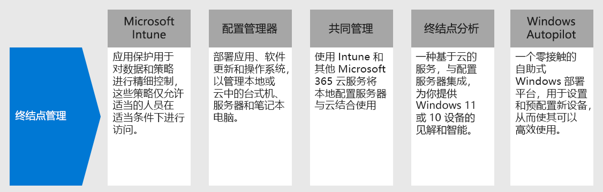

# 步骤 4.Step 4. 部署设备、电脑和其他终结点的终结点管理Deploy endpoint management for your devices, PCs, and other endpoints

使用远程工作者，需要支持越来越多的个人设备。With remote workers, you need to support a growing number of personal devices. 终结点管理是一种基于策略的安全方法，要求设备在获得对资源的访问权限之前满足特定条件。Endpoint management is a policy-based approach to security that requires devices to comply with specific criteria before they are granted access to resources. Microsoft Endpoint Manager 提供新式管理功能，使你的数据在云中和本地保持安全。Microsoft Endpoint Manager delivers modern management capabilities to keep your data secure in the cloud and on-premises. 

Endpoint Manager 通过结合以下可能已知和正在使用的服务，提供用于管理移动设备、台式计算机、虚拟机、嵌入式设备和服务器的服务和工具。Endpoint Manager provides services and tools for managing mobile devices, desktop computers, virtual machines, embedded devices, and servers by combining the following services you may already know and be using.

## Microsoft IntuneMicrosoft Intune

Microsoft Intune 是一种基于云的服务，侧重于 Microsoft 365 所包含的移动设备管理 (MDM) 和移动应用程序管理 (MAM)。Microsoft Intune is a cloud-based service that focuses on mobile device management (MDM) and mobile application management (MAM) that is included with Microsoft 365. 

- **MDM：** 针对组织所拥有的设备，可执行完全控制，包括设置、功能和安全性。**MDM:** For organization-owned devices, you can exercise full control including settings, features, and security. 设备将在 Intune 中进行“注册”，并在这里接收带有规则和设置的 Intune 策略。Devices are "enrolled" in Intune where they receive Intune policies with rules and settings. 例如，可以设置密码和 PIN 要求、创建 VPN 连接以及设置威胁防护等。For example, you can set password and PIN requirements, create a VPN connection, set up threat protection, and more.

- **MAM：** 远程工作者可能不希望你对他们的个人设备（也称为自带 (BYOD) 设备）拥有完全控制权。**MAM:** Remote workers might not want you to have full control on their personal devices, also known as bring-your-own device (BYOD) devices. 你可以为你的远程工作者提供各种选项，但仍保护你的组织。You can give your remote workers options and still protect your organization. 例如，如果远程工作者希望拥有对组织资源的完整访问权限，则可以注册其设备。For example, remote workers can enroll their devices if they want full access to your organization resources. 或者，如果这些用户仅希望访问电子邮件或 Microsoft Teams，则可使用需要多重身份验证 (MFA) 的应用保护策略来使用这些应用。Or, if these users only want access to email or Microsoft Teams, then use app protection policies that require multi-factor authentication (MFA) to use these apps.

有关详细信息，请参阅此 [Microsoft Intune 概述](https://docs.microsoft.com/intune/fundamentals/what-is-intune)。For more information, see this [overview of Microsoft Intune](https://docs.microsoft.com/intune/fundamentals/what-is-intune).

## Configuration ManagerConfiguration Manager

Configuration Manager 是一种本地管理解决方案，可用于管理网络上或基于 Internet 的台式机、服务器和笔记本电脑。Configuration Manager is an on-premises management solution to manage desktops, servers, and laptops that are on your network or internet-based. 使用 Configuration Manager 部署应用程序、软件更新和操作系统。Use Configuration Manager to deploy apps, software updates, and operating systems. 还可以实时监视客户端上的合规性、查询和操作等。You can also monitor compliance, query and act on clients in real time, and much more. 可通过云使其与 Intune、Azure AD、Microsoft Defender ATP 和其他云服务集成。You can cloud-enable it to integrate with Intune, Azure AD, Microsoft Defender ATP, and other cloud services. 

有关详细信息，请参阅此 [Configuration Manager 概述](https://docs.microsoft.com/mem/configmgr/core/understand/introduction)。For more information, see this [overview of Configuration Manager](https://docs.microsoft.com/mem/configmgr/core/understand/introduction).

## 协同管理Co-management

协同管理使用 Intune 和其他 Microsoft 365 云服务，将现有的 Configuration Manager 投资与云相结合。Co-management combines your existing on-premises Configuration Manager investment with the cloud using Intune and other Microsoft 365 cloud services. 由你选择将 Configuration Manager 还是 Intune 作为不同工作负载的管理机构。You choose whether Configuration Manager or Intune is the management authority for different workload. 

合作管理将使用基于 Intune 的云功能，包括条件访问和强制实施设备合规性。Co-management uses Intune-based cloud features, including Conditional Access and enforcing device compliance. 你可以将某些任务保留在本地，同时在云中运行其他任务。You keep some tasks on-premises, while running other tasks in the cloud.

有关详细信息，请参阅此[协同管理概述](https://docs.microsoft.com/mem/configmgr/comanage/overview)。For more information, see this [overview of co-management](https://docs.microsoft.com/mem/configmgr/comanage/overview).

## 桌面分析Desktop Analytics

桌面分析是一种基于云的服务，可与 Configuration Manager 集成并为你提供洞察和情报，以便就 Windows 客户端作出明智决策。Desktop Analytics is a cloud-based service that integrates with Configuration Manager and provides you with insight and intelligence so you can make informed decisions about your Windows clients. 它将组织中的数据与连接到 Microsoft 云服务的数百万台设备的数据合并。It combines data from your organization with data aggregated from millions of devices connected to Microsoft cloud services. 

借助桌面分析，你可以：With Desktop Analytics, you can:

- 创建组织中运行的应用的清单。Create an inventory of apps running in your organization.
- 评估应用程序与最新 Windows 10 功能更新的兼容性。Assess app compatibility with the latest Windows 10 feature updates.
- 确定兼容性问题，并根据启用了云的数据见解获取缓解建议。Identify compatibility issues, and receive mitigation suggestions based on cloud-enabled data insights.
- 创建可在最小的一组设备内代表全部应用程序和驱动程序的试点组。Create pilot groups that represent the entire application and driver estate across a minimal set of devices.
- 将 Windows 10 部署到试点设备和生产管理设备。Deploy Windows 10 to pilot and production-managed devices.

有关详细信息，请参阅此[桌面分析概述](https://docs.microsoft.com/mem/configmgr/desktop-analytics/overview)。For more information, see this [overview of Desktop Analytics](https://docs.microsoft.com/mem/configmgr/desktop-analytics/overview)

## Windows AutopilotWindows Autopilot

Windows Autopilot 是一个零接触、自助式的 Windows 部署平台。Windows Autopilot is a zero-touch, self-service Windows deployment platform. 它包括一组用于设置和预配置新设备，以使它们可供高效使用的技术。It includes a collection of technologies used to set up and pre-configure new devices, getting them ready for productive use. 还可以使用 Windows Autopilot 来重置、恢复设备并重新调整其用途。You can also use Windows Autopilot to reset, repurpose and recover devices. 

借助 Windows Autopilot，IT 部门可以预配置设备，而几乎不需要管理任何基础结构，而且过程轻松简单。Windows Autopilot enables an IT department to pre-configure devices with little to no infrastructure to manage, with a process that's easy and simple. 

- 从用户的角度来看，只需几个简单操作便可以使其设备准备就绪，以供使用。From the user's perspective, it only takes a few simple operations to make their device ready to use. 
- 从 IT 专业人员的角度来看，最终用户所需的交互将只有连接到网络并验证其凭据。From the IT pro's perspective, the only interaction required from the end user is to connect to a network and to verify their credentials.

有关详细信息，请参阅此 [Windows Autopilot 概述](https://docs.microsoft.com/windows/deployment/windows-autopilot/windows-autopilot)。For more information, see this [overview of Windows Autopilot](https://docs.microsoft.com/windows/deployment/windows-autopilot/windows-autopilot).

## 用于终结点管理的管理员技术资源Admin technical resources for endpoint management

- [有关管理面向远程工作者的 Windows 10 设备的第 3 部分视频The Part 3 video on managing Windows 10 devices for remote workers](https://resources.techcommunity.microsoft.com/enabling-remote-work/#security)
- [有关管理面向远程工作者的用户桌面和浏览器的第 5 部分视频The Part 5 video on managing user desktops and browsers for remote workers](https://resources.techcommunity.microsoft.com/enabling-remote-work/#security)
- [部署适用于 Microsoft 365 的移动基础结构Deploy a mobility infrastructure for Microsoft 365](https://docs.microsoft.com/microsoft-365/enterprise/mobility-infrastructure)
- [如何注册用于移动设备管理的不同类型的设备How to enroll different types of devices for mobile device management](https://docs.microsoft.com/mem/intune/enrollment/device-enrollment)
- [如何向最终用户讲解 Microsoft IntuneHow to educate your end users about Microsoft Intune](https://docs.microsoft.com/mem/intune/fundamentals/end-user-educate)
 
## 步骤 3 的结果Results of Step 3

你正在使用 Endpoint Manager 功能套件来管理移动设备、台式计算机、虚拟机、嵌入式设备和服务器。You are using the suite of Endpoint Manager features and capabilities to manage mobile devices, desktop computers, virtual machines, embedded devices, and servers.

## 后续步骤Next step

继续[步骤 5](empower-people-to-work-remotely-teams-productivity-apps.md)，让远程工作者能够使用 Microsoft 365 生产力应用（如 Microsoft Teams）。Continue with [Step 5](empower-people-to-work-remotely-teams-productivity-apps.md) to get your remote workers using Microsoft 365 productivity apps such as Microsoft Teams.
