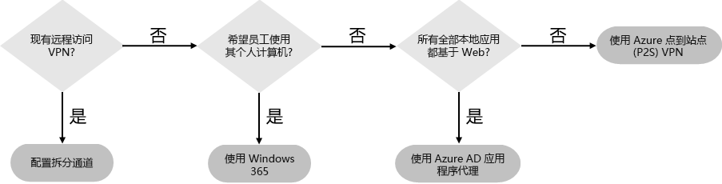
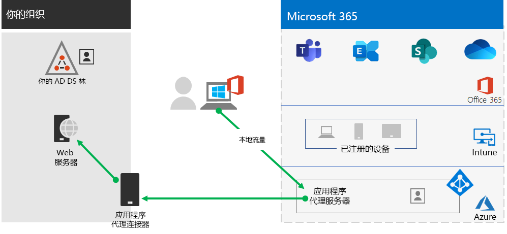
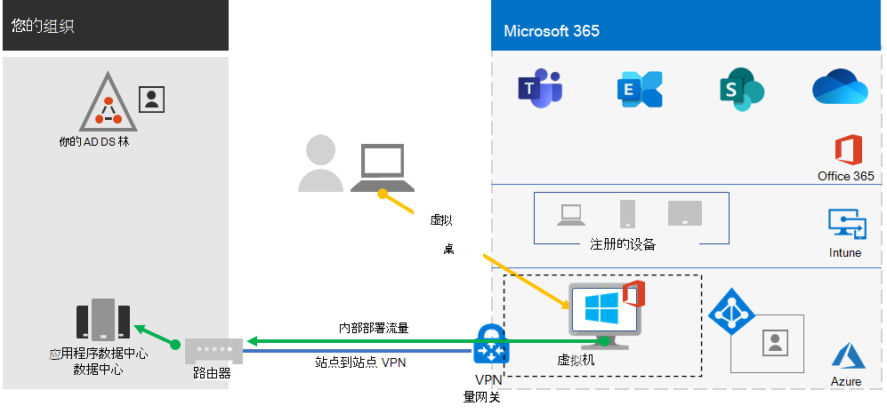
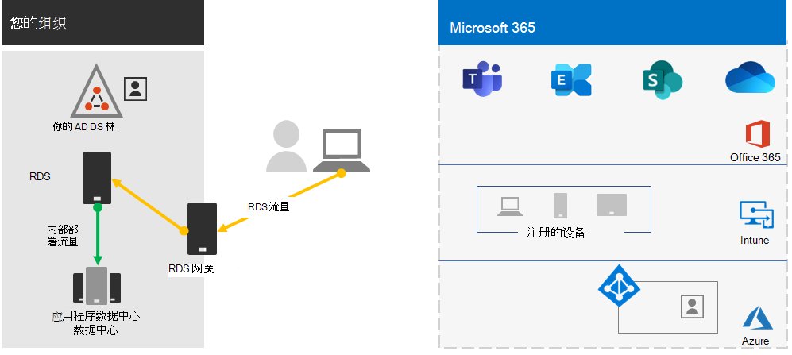

# 步骤 2：提供对本地应用和服务的远程访问权限

如果你的组织使用远程访问 VPN 解决方案权限（通常通过网络边缘上的 VPN 服务器以及在用户的设备上安装的 VPN 客户端），你的用户可以使用远程访问 VPN 连接来访问本地应用和服务器。但是，你可能需要优化与 Microsoft 365 基于云的服务的通信。

如果你的用户未使用 VPN 解决方案，你可以使用 Azure Active Directory (Azure AD) 应用程序代理和 Azure 点到站点 (P2S) VPN 来提供访问权限，具体取决于你的所有应用是否均基于 Web。

下面是用于远程访问的主要配置：

- 你已在使用远程访问 VPN 解决方案。
- 你没有使用远程访问 VPN 解决方案，而是希望远程工作者使用其自己的个人计算机。
- 你使用的不是远程访问 VPN 解决方案，你有混合标识，只需远程访问基于 Web 的本地应用。
- 你使用的不是远程访问 VPN 解决方案，并且你需要访问本地应用，其中一些应用并非基于 Web。

请参阅此流程图，了解本文中讨论的远程访问配置选项。

借助远程访问连接，还可以使用[远程桌面](https://support.microsoft.com/help/4028379/windows-10-how-to-use-remote-desktop)将用户连接到本地电脑。 例如，远程工作者可使用远程桌面从其 Windows、iOS 或 Android 设备连接到其办公室的电脑。 远程连接后，他们可以像坐在电脑前一样使用它。

## 优化 Microsoft 365 云服务远程访问 VPN 客户端的性能

如果远程工作者正在使用传统的 VPN 客户端来获取对组织网络的远程访问权限，请验证该 VPN 客户端是否支持拆分隧道。

如果没有拆分隧道，所有远程工作通信都将通过 VPN 连接发送。在这种情况下，必须将其转发到组织的边缘设备、进行处理，然后在 Internet 上发送。

Microsoft 365 通信必须通过你的组织获取间接路由，该路由可以转发到远离 VPN 客户端物理位置的 Microsoft 网络入口点。此间接路径会增加网络流量的延迟，并降低整体性能。

借助拆分隧道，你可以将 VPN 客户端配置为排除通过 VPN 连接发送到组织网络的特定类型的通信。

要优化 Microsoft 365 云资源的访问权限，请将拆分隧道 VPN 客户端配置为排除通过 VPN 连接的流向 **优化** 类别 Microsoft 365 终结点的流量。 有关详细信息，请参阅 [Office 365 终结点类别](../enterprise/microsoft-365-network-connectivity-principles.md#new-office-365-endpoint-categories)。 请查看[此列表](../enterprise/urls-and-ip-address-ranges.md)，了解如何优化类别终结点。

下面是生成的流量流，其中流入 Microsoft 365 云应用的大多数流量都绕过 VPN 连接。

这允许 VPN 客户端直接通过 Internet 发送和接收重要的 Microsoft 365 云服务流量并发送到 Microsoft 网络最近的入口点。

有关更多信息和指导，请参阅[使用 VPN 拆分隧道为远程用户优化 Office 365 连接](../enterprise/microsoft-365-vpn-split-tunnel.md)。

## 在所有应用均为 Web 应用且你具有混合标识的情况下部署远程访问

如果远程工作者没有使用传统的 VPN 客户端，而且你的本地用户帐户和组与 Azure AD 同步，则可以使用 Azure AD 应用程序代理为本地服务器上托管的基于 Web 的应用程序提供安全的远程访问。基于 Web 的应用程序包括 SharePoint Server 网站、Outlook Web 访问服务器或任何其他基于 Web 的业务线应用程序。

下面是 Azure AD 应用程序代理的组件。

有关详细信息，请参阅此 [Azure AD 应用程序代理概述](/azure/active-directory/manage-apps/application-proxy)。

> [!NOTE]
> Microsoft 365 订阅中不包含 Azure AD 应用程序代理。 你必须使用单独的 Azure 订阅来进行付费。

## 在并非所有应用均为 Web 应用的情况下部署远程访问

如果远程工作者没有使用传统的 VPN 客户端，而且你有应用未基于 Web，那么你可使用 Azure 点到站点 (P2S) VPN。

P2S VPN 连接通过 Azure 虚拟网络创建从远程工作者的设备到组织网络的安全连接。

有关详细信息，请参阅此 [P2S VPN 概述](/azure/vpn-gateway/point-to-site-about)。

> [!NOTE]
> Microsoft 365 订阅中不包含 Azure P2S VPN。 你必须使用单独的 Azure 订阅来进行付费。

## 部署 Windows 虚拟桌面，以便为使用个人设备的远程工作者提供远程访问权限

要为仅可使用自己的个人和非托管设备的远程工作者提供支持，请使用 Azure 中的 Windows 虚拟桌面创建并分配虚拟桌面，以便用户在家中使用。虚拟电脑可以像连接到组织网络的电脑一样操作。

有关详细信息，请参阅此 [Windows 虚拟桌面概述](/azure/virtual-desktop/overview)。

> [!NOTE]
>Microsoft 365 订阅中不包含 Windows 虚拟桌面。 你必须使用单独的 Azure 订阅来进行付费。

## 使用远程桌面服务网关保护你的远程桌面服务连接

如果使用远程桌面服务 (RDS) 来允许员工连接到本地网络上基于 Windows 的计算机，则应在边缘网络中使用 Microsoft 远程桌面服务网关。 网关使用传输层安全性 （TLS） 加密通信流，并阻止托管 RDS 本地计算机直接向 Internet 公开。

请参阅[这篇文章](https://www.microsoft.com/security/blog/2020/04/16/security-guidance-remote-desktop-adoption/)，了解详细信息。

## 用于远程访问的管理员技术资源

- [如何快速优化远程办公人员的 Office 365 流量并降低你的基础结构上的负载](https://techcommunity.microsoft.com/t5/office-365-blog/how-to-quickly-optimize-office-365-traffic-for-remote-staff-amp/ba-p/1214571)
- [使用 VPN 拆分隧道为远程用户优化 Office 365 连接](../enterprise/microsoft-365-vpn-split-tunnel.md)

## 步骤 2 的结果

为远程工作者部署远程访问解决方案后：

| 远程访问配置 | 结果 |
|:-------|:-----|
| 远程访问 VPN 解决方案已到位 | 已经针对拆分隧道和 Microsoft 365 终结点的“优化”类别配置远程访问 VPN 客户端。 |
| 没有远程访问 VPN 解决方案，并且只需远程访问基于 Web 的本地应用 | 已配置 Azure 应用程序代理。 |
| 没有远程访问 VPN 解决方案，并且需要访问本地应用，其中一些应用并非基于 Web | 已配置 Azure P2S VPN。 |
| 远程工作人员正在家中使用自己的个人设备 | 已配置 Windows 虚拟桌面。 |
| 远程工作者将使用到本地系统的 RDS 连接 | 已在边缘网络中部署远程桌面服务网关。 |
|||

## 后续步骤

继续[步骤 3](empower-people-to-work-remotely-security-compliance.md)，部署 Microsoft 365 安全和合规性服务，以保护你的应用、数据和设备。