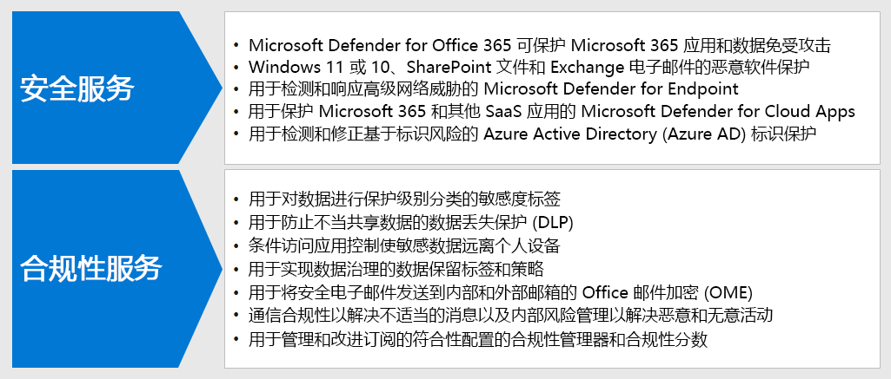

# 步骤 3：为混合工作者部署安全性和合规性

对于混合式工作者，他们中一些从未离开办公室或不常去，安全性和合规性是整个解决方案的重要组成部分。 他们的所有通信都通过 Internet 进行，而不是局限于组织 Intranet。

你和你的员工可以做一些事情来保持工作效率，同时降低网络安全风险并保持遵守内部策略和数据法规。

远程工作需要以下安全性和合规性元素：

- 控制对混合工作者使用的生产力应用（如 Microsoft Teams）的访问
- 对远程工作者创建和使用的数据的受控访问和保护，例如聊天对话或共享文件
- 保护 Windows 10 设备免受恶意软件和其他类型的网络攻击
- 使用一致的敏感度和保护级别标签保护电子邮件、文件和站点
- 防止信息泄漏
- 遵守区域数据法规

下面是为混合工作者提供安全和合规性服务的 Microsoft 365 功能。

## 安全性

使用 Microsoft 365 的这些安全功能来保护应用程序和数据。

|功能或特性|为什么需要它|许可|
|---|---|---|
|Microsoft Defender for Office 365|保护你的 Microsoft 365 应用和数据（例如电子邮件、Office 文档和协作工具）免受攻击。 
 Microsoft Defender for Office 365 会收集并分析应用中信号，用于检测、调查和修正安全风险，并保护组织免受电子邮件、链接 （URL） 和协作工具造成恶意威胁。它还提供针对标准和严格安全性等同的租户配置评估和配置工具。|Microsoft 365 E3 或 E5|
|恶意软件防护|‎Microsoft Defender 防病毒和 Device Guard 提供基于设备的恶意软件防护。 
 SharePoint‎ Online 会自动扫描上传文件中已知的恶意软件。 
 Exchange Online Protection‎ (‎EOP‎) 可保护云邮箱。|Microsoft 365 E3 或 E5|
|Microsoft Defender for Endpoint|保护你的组织的设备免受网络威胁和数据泄露，并检测、调查和响应高级威胁。|Microsoft 365 E5|
|Defender for Cloud Apps|保防您的基于云的服务（Microsoft 365 和其他 SaaS 应用）受到攻击。|Microsoft 365 E5 或单个 Defender for Cloud Apps 许可证|
|Azure AD 标识保护|自动检测和修复基于标识的风险。 
创建基于风险的条件访问策略，以对有风险的登录要求多重身份验证 (MFA)。|Microsoft 365 E5 或 E3（含 Azure AD Premium P2 许可）|
||||

第一步是了解和使用 [Microsoft Secure Score](/microsoft-365/security/defender/microsoft-secure-score)。

有关详细信息，请参阅[安全团队为支持在家办公需完成的 12 大任务](../security/top-security-tasks-for-remote-work.md)。

有关 Microsoft 365 安全性的信息，请参阅 [Microsoft 365 安全文档](/microsoft-365/security)。

## 合规性

使用 Microsoft 365 的这些合规性功能来遵守内部政策或法规要求。

|功能或特性|为什么需要它|许可|
|---|---|---|
|敏感度标签|通过在电子邮件、文件或站点上放置具有不同保护级别的标签，可以在不影响用户工作效率和协作能力的情况下对组织的数据进行分类和保护。|Microsoft 365 E3 或 E5|
|数据丢失防护 (DLP)|在内部和外部检测、警告和阻止有风险的、无意或不适当的共享，例如包含个人信息的数据共享。|Microsoft 365 E3 或 E5|
|条件访问应用控制|防止敏感数据下载到用户的个人设备。|Microsoft 365 E3 或 E5|
|数据保留标签和策略|实施信息治理控制，例如将数据保留多长时间以及对客户个人数据存储的要求，以符合组织的政策或数据法规。|Microsoft 365 E3 或 E5|
|Office 邮件加密 (OME)|在组织内部和外部的人员之间发送和接收加密的电子邮件，其中包含受监管的数据，例如客户的个人数据。|Microsoft 365 E3 或 E5|
|合规性管理器|使用 Microsoft 服务信任门户中基于工作流的风险评估工具来管理与 Microsoft 云服务相关的法规合规性活动。|Microsoft 365 E3 或 E5|
|合规性管理器|在 Microsoft 365 合规中心中查看当前合规配置和改进建议的总体分数。|Microsoft 365 E3 或 E5|
|通信合规性|对组织中的不当邮件进行检测、捕获和执行修正操作。|具有合规性或内部风险管理加载项的 Microsoft 365 E5 或 Microsoft 365 E3|
|内部风险管理|对组织中的恶意和意外风险进行检测、调查并采取相关措施。 即使员工使用的是非托管设备，Microsoft 365 也可检测到这些类型的风险。|具有合规性或内部风险管理加载项的 Microsoft 365 E5 或 Microsoft 365 E3|
||||

有关详细信息，请参阅 [Microsoft 365 合规中心入门快速任务](../compliance/compliance-quick-tasks.md)。

## 步骤 3 的结果

对于混合工作者，已实现：

- 安全性
  - 控制对混合工作者用于通信和协作的应用和数据的访问
  - 针对云服务数据、电子邮件和 Windows 10 设备的恶意软件保护
- 合规性
  - 一致的敏感度和保护级别标签
  - 防止信息泄露的策略
  - 遵守区域数据法规

## 后续步骤

继续执行[步骤 4](empower-people-to-work-remotely-manage-endpoints.md)，以管理你的设备、电脑和其他终结点。
