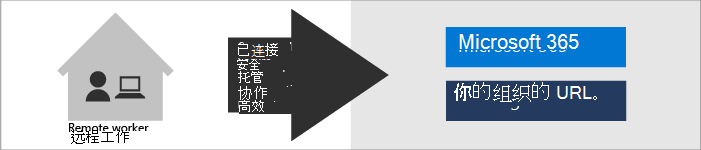
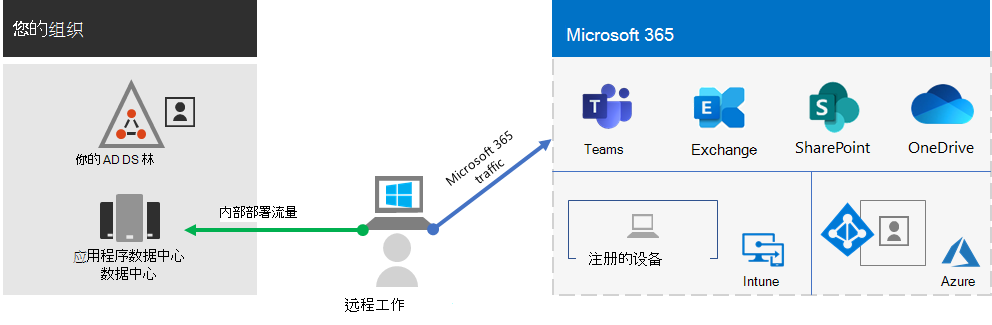

# 设置使用 Microsoft 365 实现混合工作的基础结构

要保护并优化工作人员的生产力和协作，你需要允许现场和远程工作者轻松、安全地访问组织内本地和基于云的信息、工具以及资源。 此解决方案会逐步完成基础设施关键层的部署，让工作者无论在哪里都能够高效工作。

混合工作者可在以多个位置中进行现场或远程工作。 对于许多组织而言，允许工作者在传统办公室外工作非常重要，这有助于:

- 聘用和保留不愿意移动位置或需要灵活工作环境的工作者。
- 减少工作者通勤，让他们有更多时间实现高效工作并在工作外参与减压活动。
- 节省办公空间。

Microsoft 365 具有助力混合工作者现场或远程工作的功能。

> [!NOTE]
> 如果你第一次使用 Microsoft 365，请参阅 [的](https://www.microsoft.com/microsoft-365)。

观看此视频以简要了解部署流程。
 
 
> [!VIDEO https://www.microsoft.com/videoplayer/embed/RE4F1af]

对于管理现场和基于云的基础结构以提高混合工作者的生产力的 IT 专业人员，此解决方案提供了以下关键功能:

- 已连接

  工作者能够随时随地访问:

  - Microsoft 365 订阅中基于云的服务和数据。

  - 组织资源，例如由本地应用程序数据中心提供的资源。

- 安全

  使用 Microsoft 365 和 Windows 11 或 10 的多重身份验证 (MFA) 和内置安全功能来保护登录，防止恶意软件、恶意攻击和数据丢失。

- 托管

  可以使用安全设置和允许的应用从云中管理混合工作者的设备，并要求其符合系统运行状况。

- 协作高效

  混合工作者可以以高度协作的方式和本地一样高效工作，方式如下:

  - 通过 Teams 进行的联机会议和聊天会话。

  - 基于云的文件存储的共享工作区，可通过 SharePoint 和 OneDrive 实现全球可访问性和实时协作。

  - 用于划分工作并完成任务的共享任务和工作流。

为获得无缝登录体验，应将本地 Active Directory 域服务 (AD DS) 用户帐户与 Azure Active Directory (Azure AD) 同步。 要保护 Windows 11 或 10 设备，应在 Intune 中注册这些设备。 下面是基础结构的高级视图。

要为混合工作者启用 Microsoft 365 的功能，请使用以下 Microsoft 365 功能。

|功能或特性|说明|许可|
|---|---|---|
|通过安全性默认设置强制执行 MFA|通过请求第二种形式的登录身份验证，抵御遭到入侵的身份和设备的威胁。安全性默认设置要求对所有用户帐户进行 MFA。|Microsoft 365 E3 或 E5|
|通过条件访问强制执行 MFA|要求基于使用条件访问策略的登录的属性进行 MFA。|Microsoft 365 E3 或 E5|
|通过基于风险的条件访问强制执行 MFA|基于使用 Azure AD 标识保护的用户登录风险要求使用 MFA。|Microsoft 365 E5 或 E3（含 Azure AD Premium P2 许可）|
|自助服务密码重置 (SSPR)|允许用户重置或解锁其密码或帐户。|Microsoft 365 E3 或 E5|
|Azure AD 应用程序代理|为 Intranet 服务器上托管的基于 Web 的应用程序提供安全的远程访问权限。|需要单独的付费 Azure 订阅|
|配置点到站点 VPN|通过 Azure 虚拟网络创建从远程工作者的设备到 intranet 的安全连接。|需要单独的付费 Azure 订阅|
|Windows 365|支持只能通过 Windows 365 云电脑使用其个人和非托管设备的远程工作者。|需要单独的付费 Azure 订阅|
|远程桌面 |允许员工通过 Intranet 连接到基于 Windows 的计算机。|Microsoft 365 E3 或 E5|
|远程桌面服务网关|加密通信，防止 RDS 主机直接向 Internet 公开。|需要单独的 Windows Server 许可证|
|Microsoft Intune|管理设备和应用程序。|Microsoft 365 E3 或 E5|
|内容和功能，|管理设备上的软件安装、更新和设置|需要单独的 Configuration Manager 许可证|
|终结点分析|确定你的 Windows 客户端的更新准备情况。|需要单独的 Configuration Manager 许可证|
|Windows Autopilot|设置和预配置新的 Windows 11 或 10 设备，以便高效使用。|Microsoft 365 E3 或 E5|
|Microsoft Teams、Exchange Online、SharePoint Online 和 OneDrive、Microsoft 365 应用版、Microsoft Power Platform、Yammer|创建、沟通和协作。|Microsoft 365 E3 或 E5|
||||

有关安全和合规性条件，请参阅[针对远程工作者的部署安全性与合规性](empower-people-to-work-remotely-security-compliance.md)。

 有关此解决方案的两页摘要，请参阅 [“助力混合工作者”海报](https://download.microsoft.com/download/9/b/b/9bb5fa79-74e9-497b-87c5-4021e53d9fc2/hybrid-worker-infrastructure.pdf)。

## 为所有工作者提供混合工作

使用以下设备，你可以使所有工作者随时随地保持生产力：

- 新式设备（例如 Surface laptop 和 Windows 11 或 10），具备通过网页直接访问 Microsoft 365 云应用和服务的功能、安全性和性能。

- 包括旧式家用笔记本电脑或台式机在内的任何设备，这些设备可通过 [Windows 365 云电脑](empower-people-to-work-remotely-remote-access.md#deploy-windows-365-to-provide-remote-access-for-remote-workers-using-personal-devices) 间接访问 Microsoft 365 云应用和服务。 该选项能提高性能、增强安全性并简化 IT 管理。

## 后续步骤

按照以下步骤保护并优化对组织的服务器和云服务的访问权限，并最大化混合工作者的生产力。

1. [借助 MFA 提升登录安全性](empower-people-to-work-remotely-secure-sign-in.md)
2. [提供对本地应用和服务的远程访问权限](empower-people-to-work-remotely-remote-access.md)
3. [部署安全与合规服务](empower-people-to-work-remotely-security-compliance.md)
4. [部署设备、电脑和其他终结点的终结点管理](empower-people-to-work-remotely-manage-endpoints.md)
5. [部署混合工作者生产力应用和服务](empower-people-to-work-remotely-teams-productivity-apps.md)
6. [培训员工并处理使用情况反馈](empower-people-to-work-remotely-train-monitor-usage.md)

要了解虚构但具代表性的跨国组织如何为混合工作设置其基础设施，请参阅[Contoso 的 COVID-19 响应措施及混合工作的基础设施](contoso-remote-onsite-work.md)。
