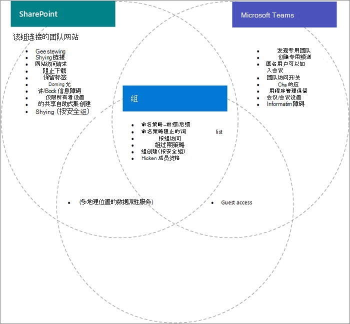

# Microsoft 365 组、Teams 和 SharePoint 之间的设置交互

Microsoft 365 Microsoft 365中的Microsoft 365组、Microsoft Teams 和 SharePoint 的一些设置（尤其是与共享和组/团队SharePoint网站创建相关）相互重叠。 本文提供了这些交互的说明，以及如何使用这些设置的最佳实践。

## 设置SharePoint组和团队的影响

|SharePoint设置|说明|对组Microsoft 365的影响Teams|建议|
|:-----------------|:----------|:---------------------------------------|:-------------|
|组织和网站的外部共享|确定是否可以与组织外部人员共享网站、文件和文件夹。|如果SharePoint、组和Teams设置不匹配，团队中的来宾可能会被阻止访问网站，或者可能会发生意外的外部访问。|更改共享设置时，请检查组设置Teams组设置，SharePoint组连接的团队网站的网站设置。   请参阅 [与团队中的来宾协作](./collaborate-as-team.md)|
|域允许/阻止|允许或阻止与指定域共享内容。|组和Teams无法识别SharePoint列表或阻止列表。 域中的用户不允许SharePoint可以通过团队SharePoint访问网站或内容。|管理 Azure AD 的域允许/阻止列表SharePoint一起。 创建组织范围的管理流程以允许和阻止域。  请参阅[SharePoint域设置和](/sharepoint/restricted-domains-sharing)Azure [AD 域设置](/azure/active-directory/b2b/allow-deny-list)|
|仅允许特定安全组中的用户在外部共享|指定可在外部共享SharePoint网站、文件夹和文件的安全组。|此设置不会阻止团队所有者在外部共享团队。 团队来宾有权访问关联的SharePoint网站。||
|SharePoint网站共享设置|确定谁可以直接在团队成员身份之外共享网站。 这由团队或网站所有者配置。|此设置不会直接影响团队，但可以允许用户添加到网站，并且无法访问团队本身或其他Teams资源|请考虑使用此设置来限制直接共享网站并通过团队管理网站访问。|
|让用户从网站起始页SharePoint网站OneDrive|指定用户能否创建新的SharePoint网站。|如果关闭此设置，用户仍可通过创建团队来创建与组连接的团队网站。||

## 组设置对团队的影响

|Microsoft 365组设置|说明|对Teams|建议|
|:---------------------------|:----------|:--------------|:-------------|
|命名策略|为组创建指定组名称前缀和后缀以及阻止的词语|为创建团队的用户强制执行策略。||
|组来宾访问|指定能否将组织外部人员添加到组。|如果组或Teams来宾共享设置关闭，则团队无法与来宾共享。|更改来宾共享设置时，请检查Teams组和SharePoint共享网站的设置。   请参阅 [与团队中的来宾协作](./collaborate-as-team.md)|
|按安全组创建组|组只能由特定安全组的成员创建。|不是安全组的成员的用户将无法创建团队。|请确保请求组的过程包括请求团队或网站SharePoint说明。|
|组过期策略|指定一个时间段，在此时间段之后，将自动删除未主动使用的组。|删除组后，还将删除与SharePoint关联的团队。 保留受保留策略保护的内容。|使用过期策略以避免出现未使用的团队、组和网站。|

## 相关主题

[协作治理规划分步规划](collaboration-governance-overview.md#collaboration-governance-planning-step-by-step)

[创建协作管理计划](collaboration-governance-first.md)

[与组织外部人员进行协作](./collaborate-with-people-outside-your-organization.md)

[管理 SharePoint 中的网站创建](/sharepoint/manage-site-creation)